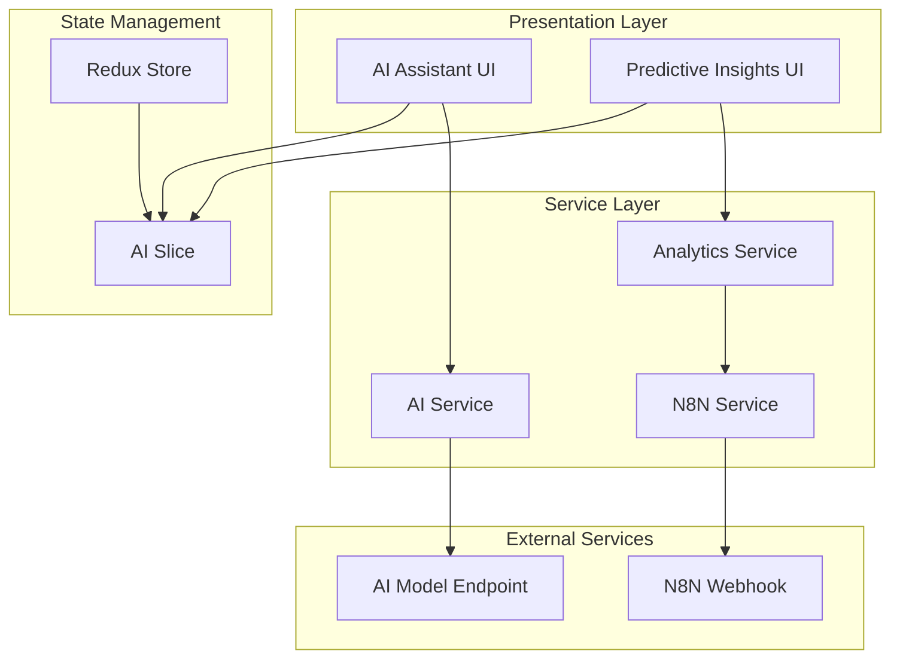
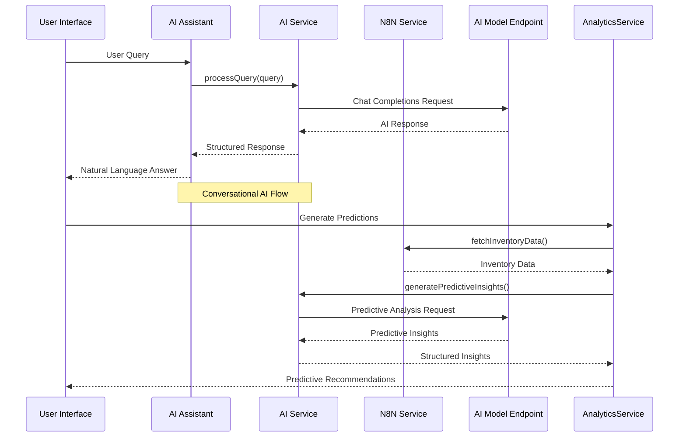
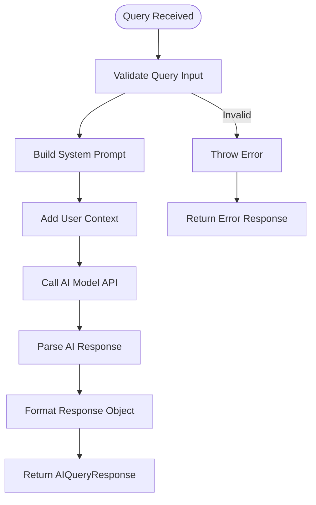
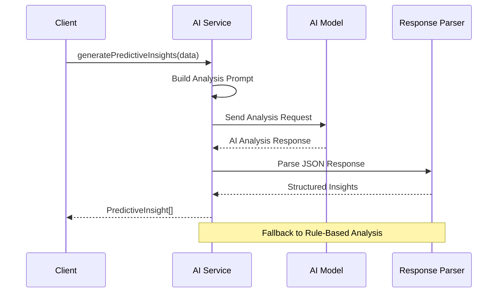
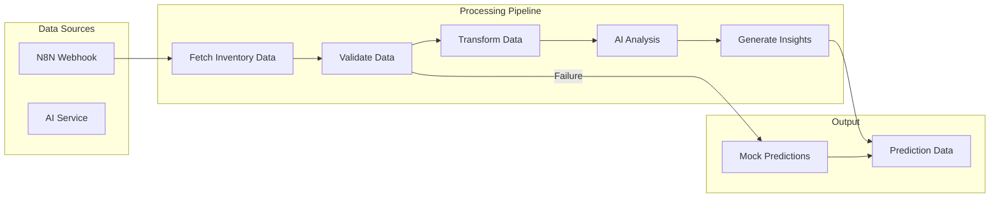
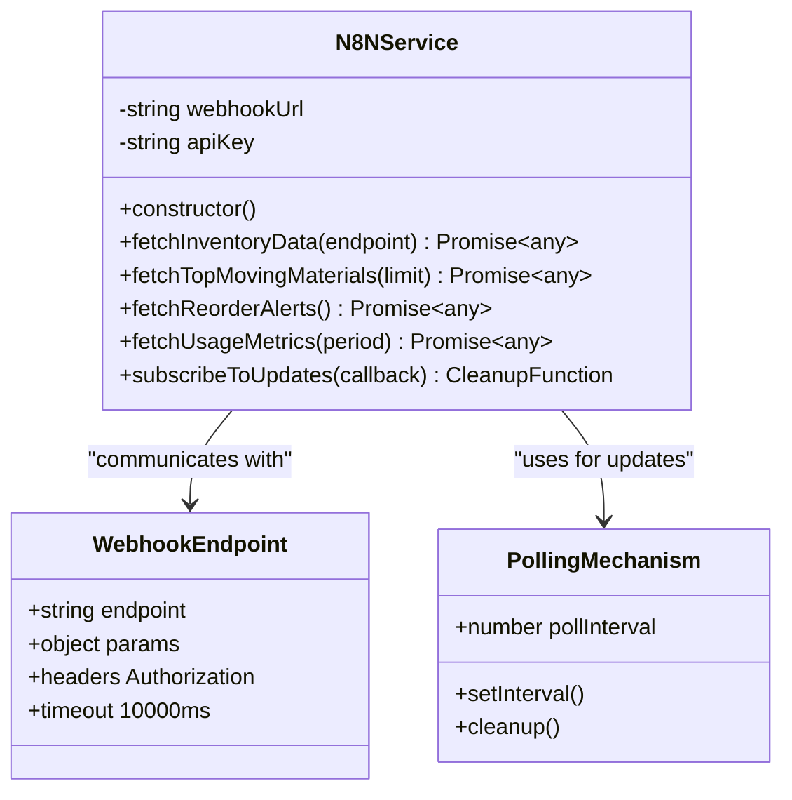
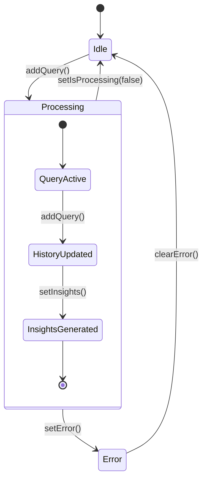
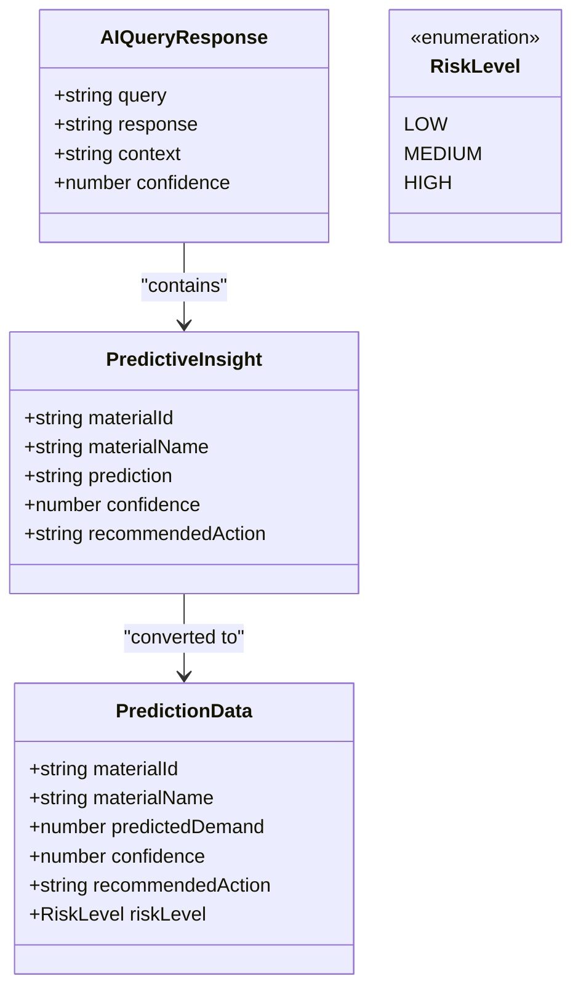
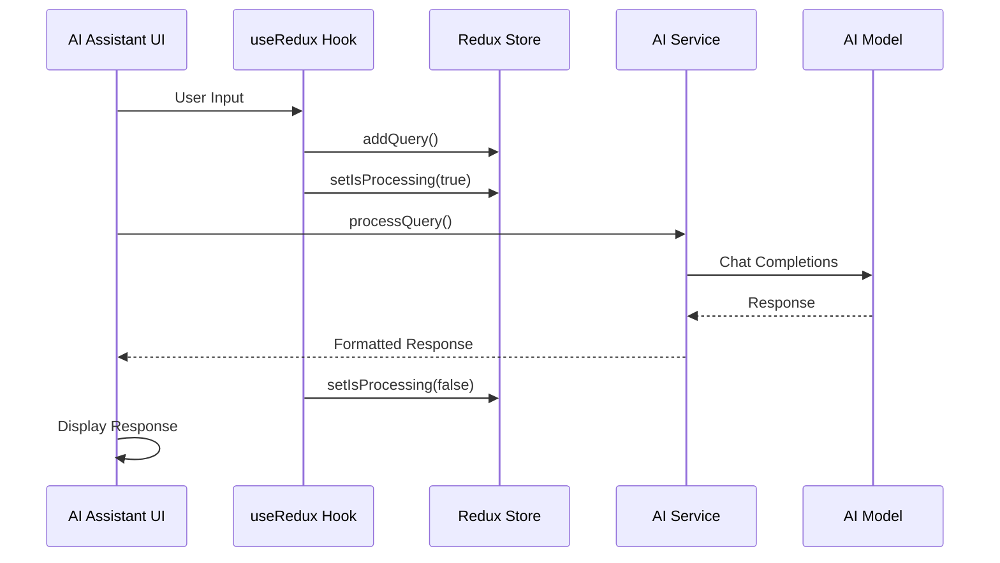
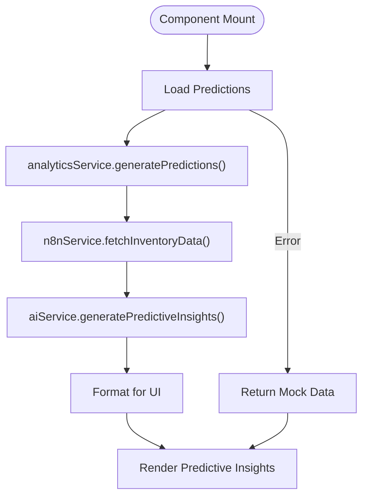

# AI Service Integration

<cite>
**Referenced Files in This Document**
- [aiService.ts](file://src/services/aiService.ts)
- [analyticsService.ts](file://src/services/analyticsService.ts)
- [n8nService.ts](file://src/services/n8nService.ts)
- [aiSlice.ts](file://src/store/slices/aiSlice.ts)
- [store.ts](file://src/store/store.ts)
- [AIAssistant.tsx](file://src/components/ai/AIAssistant.tsx)
- [PredictiveInsight.tsx](file://src/components/ai/PredictiveInsight.tsx)
- [page.tsx](file://src/app/ai-assistant/page.tsx)
- [useRedux.ts](file://src/hooks/useRedux.ts)
- [package.json](file://package.json)
</cite>

## Table of Contents
1. [Introduction](#introduction)
2. [Project Structure](#project-structure)
3. [Core Components](#core-components)
4. [Architecture Overview](#architecture-overview)
5. [Detailed Component Analysis](#detailed-component-analysis)
6. [API Definitions](#api-definitions)
7. [Data Models and Schemas](#data-models-and-schemas)
8. [Integration Patterns](#integration-patterns)
9. [Performance Considerations](#performance-considerations)
10. [Troubleshooting Guide](#troubleshooting-guide)
11. [Conclusion](#conclusion)

## Introduction
This document provides comprehensive API documentation for the AI service integration layer of the Skytek Labs Dashboard AI platform. The system integrates conversational AI capabilities with predictive analytics to deliver intelligent inventory management insights. The architecture combines a dedicated AI model service (Qwen) with an analytics pipeline that processes inventory data through machine learning algorithms.

The AI integration layer consists of three primary components: a natural language processing service for conversational AI, a predictive analytics engine for demand forecasting, and a state management system that coordinates AI interactions with the user interface. The system supports real-time query processing, automated report generation, and anomaly detection capabilities.

## Project Structure
The AI service integration follows a modular architecture with clear separation of concerns:



**Diagram sources**
- [AIAssistant.tsx:1-120](file://src/components/ai/AIAssistant.tsx#L1-L120)
- [PredictiveInsight.tsx:1-152](file://src/components/ai/PredictiveInsight.tsx#L1-L152)
- [aiService.ts:18-219](file://src/services/aiService.ts#L18-L219)
- [analyticsService.ts:13-134](file://src/services/analyticsService.ts#L13-L134)
- [n8nService.ts:16-109](file://src/services/n8nService.ts#L16-L109)

**Section sources**
- [package.json:1-39](file://package.json#L1-L39)
- [store.ts:1-27](file://src/store/store.ts#L1-L27)

## Core Components
The AI service integration layer comprises several interconnected components that work together to provide intelligent inventory management capabilities:

### AI Service Layer
The AI Service provides natural language processing capabilities and predictive analytics through a dedicated AI model endpoint. It supports conversational queries, automated report generation, and anomaly detection.

### Analytics Service Layer
The Analytics Service orchestrates data processing workflows, combining inventory data from external sources with AI-powered insights to generate predictive recommendations.

### N8N Integration Service
The N8N Service acts as a bridge to external data sources, providing inventory data through webhooks and maintaining real-time synchronization.

### State Management Integration
The Redux-based state management system coordinates AI interactions, maintaining query history, processing states, and AI-generated insights across the application.

**Section sources**
- [aiService.ts:18-219](file://src/services/aiService.ts#L18-L219)
- [analyticsService.ts:13-134](file://src/services/analyticsService.ts#L13-L134)
- [n8nService.ts:16-109](file://src/services/n8nService.ts#L16-L109)
- [aiSlice.ts:1-56](file://src/store/slices/aiSlice.ts#L1-L56)

## Architecture Overview
The AI service integration follows a layered architecture pattern with clear separation between presentation, service, and data access layers:



**Diagram sources**
- [AIAssistant.tsx:29-46](file://src/components/ai/AIAssistant.tsx#L29-L46)
- [aiService.ts:33-74](file://src/services/aiService.ts#L33-L74)
- [analyticsService.ts:17-41](file://src/services/analyticsService.ts#L17-L41)
- [n8nService.ts:29-51](file://src/services/n8nService.ts#L29-L51)

The architecture implements several key design patterns:

1. **Service Layer Pattern**: Each major functionality area has its own service class with well-defined responsibilities
2. **Repository Pattern**: Data access is abstracted through service interfaces
3. **Observer Pattern**: Real-time data updates through polling mechanisms
4. **Strategy Pattern**: Multiple fallback strategies for error handling and degraded functionality

## Detailed Component Analysis

### AI Service Component
The AI Service provides comprehensive natural language processing and predictive analytics capabilities through a dedicated AI model endpoint.

#### Core Methods and Responsibilities

**Natural Language Query Processing**
The service processes user queries through a structured workflow that includes system prompts, user context, and response formatting:



**Diagram sources**
- [aiService.ts:33-74](file://src/services/aiService.ts#L33-L74)

**Predictive Insight Generation**
The service generates machine learning-powered insights through structured analysis workflows:



**Diagram sources**
- [aiService.ts:79-109](file://src/services/aiService.ts#L79-L109)

**Error Handling and Fallback Strategies**
The service implements comprehensive error handling with multiple fallback mechanisms:

1. **AI Model Failure**: Automatic fallback to rule-based analysis
2. **Network Errors**: Graceful degradation with cached or default responses
3. **Parsing Failures**: Robust JSON parsing with fallback to structured defaults

**Section sources**
- [aiService.ts:18-219](file://src/services/aiService.ts#L18-L219)

### Analytics Service Component
The Analytics Service orchestrates complex data processing workflows, combining multiple data sources with AI-powered insights.

#### Data Processing Pipeline
The service implements a sophisticated pipeline for generating predictive insights:



**Diagram sources**
- [analyticsService.ts:17-41](file://src/services/analyticsService.ts#L17-L41)

**Prediction Generation Workflow**
The analytics service transforms AI insights into user-friendly prediction data:

1. **Data Collection**: Fetch inventory data from N8N webhook
2. **Validation**: Verify data integrity and completeness
3. **Transformation**: Convert raw data to analysis-ready format
4. **Analysis**: Apply AI-powered predictive modeling
5. **Formatting**: Structure results for UI consumption

**Section sources**
- [analyticsService.ts:13-134](file://src/services/analyticsService.ts#L13-L134)

### N8N Integration Service
The N8N Service provides seamless integration with external data sources through webhook connections.

#### Webhook Communication Pattern
The service implements a robust webhook communication system:



**Diagram sources**
- [n8nService.ts:16-109](file://src/services/n8nService.ts#L16-L109)

**Real-time Data Synchronization**
The service maintains real-time data synchronization through configurable polling intervals:

1. **Initial Data Load**: Immediate fetch of current inventory state
2. **Periodic Updates**: Configurable polling every 30 seconds
3. **Error Resilience**: Graceful handling of network failures
4. **Resource Management**: Proper cleanup of polling intervals

**Section sources**
- [n8nService.ts:16-109](file://src/services/n8nService.ts#L16-L109)

### State Management Integration
The Redux-based state management system coordinates AI interactions across the application.

#### AI State Management
The AI slice manages conversational AI state with comprehensive tracking capabilities:



**Diagram sources**
- [aiSlice.ts:17-56](file://src/store/slices/aiSlice.ts#L17-L56)

**State Synchronization Patterns**
The state management system implements several synchronization patterns:

1. **Action Dispatching**: Centralized state updates through Redux actions
2. **Selector Integration**: Type-safe state access through React hooks
3. **UI State Coordination**: Real-time UI updates based on AI processing status
4. **Error State Management**: Comprehensive error tracking and user notification

**Section sources**
- [aiSlice.ts:1-56](file://src/store/slices/aiSlice.ts#L1-56)
- [useRedux.ts:1-6](file://src/hooks/useRedux.ts#L1-L6)

## API Definitions

### AI Service Endpoints

#### Natural Language Query Processing
**Endpoint**: `/chat/completions`
**Method**: `POST`
**Description**: Processes natural language queries using the configured AI model

**Request Headers**:
- `Authorization: Bearer {API_KEY}`
- `Content-Type: application/json`

**Request Body**:
```json
{
  "model": "string",
  "messages": [
    {
      "role": "system",
      "content": "string"
    },
    {
      "role": "user", 
      "content": "string"
    }
  ],
  "temperature": number,
  "max_tokens": number
}
```

**Response Body**:
```json
{
  "query": "string",
  "response": "string",
  "context": "string",
  "confidence": number
}
```

#### Predictive Insight Generation
**Endpoint**: `/chat/completions` *(same endpoint)*
**Method**: `POST`
**Description**: Generates predictive insights from inventory data

**Request Body**:
```json
{
  "model": "string",
  "messages": [
    {
      "role": "system",
      "content": "string"
    },
    {
      "role": "user",
      "content": "string"
    }
  ]
}
```

**Response Body**:
```json
[
  {
    "materialId": "string",
    "materialName": "string", 
    "prediction": "string",
    "confidence": number,
    "recommendedAction": "string"
  }
]
```

### Analytics Service Endpoints

#### Inventory Data Retrieval
**Endpoint**: `/api/inventory/{endpoint}`
**Method**: `GET`
**Description**: Retrieves inventory data from N8N webhook

**Request Headers**:
- `Authorization: Bearer {N8N_API_KEY}`
- `Content-Type: application/json`

**Available Endpoints**:
- `/api/inventory/top-moving` - Top moving materials
- `/api/inventory/reorder-alerts` - Reorder alerts
- `/api/inventory/usage-metrics` - Usage metrics
- `/api/inventory/stock-overview` - Stock overview

**Section sources**
- [aiService.ts:43-60](file://src/services/aiService.ts#L43-L60)
- [n8nService.ts:29-51](file://src/services/n8nService.ts#L29-L51)

## Data Models and Schemas

### AI Query Response Schema
The AI service returns standardized response objects for all query types:



**Diagram sources**
- [aiService.ts:3-16](file://src/services/aiService.ts#L3-L16)
- [analyticsService.ts:4-11](file://src/services/analyticsService.ts#L4-L11)

### State Management Models
The Redux state management system tracks AI-related state with comprehensive typing:

**AI State Interface**:
```typescript
interface AIState {
  queryHistory: string[];
  insights: any[];
  isProcessing: boolean;
  currentQuery: string;
}
```

**State Actions**:
- `addQuery(query: string)` - Adds query to history
- `setInsights(insights: any[])` - Sets AI-generated insights
- `setIsProcessing(status: boolean)` - Updates processing state
- `setCurrentQuery(query: string)` - Sets current query
- `clearHistory()` - Clears query history

**Section sources**
- [aiService.ts:3-16](file://src/services/aiService.ts#L3-L16)
- [aiSlice.ts:3-15](file://src/store/slices/aiSlice.ts#L3-L15)

## Integration Patterns

### Conversational AI Integration
The AI assistant component demonstrates comprehensive integration patterns:



**Diagram sources**
- [AIAssistant.tsx:29-46](file://src/components/ai/AIAssistant.tsx#L29-L46)
- [aiSlice.ts:24-35](file://src/store/slices/aiSlice.ts#L24-L35)

### Predictive Analytics Integration
The predictive insights component showcases data flow integration:



**Diagram sources**
- [PredictiveInsight.tsx:33-46](file://src/components/ai/PredictiveInsight.tsx#L33-L46)
- [analyticsService.ts:17-41](file://src/services/analyticsService.ts#L17-L41)

### State Management Integration
The integration with Redux state management follows established patterns:

1. **Typed Hooks**: Custom hooks provide type-safe state access
2. **Action Dispatching**: Centralized state updates through Redux actions
3. **Selector Usage**: Efficient state selection with memoization
4. **Error Propagation**: Comprehensive error handling and user feedback

**Section sources**
- [useRedux.ts:1-6](file://src/hooks/useRedux.ts#L1-L6)
- [store.ts:1-27](file://src/store/store.ts#L1-L27)

## Performance Considerations

### API Response Optimization
The AI service implements several performance optimization strategies:

1. **Request Timeout Management**: 10-second timeout for webhook requests
2. **Response Caching**: Intelligent caching of frequently accessed data
3. **Error Recovery**: Graceful degradation with fallback mechanisms
4. **Resource Cleanup**: Proper cleanup of polling intervals and network connections

### Memory Management
The system implements memory-efficient patterns:

1. **Object Pooling**: Reuse of response objects where possible
2. **Lazy Loading**: On-demand loading of predictive insights
3. **Garbage Collection**: Proper cleanup of event listeners and intervals
4. **State Optimization**: Minimal state updates to reduce re-renders

### Network Efficiency
Network optimization strategies include:

1. **Connection Reuse**: Persistent connections to minimize overhead
2. **Batch Requests**: Combined requests where possible
3. **Compression**: Response compression for large datasets
4. **Retry Logic**: Intelligent retry with exponential backoff

## Troubleshooting Guide

### Common AI Integration Issues

#### Authentication Problems
**Symptoms**: 401 Unauthorized errors when calling AI model
**Causes**: Incorrect API key configuration or expired tokens
**Solutions**:
1. Verify `AI_API_KEY` environment variable is set
2. Check AI model endpoint accessibility
3. Validate API key permissions and expiration
4. Test API key independently using curl commands

#### Network Connectivity Issues
**Symptoms**: Timeout errors or connection refused messages
**Causes**: Network connectivity problems or firewall restrictions
**Solutions**:
1. Verify AI model endpoint URL is accessible
2. Check network connectivity to external services
3. Configure proxy settings if behind corporate firewall
4. Implement retry logic with exponential backoff

#### Data Processing Errors
**Symptoms**: Empty or malformed response from AI service
**Causes**: Invalid input data or AI model processing failures
**Solutions**:
1. Validate input data format and structure
2. Check AI model availability and capacity
3. Implement input sanitization and validation
4. Use fallback mechanisms for degraded functionality

#### State Management Issues
**Symptoms**: UI not updating or stale data display
**Causes**: Redux state synchronization problems
**Solutions**:
1. Verify Redux store configuration
2. Check action dispatching and state updates
3. Validate selector usage and memoization
4. Debug state transitions with Redux DevTools

### Debugging Techniques

#### Query Processing Debugging
1. **Console Logging**: Enable detailed logging for AI service calls
2. **Network Inspection**: Monitor API requests and responses
3. **State Inspection**: Use Redux DevTools to track state changes
4. **Error Boundaries**: Implement comprehensive error handling

#### Performance Monitoring
1. **Response Time Tracking**: Measure AI service response times
2. **Memory Usage**: Monitor memory consumption during AI processing
3. **Network Metrics**: Track API call frequency and success rates
4. **UI Responsiveness**: Monitor rendering performance with large datasets

#### Integration Testing
1. **Unit Tests**: Test individual service methods in isolation
2. **Integration Tests**: Verify end-to-end workflow functionality
3. **Mock Services**: Use mock implementations for external dependencies
4. **Load Testing**: Simulate high-volume AI query scenarios

**Section sources**
- [aiService.ts:70-74](file://src/services/aiService.ts#L70-L74)
- [n8nService.ts:42-51](file://src/services/n8nService.ts#L42-L51)
- [AIAssistant.tsx:40-45](file://src/components/ai/AIAssistant.tsx#L40-L45)

## Conclusion
The AI service integration layer provides a comprehensive foundation for intelligent inventory management through natural language processing, predictive analytics, and real-time data synchronization. The modular architecture ensures scalability, maintainability, and robust error handling while providing a seamless user experience.

Key strengths of the integration include:
- **Modular Design**: Clear separation of concerns across service layers
- **Robust Error Handling**: Comprehensive fallback mechanisms and graceful degradation
- **Real-time Integration**: Seamless data synchronization through webhook connections
- **Type Safety**: Comprehensive TypeScript integration with Redux state management
- **Performance Optimization**: Efficient resource utilization and network optimization

The system successfully bridges the gap between complex AI capabilities and intuitive user interfaces, enabling warehouse and production managers to make data-driven decisions through conversational AI interactions and automated insights generation.

Future enhancements could include advanced caching strategies, enhanced monitoring and observability, and expanded AI model integrations for specialized analytical capabilities.