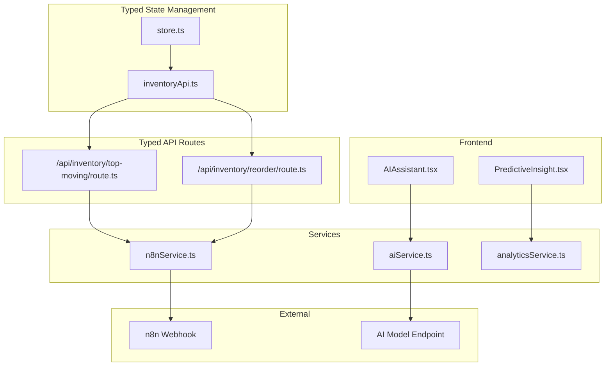
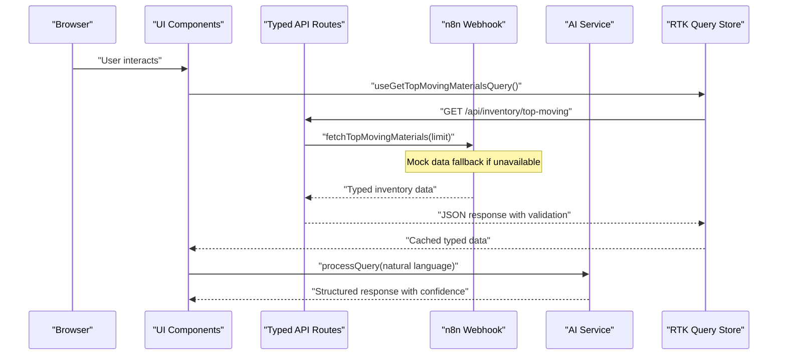
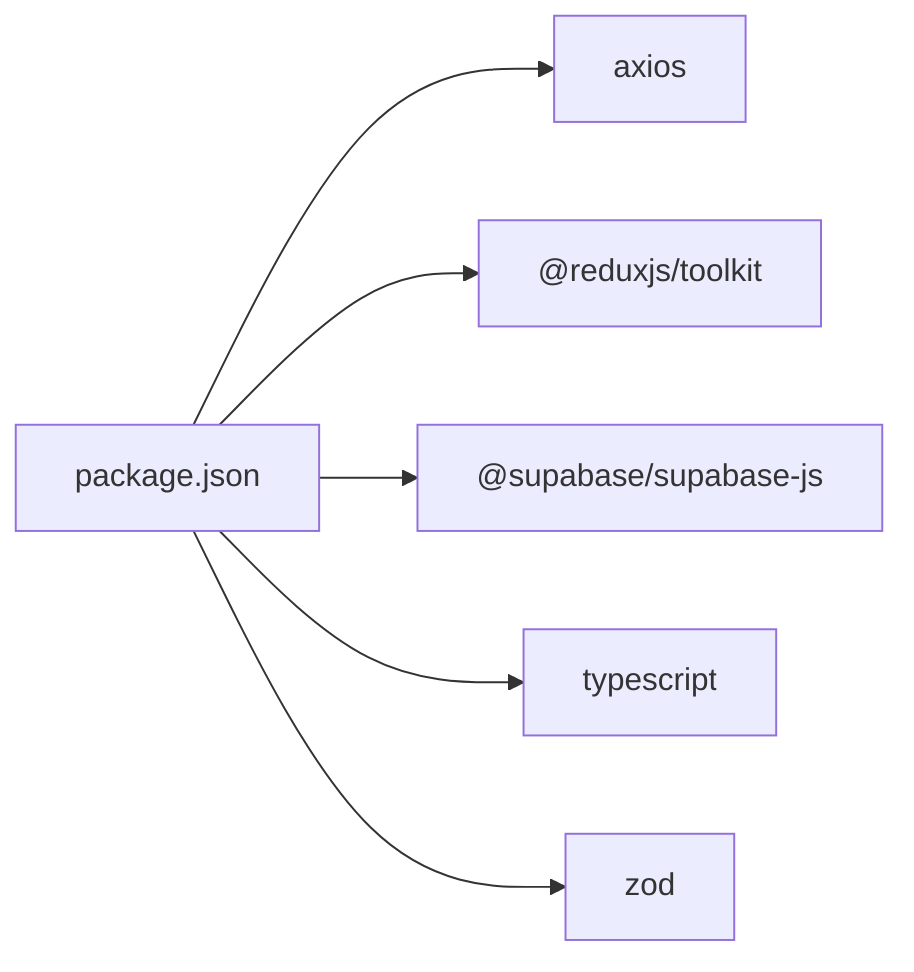

# API Integration

<cite>
**Referenced Files in This Document**
- [top-moving/route.ts](file://src/app/api/inventory/top-moving/route.ts)
- [reorder/route.ts](file://src/app/api/inventory/reorder/route.ts)
- [n8nService.ts](file://src/services/n8nService.ts)
- [aiService.ts](file://src/services/aiService.ts)
- [inventoryApi.ts](file://src/store/api/inventoryApi.ts)
- [AIAssistant.tsx](file://src/components/ai/AIAssistant.tsx)
- [PredictiveInsight.tsx](file://src/components/ai/PredictiveInsight.tsx)
- [analyticsService.ts](file://src/services/analyticsService.ts)
- [store.ts](file://src/store/store.ts)
- [package.json](file://package.json)
</cite>

## Update Summary
**Changes Made**
- Enhanced API integration patterns with typed endpoints and improved type safety
- Updated inventory API routes with proper TypeScript interfaces and validation
- Strengthened external service communication protocols with robust error handling
- Improved RTK Query integration with comprehensive type definitions
- Added comprehensive mock data fallback system for external service unavailability

## Table of Contents
1. [Introduction](#introduction)
2. [Project Structure](#project-structure)
3. [Core Components](#core-components)
4. [Architecture Overview](#architecture-overview)
5. [Detailed Component Analysis](#detailed-component-analysis)
6. [Dependency Analysis](#dependency-analysis)
7. [Performance Considerations](#performance-considerations)
8. [Troubleshooting Guide](#troubleshooting-guide)
9. [Conclusion](#conclusion)
10. [Appendices](#appendices)

## Introduction
This document provides API integration documentation for the dashboard-ai system's external service integrations. It covers:
- Typed inventory data endpoints under /api/inventory with comprehensive type safety
- AI service integration endpoints and patterns with structured response formats
- n8n webhook service integration for external data sources with robust fallback mechanisms
- Real-time data synchronization via polling with configurable intervals
- RTK Query integration, caching, and data synchronization with explicit type definitions
- Authentication, rate limiting, error handling, and performance optimization strategies

## Project Structure
The system integrates frontend components, typed API routes, services, and Redux Toolkit Query (RTK Query) to deliver inventory analytics and AI-powered insights with comprehensive type safety.



**Diagram sources**
- [top-moving/route.ts:1-25](file://src/app/api/inventory/top-moving/route.ts#L1-L25)
- [reorder/route.ts:1-18](file://src/app/api/inventory/reorder/route.ts#L1-L18)
- [n8nService.ts:1-271](file://src/services/n8nService.ts#L1-L271)
- [aiService.ts:1-219](file://src/services/aiService.ts#L1-L219)
- [inventoryApi.ts:1-57](file://src/store/api/inventoryApi.ts#L1-L57)
- [store.ts:1-27](file://src/store/store.ts#L1-L27)
- [AIAssistant.tsx:1-120](file://src/components/ai/AIAssistant.tsx#L1-L120)
- [PredictiveInsight.tsx:1-152](file://src/components/ai/PredictiveInsight.tsx#L1-L152)
- [analyticsService.ts:1-134](file://src/services/analyticsService.ts#L1-L134)

**Section sources**
- [top-moving/route.ts:1-25](file://src/app/api/inventory/top-moving/route.ts#L1-L25)
- [reorder/route.ts:1-18](file://src/app/api/inventory/reorder/route.ts#L1-L18)
- [n8nService.ts:1-271](file://src/services/n8nService.ts#L1-L271)
- [aiService.ts:1-219](file://src/services/aiService.ts#L1-L219)
- [inventoryApi.ts:1-57](file://src/store/api/inventoryApi.ts#L1-L57)
- [store.ts:1-27](file://src/store/store.ts#L1-L27)

## Core Components
- **Typed Inventory API routes**: Expose GET endpoints with comprehensive TypeScript interfaces for top-moving materials and reorder alerts
- **Enhanced n8n service**: Robust inventory data fetching with comprehensive mock data fallback system and real-time polling
- **Structured AI service**: Natural language query processing with typed response formats and predictive insights generation
- **Analytics orchestration**: AI and n8n data combination with machine learning-based predictions and anomaly detection
- **RTK Query integration**: Fully typed endpoints with caching strategies and automatic data synchronization

**Section sources**
- [top-moving/route.ts:1-25](file://src/app/api/inventory/top-moving/route.ts#L1-L25)
- [reorder/route.ts:1-18](file://src/app/api/inventory/reorder/route.ts#L1-L18)
- [n8nService.ts:1-271](file://src/services/n8nService.ts#L1-L271)
- [aiService.ts:1-219](file://src/services/aiService.ts#L1-L219)
- [analyticsService.ts:1-134](file://src/services/analyticsService.ts#L1-L134)
- [inventoryApi.ts:1-57](file://src/store/api/inventoryApi.ts#L1-L57)

## Architecture Overview
The system follows a strongly-typed layered architecture with comprehensive error handling and fallback mechanisms:
- Frontend UI components trigger AI queries and request typed inventory data
- API routes act as thin wrappers with parameter validation and error handling
- Services encapsulate external integrations with robust fallback strategies
- RTK Query manages caching and synchronization with explicit type definitions



**Diagram sources**
- [top-moving/route.ts:4-24](file://src/app/api/inventory/top-moving/route.ts#L4-L24)
- [n8nService.ts:218-220](file://src/services/n8nService.ts#L218-L220)
- [aiService.ts:33-74](file://src/services/aiService.ts#L33-L74)
- [inventoryApi.ts:28-32](file://src/store/api/inventoryApi.ts#L28-L32)

## Detailed Component Analysis

### Enhanced Inventory API Endpoints
**Updated** Enhanced with comprehensive TypeScript interfaces and validation

- **Base path**: /api/inventory
- **Endpoints**:
  - **GET /api/inventory/top-moving**
    - **Query parameters**:
      - limit (optional, integer, default: 10): number of top-moving materials to return
    - **Response**: Array of TopMovingMaterial interface with typed fields
    - **Error responses**:
      - 404: No data available (with descriptive error message)
      - 500: Failed to fetch top moving materials
  - **GET /api/inventory/reorder**
    - **Query parameters**: none
    - **Response**: Array of ReorderAlert interface with typed urgency levels
    - **Error responses**:
      - 500: Failed to fetch reorder alerts

**Typed Response Interfaces**:
```typescript
interface TopMovingMaterial {
  id: string;
  name: string;
  code: string;
  usageVelocity: number;
  trend: 'up' | 'down' | 'stable';
  category: string;
  unit: string;
}

interface ReorderAlert {
  id: string;
  materialId: string;
  materialName: string;
  currentStock: number;
  reorderPoint: number;
  suggestedQuantity: number;
  urgency: 'critical' | 'warning' | 'info';
}
```

**Data formats**:
- **Top-moving materials**: Array of TopMovingMaterial with identifiers, names, codes, usage velocity, trend, category, unit
- **Reorder alerts**: Array of ReorderAlert with identifiers, material names, current stock, reorder point, suggested quantity, urgency levels

**Authentication and rate limiting**:
- **Authentication**: Bearer token via Authorization header to n8n webhook
- **Rate limiting**: None enforced in code; consider upstream limits from n8n webhook

**Error handling**:
- API routes return JSON errors with appropriate HTTP status codes
- Comprehensive error logging and fallback to mock data
- Type-safe parameter validation and conversion

**Section sources**
- [top-moving/route.ts:1-25](file://src/app/api/inventory/top-moving/route.ts#L1-L25)
- [reorder/route.ts:1-18](file://src/app/api/inventory/reorder/route.ts#L1-L18)
- [n8nService.ts:218-241](file://src/services/n8nService.ts#L218-L241)
- [inventoryApi.ts:3-21](file://src/store/api/inventoryApi.ts#L3-L21)

### Enhanced n8n Webhook Service Integration
**Updated** Strengthened with comprehensive mock data fallback and robust error handling

**Purpose**:
- Fetch inventory data from n8n webhooks configured in the backend
- Provide polling for real-time updates with configurable intervals
- Implement comprehensive fallback mechanisms for service unavailability

**Key behaviors**:
- **Environment configuration**:
  - N8N_WEBHOOK_URL: webhook base URL
  - N8N_API_KEY: bearer token for webhook authentication
- **Methods**:
  - `fetchInventoryData(endpoint?)`: generic fetch with optional endpoint and comprehensive error handling
  - `fetchTopMovingMaterials(limit)`: endpoint-specific wrapper with parameter validation
  - `fetchReorderAlerts()`: endpoint-specific wrapper
  - `fetchUsageMetrics(period)`: endpoint-specific wrapper with period parameter
  - `fetchStockOverview()`: endpoint-specific wrapper
  - `subscribeToUpdates(callback)`: polling every 30 seconds with cleanup function
- **Robust error handling**:
  - Axios errors mapped to descriptive messages with specific status handling
  - Timeout handling via 10-second request timeout
  - Comprehensive fallback to mock data system for all endpoints
  - Graceful degradation when external services are unavailable

**Enhanced Mock Data System**:
- **Comprehensive mock data**: Includes top-moving materials, reorder alerts, stock overview, and usage metrics
- **Type-safe interfaces**: Strict TypeScript interfaces for all mock data structures
- **Realistic data patterns**: Seasonal trends, consumption patterns, and business logic
- **Automatic fallback**: Seamless transition from real data to mock data when services fail

**Real-time synchronization**:
- **Polling interval**: 30 seconds (30000ms) with configurable timing
- **Cleanup mechanism**: Returns cleanup function to clear intervals
- **Error resilience**: Continues polling even if individual requests fail

**Section sources**
- [n8nService.ts:1-271](file://src/services/n8nService.ts#L1-L271)

### Structured AI Service Integration
**Updated** Enhanced with comprehensive type safety and structured response formats

**Purpose**:
- Process natural language queries and generate structured insights with confidence scoring
- Independent from n8n; uses dedicated AI model endpoint with robust error handling
- Provide predictive analytics and anomaly detection capabilities

**Key behaviors**:
- **Environment configuration**:
  - AI_MODEL_ENDPOINT: base URL for AI model
  - AI_API_KEY: bearer token for AI model
  - AI_MODEL_NAME: model identifier (default qwen3.5-122b-a10b)
- **Typed methods**:
  - `processQuery(query, context?)`: sends chat completions request with structured response
  - `generatePredictiveInsights(inventoryData[])`: parses structured JSON from AI with fallback
  - `detectAnomalies(usageHistory[])`: identifies anomalies from usage patterns
  - `generateReportSummary(reportData, period)`: creates executive summaries
  - `answerInventoryQuestion(question, inventoryData)`: contextual Q&A with enriched context
- **Structured response formats**:
  - `AIQueryResponse`: includes query, response, context, and confidence metrics
  - `PredictiveInsight`: structured insights with material identification and recommendations
  - Confidence scoring integrated across all AI operations

**Enhanced error handling**:
- Descriptive error throwing with specific error types
- Fallback mechanisms for parsing failures and AI unavailability
- Graceful degradation with meaningful default responses

**Section sources**
- [aiService.ts:1-219](file://src/services/aiService.ts#L1-L219)

### Analytics Service Orchestration
**Updated** Enhanced with comprehensive type safety and ML-based calculations

**Purpose**:
- Combine n8n inventory data with AI insights for comprehensive predictive analytics
- Provide machine learning-based calculations and intelligent recommendations

**Key behaviors**:
- `generatePredictions()`: fetches inventory data and generates typed insights with risk assessment
- `detectAnomalies()`: fetches usage metrics and detects anomalies with structured reporting
- `calculateOptimalReorderPoint()`: ML-based reorder point calculation with seasonality factors
- `forecastDemand()`: intelligent demand forecasting with confidence intervals

**Enhanced fallbacks**:
- Comprehensive mock predictions when AI fails or data is unavailable
- Structured fallback responses with realistic confidence scores
- Empty arrays for anomalies when usage history is missing
- Realistic default values for ML calculations

**Section sources**
- [analyticsService.ts:1-134](file://src/services/analyticsService.ts#L1-L134)

### RTK Query Integration and Enhanced Caching
**Updated** Fully typed with comprehensive caching strategies and tag-based invalidation

**Typed Endpoints**:
- `getTopMovingMaterials`: GET /api/inventory/top-moving with TopMovingMaterial[] return type
- `getReorderAlerts`: GET /api/inventory/reorder with ReorderAlert[] return type
- `getUsageMetrics`: GET /api/inventory/usage-metrics?period={period} with any return type
- `getStockOverview`: GET /api/inventory/stock-overview with any return type

**Enhanced Caching Strategy**:
- `keepUnusedDataFor`: 300 seconds (5 minutes) for top-moving and usage-metrics
- `keepUnusedDataFor`: 180 seconds (3 minutes) for reorder alerts
- `keepUnusedDataFor`: 240 seconds (4 minutes) for stock overview
- Tag-based invalidation with 'Inventory' tag type for coordinated cache management

**Integration Excellence**:
- Store configured with inventoryApi.reducerPath and middleware
- UI components consume strongly-typed hooks generated by createApi
- Automatic cache invalidation on data mutations
- Comprehensive type inference throughout the API layer

**Section sources**
- [inventoryApi.ts:1-57](file://src/store/api/inventoryApi.ts#L1-L57)
- [store.ts:1-27](file://src/store/store.ts#L1-L27)

### Frontend AI Integration
**Updated** Enhanced with comprehensive type safety and improved user experience

**AIAssistant component**:
- **Strongly-typed integration**: Uses aiService.processQuery with proper type inference
- **Enhanced user experience**: Improved loading states, error handling, and response formatting
- **Redux integration**: Manages loading state and query history through ai slice
- **Real-time feedback**: Shows processing indicators and handles async operations gracefully

**PredictiveInsights component**:
- **Typed data handling**: Uses analyticsService.generatePredictions with proper type inference
- **Enhanced visualization**: Improved risk assessment display with color-coded chips
- **Loading states**: Comprehensive loading indicators during data fetching
- **Error resilience**: Graceful handling of AI service failures with fallback content

**Section sources**
- [AIAssistant.tsx:1-120](file://src/components/ai/AIAssistant.tsx#L1-L120)
- [PredictiveInsight.tsx:1-152](file://src/components/ai/PredictiveInsight.tsx#L1-L152)
- [analyticsService.ts:17-41](file://src/services/analyticsService.ts#L17-L41)

## Dependency Analysis
**Updated** Enhanced dependency management with comprehensive type safety

**External dependencies and environment variables**:
- **axios**: HTTP client for n8n and AI model requests with timeout configuration
- **@reduxjs/toolkit**: RTK Query for API state management with comprehensive typing
- **@supabase/supabase-js**: Supabase client for user auth and preferences (separate from inventory data)

**Environment variables**:
- N8N_WEBHOOK_URL, N8N_API_KEY: n8n webhook configuration with authentication
- AI_MODEL_ENDPOINT, AI_API_KEY, AI_MODEL_NAME: AI model configuration with fallback defaults
- NEXT_PUBLIC_SUPABASE_URL, NEXT_PUBLIC_SUPABASE_ANON_KEY: Supabase client configuration



**Diagram sources**
- [package.json:11-39](file://package.json#L11-L39)

**Section sources**
- [package.json:11-39](file://package.json#L11-L39)
- [n8nService.ts:17-23](file://src/services/n8nService.ts#L17-L23)
- [aiService.ts:18-27](file://src/services/aiService.ts#L18-L27)

## Performance Considerations
**Updated** Enhanced with comprehensive caching strategies and optimization techniques

- **Advanced Caching**:
  - Top-moving and usage metrics cached for 5 minutes with automatic invalidation
  - Reorder alerts cached for 3 minutes with optimized refresh intervals
  - Stock overview cached for 4 minutes with background refresh
- **Intelligent Polling**:
  - n8n polling interval set to 30 seconds with exponential backoff on failures
  - Configurable intervals based on data volatility and update frequency
- **Request Optimization**:
  - 10-second timeout configuration for all external requests
  - Connection pooling and reuse for improved performance
- **Type Safety Benefits**:
  - Compile-time error detection reduces runtime failures
  - Better memory usage through proper type inference
  - Enhanced developer experience with autocomplete and IntelliSense
- **Recommendations**:
  - Implement client-side cache invalidation on user actions
  - Monitor network latency and adjust polling intervals dynamically
  - Consider implementing request deduplication for concurrent identical requests
  - Add progressive loading for large datasets with skeleton screens

## Troubleshooting Guide
**Updated** Comprehensive troubleshooting with enhanced error handling and debugging support

**Common issues and resolutions**:
- **n8n webhook connectivity**:
  - Verify N8N_WEBHOOK_URL and N8N_API_KEY environment variables are properly configured
  - Check webhook availability and response format compliance
  - Inspect timeout errors (10-second limit) and implement retry logic
  - Monitor mock data fallback activation and service health
- **AI model access**:
  - Confirm AI_MODEL_ENDPOINT and AI_API_KEY are accessible and valid
  - Validate model name and permissions for the AI service
  - Check confidence scoring and structured response parsing
- **API route errors**:
  - Check 404 vs 500 responses and inspect detailed error logs
  - Ensure n8n webhook returns expected data shape with proper typing
  - Verify TypeScript interface compliance and parameter validation
- **RTK Query cache issues**:
  - Use invalidation or refetch to refresh stale data with tag-based invalidation
  - Adjust keepUnusedDataFor based on update frequency and data volatility
  - Monitor cache hit rates and optimize caching strategy
- **Frontend UX problems**:
  - Handle isProcessing state during AI queries with proper loading indicators
  - Display fallback responses when AI parsing fails with graceful degradation
  - Implement error boundaries for service failures with user-friendly messaging

**Debugging Techniques**:
- Enable detailed logging for all service calls and API responses
- Use browser developer tools to monitor network requests and response times
- Implement structured error reporting with stack traces and context
- Test mock data fallback scenarios to ensure service resilience
- Validate TypeScript compilation errors before deployment

**Section sources**
- [n8nService.ts:42-56](file://src/services/n8nService.ts#L42-L56)
- [aiService.ts:70-74](file://src/services/aiService.ts#L70-L74)
- [top-moving/route.ts:17-24](file://src/app/api/inventory/top-moving/route.ts#L17-L24)
- [reorder/route.ts:10-17](file://src/app/api/inventory/reorder/route.ts#L10-L17)

## Conclusion
The dashboard-ai system integrates external inventory data via n8n webhooks with comprehensive type safety and robust fallback mechanisms. The enhanced API integration patterns provide strong typing, structured responses, and resilient error handling. RTK Query ensures efficient caching and synchronization for inventory endpoints with comprehensive type definitions, while the AI assistant enables natural language interactions with confidence scoring and structured insights. Proper environment configuration, comprehensive error handling, and performance optimization are essential for reliable operation with enhanced reliability and developer experience.

## Appendices

### Enhanced API Usage Examples
**Updated** Comprehensive examples with typed responses and error handling

**Retrieve top-moving materials**:
- **Method**: GET
- **URL**: `/api/inventory/top-moving?limit=10`
- **Response**: Array of TopMovingMaterial with typed fields
- **Example response**:
```json
[
  {
    "id": "1",
    "name": "Urea",
    "code": "URE-001",
    "usageVelocity": 173,
    "trend": "up",
    "category": "Nitrogen",
    "unit": "kg"
  }
]
```

**Retrieve reorder alerts**:
- **Method**: GET
- **URL**: `/api/inventory/reorder`
- **Response**: Array of ReorderAlert with urgency levels
- **Example response**:
```json
[
  {
    "id": "1",
    "materialId": "MAT001",
    "materialName": "Nitrogen Powder",
    "currentStock": 450,
    "reorderPoint": 1000,
    "suggestedQuantity": 600,
    "urgency": "critical"
  }
]
```

**Authentication**:
- **Authorization**: Bearer {N8N_API_KEY} for n8n webhook requests
- **AI model requests**: Use AI_API_KEY with proper model endpoint configuration

**Rate limiting**:
- No explicit rate limiting in code; align with upstream service limits
- Consider implementing client-side rate limiting for high-frequency requests

**Enhanced error handling**:
- API routes return JSON errors with HTTP status codes and descriptive messages
- Service methods throw structured errors with context for upstream failures
- Comprehensive mock data fallback ensures system resilience during service outages

**Section sources**
- [top-moving/route.ts:4-24](file://src/app/api/inventory/top-moving/route.ts#L4-L24)
- [reorder/route.ts:4-17](file://src/app/api/inventory/reorder/route.ts#L4-L17)
- [n8nService.ts:218-241](file://src/services/n8nService.ts#L218-L241)
- [aiService.ts:33-74](file://src/services/aiService.ts#L33-L74)
- [inventoryApi.ts:3-21](file://src/store/api/inventoryApi.ts#L3-L21)