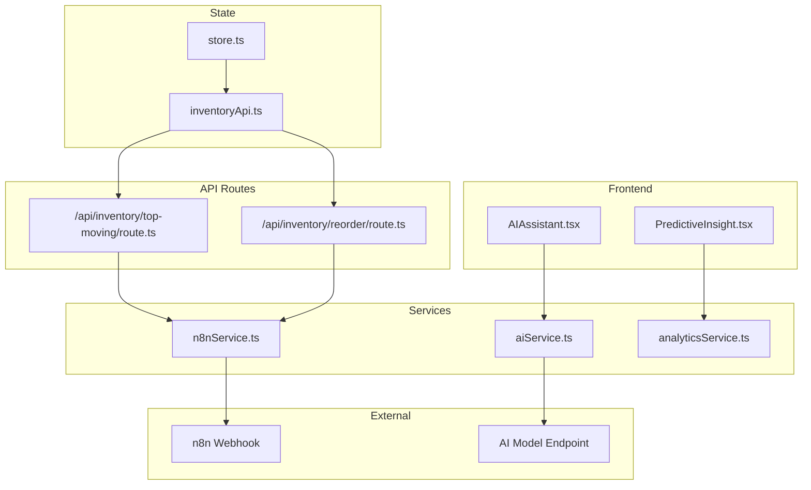
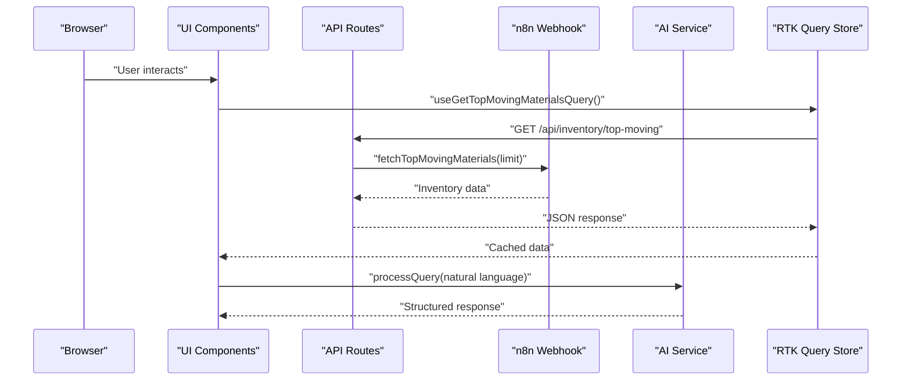
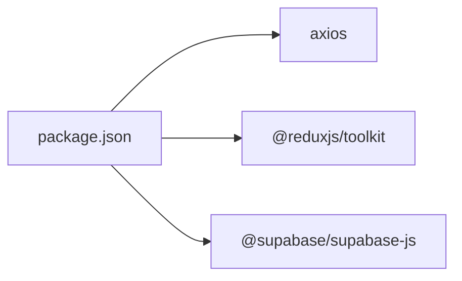

# API Integration

<cite>
**Referenced Files in This Document**
- [top-moving/route.ts](file://src/app/api/inventory/top-moving/route.ts)
- [reorder/route.ts](file://src/app/api/inventory/reorder/route.ts)
- [n8nService.ts](file://src/services/n8nService.ts)
- [aiService.ts](file://src/services/aiService.ts)
- [inventoryApi.ts](file://src/store/api/inventoryApi.ts)
- [AIAssistant.tsx](file://src/components/ai/AIAssistant.tsx)
- [PredictiveInsight.tsx](file://src/components/ai/PredictiveInsight.tsx)
- [analyticsService.ts](file://src/services/analyticsService.ts)
- [supabase.ts](file://src/lib/supabase.ts)
- [store.ts](file://src/store/store.ts)
- [package.json](file://package.json)
</cite>

## Table of Contents
1. [Introduction](#introduction)
2. [Project Structure](#project-structure)
3. [Core Components](#core-components)
4. [Architecture Overview](#architecture-overview)
5. [Detailed Component Analysis](#detailed-component-analysis)
6. [Dependency Analysis](#dependency-analysis)
7. [Performance Considerations](#performance-considerations)
8. [Troubleshooting Guide](#troubleshooting-guide)
9. [Conclusion](#conclusion)
10. [Appendices](#appendices)

## Introduction
This document provides API integration documentation for the dashboard-ai system’s external service integrations. It covers:
- Inventory data endpoints under /api/inventory
- AI service integration endpoints and patterns
- n8n webhook service integration for external data sources
- Real-time data synchronization via polling
- RTK Query integration, caching, and data synchronization
- Authentication, rate limiting, error handling, and performance optimization

## Project Structure
The system integrates frontend components, API routes, services, and Redux Toolkit Query (RTK Query) to deliver inventory analytics and AI-powered insights.

**Diagram sources**
- [top-moving/route.ts:1-25](file://src/app/api/inventory/top-moving/route.ts#L1-L25)
- [reorder/route.ts:1-18](file://src/app/api/inventory/reorder/route.ts#L1-L18)
- [n8nService.ts:1-109](file://src/services/n8nService.ts#L1-L109)
- [aiService.ts:1-219](file://src/services/aiService.ts#L1-L219)
- [inventoryApi.ts:1-57](file://src/store/api/inventoryApi.ts#L1-L57)
- [store.ts:1-27](file://src/store/store.ts#L1-L27)
- [AIAssistant.tsx:1-120](file://src/components/ai/AIAssistant.tsx#L1-L120)
- [PredictiveInsight.tsx:1-152](file://src/components/ai/PredictiveInsight.tsx#L1-L152)
- [analyticsService.ts:1-134](file://src/services/analyticsService.ts#L1-L134)

**Section sources**
- [top-moving/route.ts:1-25](file://src/app/api/inventory/top-moving/route.ts#L1-L25)
- [reorder/route.ts:1-18](file://src/app/api/inventory/reorder/route.ts#L1-L18)
- [n8nService.ts:1-109](file://src/services/n8nService.ts#L1-L109)
- [aiService.ts:1-219](file://src/services/aiService.ts#L1-L219)
- [inventoryApi.ts:1-57](file://src/store/api/inventoryApi.ts#L1-L57)
- [store.ts:1-27](file://src/store/store.ts#L1-L27)

## Core Components
- Inventory API routes: expose GET endpoints for top-moving materials and reorder alerts.
- n8n service: fetches inventory data from n8n webhooks and provides polling for real-time updates.
- AI service: processes natural language queries and generates predictive insights using a dedicated AI model.
- Analytics service: orchestrates AI and n8n data for predictive insights and anomaly detection.
- RTK Query: defines typed endpoints, caching, and automatic data synchronization.

**Section sources**
- [top-moving/route.ts:1-25](file://src/app/api/inventory/top-moving/route.ts#L1-L25)
- [reorder/route.ts:1-18](file://src/app/api/inventory/reorder/route.ts#L1-L18)
- [n8nService.ts:1-109](file://src/services/n8nService.ts#L1-L109)
- [aiService.ts:1-219](file://src/services/aiService.ts#L1-L219)
- [analyticsService.ts:1-134](file://src/services/analyticsService.ts#L1-L134)
- [inventoryApi.ts:1-57](file://src/store/api/inventoryApi.ts#L1-L57)

## Architecture Overview
The system follows a layered architecture:
- Frontend UI components trigger AI queries and request inventory data.
- API routes act as thin wrappers around the n8n service.
- Services encapsulate external integrations (n8n webhooks, AI model).
- RTK Query manages caching and synchronization for inventory endpoints.

**Diagram sources**
- [top-moving/route.ts:1-25](file://src/app/api/inventory/top-moving/route.ts#L1-L25)
- [n8nService.ts:56-58](file://src/services/n8nService.ts#L56-L58)
- [aiService.ts:33-74](file://src/services/aiService.ts#L33-L74)
- [inventoryApi.ts:28-32](file://src/store/api/inventoryApi.ts#L28-L32)

## Detailed Component Analysis

### Inventory API Endpoints
- Base path: /api/inventory
- Endpoints:
  - GET /api/inventory/top-moving
    - Query parameters:
      - limit (optional, integer): number of top-moving materials to return
    - Response: array of top-moving materials
    - Error responses:
      - 404: No data available
      - 500: Failed to fetch top moving materials
  - GET /api/inventory/reorder
    - Query parameters: none
    - Response: array of reorder alerts
    - Error responses:
      - 500: Failed to fetch reorder alerts

Data formats:
- Top-moving materials: array of objects with identifiers, names, codes, usage velocity, trend, category, unit
- Reorder alerts: array of objects with identifiers, material names, current stock, reorder point, suggested quantity, urgency

Authentication and rate limiting:
- Authentication: Bearer token via Authorization header to n8n webhook
- Rate limiting: None enforced in code; consider upstream limits from n8n webhook

Error handling:
- API routes return JSON errors with appropriate HTTP status codes
- n8n service throws descriptive errors on timeouts or failures

**Section sources**
- [top-moving/route.ts:1-25](file://src/app/api/inventory/top-moving/route.ts#L1-L25)
- [reorder/route.ts:1-18](file://src/app/api/inventory/reorder/route.ts#L1-L18)
- [n8nService.ts:33-51](file://src/services/n8nService.ts#L33-L51)

### n8n Webhook Service Integration
Purpose:
- Fetch inventory data from n8n webhooks configured in the backend
- Provide polling for real-time updates

Key behaviors:
- Environment configuration:
  - N8N_WEBHOOK_URL: webhook base URL
  - N8N_API_KEY: bearer token for webhook authentication
- Methods:
  - fetchInventoryData(endpoint?): generic fetch with optional endpoint
  - fetchTopMovingMaterials(limit): endpoint-specific wrapper
  - fetchReorderAlerts(): endpoint-specific wrapper
  - fetchUsageMetrics(period): endpoint-specific wrapper
  - fetchStockOverview(): endpoint-specific wrapper
  - subscribeToUpdates(callback): polling every 30 seconds
- Error handling:
  - Axios errors mapped to descriptive messages
  - Timeout handling via request timeout
  - Throws on failure for upstream error propagation

Data transformation patterns:
- Pass-through of webhook responses to API routes
- No transformation performed in the service; relies on n8n webhook output format

Real-time synchronization:
- Polling interval: 30 seconds
- Cleanup: returns a function to clear intervals

**Section sources**
- [n8nService.ts:1-109](file://src/services/n8nService.ts#L1-L109)

### AI Service Integration
Purpose:
- Process natural language queries and generate structured insights
- Independent from n8n; uses a dedicated AI model endpoint

Key behaviors:
- Environment configuration:
  - AI_MODEL_ENDPOINT: base URL for AI model
  - AI_API_KEY: bearer token for AI model
  - AI_MODEL_NAME: model identifier (default qwen3.5-122b-a10b)
- Methods:
  - processQuery(query, context?): sends chat completions request
  - generatePredictiveInsights(inventoryData[]): parses structured JSON from AI
  - detectAnomalies(usageHistory[]): identifies anomalies from usage patterns
  - generateReportSummary(reportData, period): creates executive summaries
  - answerInventoryQuestion(question, inventoryData): contextual Q&A
- Error handling:
  - Throws descriptive errors on failures
  - Fallbacks for parsing and insight generation

Response formatting:
- Natural language responses for queries
- Structured JSON for predictive insights and anomalies
- Fallback responses when AI parsing fails

**Section sources**
- [aiService.ts:1-219](file://src/services/aiService.ts#L1-L219)

### Analytics Service Orchestration
Purpose:
- Combine n8n inventory data with AI insights for predictive analytics

Key behaviors:
- generatePredictions(): fetches inventory data and generates insights
- detectAnomalies(): fetches usage metrics and detects anomalies
- calculateOptimalReorderPoint(): ML-based reorder point calculation
- forecastDemand(): simple forecast generator

Fallbacks:
- Mock predictions when AI fails or data is unavailable
- Empty arrays for anomalies when usage history is missing

**Section sources**
- [analyticsService.ts:1-134](file://src/services/analyticsService.ts#L1-L134)

### RTK Query Integration and Caching
Endpoints:
- getTopMovingMaterials: GET /api/inventory/top-moving
- getReorderAlerts: GET /api/inventory/reorder
- getUsageMetrics: GET /api/inventory/usage-metrics?period={period}
- getStockOverview: GET /api/inventory/stock-overview

Caching:
- keepUnusedDataFor: 300 seconds (5 minutes) for top-moving and usage-metrics
- keepUnusedDataFor: 180 seconds (3 minutes) for reorder alerts
- keepUnusedDataFor: 240 seconds (4 minutes) for stock overview

Tagging:
- Tag type: Inventory for cache invalidation

Integration:
- Store configured with inventoryApi.reducerPath and middleware
- UI components consume hooks generated by createApi

**Section sources**
- [inventoryApi.ts:1-57](file://src/store/api/inventoryApi.ts#L1-L57)
- [store.ts:1-27](file://src/store/store.ts#L1-L27)

### Frontend AI Integration
- AIAssistant component:
  - Triggers aiService.processQuery on user input
  - Manages loading state and displays responses
  - Dispatches actions to ai slice for query history
- PredictiveInsights component:
  - Uses analyticsService.generatePredictions
  - Renders confidence, risk levels, and recommendations

**Section sources**
- [AIAssistant.tsx:1-120](file://src/components/ai/AIAssistant.tsx#L1-L120)
- [PredictiveInsight.tsx:1-152](file://src/components/ai/PredictiveInsight.tsx#L1-L152)
- [analyticsService.ts:17-41](file://src/services/analyticsService.ts#L17-L41)

## Dependency Analysis
External dependencies and environment variables:
- axios: HTTP client for n8n and AI model requests
- @reduxjs/toolkit: RTK Query for API state management
- @supabase/supabase-js: Supabase client for user auth and preferences (not inventory data)

Environment variables:
- N8N_WEBHOOK_URL, N8N_API_KEY: n8n webhook configuration
- AI_MODEL_ENDPOINT, AI_API_KEY, AI_MODEL_NAME: AI model configuration
- NEXT_PUBLIC_SUPABASE_URL, NEXT_PUBLIC_SUPABASE_ANON_KEY: Supabase client configuration

**Diagram sources**
- [package.json:11-26](file://package.json#L11-L26)

**Section sources**
- [package.json:11-26](file://package.json#L11-L26)
- [n8nService.ts:1-23](file://src/services/n8nService.ts#L1-L23)
- [aiService.ts:18-27](file://src/services/aiService.ts#L18-L27)
- [supabase.ts:1-21](file://src/lib/supabase.ts#L1-L21)

## Performance Considerations
- Caching:
  - Top-moving and usage metrics cached for 5 minutes
  - Reorder alerts cached for 3 minutes
  - Stock overview cached for 4 minutes
- Polling:
  - n8n polling interval set to 30 seconds
- Request timeouts:
  - n8n requests configured with 10-second timeout
- Recommendations:
  - Consider adding client-side cache invalidation on user actions
  - Monitor network latency and adjust polling interval dynamically
  - Implement exponential backoff on repeated failures

[No sources needed since this section provides general guidance]

## Troubleshooting Guide
Common issues and resolutions:
- n8n webhook connectivity:
  - Verify N8N_WEBHOOK_URL and N8N_API_KEY environment variables
  - Check webhook availability and response format
  - Inspect timeout errors and retry logic
- AI model access:
  - Confirm AI_MODEL_ENDPOINT and AI_API_KEY
  - Validate model name and permissions
- API route errors:
  - Check 404 vs 500 responses and logs
  - Ensure n8n webhook returns expected data shape
- RTK Query cache:
  - Use invalidation or refetch to refresh stale data
  - Adjust keepUnusedDataFor based on update frequency
- Frontend UX:
  - Handle isProcessing state during AI queries
  - Display fallback responses when AI parsing fails

**Section sources**
- [n8nService.ts:42-51](file://src/services/n8nService.ts#L42-L51)
- [aiService.ts:70-74](file://src/services/aiService.ts#L70-L74)
- [top-moving/route.ts:17-23](file://src/app/api/inventory/top-moving/route.ts#L17-L23)
- [reorder/route.ts:10-16](file://src/app/api/inventory/reorder/route.ts#L10-L16)

## Conclusion
The dashboard-ai system integrates external inventory data via n8n webhooks and provides AI-driven insights through a dedicated model. RTK Query ensures efficient caching and synchronization for inventory endpoints, while the AI assistant enables natural language interactions. Proper environment configuration, error handling, and performance tuning are essential for reliable operation.

[No sources needed since this section summarizes without analyzing specific files]

## Appendices

### API Usage Examples
- Retrieve top-moving materials:
  - Method: GET
  - URL: /api/inventory/top-moving?limit=10
  - Response: array of top-moving materials
- Retrieve reorder alerts:
  - Method: GET
  - URL: /api/inventory/reorder
  - Response: array of reorder alerts

Authentication:
- Authorization: Bearer {N8N_API_KEY} for n8n webhook requests
- AI model requests use AI_API_KEY

Rate limiting:
- No explicit rate limiting in code; align with upstream limits

Error handling:
- API routes return JSON errors with HTTP status codes
- Service methods throw descriptive errors for upstream failures

**Section sources**
- [top-moving/route.ts:4-23](file://src/app/api/inventory/top-moving/route.ts#L4-L23)
- [reorder/route.ts:4-16](file://src/app/api/inventory/reorder/route.ts#L4-L16)
- [n8nService.ts:33-51](file://src/services/n8nService.ts#L33-L51)
- [aiService.ts:54-60](file://src/services/aiService.ts#L54-L60)