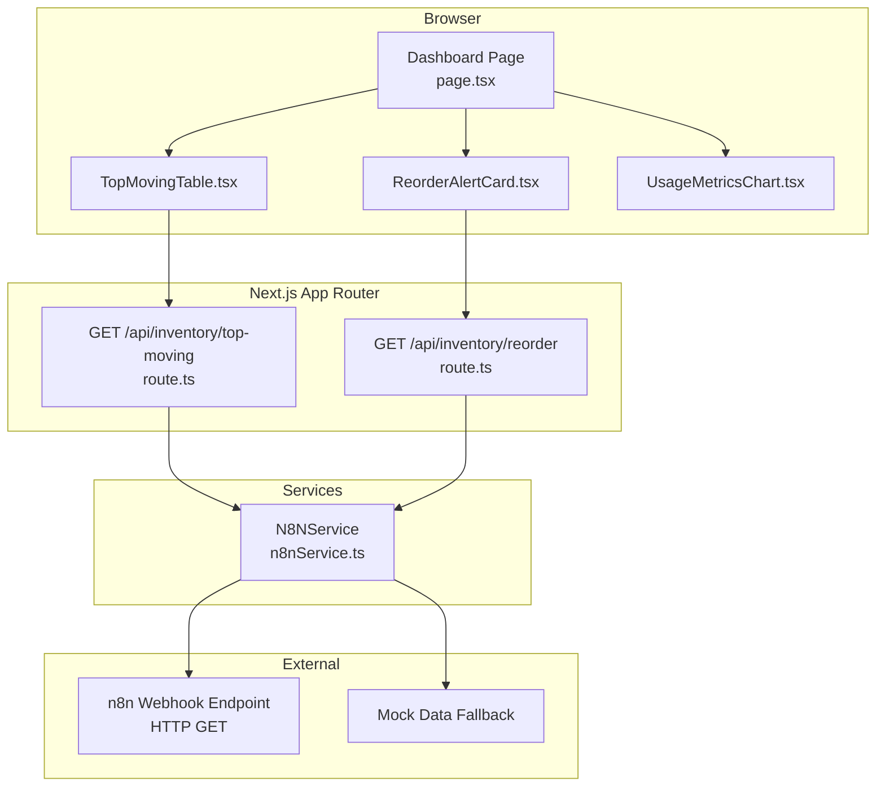
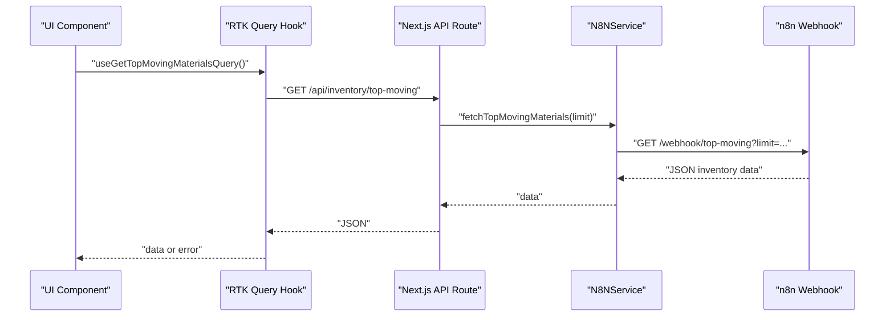
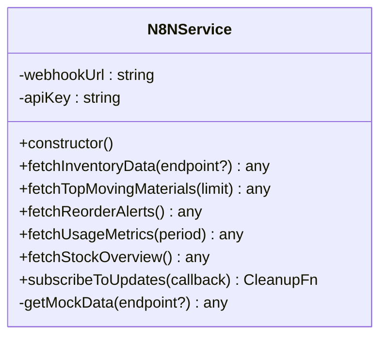
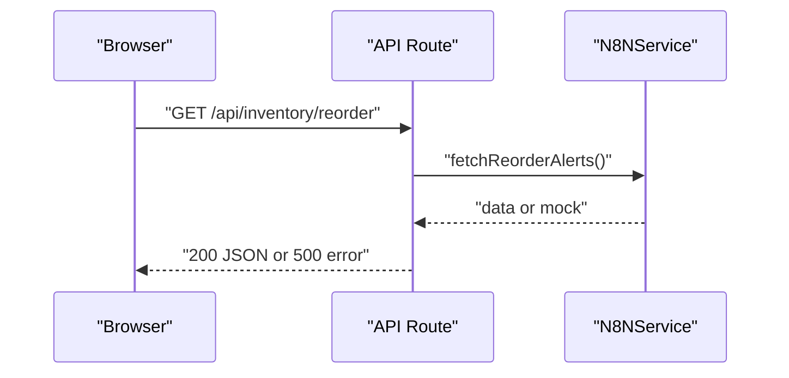
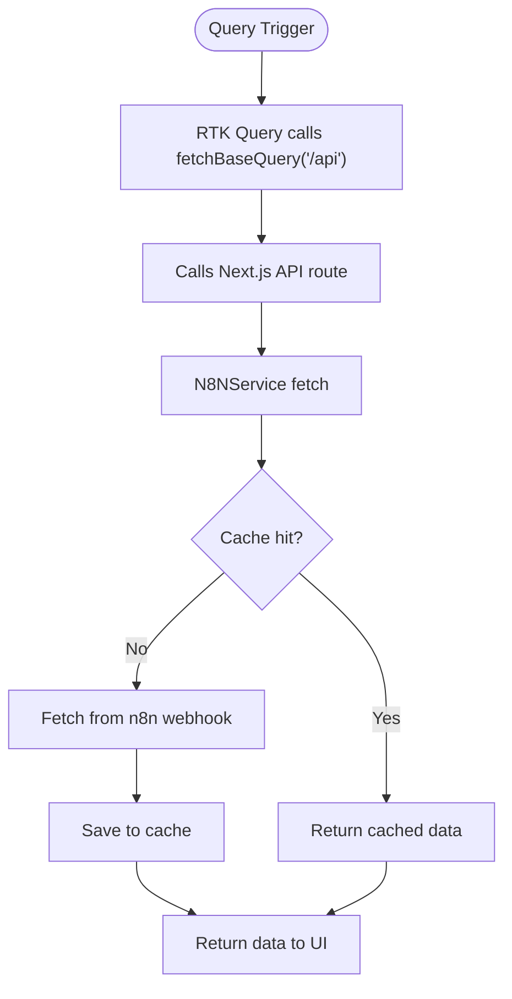
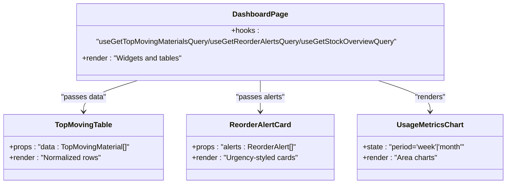
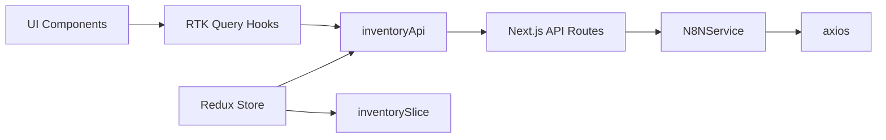

# External Data Integration

<cite>
**Referenced Files in This Document**
- [n8nService.ts](file://src/services/n8nService.ts)
- [supabase.ts](file://src/lib/supabase.ts)
- [inventoryApi.ts](file://src/store/api/inventoryApi.ts)
- [route.ts (top-moving)](file://src/app/api/inventory/top-moving/route.ts)
- [route.ts (reorder)](file://src/app/api/inventory/reorder/route.ts)
- [page.tsx (dashboard)](file://src/app/dashboard/page.tsx)
- [TopMovingTable.tsx](file://src/components/inventory/TopMovingTable.tsx)
- [ReorderAlertCard.tsx](file://src/components/inventory/ReorderAlertCard.tsx)
- [UsageMetricsChart.tsx](file://src/components/inventory/UsageMetricsChart.tsx)
- [inventorySlice.ts](file://src/store/slices/inventorySlice.ts)
- [store.ts](file://src/store/store.ts)
- [site.config.ts](file://src/config/site.config.ts)
</cite>

## Table of Contents
1. [Introduction](#introduction)
2. [Project Structure](#project-structure)
3. [Core Components](#core-components)
4. [Architecture Overview](#architecture-overview)
5. [Detailed Component Analysis](#detailed-component-analysis)
6. [Dependency Analysis](#dependency-analysis)
7. [Performance Considerations](#performance-considerations)
8. [Troubleshooting Guide](#troubleshooting-guide)
9. [Conclusion](#conclusion)
10. [Appendices](#appendices)

## Introduction
This document explains the external data integration patterns powering the inventory dashboard. It covers:
- n8n webhook service integration for real-time inventory data
- Data polling mechanisms and fallback strategies
- Supabase integration for authentication and user settings
- RTK Query-based data fetching and caching
- Data transformation patterns and UI rendering
- Security, error handling, and performance optimization
- Troubleshooting guidance for common integration issues

## Project Structure
The integration spans three layers:
- Frontend data access: RTK Query API slice and React components
- Backend API routes: Next.js app router handlers that delegate to the n8n service
- External data source: n8n webhooks and mock fallbacks

**Diagram sources**
- [page.tsx (dashboard):17-127](file://src/app/dashboard/page.tsx#L17-L127)
- [TopMovingTable.tsx:19-99](file://src/components/inventory/TopMovingTable.tsx#L19-L99)
- [ReorderAlertCard.tsx:19-104](file://src/components/inventory/ReorderAlertCard.tsx#L19-L104)
- [UsageMetricsChart.tsx:47-159](file://src/components/inventory/UsageMetricsChart.tsx#L47-L159)
- [route.ts (top-moving):1-25](file://src/app/api/inventory/top-moving/route.ts#L1-L25)
- [route.ts (reorder):1-18](file://src/app/api/inventory/reorder/route.ts#L1-L18)
- [n8nService.ts:16-188](file://src/services/n8nService.ts#L16-L188)

**Section sources**
- [page.tsx (dashboard):1-128](file://src/app/dashboard/page.tsx#L1-L128)
- [route.ts (top-moving):1-25](file://src/app/api/inventory/top-moving/route.ts#L1-L25)
- [route.ts (reorder):1-18](file://src/app/api/inventory/reorder/route.ts#L1-L18)
- [n8nService.ts:1-189](file://src/services/n8nService.ts#L1-L189)

## Core Components
- N8NService: Centralized client for n8n webhooks, including endpoint routing, authentication, timeouts, and mock fallbacks.
- Next.js API routes: Thin handlers that call N8NService and return JSON responses.
- RTK Query inventoryApi: Defines typed queries, base URL, caching, and tag invalidation.
- UI components: Render data from RTK Query hooks and handle loading/error states.
- Supabase client: Provides authentication and user settings; inventory data is not stored here.

**Section sources**
- [n8nService.ts:16-188](file://src/services/n8nService.ts#L16-L188)
- [route.ts (top-moving):1-25](file://src/app/api/inventory/top-moving/route.ts#L1-L25)
- [route.ts (reorder):1-18](file://src/app/api/inventory/reorder/route.ts#L1-L18)
- [inventoryApi.ts:23-49](file://src/store/api/inventoryApi.ts#L23-L49)
- [supabase.ts:1-21](file://src/lib/supabase.ts#L1-L21)

## Architecture Overview
The system follows a predictable flow:
- UI triggers RTK Query queries via hooks
- RTK Query calls the Next.js API route
- API route invokes N8NService
- N8NService requests n8n webhook with Bearer token
- On failure, N8NService returns mock data
- API route returns JSON to the UI

**Diagram sources**
- [page.tsx (dashboard):18-20](file://src/app/dashboard/page.tsx#L18-L20)
- [inventoryApi.ts:28-32](file://src/store/api/inventoryApi.ts#L28-L32)
- [route.ts (top-moving):4-10](file://src/app/api/inventory/top-moving/route.ts#L4-L10)
- [n8nService.ts:136-138](file://src/services/n8nService.ts#L136-L138)

## Detailed Component Analysis

### N8N Service Integration
- Authentication: Uses Bearer token from environment variables.
- Endpoints: Supports top-moving, reorder-alerts, usage-metrics, and stock-overview.
- Timeout: 10 seconds to prevent hanging requests.
- Fallback: On error or 404, returns structured mock data keyed by endpoint.
- Polling: Exposes a subscription method to poll every 30 seconds.

**Diagram sources**
- [n8nService.ts:16-188](file://src/services/n8nService.ts#L16-L188)

**Section sources**
- [n8nService.ts:16-188](file://src/services/n8nService.ts#L16-L188)
- [site.config.ts:28-32](file://src/config/site.config.ts#L28-L32)

### Next.js API Routes
- top-moving: Parses limit query param, calls N8NService, returns JSON or 404.
- reorder: Calls N8NService, returns JSON or 500.

**Diagram sources**
- [route.ts (reorder):4-16](file://src/app/api/inventory/reorder/route.ts#L4-L16)
- [n8nService.ts:143-145](file://src/services/n8nService.ts#L143-L145)

**Section sources**
- [route.ts (top-moving):4-24](file://src/app/api/inventory/top-moving/route.ts#L4-L24)
- [route.ts (reorder):4-17](file://src/app/api/inventory/reorder/route.ts#L4-L17)

### RTK Query Integration
- Base URL: /api
- Endpoints: top-moving, reorder, usage-metrics, stock-overview
- Caching: keepUnusedDataFor configured per endpoint
- Tags: Inventory tag enables cache invalidation

**Diagram sources**
- [inventoryApi.ts:23-49](file://src/store/api/inventoryApi.ts#L23-L49)
- [store.ts:7-16](file://src/store/store.ts#L7-L16)

**Section sources**
- [inventoryApi.ts:23-49](file://src/store/api/inventoryApi.ts#L23-L49)
- [store.ts:7-16](file://src/store/store.ts#L7-L16)

### UI Rendering and Data Transformation
- Dashboard composes widgets and lists using RTK Query hooks.
- TopMovingTable expects normalized props matching the TopMovingMaterial interface.
- ReorderAlertCard renders alerts with urgency-based styling.
- UsageMetricsChart displays usage vs forecast and allows period selection.

**Diagram sources**
- [page.tsx (dashboard):17-127](file://src/app/dashboard/page.tsx#L17-L127)
- [TopMovingTable.tsx:19-99](file://src/components/inventory/TopMovingTable.tsx#L19-L99)
- [ReorderAlertCard.tsx:19-104](file://src/components/inventory/ReorderAlertCard.tsx#L19-L104)
- [UsageMetricsChart.tsx:47-159](file://src/components/inventory/UsageMetricsChart.tsx#L47-L159)
- [inventoryApi.ts:3-21](file://src/store/api/inventoryApi.ts#L3-L21)

**Section sources**
- [page.tsx (dashboard):17-127](file://src/app/dashboard/page.tsx#L17-L127)
- [TopMovingTable.tsx:19-99](file://src/components/inventory/TopMovingTable.tsx#L19-L99)
- [ReorderAlertCard.tsx:19-104](file://src/components/inventory/ReorderAlertCard.tsx#L19-L104)
- [UsageMetricsChart.tsx:47-159](file://src/components/inventory/UsageMetricsChart.tsx#L47-L159)
- [inventoryApi.ts:3-21](file://src/store/api/inventoryApi.ts#L3-L21)

### Supabase Integration
- Client initialization with NEXT_PUBLIC_* environment variables
- Purpose: authentication, user preferences, and secure credential storage
- Inventory data is not stored in Supabase; it comes from n8n webhooks

**Section sources**
- [supabase.ts:1-21](file://src/lib/supabase.ts#L1-L21)

## Dependency Analysis
- UI depends on RTK Query hooks defined in inventoryApi
- inventoryApi depends on fetchBaseQuery with base URL /api
- API routes depend on N8NService
- N8NService depends on axios and environment variables
- Store concatenates RTK Query middleware and reducers

**Diagram sources**
- [inventoryApi.ts:23-49](file://src/store/api/inventoryApi.ts#L23-L49)
- [store.ts:7-16](file://src/store/store.ts#L7-L16)
- [n8nService.ts:1-15](file://src/services/n8nService.ts#L1-L15)
- [TopMovingTable.tsx:1-100](file://src/components/inventory/TopMovingTable.tsx#L1-L100)

**Section sources**
- [store.ts:7-16](file://src/store/store.ts#L7-L16)
- [inventoryApi.ts:23-49](file://src/store/api/inventoryApi.ts#L23-L49)
- [n8nService.ts:1-15](file://src/services/n8nService.ts#L1-L15)

## Performance Considerations
- Caching: keepUnusedDataFor values are set per endpoint to balance freshness and performance.
- Polling: N8NService supports periodic polling; adjust interval based on data volatility and cost.
- Timeouts: Axios timeout prevents long hangs; tune based on network conditions.
- Tag invalidation: Using tag types enables targeted cache updates.
- UI responsiveness: Loading spinners and error alerts improve perceived performance.

[No sources needed since this section provides general guidance]

## Troubleshooting Guide
Common issues and resolutions:
- Webhook timeout or network errors
  - Symptom: Request aborted or slow responses
  - Action: Increase timeout, check network, retry logic is built-in
- 404 on endpoint
  - Symptom: Endpoint not found
  - Action: N8NService falls back to mock data; verify endpoint spelling and availability
- Authentication failures
  - Symptom: Unauthorized responses
  - Action: Verify Bearer token environment variable and permissions
- Empty data returned
  - Symptom: 200 OK but empty payload
  - Action: API routes return 404 for empty data; confirm upstream data availability
- UI not updating
  - Symptom: Stale data
  - Action: Confirm RTK Query cache TTL and tag invalidation; consider polling interval
- Environment misconfiguration
  - Symptom: Blank webhook URL or missing keys
  - Action: Validate NEXT_PUBLIC_SUPABASE_URL, NEXT_PUBLIC_SUPABASE_ANON_KEY, N8N_WEBHOOK_URL, N8N_API_KEY

**Section sources**
- [n8nService.ts:29-56](file://src/services/n8nService.ts#L29-L56)
- [route.ts (top-moving):12-14](file://src/app/api/inventory/top-moving/route.ts#L12-L14)
- [site.config.ts:28-32](file://src/config/site.config.ts#L28-L32)

## Conclusion
The dashboard integrates external inventory data via n8n webhooks with robust fallbacks, caching, and real-time polling. RTK Query provides efficient data fetching and caching, while Next.js API routes act as thin orchestration layers. Supabase handles authentication and user settings, keeping inventory data centralized in n8n. The architecture balances reliability, performance, and maintainability.

[No sources needed since this section summarizes without analyzing specific files]

## Appendices

### Data Formats and Endpoints
- Top Moving Materials
  - Endpoint: GET /api/inventory/top-moving?limit=N
  - Response: Array of normalized items suitable for TopMovingTable
- Reorder Alerts
  - Endpoint: GET /api/inventory/reorder
  - Response: Array of normalized alerts suitable for ReorderAlertCard
- Usage Metrics
  - Endpoint: GET /api/inventory/usage-metrics?period=week|month
  - Response: Structured data for UsageMetricsChart
- Stock Overview
  - Endpoint: GET /api/inventory/stock-overview
  - Response: Aggregated metrics for widgets

**Section sources**
- [inventoryApi.ts:28-47](file://src/store/api/inventoryApi.ts#L28-L47)
- [route.ts (top-moving):6-10](file://src/app/api/inventory/top-moving/route.ts#L6-L10)
- [route.ts (reorder):7-7](file://src/app/api/inventory/reorder/route.ts#L7-L7)

### Authentication and Security
- Authentication method: Bearer token passed in Authorization header
- Secrets: N8N_API_KEY and webhook URL from environment variables
- Supabase: Used for user auth and preferences; inventory data is not stored here
- Recommendations: Rotate tokens, restrict webhook URLs, monitor logs, and apply least privilege

**Section sources**
- [n8nService.ts:33-36](file://src/services/n8nService.ts#L33-L36)
- [supabase.ts:1-21](file://src/lib/supabase.ts#L1-L21)

### Example Workflows

#### Webhook Setup
- Configure n8n to expose endpoints for top-moving, reorder-alerts, usage-metrics, and stock-overview
- Secure endpoints with a shared secret and enforce HTTPS
- Set environment variables for the Next.js app

**Section sources**
- [n8nService.ts:20-23](file://src/services/n8nService.ts#L20-L23)
- [site.config.ts:28-32](file://src/config/site.config.ts#L28-L32)

#### Data Transformation Workflow
- API route receives request and delegates to N8NService
- N8NService transforms endpoint into webhook URL and applies Bearer token
- On success, returns JSON; on failure, returns mock data
- UI components render normalized data

**Section sources**
- [route.ts (top-moving):4-10](file://src/app/api/inventory/top-moving/route.ts#L4-L10)
- [n8nService.ts:29-56](file://src/services/n8nService.ts#L29-L56)
- [TopMovingTable.tsx:19-99](file://src/components/inventory/TopMovingTable.tsx#L19-L99)

#### Error Handling Strategies
- Network timeouts: surfaced as errors; UI shows loading or alert
- 404 endpoints: fallback to mock data
- Empty payloads: API returns 404; UI shows empty state
- General failures: API returns 500; UI shows error message

**Section sources**
- [n8nService.ts:43-55](file://src/services/n8nService.ts#L43-L55)
- [route.ts (top-moving):12-14](file://src/app/api/inventory/top-moving/route.ts#L12-L14)
- [route.ts (reorder):10-16](file://src/app/api/inventory/reorder/route.ts#L10-L16)