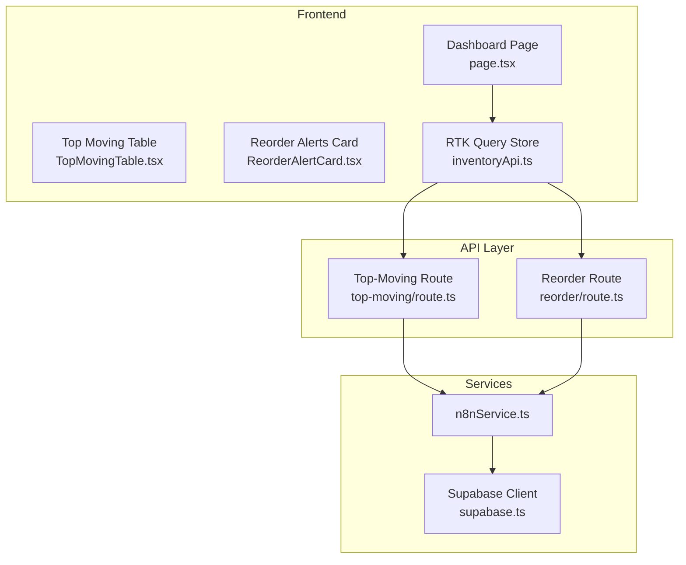
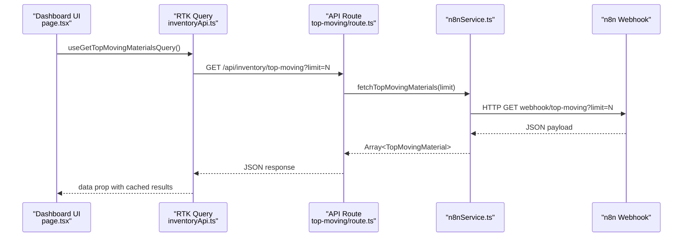
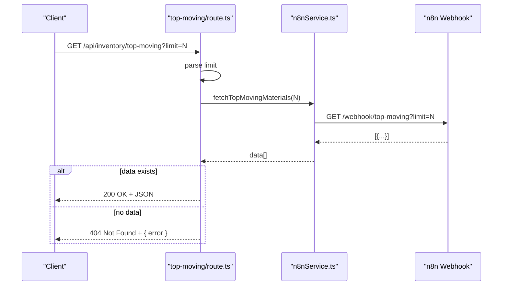
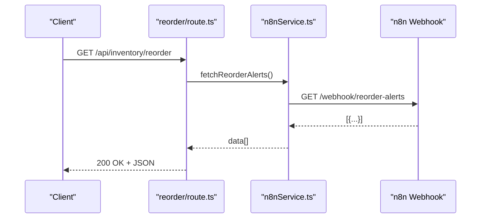
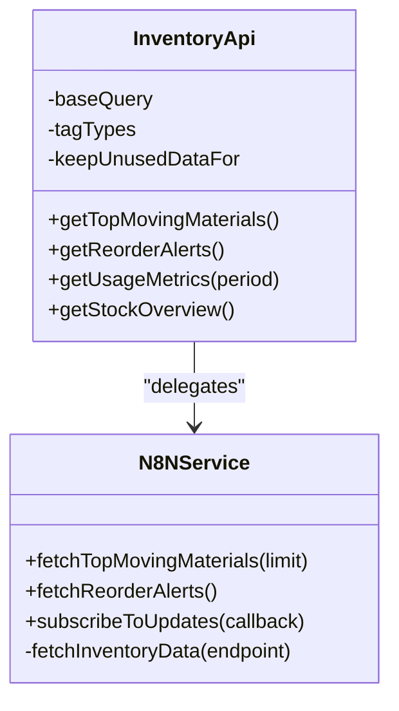
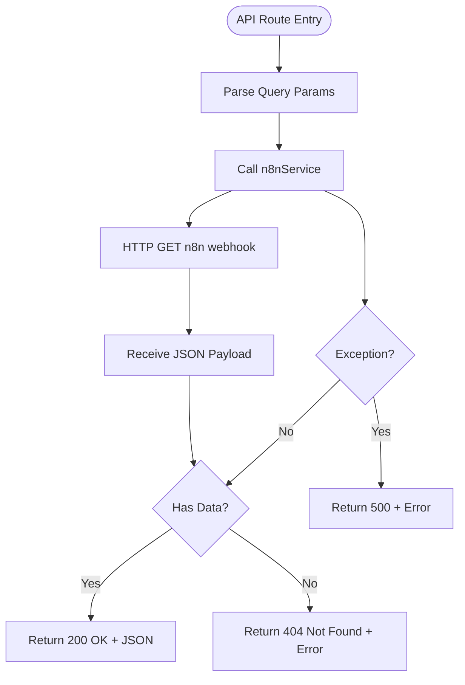
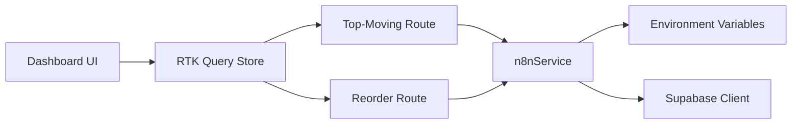

# Inventory API Endpoints

<cite>
**Referenced Files in This Document**
- [route.ts](file://src/app/api/inventory/top-moving/route.ts)
- [route.ts](file://src/app/api/inventory/reorder/route.ts)
- [inventoryApi.ts](file://src/store/api/inventoryApi.ts)
- [n8nService.ts](file://src/services/n8nService.ts)
- [supabase.ts](file://src/lib/supabase.ts)
- [TopMovingTable.tsx](file://src/components/inventory/TopMovingTable.tsx)
- [ReorderAlertCard.tsx](file://src/components/inventory/ReorderAlertCard.tsx)
- [page.tsx](file://src/app/dashboard/page.tsx)
- [aiService.ts](file://src/services/aiService.ts)
- [reportService.ts](file://src/services/reportService.ts)
- [package.json](file://package.json)
</cite>

## Table of Contents
1. [Introduction](#introduction)
2. [Project Structure](#project-structure)
3. [Core Components](#core-components)
4. [Architecture Overview](#architecture-overview)
5. [Detailed Component Analysis](#detailed-component-analysis)
6. [Dependency Analysis](#dependency-analysis)
7. [Performance Considerations](#performance-considerations)
8. [Troubleshooting Guide](#troubleshooting-guide)
9. [Conclusion](#conclusion)

## Introduction
This document provides comprehensive API documentation for the inventory management endpoints focused on:
- Retrieving top moving materials data
- Fetching reorder alerts

It covers HTTP methods, URL patterns, request parameters, response schemas, data formats, examples, status codes, error handling, RTK Query integration patterns, caching strategies, automatic data synchronization, transformation from the n8n webhook service to API responses, authentication requirements, rate limiting considerations, performance optimization tips, and troubleshooting guidance.

## Project Structure
The inventory endpoints are implemented as Next.js App Router API routes under the `/api/inventory` namespace. They delegate to a service layer that integrates with n8n webhooks to retrieve inventory data. Frontend dashboards consume these endpoints via RTK Query.

**Diagram sources**
- [page.tsx:1-128](file://src/app/dashboard/page.tsx#L1-L128)
- [TopMovingTable.tsx:1-100](file://src/components/inventory/TopMovingTable.tsx#L1-L100)
- [ReorderAlertCard.tsx:1-105](file://src/components/inventory/ReorderAlertCard.tsx#L1-L105)
- [inventoryApi.ts:1-57](file://src/store/api/inventoryApi.ts#L1-L57)
- [route.ts:1-25](file://src/app/api/inventory/top-moving/route.ts#L1-L25)
- [route.ts:1-18](file://src/app/api/inventory/reorder/route.ts#L1-L18)
- [n8nService.ts:1-109](file://src/services/n8nService.ts#L1-L109)
- [supabase.ts:1-21](file://src/lib/supabase.ts#L1-L21)

**Section sources**
- [route.ts:1-25](file://src/app/api/inventory/top-moving/route.ts#L1-L25)
- [route.ts:1-18](file://src/app/api/inventory/reorder/route.ts#L1-L18)
- [inventoryApi.ts:1-57](file://src/store/api/inventoryApi.ts#L1-L57)
- [n8nService.ts:1-109](file://src/services/n8nService.ts#L1-L109)
- [supabase.ts:1-21](file://src/lib/supabase.ts#L1-L21)
- [page.tsx:1-128](file://src/app/dashboard/page.tsx#L1-L128)

## Core Components
- Top-Moving Endpoint: GET /api/inventory/top-moving
  - Accepts optional query parameter limit (integer) to constrain the number of returned items.
  - Returns an array of top moving materials with fields such as id, name, code, usageVelocity, trend, category, unit.
  - Status codes: 200 OK on success, 404 Not Found when no data is available, 500 Internal Server Error on failure.
- Reorder Alerts Endpoint: GET /api/inventory/reorder
  - Returns an array of reorder alerts with fields such as id, materialId, materialName, currentStock, reorderPoint, suggestedQuantity, urgency.
  - Status codes: 200 OK on success, 500 Internal Server Error on failure.

Both endpoints rely on n8n webhooks for data retrieval and pass through the raw data received from the webhook service.

**Section sources**
- [route.ts:1-25](file://src/app/api/inventory/top-moving/route.ts#L1-L25)
- [route.ts:1-18](file://src/app/api/inventory/reorder/route.ts#L1-L18)
- [n8nService.ts:56-65](file://src/services/n8nService.ts#L56-L65)

## Architecture Overview
The system follows a layered architecture:
- Frontend: React components and RTK Query manage state and UI rendering.
- API Routes: Next.js API handlers receive requests and delegate to services.
- Services: n8nService orchestrates data retrieval from n8n webhooks and handles errors.
- Authentication and Credentials: Supabase client is used for user authentication and credential management; inventory data itself is sourced from n8n.

**Diagram sources**
- [page.tsx:17-20](file://src/app/dashboard/page.tsx#L17-L20)
- [inventoryApi.ts:28-32](file://src/store/api/inventoryApi.ts#L28-L32)
- [route.ts:4-16](file://src/app/api/inventory/top-moving/route.ts#L4-L16)
- [n8nService.ts:56-58](file://src/services/n8nService.ts#L56-L58)

## Detailed Component Analysis

### Top-Moving Materials Endpoint
- HTTP Method: GET
- URL Pattern: /api/inventory/top-moving
- Query Parameters:
  - limit (optional): integer; defaults to 10 if omitted.
- Request Example:
  - GET /api/inventory/top-moving?limit=10
- Response Schema (array of objects):
  - id: string
  - name: string
  - code: string
  - usageVelocity: number
  - trend: "up" | "down" | "stable"
  - category: string
  - unit: string
- Response Example:
  - [
      {
        "id": "mat-1",
        "name": "Urea Nitrogen",
        "code": "UR-001",
        "usageVelocity": 1250,
        "trend": "up",
        "category": "Nitrogen",
        "unit": "tons"
      },
      ...
    ]
- Status Codes:
  - 200 OK: Successful retrieval.
  - 404 Not Found: No data available.
  - 500 Internal Server Error: Server-side failure.
- Error Handling:
  - On empty or missing data, responds with 404 and an error message.
  - On exceptions, logs the error and responds with 500 and an error message.

**Diagram sources**
- [route.ts:4-23](file://src/app/api/inventory/top-moving/route.ts#L4-L23)
- [n8nService.ts:56-58](file://src/services/n8nService.ts#L56-L58)

**Section sources**
- [route.ts:1-25](file://src/app/api/inventory/top-moving/route.ts#L1-L25)
- [n8nService.ts:56-58](file://src/services/n8nService.ts#L56-L58)

### Reorder Alerts Endpoint
- HTTP Method: GET
- URL Pattern: /api/inventory/reorder
- Query Parameters: None
- Request Example:
  - GET /api/inventory/reorder
- Response Schema (array of objects):
  - id: string
  - materialId: string
  - materialName: string
  - currentStock: number
  - reorderPoint: number
  - suggestedQuantity: number
  - urgency: "critical" | "warning" | "info"
- Response Example:
  - [
      {
        "id": "alert-1",
        "materialId": "mat-1",
        "materialName": "Urea Nitrogen",
        "currentStock": 50,
        "reorderPoint": 100,
        "suggestedQuantity": 100,
        "urgency": "warning"
      },
      ...
    ]
- Status Codes:
  - 200 OK: Successful retrieval.
  - 500 Internal Server Error: Server-side failure.
- Error Handling:
  - On exceptions, logs the error and responds with 500 and an error message.

**Diagram sources**
- [route.ts:4-16](file://src/app/api/inventory/reorder/route.ts#L4-L16)
- [n8nService.ts:63-65](file://src/services/n8nService.ts#L63-L65)

**Section sources**
- [route.ts:1-18](file://src/app/api/inventory/reorder/route.ts#L1-L18)
- [n8nService.ts:63-65](file://src/services/n8nService.ts#L63-L65)

### RTK Query Integration and Caching
- Store Definition:
  - Base URL: /api
  - Tag Types: Inventory
  - Endpoints:
    - getTopMovingMaterials: GET /api/inventory/top-moving
    - getReorderAlerts: GET /api/inventory/reorder
    - getUsageMetrics: GET /api/inventory/usage-metrics?period={period}
    - getStockOverview: GET /api/inventory/stock-overview
- Caching:
  - getTopMovingMaterials: keepUnusedDataFor 300 seconds (5 minutes)
  - getReorderAlerts: keepUnusedDataFor 180 seconds (3 minutes)
  - getUsageMetrics: keepUnusedDataFor 300 seconds (5 minutes)
  - getStockOverview: keepUnusedDataFor 240 seconds (4 minutes)
- Automatic Data Synchronization:
  - The n8nService supports subscription via polling to real-time updates. While the API routes currently fetch on-demand, the service exposes a polling mechanism suitable for integrating periodic refreshes at the application level.

**Diagram sources**
- [inventoryApi.ts:23-49](file://src/store/api/inventoryApi.ts#L23-L49)
- [n8nService.ts:29-105](file://src/services/n8nService.ts#L29-L105)

**Section sources**
- [inventoryApi.ts:1-57](file://src/store/api/inventoryApi.ts#L1-L57)
- [n8nService.ts:82-105](file://src/services/n8nService.ts#L82-L105)

### Data Transformation from n8n Webhook to API Responses
- The n8nService acts as a proxy to the n8n webhook, applying authentication headers and returning the raw JSON payload.
- The API routes forward the data from n8nService to clients without modification.
- The frontend components render the data according to their respective schemas.

**Diagram sources**
- [route.ts:4-23](file://src/app/api/inventory/top-moving/route.ts#L4-L23)
- [route.ts:4-16](file://src/app/api/inventory/reorder/route.ts#L4-L16)
- [n8nService.ts:29-51](file://src/services/n8nService.ts#L29-L51)

**Section sources**
- [n8nService.ts:29-51](file://src/services/n8nService.ts#L29-L51)
- [route.ts:4-23](file://src/app/api/inventory/top-moving/route.ts#L4-L23)
- [route.ts:4-16](file://src/app/api/inventory/reorder/route.ts#L4-L16)

### Authentication and Authorization
- Supabase Client:
  - Used for user authentication and managing user preferences and settings.
  - Not used as the source of inventory data; inventory data comes from n8n webhooks.
- API Access:
  - The API routes themselves do not implement explicit bearer token checks.
  - Authentication is handled at the application layer via Supabase client usage elsewhere in the app.
- Webhook Security:
  - n8nService applies Authorization headers to webhook requests using a configured API key.

**Section sources**
- [supabase.ts:1-21](file://src/lib/supabase.ts#L1-L21)
- [n8nService.ts:16-23](file://src/services/n8nService.ts#L16-L23)

### Rate Limiting Considerations
- Webhook Calls:
  - n8nService sets a 10-second timeout for webhook requests.
  - Polling interval for real-time updates is 30 seconds.
- Client-Side Caching:
  - RTK Query caches responses for configurable durations to reduce repeated network calls.
- Recommendations:
  - Align polling intervals with backend availability and data freshness requirements.
  - Consider implementing client-side throttling if multiple concurrent requests are triggered.

**Section sources**
- [n8nService.ts:38-105](file://src/services/n8nService.ts#L38-L105)
- [inventoryApi.ts:30-37](file://src/store/api/inventoryApi.ts#L30-L37)

## Dependency Analysis
- Frontend depends on RTK Query to define and consume endpoints.
- API routes depend on n8nService for data retrieval.
- n8nService depends on environment variables for webhook URL and API key.
- Supabase client is used for user-related operations but not for inventory data.

**Diagram sources**
- [page.tsx:1-128](file://src/app/dashboard/page.tsx#L1-L128)
- [inventoryApi.ts:1-57](file://src/store/api/inventoryApi.ts#L1-L57)
- [route.ts:1-25](file://src/app/api/inventory/top-moving/route.ts#L1-L25)
- [route.ts:1-18](file://src/app/api/inventory/reorder/route.ts#L1-L18)
- [n8nService.ts:1-109](file://src/services/n8nService.ts#L1-L109)
- [supabase.ts:1-21](file://src/lib/supabase.ts#L1-L21)

**Section sources**
- [package.json:11-26](file://package.json#L11-L26)
- [n8nService.ts:1-109](file://src/services/n8nService.ts#L1-L109)

## Performance Considerations
- Prefer client-side caching via RTK Query to minimize redundant network calls.
- Use the limit parameter for top-moving materials to constrain payload sizes.
- Monitor webhook latency and adjust timeouts accordingly.
- Consider paginating or filtering data on the n8n side if datasets grow large.
- Keep polling intervals reasonable to balance freshness and resource usage.

## Troubleshooting Guide
- Symptoms: Empty or missing data from top-moving endpoint.
  - Verify the n8n webhook returns data for the requested limit.
  - Check API route error logging for 404 scenarios.
- Symptoms: Frequent 500 errors.
  - Inspect webhook connectivity and authentication headers.
  - Confirm environment variables for webhook URL and API key are set.
- Symptoms: Slow initial loads.
  - Increase cache duration for frequently accessed endpoints.
  - Reduce polling frequency if real-time updates are not critical.
- Debugging Techniques:
  - Enable console logging in API routes and n8nService to trace request flow.
  - Validate environment variables locally and in deployment environments.
  - Use browser dev tools to inspect network requests and response payloads.

**Section sources**
- [route.ts:17-23](file://src/app/api/inventory/top-moving/route.ts#L17-L23)
- [route.ts:10-16](file://src/app/api/inventory/reorder/route.ts#L10-L16)
- [n8nService.ts:42-51](file://src/services/n8nService.ts#L42-L51)

## Conclusion
The inventory API endpoints provide straightforward access to top moving materials and reorder alerts by delegating to n8n webhooks. RTK Query offers efficient caching and integration with the frontend, while Supabase manages user authentication and preferences. By tuning caching, timeouts, and polling intervals, teams can achieve responsive dashboards with reliable data flows.