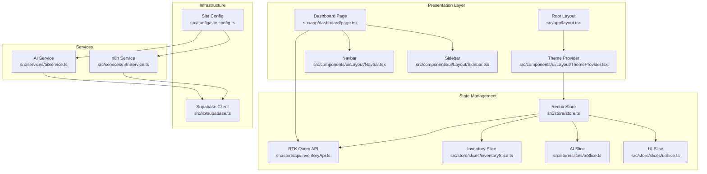
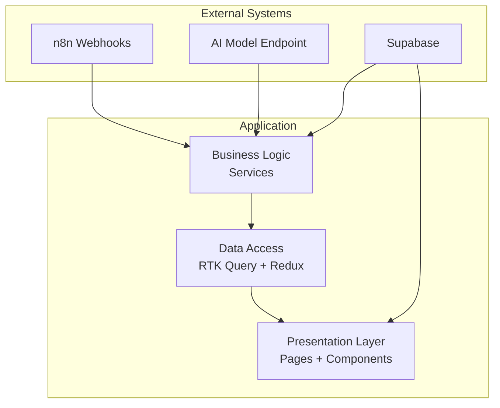
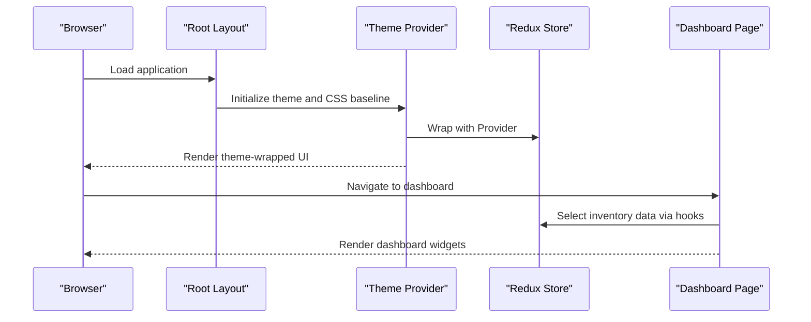
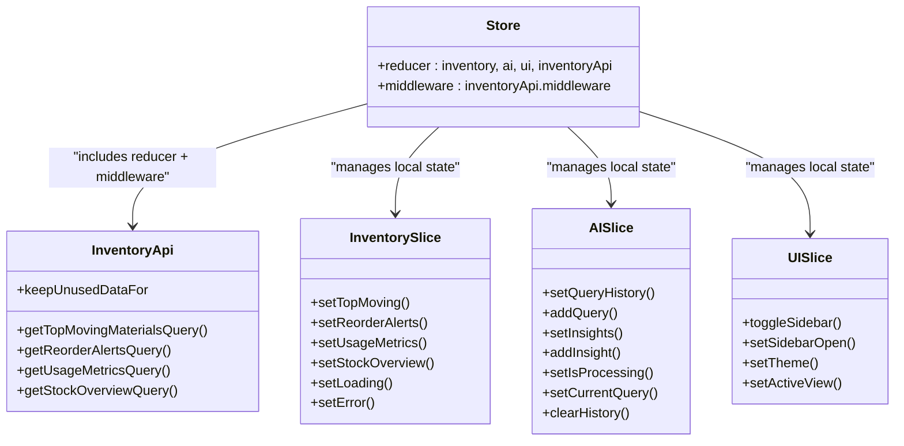
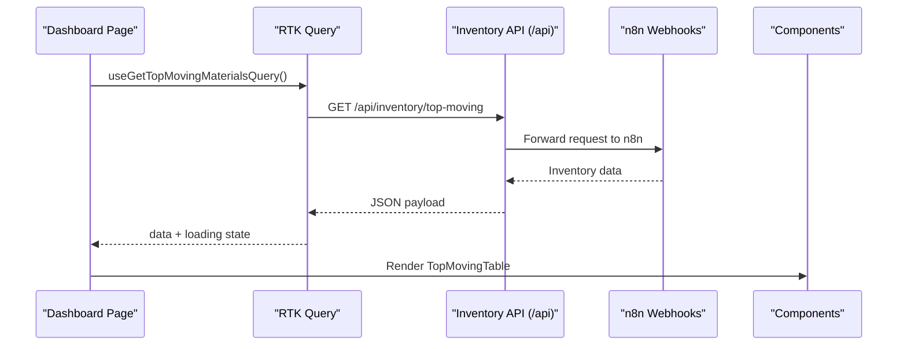
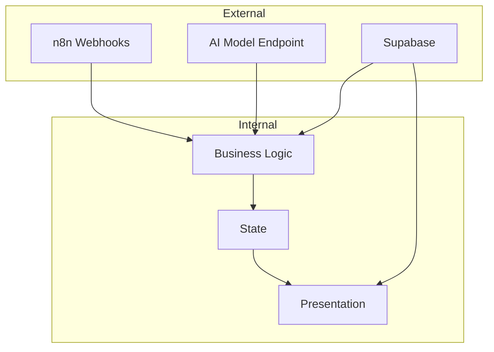
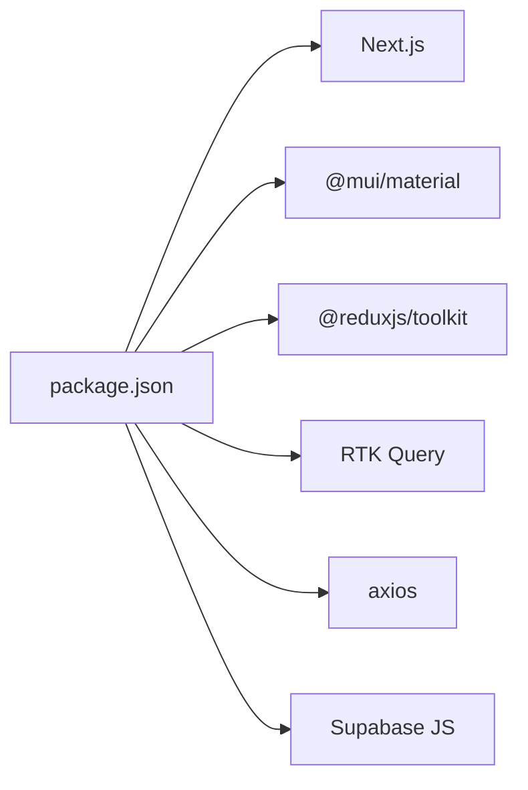

# Architecture Overview

<cite>
**Referenced Files in This Document**
- [README.md](file://README.md)
- [package.json](file://package.json)
- [src/app/layout.tsx](file://src/app/layout.tsx)
- [src/components/ui/Layout/ThemeProvider.tsx](file://src/components/ui/Layout/ThemeProvider.tsx)
- [src/components/ui/Layout/Navbar.tsx](file://src/components/ui/Layout/Navbar.tsx)
- [src/components/ui/Layout/Sidebar.tsx](file://src/components/ui/Layout/Sidebar.tsx)
- [src/store/store.ts](file://src/store/store.ts)
- [src/store/api/inventoryApi.ts](file://src/store/api/inventoryApi.ts)
- [src/store/slices/inventorySlice.ts](file://src/store/slices/inventorySlice.ts)
- [src/store/slices/aiSlice.ts](file://src/store/slices/aiSlice.ts)
- [src/store/slices/uiSlice.ts](file://src/store/slices/uiSlice.ts)
- [src/services/n8nService.ts](file://src/services/n8nService.ts)
- [src/services/aiService.ts](file://src/services/aiService.ts)
- [src/lib/supabase.ts](file://src/lib/supabase.ts)
- [src/config/site.config.ts](file://src/config/site.config.ts)
- [src/app/dashboard/page.tsx](file://src/app/dashboard/page.tsx)
</cite>

## Table of Contents
1. [Introduction](#introduction)
2. [Project Structure](#project-structure)
3. [Core Components](#core-components)
4. [Architecture Overview](#architecture-overview)
5. [Detailed Component Analysis](#detailed-component-analysis)
6. [Dependency Analysis](#dependency-analysis)
7. [Performance Considerations](#performance-considerations)
8. [Troubleshooting Guide](#troubleshooting-guide)
9. [Conclusion](#conclusion)
10. [Appendices](#appendices)

## Introduction
This document describes the architecture of the dashboard-ai system, focusing on a layered design separating presentation, business logic, and data access. The system is built with Next.js App Router, TypeScript, and Material-UI, using Redux Toolkit for state management and RTK Query for API data fetching. It integrates with external services including n8n webhooks for inventory data, an AI model endpoint for insights, and Supabase for authentication and user preferences. The document also outlines infrastructure requirements, scalability considerations, deployment topology, and cross-cutting concerns such as real-time synchronization, caching, and performance optimization.

## Project Structure
The project follows a feature-based structure under src/, with clear separation of concerns:
- Presentation layer: Next.js App Router pages and React components using Material-UI
- Business logic: Services for n8n and AI integrations
- Data access: RTK Query API slice and Redux slices for local state
- Infrastructure: Supabase client initialization and site configuration

**Diagram sources**
- [src/app/layout.tsx:1-31](file://src/app/layout.tsx#L1-L31)
- [src/components/ui/Layout/ThemeProvider.tsx:1-100](file://src/components/ui/Layout/ThemeProvider.tsx#L1-L100)
- [src/components/ui/Layout/Navbar.tsx:1-61](file://src/components/ui/Layout/Navbar.tsx#L1-L61)
- [src/components/ui/Layout/Sidebar.tsx:1-133](file://src/components/ui/Layout/Sidebar.tsx#L1-L133)
- [src/app/dashboard/page.tsx:1-128](file://src/app/dashboard/page.tsx#L1-L128)
- [src/store/store.ts:1-27](file://src/store/store.ts#L1-L27)
- [src/store/api/inventoryApi.ts:1-57](file://src/store/api/inventoryApi.ts#L1-L57)
- [src/store/slices/inventorySlice.ts:1-56](file://src/store/slices/inventorySlice.ts#L1-L56)
- [src/store/slices/aiSlice.ts:1-56](file://src/store/slices/aiSlice.ts#L1-L56)
- [src/store/slices/uiSlice.ts:1-42](file://src/store/slices/uiSlice.ts#L1-L42)
- [src/services/n8nService.ts:1-109](file://src/services/n8nService.ts#L1-L109)
- [src/services/aiService.ts:1-219](file://src/services/aiService.ts#L1-L219)
- [src/lib/supabase.ts:1-21](file://src/lib/supabase.ts#L1-L21)
- [src/config/site.config.ts:1-34](file://src/config/site.config.ts#L1-L34)

**Section sources**
- [README.md:1-37](file://README.md#L1-L37)
- [package.json:1-39](file://package.json#L1-L39)
- [src/app/layout.tsx:1-31](file://src/app/layout.tsx#L1-L31)
- [src/components/ui/Layout/ThemeProvider.tsx:1-100](file://src/components/ui/Layout/ThemeProvider.tsx#L1-L100)
- [src/components/ui/Layout/Navbar.tsx:1-61](file://src/components/ui/Layout/Navbar.tsx#L1-L61)
- [src/components/ui/Layout/Sidebar.tsx:1-133](file://src/components/ui/Layout/Sidebar.tsx#L1-L133)
- [src/app/dashboard/page.tsx:1-128](file://src/app/dashboard/page.tsx#L1-L128)
- [src/store/store.ts:1-27](file://src/store/store.ts#L1-L27)
- [src/store/api/inventoryApi.ts:1-57](file://src/store/api/inventoryApi.ts#L1-L57)
- [src/store/slices/inventorySlice.ts:1-56](file://src/store/slices/inventorySlice.ts#L1-L56)
- [src/store/slices/aiSlice.ts:1-56](file://src/store/slices/aiSlice.ts#L1-L56)
- [src/store/slices/uiSlice.ts:1-42](file://src/store/slices/uiSlice.ts#L1-L42)
- [src/services/n8nService.ts:1-109](file://src/services/n8nService.ts#L1-L109)
- [src/services/aiService.ts:1-219](file://src/services/aiService.ts#L1-L219)
- [src/lib/supabase.ts:1-21](file://src/lib/supabase.ts#L1-L21)
- [src/config/site.config.ts:1-34](file://src/config/site.config.ts#L1-L34)

## Core Components
- Presentation layer: Next.js App Router pages and Material-UI components manage UI rendering, navigation, and theming. The root layout initializes the theme provider and global styles.
- State management: Redux Toolkit orchestrates global state with slices for inventory, AI, and UI, and RTK Query manages API data fetching and caching.
- Services: Dedicated services encapsulate integration logic for n8n webhooks and AI model endpoints, including error handling and fallbacks.
- Infrastructure: Supabase client provides authentication and user preference storage; site configuration centralizes feature flags, caching TTLs, and integration endpoints.

**Section sources**
- [src/app/layout.tsx:1-31](file://src/app/layout.tsx#L1-L31)
- [src/components/ui/Layout/ThemeProvider.tsx:1-100](file://src/components/ui/Layout/ThemeProvider.tsx#L1-L100)
- [src/components/ui/Layout/Navbar.tsx:1-61](file://src/components/ui/Layout/Navbar.tsx#L1-L61)
- [src/components/ui/Layout/Sidebar.tsx:1-133](file://src/components/ui/Layout/Sidebar.tsx#L1-L133)
- [src/store/store.ts:1-27](file://src/store/store.ts#L1-L27)
- [src/store/api/inventoryApi.ts:1-57](file://src/store/api/inventoryApi.ts#L1-L57)
- [src/store/slices/inventorySlice.ts:1-56](file://src/store/slices/inventorySlice.ts#L1-L56)
- [src/store/slices/aiSlice.ts:1-56](file://src/store/slices/aiSlice.ts#L1-L56)
- [src/store/slices/uiSlice.ts:1-42](file://src/store/slices/uiSlice.ts#L1-L42)
- [src/services/n8nService.ts:1-109](file://src/services/n8nService.ts#L1-L109)
- [src/services/aiService.ts:1-219](file://src/services/aiService.ts#L1-L219)
- [src/lib/supabase.ts:1-21](file://src/lib/supabase.ts#L1-L21)
- [src/config/site.config.ts:1-34](file://src/config/site.config.ts#L1-L34)

## Architecture Overview
The system employs a layered architecture:
- Presentation layer: Next.js pages and Material-UI components render dashboards and widgets.
- Business logic layer: Services encapsulate integration with n8n and AI models.
- Data access layer: RTK Query handles API requests and caching; Redux slices maintain local UI and inventory state.

**Diagram sources**
- [src/services/n8nService.ts:1-109](file://src/services/n8nService.ts#L1-L109)
- [src/services/aiService.ts:1-219](file://src/services/aiService.ts#L1-L219)
- [src/lib/supabase.ts:1-21](file://src/lib/supabase.ts#L1-L21)
- [src/store/api/inventoryApi.ts:1-57](file://src/store/api/inventoryApi.ts#L1-L57)
- [src/store/store.ts:1-27](file://src/store/store.ts#L1-L27)

## Detailed Component Analysis

### Presentation Layer
- Root layout initializes the application shell, metadata, and theme provider.
- Theme provider configures Material-UI theme, CSS baseline, and wraps the app with Redux store.
- Navigation components (navbar and sidebar) integrate with Redux for UI state and routing.

**Diagram sources**
- [src/app/layout.tsx:1-31](file://src/app/layout.tsx#L1-L31)
- [src/components/ui/Layout/ThemeProvider.tsx:1-100](file://src/components/ui/Layout/ThemeProvider.tsx#L1-L100)
- [src/app/dashboard/page.tsx:1-128](file://src/app/dashboard/page.tsx#L1-L128)
- [src/store/store.ts:1-27](file://src/store/store.ts#L1-L27)

**Section sources**
- [src/app/layout.tsx:1-31](file://src/app/layout.tsx#L1-L31)
- [src/components/ui/Layout/ThemeProvider.tsx:1-100](file://src/components/ui/Layout/ThemeProvider.tsx#L1-L100)
- [src/components/ui/Layout/Navbar.tsx:1-61](file://src/components/ui/Layout/Navbar.tsx#L1-L61)
- [src/components/ui/Layout/Sidebar.tsx:1-133](file://src/components/ui/Layout/Sidebar.tsx#L1-L133)
- [src/app/dashboard/page.tsx:1-128](file://src/app/dashboard/page.tsx#L1-L128)

### State Management with Redux Toolkit and RTK Query
- Store configuration combines reducers for inventory, AI, UI, and RTK Query’s inventory API.
- RTK Query endpoints define typed queries for top-moving materials, reorder alerts, usage metrics, and stock overview with cache lifetimes.
- Local slices manage loading/error states and UI flags.

**Diagram sources**
- [src/store/store.ts:1-27](file://src/store/store.ts#L1-L27)
- [src/store/api/inventoryApi.ts:1-57](file://src/store/api/inventoryApi.ts#L1-L57)
- [src/store/slices/inventorySlice.ts:1-56](file://src/store/slices/inventorySlice.ts#L1-L56)
- [src/store/slices/aiSlice.ts:1-56](file://src/store/slices/aiSlice.ts#L1-L56)
- [src/store/slices/uiSlice.ts:1-42](file://src/store/slices/uiSlice.ts#L1-L42)

**Section sources**
- [src/store/store.ts:1-27](file://src/store/store.ts#L1-L27)
- [src/store/api/inventoryApi.ts:1-57](file://src/store/api/inventoryApi.ts#L1-L57)
- [src/store/slices/inventorySlice.ts:1-56](file://src/store/slices/inventorySlice.ts#L1-L56)
- [src/store/slices/aiSlice.ts:1-56](file://src/store/slices/aiSlice.ts#L1-L56)
- [src/store/slices/uiSlice.ts:1-42](file://src/store/slices/uiSlice.ts#L1-L42)

### Business Logic: n8n Integration and AI Services
- n8n service fetches inventory data from webhooks, supports endpoint-specific queries, and provides polling-based real-time updates with timeouts and error handling.
- AI service communicates with an external AI model endpoint to process queries, generate predictive insights, detect anomalies, and produce report summaries, with fallbacks when AI responses are invalid.

**Diagram sources**
- [src/app/dashboard/page.tsx:1-128](file://src/app/dashboard/page.tsx#L1-L128)
- [src/store/api/inventoryApi.ts:1-57](file://src/store/api/inventoryApi.ts#L1-L57)
- [src/services/n8nService.ts:1-109](file://src/services/n8nService.ts#L1-L109)

**Section sources**
- [src/services/n8nService.ts:1-109](file://src/services/n8nService.ts#L1-L109)
- [src/services/aiService.ts:1-219](file://src/services/aiService.ts#L1-L219)
- [src/app/dashboard/page.tsx:1-128](file://src/app/dashboard/page.tsx#L1-L128)

### System Boundaries and Integrations
- Internal boundaries:
  - Presentation: Next.js pages and Material-UI components
  - State: Redux store and RTK Query cache
  - Services: n8n and AI integrations
- External boundaries:
  - n8n webhooks: source of truth for inventory data
  - AI model endpoint: external inference service
  - Supabase: authentication and user preferences

**Diagram sources**
- [src/services/n8nService.ts:1-109](file://src/services/n8nService.ts#L1-L109)
- [src/services/aiService.ts:1-219](file://src/services/aiService.ts#L1-L219)
- [src/lib/supabase.ts:1-21](file://src/lib/supabase.ts#L1-L21)

**Section sources**
- [src/services/n8nService.ts:1-109](file://src/services/n8nService.ts#L1-L109)
- [src/services/aiService.ts:1-219](file://src/services/aiService.ts#L1-L219)
- [src/lib/supabase.ts:1-21](file://src/lib/supabase.ts#L1-L21)

## Dependency Analysis
The application depends on Next.js, Material-UI, Redux Toolkit, RTK Query, and Axios. Development dependencies include Tailwind CSS v4, TypeScript, and ESLint. Supabase SDK is used for authentication and preferences.

**Diagram sources**
- [package.json:1-39](file://package.json#L1-L39)

**Section sources**
- [package.json:1-39](file://package.json#L1-L39)

## Performance Considerations
- Caching: RTK Query endpoints specify cache lifetimes for inventory data, reducing redundant network calls.
- Polling: n8n service uses periodic polling for near-real-time updates with configurable intervals.
- Loading states: Dashboard components display loading indicators while data is fetched.
- Optimizations: Next.js App Router enables efficient routing and static generation where applicable.

**Section sources**
- [src/store/api/inventoryApi.ts:23-49](file://src/store/api/inventoryApi.ts#L23-L49)
- [src/services/n8nService.ts:82-105](file://src/services/n8nService.ts#L82-L105)
- [src/app/dashboard/page.tsx:17-30](file://src/app/dashboard/page.tsx#L17-L30)

## Troubleshooting Guide
- Authentication and credentials: Supabase client is initialized with environment variables for URL and anonymous key. Verify environment configuration for authentication and user preferences.
- n8n webhook connectivity: Ensure webhook URL and API key are configured; the service applies timeouts and logs errors during polling.
- AI model endpoint: Confirm endpoint, API key, and model name are set; the AI service includes fallbacks for invalid responses.
- Cache and polling intervals: Adjust TTLs and polling intervals in site configuration to balance freshness and performance.

**Section sources**
- [src/lib/supabase.ts:1-21](file://src/lib/supabase.ts#L1-L21)
- [src/services/n8nService.ts:16-51](file://src/services/n8nService.ts#L16-L51)
- [src/services/aiService.ts:18-27](file://src/services/aiService.ts#L18-L27)
- [src/config/site.config.ts:22-33](file://src/config/site.config.ts#L22-L33)

## Conclusion
The dashboard-ai system implements a clean layered architecture with a strong separation between presentation, business logic, and data access. Using Next.js App Router, Material-UI, Redux Toolkit, and RTK Query, it delivers a responsive, scalable, and maintainable solution. Integrations with n8n, AI models, and Supabase enable real-time inventory insights, intelligent recommendations, and secure user management. Proper caching, polling, and environment configuration ensure reliable operation and performance.

## Appendices
- Technology stack highlights:
  - Frontend: Next.js App Router, TypeScript, Material-UI, React
  - State management: Redux Toolkit + RTK Query
  - Styling: Tailwind CSS v4
  - Backend integration: Axios, environment-driven configuration
  - Authentication: Supabase

[No sources needed since this section provides general guidance]