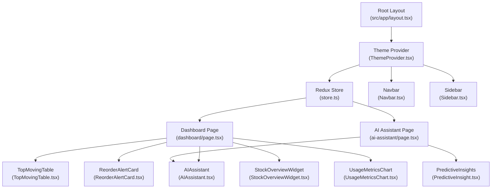
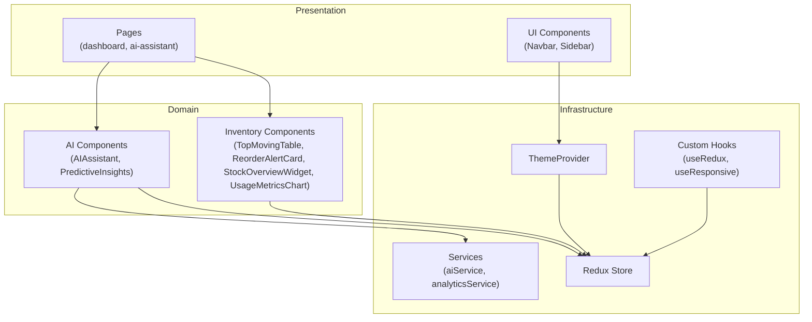
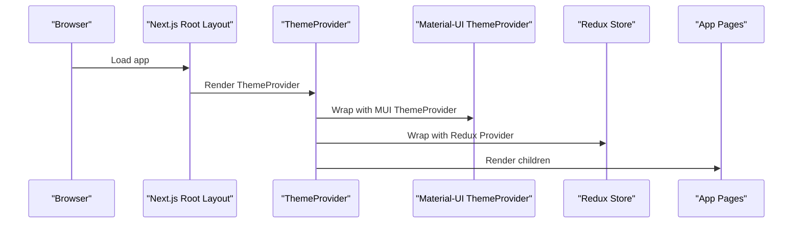
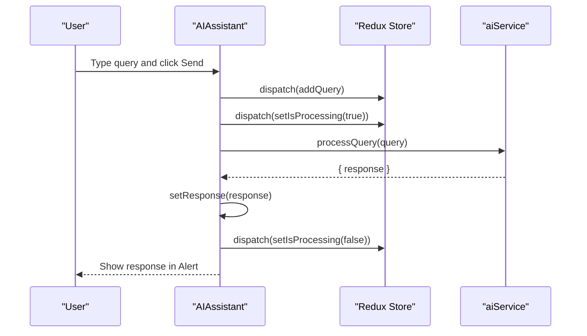
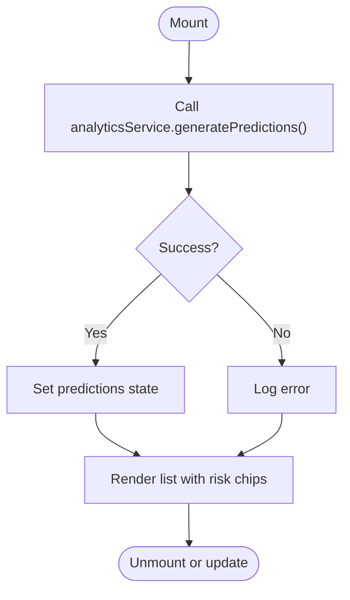
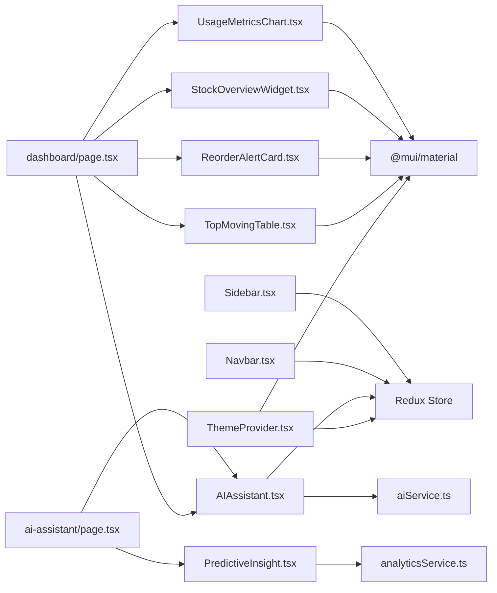

# Component Architecture

<cite>
**Referenced Files in This Document**
- [src/app/layout.tsx](file://src/app/layout.tsx)
- [src/components/ui/Layout/ThemeProvider.tsx](file://src/components/ui/Layout/ThemeProvider.tsx)
- [src/store/store.ts](file://src/store/store.ts)
- [src/hooks/useRedux.ts](file://src/hooks/useRedux.ts)
- [src/hooks/useResponsive.ts](file://src/hooks/useResponsive.ts)
- [src/components/ai/AIAssistant.tsx](file://src/components/ai/AIAssistant.tsx)
- [src/components/ai/PredictiveInsight.tsx](file://src/components/ai/PredictiveInsight.tsx)
- [src/components/inventory/ReorderAlertCard.tsx](file://src/components/inventory/ReorderAlertCard.tsx)
- [src/components/inventory/StockOverviewWidget.tsx](file://src/components/inventory/StockOverviewWidget.tsx)
- [src/components/inventory/TopMovingTable.tsx](file://src/components/inventory/TopMovingTable.tsx)
- [src/components/inventory/UsageMetricsChart.tsx](file://src/components/inventory/UsageMetricsChart.tsx)
- [src/components/ui/Layout/Navbar.tsx](file://src/components/ui/Layout/Navbar.tsx)
- [src/components/ui/Layout/Sidebar.tsx](file://src/components/ui/Layout/Sidebar.tsx)
- [src/app/dashboard/page.tsx](file://src/app/dashboard/page.tsx)
- [src/app/ai-assistant/page.tsx](file://src/app/ai-assistant/page.tsx)
</cite>

## Table of Contents
1. [Introduction](#introduction)
2. [Project Structure](#project-structure)
3. [Core Components](#core-components)
4. [Architecture Overview](#architecture-overview)
5. [Detailed Component Analysis](#detailed-component-analysis)
6. [Dependency Analysis](#dependency-analysis)
7. [Performance Considerations](#performance-considerations)
8. [Troubleshooting Guide](#troubleshooting-guide)
9. [Conclusion](#conclusion)
10. [Appendices](#appendices)

## Introduction
This document describes the component architecture of the dashboard-ai system with a focus on Material-UI integration, custom component development patterns, AI assistant components, inventory management components, and the layout system. It explains component composition, prop interfaces, state management integration with Redux, lifecycle management, event handling, reusability patterns, custom hook usage, and testing/performance strategies.

## Project Structure
The application follows a Next.js App Router layout with a global theme provider wrapping the entire app. Components are organized by domain: AI, inventory, and UI layout. State is managed via Redux Toolkit with RTK Query for API data fetching. Material-UI provides UI primitives and theming, while Tailwind CSS supports utility-first styling.

**Diagram sources**
- [src/app/layout.tsx](file://src/app/layout.tsx)
- [src/components/ui/Layout/ThemeProvider.tsx](file://src/components/ui/Layout/ThemeProvider.tsx)
- [src/store/store.ts](file://src/store/store.ts)
- [src/app/dashboard/page.tsx](file://src/app/dashboard/page.tsx)
- [src/app/ai-assistant/page.tsx](file://src/app/ai-assistant/page.tsx)
- [src/components/ai/AIAssistant.tsx](file://src/components/ai/AIAssistant.tsx)
- [src/components/ai/PredictiveInsight.tsx](file://src/components/ai/PredictiveInsight.tsx)
- [src/components/inventory/TopMovingTable.tsx](file://src/components/inventory/TopMovingTable.tsx)
- [src/components/inventory/ReorderAlertCard.tsx](file://src/components/inventory/ReorderAlertCard.tsx)
- [src/components/inventory/StockOverviewWidget.tsx](file://src/components/inventory/StockOverviewWidget.tsx)
- [src/components/inventory/UsageMetricsChart.tsx](file://src/components/inventory/UsageMetricsChart.tsx)
- [src/components/ui/Layout/Navbar.tsx](file://src/components/ui/Layout/Navbar.tsx)
- [src/components/ui/Layout/Sidebar.tsx](file://src/components/ui/Layout/Sidebar.tsx)

**Section sources**
- [src/app/layout.tsx](file://src/app/layout.tsx)
- [src/components/ui/Layout/ThemeProvider.tsx](file://src/components/ui/Layout/ThemeProvider.tsx)
- [src/store/store.ts](file://src/store/store.ts)

## Core Components
- ThemeProvider: Wraps the app with Material-UI theme, CSS baseline, and Redux provider. Defines palette, typography, and component overrides.
- useRedux: Typed hooks for dispatch and selector.
- useResponsive: Responsive utilities built on Material-UI theme/media queries.
- AIAssistant: Interactive chat-style component for natural language inventory queries, integrated with AI service and Redux state.
- PredictiveInsights: Displays machine learning-based demand forecasts and recommendations.
- TopMovingTable: Tabular view of fast-moving inventory items with trend indicators.
- ReorderAlertCard: Visual alert cards for low-stock or out-of-range inventory with urgency-based styling.
- StockOverviewWidget: KPI card with optional trend indicator and iconography.
- UsageMetricsChart: Area charts for consumption vs forecast with period selection and summary stats.
- Navbar: Top app bar with branding, notifications, and account actions.
- Sidebar: Navigation drawer with collapsible behavior and active view highlighting.

**Section sources**
- [src/components/ui/Layout/ThemeProvider.tsx](file://src/components/ui/Layout/ThemeProvider.tsx)
- [src/hooks/useRedux.ts](file://src/hooks/useRedux.ts)
- [src/hooks/useResponsive.ts](file://src/hooks/useResponsive.ts)
- [src/components/ai/AIAssistant.tsx](file://src/components/ai/AIAssistant.tsx)
- [src/components/ai/PredictiveInsight.tsx](file://src/components/ai/PredictiveInsight.tsx)
- [src/components/inventory/TopMovingTable.tsx](file://src/components/inventory/TopMovingTable.tsx)
- [src/components/inventory/ReorderAlertCard.tsx](file://src/components/inventory/ReorderAlertCard.tsx)
- [src/components/inventory/StockOverviewWidget.tsx](file://src/components/inventory/StockOverviewWidget.tsx)
- [src/components/inventory/UsageMetricsChart.tsx](file://src/components/inventory/UsageMetricsChart.tsx)
- [src/components/ui/Layout/Navbar.tsx](file://src/components/ui/Layout/Navbar.tsx)
- [src/components/ui/Layout/Sidebar.tsx](file://src/components/ui/Layout/Sidebar.tsx)

## Architecture Overview
The system uses a layered architecture:
- Presentation Layer: Next.js App Router pages render domain-specific layouts and compose reusable components.
- Domain Components: AI and inventory components encapsulate UI and data concerns.
- Shared Infrastructure: ThemeProvider centralizes Material-UI theming and Redux integration; useResponsive provides responsive behavior.
- State Management: Redux Toolkit manages domain slices; RTK Query handles API caching and refetching.
- Services: AI and analytics services encapsulate external integrations.

**Diagram sources**
- [src/app/dashboard/page.tsx](file://src/app/dashboard/page.tsx)
- [src/app/ai-assistant/page.tsx](file://src/app/ai-assistant/page.tsx)
- [src/components/ui/Layout/ThemeProvider.tsx](file://src/components/ui/Layout/ThemeProvider.tsx)
- [src/hooks/useRedux.ts](file://src/hooks/useRedux.ts)
- [src/hooks/useResponsive.ts](file://src/hooks/useResponsive.ts)
- [src/store/store.ts](file://src/store/store.ts)
- [src/components/ai/AIAssistant.tsx](file://src/components/ai/AIAssistant.tsx)
- [src/components/ai/PredictiveInsight.tsx](file://src/components/ai/PredictiveInsight.tsx)
- [src/components/inventory/TopMovingTable.tsx](file://src/components/inventory/TopMovingTable.tsx)
- [src/components/inventory/ReorderAlertCard.tsx](file://src/components/inventory/ReorderAlertCard.tsx)
- [src/components/inventory/StockOverviewWidget.tsx](file://src/components/inventory/StockOverviewWidget.tsx)
- [src/components/inventory/UsageMetricsChart.tsx](file://src/components/inventory/UsageMetricsChart.tsx)

## Detailed Component Analysis

### ThemeProvider and Global Layout
- Purpose: Provides Material-UI theme, CSS baseline, and Redux provider to the entire app.
- Integration: Root layout wraps children with ThemeProvider, ensuring all components inherit theme and store access.
- Theming: Centralized palette, typography, and component overrides for buttons, cards, and paper.

**Diagram sources**
- [src/app/layout.tsx](file://src/app/layout.tsx)
- [src/components/ui/Layout/ThemeProvider.tsx](file://src/components/ui/Layout/ThemeProvider.tsx)
- [src/store/store.ts](file://src/store/store.ts)

**Section sources**
- [src/app/layout.tsx](file://src/app/layout.tsx)
- [src/components/ui/Layout/ThemeProvider.tsx](file://src/components/ui/Layout/ThemeProvider.tsx)

### AI Assistant Component
- Composition: Integrates Material-UI components (Card, TextField, Button, Alert, CircularProgress) with Redux state and a dedicated AI service.
- Props: None (self-contained).
- State: Local state for query input and response; Redux state for processing flag.
- Lifecycle: Uses controlled input; async processing on submit; cleanup in finally block.
- Events: Keyboard handler for Enter submission; click handlers for send/clear actions.
- Interaction: Dispatches actions to update query history and processing state; calls aiService for inference.

**Diagram sources**
- [src/components/ai/AIAssistant.tsx](file://src/components/ai/AIAssistant.tsx)
- [src/store/slices/aiSlice.ts](file://src/store/slices/aiSlice.ts)
- [src/services/aiService.ts](file://src/services/aiService.ts)

**Section sources**
- [src/components/ai/AIAssistant.tsx](file://src/components/ai/AIAssistant.tsx)

### Predictive Insights Component
- Composition: Fetches predictions via analytics service; renders a list with risk-based icons and chips.
- Props: None (self-contained).
- State: Local loading and predictions state; effect fetches data on mount.
- Rendering: Conditional loading spinner; list items with dynamic risk color mapping.

**Diagram sources**
- [src/components/ai/PredictiveInsight.tsx](file://src/components/ai/PredictiveInsight.tsx)
- [src/services/analyticsService.ts](file://src/services/analyticsService.ts)

**Section sources**
- [src/components/ai/PredictiveInsight.tsx](file://src/components/ai/PredictiveInsight.tsx)

### Inventory Components

#### Top Moving Table
- Purpose: Display ranked materials by usage velocity with category chips and trend icons.
- Props: data: TopMovingMaterial[].
- Behavior: Hover effects, chip-based ranking, and trend icon/color mapping.

**Section sources**
- [src/components/inventory/TopMovingTable.tsx](file://src/components/inventory/TopMovingTable.tsx)

#### Reorder Alert Card
- Purpose: Present reorder alerts with urgency-based styling and action button.
- Props: alerts: ReorderAlert[].
- Behavior: Empty-state success alert; otherwise list items with icon, color, and suggested order quantity.

**Section sources**
- [src/components/inventory/ReorderAlertCard.tsx](file://src/components/inventory/ReorderAlertCard.tsx)

#### Stock Overview Widget
- Purpose: KPI card with optional trend indicator and icon.
- Props: title, value, icon, trend?, trendNegative?.
- Behavior: Trend direction determines icon and color; layout centers icon and value.

**Section sources**
- [src/components/inventory/StockOverviewWidget.tsx](file://src/components/inventory/StockOverviewWidget.tsx)

#### Usage Metrics Chart
- Purpose: Area chart of consumption vs forecast with period selection and summary metrics.
- Props: None (self-contained).
- State: Period selection; RTK Query for metrics; local mock data for demonstration.
- Rendering: Responsive area chart with gradients, tooltips, and legends; summary cards below chart.

**Section sources**
- [src/components/inventory/UsageMetricsChart.tsx](file://src/components/inventory/UsageMetricsChart.tsx)

### Layout System Components

#### Navbar
- Purpose: Top app bar with branding, navigation trigger, notifications, and account actions.
- Props: None (self-contained).
- Interaction: Dispatches toggleSidebar action; uses theme z-index for proper stacking.

**Section sources**
- [src/components/ui/Layout/Navbar.tsx](file://src/components/ui/Layout/Navbar.tsx)

#### Sidebar
- Purpose: Collapsible navigation drawer with menu items and settings.
- Props: None (self-contained).
- Behavior: Responsive temporary drawer on mobile; permanent on larger screens; collapses to icons-only on wider sidebar width; updates active view and navigates via Next.js router.

**Section sources**
- [src/components/ui/Layout/Sidebar.tsx](file://src/components/ui/Layout/Sidebar.tsx)

### Page-Level Composition

#### Dashboard Page
- Purpose: Orchestrates inventory data fetching and composes widgets and charts.
- Data: Uses RTK Query hooks for top-moving materials, reorder alerts, and stock overview.
- Composition: Grid layout with AI assistant, overview widgets, top-movers table, reorder alerts, and usage chart.

**Section sources**
- [src/app/dashboard/page.tsx](file://src/app/dashboard/page.tsx)

#### AI Assistant Page
- Purpose: Dedicated page for AI assistant and predictive insights.
- Composition: Stacks AIAssistant and PredictiveInsights with capability list.

**Section sources**
- [src/app/ai-assistant/page.tsx](file://src/app/ai-assistant/page.tsx)

## Dependency Analysis
- ThemeProvider depends on Material-UI theme creation, CSS baseline, and Redux store.
- Components depend on Material-UI primitives and react-redux for state access.
- AI components depend on custom hooks and service abstractions.
- Inventory components depend on RTK Query hooks and shared UI components.
- Pages orchestrate data fetching and component composition.

**Diagram sources**
- [src/components/ui/Layout/ThemeProvider.tsx](file://src/components/ui/Layout/ThemeProvider.tsx)
- [src/components/ai/AIAssistant.tsx](file://src/components/ai/AIAssistant.tsx)
- [src/components/ai/PredictiveInsight.tsx](file://src/components/ai/PredictiveInsight.tsx)
- [src/components/inventory/TopMovingTable.tsx](file://src/components/inventory/TopMovingTable.tsx)
- [src/components/inventory/ReorderAlertCard.tsx](file://src/components/inventory/ReorderAlertCard.tsx)
- [src/components/inventory/StockOverviewWidget.tsx](file://src/components/inventory/StockOverviewWidget.tsx)
- [src/components/inventory/UsageMetricsChart.tsx](file://src/components/inventory/UsageMetricsChart.tsx)
- [src/components/ui/Layout/Navbar.tsx](file://src/components/ui/Layout/Navbar.tsx)
- [src/components/ui/Layout/Sidebar.tsx](file://src/components/ui/Layout/Sidebar.tsx)
- [src/app/dashboard/page.tsx](file://src/app/dashboard/page.tsx)
- [src/app/ai-assistant/page.tsx](file://src/app/ai-assistant/page.tsx)

**Section sources**
- [src/store/store.ts](file://src/store/store.ts)
- [src/hooks/useRedux.ts](file://src/hooks/useRedux.ts)
- [src/hooks/useResponsive.ts](file://src/hooks/useResponsive.ts)

## Performance Considerations
- Prefer server-side rendering and static generation where appropriate; components are client-rendered via Next.js App Router.
- Use RTK Query for caching and deduplication of API requests; leverage selectFromResult and skip options to minimize re-renders.
- Memoize derived data and avoid unnecessary prop drilling; keep components pure where possible.
- Lazy-load heavy visualizations; defer non-critical charts until after initial render.
- Optimize Material-UI theme to reduce runtime computations (already centralized in ThemeProvider).
- Use responsive hooks to adapt layouts and avoid expensive recalculations on small screens.

## Troubleshooting Guide
- Theme not applied: Verify ThemeProvider wraps the app and MUI theme is created with expected palette and typography.
- Redux state not updating: Confirm typed hooks are used and reducers are registered in the store.
- AI assistant stuck in processing: Ensure setIsProcessing is dispatched to false in finally blocks after async calls.
- Charts not rendering: Check that mock data or RTK Query data is passed correctly; confirm ResponsiveContainer dimensions.
- Sidebar navigation issues: Validate activeView and pathname logic; ensure router and dispatch are wired correctly.

**Section sources**
- [src/components/ui/Layout/ThemeProvider.tsx](file://src/components/ui/Layout/ThemeProvider.tsx)
- [src/hooks/useRedux.ts](file://src/hooks/useRedux.ts)
- [src/components/ai/AIAssistant.tsx](file://src/components/ai/AIAssistant.tsx)
- [src/components/inventory/UsageMetricsChart.tsx](file://src/components/inventory/UsageMetricsChart.tsx)
- [src/components/ui/Layout/Sidebar.tsx](file://src/components/ui/Layout/Sidebar.tsx)

## Conclusion
The dashboard-ai system demonstrates a clean separation of concerns with Material-UI as the UI foundation, Redux for state, and RTK Query for data. Components are modular, reusable, and integrate seamlessly through typed hooks and a centralized theme. The AI and inventory domains are clearly separated, enabling maintainability and scalability.

## Appendices

### Component Development Guidelines
- Prop Interfaces: Define explicit props interfaces for all components to improve type safety and IDE support.
- Composition Patterns: Favor composition over inheritance; pass data and render props to enable reuse.
- Event Handling: Keep handlers declarative; avoid heavy work in event callbacks; delegate to services or thunks.
- Reusability: Extract presentational components from container logic; keep stateless components pure.
- Styling: Use Material-UI sx props for component-level styles; apply Tailwind utility classes sparingly for quick adjustments.

### Material-UI Theming Integration
- Centralize theme customization in ThemeProvider; override component defaults globally.
- Use theme tokens for colors, typography, and spacing to ensure consistency.
- Leverage MUI’s palette and breakpoints for responsive behavior.

### Testing Strategies
- Unit tests: Test component rendering with mocked services and Redux providers; assert prop-driven behavior.
- Async tests: Mock service functions and verify state transitions and UI updates.
- Integration tests: Compose pages and verify data fetching, loading states, and error handling.
- Accessibility: Ensure semantic markup and keyboard navigation support.

### Performance Optimization Techniques
- Virtualize long lists; debounce frequent inputs; split heavy computations off the UI thread.
- Use selective state subscriptions; avoid global store subscriptions for non-critical data.
- Minimize re-renders by memoizing props and computed values; prefer shallow comparisons.