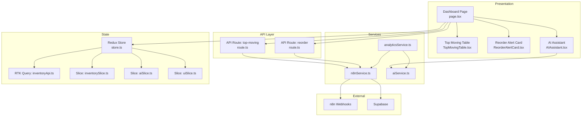
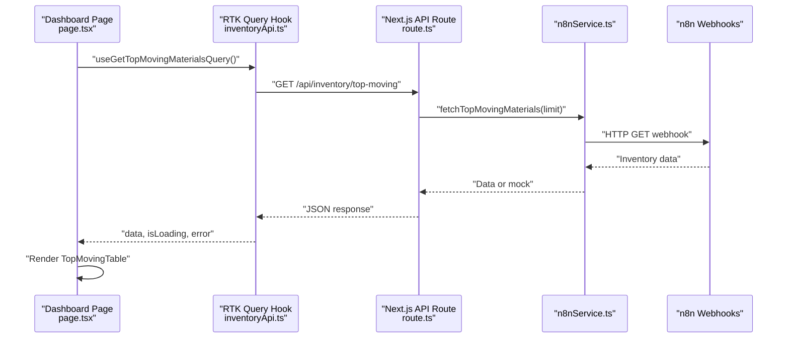
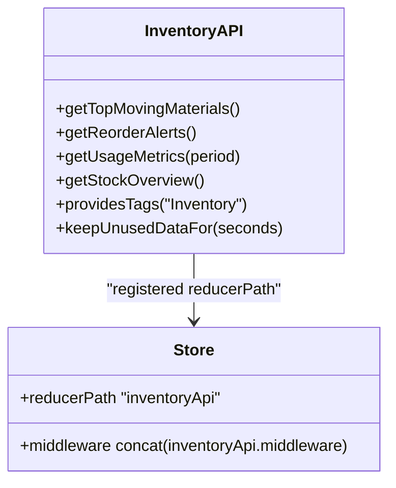
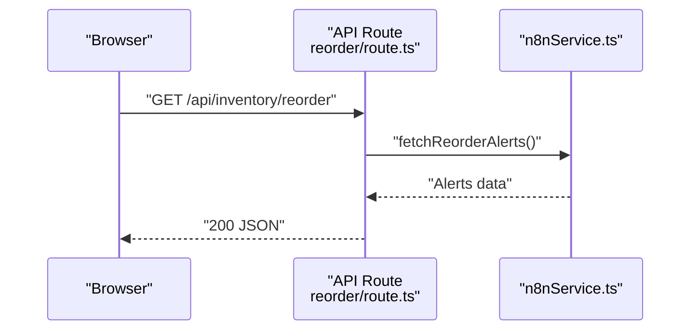
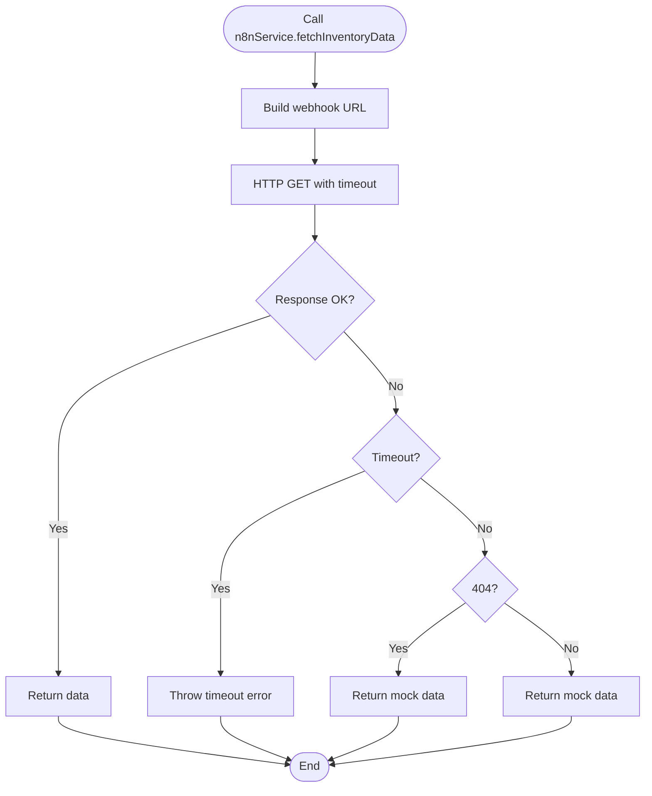
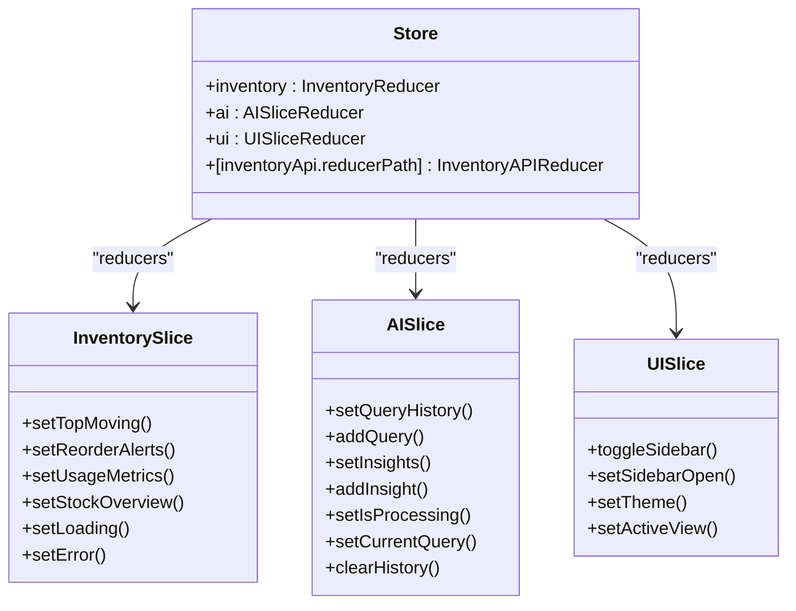
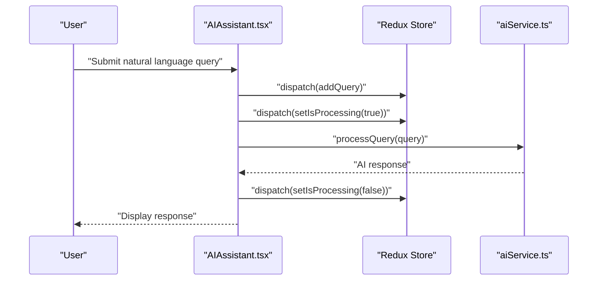
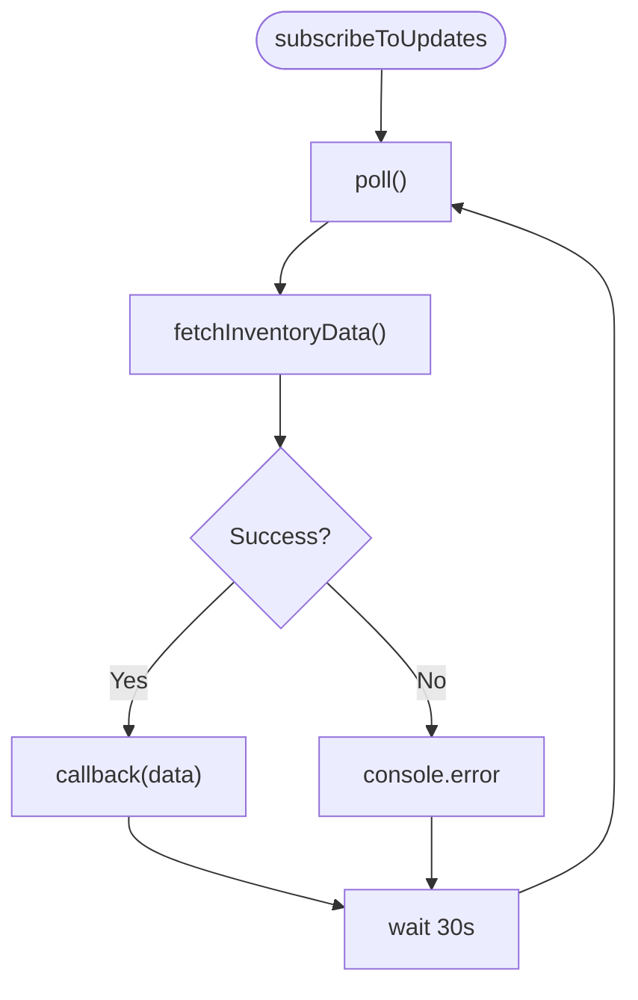
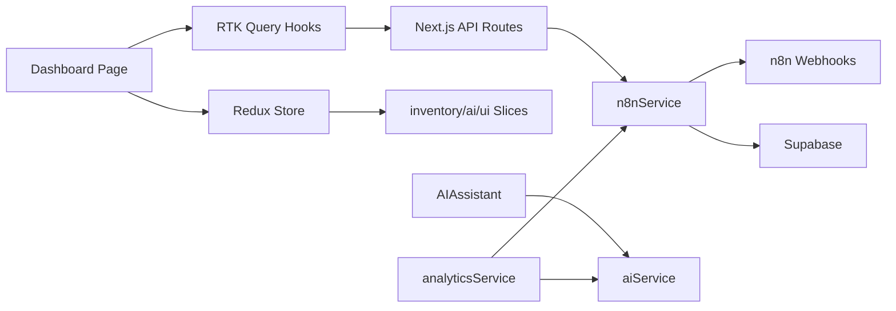

# Data Flow Architecture

<cite>
**Referenced Files in This Document**
- [store.ts](file://src/app/store.ts)
- [inventoryApi.ts](file://src/store/api/inventoryApi.ts)
- [inventorySlice.ts](file://src/store/slices/inventorySlice.ts)
- [aiSlice.ts](file://src/store/slices/aiSlice.ts)
- [uiSlice.ts](file://src/store/slices/uiSlice.ts)
- [route.ts (top-moving)](file://src/app/api/inventory/top-moving/route.ts)
- [route.ts (reorder)](file://src/app/api/inventory/reorder/route.ts)
- [n8nService.ts](file://src/services/n8nService.ts)
- [aiService.ts](file://src/services/aiService.ts)
- [analyticsService.ts](file://src/services/analyticsService.ts)
- [page.tsx (dashboard)](file://src/app/dashboard/page.tsx)
- [TopMovingTable.tsx](file://src/components/inventory/TopMovingTable.tsx)
- [ReorderAlertCard.tsx](file://src/components/inventory/ReorderAlertCard.tsx)
- [AIAssistant.tsx](file://src/components/ai/AIAssistant.tsx)
- [useRedux.ts](file://src/hooks/useRedux.ts)
- [supabase.ts](file://src/lib/supabase.ts)
</cite>

## Table of Contents
1. [Introduction](#introduction)
2. [Project Structure](#project-structure)
3. [Core Components](#core-components)
4. [Architecture Overview](#architecture-overview)
5. [Detailed Component Analysis](#detailed-component-analysis)
6. [Dependency Analysis](#dependency-analysis)
7. [Performance Considerations](#performance-considerations)
8. [Troubleshooting Guide](#troubleshooting-guide)
9. [Conclusion](#conclusion)

## Introduction
This document describes the end-to-end data flow architecture of the dashboard-ai system. It traces data from external sources (via n8n webhooks) through Next.js API routes, RTK Query, Redux store slices, and React components. It also explains real-time synchronization via polling, caching strategies, state management patterns, typed endpoints, data transformation, error handling, retry mechanisms, and performance optimizations.

## Project Structure
The system follows a layered architecture:
- Presentation Layer: Next.js pages and React components
- Services Layer: AI, analytics, and n8n integrations
- API Layer: Next.js API routes exposing inventory endpoints
- State Layer: Redux store with RTK Query and slice reducers
- External Systems: n8n webhooks and Supabase (non-data store)

**Diagram sources**
- [page.tsx (dashboard):17-127](file://src/app/dashboard/page.tsx#L17-L127)
- [TopMovingTable.tsx:19-99](file://src/components/inventory/TopMovingTable.tsx#L19-L99)
- [ReorderAlertCard.tsx:19-104](file://src/components/inventory/ReorderAlertCard.tsx#L19-L104)
- [AIAssistant.tsx:23-119](file://src/components/ai/AIAssistant.tsx#L23-L119)
- [n8nService.ts:16-188](file://src/services/n8nService.ts#L16-L188)
- [aiService.ts:18-218](file://src/services/aiService.ts#L18-L218)
- [analyticsService.ts:13-133](file://src/services/analyticsService.ts#L13-L133)
- [route.ts (top-moving):4-24](file://src/app/api/inventory/top-moving/route.ts#L4-L24)
- [route.ts (reorder):4-17](file://src/app/api/inventory/reorder/route.ts#L4-L17)
- [store.ts:7-26](file://src/app/store.ts#L7-L26)
- [inventoryApi.ts:23-56](file://src/store/api/inventoryApi.ts#L23-L56)
- [inventorySlice.ts:21-55](file://src/store/slices/inventorySlice.ts#L21-L55)
- [aiSlice.ts:17-55](file://src/store/slices/aiSlice.ts#L17-L55)
- [uiSlice.ts:15-41](file://src/store/slices/uiSlice.ts#L15-L41)

**Section sources**
- [store.ts:7-26](file://src/app/store.ts#L7-L26)
- [inventoryApi.ts:23-56](file://src/store/api/inventoryApi.ts#L23-L56)
- [inventorySlice.ts:21-55](file://src/store/slices/inventorySlice.ts#L21-L55)
- [aiSlice.ts:17-55](file://src/store/slices/aiSlice.ts#L17-L55)
- [uiSlice.ts:15-41](file://src/store/slices/uiSlice.ts#L15-L41)

## Core Components
- Redux Store: Composes reducers for inventory, AI, UI, and RTK Query’s inventoryApi.
- RTK Query inventoryApi: Defines typed endpoints for inventory data with caching and tagging.
- Slice Reducers:
  - inventorySlice: Manages top-moving, reorder alerts, usage metrics, stock overview, loading, and errors.
  - aiSlice: Manages query history, insights, processing state, and current query.
  - uiSlice: Manages sidebar state, theme, and active view.
- Services:
  - n8nService: Fetches inventory data from n8n webhooks with fallback to mock data and periodic polling.
  - aiService: Processes natural language queries and generates insights using a dedicated AI model.
  - analyticsService: Orchestrates predictions and anomaly detection using n8n data and AI service.
- API Routes: Expose Next.js API endpoints that delegate to n8nService.
- Components: Render dashboards, tables, cards, and the AI assistant, consuming RTK Query hooks and Redux selectors.

**Section sources**
- [store.ts:7-26](file://src/app/store.ts#L7-L26)
- [inventoryApi.ts:23-56](file://src/store/api/inventoryApi.ts#L23-L56)
- [inventorySlice.ts:21-55](file://src/store/slices/inventorySlice.ts#L21-L55)
- [aiSlice.ts:17-55](file://src/store/slices/aiSlice.ts#L17-L55)
- [uiSlice.ts:15-41](file://src/store/slices/uiSlice.ts#L15-L41)
- [n8nService.ts:16-188](file://src/services/n8nService.ts#L16-L188)
- [aiService.ts:18-218](file://src/services/aiService.ts#L18-L218)
- [analyticsService.ts:13-133](file://src/services/analyticsService.ts#L13-L133)
- [route.ts (top-moving):4-24](file://src/app/api/inventory/top-moving/route.ts#L4-L24)
- [route.ts (reorder):4-17](file://src/app/api/inventory/reorder/route.ts#L4-L17)

## Architecture Overview
The data pathway begins at the presentation layer, which triggers RTK Query hooks. These hooks call the inventoryApi endpoints, which delegate to Next.js API routes. The API routes fetch data from n8nService, which retrieves inventory data from n8n webhooks. On failure, n8nService falls back to mock data. RTK Query caches responses and invalidates them via tag types. Components render the cached data, while the AI assistant interacts with aiService independently.

**Diagram sources**
- [page.tsx (dashboard):18-18](file://src/app/dashboard/page.tsx#L18-L18)
- [inventoryApi.ts:28-32](file://src/store/api/inventoryApi.ts#L28-L32)
- [route.ts (top-moving):4-24](file://src/app/api/inventory/top-moving/route.ts#L4-L24)
- [n8nService.ts:136-138](file://src/services/n8nService.ts#L136-L138)

## Detailed Component Analysis

### RTK Query: inventoryApi
- Endpoints:
  - getTopMovingMaterials: Returns an array of materials with usage velocity and trend.
  - getReorderAlerts: Returns alert items with urgency and suggested quantities.
  - getUsageMetrics: Accepts a period parameter and returns consumption/forecast series.
  - getStockOverview: Returns aggregated stock metrics.
- Caching:
  - Tag type "Inventory" enables cache tagging.
  - keepUnusedDataFor controls cache retention per endpoint.
- Integration:
  - Endpoints map to Next.js API routes under /api/inventory/*.
  - Hooks generated for each endpoint.

**Diagram sources**
- [inventoryApi.ts:23-56](file://src/store/api/inventoryApi.ts#L23-L56)
- [store.ts:12-15](file://src/app/store.ts#L12-L15)

**Section sources**
- [inventoryApi.ts:23-56](file://src/store/api/inventoryApi.ts#L23-L56)

### API Routes: Inventory Endpoints
- top-moving:
  - Parses query parameters (e.g., limit).
  - Delegates to n8nService for data retrieval.
  - Returns JSON or 404/500 on error.
- reorder:
  - Calls n8nService for reorder alerts.
  - Returns JSON or 500 on error.

**Diagram sources**
- [route.ts (reorder):4-17](file://src/app/api/inventory/reorder/route.ts#L4-L17)
- [n8nService.ts:143-144](file://src/services/n8nService.ts#L143-L144)

**Section sources**
- [route.ts (top-moving):4-24](file://src/app/api/inventory/top-moving/route.ts#L4-L24)
- [route.ts (reorder):4-17](file://src/app/api/inventory/reorder/route.ts#L4-L17)

### Services: n8nService and aiService
- n8nService:
  - Fetches inventory data from n8n webhooks with Authorization header.
  - Implements timeout and error handling.
  - Provides fallback to mock data for resilience.
  - Supports periodic polling via subscribeToUpdates with 30-second intervals.
- aiService:
  - Calls a dedicated AI model endpoint with system/user prompts.
  - Parses structured responses and provides fallbacks when parsing fails.
  - Independent from n8n data; used for natural language processing and insights.

**Diagram sources**
- [n8nService.ts:29-56](file://src/services/n8nService.ts#L29-L56)

**Section sources**
- [n8nService.ts:16-188](file://src/services/n8nService.ts#L16-L188)
- [aiService.ts:18-218](file://src/services/aiService.ts#L18-L218)

### Redux Store and Slices
- Store composition:
  - inventoryApi reducerPath and middleware integrated.
  - inventory, ai, ui reducers registered.
- inventorySlice:
  - Holds arrays/lists and loading/error flags.
  - Provides actions to update top-moving, reorder alerts, usage metrics, and stock overview.
- aiSlice:
  - Manages query history, insights, processing flag, and current query.
  - Includes mutation helpers like addQuery and addInsight.
- uiSlice:
  - Controls sidebar open state, theme, and active view.

**Diagram sources**
- [store.ts:7-26](file://src/app/store.ts#L7-L26)
- [inventorySlice.ts:21-55](file://src/store/slices/inventorySlice.ts#L21-L55)
- [aiSlice.ts:17-55](file://src/store/slices/aiSlice.ts#L17-L55)
- [uiSlice.ts:15-41](file://src/store/slices/uiSlice.ts#L15-L41)

**Section sources**
- [store.ts:7-26](file://src/app/store.ts#L7-L26)
- [inventorySlice.ts:21-55](file://src/store/slices/inventorySlice.ts#L21-L55)
- [aiSlice.ts:17-55](file://src/store/slices/aiSlice.ts#L17-L55)
- [uiSlice.ts:15-41](file://src/store/slices/uiSlice.ts#L15-L41)

### Components: Rendering and Interaction
- Dashboard Page:
  - Uses RTK Query hooks to load top-moving, reorder alerts, and stock overview.
  - Renders loading states, error alerts, and data-driven widgets.
- TopMovingTable:
  - Displays materials with trend icons and velocity metrics.
- ReorderAlertCard:
  - Renders alerts with urgency-based styling and suggested order quantities.
- AIAssistant:
  - Dispatches queries to aiSlice, calls aiService, and displays responses.
  - Integrates with useRedux hooks for typed dispatch and selector.

**Diagram sources**
- [AIAssistant.tsx:23-119](file://src/components/ai/AIAssistant.tsx#L23-L119)
- [aiService.ts:33-74](file://src/services/aiService.ts#L33-L74)
- [useRedux.ts:1-6](file://src/hooks/useRedux.ts#L1-L6)

**Section sources**
- [page.tsx (dashboard):17-127](file://src/app/dashboard/page.tsx#L17-L127)
- [TopMovingTable.tsx:19-99](file://src/components/inventory/TopMovingTable.tsx#L19-L99)
- [ReorderAlertCard.tsx:19-104](file://src/components/inventory/ReorderAlertCard.tsx#L19-L104)
- [AIAssistant.tsx:23-119](file://src/components/ai/AIAssistant.tsx#L23-L119)
- [useRedux.ts:1-6](file://src/hooks/useRedux.ts#L1-L6)

### Real-Time Updates and Polling
- n8nService.subscribeToUpdates periodically polls n8n webhooks every 30 seconds.
- On successful poll, callback receives fresh data; on error, logs and continues polling.
- This provides near-real-time synchronization of inventory data without WebSockets.

**Diagram sources**
- [n8nService.ts:165-185](file://src/services/n8nService.ts#L165-L185)

**Section sources**
- [n8nService.ts:165-185](file://src/services/n8nService.ts#L165-L185)

### Data Transformation and Error Handling
- API Routes:
  - Transform n8nService responses into JSON for clients.
  - Return 404 when no data is available; return 500 on internal errors.
- n8nService:
  - Enforces timeouts; on 404 or errors, returns mock data for resilience.
  - Provides structured mock datasets for top-moving, reorder-alerts, stock-overview, and usage-metrics.
- aiService:
  - Validates and parses AI responses; falls back to deterministic insights when parsing fails.
- analyticsService:
  - Orchestrates predictions and anomaly detection using n8n data and AI service; falls back to mock predictions when needed.

**Section sources**
- [route.ts (top-moving):4-24](file://src/app/api/inventory/top-moving/route.ts#L4-L24)
- [route.ts (reorder):4-17](file://src/app/api/inventory/reorder/route.ts#L4-L17)
- [n8nService.ts:30-56](file://src/services/n8nService.ts#L30-L56)
- [n8nService.ts:86-131](file://src/services/n8nService.ts#L86-L131)
- [aiService.ts:95-104](file://src/services/aiService.ts#L95-L104)
- [analyticsService.ts:17-41](file://src/services/analyticsService.ts#L17-L41)

## Dependency Analysis
- Presentation depends on:
  - RTK Query hooks for data fetching.
  - Redux selectors for UI state.
- RTK Query depends on:
  - Next.js API routes for backend endpoints.
- API routes depend on:
  - n8nService for inventory data retrieval.
- n8nService depends on:
  - n8n webhooks and Supabase (for credentials and user settings).
- aiService and analyticsService are independent from n8n data but integrate with it for insights.

**Diagram sources**
- [page.tsx (dashboard):17-127](file://src/app/dashboard/page.tsx#L17-L127)
- [inventoryApi.ts:23-56](file://src/store/api/inventoryApi.ts#L23-L56)
- [route.ts (top-moving):4-24](file://src/app/api/inventory/top-moving/route.ts#L4-L24)
- [n8nService.ts:16-188](file://src/services/n8nService.ts#L16-L188)
- [aiService.ts:18-218](file://src/services/aiService.ts#L18-L218)
- [analyticsService.ts:13-133](file://src/services/analyticsService.ts#L13-L133)
- [store.ts:7-26](file://src/app/store.ts#L7-L26)
- [inventorySlice.ts:21-55](file://src/store/slices/inventorySlice.ts#L21-L55)
- [aiSlice.ts:17-55](file://src/store/slices/aiSlice.ts#L17-L55)
- [uiSlice.ts:15-41](file://src/store/slices/uiSlice.ts#L15-L41)

**Section sources**
- [store.ts:7-26](file://src/app/store.ts#L7-L26)
- [inventoryApi.ts:23-56](file://src/store/api/inventoryApi.ts#L23-L56)
- [n8nService.ts:16-188](file://src/services/n8nService.ts#L16-L188)
- [aiService.ts:18-218](file://src/services/aiService.ts#L18-L218)
- [analyticsService.ts:13-133](file://src/services/analyticsService.ts#L13-L133)

## Performance Considerations
- Caching:
  - keepUnusedDataFor configured per endpoint to balance freshness and performance.
  - Tag type "Inventory" supports cache tagging for targeted invalidation.
- Polling:
  - 30-second intervals for near-real-time updates; tune based on data volatility and cost.
- Error Resilience:
  - Mock fallbacks prevent UI degradation during upstream failures.
- Network:
  - Request timeouts reduce hanging requests; consider retry policies at the service layer if needed.
- Rendering:
  - Components check loading and error states to avoid unnecessary re-renders.

[No sources needed since this section provides general guidance]

## Troubleshooting Guide
- API Route Failures:
  - Verify Next.js API route handlers return appropriate status codes and JSON payloads.
  - Check n8n webhook availability and authentication headers.
- RTK Query Issues:
  - Confirm endpoint URLs match API routes and that middleware is included in the store.
  - Validate that tag types and keepUnusedDataFor values are set appropriately.
- Service Errors:
  - Inspect n8nService error branches and mock fallbacks.
  - Ensure aiService environment variables are configured and responses parse correctly.
- UI Rendering:
  - Use loading flags and error checks in components to present meaningful feedback.

**Section sources**
- [route.ts (top-moving):4-24](file://src/app/api/inventory/top-moving/route.ts#L4-L24)
- [route.ts (reorder):4-17](file://src/app/api/inventory/reorder/route.ts#L4-L17)
- [n8nService.ts:30-56](file://src/services/n8nService.ts#L30-L56)
- [aiService.ts:33-74](file://src/services/aiService.ts#L33-L74)
- [page.tsx (dashboard):24-30](file://src/app/dashboard/page.tsx#L24-L30)

## Conclusion
The dashboard-ai system integrates external n8n webhooks with a robust data pipeline powered by Next.js API routes, RTK Query, and Redux. Real-time synchronization is achieved through periodic polling, while caching and fallback mechanisms ensure resilience. The typed endpoints, slice reducers, and component-driven rendering provide a maintainable and scalable architecture for inventory insights and AI-powered assistance.