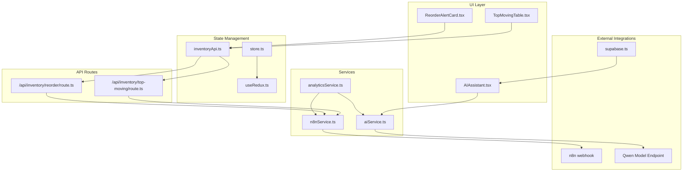
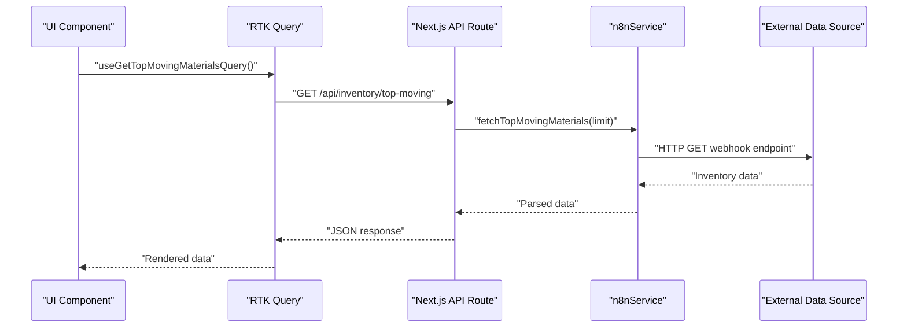
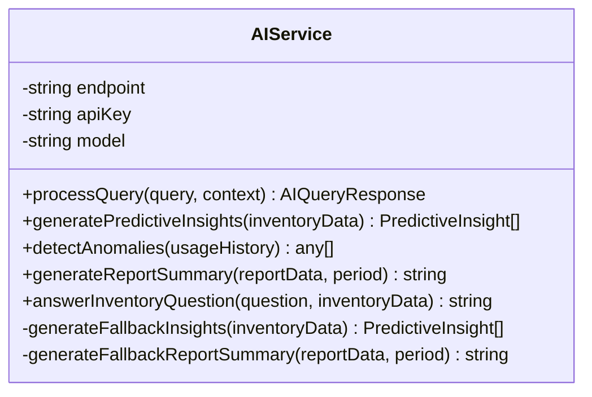
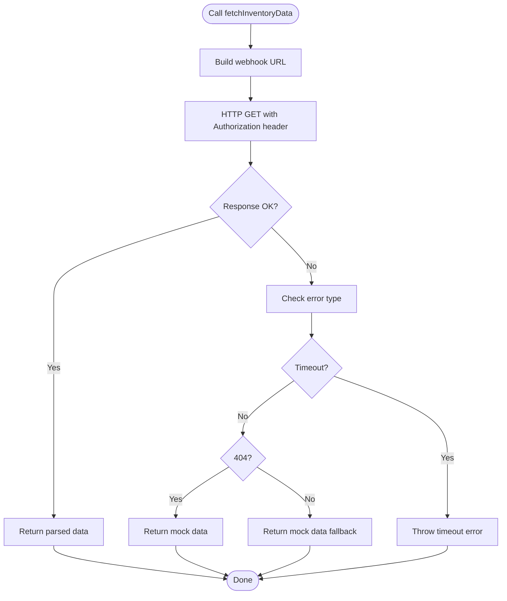
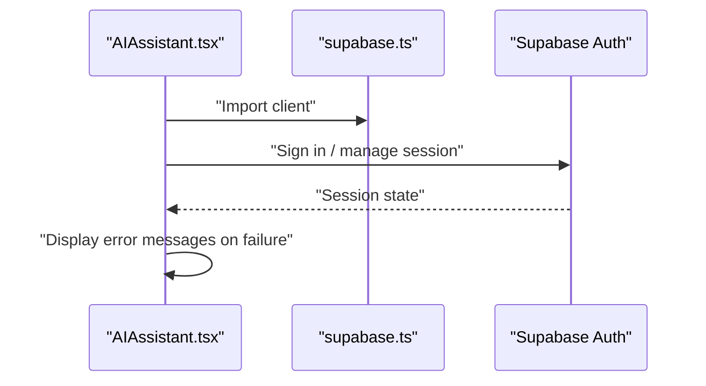
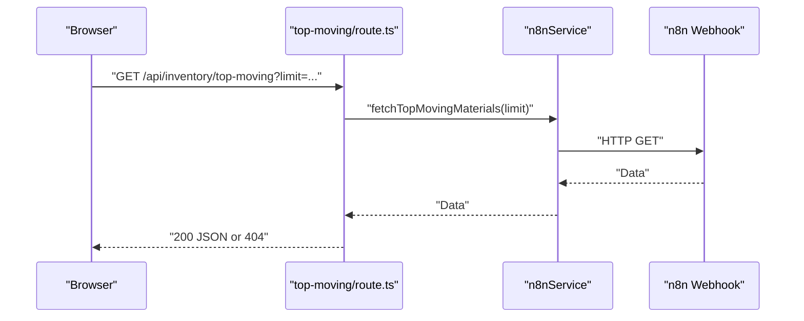
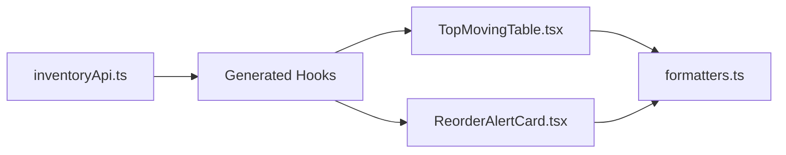
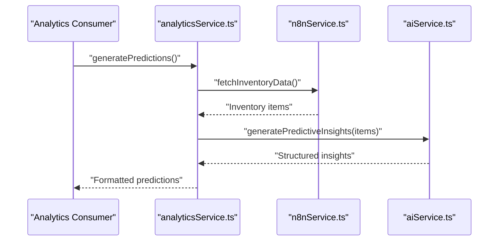
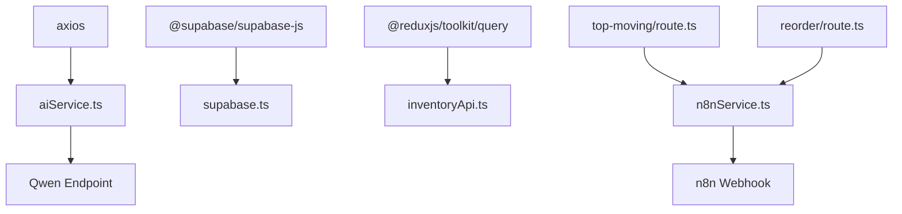

# Integration Patterns

<cite>
**Referenced Files in This Document**
- [aiService.ts](file://src/services/aiService.ts)
- [n8nService.ts](file://src/services/n8nService.ts)
- [supabase.ts](file://src/lib/supabase.ts)
- [route.ts](file://src/app/api/inventory/reorder/route.ts)
- [route.ts](file://src/app/api/inventory/top-moving/route.ts)
- [inventoryApi.ts](file://src/store/api/inventoryApi.ts)
- [AIAssistant.tsx](file://src/components/ai/AIAssistant.tsx)
- [TopMovingTable.tsx](file://src/components/inventory/TopMovingTable.tsx)
- [ReorderAlertCard.tsx](file://src/components/inventory/ReorderAlertCard.tsx)
- [analyticsService.ts](file://src/services/analyticsService.ts)
- [formatters.ts](file://src/utils/formatters.ts)
- [store.ts](file://src/store/store.ts)
- [useRedux.ts](file://src/hooks/useRedux.ts)
- [package.json](file://package.json)
</cite>

## Table of Contents
1. [Introduction](#introduction)
2. [Project Structure](#project-structure)
3. [Core Components](#core-components)
4. [Architecture Overview](#architecture-overview)
5. [Detailed Component Analysis](#detailed-component-analysis)
6. [Dependency Analysis](#dependency-analysis)
7. [Performance Considerations](#performance-considerations)
8. [Troubleshooting Guide](#troubleshooting-guide)
9. [Conclusion](#conclusion)
10. [Appendices](#appendices)

## Introduction
This document describes the integration patterns used by the dashboard-ai system to connect with external services. It focuses on:
- AI service integration with an external Qwen model provider
- n8n webhook service integration for inventory data polling and synchronization
- Supabase authentication and user session management patterns
- API route patterns for inventory endpoints and their interaction with external data sources
- Error handling, retry, and fallback strategies
- Security considerations, authentication methods, and rate limiting
- Guidelines for extending the system with new external services while maintaining backward compatibility

## Project Structure
The system is a Next.js application using TypeScript, Redux Toolkit Query for API state management, Material UI for UI components, and Axios for HTTP requests. External integrations are encapsulated in dedicated service modules and exposed via Next.js API routes.

**Diagram sources**
- [AIAssistant.tsx:1-120](file://src/components/ai/AIAssistant.tsx#L1-L120)
- [TopMovingTable.tsx:1-108](file://src/components/inventory/TopMovingTable.tsx#L1-L108)
- [ReorderAlertCard.tsx:1-105](file://src/components/inventory/ReorderAlertCard.tsx#L1-L105)
- [inventoryApi.ts:1-57](file://src/store/api/inventoryApi.ts#L1-L57)
- [store.ts:1-27](file://src/store/store.ts#L1-L27)
- [useRedux.ts:1-6](file://src/hooks/useRedux.ts#L1-L6)
- [aiService.ts:1-219](file://src/services/aiService.ts#L1-L219)
- [n8nService.ts:1-242](file://src/services/n8nService.ts#L1-L242)
- [analyticsService.ts:1-134](file://src/services/analyticsService.ts#L1-L134)
- [supabase.ts:1-21](file://src/lib/supabase.ts#L1-L21)
- [route.ts:1-25](file://src/app/api/inventory/top-moving/route.ts#L1-L25)
- [route.ts:1-18](file://src/app/api/inventory/reorder/route.ts#L1-L18)

**Section sources**
- [package.json:1-39](file://package.json#L1-L39)
- [store.ts:1-27](file://src/store/store.ts#L1-L27)
- [inventoryApi.ts:1-57](file://src/store/api/inventoryApi.ts#L1-L57)

## Core Components
- AI Service: Encapsulates interactions with an external Qwen model endpoint, including query processing, predictive insights, anomaly detection, and report summarization. Implements structured response parsing and fallback logic.
- n8n Service: Manages inventory data retrieval from n8n webhooks, including endpoint routing, timeouts, error handling, mock data fallback, and periodic polling.
- Supabase Client: Provides authentication and credential management for users, distinct from inventory data storage.
- API Routes: Expose inventory endpoints to the UI layer via Next.js API handlers.
- Redux Toolkit Query: Defines typed endpoints and caching behavior for inventory data.
- Analytics Service: Orchestrates AI and n8n services to generate predictions and detect anomalies.

**Section sources**
- [aiService.ts:1-219](file://src/services/aiService.ts#L1-L219)
- [n8nService.ts:1-242](file://src/services/n8nService.ts#L1-L242)
- [supabase.ts:1-21](file://src/lib/supabase.ts#L1-L21)
- [route.ts:1-25](file://src/app/api/inventory/top-moving/route.ts#L1-L25)
- [route.ts:1-18](file://src/app/api/inventory/reorder/route.ts#L1-L18)
- [inventoryApi.ts:1-57](file://src/store/api/inventoryApi.ts#L1-L57)
- [analyticsService.ts:1-134](file://src/services/analyticsService.ts#L1-L134)

## Architecture Overview
The system follows a layered architecture:
- UI components trigger actions and queries.
- Redux Toolkit Query manages data fetching and caching.
- API routes delegate to service modules.
- Services encapsulate external integration logic with robust error handling and fallbacks.
- AI and n8n integrations are independent but coordinated by analytics orchestration.

**Diagram sources**
- [TopMovingTable.tsx:1-108](file://src/components/inventory/TopMovingTable.tsx#L1-L108)
- [inventoryApi.ts:28-32](file://src/store/api/inventoryApi.ts#L28-L32)
- [route.ts:1-25](file://src/app/api/inventory/top-moving/route.ts#L1-L25)
- [n8nService.ts:189-191](file://src/services/n8nService.ts#L189-L191)

## Detailed Component Analysis

### AI Service Integration (Qwen Model)
- Configuration: Reads endpoint, API key, and model name from environment variables.
- Query Processing: Sends a chat completion request with a system prompt and user message, returning a structured response.
- Predictive Insights: Generates insights from inventory data using AI, with JSON parsing and fallback logic.
- Anomaly Detection: Analyzes usage history and returns structured anomalies.
- Report Summaries: Produces executive summaries with fallback generation.
- Error Handling: Centralized try/catch with informative error propagation.

**Diagram sources**
- [aiService.ts:18-219](file://src/services/aiService.ts#L18-L219)

**Section sources**
- [aiService.ts:18-219](file://src/services/aiService.ts#L18-L219)

### n8n Webhook Integration
- Endpoint Routing: Supports optional endpoint suffixes (e.g., top-moving, reorder-alerts).
- Authentication: Uses Authorization header with a static API key.
- Timeout and Error Handling: Configures a 10-second timeout; distinguishes between network errors, 404 responses, and other failures.
- Fallback Strategy: Returns mock data when the webhook is unavailable or returns 404.
- Polling: Periodic polling with a 30-second interval and a cleanup function.

**Diagram sources**
- [n8nService.ts:29-56](file://src/services/n8nService.ts#L29-L56)

**Section sources**
- [n8nService.ts:16-242](file://src/services/n8nService.ts#L16-L242)

### Supabase Authentication and Session Management
- Client Initialization: Creates a Supabase client using environment variables for URL and anonymous key.
- Purpose: Handles user authentication and stores user preferences and settings; inventory data is not stored here.
- Usage Pattern: The AI assistant component logs errors and displays user-friendly messages without exposing credentials.

**Diagram sources**
- [supabase.ts:1-21](file://src/lib/supabase.ts#L1-L21)
- [AIAssistant.tsx:36-45](file://src/components/ai/AIAssistant.tsx#L36-L45)

**Section sources**
- [supabase.ts:1-21](file://src/lib/supabase.ts#L1-L21)
- [AIAssistant.tsx:1-120](file://src/components/ai/AIAssistant.tsx#L1-L120)

### API Route Patterns for Inventory Endpoints
- Top-Moving Materials: Accepts a limit query parameter, delegates to n8nService, and returns JSON or 404 when empty.
- Reorder Alerts: Returns reorder alerts via n8nService with standardized error handling.
- Error Handling: Both routes log errors and return JSON error payloads with appropriate HTTP status codes.

**Diagram sources**
- [route.ts:1-25](file://src/app/api/inventory/top-moving/route.ts#L1-L25)
- [n8nService.ts:189-191](file://src/services/n8nService.ts#L189-L191)

**Section sources**
- [route.ts:1-25](file://src/app/api/inventory/top-moving/route.ts#L1-L25)
- [route.ts:1-18](file://src/app/api/inventory/reorder/route.ts#L1-L18)

### Data Flow and UI Integration
- Redux Toolkit Query defines typed endpoints and caching durations.
- UI components consume hooks generated by RTK Query to render data.
- Formatting utilities support consistent presentation of numeric and temporal data.

**Diagram sources**
- [inventoryApi.ts:28-47](file://src/store/api/inventoryApi.ts#L28-L47)
- [TopMovingTable.tsx:1-108](file://src/components/inventory/TopMovingTable.tsx#L1-L108)
- [ReorderAlertCard.tsx:1-105](file://src/components/inventory/ReorderAlertCard.tsx#L1-L105)
- [formatters.ts:1-89](file://src/utils/formatters.ts#L1-L89)

**Section sources**
- [inventoryApi.ts:1-57](file://src/store/api/inventoryApi.ts#L1-L57)
- [TopMovingTable.tsx:1-108](file://src/components/inventory/TopMovingTable.tsx#L1-L108)
- [ReorderAlertCard.tsx:1-105](file://src/components/inventory/ReorderAlertCard.tsx#L1-L105)
- [formatters.ts:1-89](file://src/utils/formatters.ts#L1-L89)

### Analytics Orchestration
- Predictive Insights: Fetches inventory data from n8n, passes it to AI service, and formats results with risk levels.
- Anomaly Detection: Retrieves usage metrics from n8n and applies AI analysis.
- Fallbacks: Provides mock predictions when upstream data is unavailable.

**Diagram sources**
- [analyticsService.ts:17-41](file://src/services/analyticsService.ts#L17-L41)
- [n8nService.ts:29-41](file://src/services/n8nService.ts#L29-L41)
- [aiService.ts:79-109](file://src/services/aiService.ts#L79-L109)

**Section sources**
- [analyticsService.ts:1-134](file://src/services/analyticsService.ts#L1-L134)

## Dependency Analysis
- External Dependencies: Axios for HTTP, @supabase/supabase-js for authentication, Redux Toolkit Query for API state management.
- Internal Coupling: Services are cohesive and isolated; API routes depend on services; UI depends on RTK Query hooks.
- Environment Variables: AI endpoint, API key, and n8n webhook URL/key are loaded from process environment.

**Diagram sources**
- [package.json:11-26](file://package.json#L11-L26)
- [aiService.ts:1-2](file://src/services/aiService.ts#L1-L2)
- [n8nService.ts:1-2](file://src/services/n8nService.ts#L1-L2)
- [supabase.ts:1-6](file://src/lib/supabase.ts#L1-L6)
- [inventoryApi.ts](file://src/store/api/inventoryApi.ts#L1)
- [route.ts:1-2](file://src/app/api/inventory/top-moving/route.ts#L1-L2)
- [route.ts:1-2](file://src/app/api/inventory/reorder/route.ts#L1-L2)

**Section sources**
- [package.json:11-26](file://package.json#L11-L26)
- [store.ts:1-27](file://src/store/store.ts#L1-L27)

## Performance Considerations
- Caching: RTK Query caches inventory data for configurable durations to reduce repeated network calls.
- Polling Interval: n8n polling runs every 30 seconds; adjust based on data volatility and cost.
- Timeouts: Webhook requests enforce a 10-second timeout to prevent long blocking calls.
- Concurrency: Avoid overlapping requests unnecessarily; leverage caching and background polling.

[No sources needed since this section provides general guidance]

## Troubleshooting Guide
- AI Service Failures:
  - Symptom: Queries fail or return generic errors.
  - Actions: Verify endpoint, API key, and model name environment variables; check AI provider availability; review structured response parsing and fallbacks.
- n8n Webhook Failures:
  - Symptom: 404 responses or timeouts.
  - Actions: Confirm webhook URL and API key; inspect fallback logic returning mock data; validate endpoint suffixes.
- API Route Errors:
  - Symptom: 500 responses from inventory endpoints.
  - Actions: Inspect route handlers for thrown errors; ensure proper JSON responses and status codes.
- Authentication Issues:
  - Symptom: Supabase-related UI errors.
  - Actions: Verify Supabase URL and anonymous key; confirm client initialization and session handling.

**Section sources**
- [aiService.ts:70-74](file://src/services/aiService.ts#L70-L74)
- [n8nService.ts:42-56](file://src/services/n8nService.ts#L42-L56)
- [route.ts:10-16](file://src/app/api/inventory/top-moving/route.ts#L10-L16)
- [route.ts:10-16](file://src/app/api/inventory/reorder/route.ts#L10-L16)

## Conclusion
The dashboard-ai system integrates external services through well-defined service modules and API routes. AI and n8n integrations are decoupled, with robust error handling and fallbacks. Supabase handles authentication and user preferences independently from inventory data. RTK Query provides predictable caching and UI integration. The architecture supports extension and maintains backward compatibility through typed endpoints and environment-driven configuration.

[No sources needed since this section summarizes without analyzing specific files]

## Appendices

### Security Considerations
- Authentication:
  - AI Service: Uses Authorization header with a static API key; ensure keys are rotated and stored securely.
  - n8n Service: Uses Authorization header with a static API key; secure the key and restrict webhook access.
  - Supabase: Use server-side credentials and avoid exposing anonymous keys on the client.
- Rate Limiting:
  - Implement provider-side limits for AI model access.
  - Apply client-side throttling for webhook polling to avoid overloading external systems.
- Secrets Management:
  - Store environment variables in a secrets manager; avoid committing sensitive values to version control.

[No sources needed since this section provides general guidance]

### Extending with New External Services
- Service Module:
  - Create a new service class similar to aiService and n8nService with clear responsibilities and error handling.
- API Route:
  - Add a new Next.js API route under src/app/api that delegates to the service module.
- RTK Query Endpoint:
  - Define a new endpoint in inventoryApi.ts with appropriate caching and typing.
- Fallbacks:
  - Implement mock data and error handling to maintain resilience during outages.
- Backward Compatibility:
  - Keep existing endpoints unchanged; introduce new endpoints with versioning or feature flags if needed.
  - Maintain consistent response shapes and error payloads.

[No sources needed since this section provides general guidance]