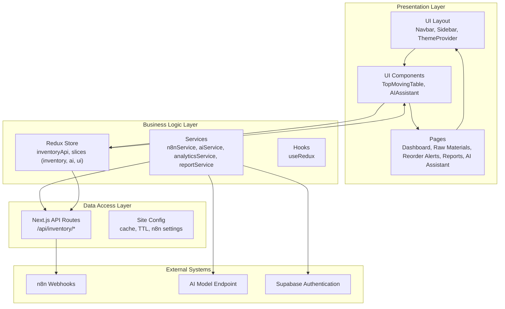
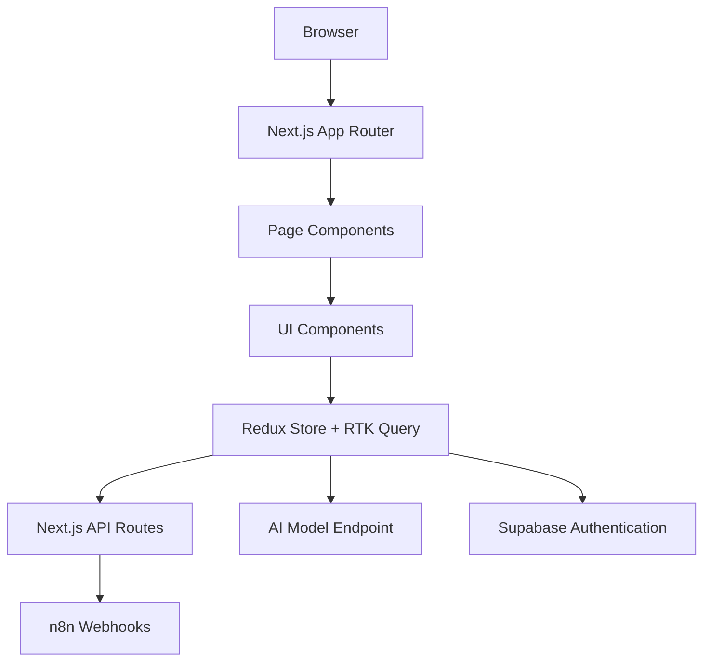
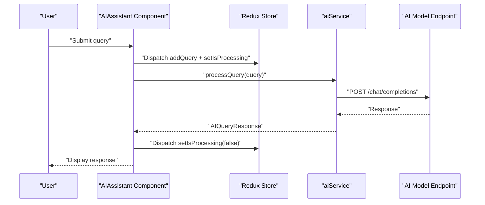
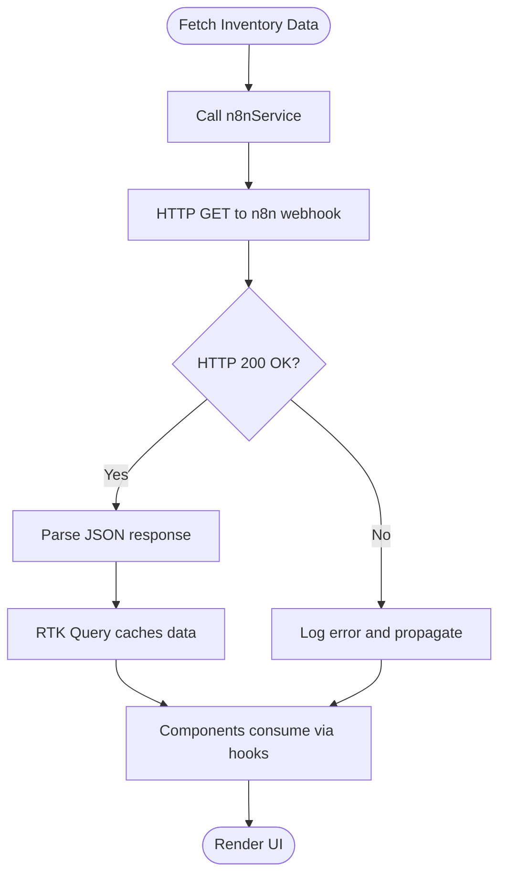
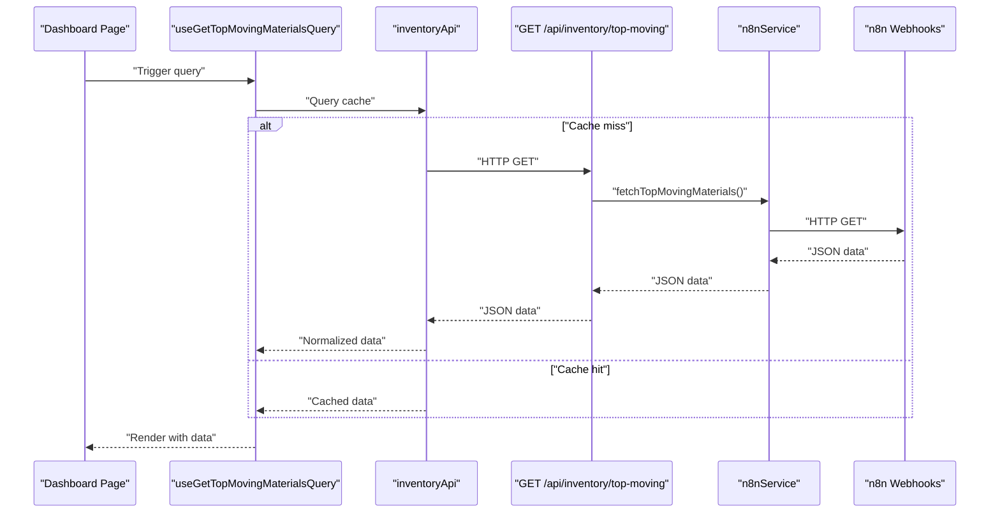
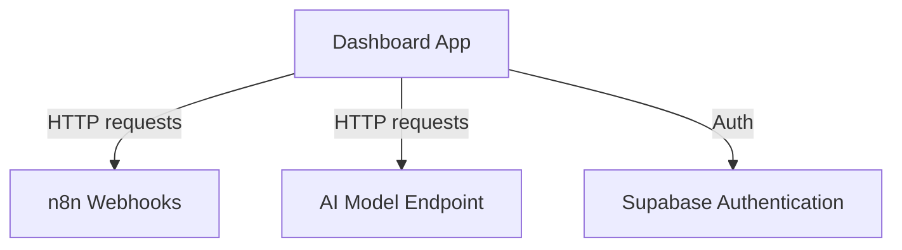
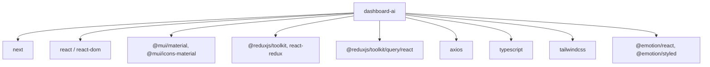

# System Design

<cite>
**Referenced Files in This Document**
- [README.md](file://README.md)
- [package.json](file://package.json)
- [next.config.ts](file://next.config.ts)
- [tsconfig.json](file://tsconfig.json)
- [tailwind.config.ts](file://tailwind.config.ts)
- [postcss.config.mjs](file://postcss.config.mjs)
- [src/app/layout.tsx](file://src/app/layout.tsx)
- [src/app/page.tsx](file://src/app/page.tsx)
- [src/app/dashboard/page.tsx](file://src/app/dashboard/page.tsx)
- [src/app/raw-materials/page.tsx](file://src/app/raw-materials/page.tsx)
- [src/app/reorder-alerts/page.tsx](file://src/app/reorder-alerts/page.tsx)
- [src/app/reports/page.tsx](file://src/app/reports/page.tsx)
- [src/app/ai-assistant/page.tsx](file://src/app/ai-assistant/page.tsx)
- [src/app/api/inventory/top-moving/route.ts](file://src/app/api/inventory/top-moving/route.ts)
- [src/app/api/inventory/reorder/route.ts](file://src/app/api/inventory/reorder/route.ts)
- [src/components/ui/Layout/Navbar.tsx](file://src/components/ui/Layout/Navbar.tsx)
- [src/components/ui/Layout/Sidebar.tsx](file://src/components/ui/Layout/Sidebar.tsx)
- [src/components/ui/Layout/ThemeProvider.tsx](file://src/components/ui/Layout/ThemeProvider.tsx)
- [src/components/inventory/TopMovingTable.tsx](file://src/components/inventory/TopMovingTable.tsx)
- [src/components/ai/AIAssistant.tsx](file://src/components/ai/AIAssistant.tsx)
- [src/hooks/useRedux.ts](file://src/hooks/useRedux.ts)
- [src/lib/supabase.ts](file://src/lib/supabase.ts)
- [src/services/n8nService.ts](file://src/services/n8nService.ts)
- [src/services/aiService.ts](file://src/services/aiService.ts)
- [src/services/analyticsService.ts](file://src/services/analyticsService.ts)
- [src/services/reportService.ts](file://src/services/reportService.ts)
- [src/store/store.ts](file://src/store/store.ts)
- [src/store/api/inventoryApi.ts](file://src/store/api/inventoryApi.ts)
- [src/store/slices/inventorySlice.ts](file://src/store/slices/inventorySlice.ts)
- [src/store/slices/aiSlice.ts](file://src/store/slices/aiSlice.ts)
- [src/store/slices/uiSlice.ts](file://src/store/slices/uiSlice.ts)
- [src/utils/formatters.ts](file://src/utils/formatters.ts)
- [src/config/site.config.ts](file://src/config/site.config.ts)
</cite>

## Table of Contents
1. [Introduction](#introduction)
2. [Project Structure](#project-structure)
3. [Core Components](#core-components)
4. [Architecture Overview](#architecture-overview)
5. [Detailed Component Analysis](#detailed-component-analysis)
6. [Dependency Analysis](#dependency-analysis)
7. [Performance Considerations](#performance-considerations)
8. [Troubleshooting Guide](#troubleshooting-guide)
9. [Conclusion](#conclusion)
10. [Appendices](#appendices)

## Introduction
This document describes the system design of the dashboard-ai application. It explains the layered architecture separating presentation, business logic, and data access, and documents the component-based architecture built with Next.js App Router, React, Material-UI, Redux Toolkit, and RTK Query. It also covers integrations with external services (n8n webhooks, AI models, and Supabase authentication), infrastructure requirements, scalability considerations, deployment topology, real-time synchronization, caching strategies, and performance optimization.

## Project Structure
The project follows a Next.js App Router structure with a clear separation of concerns:
- Presentation layer: React components under src/components and pages under src/app
- Business logic layer: Services under src/services and Redux slices under src/store/slices
- Data access layer: RTK Query endpoints under src/store/api and Next.js API routes under src/app/api

**Diagram sources**
- [src/app/layout.tsx:1-31](file://src/app/layout.tsx#L1-L31)
- [src/components/ui/Layout/Navbar.tsx:1-61](file://src/components/ui/Layout/Navbar.tsx#L1-L61)
- [src/components/ui/Layout/Sidebar.tsx:1-133](file://src/components/ui/Layout/Sidebar.tsx#L1-L133)
- [src/components/inventory/TopMovingTable.tsx:1-100](file://src/components/inventory/TopMovingTable.tsx#L1-L100)
- [src/components/ai/AIAssistant.tsx:1-120](file://src/components/ai/AIAssistant.tsx#L1-L120)
- [src/services/n8nService.ts:1-109](file://src/services/n8nService.ts#L1-L109)
- [src/services/aiService.ts:1-219](file://src/services/aiService.ts#L1-L219)
- [src/store/api/inventoryApi.ts:1-57](file://src/store/api/inventoryApi.ts#L1-L57)
- [src/app/api/inventory/top-moving/route.ts:1-25](file://src/app/api/inventory/top-moving/route.ts#L1-L25)
- [src/app/api/inventory/reorder/route.ts:1-18](file://src/app/api/inventory/reorder/route.ts#L1-L18)
- [src/config/site.config.ts:1-34](file://src/config/site.config.ts#L1-L34)

**Section sources**
- [src/app/layout.tsx:1-31](file://src/app/layout.tsx#L1-L31)
- [src/app/dashboard/page.tsx](file://src/app/dashboard/page.tsx)
- [src/app/raw-materials/page.tsx](file://src/app/raw-materials/page.tsx)
- [src/app/reorder-alerts/page.tsx](file://src/app/reorder-alerts/page.tsx)
- [src/app/reports/page.tsx](file://src/app/reports/page.tsx)
- [src/app/ai-assistant/page.tsx](file://src/app/ai-assistant/page.tsx)

## Core Components
- Presentation layer
  - UI layout: Navbar, Sidebar, ThemeProvider
  - Feature components: TopMovingTable, AIAssistant
  - Pages: dashboard, raw materials, reorder alerts, reports, AI assistant
- Business logic layer
  - Services: n8nService (inventory data), aiService (AI model), analyticsService, reportService
  - State management: Redux store with RTK Query inventoryApi and slices (inventory, ai, ui)
- Data access layer
  - Next.js API routes: /api/inventory/top-moving and /api/inventory/reorder
  - Site configuration: cache TTLs, n8n webhook settings

**Section sources**
- [src/components/ui/Layout/Navbar.tsx:1-61](file://src/components/ui/Layout/Navbar.tsx#L1-L61)
- [src/components/ui/Layout/Sidebar.tsx:1-133](file://src/components/ui/Layout/Sidebar.tsx#L1-L133)
- [src/components/inventory/TopMovingTable.tsx:1-100](file://src/components/inventory/TopMovingTable.tsx#L1-L100)
- [src/components/ai/AIAssistant.tsx:1-120](file://src/components/ai/AIAssistant.tsx#L1-L120)
- [src/services/n8nService.ts:1-109](file://src/services/n8nService.ts#L1-L109)
- [src/services/aiService.ts:1-219](file://src/services/aiService.ts#L1-L219)
- [src/store/api/inventoryApi.ts:1-57](file://src/store/api/inventoryApi.ts#L1-L57)
- [src/store/store.ts:1-27](file://src/store/store.ts#L1-L27)
- [src/app/api/inventory/top-moving/route.ts:1-25](file://src/app/api/inventory/top-moving/route.ts#L1-L25)
- [src/app/api/inventory/reorder/route.ts:1-18](file://src/app/api/inventory/reorder/route.ts#L1-L18)
- [src/config/site.config.ts:1-34](file://src/config/site.config.ts#L1-L34)

## Architecture Overview
The system follows a layered architecture:
- Presentation layer: Next.js App Router pages and React components using Material-UI
- Business logic layer: Services encapsulate external integrations and domain logic
- Data access layer: RTK Query manages API state and caching; Next.js API routes proxy to n8n

**Diagram sources**
- [src/app/layout.tsx:1-31](file://src/app/layout.tsx#L1-L31)
- [src/store/store.ts:1-27](file://src/store/store.ts#L1-L27)
- [src/store/api/inventoryApi.ts:1-57](file://src/store/api/inventoryApi.ts#L1-L57)
- [src/app/api/inventory/top-moving/route.ts:1-25](file://src/app/api/inventory/top-moving/route.ts#L1-L25)
- [src/app/api/inventory/reorder/route.ts:1-18](file://src/app/api/inventory/reorder/route.ts#L1-L18)
- [src/services/n8nService.ts:1-109](file://src/services/n8nService.ts#L1-L109)
- [src/services/aiService.ts:1-219](file://src/services/aiService.ts#L1-L219)
- [src/lib/supabase.ts:1-21](file://src/lib/supabase.ts#L1-L21)

## Detailed Component Analysis

### Presentation Layer
- UI Layout
  - Navbar: Provides branding, notifications, and account actions; toggles sidebar via Redux
  - Sidebar: Navigation drawer with responsive behavior; updates active view and routes
  - ThemeProvider: Wraps the app with theme context
- Feature Components
  - TopMovingTable: Renders top-moving materials with trend indicators
  - AIAssistant: Accepts natural language queries, delegates to aiService, and displays responses

**Diagram sources**
- [src/components/ai/AIAssistant.tsx:1-120](file://src/components/ai/AIAssistant.tsx#L1-L120)
- [src/services/aiService.ts:1-219](file://src/services/aiService.ts#L1-L219)
- [src/store/slices/aiSlice.ts:1-56](file://src/store/slices/aiSlice.ts#L1-L56)

**Section sources**
- [src/components/ui/Layout/Navbar.tsx:1-61](file://src/components/ui/Layout/Navbar.tsx#L1-L61)
- [src/components/ui/Layout/Sidebar.tsx:1-133](file://src/components/ui/Layout/Sidebar.tsx#L1-L133)
- [src/components/inventory/TopMovingTable.tsx:1-100](file://src/components/inventory/TopMovingTable.tsx#L1-L100)
- [src/components/ai/AIAssistant.tsx:1-120](file://src/components/ai/AIAssistant.tsx#L1-L120)

### Business Logic Layer
- Services
  - n8nService: Fetches inventory data from n8n webhooks, supports polling, and handles errors
  - aiService: Integrates with AI model endpoint for natural language queries, predictive insights, anomaly detection, and report summaries
  - analyticsService, reportService: Placeholders for analytics and reporting logic
- State Management
  - inventoryApi: RTK Query endpoints for inventory data with caching and tagging
  - inventorySlice, aiSlice, uiSlice: Redux slices managing local state and UI flags
  - store.ts: Central store configuration combining reducers and middleware

**Diagram sources**
- [src/services/n8nService.ts:1-109](file://src/services/n8nService.ts#L1-L109)
- [src/store/api/inventoryApi.ts:1-57](file://src/store/api/inventoryApi.ts#L1-L57)
- [src/app/api/inventory/top-moving/route.ts:1-25](file://src/app/api/inventory/top-moving/route.ts#L1-L25)

**Section sources**
- [src/services/n8nService.ts:1-109](file://src/services/n8nService.ts#L1-L109)
- [src/services/aiService.ts:1-219](file://src/services/aiService.ts#L1-L219)
- [src/store/api/inventoryApi.ts:1-57](file://src/store/api/inventoryApi.ts#L1-L57)
- [src/store/slices/inventorySlice.ts:1-56](file://src/store/slices/inventorySlice.ts#L1-L56)
- [src/store/slices/aiSlice.ts:1-56](file://src/store/slices/aiSlice.ts#L1-L56)
- [src/store/store.ts:1-27](file://src/store/store.ts#L1-L27)

### Data Access Layer
- Next.js API Routes
  - /api/inventory/top-moving: Proxies to n8nService for top-moving materials
  - /api/inventory/reorder: Proxies to n8nService for reorder alerts
- Site Configuration
  - cache TTLs for inventory data
  - n8n webhook URL and polling interval

**Diagram sources**
- [src/store/api/inventoryApi.ts:1-57](file://src/store/api/inventoryApi.ts#L1-L57)
- [src/app/api/inventory/top-moving/route.ts:1-25](file://src/app/api/inventory/top-moving/route.ts#L1-L25)
- [src/services/n8nService.ts:1-109](file://src/services/n8nService.ts#L1-L109)

**Section sources**
- [src/app/api/inventory/top-moving/route.ts:1-25](file://src/app/api/inventory/top-moving/route.ts#L1-L25)
- [src/app/api/inventory/reorder/route.ts:1-18](file://src/app/api/inventory/reorder/route.ts#L1-L18)
- [src/config/site.config.ts:22-32](file://src/config/site.config.ts#L22-L32)

### External Integrations
- n8n Webhooks
  - Single source of truth for inventory data
  - Polling interval configured in site.config
- AI Model
  - Dedicated endpoint for natural language queries and insights
- Supabase Authentication
  - Used for user authentication and storing dashboard preferences

**Diagram sources**
- [src/services/n8nService.ts:1-109](file://src/services/n8nService.ts#L1-L109)
- [src/services/aiService.ts:1-219](file://src/services/aiService.ts#L1-L219)
- [src/lib/supabase.ts:1-21](file://src/lib/supabase.ts#L1-L21)
- [src/config/site.config.ts:28-32](file://src/config/site.config.ts#L28-L32)

**Section sources**
- [src/lib/supabase.ts:1-21](file://src/lib/supabase.ts#L1-L21)
- [src/config/site.config.ts:1-34](file://src/config/site.config.ts#L1-L34)

## Dependency Analysis
The application uses a modern React stack with Next.js App Router, TypeScript, Tailwind CSS, Material-UI, Redux Toolkit, and RTK Query. Dependencies are declared in package.json.

**Diagram sources**
- [package.json:11-26](file://package.json#L11-L26)

**Section sources**
- [package.json:1-39](file://package.json#L1-L39)

## Performance Considerations
- Caching
  - RTK Query cache durations configured per endpoint
  - Site config defines default and specialized TTLs
- Polling
  - n8n polling interval set to balance freshness and cost
- Rendering
  - Material-UI components for efficient UI rendering
  - Responsive design reduces layout thrashing
- Network
  - Centralized API routes reduce client-side network complexity
- State normalization
  - RTK Query provides normalized caching and invalidation

**Section sources**
- [src/store/api/inventoryApi.ts:30-47](file://src/store/api/inventoryApi.ts#L30-L47)
- [src/config/site.config.ts:22-32](file://src/config/site.config.ts#L22-L32)

## Troubleshooting Guide
- Authentication failures
  - Verify NEXT_PUBLIC_SUPABASE_URL and NEXT_PUBLIC_SUPABASE_ANON_KEY
- AI model errors
  - Check AI_MODEL_ENDPOINT, AI_API_KEY, and AI_MODEL_NAME environment variables
- n8n webhook errors
  - Confirm N8N_WEBHOOK_URL and N8N_API_KEY; review service error logs
- API route failures
  - Inspect Next.js API route error responses and console logs
- Real-time updates
  - Ensure polling interval is appropriate and network connectivity is stable

**Section sources**
- [src/lib/supabase.ts:1-21](file://src/lib/supabase.ts#L1-L21)
- [src/services/aiService.ts:23-27](file://src/services/aiService.ts#L23-L27)
- [src/services/n8nService.ts:20-23](file://src/services/n8nService.ts#L20-L23)
- [src/app/api/inventory/top-moving/route.ts:17-23](file://src/app/api/inventory/top-moving/route.ts#L17-L23)
- [src/app/api/inventory/reorder/route.ts:10-16](file://src/app/api/inventory/reorder/route.ts#L10-L16)

## Conclusion
The dashboard-ai application employs a clean layered architecture with a strong separation between presentation, business logic, and data access. It leverages Next.js App Router, Material-UI, Redux Toolkit, and RTK Query to deliver a responsive, scalable, and maintainable solution. Its integration with n8n webhooks, AI models, and Supabase authentication enables real-time inventory insights and secure user management. Proper caching, polling, and state normalization support performance and reliability.

## Appendices

### Technology Stack
- Framework: Next.js (App Router)
- Language: TypeScript
- Styling: Tailwind CSS
- UI Library: Material-UI
- State Management: Redux Toolkit + RTK Query
- HTTP Client: Axios
- Authentication: Supabase
- Analytics/Charts: Recharts
- Validation: Zod

**Section sources**
- [package.json:11-26](file://package.json#L11-L26)

### Environment Variables
- NEXT_PUBLIC_SUPABASE_URL, NEXT_PUBLIC_SUPABASE_ANON_KEY
- N8N_WEBHOOK_URL, N8N_API_KEY
- AI_MODEL_ENDPOINT, AI_API_KEY, AI_MODEL_NAME

**Section sources**
- [src/lib/supabase.ts:3-4](file://src/lib/supabase.ts#L3-L4)
- [src/services/n8nService.ts:21-22](file://src/services/n8nService.ts#L21-L22)
- [src/services/aiService.ts:24-26](file://src/services/aiService.ts#L24-L26)

### Deployment Topology
- Host: Vercel (recommended for Next.js)
- Runtime: Node.js 16+ (as per Next.js version)
- Static assets: Served via Vercel CDN
- API routes: Serverless functions
- Authentication: Supabase Auth
- Data: n8n webhooks feed inventory data

**Section sources**
- [README.md:32-37](file://README.md#L32-L37)
- [next.config.ts](file://next.config.ts)
- [tsconfig.json](file://tsconfig.json)
- [tailwind.config.ts](file://tailwind.config.ts)
- [postcss.config.mjs](file://postcss.config.mjs)