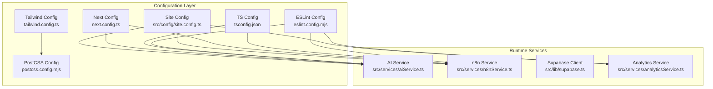
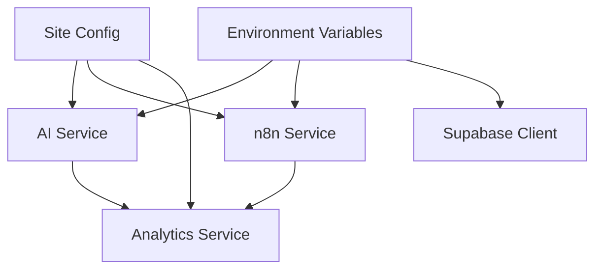
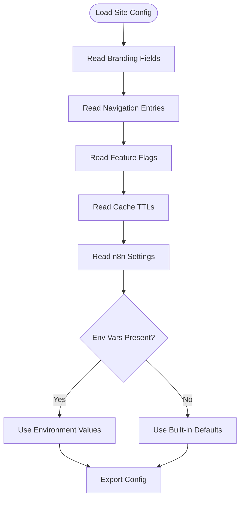
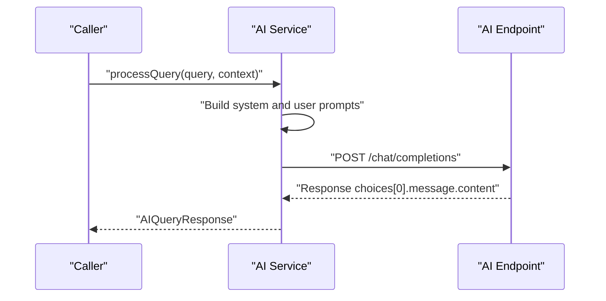
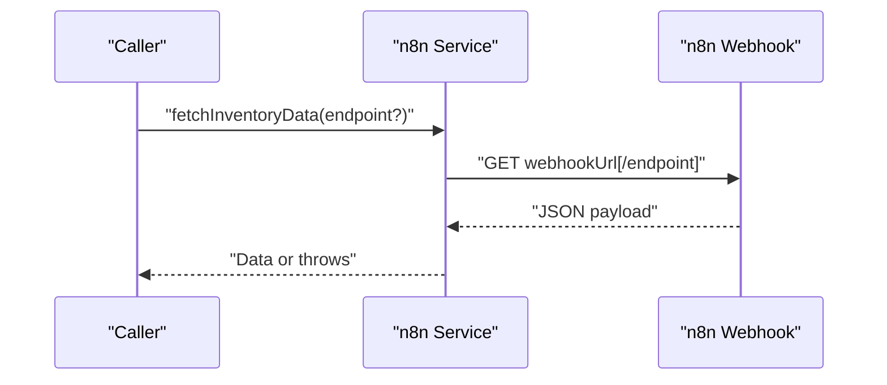
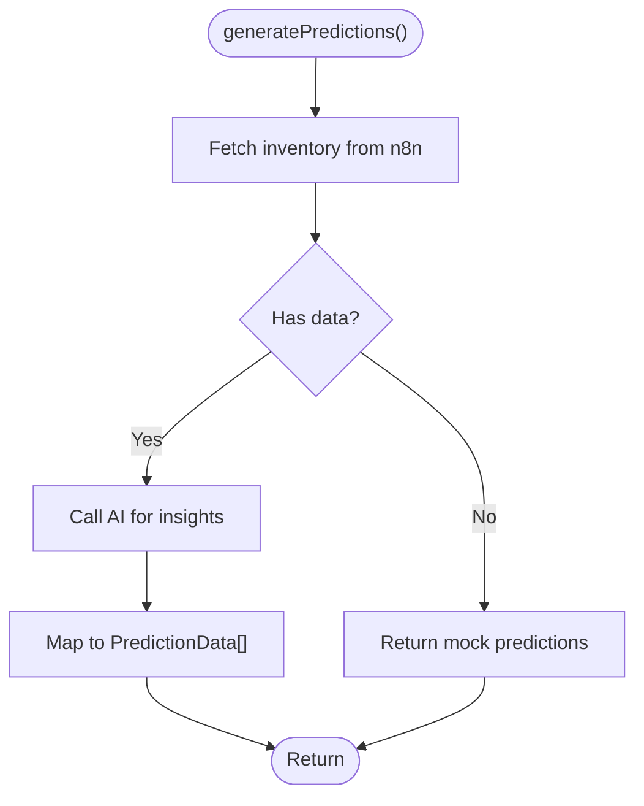
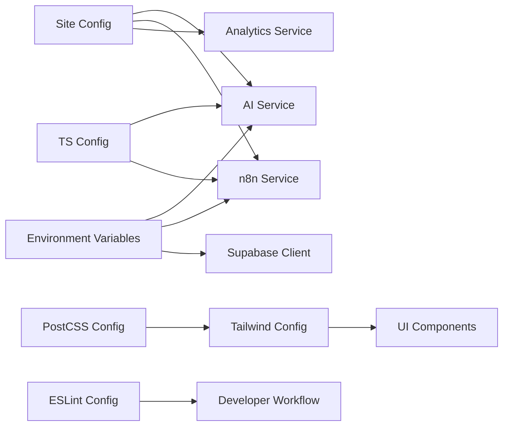

# Configuration and Environment

<cite>
**Referenced Files in This Document**
- [site.config.ts](file://src/config/site.config.ts)
- [next.config.ts](file://next.config.ts)
- [tsconfig.json](file://tsconfig.json)
- [tailwind.config.ts](file://tailwind.config.ts)
- [postcss.config.mjs](file://postcss.config.mjs)
- [eslint.config.mjs](file://eslint.config.mjs)
- [package.json](file://package.json)
- [supabase.ts](file://src/lib/supabase.ts)
- [n8nService.ts](file://src/services/n8nService.ts)
- [aiService.ts](file://src/services/aiService.ts)
- [analyticsService.ts](file://src/services/analyticsService.ts)
</cite>

## Table of Contents
1. [Introduction](#introduction)
2. [Project Structure](#project-structure)
3. [Core Components](#core-components)
4. [Architecture Overview](#architecture-overview)
5. [Detailed Component Analysis](#detailed-component-analysis)
6. [Dependency Analysis](#dependency-analysis)
7. [Performance Considerations](#performance-considerations)
8. [Troubleshooting Guide](#troubleshooting-guide)
9. [Conclusion](#conclusion)
10. [Appendices](#appendices)

## Introduction
This document explains the configuration and environment setup for the dashboard-ai project. It covers the site configuration system (branding, feature flags, application metadata), Next.js configuration, TypeScript compilation settings, Tailwind CSS customization, environment variables for AI services, n8n webhooks, Supabase credentials, and analytics. It also documents ESLint configuration, build optimization settings, deployment considerations, environment-specific configurations, security practices for credentials, validation and defaults, troubleshooting, and guidelines for extending the configuration system.

## Project Structure
The configuration surface spans several files:
- Site configuration defines branding, navigation, feature flags, caching TTLs, and n8n integration settings.
- Next.js configuration enables React Compiler for performance.
- TypeScript configuration enforces strictness, incremental builds, and module resolution.
- Tailwind CSS configuration extends theme colors, fonts, and content scanning.
- PostCSS integrates Tailwind plugin.
- ESLint configuration follows Next.js defaults with custom overrides.
- Services consume environment variables for AI endpoints, n8n webhooks, and Supabase client initialization.

**Diagram sources**
- [site.config.ts:1-34](file://src/config/site.config.ts#L1-L34)
- [next.config.ts:1-9](file://next.config.ts#L1-L9)
- [tsconfig.json:1-35](file://tsconfig.json#L1-L35)
- [tailwind.config.ts:1-46](file://tailwind.config.ts#L1-L46)
- [postcss.config.mjs:1-8](file://postcss.config.mjs#L1-L8)
- [eslint.config.mjs:1-19](file://eslint.config.mjs#L1-L19)
- [aiService.ts:1-219](file://src/services/aiService.ts#L1-L219)
- [n8nService.ts:1-109](file://src/services/n8nService.ts#L1-L109)
- [supabase.ts:1-21](file://src/lib/supabase.ts#L1-L21)
- [analyticsService.ts:1-134](file://src/services/analyticsService.ts#L1-L134)

**Section sources**
- [site.config.ts:1-34](file://src/config/site.config.ts#L1-L34)
- [next.config.ts:1-9](file://next.config.ts#L1-L9)
- [tsconfig.json:1-35](file://tsconfig.json#L1-L35)
- [tailwind.config.ts:1-46](file://tailwind.config.ts#L1-L46)
- [postcss.config.mjs:1-8](file://postcss.config.mjs#L1-L8)
- [eslint.config.mjs:1-19](file://eslint.config.mjs#L1-L19)
- [package.json:1-39](file://package.json#L1-L39)

## Core Components
- Site configuration centralizes branding, navigation, feature flags, caching TTLs, and n8n integration defaults. It exposes runtime-safe defaults for optional n8n settings and defines cache TTLs for different dashboard segments.
- Next.js configuration enables React Compiler to improve rendering performance.
- TypeScript configuration enforces strict type checking, incremental compilation, and bundler module resolution with path aliases.
- Tailwind CSS configuration extends color palettes, fonts, and content globs for scanning.
- PostCSS configuration wires Tailwind plugin.
- ESLint configuration composes Next.js core-web-vitals and TypeScript presets with custom overrides.

**Section sources**
- [site.config.ts:1-34](file://src/config/site.config.ts#L1-L34)
- [next.config.ts:1-9](file://next.config.ts#L1-L9)
- [tsconfig.json:1-35](file://tsconfig.json#L1-L35)
- [tailwind.config.ts:1-46](file://tailwind.config.ts#L1-L46)
- [postcss.config.mjs:1-8](file://postcss.config.mjs#L1-L8)
- [eslint.config.mjs:1-19](file://eslint.config.mjs#L1-L19)

## Architecture Overview
The configuration system influences runtime services that depend on environment variables. The site configuration provides defaults and feature toggles; services consume environment variables for AI endpoints, n8n webhooks, and Supabase client initialization.

**Diagram sources**
- [site.config.ts:1-34](file://src/config/site.config.ts#L1-L34)
- [aiService.ts:1-219](file://src/services/aiService.ts#L1-L219)
- [n8nService.ts:1-109](file://src/services/n8nService.ts#L1-L109)
- [supabase.ts:1-21](file://src/lib/supabase.ts#L1-L21)
- [analyticsService.ts:1-134](file://src/services/analyticsService.ts#L1-L134)

## Detailed Component Analysis

### Site Configuration System
The site configuration defines:
- Application metadata: name, description, version.
- Navigation entries for the dashboard.
- Feature flags enabling/disabling capabilities.
- Cache TTLs for different dashboard segments.
- n8n integration settings including webhook URL, API key, and polling interval.

**Diagram sources**
- [site.config.ts:1-34](file://src/config/site.config.ts#L1-L34)

**Section sources**
- [site.config.ts:1-34](file://src/config/site.config.ts#L1-L34)

### Next.js Configuration
React Compiler is enabled to optimize component rendering performance during development and production builds.

**Section sources**
- [next.config.ts:1-9](file://next.config.ts#L1-L9)

### TypeScript Configuration
Key compiler options include:
- Target ES2017 with DOM and ESNext libraries.
- Strict mode, no emit, ES module interop, bundler module resolution, JSON module support, isolated modules, JSX transform, incremental builds.
- Path alias @/* mapped to ./src/*.
- Included files for type checking across TS/TSX and Next.js generated types.

**Section sources**
- [tsconfig.json:1-35](file://tsconfig.json#L1-L35)

### Tailwind CSS and PostCSS Configuration
Tailwind configuration:
- Scans components, pages, and app directories for class usage.
- Extends theme with primary and secondary color palettes and a custom sans font stack.
- No plugins configured.

PostCSS configuration:
- Integrates Tailwind plugin via @tailwindcss/postcss.

**Section sources**
- [tailwind.config.ts:1-46](file://tailwind.config.ts#L1-L46)
- [postcss.config.mjs:1-8](file://postcss.config.mjs#L1-L8)

### ESLint Configuration
The ESLint configuration composes Next.js core-web-vitals and TypeScript presets and overrides default ignores to include generated and dev types.

**Section sources**
- [eslint.config.mjs:1-19](file://eslint.config.mjs#L1-L19)

### Environment Variables and Runtime Services

#### AI Service Configuration
The AI service reads:
- AI model endpoint URL.
- AI API key.
- Model name with a default fallback.

It constructs chat completions requests with Authorization headers and handles errors gracefully.

**Diagram sources**
- [aiService.ts:1-219](file://src/services/aiService.ts#L1-L219)

**Section sources**
- [aiService.ts:1-219](file://src/services/aiService.ts#L1-L219)

#### n8n Service Configuration
The n8n service reads:
- n8n webhook URL.
- n8n API key.

It supports fetching inventory data by endpoint, subscribing to periodic updates, and handles timeouts and errors.

**Diagram sources**
- [n8nService.ts:1-109](file://src/services/n8nService.ts#L1-L109)

**Section sources**
- [n8nService.ts:1-109](file://src/services/n8nService.ts#L1-L109)

#### Supabase Client Configuration
The Supabase client is initialized with:
- NEXT_PUBLIC_SUPABASE_URL (public URL).
- NEXT_PUBLIC_SUPABASE_ANON_KEY (public anonymous key).

The service documentation clarifies its role in user management and preferences, not in storing inventory data.

**Section sources**
- [supabase.ts:1-21](file://src/lib/supabase.ts#L1-L21)

#### Analytics Service Integration
The analytics service orchestrates AI insights and n8n data to generate predictions, anomaly detection, and forecasts. It falls back to mock data when upstream sources are unavailable.

**Diagram sources**
- [analyticsService.ts:1-134](file://src/services/analyticsService.ts#L1-L134)
- [n8nService.ts:1-109](file://src/services/n8nService.ts#L1-L109)
- [aiService.ts:1-219](file://src/services/aiService.ts#L1-L219)

**Section sources**
- [analyticsService.ts:1-134](file://src/services/analyticsService.ts#L1-L134)

## Dependency Analysis
The configuration layer influences runtime services through environment variables and shared defaults. The site configuration provides feature flags and cache policies that affect analytics and UI behavior. Services depend on environment variables for external integrations.

**Diagram sources**
- [site.config.ts:1-34](file://src/config/site.config.ts#L1-L34)
- [aiService.ts:1-219](file://src/services/aiService.ts#L1-L219)
- [n8nService.ts:1-109](file://src/services/n8nService.ts#L1-L109)
- [supabase.ts:1-21](file://src/lib/supabase.ts#L1-L21)
- [analyticsService.ts:1-134](file://src/services/analyticsService.ts#L1-L134)
- [tsconfig.json:1-35](file://tsconfig.json#L1-L35)
- [tailwind.config.ts:1-46](file://tailwind.config.ts#L1-L46)
- [postcss.config.mjs:1-8](file://postcss.config.mjs#L1-L8)
- [eslint.config.mjs:1-19](file://eslint.config.mjs#L1-L19)

**Section sources**
- [site.config.ts:1-34](file://src/config/site.config.ts#L1-L34)
- [aiService.ts:1-219](file://src/services/aiService.ts#L1-L219)
- [n8nService.ts:1-109](file://src/services/n8nService.ts#L1-L109)
- [supabase.ts:1-21](file://src/lib/supabase.ts#L1-L21)
- [analyticsService.ts:1-134](file://src/services/analyticsService.ts#L1-L134)
- [tsconfig.json:1-35](file://tsconfig.json#L1-L35)
- [tailwind.config.ts:1-46](file://tailwind.config.ts#L1-L46)
- [postcss.config.mjs:1-8](file://postcss.config.mjs#L1-L8)
- [eslint.config.mjs:1-19](file://eslint.config.mjs#L1-L19)

## Performance Considerations
- React Compiler is enabled in Next.js configuration to improve component rendering performance.
- Incremental TypeScript compilation reduces rebuild times.
- Tailwind content scanning targets specific directories to minimize CSS generation overhead.
- Service-level timeouts and polling intervals prevent long-running operations from blocking UI updates.

[No sources needed since this section provides general guidance]

## Troubleshooting Guide
Common configuration issues and resolutions:
- Missing environment variables:
  - AI service requires AI_MODEL_ENDPOINT and AI_API_KEY. Without them, requests fail. Provide values or handle gracefully in production.
  - n8n service requires N8N_WEBHOOK_URL and N8N_API_KEY. Absent values cause empty or failing requests.
  - Supabase client requires NEXT_PUBLIC_SUPABASE_URL and NEXT_PUBLIC_SUPABASE_ANON_KEY. Missing values break authentication and preference storage.
- Validation and defaults:
  - Site configuration provides defaults for n8n settings. Verify runtime behavior when environment variables are absent.
  - Analytics service falls back to mock predictions when upstream data is missing.
- Error handling:
  - AI service and n8n service wrap network calls with try/catch and throw descriptive errors. Inspect logs for ECONNABORTED or generic failures.
  - Analytics service logs errors and returns safe defaults when AI or n8n calls fail.
- Security:
  - Avoid committing secrets. Use environment variables and platform secret management.
  - Ensure NEXT_PUBLIC_ prefix is only used for frontend-accessible keys. Keep backend secrets server-side.

**Section sources**
- [aiService.ts:1-219](file://src/services/aiService.ts#L1-L219)
- [n8nService.ts:1-109](file://src/services/n8nService.ts#L1-L109)
- [analyticsService.ts:1-134](file://src/services/analyticsService.ts#L1-L134)
- [supabase.ts:1-21](file://src/lib/supabase.ts#L1-L21)
- [site.config.ts:1-34](file://src/config/site.config.ts#L1-L34)

## Conclusion
The dashboard-ai project’s configuration system combines centralized site settings, Next.js optimizations, strict TypeScript compilation, Tailwind customization, and robust ESLint rules. Runtime services consume environment variables for AI endpoints, n8n webhooks, and Supabase client initialization. By following the documented environment variable requirements, defaults, and security practices, teams can reliably operate development and production deployments while maintaining extensibility for new configuration options.

[No sources needed since this section summarizes without analyzing specific files]

## Appendices

### Environment Variable Reference
- AI service:
  - AI_MODEL_ENDPOINT: URL for the AI model chat completions endpoint.
  - AI_API_KEY: API key for the AI service.
  - AI_MODEL_NAME: Model identifier with a built-in default.
- n8n service:
  - N8N_WEBHOOK_URL: Base URL for n8n inventory webhooks.
  - N8N_API_KEY: API key for webhook authorization.
- Supabase client:
  - NEXT_PUBLIC_SUPABASE_URL: Public Supabase project URL.
  - NEXT_PUBLIC_SUPABASE_ANON_KEY: Public anonymous key for Supabase.
- Site configuration:
  - N8N_WEBHOOK_URL and N8N_API_KEY: Optional overrides for site-level defaults.

**Section sources**
- [aiService.ts:1-219](file://src/services/aiService.ts#L1-L219)
- [n8nService.ts:1-109](file://src/services/n8nService.ts#L1-L109)
- [supabase.ts:1-21](file://src/lib/supabase.ts#L1-L21)
- [site.config.ts:1-34](file://src/config/site.config.ts#L1-L34)

### Build and Deployment Notes
- Scripts:
  - dev: Starts the Next.js development server.
  - build: Produces an optimized production build.
  - start: Runs the compiled production server.
  - lint: Executes ESLint across the project.
- Dependencies:
  - Next.js, React, MUI, Redux, Supabase JS, Axios, Zod, Tailwind CSS v4, TypeScript, and related dev dependencies.

**Section sources**
- [package.json:1-39](file://package.json#L1-L39)

### Extending the Configuration System
Guidelines for adding new configuration options:
- Centralized site configuration:
  - Add new fields under siteConfig with sensible defaults.
  - Expose them to components and services via imports.
- Environment variables:
  - Define required variables in services and validate presence at startup.
  - Provide graceful fallbacks or fail-fast behavior depending on criticality.
- Type safety:
  - Extend TypeScript interfaces for new configuration shapes.
  - Keep path aliases consistent for imports.
- Styling:
  - Add new Tailwind extensions in tailwind.config.ts and scan appropriate directories.
- Tooling:
  - Update ESLint configuration if new patterns require custom rules.
- Documentation:
  - Update this guide and inline comments to reflect new options and defaults.

[No sources needed since this section provides general guidance]