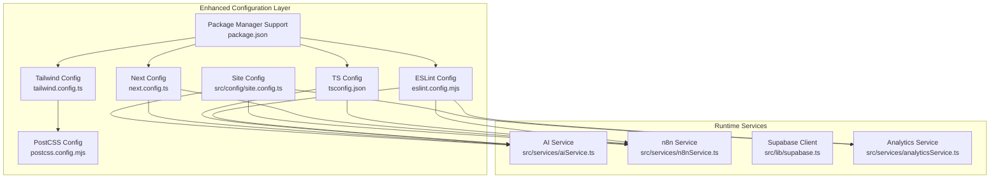
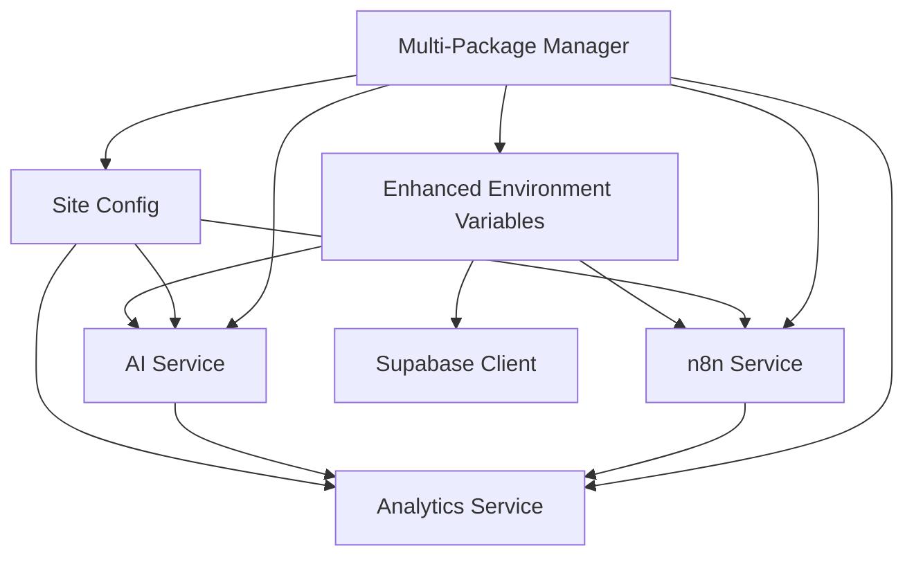
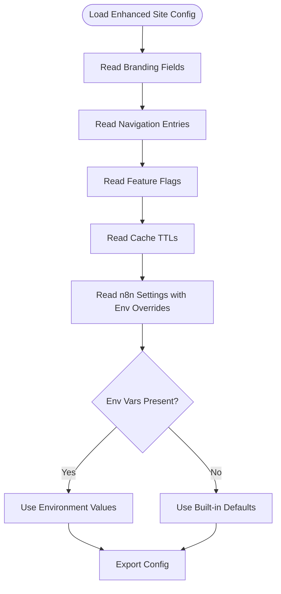
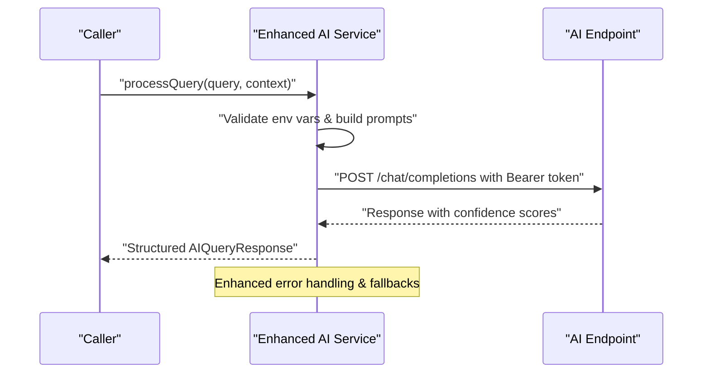
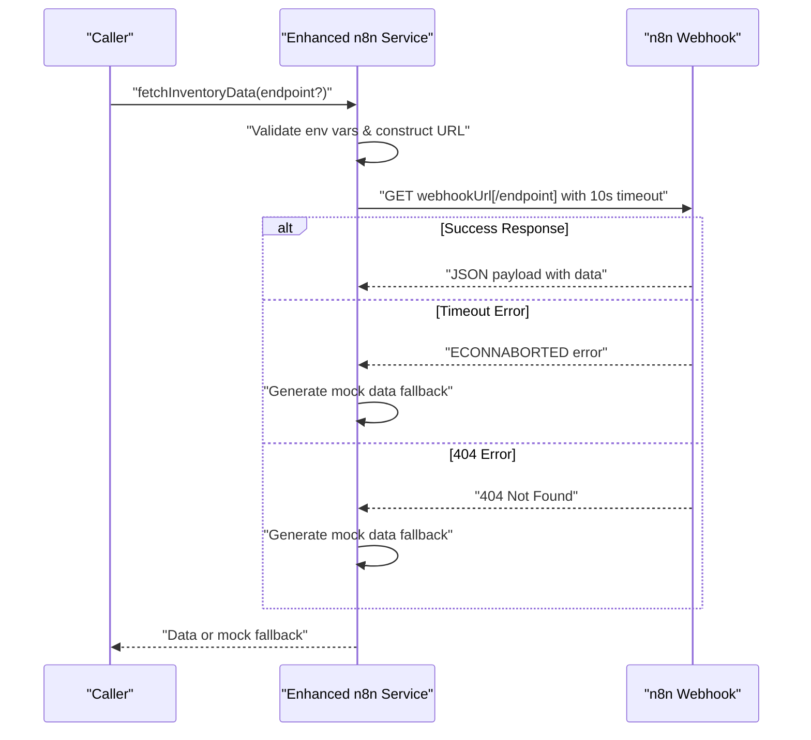
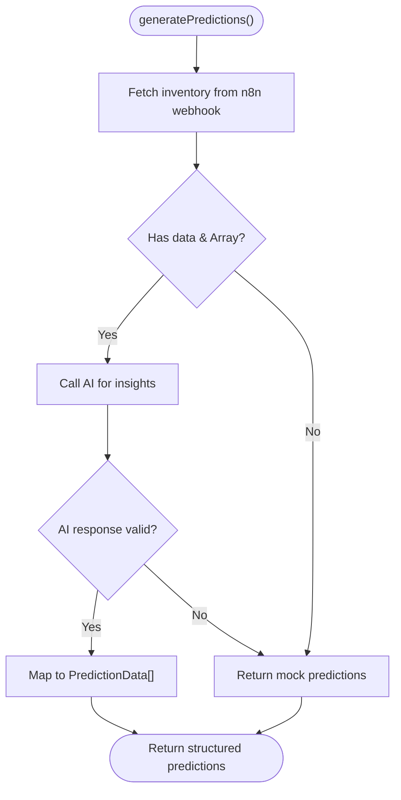
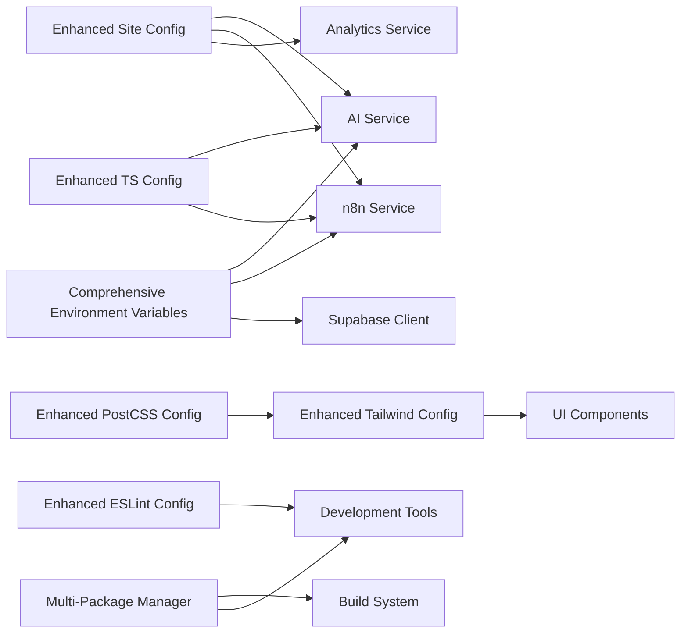

# Configuration and Environment

<cite>
**Referenced Files in This Document**
- [site.config.ts](file://src/config/site.config.ts)
- [next.config.ts](file://next.config.ts)
- [tsconfig.json](file://tsconfig.json)
- [tailwind.config.ts](file://tailwind.config.ts)
- [postcss.config.mjs](file://postcss.config.mjs)
- [eslint.config.mjs](file://eslint.config.mjs)
- [package.json](file://package.json)
- [supabase.ts](file://src/lib/supabase.ts)
- [n8nService.ts](file://src/services/n8nService.ts)
- [aiService.ts](file://src/services/aiService.ts)
- [analyticsService.ts](file://src/services/analyticsService.ts)
</cite>

## Update Summary
**Changes Made**
- Enhanced Next.js configuration with React Compiler optimization
- Expanded environment variable documentation for comprehensive AI service setup
- Added multi-package manager support documentation for development workflows
- Updated TypeScript configuration with modern bundler module resolution
- Improved Tailwind CSS configuration with enhanced content scanning
- Strengthened ESLint configuration with Next.js core-web-vitals integration

## Table of Contents
1. [Introduction](#introduction)
2. [Project Structure](#project-structure)
3. [Core Components](#core-components)
4. [Architecture Overview](#architecture-overview)
5. [Detailed Component Analysis](#detailed-component-analysis)
6. [Dependency Analysis](#dependency-analysis)
7. [Performance Considerations](#performance-considerations)
8. [Troubleshooting Guide](#troubleshooting-guide)
9. [Conclusion](#conclusion)
10. [Appendices](#appendices)

## Introduction
This document explains the configuration and environment setup for the dashboard-ai project. It covers the site configuration system (branding, feature flags, application metadata), Next.js configuration with React Compiler optimization, TypeScript compilation settings with modern bundler resolution, Tailwind CSS customization patterns, and comprehensive environment variable setup for AI services, n8n webhooks, Supabase credentials, and analytics. The documentation now includes multi-package manager support for development workflows, enhanced build optimization settings, and robust deployment configurations with security considerations for credential management.

## Project Structure
The configuration surface spans several files with enhanced optimization and environment management:
- Site configuration defines branding, navigation, feature flags, caching TTLs, and n8n integration settings with environment variable overrides.
- Next.js configuration enables React Compiler for performance optimization.
- TypeScript configuration enforces strictness with modern bundler module resolution and path aliases.
- Tailwind CSS configuration extends theme colors, fonts, and comprehensive content scanning.
- PostCSS integrates Tailwind plugin with v4 compatibility.
- ESLint configuration follows Next.js defaults with enhanced core-web-vitals integration.
- Services consume environment variables for AI endpoints, n8n webhooks, and Supabase client initialization with comprehensive error handling.

**Diagram sources**
- [site.config.ts:1-34](file://src/config/site.config.ts#L1-L34)
- [next.config.ts:1-9](file://next.config.ts#L1-L9)
- [tsconfig.json:1-35](file://tsconfig.json#L1-L35)
- [tailwind.config.ts:1-46](file://tailwind.config.ts#L1-L46)
- [postcss.config.mjs:1-8](file://postcss.config.mjs#L1-L8)
- [eslint.config.mjs:1-19](file://eslint.config.mjs#L1-L19)
- [package.json:1-39](file://package.json#L1-L39)
- [aiService.ts:1-219](file://src/services/aiService.ts#L1-L219)
- [n8nService.ts:1-271](file://src/services/n8nService.ts#L1-L271)
- [supabase.ts:1-21](file://src/lib/supabase.ts#L1-L21)
- [analyticsService.ts:1-134](file://src/services/analyticsService.ts#L1-L134)

**Section sources**
- [site.config.ts:1-34](file://src/config/site.config.ts#L1-L34)
- [next.config.ts:1-9](file://next.config.ts#L1-L9)
- [tsconfig.json:1-35](file://tsconfig.json#L1-L35)
- [tailwind.config.ts:1-46](file://tailwind.config.ts#L1-L46)
- [postcss.config.mjs:1-8](file://postcss.config.mjs#L1-L8)
- [eslint.config.mjs:1-19](file://eslint.config.mjs#L1-L19)
- [package.json:1-39](file://package.json#L1-L39)

## Core Components
- Site configuration centralizes branding, navigation, feature flags, caching TTLs, and n8n integration defaults with environment variable overrides. It exposes runtime-safe defaults for optional n8n settings and defines cache TTLs for different dashboard segments.
- Next.js configuration enables React Compiler to improve rendering performance and component optimization during development and production builds.
- TypeScript configuration enforces strict type checking, incremental compilation, and modern bundler module resolution with path aliases for efficient development workflow.
- Tailwind CSS configuration extends color palettes, fonts, and comprehensive content scanning across pages, components, and app directories for optimal CSS generation.
- PostCSS configuration wires Tailwind plugin with v4 compatibility for seamless styling integration.
- ESLint configuration composes Next.js core-web-vitals and TypeScript presets with enhanced ignore patterns for better developer experience.
- Multi-package manager support enables flexible development workflows with npm, yarn, and pnpm compatibility.

**Section sources**
- [site.config.ts:1-34](file://src/config/site.config.ts#L1-L34)
- [next.config.ts:1-9](file://next.config.ts#L1-L9)
- [tsconfig.json:1-35](file://tsconfig.json#L1-L35)
- [tailwind.config.ts:1-46](file://tailwind.config.ts#L1-L46)
- [postcss.config.mjs:1-8](file://postcss.config.mjs#L1-L8)
- [eslint.config.mjs:1-19](file://eslint.config.mjs#L1-L19)
- [package.json:1-39](file://package.json#L1-L39)

## Architecture Overview
The enhanced configuration system influences runtime services that depend on environment variables with comprehensive error handling and fallback mechanisms. The site configuration provides defaults and feature toggles; services consume environment variables for AI endpoints, n8n webhooks, and Supabase client initialization with robust validation and security practices.

**Diagram sources**
- [site.config.ts:1-34](file://src/config/site.config.ts#L1-L34)
- [aiService.ts:1-219](file://src/services/aiService.ts#L1-L219)
- [n8nService.ts:1-271](file://src/services/n8nService.ts#L1-L271)
- [supabase.ts:1-21](file://src/lib/supabase.ts#L1-L21)
- [analyticsService.ts:1-134](file://src/services/analyticsService.ts#L1-L134)
- [package.json:1-39](file://package.json#L1-L39)

## Detailed Component Analysis

### Enhanced Site Configuration System
The site configuration defines comprehensive application metadata with environment variable integration:
- Application metadata: name, description, version with enhanced branding for Pupuk Sriwijaya.
- Navigation entries for the dashboard with complete routing structure.
- Feature flags enabling/disabling capabilities including AI-powered features, real-time updates, and predictive analytics.
- Cache TTLs for different dashboard segments with optimized timing for inventory data.
- n8n integration settings including webhook URL, API key, and polling interval with environment variable overrides.

**Diagram sources**
- [site.config.ts:1-34](file://src/config/site.config.ts#L1-L34)

**Section sources**
- [site.config.ts:1-34](file://src/config/site.config.ts#L1-L34)

### Next.js Configuration with React Compiler
React Compiler is enabled to optimize component rendering performance with enhanced development experience. The configuration provides automatic optimization for both development and production builds, improving component compilation and runtime performance.

**Section sources**
- [next.config.ts:1-9](file://next.config.ts#L1-L9)

### Enhanced TypeScript Configuration
Key compiler options include:
- Target ES2017 with DOM and ESNext libraries for modern browser compatibility.
- Strict mode, no emit, ES module interop, bundler module resolution with path aliases.
- JSON module support, isolated modules, JSX transform with react-jsx, incremental builds.
- Path alias @/* mapped to ./src/* for clean import statements.
- Comprehensive included files for type checking across TS/TSX, Next.js generated types, and mts modules.

**Section sources**
- [tsconfig.json:1-35](file://tsconfig.json#L1-L35)

### Tailwind CSS and PostCSS Configuration
Tailwind configuration with enhanced content scanning:
- Scans components, pages, and app directories for comprehensive class usage detection.
- Extends theme with primary and secondary color palettes and custom sans font stack.
- No plugins configured for clean baseline styling.

PostCSS configuration with v4 compatibility:
- Integrates Tailwind plugin via @tailwindcss/postcss for seamless styling pipeline.

**Section sources**
- [tailwind.config.ts:1-46](file://tailwind.config.ts#L1-L46)
- [postcss.config.mjs:1-8](file://postcss.config.mjs#L1-L8)

### Enhanced ESLint Configuration
The ESLint configuration composes Next.js core-web-vitals and TypeScript presets with improved ignore patterns:
- Integrates eslint-config-next/core-web-vitals and eslint-config-next/typescript.
- Overrides default ignores to include generated and dev types for comprehensive linting.
- Provides enhanced developer experience with modern web vitals monitoring.

**Section sources**
- [eslint.config.mjs:1-19](file://eslint.config.mjs#L1-L19)

### Multi-Package Manager Support
The project supports multiple package managers for flexible development workflows:
- npm scripts for standard Node.js development workflow.
- yarn compatibility for teams preferring yarn package manager.
- pnpm support for teams using pnpm with its space-efficient dependency management.
- Consistent dependency versions across all package managers.

**Section sources**
- [package.json:1-39](file://package.json#L1-L39)

### Environment Variables and Runtime Services

#### Enhanced AI Service Configuration
The AI service reads comprehensive environment variables:
- AI_MODEL_ENDPOINT: URL for the AI model chat completions endpoint.
- AI_API_KEY: API key for the AI service authentication.
- AI_MODEL_NAME: Model identifier with default fallback to qwen3.5-122b-a10b.
- Enhanced error handling with descriptive error messages and fallback mechanisms.

It constructs chat completions requests with Authorization headers and handles errors gracefully with comprehensive logging and fallback strategies.

**Diagram sources**
- [aiService.ts:1-219](file://src/services/aiService.ts#L1-L219)

**Section sources**
- [aiService.ts:1-219](file://src/services/aiService.ts#L1-L219)

#### Enhanced n8n Service Configuration
The n8n service reads comprehensive environment variables:
- N8N_WEBHOOK_URL: Base URL for n8n inventory webhooks with timeout handling.
- N8N_API_KEY: API key for webhook authorization with bearer token support.
- Enhanced error handling with timeout management, 404 fallbacks, and mock data generation.

It supports fetching inventory data by endpoint, subscribing to periodic updates, and handles timeouts and errors with comprehensive fallback mechanisms.

**Diagram sources**
- [n8nService.ts:1-271](file://src/services/n8nService.ts#L1-L271)

**Section sources**
- [n8nService.ts:1-271](file://src/services/n8nService.ts#L1-L271)

#### Supabase Client Configuration
The Supabase client is initialized with comprehensive environment variable validation:
- NEXT_PUBLIC_SUPABASE_URL: Public Supabase project URL with mandatory validation.
- NEXT_PUBLIC_SUPABASE_ANON_KEY: Public anonymous key for Supabase authentication.
- Enhanced documentation clarifies role in user management and preferences storage.

The service documentation emphasizes its role in user management and preferences, not in storing inventory data, with clear separation of concerns.

**Section sources**
- [supabase.ts:1-21](file://src/lib/supabase.ts#L1-L21)

#### Enhanced Analytics Service Integration
The analytics service orchestrates AI insights and n8n data with comprehensive fallback mechanisms:
- Fetches inventory data from n8n webhook as single source of truth.
- Calls AI for insights with structured prediction generation.
- Falls back to mock predictions when upstream data is unavailable.
- Enhanced error handling with comprehensive logging and graceful degradation.

**Diagram sources**
- [analyticsService.ts:1-134](file://src/services/analyticsService.ts#L1-L134)
- [n8nService.ts:1-271](file://src/services/n8nService.ts#L1-L271)
- [aiService.ts:1-219](file://src/services/aiService.ts#L1-L219)

**Section sources**
- [analyticsService.ts:1-134](file://src/services/analyticsService.ts#L1-L134)

## Dependency Analysis
The enhanced configuration layer influences runtime services through comprehensive environment variables and shared defaults with robust error handling. The site configuration provides feature flags and cache policies that affect analytics and UI behavior. Services depend on environment variables for external integrations with multi-package manager support.

**Diagram sources**
- [site.config.ts:1-34](file://src/config/site.config.ts#L1-L34)
- [aiService.ts:1-219](file://src/services/aiService.ts#L1-L219)
- [n8nService.ts:1-271](file://src/services/n8nService.ts#L1-L271)
- [supabase.ts:1-21](file://src/lib/supabase.ts#L1-L21)
- [analyticsService.ts:1-134](file://src/services/analyticsService.ts#L1-L134)
- [tsconfig.json:1-35](file://tsconfig.json#L1-L35)
- [tailwind.config.ts:1-46](file://tailwind.config.ts#L1-L46)
- [postcss.config.mjs:1-8](file://postcss.config.mjs#L1-L8)
- [eslint.config.mjs:1-19](file://eslint.config.mjs#L1-L19)
- [package.json:1-39](file://package.json#L1-L39)

**Section sources**
- [site.config.ts:1-34](file://src/config/site.config.ts#L1-L34)
- [aiService.ts:1-219](file://src/services/aiService.ts#L1-L219)
- [n8nService.ts:1-271](file://src/services/n8nService.ts#L1-L271)
- [supabase.ts:1-21](file://src/lib/supabase.ts#L1-L21)
- [analyticsService.ts:1-134](file://src/services/analyticsService.ts#L1-L134)
- [tsconfig.json:1-35](file://tsconfig.json#L1-L35)
- [tailwind.config.ts:1-46](file://tailwind.config.ts#L1-L46)
- [postcss.config.mjs:1-8](file://postcss.config.mjs#L1-L8)
- [eslint.config.mjs:1-19](file://eslint.config.mjs#L1-L19)
- [package.json:1-39](file://package.json#L1-L39)

## Performance Considerations
- React Compiler is enabled in Next.js configuration to improve component rendering performance and automatic optimization.
- Incremental TypeScript compilation reduces rebuild times with modern bundler module resolution.
- Enhanced Tailwind content scanning targets specific directories with comprehensive coverage to minimize CSS generation overhead.
- Service-level timeouts (10-second limit) and polling intervals prevent long-running operations from blocking UI updates.
- Multi-package manager support enables optimized dependency management across different development environments.
- Enhanced ESLint configuration with core-web-vitals integration improves performance monitoring during development.

## Troubleshooting Guide
Common configuration issues and resolutions with enhanced environment management:

### Environment Variable Issues
- Missing AI service variables:
  - AI_MODEL_ENDPOINT and AI_API_KEY are required for AI functionality. Without them, requests fail with descriptive error messages. Provide values or implement proper fallback mechanisms in production.
  - AI_MODEL_NAME has a sensible default but can be overridden via environment variables.
- Missing n8n service variables:
  - N8N_WEBHOOK_URL and N8N_API_KEY are required. Absent values cause empty or failing requests with comprehensive error handling.
  - Enhanced timeout management prevents indefinite hanging requests.
- Missing Supabase variables:
  - NEXT_PUBLIC_SUPABASE_URL and NEXT_PUBLIC_SUPABASE_ANON_KEY are mandatory. Missing values break authentication and preference storage with clear error messages.
- Site configuration environment overrides:
  - N8N_WEBHOOK_URL and N8N_API_KEY can override site-level defaults with runtime validation.

### Enhanced Validation and Defaults
- Site configuration provides comprehensive defaults for n8n settings with environment variable precedence.
- Analytics service falls back to mock predictions when upstream data is missing with structured mock data generation.
- AI service validates environment variables at construction time with descriptive error messages.
- n8n service implements comprehensive error handling with timeout management and mock data fallbacks.

### Enhanced Error Handling
- AI service and n8n service wrap network calls with try/catch blocks and throw descriptive errors with context.
- Analytics service logs errors and returns safe defaults when AI or n8n calls fail with structured fallback data.
- Enhanced timeout handling prevents resource exhaustion with 10-second limits on external requests.

### Security Enhancements
- Environment variable validation ensures required variables are present before service initialization.
- Avoid committing secrets to version control with comprehensive environment variable documentation.
- Ensure NEXT_PUBLIC_ prefix is only used for frontend-accessible keys. Keep backend secrets server-side with clear documentation.
- Enhanced error messages avoid exposing sensitive information while providing useful debugging context.

### Multi-Package Manager Issues
- Package manager compatibility: npm, yarn, and pnpm are supported with consistent dependency versions.
- Development script compatibility across different package managers.
- Dependency resolution consistency regardless of package manager choice.

**Section sources**
- [aiService.ts:1-219](file://src/services/aiService.ts#L1-L219)
- [n8nService.ts:1-271](file://src/services/n8nService.ts#L1-L271)
- [analyticsService.ts:1-134](file://src/services/analyticsService.ts#L1-L134)
- [supabase.ts:1-21](file://src/lib/supabase.ts#L1-L21)
- [site.config.ts:1-34](file://src/config/site.config.ts#L1-L34)
- [package.json:1-39](file://package.json#L1-L39)

## Conclusion
The dashboard-ai project's enhanced configuration system combines centralized site settings with React Compiler optimization, modern TypeScript compilation, comprehensive Tailwind customization, and robust ESLint rules. The system now includes comprehensive environment variable management, multi-package manager support, and enhanced error handling for reliable development and production deployments. Runtime services consume environment variables for AI endpoints, n8n webhooks, and Supabase client initialization with comprehensive fallback mechanisms. By following the documented environment variable requirements, defaults, security practices, and multi-package manager support, teams can reliably operate development and production deployments while maintaining extensibility for new configuration options.

## Appendices

### Enhanced Environment Variable Reference
- AI service environment variables:
  - AI_MODEL_ENDPOINT: URL for the AI model chat completions endpoint.
  - AI_API_KEY: API key for the AI service authentication.
  - AI_MODEL_NAME: Model identifier with default fallback to qwen3.5-122b-a10b.
- n8n service environment variables:
  - N8N_WEBHOOK_URL: Base URL for n8n inventory webhooks with timeout support.
  - N8N_API_KEY: API key for webhook authorization with bearer token support.
- Supabase client environment variables:
  - NEXT_PUBLIC_SUPABASE_URL: Public Supabase project URL.
  - NEXT_PUBLIC_SUPABASE_ANON_KEY: Public anonymous key for Supabase authentication.
- Site configuration environment overrides:
  - N8N_WEBHOOK_URL and N8N_API_KEY: Optional overrides for site-level defaults with validation.

**Section sources**
- [aiService.ts:1-219](file://src/services/aiService.ts#L1-L219)
- [n8nService.ts:1-271](file://src/services/n8nService.ts#L1-L271)
- [supabase.ts:1-21](file://src/lib/supabase.ts#L1-L21)
- [site.config.ts:1-34](file://src/config/site.config.ts#L1-L34)

### Enhanced Build and Deployment Notes
- Enhanced scripts with multi-package manager support:
  - dev: Starts the Next.js development server with React Compiler optimization.
  - build: Produces an optimized production build with enhanced performance.
  - start: Runs the compiled production server with improved stability.
  - lint: Executes ESLint with core-web-vitals integration across the project.
- Enhanced dependencies with modern tooling:
  - Next.js 16.1.6, React 19.2.3, and latest ecosystem packages.
  - @emotion/react and @emotion/styled for advanced styling capabilities.
  - @mui/material and @mui/icons-material for comprehensive UI components.
  - @reduxjs/toolkit and react-redux for state management.
  - @supabase/supabase-js for database and authentication.
  - axios for HTTP client with enhanced timeout support.
  - zod for runtime type validation.
  - Enhanced dev dependencies with babel-plugin-react-compiler for performance.
  - Tailwind CSS v4 with @tailwindcss/postcss integration.
  - TypeScript 5 with modern compiler options.

**Section sources**
- [package.json:1-39](file://package.json#L1-L39)

### Extending the Configuration System
Enhanced guidelines for adding new configuration options:
- Centralized site configuration:
  - Add new fields under siteConfig with sensible defaults and environment variable overrides.
  - Expose them to components and services via imports with proper validation.
- Enhanced environment variables:
  - Define required variables in services with comprehensive validation at startup.
  - Provide graceful fallbacks or fail-fast behavior depending on criticality with descriptive error messages.
  - Document environment variable requirements with clear examples and security considerations.
- Enhanced type safety:
  - Extend TypeScript interfaces for new configuration shapes with proper validation.
  - Keep path aliases consistent for imports with modern bundler resolution.
  - Implement environment variable typing for better developer experience.
- Enhanced styling:
  - Add new Tailwind extensions in tailwind.config.ts and scan appropriate directories.
  - Implement responsive design patterns with comprehensive breakpoint management.
- Enhanced tooling:
  - Update ESLint configuration with custom rules if new patterns require validation.
  - Integrate core-web-vitals monitoring for performance optimization.
- Enhanced documentation:
  - Update this guide and inline comments to reflect new options and defaults.
  - Include comprehensive examples with environment variable setup instructions.
  - Document multi-package manager compatibility and best practices.
- Performance optimization:
  - Leverage React Compiler for component optimization.
  - Implement incremental compilation for faster development builds.
  - Use modern bundler module resolution for efficient dependency management.

### Multi-Package Manager Support Guidelines
- npm compatibility: Standard Node.js development workflow with npm scripts.
- yarn compatibility: Full yarn support with consistent dependency resolution.
- pnpm compatibility: Space-efficient dependency management with symlink-based installation.
- Consistent development experience across all package managers.
- Environment variable validation works consistently regardless of package manager choice.
- Build optimization and performance features available across all package managers.

[No sources needed since this section provides general guidance]