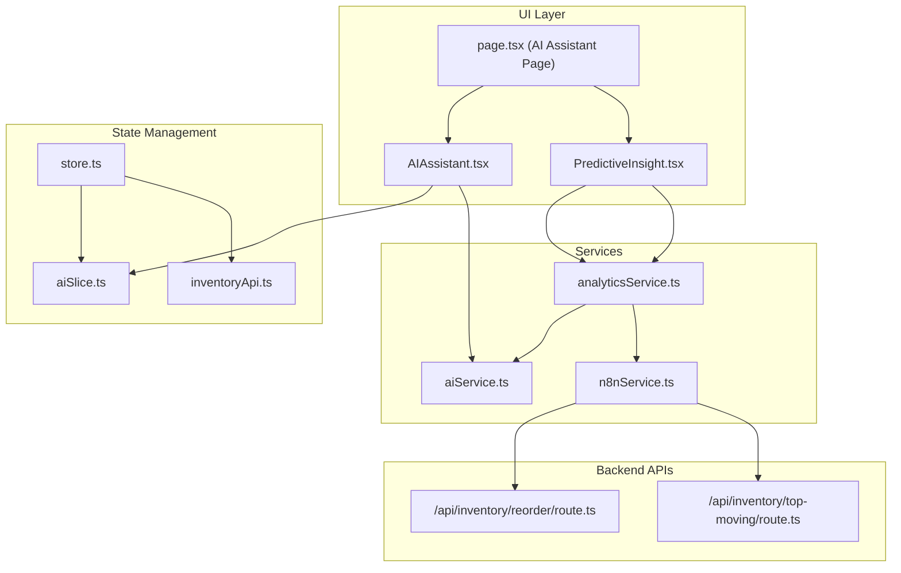
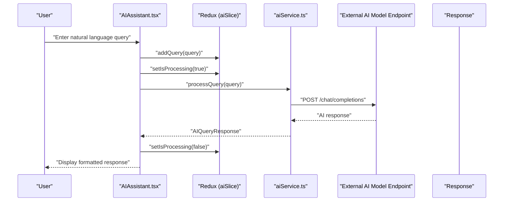
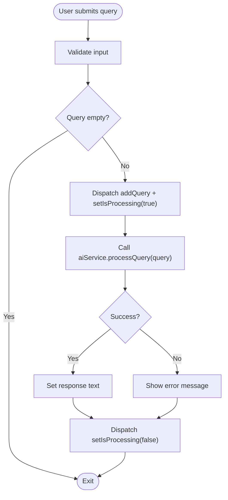
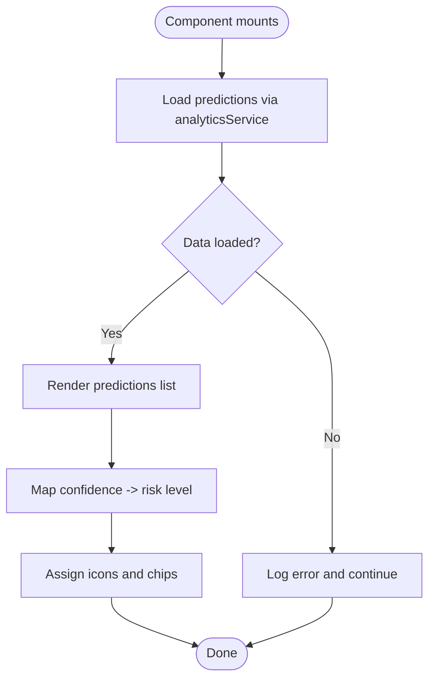
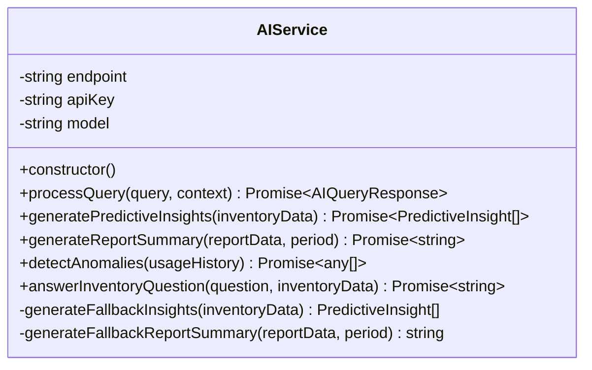
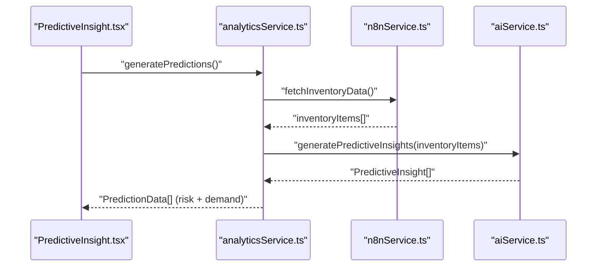
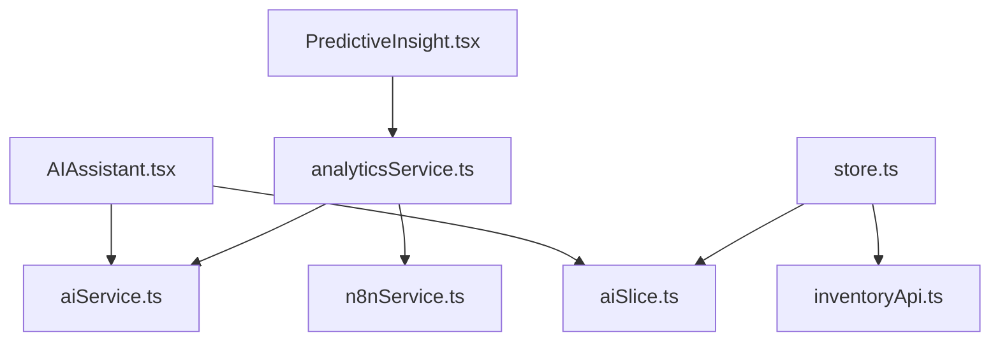

# AI Assistant

<cite>
**Referenced Files in This Document**
- [AIAssistant.tsx](file://src/components/ai/AIAssistant.tsx)
- [PredictiveInsight.tsx](file://src/components/ai/PredictiveInsight.tsx)
- [aiService.ts](file://src/services/aiService.ts)
- [analyticsService.ts](file://src/services/analyticsService.ts)
- [n8nService.ts](file://src/services/n8nService.ts)
- [aiSlice.ts](file://src/store/slices/aiSlice.ts)
- [store.ts](file://src/store/store.ts)
- [inventoryApi.ts](file://src/store/api/inventoryApi.ts)
- [page.tsx](file://src/app/ai-assistant/page.tsx)
- [route.ts](file://src/app/api/inventory/reorder/route.ts)
- [route.ts](file://src/app/api/inventory/top-moving/route.ts)
- [site.config.ts](file://src/config/site.config.ts)
- [package.json](file://package.json)
</cite>

## Table of Contents
1. [Introduction](#introduction)
2. [Project Structure](#project-structure)
3. [Core Components](#core-components)
4. [Architecture Overview](#architecture-overview)
5. [Detailed Component Analysis](#detailed-component-analysis)
6. [Dependency Analysis](#dependency-analysis)
7. [Performance Considerations](#performance-considerations)
8. [Troubleshooting Guide](#troubleshooting-guide)
9. [Conclusion](#conclusion)
10. [Appendices](#appendices)

## Introduction
This document explains the AI-powered natural language query interface for inventory management. It covers the AIAssistant conversational interface, the PredictiveInsight component for automated insights, and the aiService integration with external AI models. It describes how users can ask natural language questions about inventory data, receive contextual responses, and access predictive analytics. It also documents AI service configuration, query processing workflow, response formatting, integration with inventory data sources, practical examples of common AI queries, conversation patterns, insight generation, model selection, response quality considerations, limitations, error handling, and fallback mechanisms.

## Project Structure
The AI Assistant feature is organized around three main areas:
- UI components for conversational input and predictive insights
- AI service layer that orchestrates external AI model calls and fallbacks
- Data services that bridge inventory data from n8n webhooks and the Next.js API routes

**Diagram sources**
- [AIAssistant.tsx:1-120](file://src/components/ai/AIAssistant.tsx#L1-L120)
- [PredictiveInsight.tsx:1-152](file://src/components/ai/PredictiveInsight.tsx#L1-L152)
- [page.tsx:1-55](file://src/app/ai-assistant/page.tsx#L1-L55)
- [aiSlice.ts:1-56](file://src/store/slices/aiSlice.ts#L1-L56)
- [store.ts:1-27](file://src/store/store.ts#L1-L27)
- [inventoryApi.ts:1-57](file://src/store/api/inventoryApi.ts#L1-L57)
- [aiService.ts:1-219](file://src/services/aiService.ts#L1-L219)
- [analyticsService.ts:1-134](file://src/services/analyticsService.ts#L1-L134)
- [n8nService.ts:1-109](file://src/services/n8nService.ts#L1-L109)
- [route.ts:1-18](file://src/app/api/inventory/reorder/route.ts#L1-L18)
- [route.ts:1-25](file://src/app/api/inventory/top-moving/route.ts#L1-L25)

**Section sources**
- [page.tsx:10-55](file://src/app/ai-assistant/page.tsx#L10-L55)
- [store.ts:7-27](file://src/store/store.ts#L7-L27)
- [inventoryApi.ts:23-57](file://src/store/api/inventoryApi.ts#L23-L57)

## Core Components
- AIAssistant: Provides a natural language input field, sends queries to aiService, displays responses, and manages processing state via Redux.
- PredictiveInsights: Renders AI-powered demand forecasts and recommendations, fetching data from analyticsService.
- aiService: Integrates with an external AI model endpoint, handles query processing, predictive insights generation, anomaly detection, and report summarization with robust error handling and fallbacks.
- analyticsService: Orchestrates inventory data retrieval from n8n webhooks, transforms raw data into predictive insights, and provides anomaly detection and forecasting utilities.
- n8nService: Fetches inventory data from n8n webhooks, supports polling, and acts as the single source of truth for inventory data.
- Redux slice and store: Manage AI state (history, processing flag) and integrate with RTK Query inventory endpoints.

**Section sources**
- [AIAssistant.tsx:23-120](file://src/components/ai/AIAssistant.tsx#L23-L120)
- [PredictiveInsight.tsx:29-152](file://src/components/ai/PredictiveInsight.tsx#L29-L152)
- [aiService.ts:18-219](file://src/services/aiService.ts#L18-L219)
- [analyticsService.ts:13-134](file://src/services/analyticsService.ts#L13-L134)
- [n8nService.ts:16-109](file://src/services/n8nService.ts#L16-L109)
- [aiSlice.ts:17-56](file://src/store/slices/aiSlice.ts#L17-L56)
- [store.ts:7-27](file://src/store/store.ts#L7-L27)

## Architecture Overview
The AI Assistant architecture follows a layered design:
- UI layer: React components render the chat interface and predictive insights cards.
- State layer: Redux manages AI query history and processing state; RTK Query caches inventory data.
- Services layer: aiService encapsulates AI model integration; analyticsService orchestrates data and AI insights; n8nService bridges inventory data from webhooks.
- Backend APIs: Next.js API routes proxy requests to n8n webhooks, returning inventory data to the frontend.

**Diagram sources**
- [AIAssistant.tsx:29-46](file://src/components/ai/AIAssistant.tsx#L29-L46)
- [aiSlice.ts:24-35](file://src/store/slices/aiSlice.ts#L24-L35)
- [aiService.ts:33-74](file://src/services/aiService.ts#L33-L74)

## Detailed Component Analysis

### AIAssistant Component
The AIAssistant component provides a conversational interface for natural language inventory queries:
- Input controls: Multiline text field with clear and send actions, Enter-to-submit behavior, and disabled states during processing.
- Processing indicator: Shows a spinner while the AI processes the query.
- Response display: Uses an alert box to present the AI’s response.
- State management: Dispatches Redux actions to record queries and toggle processing state.
- Error handling: Catches errors from aiService and displays a friendly message.

**Diagram sources**
- [AIAssistant.tsx:29-46](file://src/components/ai/AIAssistant.tsx#L29-L46)
- [aiSlice.ts:24-35](file://src/store/slices/aiSlice.ts#L24-L35)

**Section sources**
- [AIAssistant.tsx:23-120](file://src/components/ai/AIAssistant.tsx#L23-L120)
- [aiSlice.ts:17-56](file://src/store/slices/aiSlice.ts#L17-L56)

### PredictiveInsight Component
The PredictiveInsight component renders machine learning-based demand forecasts and recommendations:
- Data fetching: Uses analyticsService to generate predictions on mount.
- Loading state: Displays a spinner while data is being fetched.
- Risk visualization: Maps confidence levels to risk categories and icons.
- Formatting: Presents material name, predicted demand, confidence, recommended action, and risk level in a list.

**Diagram sources**
- [PredictiveInsight.tsx:33-46](file://src/components/ai/PredictiveInsight.tsx#L33-L46)
- [analyticsService.ts:17-41](file://src/services/analyticsService.ts#L17-L41)

**Section sources**
- [PredictiveInsight.tsx:29-152](file://src/components/ai/PredictiveInsight.tsx#L29-L152)
- [analyticsService.ts:13-134](file://src/services/analyticsService.ts#L13-L134)

### AI Service Integration
The aiService integrates with an external AI model endpoint:
- Configuration: Reads endpoint, API key, and model name from environment variables.
- Query processing: Sends a system prompt and user query to the model, returning a structured response.
- Predictive insights: Parses AI responses into structured insights; falls back to deterministic logic if parsing fails.
- Report summarization: Generates concise executive summaries from inventory report data.
- Anomaly detection: Identifies unusual consumption patterns from usage history.
- Inventory question answering: Augments queries with contextual inventory metadata.

**Diagram sources**
- [aiService.ts:18-219](file://src/services/aiService.ts#L18-L219)

**Section sources**
- [aiService.ts:18-219](file://src/services/aiService.ts#L18-L219)

### Analytics Service Orchestration
The analyticsService coordinates data retrieval and AI insights:
- Predictions: Fetches inventory items from n8n webhooks, generates AI insights, and enriches with risk levels and randomized demand figures.
- Fallback: Returns mock predictions if data is unavailable.
- Anomaly detection: Retrieves usage metrics and passes them to aiService for anomaly identification.
- Forecasting utilities: Provides simple demand forecasting helpers.

**Diagram sources**
- [analyticsService.ts:17-41](file://src/services/analyticsService.ts#L17-L41)
- [n8nService.ts:29-51](file://src/services/n8nService.ts#L29-L51)
- [aiService.ts:79-109](file://src/services/aiService.ts#L79-L109)

**Section sources**
- [analyticsService.ts:13-134](file://src/services/analyticsService.ts#L13-L134)
- [n8nService.ts:16-109](file://src/services/n8nService.ts#L16-L109)

### Data Sources and API Integration
- n8nService: Fetches inventory data from n8n webhooks, supports endpoints for top-moving materials, reorder alerts, usage metrics, and stock overview. Implements polling for real-time updates.
- Next.js API routes: Proxy requests to n8n webhooks and return inventory data to the frontend.
- RTK Query: Caches inventory endpoints for performance.

**Diagram sources**
- [inventoryApi.ts:23-57](file://src/store/api/inventoryApi.ts#L23-L57)
- [route.ts:1-18](file://src/app/api/inventory/reorder/route.ts#L1-L18)
- [route.ts:1-25](file://src/app/api/inventory/top-moving/route.ts#L1-L25)
- [n8nService.ts:29-51](file://src/services/n8nService.ts#L29-L51)

**Section sources**
- [n8nService.ts:16-109](file://src/services/n8nService.ts#L16-L109)
- [inventoryApi.ts:23-57](file://src/store/api/inventoryApi.ts#L23-L57)
- [route.ts:1-18](file://src/app/api/inventory/reorder/route.ts#L1-L18)
- [route.ts:1-25](file://src/app/api/inventory/top-moving/route.ts#L1-L25)

## Dependency Analysis
- UI depends on Redux for state and on aiService for AI responses.
- PredictiveInsight depends on analyticsService for insights and on n8nService for inventory data.
- aiService depends on environment variables for model configuration and on axios for HTTP calls.
- analyticsService depends on aiService for AI insights and on n8nService for inventory data.
- n8nService depends on axios and environment variables for webhook access.
- Store integrates Redux slices and RTK Query inventory endpoints.

**Diagram sources**
- [AIAssistant.tsx:17-19](file://src/components/ai/AIAssistant.tsx#L17-L19)
- [aiSlice.ts:17-56](file://src/store/slices/aiSlice.ts#L17-L56)
- [aiService.ts:18-219](file://src/services/aiService.ts#L18-L219)
- [PredictiveInsight.tsx:3-4](file://src/components/ai/PredictiveInsight.tsx#L3-L4)
- [analyticsService.ts:1-2](file://src/services/analyticsService.ts#L1-L2)
- [n8nService.ts:1-1](file://src/services/n8nService.ts#L1-L1)
- [store.ts:7-16](file://src/store/store.ts#L7-L16)
- [inventoryApi.ts:1-1](file://src/store/api/inventoryApi.ts#L1-L1)

**Section sources**
- [store.ts:7-27](file://src/store/store.ts#L7-L27)
- [aiSlice.ts:17-56](file://src/store/slices/aiSlice.ts#L17-L56)
- [aiService.ts:18-219](file://src/services/aiService.ts#L18-L219)
- [analyticsService.ts:13-134](file://src/services/analyticsService.ts#L13-L134)
- [n8nService.ts:16-109](file://src/services/n8nService.ts#L16-L109)

## Performance Considerations
- Caching: RTK Query caches inventory endpoints to reduce network calls.
- Polling: n8nService polls inventory data at a fixed interval to keep the UI updated.
- Request timeouts: n8nService sets a 10-second timeout for webhook requests.
- Token limits and temperature: aiService sets conservative max tokens and moderate temperature for balanced creativity and determinism.
- Confidence scoring: PredictiveInsight maps confidence to risk levels; consider adding dynamic confidence thresholds for stricter filtering.

[No sources needed since this section provides general guidance]

## Troubleshooting Guide
Common issues and resolutions:
- AI query failures: aiService throws a standardized error; AIAssistant displays a friendly message and resets processing state.
- Predictive insights parsing errors: aiService falls back to deterministic logic based on reorder points.
- Webhook timeouts: n8nService throws a timeout error; analyticsService returns mock predictions.
- Empty inventory data: analyticsService returns mock predictions; PredictiveInsight still renders a loading state until data arrives.

**Section sources**
- [AIAssistant.tsx:40-45](file://src/components/ai/AIAssistant.tsx#L40-L45)
- [aiService.ts:70-74](file://src/services/aiService.ts#L70-L74)
- [aiService.ts:101-104](file://src/services/aiService.ts#L101-L104)
- [n8nService.ts:43-50](file://src/services/n8nService.ts#L43-L50)
- [analyticsService.ts:22-24](file://src/services/analyticsService.ts#L22-L24)
- [PredictiveInsight.tsx:59-69](file://src/components/ai/PredictiveInsight.tsx#L59-L69)

## Conclusion
The AI Assistant provides a robust, user-friendly natural language interface for inventory queries and predictive insights. It integrates external AI models for contextual responses, uses deterministic fallbacks for reliability, and pulls real-time inventory data from n8n webhooks. The modular design ensures maintainability, while Redux and RTK Query provide efficient state and caching. Users can ask questions about inventory, receive actionable insights, and benefit from automated forecasts and anomaly detection.

[No sources needed since this section summarizes without analyzing specific files]

## Appendices

### AI Model Configuration
- Endpoint: Read from environment variable for AI model endpoint.
- API key: Authorization header for AI model endpoint.
- Model name: Defaults to a specific model if not configured.

**Section sources**
- [aiService.ts:23-27](file://src/services/aiService.ts#L23-L27)

### Environment Variables
- AI_MODEL_ENDPOINT: AI model endpoint URL.
- AI_API_KEY: API key for AI model endpoint.
- AI_MODEL_NAME: Model identifier used for queries.
- N8N_WEBHOOK_URL: n8n webhook URL for inventory data.
- N8N_API_KEY: API key for n8n webhook access.

**Section sources**
- [aiService.ts:24-26](file://src/services/aiService.ts#L24-L26)
- [site.config.ts:28-32](file://src/config/site.config.ts#L28-L32)

### Practical Examples of Common AI Queries
- Inventory overview: “Show me top 10 fast-moving raw materials.”
- Reorder assistance: “What materials need reordering?”
- Contextual analysis: “Which materials are approaching their reorder points?”

These queries are processed by aiService with optional context augmentation and returned as formatted responses.

**Section sources**
- [AIAssistant.tsx:75-76](file://src/components/ai/AIAssistant.tsx#L75-L76)
- [aiService.ts:205-215](file://src/services/aiService.ts#L205-L215)

### Conversation Patterns and Insight Generation
- Pattern: User submits a natural language query; AIAssistant records the query; aiService processes the query and returns a response; response is displayed to the user.
- Insight generation: PredictiveInsights fetch inventory data via analyticsService, which calls aiService to generate structured insights; risks and recommendations are derived from confidence levels.

**Section sources**
- [AIAssistant.tsx:29-46](file://src/components/ai/AIAssistant.tsx#L29-L46)
- [analyticsService.ts:17-41](file://src/services/analyticsService.ts#L17-L41)
- [aiService.ts:79-109](file://src/services/aiService.ts#L79-L109)

### Response Quality Considerations and Limitations
- Temperature and token limits: aiService uses moderate temperature and constrained tokens to balance helpfulness and brevity.
- Structured parsing: Predictive insights are parsed from AI responses; fallback logic ensures resilience when parsing fails.
- Deterministic fallbacks: When AI responses are invalid or unavailable, deterministic logic (e.g., reorder-point-based predictions) is used.

**Section sources**
- [aiService.ts:51-53](file://src/services/aiService.ts#L51-L53)
- [aiService.ts:95-104](file://src/services/aiService.ts#L95-L104)
- [aiService.ts:114-124](file://src/services/aiService.ts#L114-L124)

### Error Handling and Fallback Mechanisms
- AI query errors: aiService throws a standardized error; AIAssistant displays a friendly message and resets processing state.
- Parsing failures: aiService attempts to parse AI responses; on failure, it falls back to deterministic insights.
- Webhook failures: n8nService throws descriptive errors; analyticsService returns mock predictions.
- Empty data: analyticsService returns mock predictions; PredictiveInsight renders a loading state.

**Section sources**
- [AIAssistant.tsx:40-45](file://src/components/ai/AIAssistant.tsx#L40-L45)
- [aiService.ts:70-74](file://src/services/aiService.ts#L70-L74)
- [aiService.ts:101-104](file://src/services/aiService.ts#L101-L104)
- [n8nService.ts:43-50](file://src/services/n8nService.ts#L43-L50)
- [analyticsService.ts:22-24](file://src/services/analyticsService.ts#L22-L24)
- [PredictiveInsight.tsx:59-69](file://src/components/ai/PredictiveInsight.tsx#L59-L69)