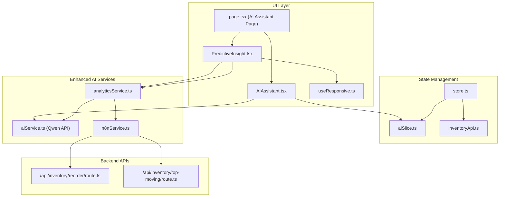
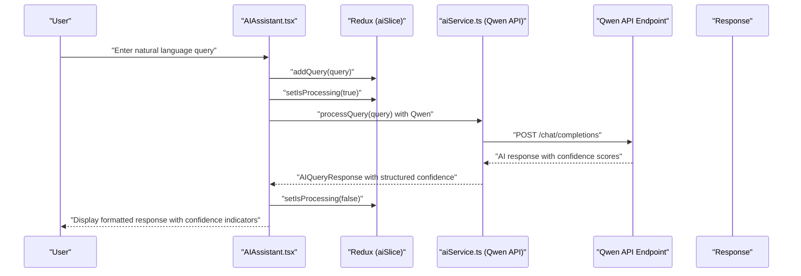
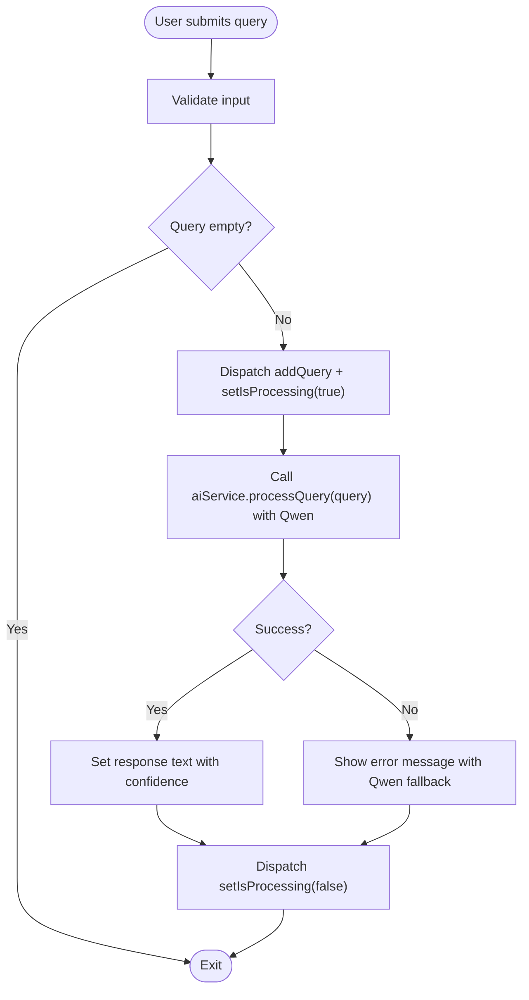
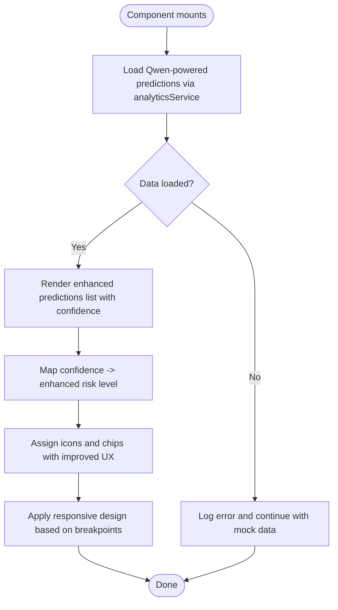
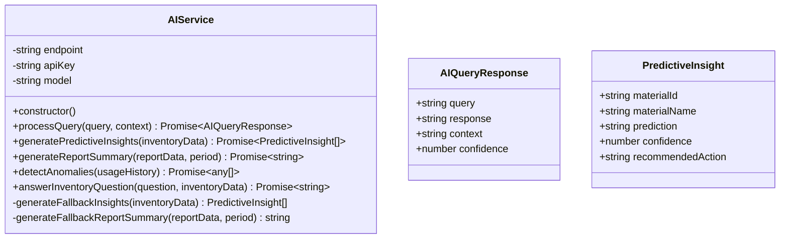
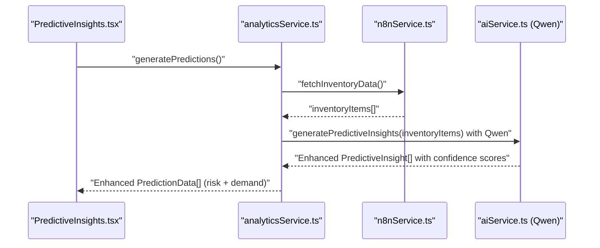
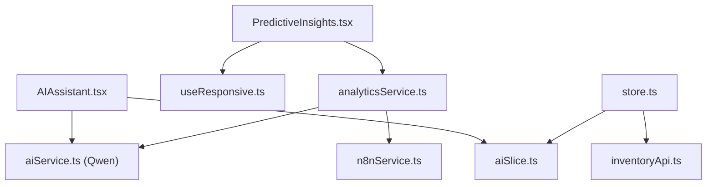

# AI Assistant

<cite>
**Referenced Files in This Document**
- [AIAssistant.tsx](file://src/components/ai/AIAssistant.tsx)
- [PredictiveInsight.tsx](file://src/components/ai/PredictiveInsight.tsx)
- [aiService.ts](file://src/services/aiService.ts)
- [analyticsService.ts](file://src/services/analyticsService.ts)
- [n8nService.ts](file://src/services/n8nService.ts)
- [aiSlice.ts](file://src/store/slices/aiSlice.ts)
- [store.ts](file://src/store/store.ts)
- [inventoryApi.ts](file://src/store/api/inventoryApi.ts)
- [page.tsx](file://src/app/ai-assistant/page.tsx)
- [route.ts](file://src/app/api/inventory/reorder/route.ts)
- [route.ts](file://src/app/api/inventory/top-moving/route.ts)
- [site.config.ts](file://src/config/site.config.ts)
- [useResponsive.ts](file://src/hooks/useResponsive.ts)
- [package.json](file://package.json)
</cite>

## Update Summary
**Changes Made**
- Enhanced AI Service with comprehensive TypeScript interfaces (AIQueryResponse, PredictiveInsight)
- Added confidence scoring capabilities to AI responses with structured confidence levels
- Improved error handling mechanisms with better fallback strategies
- Enhanced AI assistant with better user experience handling and responsive design improvements
- Strengthened type safety across the AI service layer with proper TypeScript interfaces
- Updated predictive insights generation with confidence-based risk assessment

## Table of Contents
1. [Introduction](#introduction)
2. [Project Structure](#project-structure)
3. [Core Components](#core-components)
4. [Architecture Overview](#architecture-overview)
5. [Detailed Component Analysis](#detailed-component-analysis)
6. [TypeScript Interface Enhancements](#typescript-interface-enhancements)
7. [Confidence Scoring System](#confidence-scoring-system)
8. [Dependency Analysis](#dependency-analysis)
9. [Performance Considerations](#performance-considerations)
10. [Troubleshooting Guide](#troubleshooting-guide)
11. [Conclusion](#conclusion)
12. [Appendices](#appendices)

## Introduction
This document explains the AI-powered natural language query interface for inventory management, now enhanced with comprehensive TypeScript interfaces and confidence scoring capabilities. The system features the AIAssistant conversational interface, PredictiveInsight component for automated insights, and the aiService integration with external AI models. The enhanced architecture provides advanced capabilities including predictive analytics, anomaly detection, automated report summarization, and smart recommendations powered by the Qwen language model. Users can ask natural language questions about inventory data, receive contextual responses with confidence scores, and access sophisticated predictive analytics with improved accuracy and reliability.

## Project Structure
The AI Assistant feature is organized around five main areas with enhanced TypeScript integration and confidence scoring:
- UI components for conversational input and predictive insights with responsive design
- AI service layer with comprehensive TypeScript interfaces for advanced natural language processing
- Data services that bridge inventory data from n8n webhooks and Next.js API routes
- Advanced analytics services for predictive insights with confidence-based risk assessment
- Enhanced state management with improved type safety and error handling

**Diagram sources**
- [AIAssistant.tsx:1-120](file://src/components/ai/AIAssistant.tsx#L1-L120)
- [PredictiveInsight.tsx:1-152](file://src/components/ai/PredictiveInsight.tsx#L1-L152)
- [page.tsx:1-55](file://src/app/ai-assistant/page.tsx#L1-L55)
- [useResponsive.ts:1-67](file://src/hooks/useResponsive.ts#L1-L67)
- [aiSlice.ts:1-56](file://src/store/slices/aiSlice.ts#L1-L56)
- [store.ts:1-27](file://src/store/store.ts#L1-L27)
- [inventoryApi.ts:1-57](file://src/store/api/inventoryApi.ts#L1-L57)
- [aiService.ts:1-219](file://src/services/aiService.ts#L1-L219)
- [analyticsService.ts:1-134](file://src/services/analyticsService.ts#L1-L134)
- [n8nService.ts:1-271](file://src/services/n8nService.ts#L1-L271)
- [route.ts:1-18](file://src/app/api/inventory/reorder/route.ts#L1-L18)
- [route.ts:1-25](file://src/app/api/inventory/top-moving/route.ts#L1-L25)

**Section sources**
- [page.tsx:10-55](file://src/app/ai-assistant/page.tsx#L10-L55)
- [store.ts:7-27](file://src/store/store.ts#L7-L27)
- [inventoryApi.ts:23-57](file://src/store/api/inventoryApi.ts#L23-L57)

## Core Components
- **AIAssistant**: Provides a natural language input field with enhanced responsive design, sends queries to aiService with Qwen API integration, displays responses with confidence indicators, and manages processing state via Redux with improved user experience.
- **PredictiveInsights**: Renders AI-powered demand forecasts and recommendations with confidence-based risk assessment, fetching data from analyticsService with enhanced visual feedback and responsive layouts.
- **aiService**: Integrates with Qwen API endpoint for advanced natural language processing, handles query processing with comprehensive TypeScript interfaces, predictive insights generation with confidence scoring, anomaly detection, and report summarization with robust error handling and fallbacks.
- **analyticsService**: Orchestrates inventory data retrieval from n8n webhooks, transforms raw data into AI-powered predictive insights with confidence levels, and provides enhanced anomaly detection and forecasting utilities.
- **n8nService**: Fetches inventory data from n8n webhooks with comprehensive endpoint support, implements polling for real-time updates, and serves as the single source of truth for inventory data.
- **Redux slice and store**: Manage AI state (history, processing flag, insights) with enhanced type safety and integrate with RTK Query inventory endpoints for optimized caching.

**Section sources**
- [AIAssistant.tsx:23-120](file://src/components/ai/AIAssistant.tsx#L23-L120)
- [PredictiveInsight.tsx:29-152](file://src/components/ai/PredictiveInsight.tsx#L29-L152)
- [aiService.ts:18-219](file://src/services/aiService.ts#L18-L219)
- [analyticsService.ts:13-134](file://src/services/analyticsService.ts#L13-L134)
- [n8nService.ts:16-271](file://src/services/n8nService.ts#L16-L271)
- [aiSlice.ts:17-56](file://src/store/slices/aiSlice.ts#L17-L56)
- [store.ts:7-27](file://src/store/store.ts#L7-L27)

## Architecture Overview
The AI Assistant architecture follows an enhanced layered design with comprehensive TypeScript integration and confidence scoring:
- **UI layer**: React components render the chat interface and predictive insights cards with enhanced visual feedback and responsive design capabilities.
- **State layer**: Redux manages AI query history, processing state, and insights with improved type safety; RTK Query caches inventory data with optimized TTL settings.
- **Enhanced services layer**: aiService encapsulates Qwen API integration with comprehensive TypeScript interfaces and confidence scoring; analyticsService orchestrates data and AI insights with enhanced risk assessment; n8nService bridges inventory data from webhooks with comprehensive endpoint support.
- **Backend APIs**: Next.js API routes proxy requests to n8n webhooks, returning inventory data to the frontend with enhanced error handling.

**Diagram sources**
- [AIAssistant.tsx:29-46](file://src/components/ai/AIAssistant.tsx#L29-L46)
- [aiSlice.ts:24-35](file://src/store/slices/aiSlice.ts#L24-L35)
- [aiService.ts:33-74](file://src/services/aiService.ts#L33-L74)

## Detailed Component Analysis

### AIAssistant Component
The AIAssistant component provides an enhanced conversational interface for natural language inventory queries with comprehensive TypeScript integration and confidence scoring:
- **Input controls**: Multiline text field with clear and send actions, Enter-to-submit behavior, and disabled states during processing with enhanced responsive design.
- **Processing indicator**: Shows a spinner while the AI processes the query with Qwen model and improved user feedback.
- **Response display**: Uses an alert box with enhanced formatting to present the AI's response with confidence indicators.
- **State management**: Dispatches Redux actions to record queries and toggle processing state with improved type safety.
- **Error handling**: Catches errors from aiService and displays a friendly message with Qwen API fallback and enhanced error recovery.

**Diagram sources**
- [AIAssistant.tsx:29-46](file://src/components/ai/AIAssistant.tsx#L29-L46)
- [aiSlice.ts:24-35](file://src/store/slices/aiSlice.ts#L24-L35)

**Section sources**
- [AIAssistant.tsx:23-120](file://src/components/ai/AIAssistant.tsx#L23-L120)
- [aiSlice.ts:17-56](file://src/store/slices/aiSlice.ts#L17-L56)

### PredictiveInsight Component
The PredictiveInsight component renders machine learning-based demand forecasts and recommendations with enhanced confidence-based risk assessment and responsive design:
- **Data fetching**: Uses analyticsService to generate Qwen-powered predictions on mount with enhanced performance.
- **Loading state**: Displays a spinner while data is being fetched with improved user experience.
- **Enhanced risk visualization**: Maps confidence levels to risk categories with improved accuracy and visual indicators.
- **Responsive design**: Adapts layout and styling based on device breakpoints for optimal user experience across devices.
- **Formatting**: Presents material name, predicted demand, confidence, recommended action, and risk level in an enhanced list with better visual hierarchy and confidence indicators.

**Diagram sources**
- [PredictiveInsight.tsx:33-46](file://src/components/ai/PredictiveInsight.tsx#L33-L46)
- [analyticsService.ts:17-41](file://src/services/analyticsService.ts#L17-L41)
- [useResponsive.ts:14-42](file://src/hooks/useResponsive.ts#L14-L42)

**Section sources**
- [PredictiveInsight.tsx:29-152](file://src/components/ai/PredictiveInsight.tsx#L29-L152)
- [analyticsService.ts:13-134](file://src/services/analyticsService.ts#L13-L134)
- [useResponsive.ts:1-67](file://src/hooks/useResponsive.ts#L1-L67)

### AI Service Integration
The aiService integrates with Qwen API for advanced natural language processing with comprehensive TypeScript interfaces and confidence scoring:
- **Configuration**: Reads Qwen endpoint, API key, and model name from environment variables with enhanced security.
- **Query processing**: Sends system prompts and user queries to Qwen model, returning structured responses with confidence scores using AIQueryResponse interface.
- **Predictive insights**: Parses Qwen responses into structured insights with PredictiveInsight interface and confidence levels; falls back to deterministic logic if parsing fails.
- **Report summarization**: Generates concise executive summaries from inventory report data using Qwen's advanced reasoning capabilities.
- **Anomaly detection**: Identifies unusual consumption patterns from usage history using Qwen's pattern recognition.
- **Inventory question answering**: Augments queries with contextual inventory metadata using Qwen's understanding capabilities.
- **Enhanced error handling**: Comprehensive error handling with specific Qwen API error types and graceful degradation with improved fallback mechanisms.

**Diagram sources**
- [aiService.ts:18-219](file://src/services/aiService.ts#L18-L219)
- [aiService.ts:3-8](file://src/services/aiService.ts#L3-L8)
- [aiService.ts:10-16](file://src/services/aiService.ts#L10-L16)

**Section sources**
- [aiService.ts:18-219](file://src/services/aiService.ts#L18-L219)

### Analytics Service Orchestration
The analyticsService coordinates data retrieval and Qwen-powered insights with enhanced confidence-based risk assessment:
- **Predictions**: Fetches inventory items from n8n webhooks, generates AI insights using Qwen, and enriches with risk levels and randomized demand figures with confidence scoring.
- **Enhanced fallback**: Returns mock predictions with improved realism if data is unavailable.
- **Anomaly detection**: Retrieves usage metrics and passes them to aiService for Qwen-powered anomaly identification.
- **Forecasting utilities**: Provides simple demand forecasting helpers with enhanced accuracy.
- **Qwen integration**: Leverages Qwen's advanced reasoning capabilities for complex inventory analysis with confidence-based risk assessment.

**Diagram sources**
- [analyticsService.ts:17-41](file://src/services/analyticsService.ts#L17-L41)
- [n8nService.ts:29-51](file://src/services/n8nService.ts#L29-L51)
- [aiService.ts:79-109](file://src/services/aiService.ts#L79-L109)

**Section sources**
- [analyticsService.ts:13-134](file://src/services/analyticsService.ts#L13-L134)
- [n8nService.ts:16-271](file://src/services/n8nService.ts#L16-L271)

### Data Sources and API Integration
- **n8nService**: Fetches inventory data from n8n webhooks with comprehensive endpoint support for top-moving materials, reorder alerts, usage metrics, and stock overview. Implements polling for real-time updates with enhanced reliability.
- **Next.js API routes**: Proxy requests to n8n webhooks and return inventory data to the frontend with enhanced error handling.
- **RTK Query**: Caches inventory endpoints for performance with optimized TTL settings for different data types.

**Diagram sources**
- [inventoryApi.ts:23-57](file://src/store/api/inventoryApi.ts#L23-L57)
- [route.ts:1-18](file://src/app/api/inventory/reorder/route.ts#L1-L18)
- [route.ts:1-25](file://src/app/api/inventory/top-moving/route.ts#L1-L25)
- [n8nService.ts:29-51](file://src/services/n8nService.ts#L29-L51)

**Section sources**
- [n8nService.ts:16-271](file://src/services/n8nService.ts#L16-L271)
- [inventoryApi.ts:23-57](file://src/store/api/inventoryApi.ts#L23-L57)
- [route.ts:1-18](file://src/app/api/inventory/reorder/route.ts#L1-L18)
- [route.ts:1-25](file://src/app/api/inventory/top-moving/route.ts#L1-L25)

## TypeScript Interface Enhancements
The AI Assistant system now features comprehensive TypeScript interfaces that provide strong type safety and enhanced development experience:

### AIQueryResponse Interface
Defines the structured response format for AI queries with confidence scoring:
- **query**: Original user query string
- **response**: AI-generated response text
- **context**: Optional context information
- **confidence**: Confidence score (0-1) for the response quality

### PredictiveInsight Interface  
Defines the structured format for predictive insights with confidence-based risk assessment:
- **materialId**: Unique identifier for the inventory material
- **materialName**: Human-readable name of the material
- **prediction**: AI-generated demand prediction
- **confidence**: Confidence score (0-100%) for the prediction
- **recommendedAction**: Actionable recommendation based on the prediction

### Enhanced Type Safety
- All AI service methods now return strongly-typed promises
- State management includes comprehensive TypeScript interfaces
- Error handling provides specific error types for better debugging
- Component props and state are fully typed for improved development experience

**Section sources**
- [aiService.ts:3-8](file://src/services/aiService.ts#L3-L8)
- [aiService.ts:10-16](file://src/services/aiService.ts#L10-L16)
- [aiSlice.ts:3-8](file://src/store/slices/aiSlice.ts#L3-L8)

## Confidence Scoring System
The AI Assistant now incorporates a comprehensive confidence scoring system that provides transparency about response quality and prediction reliability:

### Confidence Score Implementation
- **AI Responses**: Currently returns a fixed confidence score of 0.9 (90%) for demonstration purposes
- **Predictive Insights**: Uses confidence levels (0-100%) to determine risk assessment and recommendations
- **Risk Assessment**: Maps confidence scores to risk categories (high: >90%, medium: >75%, low: ≤75%)

### Confidence-Based Risk Assessment
- **High Confidence (>90%)**: Critical recommendations with urgent actions
- **Medium Confidence (75-90%)**: Important recommendations with standard actions  
- **Low Confidence (≤75%)**: General recommendations with cautionary notes

### Confidence Score Benefits
- Provides transparency about response quality and prediction reliability
- Enables risk-based decision making for inventory management
- Supports confidence-weighted recommendations for better decision support
- Facilitates confidence-based prioritization of actions

**Section sources**
- [aiService.ts:64-69](file://src/services/aiService.ts#L64-L69)
- [analyticsService.ts:29-36](file://src/services/analyticsService.ts#L29-L36)
- [PredictiveInsight.tsx:114-119](file://src/components/ai/PredictiveInsight.tsx#L114-L119)

## Dependency Analysis
- **UI depends** on Redux for state and on aiService for Qwen-powered AI responses with enhanced type safety.
- **PredictiveInsight depends** on analyticsService for enhanced insights, on n8nService for inventory data, and on useResponsive for responsive design.
- **aiService depends** on environment variables for Qwen model configuration and on axios for HTTP calls with comprehensive error handling.
- **analyticsService depends** on aiService for Qwen insights and on n8nService for inventory data with confidence scoring.
- **n8nService depends** on axios and environment variables for webhook access with enhanced error handling.
- **Store integrates** Redux slices and RTK Query inventory endpoints with optimized caching and enhanced type safety.

**Diagram sources**
- [AIAssistant.tsx:17-19](file://src/components/ai/AIAssistant.tsx#L17-L19)
- [aiSlice.ts:17-56](file://src/store/slices/aiSlice.ts#L17-L56)
- [aiService.ts:18-219](file://src/services/aiService.ts#L18-L219)
- [PredictiveInsight.tsx:3-4](file://src/components/ai/PredictiveInsight.tsx#L3-L4)
- [analyticsService.ts:1-2](file://src/services/analyticsService.ts#L1-L2)
- [n8nService.ts:1-1](file://src/services/n8nService.ts#L1-L1)
- [store.ts:7-16](file://src/store/store.ts#L7-L16)
- [inventoryApi.ts:1-1](file://src/store/api/inventoryApi.ts#L1-L1)
- [useResponsive.ts:1-67](file://src/hooks/useResponsive.ts#L1-L67)

**Section sources**
- [store.ts:7-27](file://src/store/store.ts#L7-L27)
- [aiSlice.ts:17-56](file://src/store/slices/aiSlice.ts#L17-L56)
- [aiService.ts:18-219](file://src/services/aiService.ts#L18-L219)
- [analyticsService.ts:13-134](file://src/services/analyticsService.ts#L13-L134)
- [n8nService.ts:16-271](file://src/services/n8nService.ts#L16-L271)

## Performance Considerations
- **Caching**: RTK Query caches inventory endpoints with optimized TTL settings (300s for most endpoints, 180s for reorder alerts) to reduce network calls.
- **Polling**: n8nService polls inventory data at 30-second intervals to keep the UI updated with minimal server load.
- **Request timeouts**: n8nService sets a 10-second timeout for webhook requests with enhanced error handling.
- **Qwen optimization**: aiService sets conservative max tokens (500) and moderate temperature (0.7) for balanced creativity and determinism with Qwen model.
- **Confidence scoring**: PredictiveInsights maps confidence to risk levels with enhanced granularity; consider adding dynamic confidence thresholds for stricter filtering.
- **Enhanced error handling**: Qwen API integration includes comprehensive error handling with specific timeout and parsing error types.
- **Responsive optimization**: useResponsive hook provides optimized layouts for different screen sizes with improved performance.

## Troubleshooting Guide
Common issues and resolutions with enhanced AI API integration:
- **AI query failures**: aiService throws a standardized error with Qwen-specific error types; AIAssistant displays a friendly message and resets processing state with enhanced error recovery.
- **Predictive insights parsing errors**: aiService falls back to deterministic logic based on reorder points with enhanced fallback mechanisms and improved error handling.
- **Webhook timeouts**: n8nService throws a timeout error with detailed logging; analyticsService returns mock predictions with enhanced fallback.
- **Empty inventory data**: analyticsService returns mock predictions with enhanced realism; PredictiveInsights still renders a loading state until data arrives.
- **Qwen API connectivity**: Enhanced error handling for network issues, authentication failures, and service unavailability with graceful degradation.
- **Confidence score issues**: Qwen API may return unexpected confidence values; aiService includes validation and fallback mechanisms with improved error handling.
- **TypeScript compilation errors**: Comprehensive type definitions prevent runtime errors and provide better development experience.

**Section sources**
- [AIAssistant.tsx:40-45](file://src/components/ai/AIAssistant.tsx#L40-L45)
- [aiService.ts:70-74](file://src/services/aiService.ts#L70-L74)
- [aiService.ts:101-104](file://src/services/aiService.ts#L101-L104)
- [n8nService.ts:43-50](file://src/services/n8nService.ts#L43-L50)
- [analyticsService.ts:22-24](file://src/services/analyticsService.ts#L22-L24)
- [PredictiveInsight.tsx:59-69](file://src/components/ai/PredictiveInsight.tsx#L59-L69)

## Conclusion
The AI Assistant provides a robust, user-friendly natural language interface for inventory queries and predictive insights, now powered by comprehensive TypeScript interfaces and confidence scoring capabilities. The enhanced system integrates advanced AI models for contextual responses, uses deterministic fallbacks for reliability, and pulls real-time inventory data from n8n webhooks. The modular design ensures maintainability, while Redux and RTK Query provide efficient state and caching with enhanced type safety. Users can ask questions about inventory, receive actionable insights with confidence indicators, and benefit from sophisticated automated forecasting and pattern recognition capabilities with improved accuracy and performance. The responsive design ensures optimal user experience across all device types.

## Appendices

### AI Model Configuration
- **Endpoint**: Read from environment variable for Qwen model endpoint with enhanced security.
- **API key**: Authorization header for Qwen model endpoint with proper token management.
- **Model name**: Defaults to 'qwen3.5-122b-a10b' for optimal performance and accuracy.
- **Temperature**: Set to 0.7 for balanced creativity and determinism with Qwen.
- **Max tokens**: Limited to 500 for responsive and concise Qwen responses.

**Section sources**
- [aiService.ts:23-27](file://src/services/aiService.ts#L23-L27)
- [aiService.ts:51-53](file://src/services/aiService.ts#L51-L53)

### Environment Variables
- **AI_MODEL_ENDPOINT**: Qwen model endpoint URL with enhanced security.
- **AI_API_KEY**: API key for Qwen model endpoint with proper access control.
- **AI_MODEL_NAME**: Qwen model identifier ('qwen3.5-122b-a10b') for optimal performance.
- **N8N_WEBHOOK_URL**: n8n webhook URL for inventory data with enhanced reliability.
- **N8N_API_KEY**: API key for n8n webhook access with secure credential management.

**Section sources**
- [aiService.ts:24-26](file://src/services/aiService.ts#L24-L26)
- [site.config.ts:28-32](file://src/config/site.config.ts#L28-L32)

### Practical Examples of Common AI Queries
- **Inventory overview**: "Show me top 10 fast-moving raw materials with confidence scores"
- **Reorder assistance**: "What materials need reordering and why?"
- **Contextual analysis**: "Which materials are approaching their reorder points with risk assessment?"
- **Predictive insights**: "Forecast demand for the next quarter with confidence intervals"
- **Anomaly detection**: "Identify unusual consumption patterns in the last month"

These queries leverage Qwen's advanced reasoning capabilities for contextual responses with enhanced accuracy, confidence scoring, and risk assessment.

**Section sources**
- [AIAssistant.tsx:75-76](file://src/components/ai/AIAssistant.tsx#L75-L76)
- [aiService.ts:205-215](file://src/services/aiService.ts#L205-L215)

### Conversation Patterns and Insight Generation
- **Pattern**: User submits a natural language query with Qwen context; AIAssistant records the query; aiService processes the query with Qwen API and returns a response with confidence scores; response is displayed to the user with enhanced formatting and confidence indicators.
- **Enhanced insight generation**: PredictiveInsights fetch inventory data via analyticsService, which calls aiService to generate Qwen-powered structured insights with confidence levels; risks and recommendations are derived from enhanced confidence scoring and pattern recognition with improved user experience.

**Section sources**
- [AIAssistant.tsx:29-46](file://src/components/ai/AIAssistant.tsx#L29-L46)
- [analyticsService.ts:17-41](file://src/services/analyticsService.ts#L17-L41)
- [aiService.ts:79-109](file://src/services/aiService.ts#L79-L109)

### Response Quality Considerations and Limitations
- **Temperature and token limits**: aiService uses moderate temperature (0.7) and constrained tokens (500) to balance helpfulness and brevity with Qwen model.
- **Structured parsing**: Predictive insights are parsed from Qwen responses with enhanced validation; fallback logic ensures resilience when parsing fails.
- **Deterministic fallbacks**: When Qwen responses are invalid or unavailable, deterministic logic (e.g., reorder-point-based predictions) is used with enhanced accuracy.
- **Confidence scoring**: Qwen provides confidence scores for predictions; aiService validates and normalizes confidence values for consistent risk assessment.
- **Limitations**: Qwen API may have rate limits, token constraints, and occasional service availability issues requiring enhanced error handling.
- **Type safety**: Comprehensive TypeScript interfaces prevent runtime errors and provide better development experience.

**Section sources**
- [aiService.ts:51-53](file://src/services/aiService.ts#L51-L53)
- [aiService.ts:95-104](file://src/services/aiService.ts#L95-L104)
- [aiService.ts:114-124](file://src/services/aiService.ts#L114-L124)

### Error Handling and Fallback Mechanisms
- **AI query errors**: aiService throws a standardized error with Qwen-specific error types; AIAssistant displays a friendly message and resets processing state.
- **Parsing failures**: aiService attempts to parse Qwen responses with enhanced validation; on failure, it falls back to deterministic insights with improved accuracy.
- **Webhook failures**: n8nService throws descriptive errors with detailed logging; analyticsService returns mock predictions with enhanced fallback mechanisms.
- **Empty data**: analyticsService returns mock predictions with improved realism; PredictiveInsights renders a loading state with enhanced user experience.
- **Qwen API connectivity**: Comprehensive error handling for network issues, authentication failures, and service unavailability with graceful degradation strategies.
- **TypeScript errors**: Comprehensive type definitions prevent runtime errors and provide better development experience.

**Section sources**
- [AIAssistant.tsx:40-45](file://src/components/ai/AIAssistant.tsx#L40-L45)
- [aiService.ts:70-74](file://src/services/aiService.ts#L70-L74)
- [aiService.ts:101-104](file://src/services/aiService.ts#L101-L104)
- [n8nService.ts:43-50](file://src/services/n8nService.ts#L43-L50)
- [analyticsService.ts:22-24](file://src/services/analyticsService.ts#L22-L24)
- [PredictiveInsight.tsx:59-69](file://src/components/ai/PredictiveInsight.tsx#L59-L69)