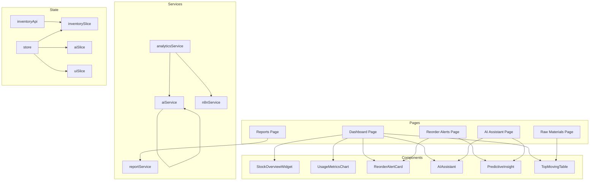
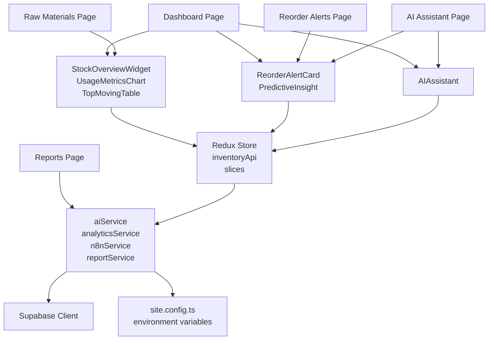
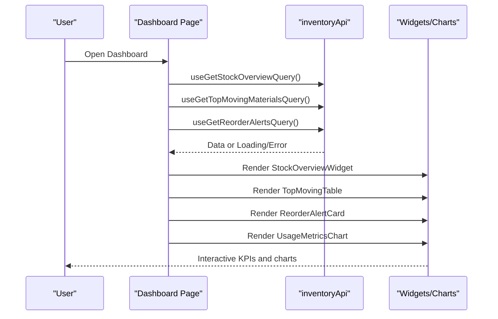
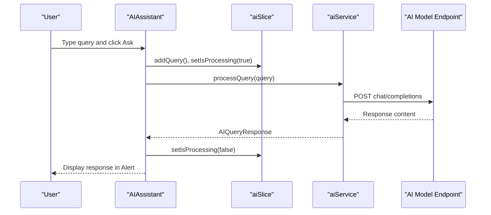
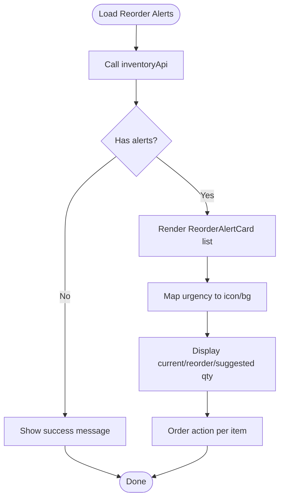
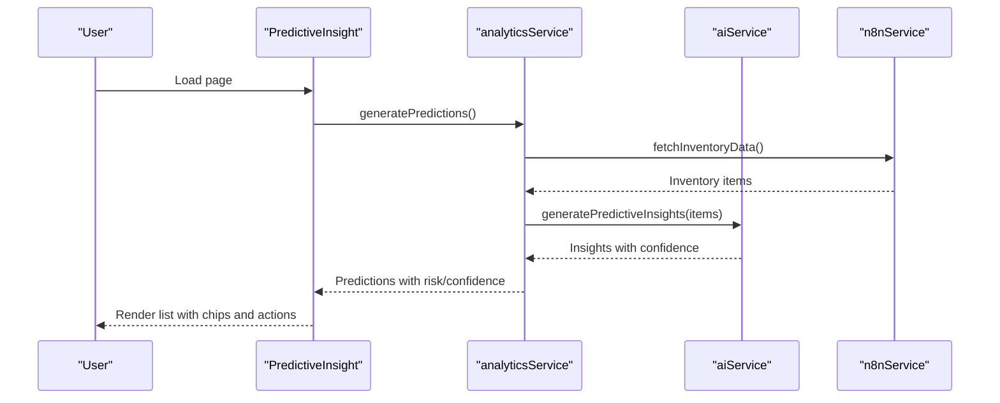
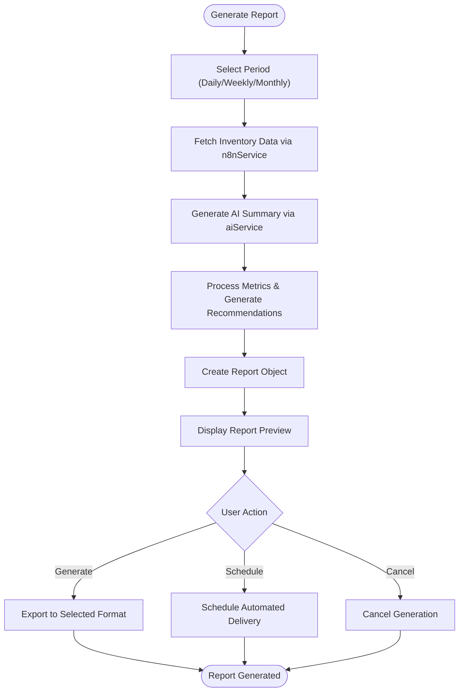
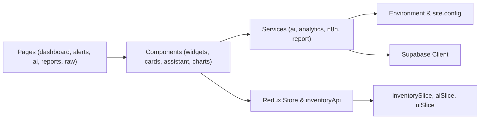

# Core Features

<cite>
**Referenced Files in This Document**
- [README.md](file://README.md)
- [site.config.ts](file://src/config/site.config.ts)
- [layout.tsx](file://src/app/layout.tsx)
- [store.ts](file://src/store/store.ts)
- [supabase.ts](file://src/lib/supabase.ts)
- [dashboard.page.tsx](file://src/app/dashboard/page.tsx)
- [StockOverviewWidget.tsx](file://src/components/inventory/StockOverviewWidget.tsx)
- [UsageMetricsChart.tsx](file://src/components/inventory/UsageMetricsChart.tsx)
- [reorder-alerts.page.tsx](file://src/app/reorder-alerts/page.tsx)
- [ReorderAlertCard.tsx](file://src/components/inventory/ReorderAlertCard.tsx)
- [ai-assistant.page.tsx](file://src/app/ai-assistant/page.tsx)
- [AIAssistant.tsx](file://src/components/ai/AIAssistant.tsx)
- [PredictiveInsight.tsx](file://src/components/ai/PredictiveInsight.tsx)
- [aiService.ts](file://src/services/aiService.ts)
- [analyticsService.ts](file://src/services/analyticsService.ts)
- [n8nService.ts](file://src/services/n8nService.ts)
- [reportService.ts](file://src/services/reportService.ts)
- [TopMovingTable.tsx](file://src/components/inventory/TopMovingTable.tsx)
- [inventoryApi.ts](file://src/store/api/inventoryApi.ts)
- [inventorySlice.ts](file://src/store/slices/inventorySlice.ts)
- [aiSlice.ts](file://src/store/slices/aiSlice.ts)
- [uiSlice.ts](file://src/store/slices/uiSlice.ts)
- [useRedux.ts](file://src/hooks/useRedux.ts)
- [useResponsive.ts](file://src/hooks/useResponsive.ts)
- [formatters.ts](file://src/utils/formatters.ts)
- [reports.page.tsx](file://src/app/reports/page.tsx)
- [raw-materials.page.tsx](file://src/app/raw-materials/page.tsx)
</cite>

## Update Summary
**Changes Made**
- Added comprehensive Reports and Analytics feature with automated report generation
- Enhanced AI Assistant functionality with expanded capabilities and improved user interface
- Strengthened Inventory Management system with predictive analytics and reorder alert improvements
- Expanded Mobile-Responsive UI components with new page layouts and responsive design patterns
- Integrated new Reports page with scheduling and export capabilities

## Table of Contents
1. [Introduction](#introduction)
2. [Project Structure](#project-structure)
3. [Core Components](#core-components)
4. [Architecture Overview](#architecture-overview)
5. [Detailed Component Analysis](#detailed-component-analysis)
6. [Dependency Analysis](#dependency-analysis)
7. [Performance Considerations](#performance-considerations)
8. [Troubleshooting Guide](#troubleshooting-guide)
9. [Conclusion](#conclusion)
10. [Appendices](#appendices)

## Introduction
This document explains the five primary features of the dashboard-ai system:
- Real-time inventory monitoring dashboard
- AI-powered natural language query interface
- Inventory management with reorder alerts
- Predictive analytics and reporting
- Mobile-responsive user interface

It covers each feature's purpose, implementation approach, user interaction patterns, and practical usage examples drawn from the codebase. Business users and technical stakeholders will find both conceptual explanations and concrete integration points.

**Updated** Enhanced with comprehensive Reports and Analytics capabilities, expanded AI Assistant functionality, and improved mobile-responsive design patterns.

## Project Structure
The application is a Next.js app bootstrapped with App Router. It organizes features by domain:
- Pages under src/app for routes (Dashboard, Raw Materials, Reorder Alerts, Reports, AI Assistant)
- UI components under src/components organized by domain (inventory, ai)
- Services under src/services for AI, analytics, n8n, and reporting
- State management via Redux Toolkit under src/store
- Configuration under src/config and environment variables
- Shared utilities and responsive hooks under src/utils and src/hooks

**Diagram sources**
- [dashboard.page.tsx:1-128](file://src/app/dashboard/page.tsx#L1-L128)
- [reorder-alerts.page.tsx:1-44](file://src/app/reorder-alerts/page.tsx#L1-L44)
- [ai-assistant.page.tsx:1-55](file://src/app/ai-assistant/page.tsx#L1-L55)
- [reports.page.tsx:1-96](file://src/app/reports/page.tsx#L1-L96)
- [raw-materials.page.tsx:1-38](file://src/app/raw-materials/page.tsx#L1-L38)
- [StockOverviewWidget.tsx:1-57](file://src/components/inventory/StockOverviewWidget.tsx#L1-L57)
- [UsageMetricsChart.tsx:1-161](file://src/components/inventory/UsageMetricsChart.tsx#L1-L161)
- [ReorderAlertCard.tsx:1-116](file://src/components/inventory/ReorderAlertCard.tsx#L1-L116)
- [AIAssistant.tsx:1-120](file://src/components/ai/AIAssistant.tsx#L1-L120)
- [PredictiveInsight.tsx:1-152](file://src/components/ai/PredictiveInsight.tsx#L1-L152)
- [TopMovingTable.tsx:1-98](file://src/components/inventory/TopMovingTable.tsx#L1-L98)
- [aiService.ts:1-219](file://src/services/aiService.ts#L1-L219)
- [analyticsService.ts:1-134](file://src/services/analyticsService.ts#L1-L134)
- [n8nService.ts](file://src/services/n8nService.ts)
- [reportService.ts:1-171](file://src/services/reportService.ts#L1-L171)
- [inventoryApi.ts:1-57](file://src/store/api/inventoryApi.ts#L1-L57)
- [inventorySlice.ts:1-56](file://src/store/slices/inventorySlice.ts#L1-L56)
- [aiSlice.ts](file://src/store/slices/aiSlice.ts)
- [uiSlice.ts](file://src/store/slices/uiSlice.ts)
- [store.ts:1-27](file://src/store/store.ts#L1-L27)

**Section sources**
- [README.md:1-37](file://README.md#L1-L37)
- [layout.tsx:1-31](file://src/app/layout.tsx#L1-L31)
- [site.config.ts:1-34](file://src/config/site.config.ts#L1-L34)
- [store.ts:1-27](file://src/store/store.ts#L1-L27)

## Core Components
This section outlines the five core features and how they are implemented across pages, components, services, and state.

- Real-time inventory monitoring dashboard
  - Purpose: Provide a live overview of stock levels, top-moving materials, reorder alerts, and usage trends.
  - Implementation: Dashboard page composes widgets and charts, pulling data via RTK Query hooks bound to inventoryApi.
  - User interaction: Users browse KPI cards, view top materials, inspect alerts, and explore usage forecasts.

- AI-powered natural language query interface
  - Purpose: Allow users to ask questions in plain English and receive contextual answers powered by an external AI model.
  - Implementation: AIAssistant component integrates with aiService to send queries and display responses; analyticsService orchestrates ML insights.
  - User interaction: Users type questions, submit via button or Enter, and receive concise, actionable responses.

- Inventory management with reorder alerts
  - Purpose: Surface materials needing reorder with urgency levels and suggested quantities.
  - Implementation: ReorderAlertCard renders alerts with severity-specific styling; analyticsService supplies predictions; n8nService provides inventory data.
  - User interaction: Users review alerts, click "Order" actions, and adjust reorder strategies.

- Predictive analytics and reporting
  - Purpose: Deliver demand forecasts, anomaly detection, and automated report summaries.
  - Implementation: PredictiveInsight component displays ML-driven predictions; analyticsService coordinates AI and n8n data; aiService generates insights and summaries.
  - User interaction: Users view confidence scores, risk levels, and recommendations; navigate forecast periods; generate summaries.

- Mobile-responsive user interface
  - Purpose: Ensure usability across devices with adaptive layouts and responsive components.
  - Implementation: Tailwind CSS and MUI components adapt to screen sizes; useResponsive hook supports responsive logic; site.config defines navigation and features.
  - User interaction: Users resize windows or switch devices and expect consistent layouts and interactions.

**Updated** Enhanced with comprehensive Reports and Analytics capabilities including automated report generation, scheduling, and export functionality.

**Section sources**
- [dashboard.page.tsx:1-128](file://src/app/dashboard/page.tsx#L1-L128)
- [StockOverviewWidget.tsx:1-57](file://src/components/inventory/StockOverviewWidget.tsx#L1-L57)
- [UsageMetricsChart.tsx:1-161](file://src/components/inventory/UsageMetricsChart.tsx#L1-L161)
- [reorder-alerts.page.tsx:1-44](file://src/app/reorder-alerts/page.tsx#L1-L44)
- [ReorderAlertCard.tsx:1-116](file://src/components/inventory/ReorderAlertCard.tsx#L1-L116)
- [ai-assistant.page.tsx:1-55](file://src/app/ai-assistant/page.tsx#L1-L55)
- [AIAssistant.tsx:1-120](file://src/components/ai/AIAssistant.tsx#L1-L120)
- [PredictiveInsight.tsx:1-152](file://src/components/ai/PredictiveInsight.tsx#L1-L152)
- [aiService.ts:1-219](file://src/services/aiService.ts#L1-L219)
- [analyticsService.ts:1-134](file://src/services/analyticsService.ts#L1-L134)
- [reports.page.tsx:1-96](file://src/app/reports/page.tsx#L1-L96)
- [reportService.ts:1-171](file://src/services/reportService.ts#L1-L171)
- [site.config.ts:1-34](file://src/config/site.config.ts#L1-L34)

## Architecture Overview
The system follows a layered architecture:
- Presentation Layer: Next.js App Router pages and MUI components
- Domain Services: aiService, analyticsService, n8nService, reportService
- Data Access: inventoryApi (RTK Query) and Supabase client
- State Management: Redux slices and store
- Configuration: site.config and environment variables

**Diagram sources**
- [dashboard.page.tsx:1-128](file://src/app/dashboard/page.tsx#L1-L128)
- [reorder-alerts.page.tsx:1-44](file://src/app/reorder-alerts/page.tsx#L1-L44)
- [ai-assistant.page.tsx:1-55](file://src/app/ai-assistant/page.tsx#L1-L55)
- [reports.page.tsx:1-96](file://src/app/reports/page.tsx#L1-L96)
- [raw-materials.page.tsx:1-38](file://src/app/raw-materials/page.tsx#L1-L38)
- [StockOverviewWidget.tsx:1-57](file://src/components/inventory/StockOverviewWidget.tsx#L1-L57)
- [UsageMetricsChart.tsx:1-161](file://src/components/inventory/UsageMetricsChart.tsx#L1-L161)
- [TopMovingTable.tsx:1-98](file://src/components/inventory/TopMovingTable.tsx#L1-L98)
- [ReorderAlertCard.tsx:1-116](file://src/components/inventory/ReorderAlertCard.tsx#L1-L116)
- [PredictiveInsight.tsx:1-152](file://src/components/ai/PredictiveInsight.tsx#L1-L152)
- [AIAssistant.tsx:1-120](file://src/components/ai/AIAssistant.tsx#L1-L120)
- [store.ts:1-27](file://src/store/store.ts#L1-L27)
- [inventoryApi.ts:1-57](file://src/store/api/inventoryApi.ts#L1-L57)
- [aiService.ts:1-219](file://src/services/aiService.ts#L1-L219)
- [analyticsService.ts:1-134](file://src/services/analyticsService.ts#L1-L134)
- [n8nService.ts](file://src/services/n8nService.ts)
- [reportService.ts:1-171](file://src/services/reportService.ts#L1-L171)
- [supabase.ts:1-21](file://src/lib/supabase.ts#L1-L21)
- [site.config.ts:1-34](file://src/config/site.config.ts#L1-L34)

## Detailed Component Analysis

### Real-time Inventory Monitoring Dashboard
Purpose
- Provide a centralized view of inventory health with live KPIs, top movers, alerts, and usage forecasts.

Implementation Approach
- Dashboard page composes:
  - StockOverviewWidget for high-level KPIs (total materials, low stock items, pending orders, turnover rate)
  - TopMovingTable for fast-moving materials
  - ReorderAlertCard for urgent reorder items
  - UsageMetricsChart for consumption vs forecast with selectable periods
- Data fetching uses RTK Query hooks bound to inventoryApi.

User Interaction Patterns
- Users scan KPIs, drill into top movers, review alerts, and toggle forecast periods to assess trends.

Practical Examples
- Loading states and error handling are integrated into the dashboard layout.
- Widgets render with responsive grid sizing for desktop and mobile.

**Diagram sources**
- [dashboard.page.tsx:1-128](file://src/app/dashboard/page.tsx#L1-L128)
- [StockOverviewWidget.tsx:1-57](file://src/components/inventory/StockOverviewWidget.tsx#L1-L57)
- [UsageMetricsChart.tsx:1-161](file://src/components/inventory/UsageMetricsChart.tsx#L1-L161)
- [ReorderAlertCard.tsx:1-116](file://src/components/inventory/ReorderAlertCard.tsx#L1-L116)
- [TopMovingTable.tsx:1-98](file://src/components/inventory/TopMovingTable.tsx#L1-L98)
- [inventoryApi.ts:1-57](file://src/store/api/inventoryApi.ts#L1-L57)

**Section sources**
- [dashboard.page.tsx:1-128](file://src/app/dashboard/page.tsx#L1-L128)
- [StockOverviewWidget.tsx:1-57](file://src/components/inventory/StockOverviewWidget.tsx#L1-L57)
- [UsageMetricsChart.tsx:1-161](file://src/components/inventory/UsageMetricsChart.tsx#L1-L161)
- [TopMovingTable.tsx:1-98](file://src/components/inventory/TopMovingTable.tsx#L1-L98)

### AI-Powered Natural Language Query Interface
Purpose
- Enable users to ask questions about inventory, reorder points, usage trends, and forecasts using natural language.

Implementation Approach
- AIAssistant component:
  - Captures user input, dispatches Redux actions to track processing state
  - Calls aiService.processQuery to send a structured prompt to the AI model
  - Displays responses in an alert and handles errors gracefully
- PredictiveInsight component:
  - Uses analyticsService to fetch ML-driven predictions
  - Renders confidence, risk levels, and recommendations

User Interaction Patterns
- Users type a question, press Enter or click "Ask", and receive a concise response with optional processing indicator.

Practical Examples
- Example prompts include requests for top movers and reorder status.
- Responses are generated using a system prompt tailored for inventory management.

**Diagram sources**
- [AIAssistant.tsx:1-120](file://src/components/ai/AIAssistant.tsx#L1-L120)
- [aiSlice.ts](file://src/store/slices/aiSlice.ts)
- [aiService.ts:1-219](file://src/services/aiService.ts#L1-L219)

**Section sources**
- [ai-assistant.page.tsx:1-55](file://src/app/ai-assistant/page.tsx#L1-L55)
- [AIAssistant.tsx:1-120](file://src/components/ai/AIAssistant.tsx#L1-L120)
- [PredictiveInsight.tsx:1-152](file://src/components/ai/PredictiveInsight.tsx#L1-L152)
- [aiService.ts:1-219](file://src/services/aiService.ts#L1-L219)
- [analyticsService.ts:1-134](file://src/services/analyticsService.ts#L1-L134)

### Inventory Management with Reorder Alerts
Purpose
- Highlight materials approaching or below reorder points, show urgency, and suggest order quantities.

Implementation Approach
- ReorderAlertCard:
  - Renders alerts with severity icons and background colors
  - Displays current stock, reorder point, and suggested quantity
  - Provides "Order" action per alert
- Data source:
  - inventoryApi provides reorder alerts
  - analyticsService supplies predictions and risk levels
  - n8nService provides inventory data

User Interaction Patterns
- Users scan alerts, read urgency, and initiate purchase orders.

Practical Examples
- Alerts are grouped by urgency (critical, warning, info) with distinct styling.
- When no alerts exist, a success message indicates optimal stock levels.

**Diagram sources**
- [reorder-alerts.page.tsx:1-44](file://src/app/reorder-alerts/page.tsx#L1-L44)
- [ReorderAlertCard.tsx:1-116](file://src/components/inventory/ReorderAlertCard.tsx#L1-L116)
- [inventoryApi.ts:1-57](file://src/store/api/inventoryApi.ts#L1-L57)
- [analyticsService.ts:1-134](file://src/services/analyticsService.ts#L1-L134)

**Section sources**
- [reorder-alerts.page.tsx:1-44](file://src/app/reorder-alerts/page.tsx#L1-L44)
- [ReorderAlertCard.tsx:1-116](file://src/components/inventory/ReorderAlertCard.tsx#L1-L116)
- [analyticsService.ts:1-134](file://src/services/analyticsService.ts#L1-L134)

### Predictive Analytics and Reporting
Purpose
- Provide demand forecasts, anomaly detection, and automated report summaries.

Implementation Approach
- PredictiveInsight:
  - Loads ML predictions via analyticsService
  - Displays confidence, risk level, predicted demand, and recommendations
- analyticsService:
  - Orchestrates AI insights and fallbacks
  - Calculates reorder points and forecasts using ML logic
- aiService:
  - Generates insights, summaries, and anomaly detections
- n8nService:
  - Supplies inventory and usage metrics data
- reportService:
  - Generates automated reports with AI-written summaries
  - Provides scheduling and export capabilities

User Interaction Patterns
- Users view confidence scores, risk chips, and recommendations; toggle forecast periods; generate summaries.

Practical Examples
- Forecast demand for week/month/quarter with confidence intervals.
- Anomaly detection identifies unusual consumption patterns.
- Automated report generation with scheduling and export functionality.

**Diagram sources**
- [PredictiveInsight.tsx:1-152](file://src/components/ai/PredictiveInsight.tsx#L1-L152)
- [analyticsService.ts:1-134](file://src/services/analyticsService.ts#L1-L134)
- [aiService.ts:1-219](file://src/services/aiService.ts#L1-L219)
- [n8nService.ts](file://src/services/n8nService.ts)

**Section sources**
- [PredictiveInsight.tsx:1-152](file://src/components/ai/PredictiveInsight.tsx#L1-L152)
- [analyticsService.ts:1-134](file://src/services/analyticsService.ts#L1-L134)
- [aiService.ts:1-219](file://src/services/aiService.ts#L1-L219)
- [reports.page.tsx:1-96](file://src/app/reports/page.tsx#L1-L96)
- [reportService.ts:1-171](file://src/services/reportService.ts#L1-L171)

### Mobile-Responsive User Interface
Purpose
- Ensure the dashboard and feature pages are usable on phones and tablets.

Implementation Approach
- Layout:
  - Root layout wraps children with ThemeProvider and global styles
  - Navigation configured in site.config
- Components:
  - MUI Grid and responsive breakpoints adapt widget widths
  - Typography and spacing scale across device sizes
- Hooks:
  - useResponsive supports responsive logic
  - useRedux integrates with the store

User Interaction Patterns
- Users resize the viewport and expect stacked grids, readable typography, and accessible controls.

Practical Examples
- Dashboard grid stacks on small screens; charts remain responsive.
- Navigation items are defined centrally for consistent access.

**Section sources**
- [layout.tsx:1-31](file://src/app/layout.tsx#L1-L31)
- [site.config.ts:1-34](file://src/config/site.config.ts#L1-L34)
- [dashboard.page.tsx:1-128](file://src/app/dashboard/page.tsx#L1-L128)
- [useResponsive.ts](file://src/hooks/useResponsive.ts)

### Reports and Analytics Feature
Purpose
- Provide automated inventory reporting with AI-generated summaries, scheduling capabilities, and export functionality.

Implementation Approach
- Reports page:
  - Allows users to generate daily, weekly, and monthly reports
  - Provides scheduling for automated report delivery
  - Supports export to PDF and Excel formats
- reportService:
  - Integrates with aiService for AI-generated summaries
  - Uses n8nService for inventory data extraction
  - Provides mock fallbacks for development and testing
- AI integration:
  - AI-generated executive summaries
  - Actionable recommendations based on inventory metrics
  - Automated report scheduling and distribution

User Interaction Patterns
- Users select report period, generate reports, schedule automated delivery, and export results.

Practical Examples
- Daily reports for operational oversight
- Weekly reports for management review
- Monthly reports for strategic planning
- Automated scheduling for regular report delivery

**Diagram sources**
- [reports.page.tsx:1-96](file://src/app/reports/page.tsx#L1-L96)
- [reportService.ts:1-171](file://src/services/reportService.ts#L1-L171)
- [aiService.ts:1-219](file://src/services/aiService.ts#L1-L219)
- [n8nService.ts](file://src/services/n8nService.ts)

**Section sources**
- [reports.page.tsx:1-96](file://src/app/reports/page.tsx#L1-L96)
- [reportService.ts:1-171](file://src/services/reportService.ts#L1-L171)
- [aiService.ts:1-219](file://src/services/aiService.ts#L1-L219)
- [analyticsService.ts:1-134](file://src/services/analyticsService.ts#L1-L134)

## Dependency Analysis
The system exhibits clear separation of concerns:
- Pages depend on components and RTK Query hooks
- Components depend on services and Redux slices
- Services depend on environment-configured endpoints and n8n data
- State management consolidates reducers and middleware

**Diagram sources**
- [store.ts:1-27](file://src/store/store.ts#L1-L27)
- [inventoryApi.ts:1-57](file://src/store/api/inventoryApi.ts#L1-L57)
- [site.config.ts:1-34](file://src/config/site.config.ts#L1-L34)
- [supabase.ts:1-21](file://src/lib/supabase.ts#L1-L21)

**Section sources**
- [store.ts:1-27](file://src/store/store.ts#L1-L27)
- [site.config.ts:1-34](file://src/config/site.config.ts#L1-L34)

## Performance Considerations
- Caching and TTL:
  - site.config defines default cache TTLs for reorder alerts and usage metrics to balance freshness and performance.
- Polling:
  - n8n polling interval is configurable for upstream data synchronization.
- Lazy loading and responsive charts:
  - UsageMetricsChart uses responsive containers and conditional rendering to minimize heavy DOM work.
- State normalization:
  - inventoryApi middleware and slices keep state normalized and efficient.
- Report generation optimization:
  - reportService implements caching and fallback mechanisms for report generation.
- AI query optimization:
  - AIAssistant includes processing state management and error handling for better user experience.

## Troubleshooting Guide
Common issues and remedies:
- AI query failures:
  - The AIAssistant component catches errors and displays a friendly message while resetting processing state.
  - Verify environment variables for AI model endpoint, API key, and model name.
- Missing or empty data:
  - Dashboard and Reorder Alerts pages show loading spinners and error alerts when data is unavailable.
  - Confirm n8n webhook connectivity and that analyticsService can fetch inventory/usage metrics.
- Reorder alerts not appearing:
  - Ensure analyticsService can derive predictions and that inventoryApi is returning data.
- Report generation failures:
  - Verify reportService can connect to aiService and n8nService.
  - Check that scheduled reports are properly configured.
- Responsive layout issues:
  - Verify Tailwind and MUI breakpoints; confirm useResponsive hook usage where needed.

**Section sources**
- [AIAssistant.tsx:1-120](file://src/components/ai/AIAssistant.tsx#L1-L120)
- [dashboard.page.tsx:1-128](file://src/app/dashboard/page.tsx#L1-L128)
- [reorder-alerts.page.tsx:1-44](file://src/app/reorder-alerts/page.tsx#L1-L44)
- [reports.page.tsx:1-96](file://src/app/reports/page.tsx#L1-L96)
- [aiService.ts:1-219](file://src/services/aiService.ts#L1-L219)
- [analyticsService.ts:1-134](file://src/services/analyticsService.ts#L1-L134)
- [reportService.ts:1-171](file://src/services/reportService.ts#L1-L171)
- [site.config.ts:1-34](file://src/config/site.config.ts#L1-L34)

## Conclusion
The dashboard-ai system delivers a cohesive, scalable solution for inventory visibility and intelligence:
- Real-time dashboards provide instant insights
- AI assistants democratize access to inventory data
- Reorder alerts streamline procurement workflows
- Predictive analytics empower forward-looking decisions
- Reports and analytics provide comprehensive business intelligence
- Responsive UI ensures accessibility across devices

By leveraging RTK Query, Redux, MUI, and modular services, the system balances maintainability with performance and extensibility.

## Appendices
- Environment variables and configuration:
  - AI model endpoint, API key, and model name
  - n8n webhook URL, API key, and polling interval
  - Cache TTLs for various endpoints
- Integration patterns:
  - Use aiService for natural language queries and insights
  - Use analyticsService for ML-driven predictions and anomaly detection
  - Use inventoryApi for real-time data retrieval
  - Use reportService for automated report generation and scheduling
  - Use Supabase for user preferences and credentials (not inventory data)

**Section sources**
- [site.config.ts:1-34](file://src/config/site.config.ts#L1-L34)
- [aiService.ts:1-219](file://src/services/aiService.ts#L1-L219)
- [analyticsService.ts:1-134](file://src/services/analyticsService.ts#L1-L134)
- [n8nService.ts](file://src/services/n8nService.ts)
- [reportService.ts:1-171](file://src/services/reportService.ts#L1-L171)
- [supabase.ts:1-21](file://src/lib/supabase.ts#L1-L21)