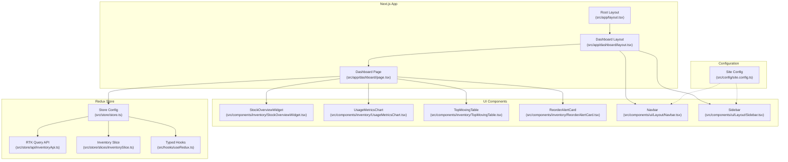
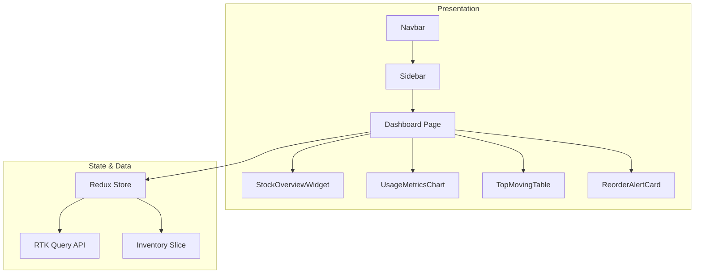
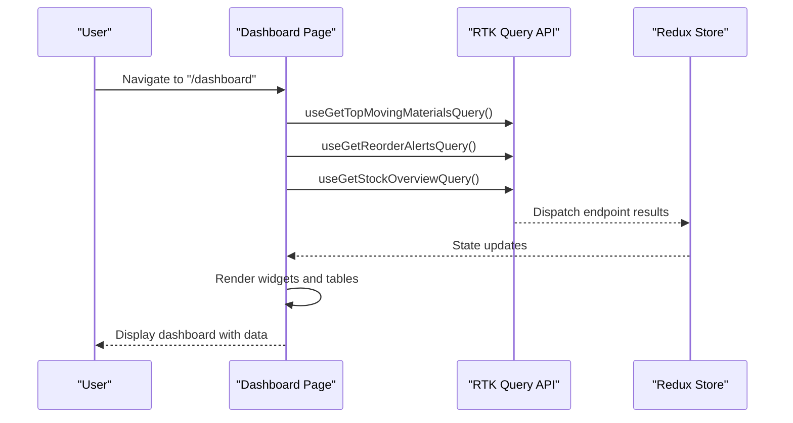
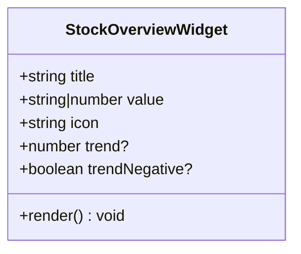
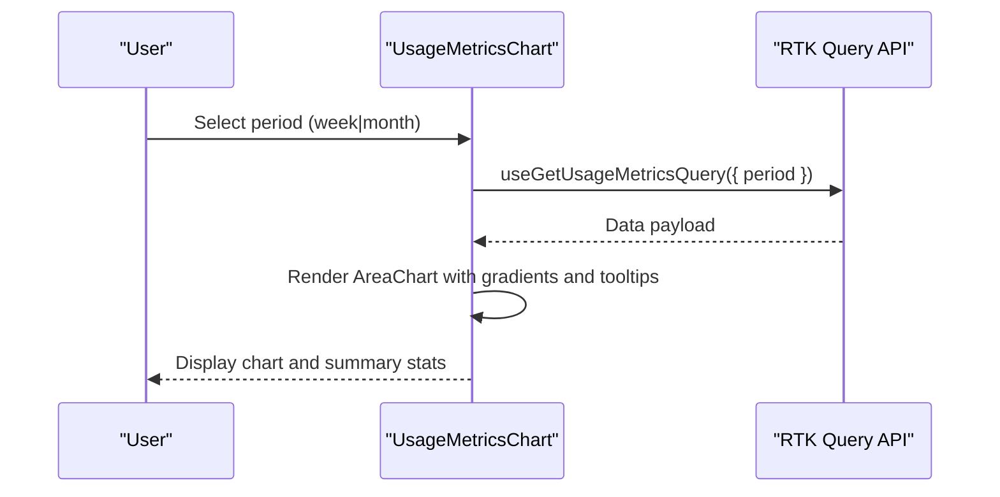
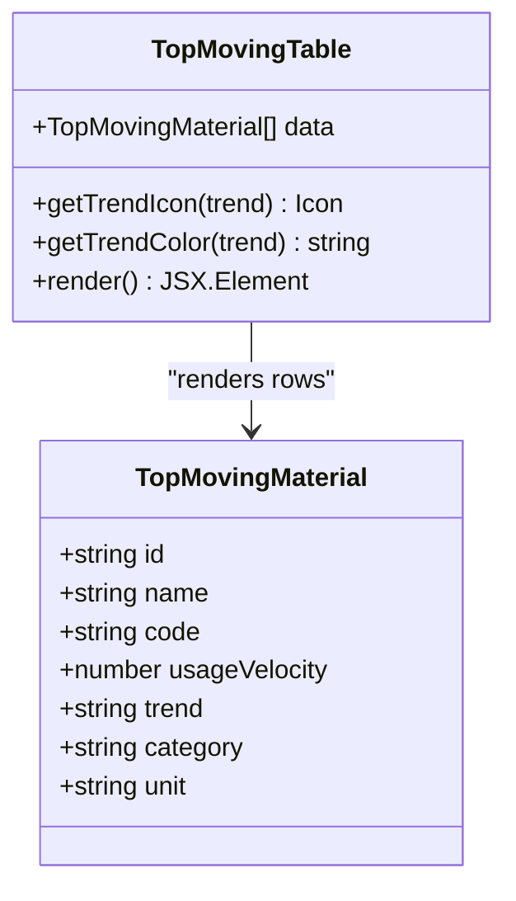
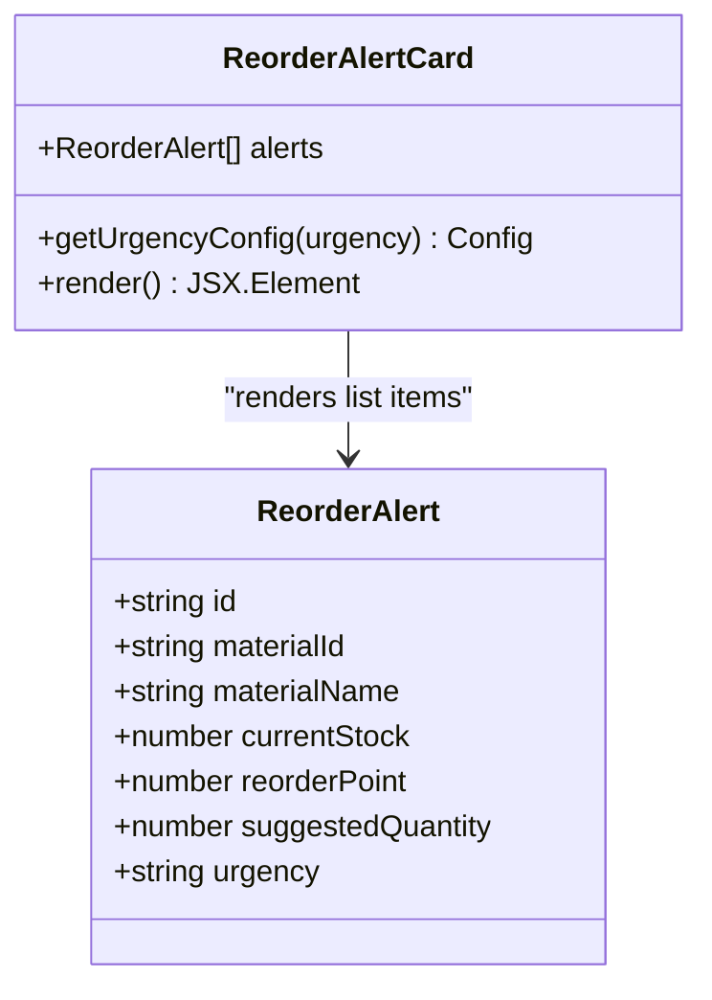
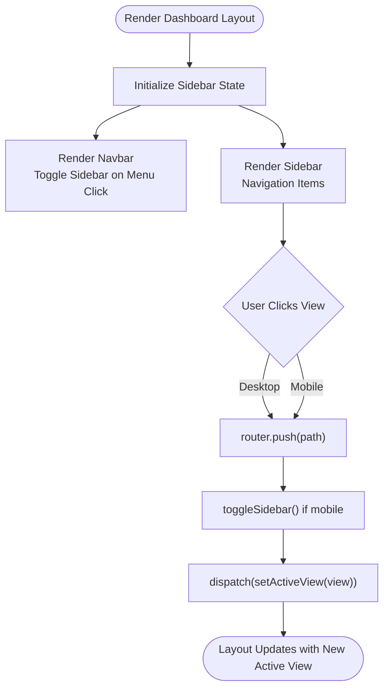
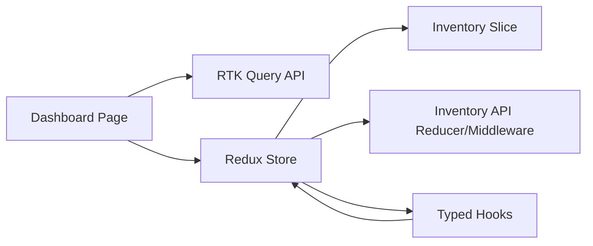

# Dashboard Interface

<cite>
**Referenced Files in This Document**
- [src/app/dashboard/page.tsx](file://src/app/dashboard/page.tsx)
- [src/app/dashboard/layout.tsx](file://src/app/dashboard/layout.tsx)
- [src/components/inventory/StockOverviewWidget.tsx](file://src/components/inventory/StockOverviewWidget.tsx)
- [src/components/inventory/UsageMetricsChart.tsx](file://src/components/inventory/UsageMetricsChart.tsx)
- [src/components/inventory/TopMovingTable.tsx](file://src/components/inventory/TopMovingTable.tsx)
- [src/components/inventory/ReorderAlertCard.tsx](file://src/components/inventory/ReorderAlertCard.tsx)
- [src/components/ui/Layout/Navbar.tsx](file://src/components/ui/Layout/Navbar.tsx)
- [src/components/ui/Layout/Sidebar.tsx](file://src/components/ui/Layout/Sidebar.tsx)
- [src/store/api/inventoryApi.ts](file://src/store/api/inventoryApi.ts)
- [src/store/slices/inventorySlice.ts](file://src/store/slices/inventorySlice.ts)
- [src/store/store.ts](file://src/store/store.ts)
- [src/hooks/useRedux.ts](file://src/hooks/useRedux.ts)
- [src/app/layout.tsx](file://src/app/layout.tsx)
- [src/config/site.config.ts](file://src/config/site.config.ts)
</cite>

## Table of Contents
1. [Introduction](#introduction)
2. [Project Structure](#project-structure)
3. [Core Components](#core-components)
4. [Architecture Overview](#architecture-overview)
5. [Detailed Component Analysis](#detailed-component-analysis)
6. [Dependency Analysis](#dependency-analysis)
7. [Performance Considerations](#performance-considerations)
8. [Troubleshooting Guide](#troubleshooting-guide)
9. [Conclusion](#conclusion)
10. [Appendices](#appendices)

## Introduction
This document describes the dashboard interface feature that serves as the primary operational window for inventory oversight at Pupuk Sriwijaya. It covers the real-time inventory monitoring dashboard, including the StockOverviewWidget component for current stock levels, the UsageMetricsChart for usage and forecasting visualization, and the overall dashboard layout and navigation. The dashboard aggregates data from backend APIs via Redux Query and presents it in a widget-based, responsive layout. It also documents configuration options for customizing widget layouts, integration patterns with the Redux store, performance considerations for real-time updates, and user interaction patterns for navigating between inventory views.

## Project Structure
The dashboard feature is organized around a Next.js app directory with a dedicated dashboard route, MUI-based UI components, and a Redux Toolkit store with RTK Query for data fetching. The layout integrates a persistent navigation bar and a collapsible sidebar with view switching capabilities.

**Diagram sources**
- [src/app/dashboard/page.tsx:1-128](file://src/app/dashboard/page.tsx#L1-L128)
- [src/app/dashboard/layout.tsx:1-42](file://src/app/dashboard/layout.tsx#L1-L42)
- [src/app/layout.tsx:1-31](file://src/app/layout.tsx#L1-L31)
- [src/components/inventory/StockOverviewWidget.tsx:1-57](file://src/components/inventory/StockOverviewWidget.tsx#L1-L57)
- [src/components/inventory/UsageMetricsChart.tsx:1-160](file://src/components/inventory/UsageMetricsChart.tsx#L1-L160)
- [src/components/inventory/TopMovingTable.tsx:1-100](file://src/components/inventory/TopMovingTable.tsx#L1-L100)
- [src/components/inventory/ReorderAlertCard.tsx:1-105](file://src/components/inventory/ReorderAlertCard.tsx#L1-L105)
- [src/components/ui/Layout/Navbar.tsx:1-61](file://src/components/ui/Layout/Navbar.tsx#L1-L61)
- [src/components/ui/Layout/Sidebar.tsx:1-133](file://src/components/ui/Layout/Sidebar.tsx#L1-L133)
- [src/store/store.ts:1-27](file://src/store/store.ts#L1-L27)
- [src/store/api/inventoryApi.ts:1-57](file://src/store/api/inventoryApi.ts#L1-L57)
- [src/store/slices/inventorySlice.ts:1-56](file://src/store/slices/inventorySlice.ts#L1-L56)
- [src/hooks/useRedux.ts:1-6](file://src/hooks/useRedux.ts#L1-L6)
- [src/config/site.config.ts:1-34](file://src/config/site.config.ts#L1-L34)

**Section sources**
- [src/app/dashboard/page.tsx:1-128](file://src/app/dashboard/page.tsx#L1-L128)
- [src/app/dashboard/layout.tsx:1-42](file://src/app/dashboard/layout.tsx#L1-L42)
- [src/app/layout.tsx:1-31](file://src/app/layout.tsx#L1-L31)

## Core Components
- Dashboard Page: Orchestrates data fetching, layout, and widget rendering. It composes StockOverviewWidget, UsageMetricsChart, TopMovingTable, and ReorderAlertCard, and handles loading and error states.
- StockOverviewWidget: Displays KPI-style cards with icons, values, and optional trend indicators for total materials, low stock items, pending orders, and turnover rate.
- UsageMetricsChart: Renders area charts for actual consumption vs forecast with selectable weekly/monthly periods, plus summary statistics.
- TopMovingTable: Presents fast-moving raw materials with ranking, category chips, usage velocity, trend icons, and units.
- ReorderAlertCard: Visualizes reorder alerts with urgency-based styling, current stock vs reorder point, and suggested order quantities.
- Dashboard Layout: Provides the main layout with Navbar and Sidebar, managing responsive sidebar behavior and content padding.
- Navigation: Navbar triggers sidebar toggling; Sidebar provides view navigation and maintains active view state.

**Section sources**
- [src/app/dashboard/page.tsx:17-127](file://src/app/dashboard/page.tsx#L17-L127)
- [src/components/inventory/StockOverviewWidget.tsx:8-56](file://src/components/inventory/StockOverviewWidget.tsx#L8-L56)
- [src/components/inventory/UsageMetricsChart.tsx:47-158](file://src/components/inventory/UsageMetricsChart.tsx#L47-L158)
- [src/components/inventory/TopMovingTable.tsx:19-99](file://src/components/inventory/TopMovingTable.tsx#L19-L99)
- [src/components/inventory/ReorderAlertCard.tsx:19-104](file://src/components/inventory/ReorderAlertCard.tsx#L19-L104)
- [src/app/dashboard/layout.tsx:10-41](file://src/app/dashboard/layout.tsx#L10-L41)
- [src/components/ui/Layout/Navbar.tsx:17-60](file://src/components/ui/Layout/Navbar.tsx#L17-L60)
- [src/components/ui/Layout/Sidebar.tsx:34-132](file://src/components/ui/Layout/Sidebar.tsx#L34-L132)

## Architecture Overview
The dashboard follows a widget-based architecture with a clear separation of concerns:
- Data Layer: RTK Query endpoints define typed queries and caching policies.
- State Layer: Redux slices manage local UI inventory state.
- Presentation Layer: MUI components render dashboards and charts.
- Navigation Layer: Sidebar and Navbar coordinate routing and active view selection.

**Diagram sources**
- [src/app/dashboard/page.tsx:1-128](file://src/app/dashboard/page.tsx#L1-L128)
- [src/store/store.ts:1-27](file://src/store/store.ts#L1-L27)
- [src/store/api/inventoryApi.ts:23-49](file://src/store/api/inventoryApi.ts#L23-L49)
- [src/store/slices/inventorySlice.ts:21-56](file://src/store/slices/inventorySlice.ts#L21-L56)
- [src/components/ui/Layout/Navbar.tsx:17-60](file://src/components/ui/Layout/Navbar.tsx#L17-L60)
- [src/components/ui/Layout/Sidebar.tsx:34-132](file://src/components/ui/Layout/Sidebar.tsx#L34-L132)

## Detailed Component Analysis

### Dashboard Page Workflow
The dashboard page coordinates multiple data sources and renders a responsive grid of widgets. It uses RTK Query hooks to fetch top-moving materials, reorder alerts, and stock overview data, and displays loading and error states appropriately.

**Diagram sources**
- [src/app/dashboard/page.tsx:17-127](file://src/app/dashboard/page.tsx#L17-L127)
- [src/store/api/inventoryApi.ts:51-56](file://src/store/api/inventoryApi.ts#L51-L56)

**Section sources**
- [src/app/dashboard/page.tsx:17-127](file://src/app/dashboard/page.tsx#L17-L127)

### StockOverviewWidget
A reusable card component that displays a metric with an icon, value, and optional trend indicator. It supports positive/negative trend coloring and responsive layout.

**Diagram sources**
- [src/components/inventory/StockOverviewWidget.tsx:8-56](file://src/components/inventory/StockOverviewWidget.tsx#L8-L56)

**Section sources**
- [src/components/inventory/StockOverviewWidget.tsx:16-56](file://src/components/inventory/StockOverviewWidget.tsx#L16-L56)

### UsageMetricsChart
A responsive chart component that visualizes usage metrics and forecasts. It supports weekly and monthly periods, includes summary statistics, and handles loading and error states.

**Diagram sources**
- [src/components/inventory/UsageMetricsChart.tsx:47-158](file://src/components/inventory/UsageMetricsChart.tsx#L47-L158)
- [src/store/api/inventoryApi.ts:38-47](file://src/store/api/inventoryApi.ts#L38-L47)

**Section sources**
- [src/components/inventory/UsageMetricsChart.tsx:47-158](file://src/components/inventory/UsageMetricsChart.tsx#L47-L158)

### TopMovingTable
Displays a ranked list of fast-moving raw materials with category chips, usage velocity, and trend indicators.

**Diagram sources**
- [src/components/inventory/TopMovingTable.tsx:15-99](file://src/components/inventory/TopMovingTable.tsx#L15-L99)
- [src/store/api/inventoryApi.ts:3-11](file://src/store/api/inventoryApi.ts#L3-L11)

**Section sources**
- [src/components/inventory/TopMovingTable.tsx:19-99](file://src/components/inventory/TopMovingTable.tsx#L19-L99)

### ReorderAlertCard
Visualizes reorder alerts with urgency-based styling and suggested order quantities.

**Diagram sources**
- [src/components/inventory/ReorderAlertCard.tsx:15-104](file://src/components/inventory/ReorderAlertCard.tsx#L15-L104)
- [src/store/api/inventoryApi.ts:13-21](file://src/store/api/inventoryApi.ts#L13-L21)

**Section sources**
- [src/components/inventory/ReorderAlertCard.tsx:19-104](file://src/components/inventory/ReorderAlertCard.tsx#L19-L104)

### Dashboard Layout and Navigation
The layout integrates a fixed Navbar and a collapsible Sidebar. The Sidebar manages navigation to different views and toggles its own width. The main content area adjusts margins based on sidebar state and responsive breakpoints.

**Diagram sources**
- [src/app/dashboard/layout.tsx:10-41](file://src/app/dashboard/layout.tsx#L10-L41)
- [src/components/ui/Layout/Navbar.tsx:17-60](file://src/components/ui/Layout/Navbar.tsx#L17-L60)
- [src/components/ui/Layout/Sidebar.tsx:34-132](file://src/components/ui/Layout/Sidebar.tsx#L34-L132)

**Section sources**
- [src/app/dashboard/layout.tsx:10-41](file://src/app/dashboard/layout.tsx#L10-L41)
- [src/components/ui/Layout/Navbar.tsx:17-60](file://src/components/ui/Layout/Navbar.tsx#L17-L60)
- [src/components/ui/Layout/Sidebar.tsx:34-132](file://src/components/ui/Layout/Sidebar.tsx#L34-L132)

## Dependency Analysis
The dashboard depends on RTK Query for data fetching and Redux for state management. The store combines slice reducers and RTK Query middleware. Typed hooks simplify dispatch and selector usage.

**Diagram sources**
- [src/app/dashboard/page.tsx:3-20](file://src/app/dashboard/page.tsx#L3-L20)
- [src/store/store.ts:1-27](file://src/store/store.ts#L1-L27)
- [src/store/api/inventoryApi.ts:23-49](file://src/store/api/inventoryApi.ts#L23-L49)
- [src/store/slices/inventorySlice.ts:21-56](file://src/store/slices/inventorySlice.ts#L21-L56)
- [src/hooks/useRedux.ts:1-6](file://src/hooks/useRedux.ts#L1-L6)

**Section sources**
- [src/store/store.ts:1-27](file://src/store/store.ts#L1-L27)
- [src/store/api/inventoryApi.ts:23-49](file://src/store/api/inventoryApi.ts#L23-L49)
- [src/store/slices/inventorySlice.ts:21-56](file://src/store/slices/inventorySlice.ts#L21-L56)
- [src/hooks/useRedux.ts:1-6](file://src/hooks/useRedux.ts#L1-L6)

## Performance Considerations
- Caching and Keep-Unused Data: RTK Query endpoints specify cache retention durations to balance freshness and performance.
- Loading States: Centralized loading and error handling prevent unnecessary re-renders and improve UX.
- Responsive Charts: Responsive containers adapt to viewport changes without heavy computations.
- Minimal Re-renders: Widget components are self-contained and only re-render when props change.
- Sidebar Responsiveness: Collapsible sidebar reduces layout thrashing on smaller screens.

Practical tips:
- Adjust keepUnusedDataFor values in endpoints to match update frequency.
- Debounce or throttle frequent user interactions (e.g., chart period selection).
- Lazy-load heavy components if needed.
- Monitor network requests and consider background refetch strategies.

**Section sources**
- [src/store/api/inventoryApi.ts:30-47](file://src/store/api/inventoryApi.ts#L30-L47)
- [src/components/inventory/UsageMetricsChart.tsx:47-59](file://src/components/inventory/UsageMetricsChart.tsx#L47-L59)
- [src/app/dashboard/page.tsx:24-30](file://src/app/dashboard/page.tsx#L24-L30)

## Troubleshooting Guide
Common issues and resolutions:
- Data not loading: Verify endpoint URLs and network connectivity; check console errors; confirm that RTK Query hooks are used correctly.
- Empty reorder alerts: The component displays a success message when no alerts are present; ensure backend returns empty arrays when appropriate.
- Chart errors: Confirm that mock data or API responses match expected shapes; verify tooltip and legend keys.
- Sidebar not toggling: Ensure dispatch actions are called and UI slice state is connected to selectors.
- Type mismatches: Use the provided TypeScript interfaces for data structures to avoid runtime errors.

**Section sources**
- [src/components/inventory/ReorderAlertCard.tsx:43-49](file://src/components/inventory/ReorderAlertCard.tsx#L43-L49)
- [src/components/inventory/UsageMetricsChart.tsx:61-63](file://src/components/inventory/UsageMetricsChart.tsx#L61-L63)
- [src/components/ui/Layout/Sidebar.tsx:42-48](file://src/components/ui/Layout/Sidebar.tsx#L42-L48)

## Conclusion
The dashboard provides a comprehensive, real-time inventory oversight interface built on a modular, widget-based architecture. It leverages RTK Query for efficient data fetching and caching, Redux for state management, and MUI for responsive UI components. The layout and navigation enable seamless exploration of inventory insights, while configuration options support customization and performance tuning.

## Appendices

### Practical Usage Examples
- Viewing top-moving materials: Navigate to the dashboard; the TopMovingTable displays ranked materials with usage velocity and trends.
- Monitoring reorder alerts: The ReorderAlertCard highlights urgent items with suggested order quantities.
- Checking stock overview: Four KPI cards show total materials, low stock items, pending orders, and turnover rate.
- Analyzing usage and forecasts: The UsageMetricsChart allows switching between weekly and monthly views to compare actual consumption and forecast.

### Configuration Options
- Endpoint caching: Configure keepUnusedDataFor per endpoint to control cache TTL.
- Sidebar behavior: Responsive width and mobile behavior are handled by the Sidebar component.
- Feature flags: Site configuration includes feature toggles for AI-powered features and real-time updates.

**Section sources**
- [src/config/site.config.ts:22-32](file://src/config/site.config.ts#L22-L32)
- [src/store/api/inventoryApi.ts:30-47](file://src/store/api/inventoryApi.ts#L30-L47)
- [src/components/ui/Layout/Sidebar.tsx:50-65](file://src/components/ui/Layout/Sidebar.tsx#L50-L65)