# Dashboard Interface

<cite>
**Referenced Files in This Document**
- [src/app/dashboard/page.tsx](file://src/app/dashboard/page.tsx)
- [src/app/dashboard/layout.tsx](file://src/app/dashboard/layout.tsx)
- [src/app/ai-assistant/page.tsx](file://src/app/ai-assistant/page.tsx)
- [src/components/inventory/StockOverviewWidget.tsx](file://src/components/inventory/StockOverviewWidget.tsx)
- [src/components/inventory/UsageMetricsChart.tsx](file://src/components/inventory/UsageMetricsChart.tsx)
- [src/components/inventory/TopMovingTable.tsx](file://src/components/inventory/TopMovingTable.tsx)
- [src/components/inventory/ReorderAlertCard.tsx](file://src/components/inventory/ReorderAlertCard.tsx)
- [src/components/ai/AIAssistant.tsx](file://src/components/ai/AIAssistant.tsx)
- [src/components/ai/PredictiveInsight.tsx](file://src/components/ai/PredictiveInsight.tsx)
- [src/components/ui/Layout/Navbar.tsx](file://src/components/ui/Layout/Navbar.tsx)
- [src/components/ui/Layout/Sidebar.tsx](file://src/components/ui/Layout/Sidebar.tsx)
- [src/services/aiService.ts](file://src/services/aiService.ts)
- [src/services/analyticsService.ts](file://src/services/analyticsService.ts)
- [src/services/n8nService.ts](file://src/services/n8nService.ts)
- [src/store/api/inventoryApi.ts](file://src/store/api/inventoryApi.ts)
- [src/store/slices/inventorySlice.ts](file://src/store/slices/inventorySlice.ts)
- [src/store/slices/aiSlice.ts](file://src/store/slices/aiSlice.ts)
- [src/store/store.ts](file://src/store/store.ts)
- [src/hooks/useRedux.ts](file://src/hooks/useRedux.ts)
- [src/app/layout.tsx](file://src/app/layout.tsx)
- [src/config/site.config.ts](file://src/config/site.config.ts)
</cite>

## Update Summary
**Changes Made**
- Added comprehensive AI-powered insights section with natural language processing capabilities
- Integrated real-time inventory monitoring with polling-based updates
- Enhanced interactive data visualization with predictive analytics
- Added AI Assistant component for natural language queries
- Integrated Predictive Insights component for machine learning-based recommendations
- Updated architecture diagrams to reflect AI services integration
- Enhanced performance considerations for AI-powered features

## Table of Contents
1. [Introduction](#introduction)
2. [Project Structure](#project-structure)
3. [Core Components](#core-components)
4. [Architecture Overview](#architecture-overview)
5. [Detailed Component Analysis](#detailed-component-analysis)
6. [AI-Powered Features](#ai-powered-features)
7. [Real-Time Monitoring](#real-time-monitoring)
8. [Interactive Data Visualization](#interactive-data-visualization)
9. [Dependency Analysis](#dependency-analysis)
10. [Performance Considerations](#performance-considerations)
11. [Troubleshooting Guide](#troubleshooting-guide)
12. [Conclusion](#conclusion)
13. [Appendices](#appendices)

## Introduction
This document describes the enhanced dashboard interface feature that serves as the primary operational window for inventory oversight at Pupuk Sriwijaya. The dashboard now features AI-powered insights, real-time inventory monitoring, and interactive data visualization components. It includes the StockOverviewWidget component for current stock levels, the UsageMetricsChart for usage and forecasting visualization, the AI Assistant for natural language queries, and the Predictive Insights component for machine learning-based recommendations. The dashboard aggregates data from backend APIs via Redux Query and presents it in a widget-based, responsive layout with AI-enhanced capabilities.

## Project Structure
The dashboard feature is organized around a Next.js app directory with a dedicated dashboard route, AI-powered components, MUI-based UI components, and a Redux Toolkit store with RTK Query for data fetching. The layout integrates a persistent navigation bar and a collapsible sidebar with view switching capabilities, including dedicated AI Assistant functionality.

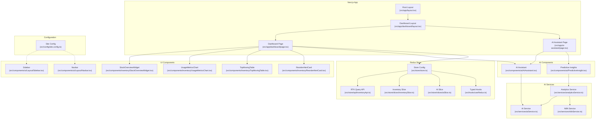

**Diagram sources**
- [src/app/dashboard/page.tsx:1-128](file://src/app/dashboard/page.tsx#L1-L128)
- [src/app/ai-assistant/page.tsx:1-55](file://src/app/ai-assistant/page.tsx#L1-L55)
- [src/app/dashboard/layout.tsx:1-42](file://src/app/dashboard/layout.tsx#L1-L42)
- [src/app/layout.tsx:1-31](file://src/app/layout.tsx#L1-L31)
- [src/components/ai/AIAssistant.tsx:1-120](file://src/components/ai/AIAssistant.tsx#L1-L120)
- [src/components/ai/PredictiveInsight.tsx:1-152](file://src/components/ai/PredictiveInsight.tsx#L1-L152)
- [src/services/aiService.ts:1-219](file://src/services/aiService.ts#L1-L219)
- [src/services/analyticsService.ts:1-134](file://src/services/analyticsService.ts#L1-L134)
- [src/services/n8nService.ts:1-271](file://src/services/n8nService.ts#L1-L271)
- [src/components/inventory/StockOverviewWidget.tsx:1-57](file://src/components/inventory/StockOverviewWidget.tsx#L1-L57)
- [src/components/inventory/UsageMetricsChart.tsx:1-160](file://src/components/inventory/UsageMetricsChart.tsx#L1-L160)
- [src/components/inventory/TopMovingTable.tsx:1-100](file://src/components/inventory/TopMovingTable.tsx#L1-L100)
- [src/components/inventory/ReorderAlertCard.tsx:1-105](file://src/components/inventory/ReorderAlertCard.tsx#L1-L105)
- [src/components/ui/Layout/Navbar.tsx:1-61](file://src/components/ui/Layout/Navbar.tsx#L1-L61)
- [src/components/ui/Layout/Sidebar.tsx:1-133](file://src/components/ui/Layout/Sidebar.tsx#L1-L133)
- [src/store/store.ts:1-27](file://src/store/store.ts#L1-L27)
- [src/store/api/inventoryApi.ts:1-57](file://src/store/api/inventoryApi.ts#L1-L57)
- [src/store/slices/inventorySlice.ts:1-56](file://src/store/slices/inventorySlice.ts#L1-L56)
- [src/store/slices/aiSlice.ts:1-56](file://src/store/slices/aiSlice.ts#L1-L56)
- [src/hooks/useRedux.ts:1-6](file://src/hooks/useRedux.ts#L1-L6)
- [src/config/site.config.ts:1-34](file://src/config/site.config.ts#L1-L34)

**Section sources**
- [src/app/dashboard/page.tsx:1-128](file://src/app/dashboard/page.tsx#L1-L128)
- [src/app/ai-assistant/page.tsx:1-55](file://src/app/ai-assistant/page.tsx#L1-L55)
- [src/app/dashboard/layout.tsx:1-42](file://src/app/dashboard/layout.tsx#L1-L42)
- [src/app/layout.tsx:1-31](file://src/app/layout.tsx#L1-L31)

## Core Components
- Dashboard Page: Orchestrates data fetching, layout, widget rendering, and AI assistant integration. It composes StockOverviewWidget, UsageMetricsChart, TopMovingTable, ReorderAlertCard, and AIAssistant, and handles loading and error states.
- AI Assistant: A natural language processing component that accepts user queries in plain English and provides intelligent inventory insights using AI models.
- Predictive Insights: Machine learning-powered component that generates demand forecasts, identifies anomalies, and provides risk-based recommendations.
- StockOverviewWidget: Displays KPI-style cards with icons, values, and optional trend indicators for total materials, low stock items, pending orders, and turnover rate.
- UsageMetricsChart: Renders area charts for actual consumption vs forecast with selectable weekly/monthly periods, plus summary statistics.
- TopMovingTable: Presents fast-moving raw materials with ranking, category chips, usage velocity, trend icons, and units.
- ReorderAlertCard: Visualizes reorder alerts with urgency-based styling, current stock vs reorder point, and suggested order quantities.
- Dashboard Layout: Provides the main layout with Navbar and Sidebar, managing responsive sidebar behavior and content padding.
- Navigation: Navbar triggers sidebar toggling; Sidebar provides view navigation including AI Assistant functionality and maintains active view state.

**Section sources**
- [src/app/dashboard/page.tsx:17-127](file://src/app/dashboard/page.tsx#L17-L127)
- [src/app/ai-assistant/page.tsx:10-55](file://src/app/ai-assistant/page.tsx#L10-L55)
- [src/components/ai/AIAssistant.tsx:23-120](file://src/components/ai/AIAssistant.tsx#L23-L120)
- [src/components/ai/PredictiveInsight.tsx:29-152](file://src/components/ai/PredictiveInsight.tsx#L29-L152)
- [src/components/inventory/StockOverviewWidget.tsx:8-56](file://src/components/inventory/StockOverviewWidget.tsx#L8-L56)
- [src/components/inventory/UsageMetricsChart.tsx:47-158](file://src/components/inventory/UsageMetricsChart.tsx#L47-L158)
- [src/components/inventory/TopMovingTable.tsx:19-99](file://src/components/inventory/TopMovingTable.tsx#L19-L99)
- [src/components/inventory/ReorderAlertCard.tsx:19-104](file://src/components/inventory/ReorderAlertCard.tsx#L19-L104)
- [src/app/dashboard/layout.tsx:10-41](file://src/app/dashboard/layout.tsx#L10-L41)
- [src/components/ui/Layout/Navbar.tsx:17-60](file://src/components/ui/Layout/Navbar.tsx#L17-L60)
- [src/components/ui/Layout/Sidebar.tsx:34-132](file://src/components/ui/Layout/Sidebar.tsx#L34-L132)

## Architecture Overview
The dashboard follows a widget-based architecture with AI services integration and real-time monitoring capabilities:
- Data Layer: RTK Query endpoints define typed queries and caching policies.
- AI Services Layer: Dedicated services for AI processing, analytics, and N8N webhook integration.
- State Layer: Redux slices manage local UI inventory state and AI query history.
- Presentation Layer: MUI components render dashboards, charts, and AI-powered insights.
- Real-Time Layer: Polling-based updates from N8N webhooks for continuous data refresh.
- Navigation Layer: Sidebar and Navbar coordinate routing and active view selection.

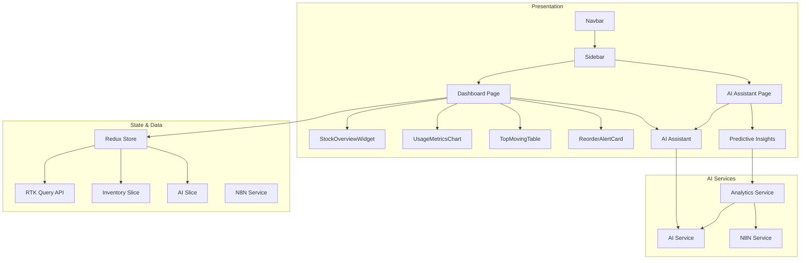

**Diagram sources**
- [src/app/dashboard/page.tsx:1-128](file://src/app/dashboard/page.tsx#L1-L128)
- [src/app/ai-assistant/page.tsx:1-55](file://src/app/ai-assistant/page.tsx#L1-L55)
- [src/store/store.ts:1-27](file://src/store/store.ts#L1-L27)
- [src/store/api/inventoryApi.ts:23-49](file://src/store/api/inventoryApi.ts#L23-L49)
- [src/store/slices/inventorySlice.ts:21-56](file://src/store/slices/inventorySlice.ts#L21-L56)
- [src/store/slices/aiSlice.ts:17-56](file://src/store/slices/aiSlice.ts#L17-L56)
- [src/services/aiService.ts:18-219](file://src/services/aiService.ts#L18-L219)
- [src/services/analyticsService.ts:13-134](file://src/services/analyticsService.ts#L13-L134)
- [src/services/n8nService.ts:16-271](file://src/services/n8nService.ts#L16-L271)
- [src/components/ui/Layout/Navbar.tsx:17-60](file://src/components/ui/Layout/Navbar.tsx#L17-L60)
- [src/components/ui/Layout/Sidebar.tsx:34-132](file://src/components/ui/Layout/Sidebar.tsx#L34-L132)

## Detailed Component Analysis

### Dashboard Page Workflow
The dashboard page coordinates multiple data sources and renders a responsive grid of widgets with AI integration. It uses RTK Query hooks to fetch top-moving materials, reorder alerts, and stock overview data, displays loading and error states appropriately, and integrates the AI Assistant component for natural language queries.

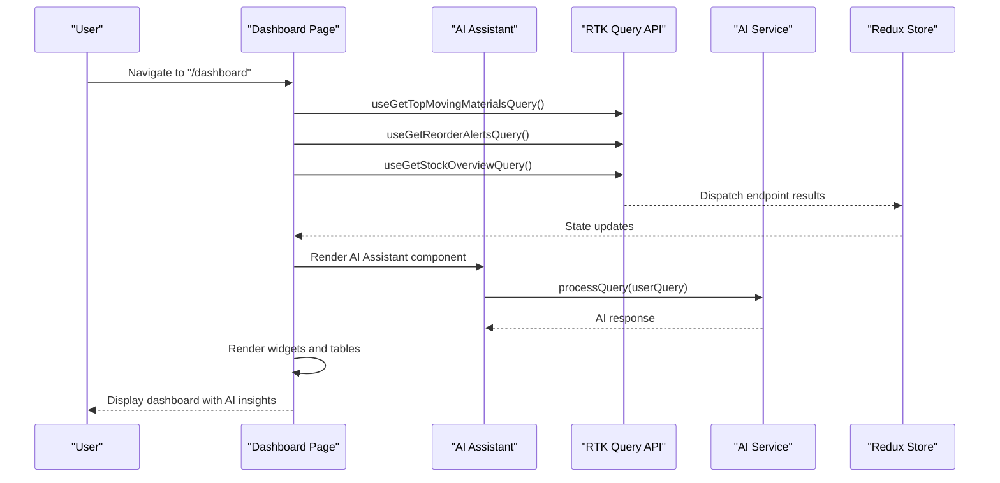

**Diagram sources**
- [src/app/dashboard/page.tsx:17-127](file://src/app/dashboard/page.tsx#L17-L127)
- [src/components/ai/AIAssistant.tsx:29-46](file://src/components/ai/AIAssistant.tsx#L29-L46)
- [src/services/aiService.ts:33-74](file://src/services/aiService.ts#L33-L74)
- [src/store/api/inventoryApi.ts:51-56](file://src/store/api/inventoryApi.ts#L51-L56)

**Section sources**
- [src/app/dashboard/page.tsx:17-127](file://src/app/dashboard/page.tsx#L17-L127)
- [src/components/ai/AIAssistant.tsx:29-46](file://src/components/ai/AIAssistant.tsx#L29-L46)

### AI Assistant Component
The AI Assistant component provides a natural language interface for inventory queries. Users can ask questions in plain English about inventory status, reorder points, usage trends, and forecasts. The component handles query processing, loading states, and response display.

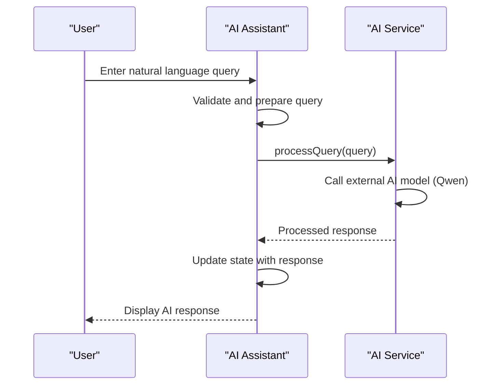

**Diagram sources**
- [src/components/ai/AIAssistant.tsx:29-46](file://src/components/ai/AIAssistant.tsx#L29-L46)
- [src/services/aiService.ts:33-74](file://src/services/aiService.ts#L33-L74)

**Section sources**
- [src/components/ai/AIAssistant.tsx:23-120](file://src/components/ai/AIAssistant.tsx#L23-L120)
- [src/services/aiService.ts:18-219](file://src/services/aiService.ts#L18-L219)

### Predictive Insights Component
The Predictive Insights component generates machine learning-powered demand forecasts and recommendations. It analyzes historical consumption patterns, seasonal trends, and production schedules to provide confidence scores and risk assessments.

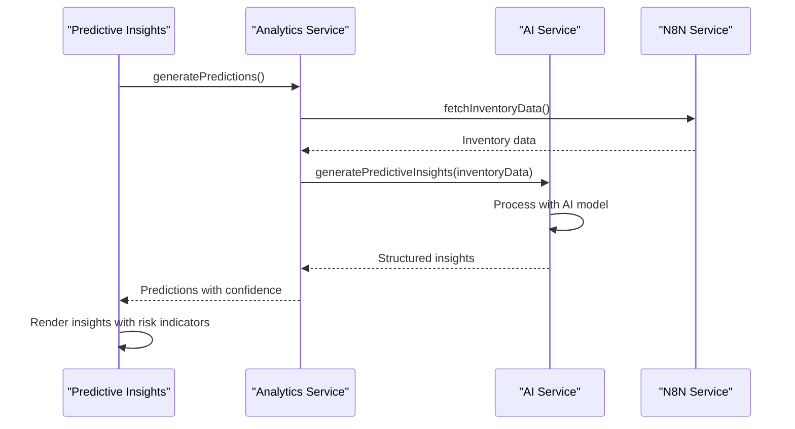

**Diagram sources**
- [src/components/ai/PredictiveInsight.tsx:33-46](file://src/components/ai/PredictiveInsight.tsx#L33-L46)
- [src/services/analyticsService.ts:17-41](file://src/services/analyticsService.ts#L17-L41)
- [src/services/aiService.ts:79-124](file://src/services/aiService.ts#L79-L124)
- [src/services/n8nService.ts:29-56](file://src/services/n8nService.ts#L29-L56)

**Section sources**
- [src/components/ai/PredictiveInsight.tsx:29-152](file://src/components/ai/PredictiveInsight.tsx#L29-L152)
- [src/services/analyticsService.ts:13-134](file://src/services/analyticsService.ts#L13-L134)
- [src/services/aiService.ts:79-124](file://src/services/aiService.ts#L79-L124)

### StockOverviewWidget
A reusable card component that displays a metric with an icon, value, and optional trend indicator. It supports positive/negative trend coloring and responsive layout.

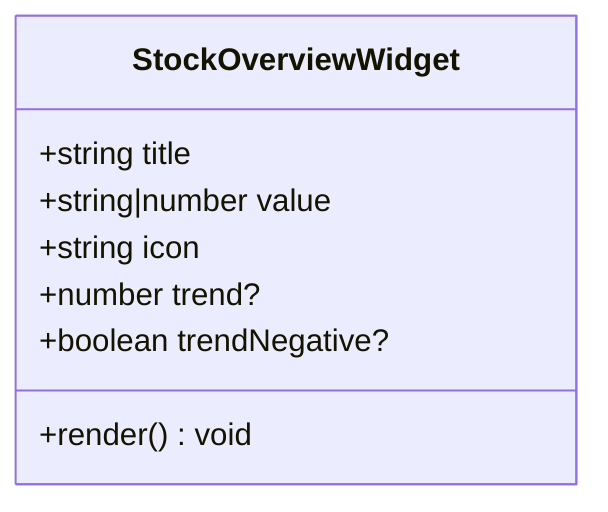

**Diagram sources**
- [src/components/inventory/StockOverviewWidget.tsx:8-56](file://src/components/inventory/StockOverviewWidget.tsx#L8-L56)

**Section sources**
- [src/components/inventory/StockOverviewWidget.tsx:16-56](file://src/components/inventory/StockOverviewWidget.tsx#L16-L56)

### UsageMetricsChart
A responsive chart component that visualizes usage metrics and forecasts. It supports weekly and monthly periods, includes summary statistics, and handles loading and error states.

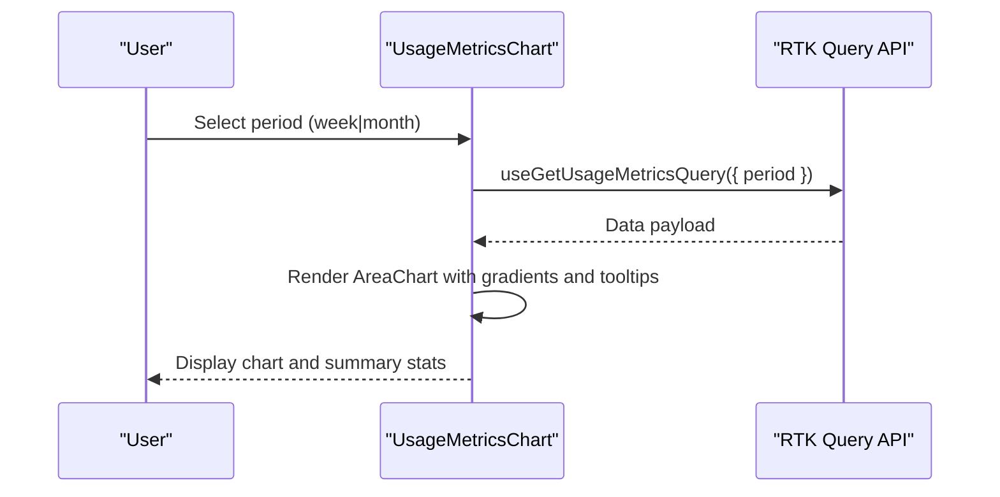

**Diagram sources**
- [src/components/inventory/UsageMetricsChart.tsx:47-158](file://src/components/inventory/UsageMetricsChart.tsx#L47-L158)
- [src/store/api/inventoryApi.ts:38-47](file://src/store/api/inventoryApi.ts#L38-L47)

**Section sources**
- [src/components/inventory/UsageMetricsChart.tsx:47-158](file://src/components/inventory/UsageMetricsChart.tsx#L47-L158)

### TopMovingTable
Displays a ranked list of fast-moving raw materials with category chips, usage velocity, and trend indicators.

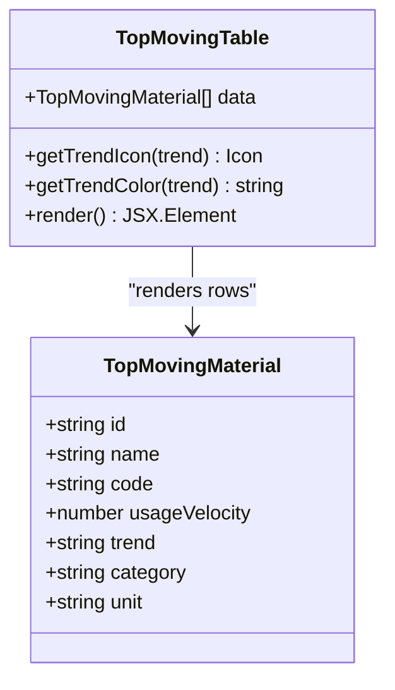

**Diagram sources**
- [src/components/inventory/TopMovingTable.tsx:15-99](file://src/components/inventory/TopMovingTable.tsx#L15-L99)
- [src/store/api/inventoryApi.ts:3-11](file://src/store/api/inventoryApi.ts#L3-L11)

**Section sources**
- [src/components/inventory/TopMovingTable.tsx:19-99](file://src/components/inventory/TopMovingTable.tsx#L19-L99)

### ReorderAlertCard
Visualizes reorder alerts with urgency-based styling and suggested order quantities.

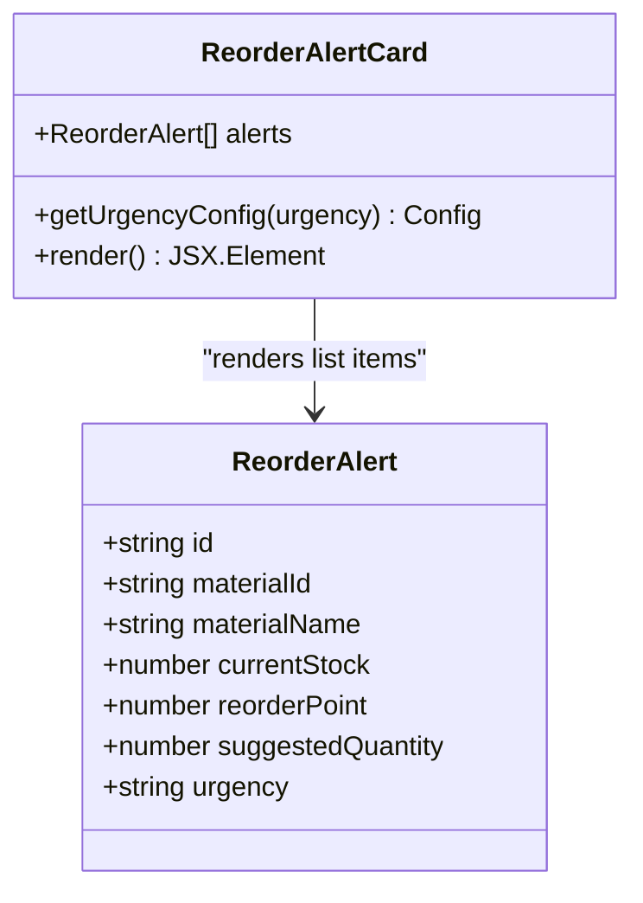

**Diagram sources**
- [src/components/inventory/ReorderAlertCard.tsx:15-104](file://src/components/inventory/ReorderAlertCard.tsx#L15-L104)
- [src/store/api/inventoryApi.ts:13-21](file://src/store/api/inventoryApi.ts#L13-L21)

**Section sources**
- [src/components/inventory/ReorderAlertCard.tsx:19-104](file://src/components/inventory/ReorderAlertCard.tsx#L19-L104)

### Dashboard Layout and Navigation
The layout integrates a fixed Navbar and a collapsible Sidebar with AI Assistant functionality. The Sidebar manages navigation to different views including AI features and toggles its own width. The main content area adjusts margins based on sidebar state and responsive breakpoints.

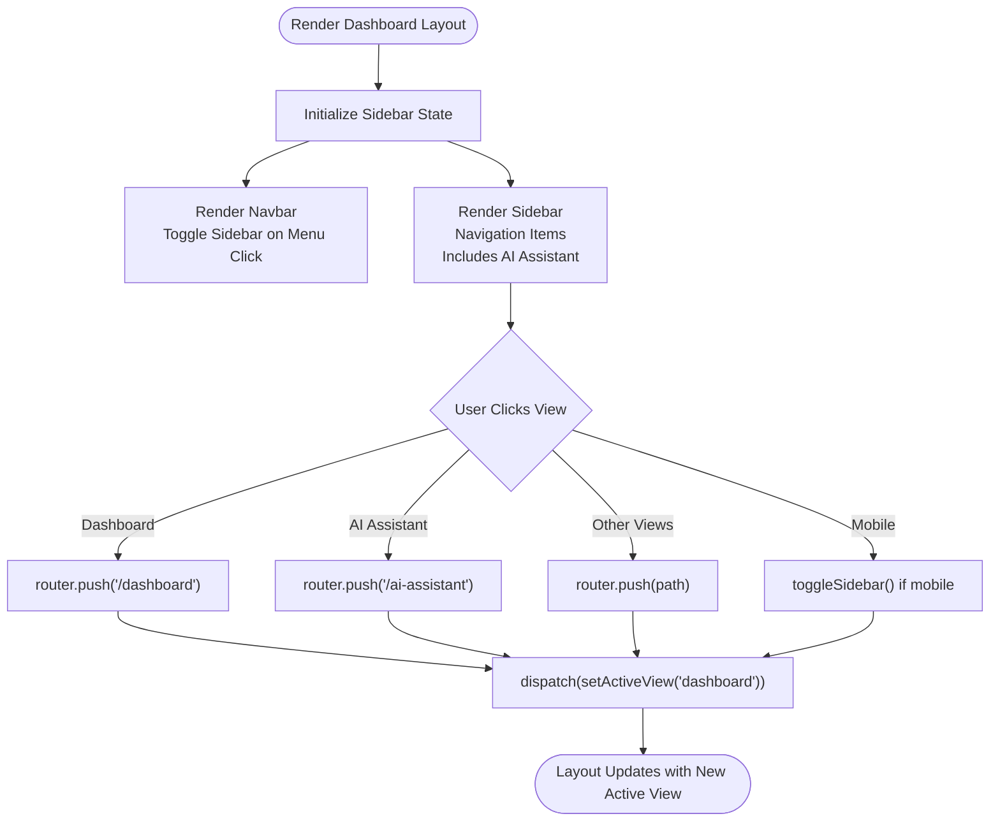

**Diagram sources**
- [src/app/dashboard/layout.tsx:10-41](file://src/app/dashboard/layout.tsx#L10-L41)
- [src/components/ui/Layout/Navbar.tsx:17-60](file://src/components/ui/Layout/Navbar.tsx#L17-L60)
- [src/components/ui/Layout/Sidebar.tsx:34-132](file://src/components/ui/Layout/Sidebar.tsx#L34-L132)

**Section sources**
- [src/app/dashboard/layout.tsx:10-41](file://src/app/dashboard/layout.tsx#L10-L41)
- [src/components/ui/Layout/Navbar.tsx:17-60](file://src/components/ui/Layout/Navbar.tsx#L17-L60)
- [src/components/ui/Layout/Sidebar.tsx:34-132](file://src/components/ui/Layout/Sidebar.tsx#L34-L132)

## AI-Powered Features
The dashboard now includes comprehensive AI-powered capabilities for intelligent inventory management:

### Natural Language Processing
The AI Assistant component enables users to ask questions in plain English about inventory status, trends, and recommendations. It processes natural language queries using advanced AI models and provides intelligent responses.

### Predictive Analytics
Machine learning algorithms analyze historical consumption patterns, seasonal trends, and production schedules to generate demand forecasts with confidence scores and risk assessments.

### Intelligent Recommendations
The system automatically identifies potential issues, suggests optimal reorder quantities, and provides actionable insights based on data-driven analysis.

### Confidence Scoring
Each AI-generated insight includes a confidence score indicating the reliability of the prediction, helping users make informed decisions.

**Section sources**
- [src/components/ai/AIAssistant.tsx:23-120](file://src/components/ai/AIAssistant.tsx#L23-L120)
- [src/components/ai/PredictiveInsight.tsx:29-152](file://src/components/ai/PredictiveInsight.tsx#L29-L152)
- [src/services/aiService.ts:18-219](file://src/services/aiService.ts#L18-L219)
- [src/services/analyticsService.ts:13-134](file://src/services/analyticsService.ts#L13-L134)

## Real-Time Monitoring
The dashboard implements real-time inventory monitoring through a polling-based system that continuously updates inventory data:

### Polling-Based Updates
The system polls N8N webhooks every 30 seconds to fetch the latest inventory data, ensuring near real-time updates without the complexity of WebSocket connections.

### Data Source Integration
Inventory data flows through N8N webhooks from external systems (ERP, databases) to the dashboard, providing a centralized data source of truth.

### Fallback Mechanisms
The system includes robust fallback mechanisms using mock data when external webhooks are unavailable, ensuring continuous operation during network issues.

### Performance Optimization
Caching strategies are implemented to balance data freshness with performance, with different TTL values for different data types.

**Section sources**
- [src/services/n8nService.ts:247-267](file://src/services/n8nService.ts#L247-L267)
- [src/config/site.config.ts:28-32](file://src/config/site.config.ts#L28-L32)
- [src/services/n8nService.ts:58-56](file://src/services/n8nService.ts#L58-L56)

## Interactive Data Visualization
Enhanced charting capabilities provide comprehensive data visualization for inventory analysis:

### Multi-Period Analysis
Usage metrics charts support both weekly and monthly analysis periods, allowing users to examine different time horizons for inventory trends.

### Interactive Elements
Charts include interactive tooltips, hover effects, and period selection controls for dynamic data exploration.

### Forecast Visualization
Forecast data is displayed alongside actual consumption data, enabling users to compare historical performance with predicted trends.

### Responsive Design
Charts adapt to different screen sizes and device orientations, ensuring optimal viewing experience across all platforms.

**Section sources**
- [src/components/inventory/UsageMetricsChart.tsx:47-158](file://src/components/inventory/UsageMetricsChart.tsx#L47-L158)
- [src/store/api/inventoryApi.ts:38-47](file://src/store/api/inventoryApi.ts#L38-L47)

## Dependency Analysis
The dashboard depends on RTK Query for data fetching, AI services for intelligent insights, and Redux for state management. The store combines slice reducers and RTK Query middleware. Typed hooks simplify dispatch and selector usage.

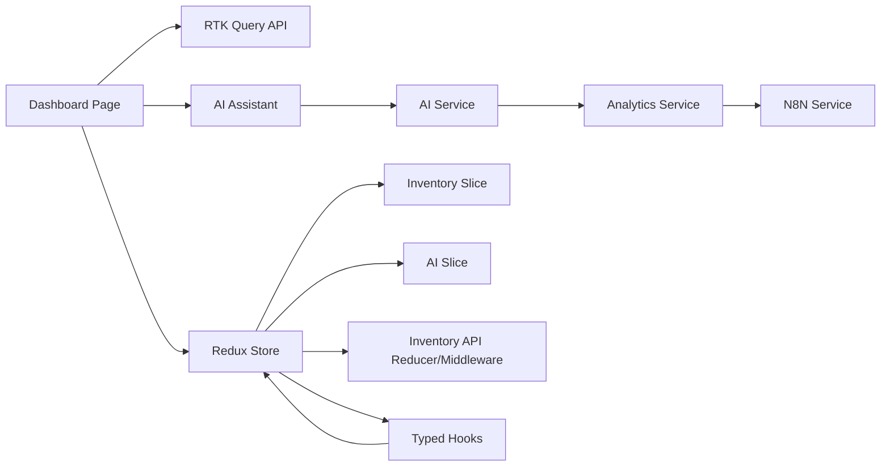

**Diagram sources**
- [src/app/dashboard/page.tsx:3-20](file://src/app/dashboard/page.tsx#L3-L20)
- [src/store/store.ts:1-27](file://src/store/store.ts#L1-L27)
- [src/store/api/inventoryApi.ts:23-49](file://src/store/api/inventoryApi.ts#L23-L49)
- [src/store/slices/inventorySlice.ts:21-56](file://src/store/slices/inventorySlice.ts#L21-L56)
- [src/store/slices/aiSlice.ts:17-56](file://src/store/slices/aiSlice.ts#L17-L56)
- [src/hooks/useRedux.ts:1-6](file://src/hooks/useRedux.ts#L1-L6)
- [src/components/ai/AIAssistant.tsx:17-19](file://src/components/ai/AIAssistant.tsx#L17-L19)
- [src/services/aiService.ts:18-27](file://src/services/aiService.ts#L18-L27)
- [src/services/analyticsService.ts:1-2](file://src/services/analyticsService.ts#L1-L2)
- [src/services/n8nService.ts:16-23](file://src/services/n8nService.ts#L16-L23)

**Section sources**
- [src/store/store.ts:1-27](file://src/store/store.ts#L1-L27)
- [src/store/api/inventoryApi.ts:23-49](file://src/store/api/inventoryApi.ts#L23-L49)
- [src/store/slices/inventorySlice.ts:21-56](file://src/store/slices/inventorySlice.ts#L21-L56)
- [src/store/slices/aiSlice.ts:17-56](file://src/store/slices/aiSlice.ts#L17-L56)
- [src/hooks/useRedux.ts:1-6](file://src/hooks/useRedux.ts#L1-L6)

## Performance Considerations
- Caching and Keep-Unused Data: RTK Query endpoints specify cache retention durations to balance freshness and performance.
- AI Query Optimization: AI service includes confidence scoring and fallback mechanisms to optimize response times.
- Real-Time Updates: Polling interval of 30 seconds balances data freshness with server load.
- Loading States: Centralized loading and error handling prevents unnecessary re-renders and improves UX.
- Responsive Charts: Responsive containers adapt to viewport changes without heavy computations.
- Minimal Re-renders: Widget components are self-contained and only re-render when props change.
- Sidebar Responsiveness: Collapsible sidebar reduces layout thrashing on smaller screens.
- AI Service Caching: AI responses can be cached locally to reduce repeated API calls.

Practical tips:
- Adjust keepUnusedDataFor values in endpoints to match update frequency.
- Debounce or throttle frequent user interactions (e.g., chart period selection).
- Lazy-load heavy components if needed.
- Monitor network requests and consider background refetch strategies.
- Implement AI query debouncing to prevent excessive API calls.
- Use confidence thresholds to filter AI-generated insights.

**Section sources**
- [src/store/api/inventoryApi.ts:30-47](file://src/store/api/inventoryApi.ts#L30-L47)
- [src/components/inventory/UsageMetricsChart.tsx:47-59](file://src/components/inventory/UsageMetricsChart.tsx#L47-L59)
- [src/app/dashboard/page.tsx:24-30](file://src/app/dashboard/page.tsx#L24-L30)
- [src/services/aiService.ts:33-74](file://src/services/aiService.ts#L33-L74)
- [src/services/n8nService.ts:247-267](file://src/services/n8nService.ts#L247-L267)

## Troubleshooting Guide
Common issues and resolutions:
- Data not loading: Verify endpoint URLs and network connectivity; check console errors; confirm that RTK Query hooks are used correctly.
- AI queries failing: Check AI model endpoint configuration and API keys; verify external AI service availability.
- Empty reorder alerts: The component displays a success message when no alerts are present; ensure backend returns empty arrays when appropriate.
- Chart errors: Confirm that mock data or API responses match expected shapes; verify tooltip and legend keys.
- Sidebar not toggling: Ensure dispatch actions are called and UI slice state is connected to selectors.
- Type mismatches: Use the provided TypeScript interfaces for data structures to avoid runtime errors.
- Real-time updates not working: Verify N8N webhook URLs and API keys; check polling intervals and network connectivity.
- Predictive insights errors: Ensure AI service is properly configured and external models are accessible.

**Section sources**
- [src/components/ai/ReorderAlertCard.tsx:43-49](file://src/components/inventory/ReorderAlertCard.tsx#L43-L49)
- [src/components/ai/UsageMetricsChart.tsx:61-63](file://src/components/inventory/UsageMetricsChart.tsx#L61-L63)
- [src/components/ui/Layout/Sidebar.tsx:42-48](file://src/components/ui/Layout/Sidebar.tsx#L42-L48)
- [src/services/aiService.ts:70-74](file://src/services/aiService.ts#L70-L74)
- [src/services/n8nService.ts:42-56](file://src/services/n8nService.ts#L42-L56)

## Conclusion
The enhanced dashboard provides a comprehensive, AI-powered inventory oversight interface built on a modular, widget-based architecture with real-time monitoring capabilities. It leverages RTK Query for efficient data fetching and caching, Redux for state management, AI services for intelligent insights, and MUI for responsive UI components. The integration of AI Assistant and Predictive Insights components enables natural language processing and machine learning-based recommendations. The layout and navigation enable seamless exploration of inventory insights with AI-powered capabilities, while configuration options support customization and performance tuning for both traditional and AI-enhanced features.

## Appendices

### Practical Usage Examples
- Viewing top-moving materials: Navigate to the dashboard; the TopMovingTable displays ranked materials with usage velocity and trends.
- Monitoring reorder alerts: The ReorderAlertCard highlights urgent items with suggested order quantities.
- Checking stock overview: Four KPI cards show total materials, low stock items, pending orders, and turnover rate.
- Analyzing usage and forecasts: The UsageMetricsChart allows switching between weekly and monthly views to compare actual consumption and forecast.
- Asking AI questions: Use the AI Assistant component to ask natural language questions about inventory status, trends, and recommendations.
- Getting predictive insights: The Predictive Insights component generates demand forecasts with confidence scores and risk assessments.
- Real-time monitoring: The dashboard automatically updates inventory data every 30 seconds through polling mechanisms.

### Configuration Options
- Endpoint caching: Configure keepUnusedDataFor per endpoint to control cache TTL.
- AI service configuration: Set AI model endpoints, API keys, and model names in environment variables.
- Real-time updates: Adjust polling intervals in the N8N service configuration.
- Sidebar behavior: Responsive width and mobile behavior are handled by the Sidebar component.
- Feature flags: Site configuration includes feature toggles for AI-powered features and real-time updates.
- Cache optimization: Configure different TTL values for different data types based on update frequency requirements.

**Section sources**
- [src/config/site.config.ts:14-32](file://src/config/site.config.ts#L14-L32)
- [src/store/api/inventoryApi.ts:30-47](file://src/store/api/inventoryApi.ts#L30-L47)
- [src/components/ui/Layout/Sidebar.tsx:50-65](file://src/components/ui/Layout/Sidebar.tsx#L50-L65)
- [src/services/n8nService.ts:247-267](file://src/services/n8nService.ts#L247-L267)
- [src/services/aiService.ts:23-27](file://src/services/aiService.ts#L23-L27)