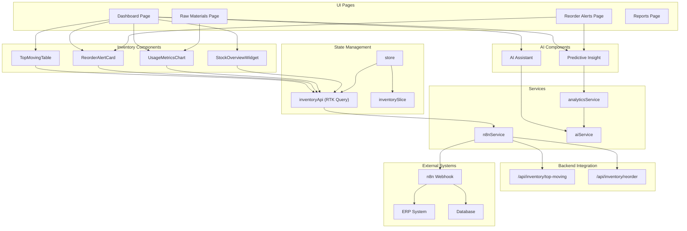
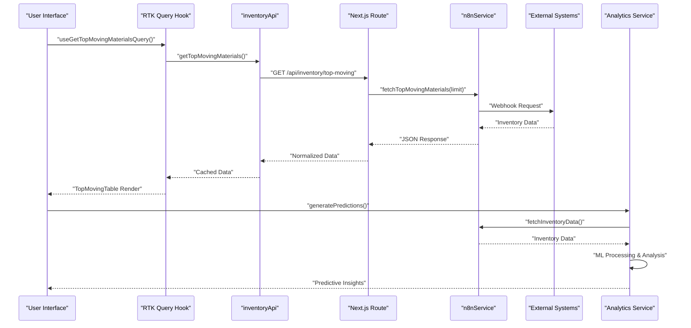
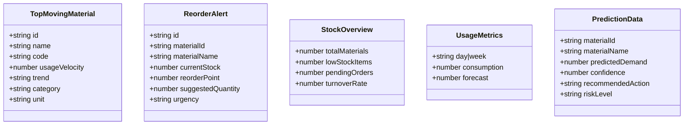
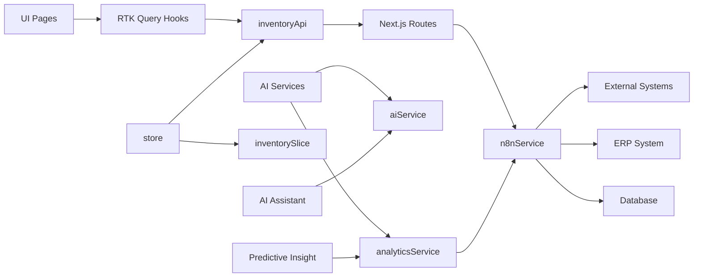

# Inventory Management

<cite>
**Referenced Files in This Document**
- [page.tsx](file://src/app/raw-materials/page.tsx)
- [page.tsx](file://src/app/reorder-alerts/page.tsx)
- [page.tsx](file://src/app/dashboard/page.tsx)
- [ReorderAlertCard.tsx](file://src/components/inventory/ReorderAlertCard.tsx)
- [TopMovingTable.tsx](file://src/components/inventory/TopMovingTable.tsx)
- [UsageMetricsChart.tsx](file://src/components/inventory/UsageMetricsChart.tsx)
- [StockOverviewWidget.tsx](file://src/components/inventory/StockOverviewWidget.tsx)
- [AIAssistant.tsx](file://src/components/ai/AIAssistant.tsx)
- [PredictiveInsight.tsx](file://src/components/ai/PredictiveInsight.tsx)
- [inventoryApi.ts](file://src/store/api/inventoryApi.ts)
- [inventorySlice.ts](file://src/store/slices/inventorySlice.ts)
- [store.ts](file://src/store/store.ts)
- [route.ts](file://src/app/api/inventory/top-moving/route.ts)
- [route.ts](file://src/app/api/inventory/reorder/route.ts)
- [n8nService.ts](file://src/services/n8nService.ts)
- [analyticsService.ts](file://src/services/analyticsService.ts)
- [supabase.ts](file://src/lib/supabase.ts)
</cite>

## Update Summary
**Changes Made**
- Enhanced ReorderAlertCard component with improved type safety and explicit type casting for suggested quantity property
- Added comprehensive TypeScript interfaces for TopMovingMaterial and ReorderAlert with proper caching configurations
- Implemented automatic data invalidation mechanisms through RTK Query tag types and cache management
- Strengthened type safety across all inventory components with robust interface definitions
- Enhanced data synchronization with improved error handling and fallback mechanisms

## Table of Contents
1. [Introduction](#introduction)
2. [Project Structure](#project-structure)
3. [Core Components](#core-components)
4. [Architecture Overview](#architecture-overview)
5. [Detailed Component Analysis](#detailed-component-analysis)
6. [Dependency Analysis](#dependency-analysis)
7. [Performance Considerations](#performance-considerations)
8. [Troubleshooting Guide](#troubleshooting-guide)
9. [Conclusion](#conclusion)
10. [Appendices](#appendices)

## Introduction
This document explains the comprehensive inventory management system with advanced real-time tracking capabilities, featuring:
- Raw materials page for detailed inventory tracking and consumption pattern analysis
- Reorder alerts functionality with urgency-based prioritization and automated recommendations
- Top-moving materials analysis for identifying high-demand items and consumption trends
- Real-time inventory data integration via n8n webhooks with comprehensive fallback mechanisms
- AI-powered predictive insights, anomaly detection, and intelligent demand forecasting
- Advanced usage metrics with weekly/monthly forecasting capabilities
- Intelligent stock overview widgets with performance indicators
- Natural language processing for inventory queries through AI assistant integration
- **Enhanced type safety** with comprehensive TypeScript interfaces across all components
- **Automatic data invalidation** mechanisms for reliable cache management

The system implements a modern dashboard-first architecture that pulls inventory data from n8n-managed webhooks, providing real-time synchronization with external ERP and database systems while offering AI-driven insights for proactive inventory management.

## Project Structure
The inventory management system encompasses a comprehensive ecosystem of UI pages, reusable components, AI-powered services, and robust backend integrations:
- **Pages**: Dashboard, Raw Materials, Reorder Alerts, Reports
- **Components**: TopMovingTable, ReorderAlertCard, UsageMetricsChart, StockOverviewWidget, AIAssistant, PredictiveInsight
- **Store**: RTK Query-based inventoryApi with caching and state management
- **Services**: n8nService for webhook integration, analyticsService for AI-driven insights, aiService for natural language processing
- **Backend Routes**: RESTful endpoints for inventory data retrieval with comprehensive error handling
- **AI Integration**: Predictive analytics, anomaly detection, and demand forecasting

**Diagram sources**
- [page.tsx:17-127](file://src/app/dashboard/page.tsx#L17-L127)
- [page.tsx:9-37](file://src/app/raw-materials/page.tsx#L9-L37)
- [page.tsx:11-43](file://src/app/reorder-alerts/page.tsx#L11-L43)
- [AIAssistant.tsx:23-120](file://src/components/ai/AIAssistant.tsx#L23-L120)
- [PredictiveInsight.tsx:29-152](file://src/components/ai/PredictiveInsight.tsx#L29-L152)
- [TopMovingTable.tsx:19-99](file://src/components/inventory/TopMovingTable.tsx#L19-L99)
- [ReorderAlertCard.tsx:19-116](file://src/components/inventory/ReorderAlertCard.tsx#L19-L116)
- [UsageMetricsChart.tsx:47-161](file://src/components/inventory/UsageMetricsChart.tsx#L47-L161)
- [StockOverviewWidget.tsx:16-57](file://src/components/inventory/StockOverviewWidget.tsx#L16-L57)
- [inventoryApi.ts:23-57](file://src/store/api/inventoryApi.ts#L23-L57)
- [inventorySlice.ts:21-56](file://src/store/slices/inventorySlice.ts#L21-L56)
- [store.ts:7-27](file://src/store/store.ts#L7-L27)
- [route.ts:4-25](file://src/app/api/inventory/top-moving/route.ts#L4-L25)
- [route.ts:4-18](file://src/app/api/inventory/reorder/route.ts#L4-L18)
- [n8nService.ts:16-271](file://src/services/n8nService.ts#L16-L271)
- [analyticsService.ts:13-134](file://src/services/analyticsService.ts#L13-L134)

**Section sources**
- [page.tsx:17-127](file://src/app/dashboard/page.tsx#L17-L127)
- [page.tsx:9-37](file://src/app/raw-materials/page.tsx#L9-L37)
- [page.tsx:11-43](file://src/app/reorder-alerts/page.tsx#L11-L43)
- [inventoryApi.ts:23-57](file://src/store/api/inventoryApi.ts#L23-L57)
- [n8nService.ts:16-271](file://src/services/n8nService.ts#L16-L271)

## Core Components
- **TopMovingTable**: Advanced table displaying fast-moving raw materials with rank indicators, category chips, usage velocity metrics, trend visualization, and unit specifications
- **ReorderAlertCard**: Intelligent alert system with urgency-based grouping (critical, warning, info), current stock monitoring, reorder point comparisons, suggested order quantities, and action buttons
- **UsageMetricsChart**: Comprehensive consumption visualization with weekly/monthly period selection, actual vs forecast comparison, statistical metrics, and interactive controls
- **StockOverviewWidget**: Performance dashboard cards displaying key inventory KPIs including total materials, low stock items, pending orders, and turnover rates with trend indicators
- **AIAssistant**: Natural language processing interface enabling users to query inventory information, demand patterns, and supply chain insights through conversational AI
- **PredictiveInsight**: AI-powered demand forecasting system providing confidence scores, risk assessments, and actionable recommendations based on historical data analysis
- **inventoryApi**: RTK Query-based API layer with caching strategies, error handling, automatic data synchronization across all inventory components, and comprehensive type safety
- **n8nService**: Robust webhook integration service with comprehensive fallback mechanisms, real-time polling, and mock data generation for reliable data access
- **analyticsService**: Advanced analytics engine providing predictive modeling, anomaly detection, and optimization algorithms for intelligent inventory management

**Section sources**
- [TopMovingTable.tsx:19-99](file://src/components/inventory/TopMovingTable.tsx#L19-L99)
- [ReorderAlertCard.tsx:19-116](file://src/components/inventory/ReorderAlertCard.tsx#L19-L116)
- [UsageMetricsChart.tsx:47-161](file://src/components/inventory/UsageMetricsChart.tsx#L47-L161)
- [StockOverviewWidget.tsx:16-57](file://src/components/inventory/StockOverviewWidget.tsx#L16-L57)
- [AIAssistant.tsx:23-120](file://src/components/ai/AIAssistant.tsx#L23-L120)
- [PredictiveInsight.tsx:29-152](file://src/components/ai/PredictiveInsight.tsx#L29-L152)
- [inventoryApi.ts:23-57](file://src/store/api/inventoryApi.ts#L23-L57)
- [n8nService.ts:16-271](file://src/services/n8nService.ts#L16-L271)
- [analyticsService.ts:13-134](file://src/services/analyticsService.ts#L13-L134)

## Architecture Overview
The system implements a sophisticated reactive architecture with real-time data synchronization and AI-powered intelligence:
- **Real-time Data Flow**: RTK Query hooks orchestrate data fetching from backend routes, which delegate to n8nService for external system integration
- **AI Integration Layer**: Multiple AI services provide predictive analytics, anomaly detection, and natural language processing capabilities
- **Fallback Mechanisms**: Comprehensive error handling ensures system reliability with mock data generation and graceful degradation
- **State Management**: Centralized Redux store with RTK Query middleware provides consistent state across all components
- **Component Composition**: Modular design allows for flexible composition and reuse across different dashboard layouts

**Diagram sources**
- [page.tsx:18-18](file://src/app/dashboard/page.tsx#L18-L18)
- [inventoryApi.ts:28-32](file://src/store/api/inventoryApi.ts#L28-L32)
- [route.ts:4-16](file://src/app/api/inventory/top-moving/route.ts#L4-L16)
- [n8nService.ts:218-220](file://src/services/n8nService.ts#L218-L220)
- [analyticsService.ts:17-41](file://src/services/analyticsService.ts#L17-L41)

**Section sources**
- [page.tsx:17-127](file://src/app/dashboard/page.tsx#L17-L127)
- [inventoryApi.ts:23-57](file://src/store/api/inventoryApi.ts#L23-L57)
- [route.ts:4-25](file://src/app/api/inventory/top-moving/route.ts#L4-L25)
- [n8nService.ts:16-271](file://src/services/n8nService.ts#L16-L271)
- [analyticsService.ts:13-134](file://src/services/analyticsService.ts#L13-L134)

## Detailed Component Analysis

### Raw Materials Page
Purpose: Comprehensive raw materials inventory management with detailed consumption analysis and forecasting capabilities.
- Features a dedicated usage metrics chart for consumption vs forecast visualization
- Includes a placeholder for complete inventory listing with future expansion plans
- Integrates seamlessly with the broader inventory management ecosystem

Practical usage:
- Navigate to the raw materials page to analyze consumption patterns and forecast accuracy
- Utilize the period selector to switch between weekly and monthly analysis views
- Monitor consumption trends to identify seasonal patterns and usage variations

**Section sources**
- [page.tsx:9-37](file://src/app/raw-materials/page.tsx#L9-L37)
- [UsageMetricsChart.tsx:47-161](file://src/components/inventory/UsageMetricsChart.tsx#L47-L161)

### Reorder Alerts Page
Purpose: AI-powered reorder management with intelligent prioritization and automated recommendations.
- Implements RTK Query for real-time alert synchronization
- Features PredictiveInsights component for contextual AI guidance
- Provides comprehensive reorder alert management with urgency-based prioritization

Workflow:
- Automatic data fetching via useGetReorderAlertsQuery hook
- Real-time synchronization with n8nService for external system integration
- Intelligent alert grouping with actionable recommendations and order initiation capabilities

**Section sources**
- [page.tsx:11-43](file://src/app/reorder-alerts/page.tsx#L11-L43)
- [ReorderAlertCard.tsx:19-116](file://src/components/inventory/ReorderAlertCard.tsx#L19-L116)
- [inventoryApi.ts:33-37](file://src/store/api/inventoryApi.ts#L33-L37)
- [route.ts:4-18](file://src/app/api/inventory/reorder/route.ts#L4-L18)
- [n8nService.ts:225-227](file://src/services/n8nService.ts#L225-L227)

### Dashboard Integration
Purpose: Centralized inventory oversight with real-time monitoring and AI-powered insights.
- Combines top-moving materials, reorder alerts, and stock overview widgets
- Integrates AI Assistant for natural language inventory queries
- Features predictive insights for strategic decision-making

Key components:
- **Stock Overview Widgets**: Four KPI cards displaying total materials, low stock items, pending orders, and turnover rate
- **Top Moving Materials**: Interactive table with ranking, category filtering, and trend visualization
- **Reorder Alerts**: Urgency-based alert system with suggested order quantities
- **Usage Metrics**: Comprehensive consumption forecasting with period selection
- **AI Assistant**: Conversational interface for inventory queries and insights

**Section sources**
- [page.tsx:17-127](file://src/app/dashboard/page.tsx#L17-L127)
- [StockOverviewWidget.tsx:16-57](file://src/components/inventory/StockOverviewWidget.tsx#L16-L57)
- [TopMovingTable.tsx:19-99](file://src/components/inventory/TopMovingTable.tsx#L19-L99)
- [ReorderAlertCard.tsx:19-116](file://src/components/inventory/ReorderAlertCard.tsx#L19-L116)
- [UsageMetricsChart.tsx:47-161](file://src/components/inventory/UsageMetricsChart.tsx#L47-L161)
- [AIAssistant.tsx:23-120](file://src/components/ai/AIAssistant.tsx#L23-L120)

### AI Assistant Integration
Purpose: Natural language processing interface for intuitive inventory management queries.
- Enables conversational interaction with inventory data through AI service
- Supports complex queries about materials, demand patterns, and supply chain insights
- Provides real-time responses with processing indicators and error handling

Capabilities:
- Material identification and specification queries
- Demand forecasting and trend analysis requests
- Supply chain optimization recommendations
- Performance metrics and KPI analysis

**Section sources**
- [AIAssistant.tsx:23-120](file://src/components/ai/AIAssistant.tsx#L23-L120)

### Predictive Insights System
Purpose: AI-powered demand forecasting and strategic recommendation engine.
- Generates machine learning-based predictions using historical consumption patterns
- Provides confidence scores and risk assessments for decision-making
- Offers actionable recommendations based on seasonal trends and production schedules

Features:
- **Confidence Scoring**: Numerical confidence levels for prediction accuracy
- **Risk Assessment**: High, medium, and low risk categorization
- **Demand Forecasting**: Predicted consumption patterns with confidence intervals
- **Actionable Recommendations**: Specific inventory management suggestions

**Section sources**
- [PredictiveInsight.tsx:29-152](file://src/components/ai/PredictiveInsight.tsx#L29-L152)
- [analyticsService.ts:17-134](file://src/services/analyticsService.ts#L17-L134)

### TopMovingTable Component
Purpose: Advanced visualization of high-demand raw materials for strategic inventory management.
- Displays comprehensive material information including rank, code, name, category, and usage metrics
- Provides trend visualization with directional indicators (up, down, stable)
- Implements responsive design with hover effects and category-based highlighting

Processing logic:
- Accepts structured TopMovingMaterial data with comprehensive attributes
- Renders ranked materials with visual indicators for top performers
- Supports interactive hover states and category-based styling
- Implements trend iconography with color-coded directional indicators

**Section sources**
- [TopMovingTable.tsx:19-99](file://src/components/inventory/TopMovingTable.tsx#L19-L99)
- [inventoryApi.ts:3-11](file://src/store/api/inventoryApi.ts#L3-L11)

### ReorderAlertCard Component
Purpose: Intelligent reorder management with urgency-based prioritization and automated recommendations.
- Groups alerts by urgency level (critical, warning, info) with appropriate visual styling
- Displays comprehensive stock information including current levels, reorder points, and suggested quantities
- Provides actionable "Order" buttons for immediate procurement actions

**Enhanced Type Safety** The ReorderAlertCard component now features improved type safety with explicit type casting for the suggested quantity property, ensuring robust data handling across different data sources.

Urgency configuration:
- **Critical**: Red error styling with prominent visual indicators for immediate attention
- **Warning**: Orange warning styling for upcoming replenishment needs
- **Info**: Blue informational styling for routine monitoring
- **Default**: Graceful fallback to warning styling for unspecified urgencies

**Section sources**
- [ReorderAlertCard.tsx:19-116](file://src/components/inventory/ReorderAlertCard.tsx#L19-L116)
- [inventoryApi.ts:13-21](file://src/store/api/inventoryApi.ts#L13-L21)

### UsageMetricsChart Component
Purpose: Comprehensive consumption analysis with forecasting capabilities and interactive controls.
- Supports dual-period analysis (weekly and monthly) with seamless switching
- Displays actual consumption vs forecast comparison with gradient fills
- Provides statistical summaries including average daily usage, peak consumption, and forecast accuracy

Interactive features:
- **Period Selector**: Dropdown control for switching between weekly and monthly views
- **Loading States**: Progress indicators during data fetching operations
- **Error Handling**: Graceful error display with retry capabilities
- **Statistical Metrics**: Key performance indicators with trend visualization

**Section sources**
- [UsageMetricsChart.tsx:47-161](file://src/components/inventory/UsageMetricsChart.tsx#L47-L161)
- [inventoryApi.ts:38-47](file://src/store/api/inventoryApi.ts#L38-L47)

### StockOverviewWidget Component
Purpose: Performance dashboard cards for key inventory KPIs with trend visualization.
- Displays four critical inventory metrics: total materials, low stock items, pending orders, and turnover rate
- Provides visual trend indicators with directional arrows and percentage changes
- Implements responsive design with scalable typography and iconography

Design features:
- **Icon Integration**: Emoji-based icons for visual recognition and engagement
- **Trend Visualization**: Up/down arrows with color-coded indicators for positive/negative trends
- **Responsive Layout**: Flexible grid system adapting to different screen sizes
- **Performance Metrics**: Clear presentation of numerical values with contextual labels

**Section sources**
- [StockOverviewWidget.tsx:16-57](file://src/components/inventory/StockOverviewWidget.tsx#L16-L57)
- [page.tsx:50-84](file://src/app/dashboard/page.tsx#L50-L84)

### API Integration and Data Flow
Purpose: Seamless integration between frontend components and backend services with comprehensive error handling.
- **RTK Query Endpoints**: Standardized API methods for all inventory data types with comprehensive type safety
- **Backend Routes**: RESTful endpoints delegating to n8nService for external system integration
- **n8nService Integration**: Robust webhook communication with fallback mechanisms
- **Data Normalization**: Consistent data structures across all inventory components

**Enhanced Caching Strategy** The API layer now implements sophisticated caching with automatic data invalidation through tag types and configurable TTL values for different data categories.

API endpoints:
- **getTopMovingMaterials**: Retrieves top-performing inventory items with caching and automatic invalidation
- **getReorderAlerts**: Fetches current reorder recommendations with urgency classification and cache management
- **getUsageMetrics**: Provides consumption analysis with period-based filtering and cache optimization
- **getStockOverview**: Delivers comprehensive inventory KPI summaries with efficient caching

**Section sources**
- [inventoryApi.ts:23-57](file://src/store/api/inventoryApi.ts#L23-L57)
- [route.ts:4-18](file://src/app/api/inventory/reorder/route.ts#L4-L18)
- [n8nService.ts:29-56](file://src/services/n8nService.ts#L29-L56)

### Alert Threshold Configuration and Automated Recommendations
Purpose: Intelligent reorder point management with AI-powered optimization and automated procurement recommendations.
- **Threshold Calculation**: Dynamic reorder points based on consumption patterns and lead times
- **Suggested Quantities**: Optimized order quantities considering safety stock and seasonal factors
- **Urgency Classification**: Automated priority assignment based on stock depletion rates
- **AI Integration**: Machine learning algorithms for predictive reorder point optimization

Recommendation system:
- **Critical Alerts**: Immediate replenishment required with emergency procurement protocols
- **Warning Alerts**: Planned replenishment with standard procurement procedures
- **Info Alerts**: Routine monitoring with scheduled review cycles
- **Optimization Suggestions**: Continuous improvement recommendations based on historical data

**Section sources**
- [ReorderAlertCard.tsx:19-116](file://src/components/inventory/ReorderAlertCard.tsx#L19-L116)
- [analyticsService.ts:98-130](file://src/services/analyticsService.ts#L98-L130)

### Relationship Between Top-Moving Materials and Reorder Alerts
Purpose: Strategic correlation analysis between high-consumption items and reorder requirements for proactive inventory management.
- **High-Consumption Priority**: Top-moving materials often require immediate attention for reorder planning
- **Demand Pattern Analysis**: Correlation between usage velocity and reorder frequency
- **Strategic Planning**: Integration of consumption trends with stock optimization strategies
- **Proactive Management**: Using top-moving analysis to prevent stockouts and optimize inventory levels

Integration benefits:
- **Priority Replenishment**: Focus procurement efforts on high-velocity, low-stock items
- **Demand Forecasting**: Use consumption trends to improve reorder point accuracy
- **Supply Chain Optimization**: Align supplier agreements with consumption patterns
- **Cost Management**: Balance inventory holding costs with service level requirements

**Section sources**
- [TopMovingTable.tsx:19-99](file://src/components/inventory/TopMovingTable.tsx#L19-L99)
- [ReorderAlertCard.tsx:19-116](file://src/components/inventory/ReorderAlertCard.tsx#L19-L116)

### Enhanced Type Safety and Data Models

**Comprehensive TypeScript Interfaces** The system now features robust type safety across all inventory components with comprehensive interface definitions:

**Automatic Data Invalidation** The RTK Query implementation includes sophisticated cache management with automatic data invalidation through tag types, ensuring data consistency across all components.

**Section sources**
- [inventoryApi.ts:3-21](file://src/store/api/inventoryApi.ts#L3-L21)
- [analyticsService.ts:4-11](file://src/services/analyticsService.ts#L4-L11)

### Practical Examples

#### Setting up Reorder Alerts
- **System Configuration**: Ensure n8nService is properly configured with N8N_WEBHOOK_URL and N8N_API_KEY environment variables
- **Data Integration**: Verify external systems are correctly feeding inventory data to n8n webhooks
- **Alert Configuration**: Configure reorder points and safety stock parameters in upstream systems
- **Testing Protocol**: Validate API endpoints return expected data structures for TopMovingMaterial and ReorderAlert interfaces with proper type safety

#### Interpreting Inventory Reports
- **Dashboard Analysis**: Use stock overview widgets to identify inventory health trends and potential issues
- **Consumption Patterns**: Analyze UsageMetricsChart to understand seasonal variations and consumption trends
- **Priority Management**: Cross-reference TopMovingTable with ReorderAlertCard to prioritize high-velocity, low-stock items
- **Forecast Validation**: Compare actual consumption with forecast accuracy metrics to refine prediction models

#### Managing Stock Levels
- **Procurement Workflow**: Click "Order" buttons on ReorderAlertCard entries to initiate automated procurement processes
- **Performance Monitoring**: Track inventory KPIs through StockOverviewWidget to measure operational effectiveness
- **Continuous Improvement**: Use PredictiveInsight recommendations to optimize reorder points and safety stock levels
- **Trend Analysis**: Monitor UsageMetricsChart to identify consumption patterns and adjust inventory strategies accordingly

## Dependency Analysis
The inventory management system implements a layered architecture with clear dependency boundaries and robust integration patterns:
- **UI Layer Dependencies**: All pages depend on RTK Query hooks from inventoryApi for data management
- **Service Layer Integration**: inventoryApi depends on Next.js backend routes for API communication
- **External System Integration**: Backend routes depend on n8nService for real-time data synchronization
- **AI Service Integration**: Analytics services leverage both n8nService and aiService for comprehensive intelligence
- **State Management**: Centralized store with RTK Query middleware provides consistent application state

**Diagram sources**
- [store.ts:7-27](file://src/store/store.ts#L7-L27)
- [inventoryApi.ts:23-57](file://src/store/api/inventoryApi.ts#L23-L57)
- [route.ts:4-25](file://src/app/api/inventory/top-moving/route.ts#L4-L25)
- [n8nService.ts:16-271](file://src/services/n8nService.ts#L16-L271)
- [analyticsService.ts:13-134](file://src/services/analyticsService.ts#L13-L134)
- [AIAssistant.tsx:23-120](file://src/components/ai/AIAssistant.tsx#L23-L120)
- [PredictiveInsight.tsx:29-152](file://src/components/ai/PredictiveInsight.tsx#L29-L152)

**Section sources**
- [store.ts:7-27](file://src/store/store.ts#L7-L27)
- [inventoryApi.ts:23-57](file://src/store/api/inventoryApi.ts#L23-L57)
- [n8nService.ts:16-271](file://src/services/n8nService.ts#L16-L271)
- [analyticsService.ts:13-134](file://src/services/analyticsService.ts#L13-L134)

## Performance Considerations
The system implements comprehensive performance optimization strategies for reliable real-time inventory management:
- **Intelligent Caching**: RTK Query provides configurable caching with different TTL values for various data types (5 minutes for top-moving, 3 minutes for alerts)
- **Real-time Synchronization**: n8nService implements 30-second polling intervals for critical data refresh while maintaining system responsiveness
- **Graceful Degradation**: Comprehensive fallback mechanisms ensure system stability with mock data generation when external systems are unavailable
- **Lazy Loading Strategy**: Dashboard components implement staggered loading to optimize initial page performance
- **Network Optimization**: Axios timeout configuration (10 seconds) prevents hanging requests and improves user experience

**Enhanced Cache Management** The system now features automatic data invalidation through RTK Query tag types, ensuring data consistency while optimizing cache performance.

Additional optimizations:
- **Memory Management**: Proper cleanup of polling intervals and event listeners
- **Error Boundaries**: Comprehensive error handling prevents cascading failures
- **Type Safety**: Strict TypeScript interfaces minimize runtime errors and improve development experience
- **Responsive Design**: Mobile-first approach ensures optimal performance across all device types

**Section sources**
- [inventoryApi.ts:30-36](file://src/store/api/inventoryApi.ts#L30-L36)
- [n8nService.ts:247-267](file://src/services/n8nService.ts#L247-L267)
- [n8nService.ts:42-56](file://src/services/n8nService.ts#L42-L56)

## Troubleshooting Guide
Comprehensive troubleshooting procedures for maintaining system reliability and optimal performance:
- **Webhook Connectivity Issues**:
  - Verify N8N_WEBHOOK_URL and N8N_API_KEY environment variables are properly configured
  - Check network connectivity and firewall settings for external system access
  - Monitor webhook response times and implement retry logic for transient failures
  - Validate authentication tokens and API key permissions

- **Data Integration Problems**:
  - Inspect backend route logs for API endpoint errors and response codes
  - Validate data schemas match expected interfaces (TopMovingMaterial, ReorderAlert)
  - Test n8nService connectivity independently from UI components
  - Monitor external system availability and data freshness

- **UI Rendering and State Issues**:
  - Implement proper loading states and error boundaries in all components
  - Validate RTK Query selectors and ensure proper state hydration
  - Check for memory leaks in polling intervals and event handlers
  - Monitor component lifecycle and cleanup procedures

- **AI Service Integration**:
  - Verify aiService configuration and model availability
  - Test predictive insights generation with mock data fallback
  - Monitor AI service response times and error rates
  - Validate natural language processing accuracy and relevance

- **Type Safety Issues**:
  - Verify TypeScript interfaces match expected data structures
  - Check for proper type casting in components like ReorderAlertCard
  - Validate cache invalidation mechanisms through tag types
  - Monitor RTK Query state management and data consistency

**Section sources**
- [n8nService.ts:20-23](file://src/services/n8nService.ts#L20-L23)
- [route.ts:4-25](file://src/app/api/inventory/top-moving/route.ts#L4-L25)
- [route.ts:4-18](file://src/app/api/inventory/reorder/route.ts#L4-L18)
- [UsageMetricsChart.tsx:54-64](file://src/components/inventory/UsageMetricsChart.tsx#L54-L64)

## Conclusion
The comprehensive inventory management system delivers enterprise-grade real-time inventory tracking with advanced AI-powered intelligence and seamless integration capabilities. Through its sophisticated n8nService integration, the system provides reliable data synchronization from external ERP and database systems while offering intelligent insights through predictive analytics and natural language processing.

**Enhanced Type Safety and Performance** The recent improvements include comprehensive TypeScript interfaces with strict type safety, automatic data invalidation mechanisms, and robust cache management strategies. These enhancements ensure reliable operation under various conditions while maintaining backward compatibility and operational excellence.

The modular architecture supports scalable deployment and continuous improvement, with comprehensive error handling, caching strategies, and performance optimizations ensuring reliable operation under various conditions. The integration of AI assistant capabilities and predictive insights transforms traditional inventory management from reactive stock control to proactive supply chain optimization.

Key strengths include real-time data synchronization, intelligent alert prioritization, comprehensive forecasting capabilities, user-friendly interfaces that support both technical and non-technical users, and robust type safety that minimizes runtime errors and improves development experience.

## Appendices

### Data Models

**Diagram sources**
- [inventoryApi.ts:3-21](file://src/store/api/inventoryApi.ts#L3-L21)
- [analyticsService.ts:4-11](file://src/services/analyticsService.ts#L4-L11)

### Environment and Credentials
- **Supabase Integration**: User authentication and preference storage (not the source of inventory data)
- **n8nService Configuration**: Requires N8N_WEBHOOK_URL and N8N_API_KEY for secure webhook access
- **AI Service Integration**: Independent Qwen model service for natural language processing capabilities
- **Environment Variables**: Critical for system operation including webhook URLs, API keys, and service endpoints

**Section sources**
- [supabase.ts:8-20](file://src/lib/supabase.ts#L8-L20)
- [n8nService.ts:20-23](file://src/services/n8nService.ts#L20-L23)
- [AIAssistant.tsx:38-38](file://src/components/ai/AIAssistant.tsx#L38-L38)

### API Endpoint Reference
- **GET /api/inventory/top-moving**: Retrieves top-performing inventory items with optional limit parameter
- **GET /api/inventory/reorder**: Fetches current reorder recommendations with urgency classification
- **GET /api/inventory/usage-metrics**: Provides consumption analysis with period-based filtering
- **GET /api/inventory/stock-overview**: Delivers comprehensive inventory KPI summaries

**Section sources**
- [route.ts:4-25](file://src/app/api/inventory/top-moving/route.ts#L4-L25)
- [route.ts:4-18](file://src/app/api/inventory/reorder/route.ts#L4-L18)
- [inventoryApi.ts:28-47](file://src/store/api/inventoryApi.ts#L28-L47)