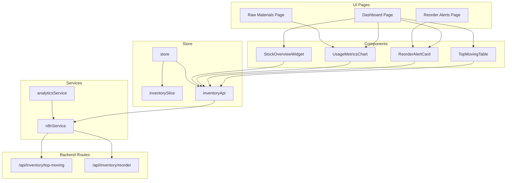
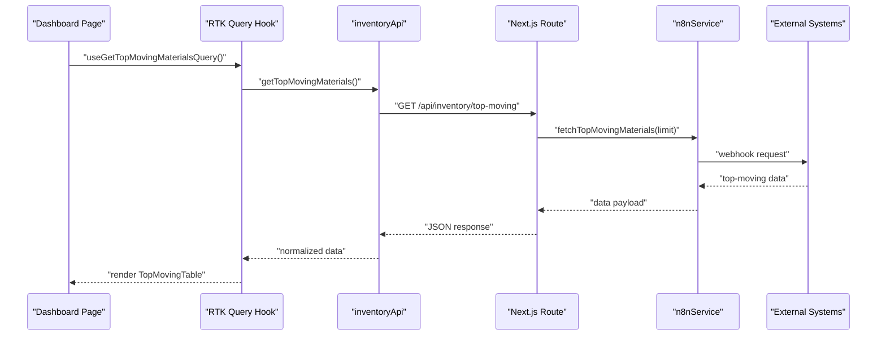
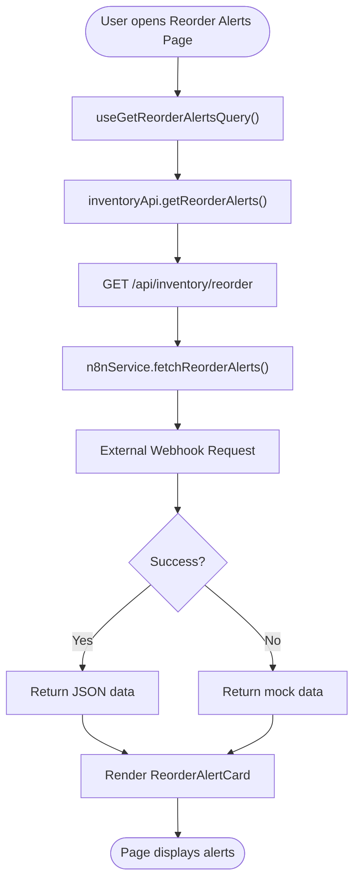
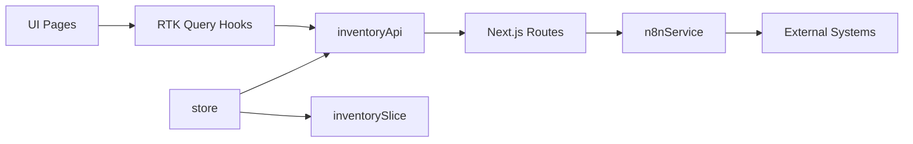
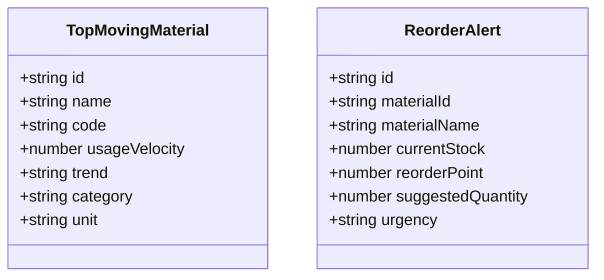

# Inventory Management

<cite>
**Referenced Files in This Document**
- [page.tsx](file://src/app/raw-materials/page.tsx)
- [page.tsx](file://src/app/reorder-alerts/page.tsx)
- [page.tsx](file://src/app/dashboard/page.tsx)
- [ReorderAlertCard.tsx](file://src/components/inventory/ReorderAlertCard.tsx)
- [TopMovingTable.tsx](file://src/components/inventory/TopMovingTable.tsx)
- [UsageMetricsChart.tsx](file://src/components/inventory/UsageMetricsChart.tsx)
- [StockOverviewWidget.tsx](file://src/components/inventory/StockOverviewWidget.tsx)
- [inventoryApi.ts](file://src/store/api/inventoryApi.ts)
- [inventorySlice.ts](file://src/store/slices/inventorySlice.ts)
- [store.ts](file://src/store/store.ts)
- [route.ts](file://src/app/api/inventory/top-moving/route.ts)
- [route.ts](file://src/app/api/inventory/reorder/route.ts)
- [n8nService.ts](file://src/services/n8nService.ts)
- [analyticsService.ts](file://src/services/analyticsService.ts)
- [supabase.ts](file://src/lib/supabase.ts)
</cite>

## Table of Contents
1. [Introduction](#introduction)
2. [Project Structure](#project-structure)
3. [Core Components](#core-components)
4. [Architecture Overview](#architecture-overview)
5. [Detailed Component Analysis](#detailed-component-analysis)
6. [Dependency Analysis](#dependency-analysis)
7. [Performance Considerations](#performance-considerations)
8. [Troubleshooting Guide](#troubleshooting-guide)
9. [Conclusion](#conclusion)
10. [Appendices](#appendices)

## Introduction
This document explains the inventory management system with a focus on:
- Raw materials page for detailed inventory tracking
- Reorder alerts functionality and ReorderAlertCard
- TopMovingTable for identifying high-demand items
- Real-time inventory data integration via APIs and n8n webhooks
- Alert threshold configuration and automated reorder recommendations
- Supplier and categorization considerations
- Data synchronization between the dashboard and external inventory systems

The system uses a dashboard-first approach, pulling inventory data from an n8n-managed webhook that sources information from external systems (ERP, databases), while leveraging AI services for predictive insights.

## Project Structure
The inventory domain spans UI pages, reusable components, Redux RTK Query APIs, and backend API routes:
- Pages: dashboard, raw materials, reorder alerts
- Components: TopMovingTable, ReorderAlertCard, UsageMetricsChart, StockOverviewWidget
- Store: inventory slice and inventory API
- Services: n8nService for webhook integration and analyticsService for AI-driven insights
- Backend routes: inventory endpoints for top-moving and reorder alerts

**Diagram sources**
- [page.tsx:17-127](file://src/app/dashboard/page.tsx#L17-L127)
- [page.tsx:9-37](file://src/app/raw-materials/page.tsx#L9-L37)
- [page.tsx:11-43](file://src/app/reorder-alerts/page.tsx#L11-L43)
- [TopMovingTable.tsx:19-99](file://src/components/inventory/TopMovingTable.tsx#L19-L99)
- [ReorderAlertCard.tsx:19-104](file://src/components/inventory/ReorderAlertCard.tsx#L19-L104)
- [UsageMetricsChart.tsx:47-159](file://src/components/inventory/UsageMetricsChart.tsx#L47-L159)
- [StockOverviewWidget.tsx:16-56](file://src/components/inventory/StockOverviewWidget.tsx#L16-L56)
- [inventoryApi.ts:23-49](file://src/store/api/inventoryApi.ts#L23-L49)
- [inventorySlice.ts:21-55](file://src/store/slices/inventorySlice.ts#L21-L55)
- [store.ts:7-16](file://src/store/store.ts#L7-L16)
- [route.ts:4-24](file://src/app/api/inventory/top-moving/route.ts#L4-L24)
- [route.ts:4-17](file://src/app/api/inventory/reorder/route.ts#L4-L17)
- [n8nService.ts:16-188](file://src/services/n8nService.ts#L16-L188)
- [analyticsService.ts:13-133](file://src/services/analyticsService.ts#L13-L133)

**Section sources**
- [page.tsx:17-127](file://src/app/dashboard/page.tsx#L17-L127)
- [page.tsx:9-37](file://src/app/raw-materials/page.tsx#L9-L37)
- [page.tsx:11-43](file://src/app/reorder-alerts/page.tsx#L11-L43)
- [inventoryApi.ts:23-49](file://src/store/api/inventoryApi.ts#L23-L49)
- [n8nService.ts:16-188](file://src/services/n8nService.ts#L16-L188)

## Core Components
- TopMovingTable: Displays fast-moving raw materials with rank, category, usage velocity, trend, and unit.
- ReorderAlertCard: Renders active reorder alerts grouped by urgency (critical, warning, info) with current stock, reorder point, and suggested order quantity.
- UsageMetricsChart: Shows actual consumption vs forecast over weekly or monthly periods with controls and summary metrics.
- StockOverviewWidget: Provides KPI widgets for total materials, low stock items, pending orders, and turnover rate.
- inventoryApi: Defines RTK Query endpoints for top-moving materials, reorder alerts, usage metrics, and stock overview.
- inventorySlice: Redux slice for local state of inventory data and loading/error flags.
- n8nService: Integrates with n8n webhook to fetch inventory data, with mock fallback and polling support.
- analyticsService: Supplies AI-driven insights, anomaly detection, and forecasting utilities.

**Section sources**
- [TopMovingTable.tsx:19-99](file://src/components/inventory/TopMovingTable.tsx#L19-L99)
- [ReorderAlertCard.tsx:19-104](file://src/components/inventory/ReorderAlertCard.tsx#L19-L104)
- [UsageMetricsChart.tsx:47-159](file://src/components/inventory/UsageMetricsChart.tsx#L47-L159)
- [StockOverviewWidget.tsx:16-56](file://src/components/inventory/StockOverviewWidget.tsx#L16-L56)
- [inventoryApi.ts:23-49](file://src/store/api/inventoryApi.ts#L23-L49)
- [inventorySlice.ts:21-55](file://src/store/slices/inventorySlice.ts#L21-L55)
- [n8nService.ts:16-188](file://src/services/n8nService.ts#L16-L188)
- [analyticsService.ts:13-133](file://src/services/analyticsService.ts#L13-L133)

## Architecture Overview
The system follows a reactive architecture:
- UI pages orchestrate data fetching via RTK Query hooks.
- inventoryApi defines endpoints that call backend routes.
- Backend routes delegate to n8nService to retrieve data from external systems.
- n8nService acts as the single source of truth for inventory data, with mock fallbacks.
- analyticsService augments insights using AI where applicable.
- store integrates RTK Query middleware and exposes typed state.

**Diagram sources**
- [page.tsx:18-18](file://src/app/dashboard/page.tsx#L18-L18)
- [inventoryApi.ts:28-32](file://src/store/api/inventoryApi.ts#L28-L32)
- [route.ts:4-16](file://src/app/api/inventory/top-moving/route.ts#L4-L16)
- [n8nService.ts:136-138](file://src/services/n8nService.ts#L136-L138)

**Section sources**
- [page.tsx:17-127](file://src/app/dashboard/page.tsx#L17-L127)
- [inventoryApi.ts:23-49](file://src/store/api/inventoryApi.ts#L23-L49)
- [route.ts:4-24](file://src/app/api/inventory/top-moving/route.ts#L4-L24)
- [n8nService.ts:16-188](file://src/services/n8nService.ts#L16-L188)

## Detailed Component Analysis

### Raw Materials Page
Purpose: Centralized view for raw materials inventory and consumption patterns.
- Displays a usage metrics chart and a placeholder card for a complete inventory listing.
- Integrates UsageMetricsChart for consumption vs forecast visualization.

Practical usage:
- Navigate to the raw materials page to review consumption trends and forecast accuracy.
- Use the chart’s period selector to toggle between weekly and monthly views.

**Section sources**
- [page.tsx:9-37](file://src/app/raw-materials/page.tsx#L9-L37)
- [UsageMetricsChart.tsx:47-159](file://src/components/inventory/UsageMetricsChart.tsx#L47-L159)

### Reorder Alerts Page
Purpose: Presents AI-powered reorder recommendations and active alerts.
- Uses RTK Query to fetch alerts and renders them via ReorderAlertCard.
- Includes PredictiveInsights for contextual AI guidance.

Workflow:
- On load, the page queries inventoryApi.getReorderAlerts.
- n8nService retrieves data from the reorder-alerts endpoint.
- ReorderAlertCard renders urgency-based cards with actionable details.

**Section sources**
- [page.tsx:11-43](file://src/app/reorder-alerts/page.tsx#L11-L43)
- [ReorderAlertCard.tsx:19-104](file://src/components/inventory/ReorderAlertCard.tsx#L19-L104)
- [inventoryApi.ts:33-37](file://src/store/api/inventoryApi.ts#L33-L37)
- [route.ts:4-17](file://src/app/api/inventory/reorder/route.ts#L4-L17)
- [n8nService.ts:143-144](file://src/services/n8nService.ts#L143-L144)

### TopMovingTable
Purpose: Identify high-demand raw materials for prioritized attention.
- Displays rank, material code, name, category, usage velocity, trend, and unit.
- Highlights top-ranked items and trend icons for quick assessment.

Processing logic:
- Accepts an array of TopMovingMaterial items.
- Renders rows with hover effects and category chips.
- Uses trend icons and colors to communicate direction.

**Section sources**
- [TopMovingTable.tsx:19-99](file://src/components/inventory/TopMovingTable.tsx#L19-L99)
- [inventoryApi.ts:3-11](file://src/store/api/inventoryApi.ts#L3-L11)

### ReorderAlertCard
Purpose: Manage stock level warnings and suggest reorder quantities.
- Renders alerts grouped by urgency (critical, warning, info).
- Shows current stock, reorder point, and suggested order quantity per item.
- Provides an “Order” button per alert.

Urgency mapping:
- Critical: error severity visuals and background.
- Warning: warning visuals and background.
- Info: info visuals and background.

**Section sources**
- [ReorderAlertCard.tsx:19-104](file://src/components/inventory/ReorderAlertCard.tsx#L19-L104)
- [inventoryApi.ts:13-21](file://src/store/api/inventoryApi.ts#L13-L21)

### UsageMetricsChart
Purpose: Visualize consumption and forecast trends with configurable periods.
- Supports weekly and monthly views.
- Displays average daily usage, peak usage, and forecast accuracy.
- Uses mock data for demonstration; integrates with RTK Query for live metrics.

Controls:
- Period selector toggles between weekly and monthly charts.
- Loading and error states handled gracefully.

**Section sources**
- [UsageMetricsChart.tsx:47-159](file://src/components/inventory/UsageMetricsChart.tsx#L47-L159)
- [inventoryApi.ts:38-47](file://src/store/api/inventoryApi.ts#L38-L47)

### StockOverviewWidget
Purpose: Present key inventory KPIs in compact cards.
- Shows totals, trends, and directional indicators.
- Used on the dashboard to summarize stock health.

**Section sources**
- [StockOverviewWidget.tsx:16-56](file://src/components/inventory/StockOverviewWidget.tsx#L16-L56)
- [page.tsx:50-84](file://src/app/dashboard/page.tsx#L50-L84)

### API Integration and Data Flow
- inventoryApi endpoints:
  - getTopMovingMaterials: pulls from /api/inventory/top-moving
  - getReorderAlerts: pulls from /api/inventory/reorder
  - getUsageMetrics: pulls from /api/inventory/usage-metrics?period=...
  - getStockOverview: pulls from /api/inventory/stock-overview
- Backend routes:
  - top-moving route delegates to n8nService.fetchTopMovingMaterials(limit)
  - reorder route delegates to n8nService.fetchReorderAlerts()
- n8nService:
  - Calls external webhook with Authorization header and JSON payload.
  - Returns mock data if the webhook is unavailable or returns 404.
  - Subscribes to real-time updates via periodic polling.

**Diagram sources**
- [page.tsx:12-12](file://src/app/reorder-alerts/page.tsx#L12-L12)
- [inventoryApi.ts:33-37](file://src/store/api/inventoryApi.ts#L33-L37)
- [route.ts:4-17](file://src/app/api/inventory/reorder/route.ts#L4-L17)
- [n8nService.ts:143-144](file://src/services/n8nService.ts#L143-L144)

**Section sources**
- [inventoryApi.ts:23-49](file://src/store/api/inventoryApi.ts#L23-L49)
- [route.ts:4-17](file://src/app/api/inventory/reorder/route.ts#L4-L17)
- [n8nService.ts:29-56](file://src/services/n8nService.ts#L29-L56)

### Alert Threshold Configuration and Automated Recommendations
- Reorder thresholds and suggested quantities are computed externally and surfaced via n8nService.
- ReorderAlertCard consumes these values and presents urgency-based recommendations.
- AI-backed insights:
  - analyticsService generates predictive insights and anomaly detection.
  - forecastDemand and calculateOptimalReorderPoint demonstrate calculation patterns for future enhancements.

Recommendations:
- Configure reorder points and safety stock parameters upstream (in n8n or external systems).
- Use PredictiveInsights on the reorder alerts page to guide decisions.
- Monitor UsageMetricsChart to validate forecasts and adjust thresholds accordingly.

**Section sources**
- [ReorderAlertCard.tsx:19-104](file://src/components/inventory/ReorderAlertCard.tsx#L19-L104)
- [analyticsService.ts:98-130](file://src/services/analyticsService.ts#L98-L130)

### Relationship Between Top-Moving Materials and Reorder Alerts
- TopMovingTable highlights high-consumption items that may require attention for reorder planning.
- ReorderAlertCard focuses on items below reorder points; together they inform proactive replenishment.
- Use TopMovingTable to identify candidates for reorder point tuning and ReorderAlertCard to prioritize immediate actions.

**Section sources**
- [TopMovingTable.tsx:19-99](file://src/components/inventory/TopMovingTable.tsx#L19-L99)
- [ReorderAlertCard.tsx:19-104](file://src/components/inventory/ReorderAlertCard.tsx#L19-L104)

### Practical Examples

- Setting up reorder alerts:
  - Ensure the external system (via n8n) computes current stock, reorder points, and suggested quantities.
  - Verify the /api/inventory/reorder endpoint returns the expected structure.
  - Confirm n8nService is configured with the correct webhook URL and API key.

- Interpreting inventory reports:
  - Use the dashboard widgets to assess low stock items and turnover rate.
  - Review UsageMetricsChart to compare actual consumption against forecasts.
  - Cross-reference TopMovingTable with ReorderAlertCard to prioritize high-velocity, low-stock items.

- Managing stock levels:
  - Click “Order” on ReorderAlertCard entries to initiate procurement actions.
  - Adjust safety stock and lead time parameters upstream to refine future recommendations.

[No sources needed since this section provides general guidance]

## Dependency Analysis
- UI pages depend on RTK Query hooks from inventoryApi.
- inventoryApi depends on Next.js backend routes.
- Backend routes depend on n8nService for data retrieval.
- n8nService encapsulates network logic and provides fallbacks.
- store integrates RTK Query middleware and exposes typed state.

**Diagram sources**
- [store.ts:7-16](file://src/store/store.ts#L7-L16)
- [inventoryApi.ts:23-49](file://src/store/api/inventoryApi.ts#L23-L49)
- [route.ts:4-24](file://src/app/api/inventory/top-moving/route.ts#L4-L24)
- [n8nService.ts:16-188](file://src/services/n8nService.ts#L16-L188)

**Section sources**
- [store.ts:7-16](file://src/store/store.ts#L7-L16)
- [inventoryApi.ts:23-49](file://src/store/api/inventoryApi.ts#L23-L49)
- [n8nService.ts:16-188](file://src/services/n8nService.ts#L16-L188)

## Performance Considerations
- Caching: inventoryApi caches data for a fixed duration to reduce network calls.
- Polling: n8nService supports periodic polling for real-time updates; tune intervals based on data volatility.
- Mock fallbacks: n8nService returns mock data when webhooks fail, preventing UI stalls.
- Lazy loading: Dashboard composes multiple queries; consider staggering heavy components if needed.

**Section sources**
- [inventoryApi.ts:30-36](file://src/store/api/inventoryApi.ts#L30-L36)
- [n8nService.ts:165-185](file://src/services/n8nService.ts#L165-L185)

## Troubleshooting Guide
- Webhook connectivity:
  - Verify N8N_WEBHOOK_URL and N8N_API_KEY environment variables.
  - Check network timeouts and fallback to mock data behavior.
- Endpoint errors:
  - Inspect backend route logs for top-moving and reorder endpoints.
  - Confirm data shape matches expected interfaces (TopMovingMaterial, ReorderAlert).
- UI rendering:
  - Use loading and error states in components to surface issues.
  - Validate RTK Query selectors and store state.

**Section sources**
- [n8nService.ts:20-23](file://src/services/n8nService.ts#L20-L23)
- [route.ts:4-24](file://src/app/api/inventory/top-moving/route.ts#L4-L24)
- [route.ts:4-17](file://src/app/api/inventory/reorder/route.ts#L4-L17)
- [UsageMetricsChart.tsx:53-63](file://src/components/inventory/UsageMetricsChart.tsx#L53-L63)

## Conclusion
The inventory management system integrates real-time data from external systems via n8n webhooks, presents actionable insights through dashboard components, and enables efficient reorder management. By combining TopMovingTable, ReorderAlertCard, UsageMetricsChart, and AI-backed analytics, stakeholders can monitor, predict, and act on inventory needs effectively.

[No sources needed since this section summarizes without analyzing specific files]

## Appendices

### Data Models

**Diagram sources**
- [inventoryApi.ts:3-21](file://src/store/api/inventoryApi.ts#L3-L21)

### Environment and Credentials
- Supabase is used for user authentication and storing preferences; it is not the source of inventory data.
- n8nService requires N8N_WEBHOOK_URL and N8N_API_KEY for secure webhook access.

**Section sources**
- [supabase.ts:8-20](file://src/lib/supabase.ts#L8-L20)
- [n8nService.ts:20-23](file://src/services/n8nService.ts#L20-L23)