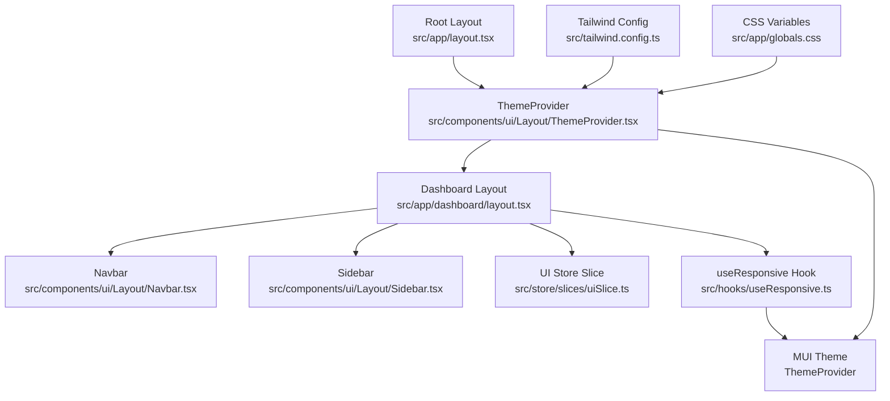
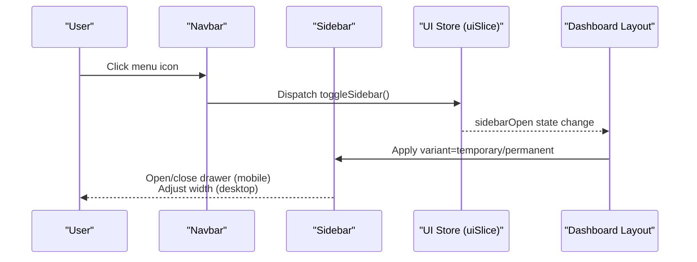
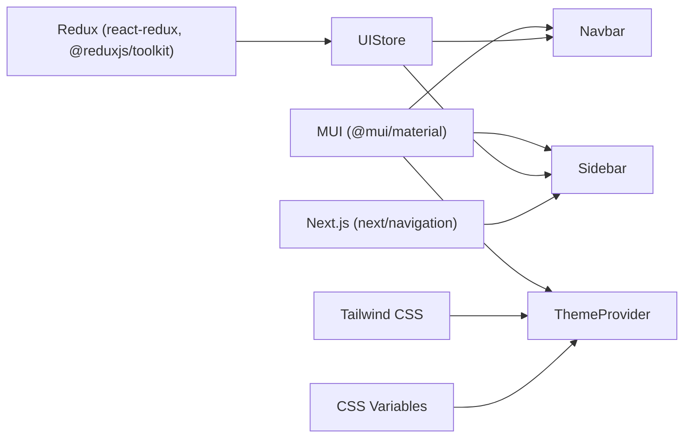

# Mobile-Responsive UI

<cite>
**Referenced Files in This Document**
- [layout.tsx](file://src/app/layout.tsx)
- [layout.tsx](file://src/app/dashboard/layout.tsx)
- [Navbar.tsx](file://src/components/ui/Layout/Navbar.tsx)
- [Sidebar.tsx](file://src/components/ui/Layout/Sidebar.tsx)
- [ThemeProvider.tsx](file://src/components/ui/Layout/ThemeProvider.tsx)
- [useResponsive.ts](file://src/hooks/useResponsive.ts)
- [store.ts](file://src/store/store.ts)
- [uiSlice.ts](file://src/store/slices/uiSlice.ts)
- [tailwind.config.ts](file://src/tailwind.config.ts)
- [globals.css](file://src/app/globals.css)
- [site.config.ts](file://src/config/site.config.ts)
- [next.config.ts](file://next.config.ts)
</cite>

## Table of Contents
1. [Introduction](#introduction)
2. [Project Structure](#project-structure)
3. [Core Components](#core-components)
4. [Architecture Overview](#architecture-overview)
5. [Detailed Component Analysis](#detailed-component-analysis)
6. [Dependency Analysis](#dependency-analysis)
7. [Performance Considerations](#performance-considerations)
8. [Troubleshooting Guide](#troubleshooting-guide)
9. [Conclusion](#conclusion)
10. [Appendices](#appendices)

## Introduction
This document explains the mobile-responsive user interface system of the dashboard. It covers the responsive design architecture, the Navbar and Sidebar components that adapt to different screen sizes, the ThemeProvider for consistent theming across devices, and the useResponsive hook for device detection. It also documents how the dashboard maintains functionality and usability across desktop, tablet, and mobile devices, details the breakpoint system, adaptive navigation patterns, and touch-friendly interface elements. Practical examples illustrate responsive behavior, theme customization, performance optimization for mobile browsers, accessibility considerations, gesture controls, offline caching, layout adaptation strategies, and overall UX optimization.

## Project Structure
The responsive UI system is built around:
- A global ThemeProvider wrapping the app to apply MUI theme and CSS baseline.
- A dashboard layout combining a fixed Navbar and an adaptive Sidebar.
- A Redux-based UI slice controlling sidebar visibility and active view.
- A custom useResponsive hook providing breakpoint-aware booleans and helpers.
- Tailwind and CSS variables supporting cross-device theming and fonts.

**Diagram sources**
- [layout.tsx:16-30](file://src/app/layout.tsx#L16-L30)
- [ThemeProvider.tsx:90-99](file://src/components/ui/Layout/ThemeProvider.tsx#L90-L99)
- [layout.tsx:10-41](file://src/app/dashboard/layout.tsx#L10-L41)
- [Navbar.tsx:17-59](file://src/components/ui/Layout/Navbar.tsx#L17-L59)
- [Sidebar.tsx:34-131](file://src/components/ui/Layout/Sidebar.tsx#L34-L131)
- [uiSlice.ts:15-41](file://src/store/slices/uiSlice.ts#L15-L41)
- [useResponsive.ts:14-41](file://src/hooks/useResponsive.ts#L14-L41)
- [tailwind.config.ts:9-41](file://src/tailwind.config.ts#L9-L41)
- [globals.css:1-27](file://src/app/globals.css#L1-L27)

**Section sources**
- [layout.tsx:16-30](file://src/app/layout.tsx#L16-L30)
- [layout.tsx:10-41](file://src/app/dashboard/layout.tsx#L10-L41)
- [ThemeProvider.tsx:90-99](file://src/components/ui/Layout/ThemeProvider.tsx#L90-L99)
- [useResponsive.ts:14-41](file://src/hooks/useResponsive.ts#L14-L41)
- [tailwind.config.ts:9-41](file://src/tailwind.config.ts#L9-L41)
- [globals.css:1-27](file://src/app/globals.css#L1-L27)

## Core Components
- ThemeProvider: Applies a consistent MUI theme, CSS baseline, and wraps the Redux store for global state.
- Navbar: Fixed app bar with a hamburger menu to toggle the sidebar and user action icons.
- Sidebar: Adaptive drawer that switches between temporary (mobile) and permanent (desktop) modes, with collapsible labels and icons.
- useResponsive: Provides breakpoint booleans and helpers for responsive logic.
- UI Store: Manages sidebarOpen, activeView, and theme state.

**Section sources**
- [ThemeProvider.tsx:9-84](file://src/components/ui/Layout/ThemeProvider.tsx#L9-L84)
- [Navbar.tsx:17-59](file://src/components/ui/Layout/Navbar.tsx#L17-L59)
- [Sidebar.tsx:34-131](file://src/components/ui/Layout/Sidebar.tsx#L34-L131)
- [useResponsive.ts:14-41](file://src/hooks/useResponsive.ts#L14-L41)
- [uiSlice.ts:15-41](file://src/store/slices/uiSlice.ts#L15-L41)

## Architecture Overview
The responsive architecture integrates MUI’s theme and media queries with a Redux-managed UI state and a dashboard layout. On smaller screens, the Sidebar becomes a temporary Drawer controlled by the Navbar’s menu button. On larger screens, the Sidebar remains visible and collapsible. The ThemeProvider centralizes color palettes, typography, and component overrides. The useResponsive hook exposes breakpoint-aware booleans for rendering decisions.

**Diagram sources**
- [Navbar.tsx:32-40](file://src/components/ui/Layout/Navbar.tsx#L32-L40)
- [Sidebar.tsx:51-65](file://src/components/ui/Layout/Sidebar.tsx#L51-L65)
- [uiSlice.ts:19-24](file://src/store/slices/uiSlice.ts#L19-L24)
- [layout.tsx:14-39](file://src/app/dashboard/layout.tsx#L14-L39)

## Detailed Component Analysis

### ThemeProvider
- Purpose: Centralizes MUI theme creation, typography, component overrides, and CSS baseline.
- Theming highlights:
  - Palette with primary, secondary, success, warning, and error tones.
  - Typography scales optimized for readability across devices.
  - Component overrides for Button, Card, and Paper rounded corners and shadows.
- Integration: Wraps the entire app via RootLayout and provides a Redux Provider for global state.

Practical example
- To customize theme for different devices, adjust the MUI theme definition and rely on media queries in components for layout changes.

**Section sources**
- [ThemeProvider.tsx:9-84](file://src/components/ui/Layout/ThemeProvider.tsx#L9-L84)
- [layout.tsx:22-27](file://src/app/layout.tsx#L22-L27)

### useResponsive Hook
- Provides:
  - Breakpoint booleans: xs, sm, md, lg, xl.
  - Device categories: isMobile (below md), isTablet (between md and lg), isDesktop (above lg).
  - Helpers: useBreakpoint, useBreakpointUp, useBreakpointDown.
- Usage: Components query these booleans to adapt layout, spacing, and behavior.

Practical example
- Use isMobile to switch between compact and expanded layouts, and useBreakpointDown('md') to control Drawer behavior in Sidebar.

**Section sources**
- [useResponsive.ts:14-41](file://src/hooks/useResponsive.ts#L14-L41)
- [useResponsive.ts:47-66](file://src/hooks/useResponsive.ts#L47-L66)

### Navbar
- Fixed app bar with:
  - Hamburger menu to toggle sidebar.
  - Title and action icons (notifications, account).
- Uses MUI AppBar, Toolbar, IconButton, Typography, Badge, and Box.
- Integrates with Redux to dispatch toggleSidebar.

Adaptive behavior
- On mobile, the Sidebar becomes a temporary Drawer; the Navbar menu toggles it.
- On desktop, the Sidebar remains visible and collapsible.

**Section sources**
- [Navbar.tsx:17-59](file://src/components/ui/Layout/Navbar.tsx#L17-L59)

### Sidebar
- Menu items include Dashboard, Raw Materials, Reorder Alerts, Reports, and AI Assistant.
- Behavior:
  - Temporary drawer on mobile (variant='temporary'), permanent on larger screens.
  - Collapsible labels and icons; width adjusts based on sidebarOpen.
  - Auto-closes on mobile after navigation.
- Navigation:
  - Uses Next.js router to navigate and Redux to update activeView.
  - On mobile, closes the drawer after selection.

Responsive logic
- Uses useMediaQuery(theme.breakpoints.down('md')) to detect mobile.
- Applies variant and display logic accordingly.

**Section sources**
- [Sidebar.tsx:26-32](file://src/components/ui/Layout/Sidebar.tsx#L26-L32)
- [Sidebar.tsx:34-48](file://src/components/ui/Layout/Sidebar.tsx#L34-L48)
- [Sidebar.tsx:51-65](file://src/components/ui/Layout/Sidebar.tsx#L51-L65)
- [Sidebar.tsx:75-103](file://src/components/ui/Layout/Sidebar.tsx#L75-L103)
- [Sidebar.tsx:105-129](file://src/components/ui/Layout/Sidebar.tsx#L105-L129)

### Dashboard Layout
- Flex container with Navbar at the top and Sidebar on the left.
- Main content area adapts margins based on sidebarOpen and screen size.
- Uses MUI Box and Toolbar to manage spacing and z-index.

Responsive adaptation
- Margins adjust for xs and md+ to accommodate collapsed/expanded Sidebar widths.
- Transition effects smooth sidebar width changes.

**Section sources**
- [layout.tsx:17-39](file://src/app/dashboard/layout.tsx#L17-L39)

### UI Store (Redux)
- Manages:
  - sidebarOpen: controls Sidebar visibility and width.
  - activeView: tracks current view for highlighting menu items.
  - theme: placeholder for future theme switching.
- Actions:
  - toggleSidebar: flips sidebarOpen.
  - setSidebarOpen: explicit control.
  - setActiveView: updates active view.
  - setTheme: placeholder for theme switching.

Integration
- Navbar dispatches toggleSidebar.
- Sidebar reads sidebarOpen and activeView to render selection and Drawer variant.

**Section sources**
- [uiSlice.ts:15-41](file://src/store/slices/uiSlice.ts#L15-L41)
- [store.ts:7-16](file://src/store/store.ts#L7-L16)
- [Navbar.tsx:18-21](file://src/components/ui/Layout/Navbar.tsx#L18-L21)
- [Sidebar.tsx:36-38](file://src/components/ui/Layout/Sidebar.tsx#L36-L38)

### Breakpoint System and Adaptive Navigation Patterns
- Breakpoints:
  - xs: small phones.
  - sm: large phones.
  - md: tablets.
  - lg: laptops.
  - xl: desktops.
- Adaptive patterns:
  - Temporary Drawer on mobile; permanent on desktop.
  - Collapsible icons-only layout on desktop when collapsed.
  - Responsive padding and margins in main content area.

Practical example
- Use useBreakpointDown('md') to switch between temporary and permanent Drawer.
- Use useBreakpointUp('lg') to enable advanced features or wider layouts.

**Section sources**
- [useResponsive.ts:3-9](file://src/hooks/useResponsive.ts#L3-L9)
- [useResponsive.ts:23-25](file://src/hooks/useResponsive.ts#L23-L25)
- [Sidebar.tsx:40-40](file://src/components/ui/Layout/Sidebar.tsx#L40-L40)
- [layout.tsx:27-30](file://src/app/dashboard/layout.tsx#L27-L30)

### Touch-Friendly Interface Elements
- Large touch targets for menu buttons and list items.
- Smooth transitions for drawer opening/closing and layout changes.
- Collapsible navigation reduces vertical scrolling on small screens.

Accessibility considerations
- Ensure sufficient contrast and readable font sizes.
- Provide focus indicators and keyboard navigation support.
- Use semantic HTML and ARIA attributes where appropriate.

**Section sources**
- [Sidebar.tsx:78-85](file://src/components/ui/Layout/Sidebar.tsx#L78-L85)
- [Sidebar.tsx:107-112](file://src/components/ui/Layout/Sidebar.tsx#L107-L112)
- [ThemeProvider.tsx:32-58](file://src/components/ui/Layout/ThemeProvider.tsx#L32-L58)

### Offline Functionality and Caching
- Site configuration includes cache TTLs for various data types.
- Suggested approach: leverage service workers and browser caching for static assets; cache API responses with TTLs for offline readiness.

Practical example
- Configure cache defaults and TTLs in site.config.ts and integrate with data fetching layers.

**Section sources**
- [site.config.ts:22-26](file://src/config/site.config.ts#L22-L26)

## Dependency Analysis
The responsive system depends on:
- MUI for theming, components, and media queries.
- Redux for UI state (sidebarOpen, activeView).
- Next.js for routing and SSR.
- Tailwind for utility-first styles and CSS variables.

**Diagram sources**
- [ThemeProvider.tsx:3-4](file://src/components/ui/Layout/ThemeProvider.tsx#L3-L4)
- [Navbar.tsx:3-15](file://src/components/ui/Layout/Navbar.tsx#L3-L15)
- [Sidebar.tsx:5-21](file://src/components/ui/Layout/Sidebar.tsx#L5-L21)
- [store.ts:1-16](file://src/store/store.ts#L1-L16)
- [tailwind.config.ts:9-41](file://src/tailwind.config.ts#L9-L41)
- [globals.css:1-27](file://src/app/globals.css#L1-L27)

**Section sources**
- [store.ts:7-16](file://src/store/store.ts#L7-L16)
- [tailwind.config.ts:9-41](file://src/tailwind.config.ts#L9-L41)
- [globals.css:1-27](file://src/app/globals.css#L1-L27)

## Performance Considerations
- Minimize re-renders by using memoization and selector-based state access.
- Prefer CSS transitions for layout changes (e.g., drawer width) to avoid layout thrashing.
- Optimize images and fonts; preload critical fonts via Next/font.
- Enable React Compiler and build optimizations in Next.js configuration.
- Use virtualized lists for large datasets on mobile devices.

[No sources needed since this section provides general guidance]

## Troubleshooting Guide
Common issues and resolutions:
- Drawer not closing on mobile after navigation:
  - Verify Sidebar handles navigation and dispatches toggleSidebar on mobile.
- Sidebar not collapsing on desktop:
  - Confirm sidebarOpen state is managed by Redux and used to compute widths and variants.
- Inconsistent theming across devices:
  - Ensure ThemeProvider wraps the app and MUI theme is applied globally.
- Breakpoint mismatches:
  - Use useResponsive helpers to align rendering logic with MUI breakpoints.

**Section sources**
- [Sidebar.tsx:42-48](file://src/components/ui/Layout/Sidebar.tsx#L42-L48)
- [uiSlice.ts:19-24](file://src/store/slices/uiSlice.ts#L19-L24)
- [ThemeProvider.tsx:90-99](file://src/components/ui/Layout/ThemeProvider.tsx#L90-L99)
- [useResponsive.ts:14-41](file://src/hooks/useResponsive.ts#L14-L41)

## Conclusion
The dashboard’s responsive UI system combines MUI theming, adaptive components, and Redux state to deliver a consistent experience across devices. The Navbar and Sidebar collaborate to provide intuitive navigation, while the useResponsive hook enables precise breakpoint-aware behavior. With thoughtful performance optimizations, accessibility considerations, and caching strategies, the system supports efficient and inclusive usage on desktop, tablet, and mobile.

[No sources needed since this section summarizes without analyzing specific files]

## Appendices

### Breakpoint Reference
- xs: small phones
- sm: large phones
- md: tablets
- lg: laptops
- xl: desktops

**Section sources**
- [useResponsive.ts:3-9](file://src/hooks/useResponsive.ts#L3-L9)

### Example: Applying Breakpoint Logic
- Use useBreakpointDown('md') to decide Drawer variant.
- Use useBreakpointUp('lg') to enable advanced layouts.
- Use isMobile/isTablet/isDesktop to tailor component density and spacing.

**Section sources**
- [useResponsive.ts:23-25](file://src/hooks/useResponsive.ts#L23-L25)
- [Sidebar.tsx:40-40](file://src/components/ui/Layout/Sidebar.tsx#L40-L40)
- [layout.tsx:25-30](file://src/app/dashboard/layout.tsx#L25-L30)