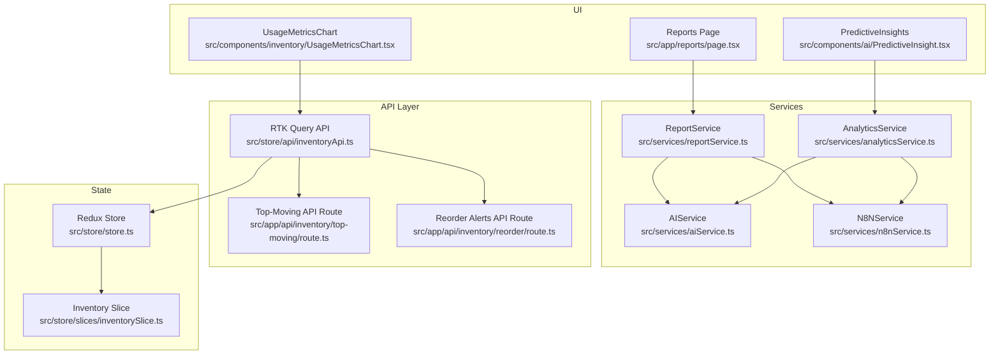
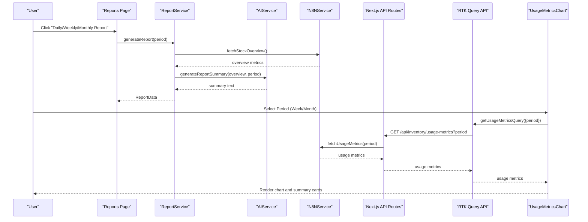
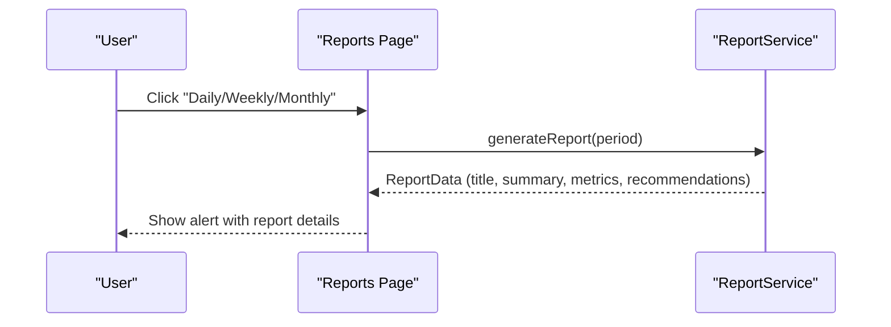
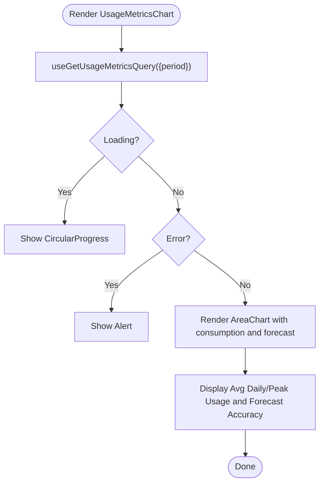
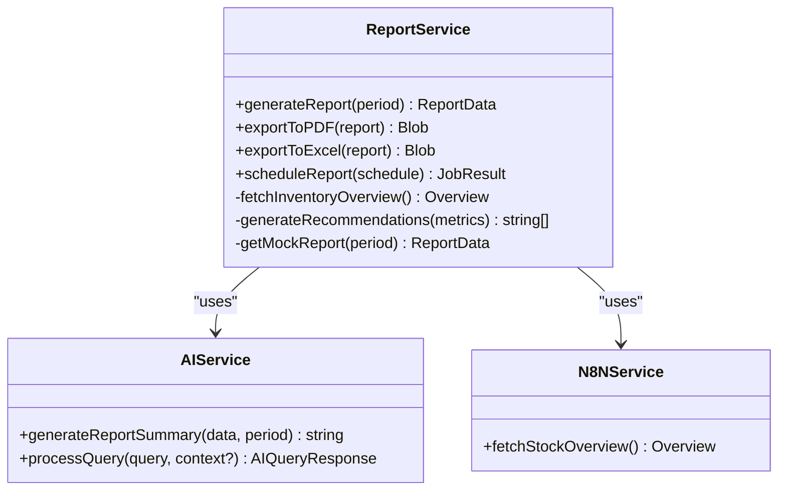
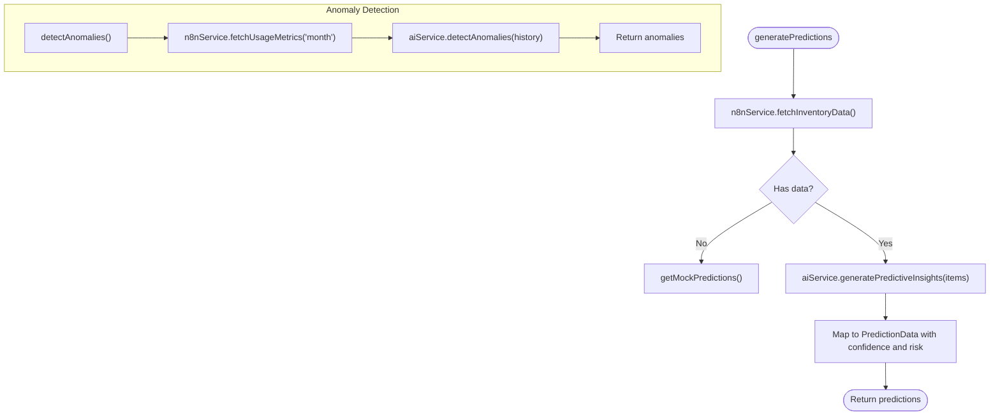
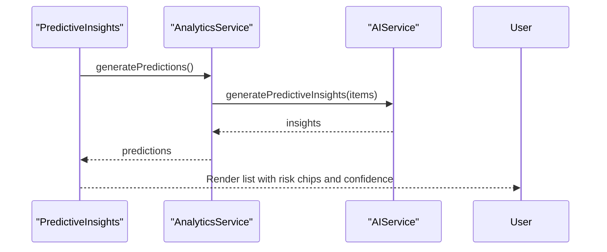
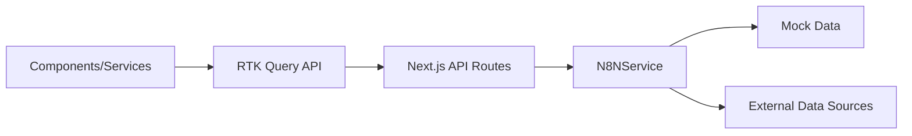
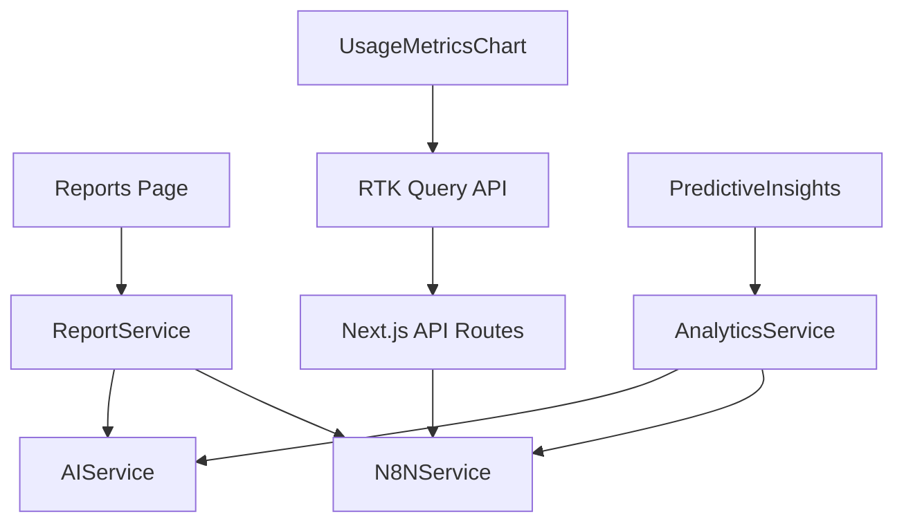

# Reports and Analytics

<cite>
**Referenced Files in This Document**
- [src/app/reports/page.tsx](file://src/app/reports/page.tsx)
- [src/components/inventory/UsageMetricsChart.tsx](file://src/components/inventory/UsageMetricsChart.tsx)
- [src/services/reportService.ts](file://src/services/reportService.ts)
- [src/services/analyticsService.ts](file://src/services/analyticsService.ts)
- [src/services/aiService.ts](file://src/services/aiService.ts)
- [src/services/n8nService.ts](file://src/services/n8nService.ts)
- [src/store/api/inventoryApi.ts](file://src/store/api/inventoryApi.ts)
- [src/components/ai/PredictiveInsight.tsx](file://src/components/ai/PredictiveInsight.tsx)
- [src/app/api/inventory/top-moving/route.ts](file://src/app/api/inventory/top-moving/route.ts)
- [src/app/api/inventory/reorder/route.ts](file://src/app/api/inventory/reorder/route.ts)
- [src/store/store.ts](file://src/store/store.ts)
- [src/store/slices/inventorySlice.ts](file://src/store/slices/inventorySlice.ts)
- [package.json](file://package.json)
</cite>

## Table of Contents
1. [Introduction](#introduction)
2. [Project Structure](#project-structure)
3. [Core Components](#core-components)
4. [Architecture Overview](#architecture-overview)
5. [Detailed Component Analysis](#detailed-component-analysis)
6. [Dependency Analysis](#dependency-analysis)
7. [Performance Considerations](#performance-considerations)
8. [Troubleshooting Guide](#troubleshooting-guide)
9. [Conclusion](#conclusion)
10. [Appendices](#appendices)

## Introduction
This document explains the reporting and analytics capabilities of the dashboard. It covers the reports page interface, the UsageMetricsChart for data visualization, the reportService for generating analytical insights, and the analyticsService for trend analysis. It also describes how users can generate inventory reports, view usage patterns, and access predictive analytics, along with the report generation workflow, chart customization options, export functionality, scheduling, filtering, and integration with external reporting systems. Finally, it outlines the analytics algorithms used for trend prediction, performance metrics collection, and the dashboard’s role in executive decision-making.

## Project Structure
The reporting and analytics features are organized around:
- A reports page that orchestrates report generation and scheduling.
- A usage metrics chart component that visualizes consumption vs. forecast.
- Services for report generation, analytics, AI-driven insights, and data sourcing from n8n webhooks.
- RTK Query APIs for inventory data and Next.js API routes that proxy to n8n.
- Redux store integration for caching and state management.

**Diagram sources**
- [src/app/reports/page.tsx:14-96](file://src/app/reports/page.tsx#L14-L96)
- [src/components/inventory/UsageMetricsChart.tsx:47-160](file://src/components/inventory/UsageMetricsChart.tsx#L47-L160)
- [src/components/ai/PredictiveInsight.tsx:29-152](file://src/components/ai/PredictiveInsight.tsx#L29-L152)
- [src/services/reportService.ts:18-171](file://src/services/reportService.ts#L18-L171)
- [src/services/analyticsService.ts:13-134](file://src/services/analyticsService.ts#L13-L134)
- [src/services/aiService.ts:18-219](file://src/services/aiService.ts#L18-L219)
- [src/services/n8nService.ts:16-242](file://src/services/n8nService.ts#L16-L242)
- [src/store/api/inventoryApi.ts:23-57](file://src/store/api/inventoryApi.ts#L23-L57)
- [src/app/api/inventory/top-moving/route.ts:1-25](file://src/app/api/inventory/top-moving/route.ts#L1-L25)
- [src/app/api/inventory/reorder/route.ts:1-18](file://src/app/api/inventory/reorder/route.ts#L1-L18)
- [src/store/store.ts:1-27](file://src/store/store.ts#L1-L27)
- [src/store/slices/inventorySlice.ts:1-56](file://src/store/slices/inventorySlice.ts#L1-L56)

**Section sources**
- [src/app/reports/page.tsx:14-96](file://src/app/reports/page.tsx#L14-L96)
- [src/components/inventory/UsageMetricsChart.tsx:47-160](file://src/components/inventory/UsageMetricsChart.tsx#L47-L160)
- [src/services/reportService.ts:18-171](file://src/services/reportService.ts#L18-L171)
- [src/services/analyticsService.ts:13-134](file://src/services/analyticsService.ts#L13-L134)
- [src/services/aiService.ts:18-219](file://src/services/aiService.ts#L18-L219)
- [src/services/n8nService.ts:16-242](file://src/services/n8nService.ts#L16-L242)
- [src/store/api/inventoryApi.ts:23-57](file://src/store/api/inventoryApi.ts#L23-L57)
- [src/app/api/inventory/top-moving/route.ts:1-25](file://src/app/api/inventory/top-moving/route.ts#L1-L25)
- [src/app/api/inventory/reorder/route.ts:1-18](file://src/app/api/inventory/reorder/route.ts#L1-L18)
- [src/store/store.ts:1-27](file://src/store/store.ts#L1-L27)
- [src/store/slices/inventorySlice.ts:1-56](file://src/store/slices/inventorySlice.ts#L1-L56)

## Core Components
- Reports Page: Provides buttons to generate daily, weekly, and monthly reports, and a button to schedule automated reports. It integrates with reportService to orchestrate generation and displays a recent reports area.
- UsageMetricsChart: Visualizes actual consumption vs. forecast over weekly or monthly periods, with interactive tooltips, legends, and summary metrics.
- ReportService: Orchestrates report generation by fetching inventory overview from n8n, generating AI summaries, and producing recommendations. It also supports exporting to PDF/Excel and scheduling reports.
- AnalyticsService: Generates predictive insights, detects anomalies, calculates optimal reorder points, and forecasts demand across periods.
- AIService: Wraps AI model calls for report summaries, predictive insights, anomaly detection, and general inventory questions.
- N8NService: Acts as the single source of truth for inventory data, fetching from n8n webhooks with fallback to mock data and periodic polling.
- RTK Query APIs and Next.js API Routes: Expose inventory endpoints (top-moving, reorder alerts, usage metrics, stock overview) to the UI and charts.
- PredictiveInsights UI: Displays AI-powered predictions with confidence, risk levels, and recommended actions.

**Section sources**
- [src/app/reports/page.tsx:14-96](file://src/app/reports/page.tsx#L14-L96)
- [src/components/inventory/UsageMetricsChart.tsx:47-160](file://src/components/inventory/UsageMetricsChart.tsx#L47-L160)
- [src/services/reportService.ts:18-171](file://src/services/reportService.ts#L18-L171)
- [src/services/analyticsService.ts:13-134](file://src/services/analyticsService.ts#L13-L134)
- [src/services/aiService.ts:18-219](file://src/services/aiService.ts#L18-L219)
- [src/services/n8nService.ts:16-242](file://src/services/n8nService.ts#L16-L242)
- [src/store/api/inventoryApi.ts:23-57](file://src/store/api/inventoryApi.ts#L23-L57)
- [src/components/ai/PredictiveInsight.tsx:29-152](file://src/components/ai/PredictiveInsight.tsx#L29-L152)

## Architecture Overview
The reporting and analytics pipeline integrates UI components, services, and backend APIs:

**Diagram sources**
- [src/app/reports/page.tsx:17-29](file://src/app/reports/page.tsx#L17-L29)
- [src/services/reportService.ts:22-42](file://src/services/reportService.ts#L22-L42)
- [src/services/aiService.ts:129-149](file://src/services/aiService.ts#L129-L149)
- [src/services/n8nService.ts:203-212](file://src/services/n8nService.ts#L203-L212)
- [src/app/api/inventory/top-moving/route.ts:1-25](file://src/app/api/inventory/top-moving/route.ts#L1-L25)
- [src/store/api/inventoryApi.ts:38-42](file://src/store/api/inventoryApi.ts#L38-L42)
- [src/components/inventory/UsageMetricsChart.tsx:48-51](file://src/components/inventory/UsageMetricsChart.tsx#L48-L51)

## Detailed Component Analysis

### Reports Page
- Purpose: Central hub for report generation and scheduling.
- Features:
  - Generate daily, weekly, monthly reports via reportService.
  - Schedule automated reports with recipients and format selection.
  - Disabled states during generation to prevent concurrent requests.
- Integration: Calls reportService.generateReport and handles UI feedback.

**Diagram sources**
- [src/app/reports/page.tsx:17-29](file://src/app/reports/page.tsx#L17-L29)
- [src/services/reportService.ts:22-42](file://src/services/reportService.ts#L22-L42)

**Section sources**
- [src/app/reports/page.tsx:14-96](file://src/app/reports/page.tsx#L14-L96)
- [src/services/reportService.ts:18-171](file://src/services/reportService.ts#L18-L171)

### UsageMetricsChart
- Purpose: Visualize actual consumption vs. forecast with weekly/monthly periods.
- Features:
  - Period selector (Week/Month).
  - Responsive area chart with gradients and tooltips.
  - Summary cards for average usage, peak usage, and forecast accuracy.
  - Loading and error states.
- Data Source: RTK Query hook useGetUsageMetricsQuery({ period }), backed by Next.js API route and n8nService.

**Diagram sources**
- [src/components/inventory/UsageMetricsChart.tsx:47-160](file://src/components/inventory/UsageMetricsChart.tsx#L47-L160)
- [src/store/api/inventoryApi.ts:38-42](file://src/store/api/inventoryApi.ts#L38-L42)

**Section sources**
- [src/components/inventory/UsageMetricsChart.tsx:47-160](file://src/components/inventory/UsageMetricsChart.tsx#L47-L160)
- [src/store/api/inventoryApi.ts:23-57](file://src/store/api/inventoryApi.ts#L23-L57)

### ReportService
- Purpose: Generate AI-enhanced inventory reports with executive summaries and recommendations.
- Workflow:
  - Fetch inventory overview from n8nService.
  - Generate AI summary via aiService.
  - Produce recommendations by prompting aiService.
  - Provide fallbacks using mock data if external services fail.
- Export and Scheduling:
  - exportToPDF and exportToExcel return Blobs (mocked).
  - scheduleReport accepts period, time, recipients, and format; returns job metadata.

**Diagram sources**
- [src/services/reportService.ts:18-171](file://src/services/reportService.ts#L18-L171)
- [src/services/aiService.ts:18-219](file://src/services/aiService.ts#L18-L219)
- [src/services/n8nService.ts:16-242](file://src/services/n8nService.ts#L16-L242)

**Section sources**
- [src/services/reportService.ts:18-171](file://src/services/reportService.ts#L18-L171)
- [src/services/aiService.ts:129-149](file://src/services/aiService.ts#L129-L149)
- [src/services/n8nService.ts:47-66](file://src/services/n8nService.ts#L47-L66)

### AnalyticsService
- Purpose: Provide predictive insights, anomaly detection, reorder point calculations, and demand forecasts.
- Predictive Insights:
  - Uses n8nService to fetch inventory items, then aiService to generate insights.
  - Returns predictions with confidence, risk level, and recommended actions.
- Anomaly Detection:
  - Uses aiService to analyze usage history and return anomalies.
- Reorder Point Calculation:
  - calculateOptimalReorderPoint(avgDailyUsage, leadTimeDays, safetyStockDays, seasonalityFactor).
- Demand Forecast:
  - forecastDemand(period) returns predicted demand with confidence intervals and growth rate.

**Diagram sources**
- [src/services/analyticsService.ts:17-41](file://src/services/analyticsService.ts#L17-L41)
- [src/services/aiService.ts:79-109](file://src/services/aiService.ts#L79-L109)
- [src/services/n8nService.ts:203-205](file://src/services/n8nService.ts#L203-L205)

**Section sources**
- [src/services/analyticsService.ts:13-134](file://src/services/analyticsService.ts#L13-L134)
- [src/services/aiService.ts:79-109](file://src/services/aiService.ts#L79-L109)
- [src/services/n8nService.ts:203-205](file://src/services/n8nService.ts#L203-L205)

### PredictiveInsights UI
- Purpose: Display AI-powered predictions in a list with risk chips and confidence indicators.
- Behavior:
  - Loads predictions on mount via analyticsService.
  - Renders loading spinner while fetching.
  - Shows alerts with informational text about ML-based insights.

**Diagram sources**
- [src/components/ai/PredictiveInsight.tsx:29-46](file://src/components/ai/PredictiveInsight.tsx#L29-L46)
- [src/services/analyticsService.ts:17-41](file://src/services/analyticsService.ts#L17-L41)
- [src/services/aiService.ts:79-109](file://src/services/aiService.ts#L79-L109)

**Section sources**
- [src/components/ai/PredictiveInsight.tsx:29-152](file://src/components/ai/PredictiveInsight.tsx#L29-L152)
- [src/services/analyticsService.ts:13-134](file://src/services/analyticsService.ts#L13-L134)

### Data Access and APIs
- RTK Query Inventory API:
  - Endpoints: top-moving, reorder alerts, usage metrics, stock overview.
  - Caching and tagging support for efficient data management.
- Next.js API Routes:
  - Proxy to n8nService for inventory endpoints.
  - Return JSON responses or error payloads.
- N8NService:
  - Single source of truth for inventory data.
  - Fallback to mock data on errors or timeouts.
  - Polling subscription for real-time updates.

**Diagram sources**
- [src/store/api/inventoryApi.ts:23-57](file://src/store/api/inventoryApi.ts#L23-L57)
- [src/app/api/inventory/top-moving/route.ts:1-25](file://src/app/api/inventory/top-moving/route.ts#L1-L25)
- [src/app/api/inventory/reorder/route.ts:1-18](file://src/app/api/inventory/reorder/route.ts#L1-L18)
- [src/services/n8nService.ts:29-56](file://src/services/n8nService.ts#L29-L56)

**Section sources**
- [src/store/api/inventoryApi.ts:23-57](file://src/store/api/inventoryApi.ts#L23-L57)
- [src/app/api/inventory/top-moving/route.ts:1-25](file://src/app/api/inventory/top-moving/route.ts#L1-L25)
- [src/app/api/inventory/reorder/route.ts:1-18](file://src/app/api/inventory/reorder/route.ts#L1-L18)
- [src/services/n8nService.ts:16-242](file://src/services/n8nService.ts#L16-L242)

## Dependency Analysis
- Coupling:
  - Reports Page depends on ReportService.
  - UsageMetricsChart depends on RTK Query and inventoryApi.
  - PredictiveInsights depends on AnalyticsService.
  - All services depend on AIService and N8NService.
- Cohesion:
  - Services encapsulate distinct responsibilities (reporting, analytics, AI, data sourcing).
- External Dependencies:
  - axios for HTTP requests.
  - recharts for visualization.
  - @reduxjs/toolkit/query/react for data fetching.
  - @mui/material for UI components.

**Diagram sources**
- [src/app/reports/page.tsx:10](file://src/app/reports/page.tsx#L10)
- [src/components/inventory/UsageMetricsChart.tsx:3](file://src/components/inventory/UsageMetricsChart.tsx#L3)
- [src/components/ai/PredictiveInsight.tsx:4](file://src/components/ai/PredictiveInsight.tsx#L4)
- [src/services/reportService.ts:1](file://src/services/reportService.ts#L1)
- [src/services/analyticsService.ts:1](file://src/services/analyticsService.ts#L1)
- [src/services/aiService.ts:1](file://src/services/aiService.ts#L1)
- [src/services/n8nService.ts:1](file://src/services/n8nService.ts#L1)
- [src/store/api/inventoryApi.ts:1](file://src/store/api/inventoryApi.ts#L1)
- [src/app/api/inventory/top-moving/route.ts:2](file://src/app/api/inventory/top-moving/route.ts#L2)
- [src/app/api/inventory/reorder/route.ts:2](file://src/app/api/inventory/reorder/route.ts#L2)

**Section sources**
- [package.json:11-26](file://package.json#L11-L26)
- [src/services/reportService.ts:1](file://src/services/reportService.ts#L1)
- [src/services/analyticsService.ts:1](file://src/services/analyticsService.ts#L1)
- [src/services/aiService.ts:1](file://src/services/aiService.ts#L1)
- [src/services/n8nService.ts:1](file://src/services/n8nService.ts#L1)
- [src/store/api/inventoryApi.ts:1](file://src/store/api/inventoryApi.ts#L1)
- [src/app/api/inventory/top-moving/route.ts:2](file://src/app/api/inventory/top-moving/route.ts#L2)
- [src/app/api/inventory/reorder/route.ts:2](file://src/app/api/inventory/reorder/route.ts#L2)

## Performance Considerations
- Caching and Tagging:
  - RTK Query caches endpoints with keepUnusedDataFor durations to reduce network calls.
- Polling:
  - N8NService supports periodic polling for real-time updates; tune intervals based on data volatility.
- Export and Scheduling:
  - Export methods currently return Blobs (mocked); integrate with PDF/Excel libraries for production.
  - Scheduling returns job identifiers; integrate with cron or task schedulers for automation.
- Error Handling:
  - Services provide fallbacks to mock data to ensure UI stability under failures.

[No sources needed since this section provides general guidance]

## Troubleshooting Guide
- Reports Page:
  - If report generation fails, confirm environment variables for AI endpoints and n8n webhook are configured.
  - Check console logs for error messages from reportService.
- UsageMetricsChart:
  - If chart does not render, verify RTK Query endpoint and API route are reachable.
  - Confirm n8nService is returning data or falling back to mock data.
- AnalyticsService:
  - If predictions are empty, ensure n8nService fetches inventory items and aiService is reachable.
  - Validate anomaly detection input format.
- AIService:
  - Verify AI_MODEL_ENDPOINT, AI_API_KEY, and AI_MODEL_NAME environment variables.
  - Inspect axios error responses for network or authentication issues.
- N8NService:
  - Check webhook URL and API key configuration.
  - Review timeout and error handling for network failures.

**Section sources**
- [src/services/reportService.ts:38-42](file://src/services/reportService.ts#L38-L42)
- [src/components/inventory/UsageMetricsChart.tsx:53-63](file://src/components/inventory/UsageMetricsChart.tsx#L53-L63)
- [src/services/analyticsService.ts:37-41](file://src/services/analyticsService.ts#L37-L41)
- [src/services/aiService.ts:70-74](file://src/services/aiService.ts#L70-L74)
- [src/services/n8nService.ts:42-56](file://src/services/n8nService.ts#L42-L56)

## Conclusion
The reporting and analytics system combines a user-friendly reports page, a responsive usage metrics chart, and robust services for AI-driven insights and predictive analytics. It integrates seamlessly with RTK Query and Next.js API routes, sourcing data from n8n webhooks with reliable fallbacks. Users can generate inventory reports, visualize consumption trends, and leverage predictive analytics for informed inventory planning. The architecture supports export, scheduling, and anomaly detection, enabling executive decision-making with confidence.

[No sources needed since this section summarizes without analyzing specific files]

## Appendices

### Practical Examples
- Creating a Custom Report:
  - Use the Reports Page buttons to generate daily, weekly, or monthly reports. The system fetches inventory overview from n8n, generates an AI summary, and produces recommendations.
  - Reference: [src/app/reports/page.tsx:17-29](file://src/app/reports/page.tsx#L17-L29), [src/services/reportService.ts:22-42](file://src/services/reportService.ts#L22-L42)
- Interpreting Usage Metrics:
  - Switch between Weekly and Monthly views in UsageMetricsChart. Compare actual consumption against forecast and review summary metrics for average usage and forecast accuracy.
  - Reference: [src/components/inventory/UsageMetricsChart.tsx:48-51](file://src/components/inventory/UsageMetricsChart.tsx#L48-L51)
- Leveraging Predictive Analytics:
  - View PredictiveInsights for demand forecasts, confidence levels, and recommended actions. Use anomaly detection to identify unusual consumption patterns.
  - Reference: [src/components/ai/PredictiveInsight.tsx:29-46](file://src/components/ai/PredictiveInsight.tsx#L29-L46), [src/services/analyticsService.ts:78-93](file://src/services/analyticsService.ts#L78-L93)

### Report Generation Workflow
- Steps:
  - Select report period on the Reports Page.
  - Invoke reportService.generateReport with the chosen period.
  - Fetch inventory overview from n8nService.
  - Generate AI summary and recommendations via aiService.
  - Optionally export to PDF/Excel or schedule automated delivery.
- References:
  - [src/app/reports/page.tsx:17-29](file://src/app/reports/page.tsx#L17-L29)
  - [src/services/reportService.ts:22-42](file://src/services/reportService.ts#L22-L42)
  - [src/services/reportService.ts:136-153](file://src/services/reportService.ts#L136-L153)
  - [src/services/reportService.ts:158-167](file://src/services/reportService.ts#L158-L167)

### Chart Customization Options
- Period Selector:
  - Choose between Weekly and Monthly views in UsageMetricsChart.
- Visual Elements:
  - AreaChart with linear gradients, tooltips, legends, and responsive container.
- Summary Cards:
  - Average Daily Usage, Peak Usage, and Forecast Accuracy.
- References:
  - [src/components/inventory/UsageMetricsChart.tsx:73-84](file://src/components/inventory/UsageMetricsChart.tsx#L73-L84)
  - [src/components/inventory/UsageMetricsChart.tsx:109-126](file://src/components/inventory/UsageMetricsChart.tsx#L109-L126)
  - [src/components/inventory/UsageMetricsChart.tsx:130-155](file://src/components/inventory/UsageMetricsChart.tsx#L130-L155)

### Export Functionality
- Available Formats:
  - PDF and Excel exports via reportService.exportToPDF and exportToExcel.
- Notes:
  - Current implementation returns Blobs (mocked). Integrate with PDF/Excel libraries for production.
- References:
  - [src/services/reportService.ts:136-153](file://src/services/reportService.ts#L136-L153)

### Report Scheduling
- Capability:
  - scheduleReport accepts period, time, recipients, and format; returns job metadata.
- Integration:
  - Combine with cron or task schedulers for automated delivery.
- References:
  - [src/services/reportService.ts:158-167](file://src/services/reportService.ts#L158-L167)

### Data Filtering Options
- Usage Metrics:
  - Filter by period (week/month) in UsageMetricsChart.
- Top Moving Materials:
  - Limit results via API route parameter (e.g., limit=10).
- Reorder Alerts:
  - Retrieve alerts via API route.
- References:
  - [src/components/inventory/UsageMetricsChart.tsx:48-51](file://src/components/inventory/UsageMetricsChart.tsx#L48-L51)
  - [src/app/api/inventory/top-moving/route.ts:6-7](file://src/app/api/inventory/top-moving/route.ts#L6-L7)
  - [src/app/api/inventory/reorder/route.ts:4-9](file://src/app/api/inventory/reorder/route.ts#L4-L9)

### Integration with External Reporting Systems
- Data Source:
  - N8NService acts as the single source of truth, fetching from external systems via webhooks.
- Fallback:
  - Mock data ensures continuity when external systems are unavailable.
- References:
  - [src/services/n8nService.ts:16-242](file://src/services/n8nService.ts#L16-L242)

### Analytics Algorithms and Performance Metrics
- Predictive Insights:
  - AI-based analysis of inventory data to predict demand and recommend actions.
- Anomaly Detection:
  - AI identifies unusual spikes or drops in consumption.
- Reorder Point Calculation:
  - Formula: avgDailyUsage × (leadTimeDays + safetyStockDays) × seasonalityFactor.
- Demand Forecast:
  - Multipliers for week, month, quarter; returns predicted demand with confidence intervals and growth rate.
- References:
  - [src/services/analyticsService.ts:78-93](file://src/services/analyticsService.ts#L78-L93)
  - [src/services/analyticsService.ts:98-106](file://src/services/analyticsService.ts#L98-L106)
  - [src/services/analyticsService.ts:111-130](file://src/services/analyticsService.ts#L111-L130)

### Dashboard Role in Executive Decision-Making
- Executive Summaries:
  - AI-generated summaries provide concise insights for quick decision-making.
- Predictive Insights:
  - Confidence levels and risk indicators support prioritized actions.
- Usage Trends:
  - Consumption vs. forecast charts enable trend analysis and capacity planning.
- References:
  - [src/services/aiService.ts:129-149](file://src/services/aiService.ts#L129-L149)
  - [src/components/ai/PredictiveInsight.tsx:142-147](file://src/components/ai/PredictiveInsight.tsx#L142-L147)
  - [src/components/inventory/UsageMetricsChart.tsx:130-155](file://src/components/inventory/UsageMetricsChart.tsx#L130-L155)