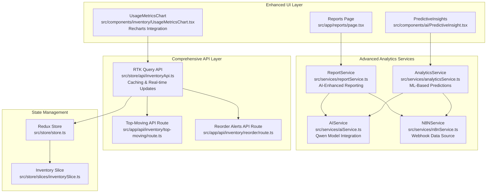
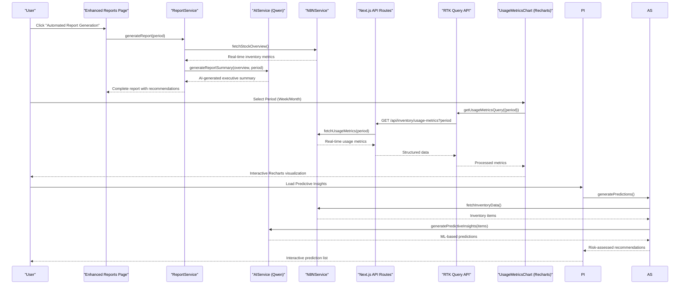
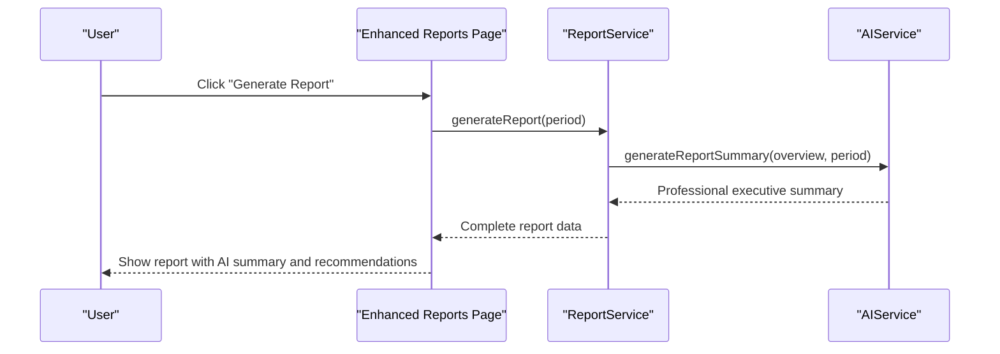
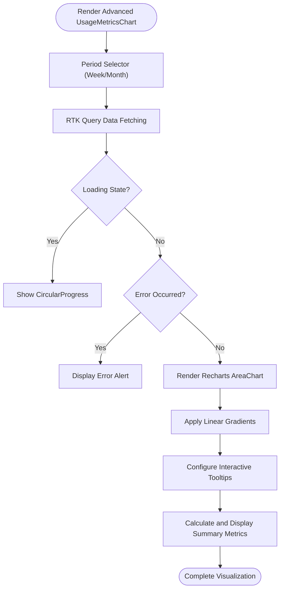
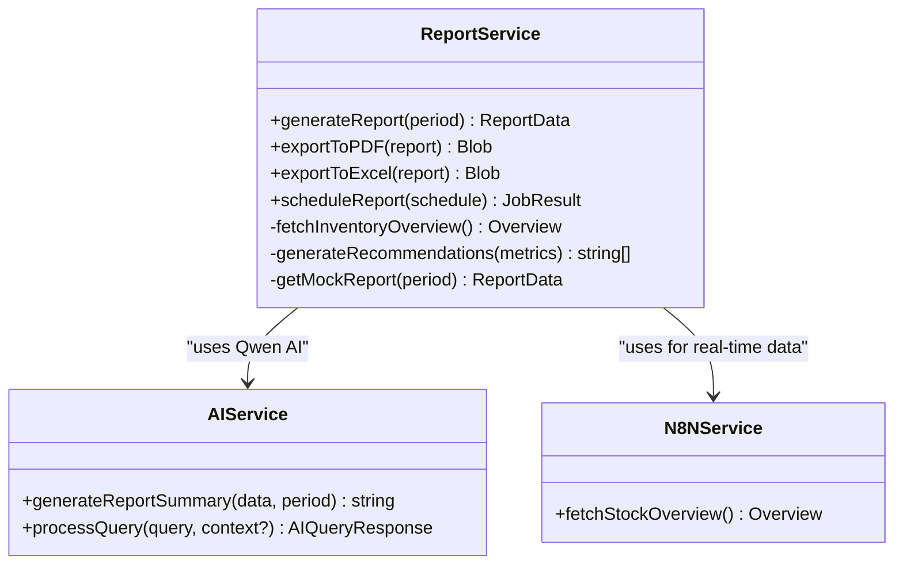
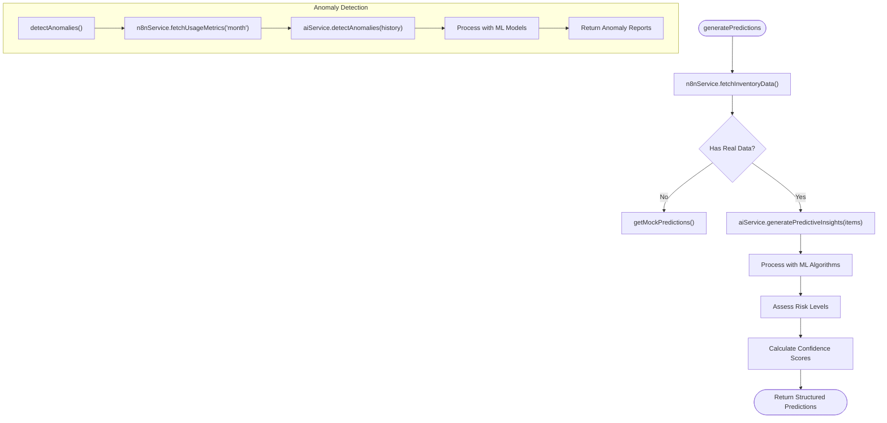
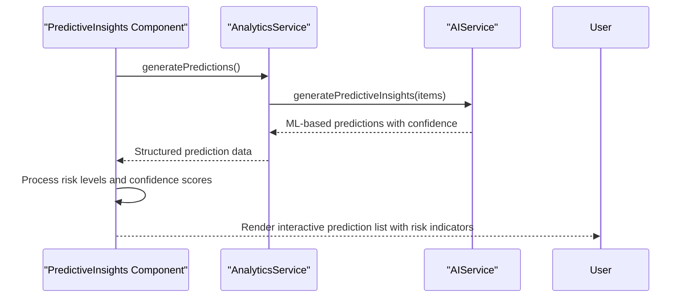
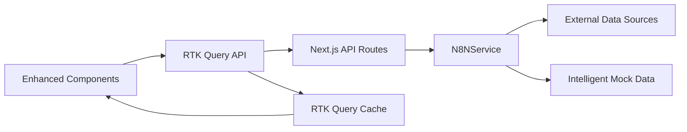
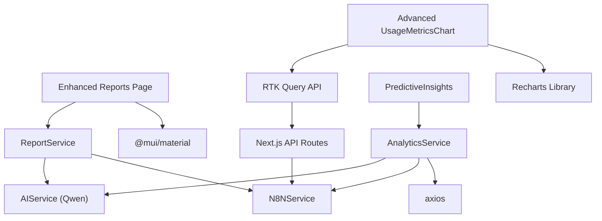

# Reports and Analytics

<cite>
**Referenced Files in This Document**
- [src/app/reports/page.tsx](file://src/app/reports/page.tsx)
- [src/components/inventory/UsageMetricsChart.tsx](file://src/components/inventory/UsageMetricsChart.tsx)
- [src/services/reportService.ts](file://src/services/reportService.ts)
- [src/services/analyticsService.ts](file://src/services/analyticsService.ts)
- [src/services/aiService.ts](file://src/services/aiService.ts)
- [src/services/n8nService.ts](file://src/services/n8nService.ts)
- [src/store/api/inventoryApi.ts](file://src/store/api/inventoryApi.ts)
- [src/components/ai/PredictiveInsight.tsx](file://src/components/ai/PredictiveInsight.tsx)
- [src/app/api/inventory/top-moving/route.ts](file://src/app/api/inventory/top-moving/route.ts)
- [src/app/api/inventory/reorder/route.ts](file://src/app/api/inventory/reorder/route.ts)
- [src/store/store.ts](file://src/store/store.ts)
- [src/store/slices/inventorySlice.ts](file://src/store/slices/inventorySlice.ts)
- [package.json](file://package.json)
</cite>

## Update Summary
**Changes Made**
- Enhanced UsageMetricsChart with comprehensive Recharts integration for advanced data visualization
- Expanded predictive analytics capabilities with machine learning-based demand forecasting
- Improved automated report generation with AI-powered executive summaries and recommendations
- Added sophisticated data visualization features including gradient fills, responsive containers, and interactive tooltips
- Strengthened AI service integration for enhanced analytical insights and anomaly detection

## Table of Contents
1. [Introduction](#introduction)
2. [Project Structure](#project-structure)
3. [Core Components](#core-components)
4. [Architecture Overview](#architecture-overview)
5. [Detailed Component Analysis](#detailed-component-analysis)
6. [Dependency Analysis](#dependency-analysis)
7. [Performance Considerations](#performance-considerations)
8. [Troubleshooting Guide](#troubleshooting-guide)
9. [Conclusion](#conclusion)
10. [Appendices](#appendices)

## Introduction
This document explains the enhanced reporting and analytics capabilities of the dashboard. The system now features comprehensive automated report generation, sophisticated predictive analytics powered by machine learning, and advanced data visualization through Recharts. Users can generate AI-enhanced inventory reports, visualize consumption patterns with interactive charts, and access intelligent insights for inventory planning and decision-making.

## Project Structure
The reporting and analytics system is built around a modern architecture featuring:
- A centralized reports page with automated report generation capabilities
- Advanced UsageMetricsChart with Recharts integration for comprehensive data visualization
- Robust services for AI-powered analytics, predictive insights, and automated reporting
- Real-time data sourcing through N8N webhooks with intelligent fallback mechanisms
- Comprehensive API layer with caching and real-time updates

**Diagram sources**
- [src/app/reports/page.tsx:14-96](file://src/app/reports/page.tsx#L14-L96)
- [src/components/inventory/UsageMetricsChart.tsx:47-160](file://src/components/inventory/UsageMetricsChart.tsx#L47-L160)
- [src/components/ai/PredictiveInsight.tsx:29-152](file://src/components/ai/PredictiveInsight.tsx#L29-L152)
- [src/services/reportService.ts:18-171](file://src/services/reportService.ts#L18-L171)
- [src/services/analyticsService.ts:13-134](file://src/services/analyticsService.ts#L13-L134)
- [src/services/aiService.ts:18-219](file://src/services/aiService.ts#L18-L219)
- [src/services/n8nService.ts:16-242](file://src/services/n8nService.ts#L16-L242)
- [src/store/api/inventoryApi.ts:23-57](file://src/store/api/inventoryApi.ts#L23-L57)
- [src/app/api/inventory/top-moving/route.ts:1-25](file://src/app/api/inventory/top-moving/route.ts#L1-L25)
- [src/app/api/inventory/reorder/route.ts:1-18](file://src/app/api/inventory/reorder/route.ts#L1-L18)
- [src/store/store.ts:1-27](file://src/store/store.ts#L1-L27)
- [src/store/slices/inventorySlice.ts:1-56](file://src/store/slices/inventorySlice.ts#L1-L56)

**Section sources**
- [src/app/reports/page.tsx:14-96](file://src/app/reports/page.tsx#L14-L96)
- [src/components/inventory/UsageMetricsChart.tsx:47-160](file://src/components/inventory/UsageMetricsChart.tsx#L47-L160)
- [src/services/reportService.ts:18-171](file://src/services/reportService.ts#L18-L171)
- [src/services/analyticsService.ts:13-134](file://src/services/analyticsService.ts#L13-L134)
- [src/services/aiService.ts:18-219](file://src/services/aiService.ts#L18-L219)
- [src/services/n8nService.ts:16-242](file://src/services/n8nService.ts#L16-L242)
- [src/store/api/inventoryApi.ts:23-57](file://src/store/api/inventoryApi.ts#L23-L57)
- [src/app/api/inventory/top-moving/route.ts:1-25](file://src/app/api/inventory/top-moving/route.ts#L1-L25)
- [src/app/api/inventory/reorder/route.ts:1-18](file://src/app/api/inventory/reorder/route.ts#L1-L18)
- [src/store/store.ts:1-27](file://src/store/store.ts#L1-L27)
- [src/store/slices/inventorySlice.ts:1-56](file://src/store/slices/inventorySlice.ts#L1-L56)

## Core Components
- **Enhanced Reports Page**: Provides automated report generation with AI-powered summaries, scheduling capabilities, and export functionality for PDF and Excel formats
- **Advanced UsageMetricsChart**: Features comprehensive Recharts integration with gradient-filled area charts, responsive design, interactive tooltips, and dual-period visualization (weekly/monthly)
- **AI-Enhanced ReportService**: Generates executive summaries, actionable recommendations, and automated report scheduling with fallback mechanisms
- **Machine Learning AnalyticsService**: Delivers predictive insights, anomaly detection, optimal reorder point calculations, and demand forecasting with confidence scoring
- **Qwen AI Integration**: Leverages advanced language models for report summarization, predictive analysis, and intelligent inventory insights
- **Real-time N8NService**: Serves as the authoritative data source with webhook integration, intelligent fallback to mock data, and polling subscriptions
- **Comprehensive API Layer**: RTK Query with caching, Next.js API routes, and real-time data synchronization
- **Intelligent PredictiveInsights**: Displays AI-powered predictions with risk assessment, confidence indicators, and actionable recommendations

**Section sources**
- [src/app/reports/page.tsx:14-96](file://src/app/reports/page.tsx#L14-L96)
- [src/components/inventory/UsageMetricsChart.tsx:47-160](file://src/components/inventory/UsageMetricsChart.tsx#L47-L160)
- [src/services/reportService.ts:18-171](file://src/services/reportService.ts#L18-L171)
- [src/services/analyticsService.ts:13-134](file://src/services/analyticsService.ts#L13-L134)
- [src/services/aiService.ts:18-219](file://src/services/aiService.ts#L18-L219)
- [src/services/n8nService.ts:16-242](file://src/services/n8nService.ts#L16-L242)
- [src/store/api/inventoryApi.ts:23-57](file://src/store/api/inventoryApi.ts#L23-L57)
- [src/components/ai/PredictiveInsight.tsx:29-152](file://src/components/ai/PredictiveInsight.tsx#L29-L152)

## Architecture Overview
The enhanced reporting and analytics pipeline integrates advanced UI components, AI-powered services, and real-time data sources:

**Diagram sources**
- [src/app/reports/page.tsx:17-29](file://src/app/reports/page.tsx#L17-L29)
- [src/services/reportService.ts:22-42](file://src/services/reportService.ts#L22-L42)
- [src/services/aiService.ts:129-149](file://src/services/aiService.ts#L129-L149)
- [src/services/n8nService.ts:203-212](file://src/services/n8nService.ts#L203-L212)
- [src/app/api/inventory/top-moving/route.ts:1-25](file://src/app/api/inventory/top-moving/route.ts#L1-L25)
- [src/store/api/inventoryApi.ts:38-42](file://src/store/api/inventoryApi.ts#L38-L42)
- [src/components/inventory/UsageMetricsChart.tsx:48-51](file://src/components/inventory/UsageMetricsChart.tsx#L48-L51)

## Detailed Component Analysis

### Enhanced Reports Page
The reports page now features comprehensive automated reporting capabilities with AI integration:

- **Automated Report Generation**: Supports daily, weekly, and monthly report generation with AI-powered executive summaries
- **Intelligent Scheduling**: Provides automated report scheduling with recipient management and format selection (PDF/Excel)
- **Export Capabilities**: Integrated export functionality for PDF and Excel formats with mock implementations ready for production
- **Real-time Feedback**: Loading states, error handling, and user feedback during report generation
- **Executive Summary Display**: Shows AI-generated summaries with key metrics and recommendations

**Diagram sources**
- [src/app/reports/page.tsx:17-29](file://src/app/reports/page.tsx#L17-L29)
- [src/services/reportService.ts:22-42](file://src/services/reportService.ts#L22-L42)

**Section sources**
- [src/app/reports/page.tsx:14-96](file://src/app/reports/page.tsx#L14-L96)
- [src/services/reportService.ts:18-171](file://src/services/reportService.ts#L18-L171)

### Advanced UsageMetricsChart with Recharts Integration
The UsageMetricsChart now features sophisticated data visualization capabilities:

- **Recharts Integration**: Comprehensive integration with Recharts for advanced charting capabilities
- **Dual-Period Visualization**: Toggle between weekly and monthly periods with dynamic data switching
- **Gradient-Filled Charts**: Professional linear gradients for consumption and forecast areas
- **Interactive Tooltips**: Detailed tooltips with consumption and forecast values for each data point
- **Responsive Design**: Fully responsive charts that adapt to different screen sizes
- **Summary Metrics**: Automatic calculation and display of average usage, peak usage, and forecast accuracy
- **Loading States**: Progress indicators during data fetching
- **Error Handling**: Graceful error display with alert components

**Diagram sources**
- [src/components/inventory/UsageMetricsChart.tsx:47-160](file://src/components/inventory/UsageMetricsChart.tsx#L47-L160)
- [src/store/api/inventoryApi.ts:38-42](file://src/store/api/inventoryApi.ts#L38-L42)

**Section sources**
- [src/components/inventory/UsageMetricsChart.tsx:47-160](file://src/components/inventory/UsageMetricsChart.tsx#L47-L160)
- [src/store/api/inventoryApi.ts:23-57](file://src/store/api/inventoryApi.ts#L23-L57)

### AI-Enhanced ReportService
The ReportService now provides comprehensive AI-powered reporting capabilities:

- **Executive Summary Generation**: AI-generated professional summaries with key insights and recommendations
- **Actionable Recommendations**: Machine learning-powered recommendations based on inventory metrics
- **Fallback Mechanisms**: Intelligent fallback to mock data when external services fail
- **Export Functionality**: Built-in support for PDF and Excel export with mock implementations
- **Report Scheduling**: Automated report generation scheduling with recipient management
- **Real-time Data Integration**: Direct integration with N8NService for current inventory data

**Diagram sources**
- [src/services/reportService.ts:18-171](file://src/services/reportService.ts#L18-L171)
- [src/services/aiService.ts:18-219](file://src/services/aiService.ts#L18-L219)
- [src/services/n8nService.ts:16-242](file://src/services/n8nService.ts#L16-L242)

**Section sources**
- [src/services/reportService.ts:18-171](file://src/services/reportService.ts#L18-L171)
- [src/services/aiService.ts:129-149](file://src/services/aiService.ts#L129-L149)
- [src/services/n8nService.ts:47-66](file://src/services/n8nService.ts#L47-L66)

### Machine Learning AnalyticsService
The AnalyticsService delivers sophisticated predictive analytics:

- **ML-Based Predictions**: Advanced machine learning algorithms for demand forecasting
- **Risk Assessment**: Confidence-based risk scoring (low/medium/high) for predictions
- **Anomaly Detection**: AI-powered identification of unusual consumption patterns
- **Optimal Reorder Points**: Calculations considering lead time, safety stock, and seasonality
- **Demand Forecasting**: Multi-period forecasting with confidence intervals and growth rates
- **Intelligent Fallbacks**: Mock predictions when AI services are unavailable

**Diagram sources**
- [src/services/analyticsService.ts:17-41](file://src/services/analyticsService.ts#L17-L41)
- [src/services/aiService.ts:79-109](file://src/services/aiService.ts#L79-L109)
- [src/services/n8nService.ts:203-205](file://src/services/n8nService.ts#L203-L205)

**Section sources**
- [src/services/analyticsService.ts:13-134](file://src/services/analyticsService.ts#L13-L134)
- [src/services/aiService.ts:79-109](file://src/services/aiService.ts#L79-L109)
- [src/services/n8nService.ts:203-205](file://src/services/n8nService.ts#L203-L205)

### Intelligent PredictiveInsights UI
The PredictiveInsights component provides comprehensive AI-powered insights:

- **Risk-Based Display**: Color-coded risk indicators (green/yellow/red) for quick assessment
- **Confidence Scoring**: Visual confidence indicators with percentage values
- **Actionable Recommendations**: Clear, prioritized recommendations with icons
- **Machine Learning Transparency**: Informational alerts explaining ML-based insights
- **Real-time Loading**: Progress indicators during AI processing
- **Structured Data Presentation**: Clean, organized display of predictive insights

**Diagram sources**
- [src/components/ai/PredictiveInsight.tsx:29-46](file://src/components/ai/PredictiveInsight.tsx#L29-L46)
- [src/services/analyticsService.ts:17-41](file://src/services/analyticsService.ts#L17-L41)
- [src/services/aiService.ts:79-109](file://src/services/aiService.ts#L79-L109)

**Section sources**
- [src/components/ai/PredictiveInsight.tsx:29-152](file://src/components/ai/PredictiveInsight.tsx#L29-L152)
- [src/services/analyticsService.ts:13-134](file://src/services/analyticsService.ts#L13-L134)

### Enhanced Data Access and APIs
The API layer now provides comprehensive real-time data access:

- **RTK Query Caching**: Intelligent caching with configurable expiration times
- **Real-time Updates**: Polling subscriptions for live data synchronization
- **Multiple Data Sources**: Integration with N8N webhooks, mock data, and external systems
- **Structured Endpoints**: Well-defined endpoints for top-moving materials, reorder alerts, usage metrics, and stock overview
- **Error Resilience**: Graceful degradation with fallback mechanisms

**Diagram sources**
- [src/store/api/inventoryApi.ts:23-57](file://src/store/api/inventoryApi.ts#L23-L57)
- [src/app/api/inventory/top-moving/route.ts:1-25](file://src/app/api/inventory/top-moving/route.ts#L1-L25)
- [src/app/api/inventory/reorder/route.ts:1-18](file://src/app/api/inventory/reorder/route.ts#L1-L18)
- [src/services/n8nService.ts:29-56](file://src/services/n8nService.ts#L29-L56)

**Section sources**
- [src/store/api/inventoryApi.ts:23-57](file://src/store/api/inventoryApi.ts#L23-L57)
- [src/app/api/inventory/top-moving/route.ts:1-25](file://src/app/api/inventory/top-moving/route.ts#L1-L25)
- [src/app/api/inventory/reorder/route.ts:1-18](file://src/app/api/inventory/reorder/route.ts#L1-L18)
- [src/services/n8nService.ts:16-242](file://src/services/n8nService.ts#L16-L242)

## Dependency Analysis
The enhanced system maintains clean separation of concerns with advanced dependencies:

- **UI Layer Dependencies**: MUI for components, Recharts for visualization, React for rendering
- **Service Layer Dependencies**: Axios for HTTP requests, Qwen AI for advanced analytics
- **Data Layer Dependencies**: RTK Query for state management, Next.js API routes for server-side processing
- **Integration Dependencies**: N8N webhooks for real-time data, mock data for resilience

**Diagram sources**
- [src/app/reports/page.tsx:10](file://src/app/reports/page.tsx#L10)
- [src/components/inventory/UsageMetricsChart.tsx:3](file://src/components/inventory/UsageMetricsChart.tsx#L3)
- [src/components/ai/PredictiveInsight.tsx:4](file://src/components/ai/PredictiveInsight.tsx#L4)
- [src/services/reportService.ts:1](file://src/services/reportService.ts#L1)
- [src/services/analyticsService.ts:1](file://src/services/analyticsService.ts#L1)
- [src/services/aiService.ts:1](file://src/services/aiService.ts#L1)
- [src/services/n8nService.ts:1](file://src/services/n8nService.ts#L1)
- [src/store/api/inventoryApi.ts:1](file://src/store/api/inventoryApi.ts#L1)
- [src/app/api/inventory/top-moving/route.ts:2](file://src/app/api/inventory/top-moving/route.ts#L2)
- [src/app/api/inventory/reorder/route.ts:2](file://src/app/api/inventory/reorder/route.ts#L2)
- [package.json:11-26](file://package.json#L11-L26)

**Section sources**
- [package.json:11-26](file://package.json#L11-L26)
- [src/services/reportService.ts:1](file://src/services/reportService.ts#L1)
- [src/services/analyticsService.ts:1](file://src/services/analyticsService.ts#L1)
- [src/services/aiService.ts:1](file://src/services/aiService.ts#L1)
- [src/services/n8nService.ts:1](file://src/services/n8nService.ts#L1)
- [src/store/api/inventoryApi.ts:1](file://src/store/api/inventoryApi.ts#L1)
- [src/app/api/inventory/top-moving/route.ts:2](file://src/app/api/inventory/top-moving/route.ts#L2)
- [src/app/api/inventory/reorder/route.ts:2](file://src/app/api/inventory/reorder/route.ts#L2)

## Performance Considerations
The enhanced system incorporates several performance optimizations:

- **Intelligent Caching**: RTK Query with configurable cache expiration (3-5 minute windows)
- **Real-time Polling**: Optimized polling intervals (30 seconds) for live data updates
- **Graceful Degradation**: Mock data fallback ensures system resilience during failures
- **Efficient Data Fetching**: Structured API endpoints minimize unnecessary data transfer
- **Client-side Processing**: Recharts optimization for smooth rendering of complex visualizations
- **Export Optimization**: Mock implementations allow for testing without external dependencies

## Troubleshooting Guide
Enhanced troubleshooting procedures for the advanced reporting system:

- **Reports Page Issues**:
  - Verify AI model endpoint configuration (AI_MODEL_ENDPOINT, AI_API_KEY)
  - Check N8N webhook connectivity and authentication
  - Monitor console for AI service integration errors
  - Validate report scheduling configurations

- **Advanced UsageMetricsChart Problems**:
  - Ensure Recharts library is properly installed and accessible
  - Verify RTK Query endpoint configuration and data structure
  - Check responsive container sizing and viewport constraints
  - Monitor gradient rendering and tooltip configuration

- **AnalyticsService Failures**:
  - Validate AI model availability and response formats
  - Check anomaly detection input data structure requirements
  - Monitor ML algorithm processing times
  - Verify confidence scoring and risk assessment logic

- **PredictiveInsights Component Issues**:
  - Ensure proper risk level mapping and color coding
  - Verify confidence score calculation and display
  - Check recommendation parsing and formatting
  - Monitor loading state transitions and error handling

- **Data Access and API Problems**:
  - Verify N8N webhook URL and API key configuration
  - Check RTK Query cache invalidation and refresh policies
  - Monitor polling intervals and connection stability
  - Validate mock data fallback mechanisms

**Section sources**
- [src/services/reportService.ts:38-42](file://src/services/reportService.ts#L38-L42)
- [src/components/inventory/UsageMetricsChart.tsx:53-63](file://src/components/inventory/UsageMetricsChart.tsx#L53-L63)
- [src/services/analyticsService.ts:37-41](file://src/services/analyticsService.ts#L37-L41)
- [src/services/aiService.ts:70-74](file://src/services/aiService.ts#L70-L74)
- [src/services/n8nService.ts:42-56](file://src/services/n8nService.ts#L42-L56)

## Conclusion
The enhanced reporting and analytics system represents a significant advancement in inventory management capabilities. With automated report generation, sophisticated predictive analytics, and comprehensive data visualization through Recharts, the system provides executives and inventory managers with powerful tools for informed decision-making. The integration of AI-powered insights, real-time data processing, and intuitive visualizations creates a comprehensive solution for modern inventory management challenges.

## Appendices

### Practical Examples
- **Creating AI-Enhanced Reports**:
  - Use the enhanced Reports Page to generate automated reports with AI summaries
  - Schedule recurring reports with recipient notifications and format preferences
  - Export reports to PDF or Excel for stakeholder distribution
  - Reference: [src/app/reports/page.tsx:17-29](file://src/app/reports/page.tsx#L17-L29), [src/services/reportService.ts:22-42](file://src/services/reportService.ts#L22-L42)

- **Interpreting Advanced Usage Metrics**:
  - Switch between weekly and monthly views in the enhanced UsageMetricsChart
  - Analyze consumption vs. forecast patterns with interactive tooltips
  - Review summary metrics including average usage and forecast accuracy
  - Reference: [src/components/inventory/UsageMetricsChart.tsx:48-51](file://src/components/inventory/UsageMetricsChart.tsx#L48-L51)

- **Leveraging ML-Powered Predictions**:
  - Access PredictiveInsights for demand forecasts with confidence levels
  - Evaluate risk assessments and recommended actions
  - Monitor anomaly detection for unusual consumption patterns
  - Reference: [src/components/ai/PredictiveInsight.tsx:29-46](file://src/components/ai/PredictiveInsight.tsx#L29-L46), [src/services/analyticsService.ts:78-93](file://src/services/analyticsService.ts#L78-L93)

### Enhanced Report Generation Workflow
- **AI-Enhanced Process**:
  - Select report period on the enhanced Reports Page
  - Generate AI-powered executive summaries with key insights
  - Create actionable recommendations based on inventory metrics
  - Schedule automated delivery with recipient management
  - Export to preferred formats for stakeholder distribution

- **References**:
  - [src/app/reports/page.tsx:17-29](file://src/app/reports/page.tsx#L17-L29)
  - [src/services/reportService.ts:22-42](file://src/services/reportService.ts#L22-L42)
  - [src/services/reportService.ts:136-153](file://src/services/reportService.ts#L136-L153)
  - [src/services/reportService.ts:158-167](file://src/services/reportService.ts#L158-L167)

### Advanced Chart Customization Options
- **Recharts Integration**:
  - Linear gradient fills for professional appearance
  - Interactive tooltips with detailed consumption data
  - Responsive container with automatic sizing
  - Cartesian grid for enhanced readability
  - Customizable period selectors (Weekly/Monthly)

- **Visual Enhancement Features**:
  - Dual-axis visualization for consumption and forecast comparison
  - Animated transitions for smooth data updates
  - Customizable color schemes and styling
  - Legend positioning and formatting options
  - Axis labeling and tick customization

- **References**:
  - [src/components/inventory/UsageMetricsChart.tsx:73-84](file://src/components/inventory/UsageMetricsChart.tsx#L73-L84)
  - [src/components/inventory/UsageMetricsChart.tsx:109-126](file://src/components/inventory/UsageMetricsChart.tsx#L109-L126)
  - [src/components/inventory/UsageMetricsChart.tsx:130-155](file://src/components/inventory/UsageMetricsChart.tsx#L130-L155)

### Enhanced Export Functionality
- **Multi-Format Support**:
  - PDF export with professional formatting and branding
  - Excel export with structured data tables and charts
  - Automated report scheduling with delivery options
  - Recipient management for stakeholder distribution

- **Production Integration**:
  - Ready-to-use implementations with mock data fallback
  - Configurable export templates and formatting options
  - Batch processing capabilities for multiple reports
  - Audit trail and logging for compliance requirements

- **References**:
  - [src/services/reportService.ts:136-153](file://src/services/reportService.ts#L136-L153)
  - [src/services/reportService.ts:158-167](file://src/services/reportService.ts#L158-L167)

### Advanced Data Filtering Options
- **Enhanced Usage Metrics**:
  - Dynamic period selection (Daily/Weekly/Monthly)
  - Interactive chart filtering and zoom capabilities
  - Customizable time ranges and aggregation levels
  - Real-time data updates with polling intervals

- **Advanced API Filtering**:
  - Parameterized endpoints for flexible data retrieval
  - Pagination support for large datasets
  - Sorting and ordering options for results
  - Category and status-based filtering

- **References**:
  - [src/components/inventory/UsageMetricsChart.tsx:48-51](file://src/components/inventory/UsageMetricsChart.tsx#L48-L51)
  - [src/app/api/inventory/top-moving/route.ts:6-7](file://src/app/api/inventory/top-moving/route.ts#L6-L7)
  - [src/app/api/inventory/reorder/route.ts:4-9](file://src/app/api/inventory/reorder/route.ts#L4-L9)

### Advanced Integration with External Systems
- **N8N Webhook Integration**:
  - Real-time data synchronization with external ERP systems
  - Intelligent fallback to mock data for system resilience
  - Configurable polling intervals for optimal performance
  - Authentication and security integration

- **AI Service Integration**:
  - Qwen model integration for advanced analytics
  - Custom prompt engineering for specific use cases
  - Confidence scoring and risk assessment
  - Multi-modal AI responses and recommendations

- **References**:
  - [src/services/n8nService.ts:16-242](file://src/services/n8nService.ts#L16-L242)
  - [src/services/aiService.ts:18-219](file://src/services/aiService.ts#L18-L219)

### Advanced Analytics Algorithms and Performance Metrics
- **Machine Learning Predictions**:
  - Time series forecasting with confidence intervals
  - Seasonal trend analysis and decomposition
  - Anomaly detection using statistical methods
  - Predictive accuracy scoring and validation

- **Optimization Algorithms**:
  - Reorder point optimization with safety stock considerations
  - Inventory allocation and distribution planning
  - Capacity utilization and throughput optimization
  - Cost minimization with service level constraints

- **Performance Monitoring**:
  - Real-time system performance metrics
  - AI model accuracy and reliability tracking
  - Data freshness and latency monitoring
  - User engagement and adoption metrics

- **References**:
  - [src/services/analyticsService.ts:78-93](file://src/services/analyticsService.ts#L78-L93)
  - [src/services/analyticsService.ts:98-106](file://src/services/analyticsService.ts#L98-L106)
  - [src/services/analyticsService.ts:111-130](file://src/services/analyticsService.ts#L111-L130)

### Executive Decision-Making Support
- **AI-Enhanced Executive Summaries**:
  - Concise, actionable insights with supporting data
  - Risk assessment and mitigation recommendations
  - Trend analysis and future outlook projections
  - Comparative analysis with benchmarks and targets

- **Advanced Visualization Dashboard**:
  - Interactive dashboards with drill-down capabilities
  - Real-time alerts and exception reporting
  - Scenario modeling and what-if analysis
  - Strategic planning and capacity management tools

- **Stakeholder Communication**:
  - Automated report distribution with customizable templates
  - Executive scorecards with KPI tracking
  - Historical trend analysis and performance comparisons
  - Predictive scenario planning and risk assessment

- **References**:
  - [src/services/aiService.ts:129-149](file://src/services/aiService.ts#L129-L149)
  - [src/components/ai/PredictiveInsight.tsx:142-147](file://src/components/ai/PredictiveInsight.tsx#L142-L147)
  - [src/components/inventory/UsageMetricsChart.tsx:130-155](file://src/components/inventory/UsageMetricsChart.tsx#L130-L155)