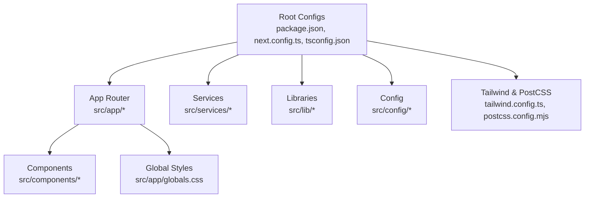
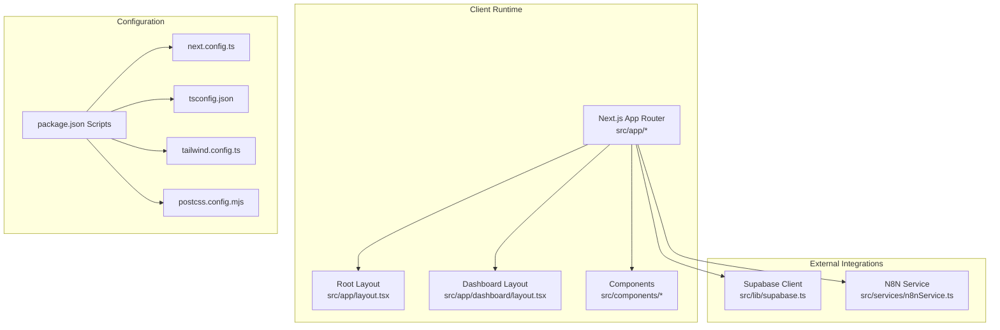
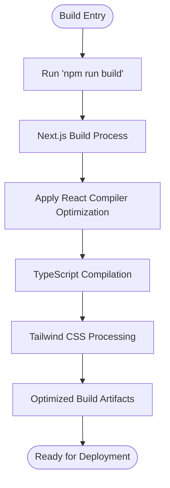
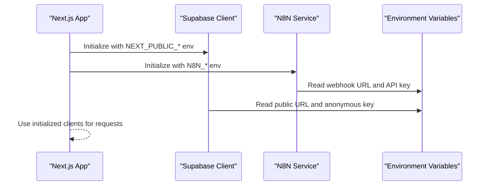
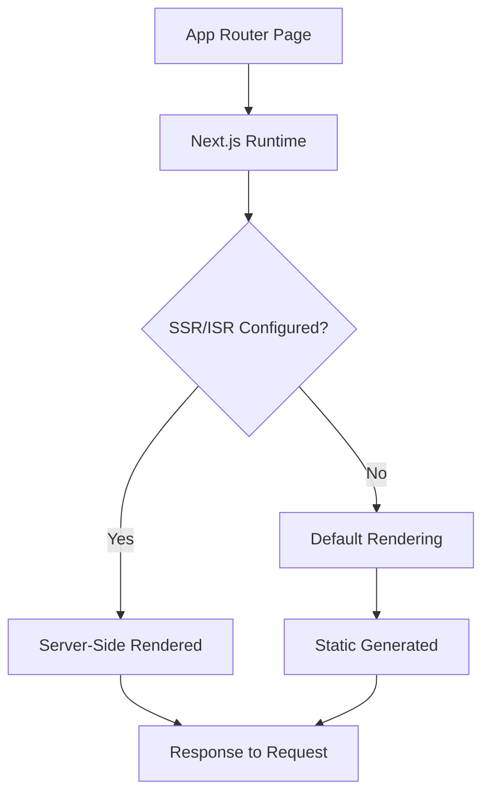
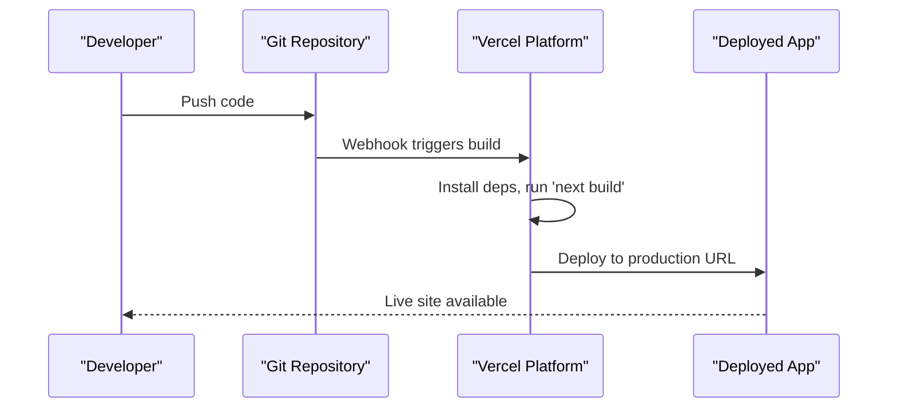
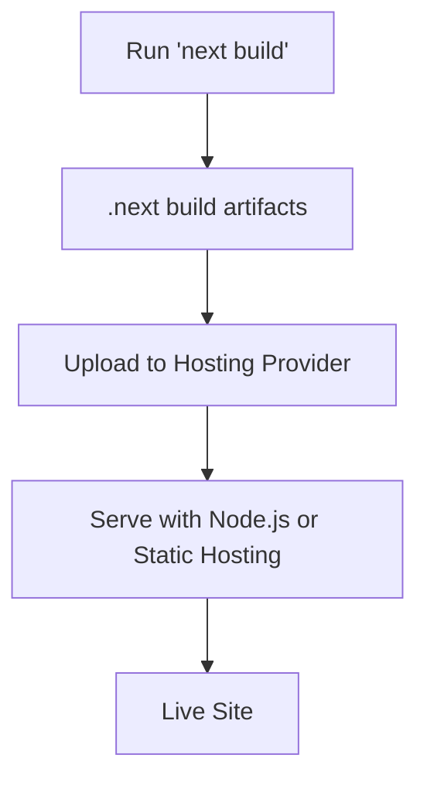
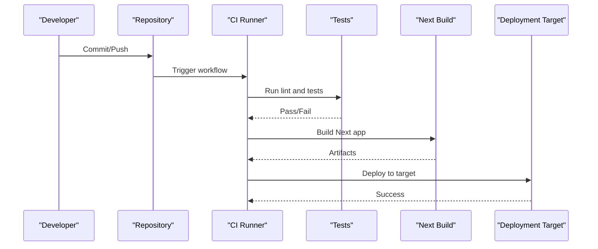
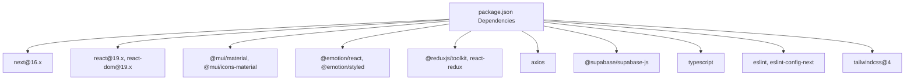

# Deployment and DevOps

<cite>
**Referenced Files in This Document**
- [package.json](file://package.json)
- [next.config.ts](file://next.config.ts)
- [tsconfig.json](file://tsconfig.json)
- [tailwind.config.ts](file://tailwind.config.ts)
- [postcss.config.mjs](file://postcss.config.mjs)
- [README.md](file://README.md)
- [src/lib/supabase.ts](file://src/lib/supabase.ts)
- [src/services/n8nService.ts](file://src/services/n8nService.ts)
- [src/config/site.config.ts](file://src/config/site.config.ts)
- [src/app/layout.tsx](file://src/app/layout.tsx)
- [src/app/dashboard/layout.tsx](file://src/app/dashboard/layout.tsx)
</cite>

## Table of Contents
1. [Introduction](#introduction)
2. [Project Structure](#project-structure)
3. [Core Components](#core-components)
4. [Architecture Overview](#architecture-overview)
5. [Detailed Component Analysis](#detailed-component-analysis)
6. [Dependency Analysis](#dependency-analysis)
7. [Performance Considerations](#performance-considerations)
8. [Troubleshooting Guide](#troubleshooting-guide)
9. [Conclusion](#conclusion)
10. [Appendices](#appendices)

## Introduction
This document provides comprehensive deployment and DevOps guidance for the dashboard-ai project. It covers the Next.js build process, optimization settings, bundle analysis techniques, deployment options (including Vercel and manual hosting), CI/CD setup, environment configuration, security hardening, performance optimization, build configuration, static generation capabilities, server-side rendering setup, practical deployment workflows, environment variable management, monitoring setup, common deployment issues, rollback procedures, scaling considerations, automated deployment setup, testing deployment pipelines, and production maintenance.

## Project Structure
The project follows a Next.js App Router structure with a clear separation of concerns:
- Application pages under src/app
- Shared components under src/components
- Services and integrations under src/services
- Global styles and fonts under src/app
- Configuration for Supabase, Tailwind CSS, and Next.js under src/lib, src/config, and root configs

**Diagram sources**
- [package.json:1-39](file://package.json#L1-L39)
- [next.config.ts:1-9](file://next.config.ts#L1-L9)
- [tsconfig.json:1-35](file://tsconfig.json#L1-L35)
- [tailwind.config.ts:1-46](file://tailwind.config.ts#L1-L46)
- [postcss.config.mjs:1-8](file://postcss.config.mjs#L1-L8)

**Section sources**
- [package.json:1-39](file://package.json#L1-L39)
- [next.config.ts:1-9](file://next.config.ts#L1-L9)
- [tsconfig.json:1-35](file://tsconfig.json#L1-L35)
- [tailwind.config.ts:1-46](file://tailwind.config.ts#L1-L46)
- [postcss.config.mjs:1-8](file://postcss.config.mjs#L1-L8)

## Core Components
- Build and runtime scripts are defined in the package.json scripts section, enabling local development, building, and starting the Next.js application.
- Next.js configuration enables React Compiler optimization.
- TypeScript configuration enforces strict typing and module resolution suitable for Next.js App Router.
- Tailwind CSS and PostCSS are configured for styling and font loading.
- Supabase client initialization is environment-driven for public URLs and anonymous keys.
- N8N service integrates with external inventory data via webhooks and API keys.
- Site configuration centralizes navigation, feature flags, caching TTLs, and n8n integration settings.

**Section sources**
- [package.json:5-10](file://package.json#L5-L10)
- [next.config.ts:3-6](file://next.config.ts#L3-L6)
- [tsconfig.json:2-24](file://tsconfig.json#L2-L24)
- [tailwind.config.ts:3-43](file://tailwind.config.ts#L3-L43)
- [postcss.config.mjs:1-7](file://postcss.config.mjs#L1-L7)
- [src/lib/supabase.ts:1-6](file://src/lib/supabase.ts#L1-L6)
- [src/services/n8nService.ts:16-23](file://src/services/n8nService.ts#L16-L23)
- [src/config/site.config.ts:1-34](file://src/config/site.config.ts#L1-L34)

## Architecture Overview
The application architecture centers around Next.js App Router, integrating with Supabase for user management and credential storage, and consuming inventory data from n8n webhooks. The dashboard layout composes UI components and Redux state for navigation and responsive behavior.

**Diagram sources**
- [src/app/layout.tsx:1-31](file://src/app/layout.tsx#L1-L31)
- [src/app/dashboard/layout.tsx:1-42](file://src/app/dashboard/layout.tsx#L1-L42)
- [src/lib/supabase.ts:1-6](file://src/lib/supabase.ts#L1-L6)
- [src/services/n8nService.ts:16-23](file://src/services/n8nService.ts#L16-L23)
- [package.json:5-10](file://package.json#L5-L10)
- [next.config.ts:3-6](file://next.config.ts#L3-L6)
- [tsconfig.json:2-24](file://tsconfig.json#L2-L24)
- [tailwind.config.ts:3-43](file://tailwind.config.ts#L3-L43)
- [postcss.config.mjs:1-7](file://postcss.config.mjs#L1-L7)

## Detailed Component Analysis

### Next.js Build and Optimization Settings
- React Compiler is enabled in next.config.ts to improve runtime performance.
- Strict TypeScript configuration ensures type safety and efficient builds.
- Tailwind CSS and PostCSS are configured for optimized styling and font loading.

**Diagram sources**
- [package.json:7](file://package.json#L7)
- [next.config.ts:5](file://next.config.ts#L5)
- [tsconfig.json:7-14](file://tsconfig.json#L7-L14)
- [tailwind.config.ts:4-8](file://tailwind.config.ts#L4-L8)
- [postcss.config.mjs:2-4](file://postcss.config.mjs#L2-L4)

**Section sources**
- [next.config.ts:3-6](file://next.config.ts#L3-L6)
- [tsconfig.json:7-14](file://tsconfig.json#L7-L14)
- [tailwind.config.ts:4-8](file://tailwind.config.ts#L4-L8)
- [postcss.config.mjs:2-4](file://postcss.config.mjs#L2-L4)

### Environment Configuration and Secrets Management
- Supabase client reads NEXT_PUBLIC_SUPABASE_URL and NEXT_PUBLIC_SUPABASE_ANON_KEY from environment variables.
- N8N service reads N8N_WEBHOOK_URL and N8N_API_KEY from environment variables.
- Site configuration defines cache TTLs and n8n polling intervals.

**Diagram sources**
- [src/lib/supabase.ts:3-4](file://src/lib/supabase.ts#L3-L4)
- [src/services/n8nService.ts:20-23](file://src/services/n8nService.ts#L20-L23)
- [src/config/site.config.ts:28-32](file://src/config/site.config.ts#L28-L32)

**Section sources**
- [src/lib/supabase.ts:3-4](file://src/lib/supabase.ts#L3-L4)
- [src/services/n8nService.ts:20-23](file://src/services/n8nService.ts#L20-L23)
- [src/config/site.config.ts:28-32](file://src/config/site.config.ts#L28-L32)

### Static Generation and Server-Side Rendering Setup
- The project uses Next.js App Router. Pages under src/app are rendered by Next.js runtime.
- No explicit static generation or SSR configuration is present in the provided files; defaults apply.

**Diagram sources**
- [src/app/layout.tsx:16-30](file://src/app/layout.tsx#L16-L30)

**Section sources**
- [src/app/layout.tsx:16-30](file://src/app/layout.tsx#L16-L30)

### Bundle Analysis Techniques
- Use Next.js bundle analyzer plugin to inspect bundle composition.
- Analyze vendor chunks, page bundles, and shared dependencies.
- Optimize by code splitting, dynamic imports, and removing unused dependencies.

[No sources needed since this section provides general guidance]

### Deployment Options

#### Vercel Platform Deployment
- The project README indicates Vercel as an easy deployment option for Next.js apps.
- Configure environment variables in Vercel project settings for Supabase and N8N.

**Diagram sources**
- [README.md:32-36](file://README.md#L32-L36)

**Section sources**
- [README.md:32-36](file://README.md#L32-L36)

#### Manual Deployment to Hosting Providers
- Build artifacts are produced by the Next.js build process.
- Serve the .next/static directory and runtime using your hosting provider’s static hosting or Node.js runtime.
- Ensure environment variables are configured per provider.

**Diagram sources**
- [package.json:7](file://package.json#L7)

**Section sources**
- [package.json:7](file://package.json#L7)

#### CI/CD Pipeline Setup
- Trigger builds on push to main branch.
- Run linting and tests before building.
- Publish to Vercel or another hoster after successful build.
- Store secrets in CI/CD provider vaults and map to environment variables.

**Diagram sources**
- [package.json:9](file://package.json#L9)
- [package.json:7](file://package.json#L7)

**Section sources**
- [package.json:9](file://package.json#L9)
- [package.json:7](file://package.json#L7)

### Security Hardening Measures
- Keep Supabase anonymous keys and N8N API keys in environment variables; never commit secrets to the repository.
- Restrict webhook URLs and API keys to least privilege.
- Enforce HTTPS and secure cookies in production.
- Regularly rotate secrets and monitor access logs.

**Section sources**
- [src/lib/supabase.ts:3-4](file://src/lib/supabase.ts#L3-L4)
- [src/services/n8nService.ts:20-23](file://src/services/n8nService.ts#L20-L23)

### Performance Optimization Strategies
- Enable React Compiler for improved runtime performance.
- Use Tailwind CSS for efficient styling and avoid unused styles.
- Minimize third-party dependencies and lazy-load heavy components.
- Leverage Next.js automatic optimizations (image optimization, font optimization).

**Section sources**
- [next.config.ts:5](file://next.config.ts#L5)
- [tailwind.config.ts:9-42](file://tailwind.config.ts#L9-L42)

### Monitoring Setup
- Integrate application performance monitoring (APM) and error tracking.
- Monitor build times and deployment health.
- Track user sessions via Supabase and webhook latency via N8N service.

[No sources needed since this section provides general guidance]

## Dependency Analysis
The project depends on Next.js, React, Material UI, Emotion, Redux Toolkit, Axios, and Supabase. Development dependencies include Tailwind CSS v4, TypeScript, ESLint, and related tooling.

**Diagram sources**
- [package.json:11-37](file://package.json#L11-L37)

**Section sources**
- [package.json:11-37](file://package.json#L11-L37)

## Performance Considerations
- Use React Compiler to reduce runtime overhead.
- Keep TypeScript strict mode enabled for faster builds and fewer runtime errors.
- Optimize Tailwind content paths to avoid scanning unnecessary files.
- Monitor bundle sizes and remove unused dependencies.

**Section sources**
- [next.config.ts:5](file://next.config.ts#L5)
- [tsconfig.json:7](file://tsconfig.json#L7)
- [tailwind.config.ts:4-8](file://tailwind.config.ts#L4-L8)

## Troubleshooting Guide
- Build failures: Verify environment variables are set locally and in CI. Confirm Node.js and npm versions match project requirements.
- Runtime errors: Check Supabase URL and anonymous key; ensure N8N webhook URL and API key are correct.
- Styling issues: Validate Tailwind content globs and PostCSS plugin configuration.
- Performance regressions: Re-run bundle analysis and review recent dependency changes.

**Section sources**
- [src/lib/supabase.ts:3-4](file://src/lib/supabase.ts#L3-L4)
- [src/services/n8nService.ts:20-23](file://src/services/n8nService.ts#L20-L23)
- [tailwind.config.ts:4-8](file://tailwind.config.ts#L4-L8)
- [postcss.config.mjs:2-4](file://postcss.config.mjs#L2-L4)

## Conclusion
The dashboard-ai project is structured for efficient deployment using Next.js App Router, with clear separation of concerns and environment-driven configuration. By leveraging React Compiler, Tailwind CSS, and robust environment variable management, teams can achieve reliable deployments to Vercel or other hosting providers. Implementing CI/CD pipelines, security hardening, and monitoring ensures a maintainable and scalable production environment.

## Appendices

### Practical Deployment Workflows
- Local build and preview: Use the build script to produce artifacts and test locally before deploying.
- Vercel deployment: Connect repository, configure environment variables, and deploy from the main branch.
- Manual deployment: Build artifacts and upload to your hosting provider; ensure environment variables are configured.

**Section sources**
- [package.json:7](file://package.json#L7)
- [README.md:32-36](file://README.md#L32-L36)

### Environment Variable Management
- Required variables:
  - NEXT_PUBLIC_SUPABASE_URL
  - NEXT_PUBLIC_SUPABASE_ANON_KEY
  - N8N_WEBHOOK_URL
  - N8N_API_KEY

**Section sources**
- [src/lib/supabase.ts:3-4](file://src/lib/supabase.ts#L3-L4)
- [src/services/n8nService.ts:20-23](file://src/services/n8nService.ts#L20-L23)

### Rollback Procedures
- Maintain multiple deployment slots or tags.
- Re-deploy previous known-good commit or tag.
- Revert configuration changes if necessary.

[No sources needed since this section provides general guidance]

### Scaling Considerations
- Horizontal scaling: Use a CDN and load balancer in front of Next.js serverless or Node.js runtime.
- Database scaling: Scale Supabase and external data sources independently.
- Caching: Use TTLs defined in site configuration to balance freshness and performance.

**Section sources**
- [src/config/site.config.ts:22-26](file://src/config/site.config.ts#L22-L26)

### Testing Deployment Pipelines
- Add a CI job to run the build script and serve the built app in a staging environment.
- Validate environment variables are injected correctly.
- Perform smoke tests against deployed endpoints.

**Section sources**
- [package.json:7](file://package.json#L7)