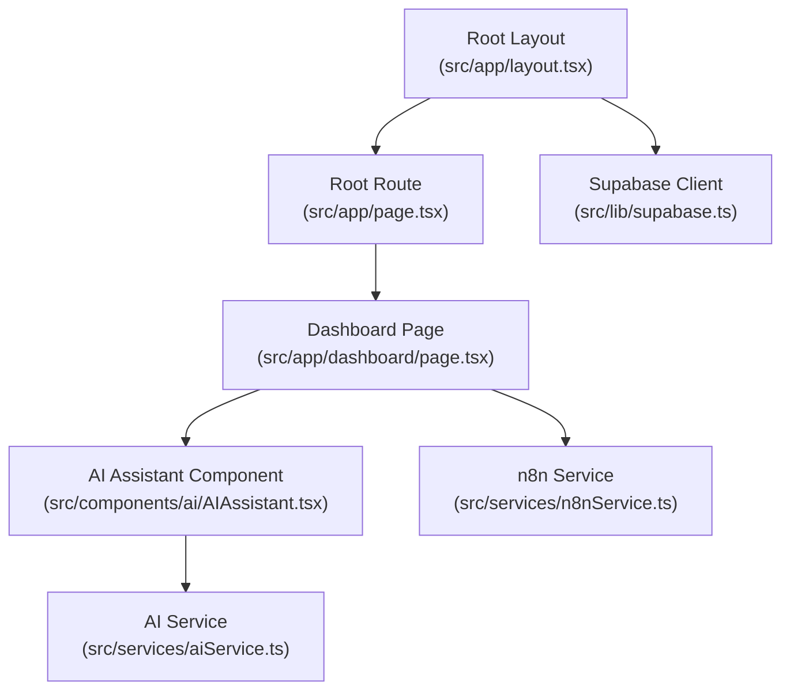

# Getting Started

<cite>
**Referenced Files in This Document**
- [README.md](file://README.md)
- [package.json](file://package.json)
- [next.config.ts](file://next.config.ts)
- [tsconfig.json](file://tsconfig.json)
- [tailwind.config.ts](file://tailwind.config.ts)
- [src/app/layout.tsx](file://src/app/layout.tsx)
- [src/app/page.tsx](file://src/app/page.tsx)
- [src/config/site.config.ts](file://src/config/site.config.ts)
- [src/lib/supabase.ts](file://src/lib/supabase.ts)
- [src/services/aiService.ts](file://src/services/aiService.ts)
- [src/services/n8nService.ts](file://src/services/n8nService.ts)
- [src/app/dashboard/page.tsx](file://src/app/dashboard/page.tsx)
- [src/components/ai/AIAssistant.tsx](file://src/components/ai/AIAssistant.tsx)
- [src/store/store.ts](file://src/store/store.ts)
- [src/hooks/useRedux.ts](file://src/hooks/useRedux.ts)
</cite>

## Table of Contents
1. [Introduction](#introduction)
2. [Prerequisites](#prerequisites)
3. [Installation](#installation)
4. [Environment Variables](#environment-variables)
5. [Run the Development Server](#run-the-development-server)
6. [Initial Project Structure](#initial-project-structure)
7. [Basic Usage](#basic-usage)
8. [Windows vs Unix-like Systems](#windows-vs-unix-like-systems)
9. [Troubleshooting](#troubleshooting)
10. [Conclusion](#conclusion)

## Introduction
This guide helps you quickly set up and run the dashboard-ai project locally. It covers prerequisites, installation, environment configuration, running the development server, and navigating the dashboard. It also explains how inventory data flows into the system via n8n webhooks and how the AI assistant interacts with an external AI model.

## Prerequisites
- Operating systems: Windows and Unix-like systems (Linux/macOS) are supported.
- Node.js: The project specifies Next.js 16.1.6 and TypeScript 5. Ensure your Node.js version is compatible with these dependencies. Use a modern LTS version of Node.js (e.g., 18.x or 20.x) to avoid compatibility issues.
- Package managers: The project supports npm, yarn, pnpm, and bun. Choose whichever you prefer; the scripts are identical across all managers.
- Git: Required to clone the repository.
- Network access: The development server requires outbound HTTP(S) access to fetch data from n8n webhooks and to communicate with the AI model endpoint.

**Section sources**
- [package.json:11-26](file://package.json#L11-L26)
- [package.json:27-37](file://package.json#L27-L37)
- [next.config.ts:1-9](file://next.config.ts#L1-L9)
- [tsconfig.json:1-35](file://tsconfig.json#L1-L35)

## Installation
Follow these steps to install and prepare the project:

1. Clone the repository
   - Use your preferred Git client or command-line tool to clone the repository to your local machine.

2. Install dependencies
   - Open a terminal in the project root.
   - Run your chosen package manager’s install command:
     - npm: npm install
     - yarn: yarn install
     - pnpm: pnpm install
     - bun: bun install

3. Verify TypeScript configuration
   - The project uses TypeScript 5 with strict settings and bundler module resolution. No manual setup is required beyond installing dependencies.

4. Verify Tailwind CSS configuration
   - Tailwind is configured to scan components, pages, and app directories. No additional setup is required beyond installing dependencies.

**Section sources**
- [package.json:5-10](file://package.json#L5-L10)
- [tsconfig.json:16-24](file://tsconfig.json#L16-L24)
- [tailwind.config.ts:3-8](file://tailwind.config.ts#L3-L8)

## Environment Variables
Configure the following environment variables before running the app. These are required for n8n webhooks, Supabase authentication, and the AI model integration.

- n8n webhooks
  - N8N_WEBHOOK_URL: Base URL of the n8n webhook endpoint.
  - N8N_API_KEY: API key used to authorize requests to the n8n webhook.

- Supabase authentication
  - NEXT_PUBLIC_SUPABASE_URL: Public Supabase project URL.
  - NEXT_PUBLIC_SUPABASE_ANON_KEY: Public Supabase anonymous API key.

- AI model integration
  - AI_MODEL_ENDPOINT: Endpoint of the AI model provider chat completions API.
  - AI_API_KEY: API key for the AI model provider.
  - AI_MODEL_NAME: Model identifier (defaults to a specific model if not set).

Notes:
- The site configuration defines defaults for n8n polling intervals and caching TTLs. These are not environment variables but part of the application configuration.
- The Supabase client is initialized with NEXT_PUBLIC_* variables. Ensure these are present during development.

**Section sources**
- [src/config/site.config.ts:28-32](file://src/config/site.config.ts#L28-L32)
- [src/lib/supabase.ts:3-6](file://src/lib/supabase.ts#L3-L6)
- [src/services/aiService.ts:24-26](file://src/services/aiService.ts#L24-L26)
- [src/services/n8nService.ts:20-23](file://src/services/n8nService.ts#L20-L23)

## Run the Development Server
Start the Next.js development server:

- From the project root, run:
  - npm run dev
  - yarn dev
  - pnpm dev
  - bun dev

- Open your browser to http://localhost:3000 to view the dashboard.

- The root route redirects to the dashboard page. The layout applies global fonts and theme provider.

**Section sources**
- [README.md:5-17](file://README.md#L5-L17)
- [src/app/page.tsx:1-6](file://src/app/page.tsx#L1-L6)
- [src/app/layout.tsx:16-30](file://src/app/layout.tsx#L16-L30)

## Initial Project Structure
The project follows a Next.js App Router structure. Key areas relevant to getting started:

- Application shell and routing
  - Root layout sets up fonts and theme provider.
  - Root route redirects to the dashboard.

- Dashboard page
  - Fetches and displays top-moving materials, reorder alerts, and stock overview widgets.
  - Integrates the AI assistant component.

- Services
  - n8nService: Fetches inventory data from n8n webhooks and polls periodically.
  - aiService: Sends queries to an external AI model and returns responses.

- Authentication and storage
  - Supabase client is initialized for user authentication and storing user preferences.

**Diagram sources**
- [src/app/layout.tsx:16-30](file://src/app/layout.tsx#L16-L30)
- [src/app/page.tsx:1-6](file://src/app/page.tsx#L1-L6)
- [src/app/dashboard/page.tsx:1-128](file://src/app/dashboard/page.tsx#L1-L128)
- [src/components/ai/AIAssistant.tsx:1-120](file://src/components/ai/AIAssistant.tsx#L1-L120)
- [src/services/n8nService.ts:16-109](file://src/services/n8nService.ts#L16-L109)
- [src/services/aiService.ts:18-219](file://src/services/aiService.ts#L18-L219)
- [src/lib/supabase.ts:1-21](file://src/lib/supabase.ts#L1-L21)

**Section sources**
- [src/app/layout.tsx:16-30](file://src/app/layout.tsx#L16-L30)
- [src/app/page.tsx:1-6](file://src/app/page.tsx#L1-L6)
- [src/app/dashboard/page.tsx:1-128](file://src/app/dashboard/page.tsx#L1-L128)
- [src/components/ai/AIAssistant.tsx:1-120](file://src/components/ai/AIAssistant.tsx#L1-L120)
- [src/services/n8nService.ts:16-109](file://src/services/n8nService.ts#L16-L109)
- [src/services/aiService.ts:18-219](file://src/services/aiService.ts#L18-L219)
- [src/lib/supabase.ts:1-21](file://src/lib/supabase.ts#L1-L21)

## Basic Usage
After starting the development server and configuring environment variables:

- Access the dashboard at http://localhost:3000
- The dashboard shows:
  - Stock overview widgets (total materials, low stock items, pending orders, turnover rate)
  - Top 10 fast-moving raw materials
  - Reorder alerts
  - Usage metrics chart
- Interact with the AI assistant:
  - Ask questions about inventory, reorder points, usage trends, or forecasts
  - The AI assistant sends your query to the configured AI model endpoint and displays the response

- Inventory data:
  - Data is fetched from n8n webhooks and cached according to configured TTLs
  - The dashboard polls for updates at a fixed interval

**Section sources**
- [src/app/dashboard/page.tsx:17-127](file://src/app/dashboard/page.tsx#L17-L127)
- [src/components/ai/AIAssistant.tsx:29-46](file://src/components/ai/AIAssistant.tsx#L29-L46)
- [src/services/aiService.ts:33-74](file://src/services/aiService.ts#L33-L74)
- [src/services/n8nService.ts:85-105](file://src/services/n8nService.ts#L85-L105)
- [src/config/site.config.ts:22-26](file://src/config/site.config.ts#L22-L26)

## Windows vs Unix-like Systems
- Shell commands: The documented commands use standard bash-style syntax. On Windows, you can:
  - Use Git Bash, WSL, or PowerShell with the same commands
  - Ensure your terminal supports Node.js and the chosen package manager
- File paths: The project uses forward slashes in configuration and imports; no special handling is required on Windows
- Networking: Ensure outbound HTTP(S) access is permitted by your network/firewall

[No sources needed since this section provides general guidance]

## Troubleshooting
Common setup and runtime issues:

- Missing environment variables
  - Symptoms: Blank dashboard, errors when fetching data, or AI assistant failures
  - Resolution: Set N8N_WEBHOOK_URL, N8N_API_KEY, NEXT_PUBLIC_SUPABASE_URL, NEXT_PUBLIC_SUPABASE_ANON_KEY, AI_MODEL_ENDPOINT, AI_API_KEY, and optionally AI_MODEL_NAME

- AI model connectivity
  - Symptoms: AI assistant shows an error message or fails to respond
  - Resolution: Verify AI_MODEL_ENDPOINT and AI_API_KEY; ensure the endpoint accepts chat completions requests and that the model name matches the provider’s expectations

- n8n webhook connectivity
  - Symptoms: Dashboard shows loading indefinitely or error alerts for inventory data
  - Resolution: Confirm N8N_WEBHOOK_URL and N8N_API_KEY; test the endpoint manually; check network timeouts and firewall rules

- Port conflicts
  - Symptoms: Port 3000 already in use
  - Resolution: Stop the conflicting process or change the port using Next.js configuration

- TypeScript or Tailwind errors after install
  - Symptoms: Build errors related to module resolution or missing types
  - Resolution: Ensure you installed dependencies with your chosen package manager; verify Node.js version compatibility; confirm bundler module resolution and path aliases are intact

**Section sources**
- [src/services/aiService.ts:70-74](file://src/services/aiService.ts#L70-L74)
- [src/services/n8nService.ts:42-51](file://src/services/n8nService.ts#L42-L51)
- [src/lib/supabase.ts:3-6](file://src/lib/supabase.ts#L3-L6)
- [src/config/site.config.ts:28-32](file://src/config/site.config.ts#L28-L32)

## Conclusion
You now have the essentials to install, configure, and run the dashboard-ai project locally. Ensure all environment variables are set, start the development server, and explore the dashboard. Use the AI assistant to ask questions about inventory, and rely on n8n webhooks for live data updates.

[No sources needed since this section summarizes without analyzing specific files]