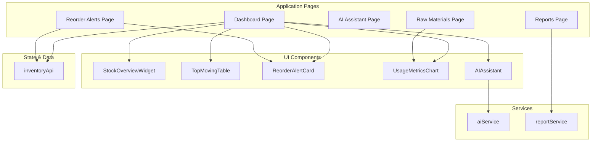
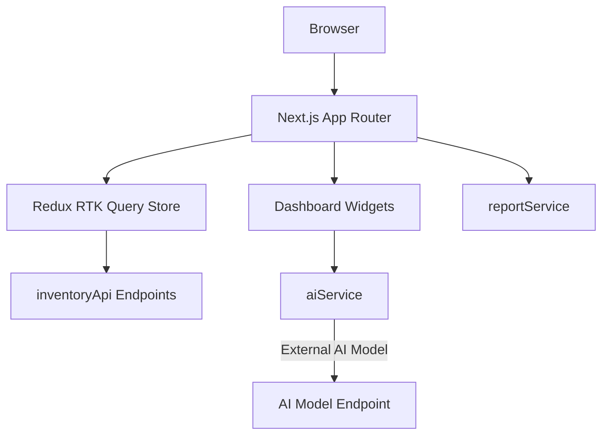
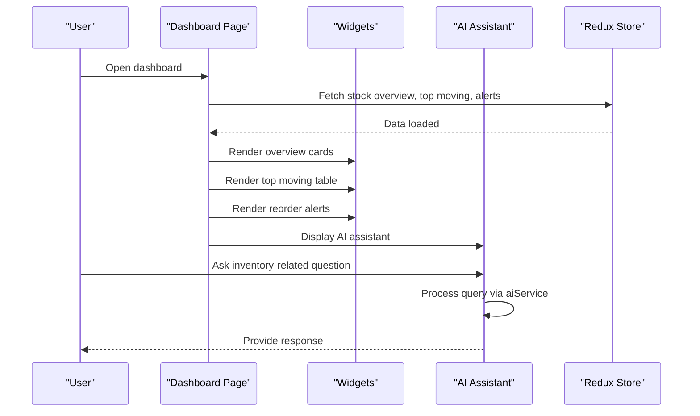
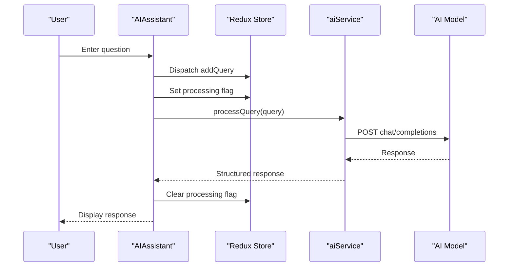
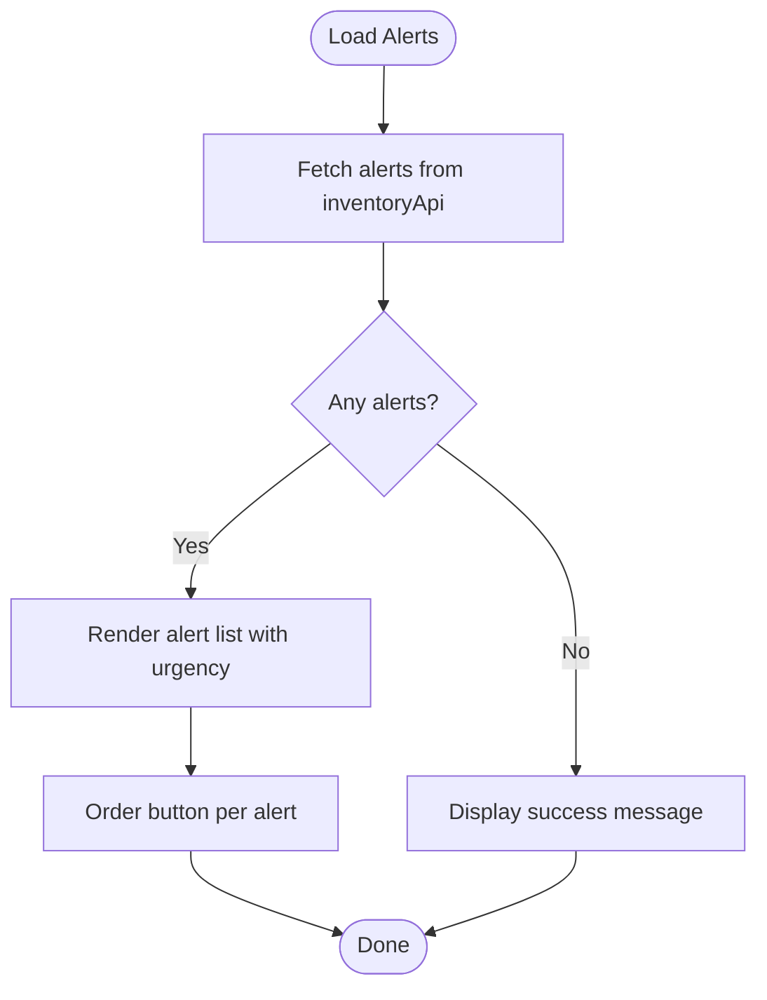
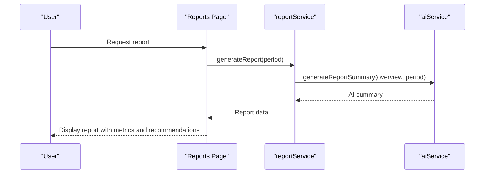
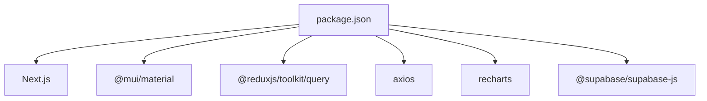

# Introduction and Purpose

<cite>
**Referenced Files in This Document**
- [README.md](file://README.md)
- [site.config.ts](file://src/config/site.config.ts)
- [dashboard.page.tsx](file://src/app/dashboard/page.tsx)
- [ai-assistant.page.tsx](file://src/app/ai-assistant/page.tsx)
- [reorder-alerts.page.tsx](file://src/app/reorder-alerts/page.tsx)
- [reports.page.tsx](file://src/app/reports/page.tsx)
- [AIAssistant.tsx](file://src/components/ai/AIAssistant.tsx)
- [ReorderAlertCard.tsx](file://src/components/inventory/ReorderAlertCard.tsx)
- [StockOverviewWidget.tsx](file://src/components/inventory/StockOverviewWidget.tsx)
- [TopMovingTable.tsx](file://src/components/inventory/TopMovingTable.tsx)
- [UsageMetricsChart.tsx](file://src/components/inventory/UsageMetricsChart.tsx)
- [aiService.ts](file://src/services/aiService.ts)
- [reportService.ts](file://src/services/reportService.ts)
- [inventoryApi.ts](file://src/store/api/inventoryApi.ts)
- [package.json](file://package.json)
</cite>

## Table of Contents
1. [Introduction](#introduction)
2. [Project Structure](#project-structure)
3. [Core Components](#core-components)
4. [Architecture Overview](#architecture-overview)
5. [Detailed Component Analysis](#detailed-component-analysis)
6. [Dependency Analysis](#dependency-analysis)
7. [Performance Considerations](#performance-considerations)
8. [Troubleshooting Guide](#troubleshooting-guide)
9. [Conclusion](#conclusion)

## Introduction
This project is an AI-powered inventory management dashboard designed to digitize and optimize fertilizer manufacturing inventory operations at Pupuk Sriwijaya. Its mission is to transform manual, error-prone inventory tracking into a real-time, intelligent system that reduces stockouts, minimizes waste, and enhances decision-making through automated reorder alerts and predictive insights.

Traditional inventory systems often suffer from inefficiencies such as delayed stock updates, poor visibility into consumption trends, and lack of forward-looking analytics. These limitations increase the risk of stockouts, overstocking, and missed optimization opportunities. This dashboard addresses those challenges by serving as a centralized platform for:
- Real-time inventory monitoring and stock overview
- Automated reorder alerts with urgency classification
- AI-driven insights and natural language queries via the AI assistant
- Predictive analytics for demand forecasting and anomaly detection
- Automated executive summaries and scheduled reports

The business impact is measurable: improved operational efficiency through streamlined procurement workflows, reduced carrying and shortage costs via accurate reorder recommendations, and enhanced decision-making capabilities powered by predictive insights and usage metrics. For inventory managers and plant operators, this translates into fewer manual checks, faster response to supply chain changes, and clearer visibility into stock health and future needs.

## Project Structure
The application is a Next.js-based frontend with a modular architecture supporting real-time data, AI services, and automated reporting. Key areas include:
- Application pages for dashboard, raw materials, reorder alerts, reports, and AI assistant
- UI components for inventory widgets, charts, and alerts
- Services for AI processing, analytics, and report generation
- Redux RTK Query API slice for inventory data
- Configuration for navigation, caching, and third-party integrations

**Diagram sources**
- [dashboard.page.tsx:17-127](file://src/app/dashboard/page.tsx#L17-L127)
- [reorder-alerts.page.tsx:11-43](file://src/app/reorder-alerts/page.tsx#L11-L43)
- [reports.page.tsx:14-95](file://src/app/reports/page.tsx#L14-L95)
- [AIAssistant.tsx:23-119](file://src/components/ai/AIAssistant.tsx#L23-L119)
- [ReorderAlertCard.tsx:19-104](file://src/components/inventory/ReorderAlertCard.tsx#L19-L104)
- [StockOverviewWidget.tsx:16-56](file://src/components/inventory/StockOverviewWidget.tsx#L16-L56)
- [TopMovingTable.tsx:19-99](file://src/components/inventory/TopMovingTable.tsx#L19-L99)
- [UsageMetricsChart.tsx:47-159](file://src/components/inventory/UsageMetricsChart.tsx#L47-L159)
- [aiService.ts:18-218](file://src/services/aiService.ts#L18-L218)
- [reportService.ts:18-170](file://src/services/reportService.ts#L18-L170)
- [inventoryApi.ts:23-56](file://src/store/api/inventoryApi.ts#L23-L56)

**Section sources**
- [site.config.ts:1-34](file://src/config/site.config.ts#L1-L34)
- [package.json:11-26](file://package.json#L11-L26)

## Core Components
- Inventory dashboard: Central hub displaying stock overview, top-moving materials, reorder alerts, and usage metrics. It integrates the AI assistant for natural language queries and provides quick access to raw materials and reports.
- AI assistant: A conversational interface enabling inventory managers to ask questions about inventory status, reorder points, trends, and forecasts. Responses are generated using an external AI model.
- Reorder alerts: A categorized alert system indicating low-stock items with urgency levels, current stock, reorder points, and suggested order quantities.
- Predictive insights: AI-generated forecasts and recommendations derived from inventory data, including anomaly detection and demand projections.
- Automated reports: Executive summaries and scheduled reports produced with AI assistance, including metrics and actionable recommendations.

These components collectively enable a shift from reactive to proactive inventory management, reducing manual effort and improving accuracy.

**Section sources**
- [dashboard.page.tsx:17-127](file://src/app/dashboard/page.tsx#L17-L127)
- [AIAssistant.tsx:23-119](file://src/components/ai/AIAssistant.tsx#L23-L119)
- [ReorderAlertCard.tsx:19-104](file://src/components/inventory/ReorderAlertCard.tsx#L19-L104)
- [aiService.ts:18-218](file://src/services/aiService.ts#L18-L218)
- [reportService.ts:18-170](file://src/services/reportService.ts#L18-L170)

## Architecture Overview
The system architecture combines a Next.js frontend with Redux RTK Query for data fetching, MUI components for UI, and service layers for AI and reporting. The AI assistant communicates with an external AI model endpoint, while the reporting pipeline leverages AI for summaries and recommendations.

**Diagram sources**
- [dashboard.page.tsx:17-127](file://src/app/dashboard/page.tsx#L17-L127)
- [inventoryApi.ts:23-56](file://src/store/api/inventoryApi.ts#L23-L56)
- [aiService.ts:18-218](file://src/services/aiService.ts#L18-L218)
- [reportService.ts:18-170](file://src/services/reportService.ts#L18-L170)

## Detailed Component Analysis

### Inventory Dashboard
The dashboard page orchestrates real-time inventory views, including stock overview widgets, top-moving materials, reorder alerts, and usage metrics. It integrates the AI assistant to provide contextual insights and supports responsive layouts for efficient daily operations.

**Diagram sources**
- [dashboard.page.tsx:17-127](file://src/app/dashboard/page.tsx#L17-L127)
- [AIAssistant.tsx:23-119](file://src/components/ai/AIAssistant.tsx#L23-L119)
- [StockOverviewWidget.tsx:16-56](file://src/components/inventory/StockOverviewWidget.tsx#L16-L56)
- [TopMovingTable.tsx:19-99](file://src/components/inventory/TopMovingTable.tsx#L19-L99)
- [ReorderAlertCard.tsx:19-104](file://src/components/inventory/ReorderAlertCard.tsx#L19-L104)

**Section sources**
- [dashboard.page.tsx:17-127](file://src/app/dashboard/page.tsx#L17-L127)
- [StockOverviewWidget.tsx:16-56](file://src/components/inventory/StockOverviewWidget.tsx#L16-L56)
- [TopMovingTable.tsx:19-99](file://src/components/inventory/TopMovingTable.tsx#L19-L99)
- [ReorderAlertCard.tsx:19-104](file://src/components/inventory/ReorderAlertCard.tsx#L19-L104)

### AI Assistant
The AI assistant enables natural language interactions for inventory insights. It dispatches queries to the AI service, which communicates with an external AI model to produce human-readable responses. This capability accelerates decision-making and reduces time spent parsing dashboards.

**Diagram sources**
- [AIAssistant.tsx:23-119](file://src/components/ai/AIAssistant.tsx#L23-L119)
- [aiService.ts:18-218](file://src/services/aiService.ts#L18-L218)

**Section sources**
- [AIAssistant.tsx:23-119](file://src/components/ai/AIAssistant.tsx#L23-L119)
- [aiService.ts:18-218](file://src/services/aiService.ts#L18-L218)

### Reorder Alerts
The reorder alerts component displays low-stock items with urgency levels and suggested actions. It supports immediate ordering and integrates with the inventory API for real-time updates, helping prevent stockouts and streamline procurement.

**Diagram sources**
- [reorder-alerts.page.tsx:11-43](file://src/app/reorder-alerts/page.tsx#L11-L43)
- [ReorderAlertCard.tsx:19-104](file://src/components/inventory/ReorderAlertCard.tsx#L19-L104)
- [inventoryApi.ts:23-56](file://src/store/api/inventoryApi.ts#L23-L56)

**Section sources**
- [reorder-alerts.page.tsx:11-43](file://src/app/reorder-alerts/page.tsx#L11-L43)
- [ReorderAlertCard.tsx:19-104](file://src/components/inventory/ReorderAlertCard.tsx#L19-L104)
- [inventoryApi.ts:23-56](file://src/store/api/inventoryApi.ts#L23-L56)

### Predictive Insights and Reports
Predictive insights leverage AI to analyze inventory data, detect anomalies, and generate forecasts. Reports combine AI summaries with metrics and recommendations, supporting scheduled distribution and automated workflows.

**Diagram sources**
- [reports.page.tsx:14-95](file://src/app/reports/page.tsx#L14-L95)
- [reportService.ts:18-170](file://src/services/reportService.ts#L18-L170)
- [aiService.ts:18-218](file://src/services/aiService.ts#L18-L218)

**Section sources**
- [reports.page.tsx:14-95](file://src/app/reports/page.tsx#L14-L95)
- [reportService.ts:18-170](file://src/services/reportService.ts#L18-L170)
- [aiService.ts:18-218](file://src/services/aiService.ts#L18-L218)

## Dependency Analysis
The project relies on modern web technologies and integrates AI services for intelligence. Dependencies include Next.js, MUI for UI, Redux RTK Query for state/data, and Axios for HTTP requests. The AI assistant and reporting services depend on environment variables for external endpoints and keys.

**Diagram sources**
- [package.json:11-26](file://package.json#L11-L26)

**Section sources**
- [package.json:11-26](file://package.json#L11-L26)

## Performance Considerations
- Caching: The site configuration defines TTLs for various data categories, including reorder alerts and usage metrics, to balance freshness and performance.
- Real-time updates: The dashboard aggregates multiple data streams; ensure network conditions support timely updates.
- AI latency: External AI model calls introduce latency; consider user feedback indicators and retry strategies.
- Mobile responsiveness: The UI is designed to be responsive, improving accessibility across devices.

**Section sources**
- [site.config.ts:22-32](file://src/config/site.config.ts#L22-L32)

## Troubleshooting Guide
Common issues and resolutions:
- AI assistant errors: If the AI assistant fails to respond, verify the AI model endpoint and API key configuration. Confirm that the AI service is reachable and that the model endpoint is correctly set.
- Reorder alerts not updating: Check the inventory API endpoints and network connectivity. Verify that the alerts endpoint returns data and that the component renders appropriately.
- Report generation failures: Ensure the reporting service can reach the AI model and that the overview data is available. Use fallback mechanisms if external services are unavailable.
- Dashboard loading delays: Monitor network performance and consider increasing cache TTLs for frequently accessed data.

**Section sources**
- [aiService.ts:18-218](file://src/services/aiService.ts#L18-L218)
- [reportService.ts:18-170](file://src/services/reportService.ts#L18-L170)
- [inventoryApi.ts:23-56](file://src/store/api/inventoryApi.ts#L23-L56)

## Conclusion
This AI-powered inventory dashboard modernizes Pupuk Sriwijaya’s fertilizer manufacturing operations by centralizing real-time monitoring, automating reorder alerts, and delivering predictive insights through the AI assistant and reporting services. By reducing manual effort, minimizing stockouts, and enhancing decision-making, the system improves operational efficiency, lowers waste, and supports scalable growth in inventory management.