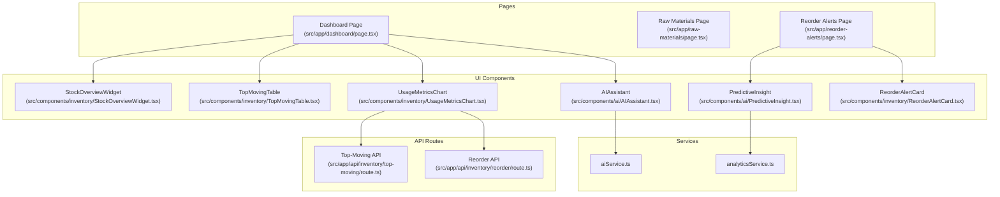
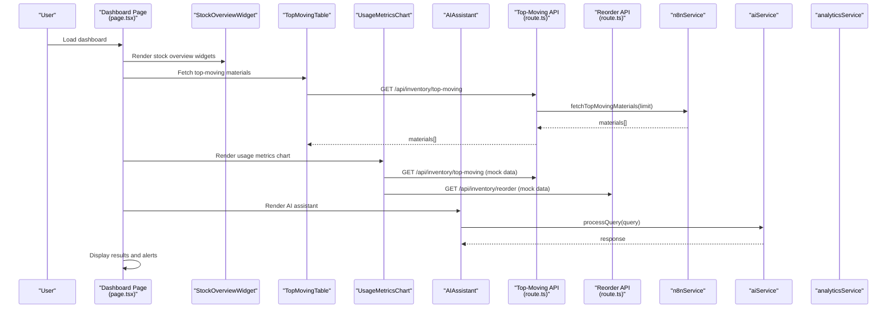
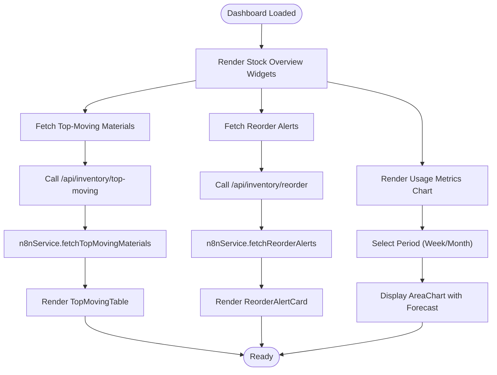
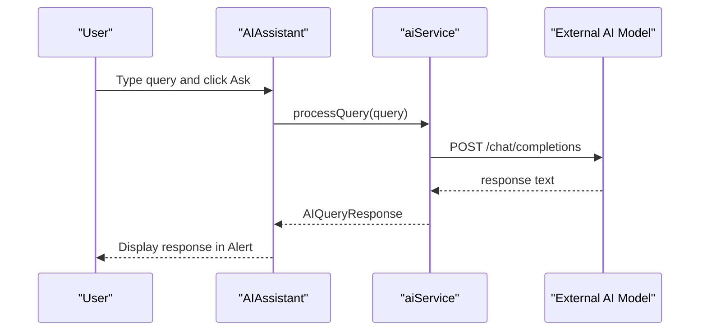
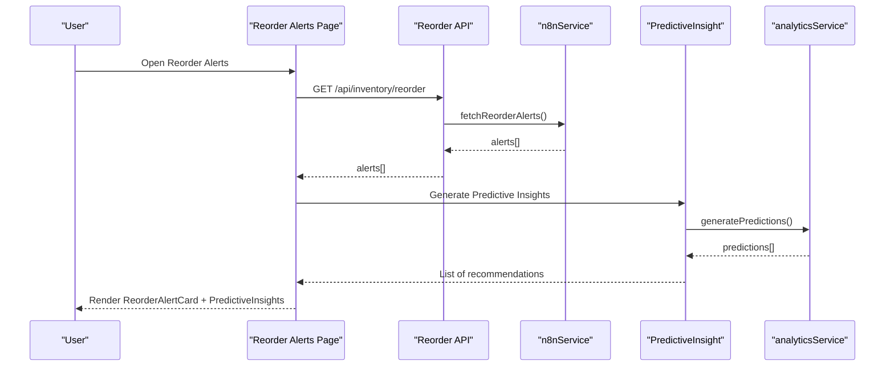
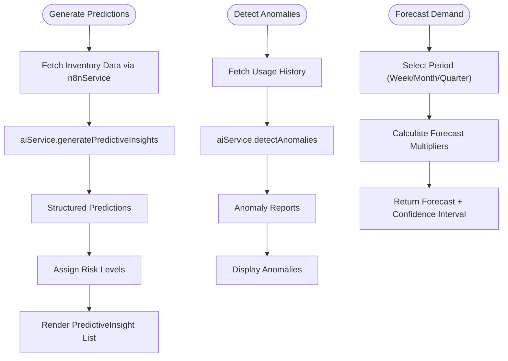
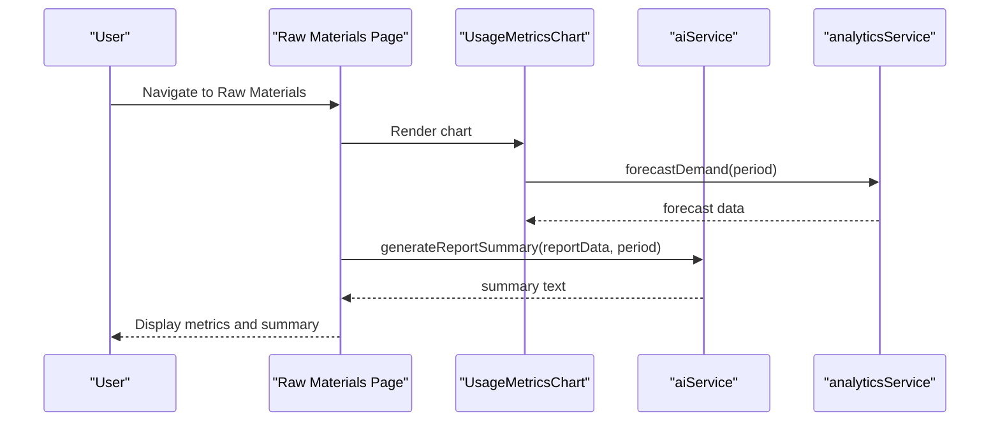
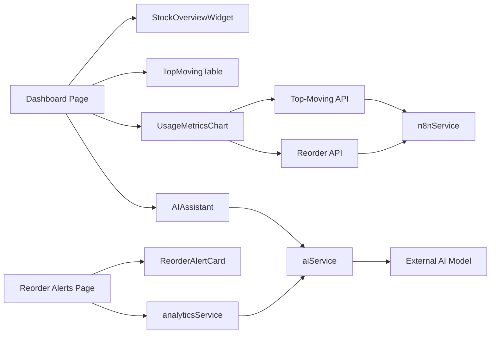

# Key Features and Capabilities

<cite>
**Referenced Files in This Document**
- [README.md](file://README.md)
- [package.json](file://package.json)
- [src/app/layout.tsx](file://src/app/layout.tsx)
- [src/config/site.config.ts](file://src/config/site.config.ts)
- [src/app/dashboard/page.tsx](file://src/app/dashboard/page.tsx)
- [src/components/inventory/StockOverviewWidget.tsx](file://src/components/inventory/StockOverviewWidget.tsx)
- [src/components/inventory/TopMovingTable.tsx](file://src/components/inventory/TopMovingTable.tsx)
- [src/components/inventory/UsageMetricsChart.tsx](file://src/components/inventory/UsageMetricsChart.tsx)
- [src/app/raw-materials/page.tsx](file://src/app/raw-materials/page.tsx)
- [src/components/ai/AIAssistant.tsx](file://src/components/ai/AIAssistant.tsx)
- [src/components/ai/PredictiveInsight.tsx](file://src/components/ai/PredictiveInsight.tsx)
- [src/components/inventory/ReorderAlertCard.tsx](file://src/components/inventory/ReorderAlertCard.tsx)
- [src/app/reorder-alerts/page.tsx](file://src/app/reorder-alerts/page.tsx)
- [src/app/api/inventory/top-moving/route.ts](file://src/app/api/inventory/top-moving/route.ts)
- [src/app/api/inventory/reorder/route.ts](file://src/app/api/inventory/reorder/route.ts)
- [src/services/aiService.ts](file://src/services/aiService.ts)
- [src/services/analyticsService.ts](file://src/services/analyticsService.ts)
</cite>

## Table of Contents
1. [Introduction](#introduction)
2. [Project Structure](#project-structure)
3. [Core Components](#core-components)
4. [Architecture Overview](#architecture-overview)
5. [Detailed Component Analysis](#detailed-component-analysis)
6. [Dependency Analysis](#dependency-analysis)
7. [Performance Considerations](#performance-considerations)
8. [Troubleshooting Guide](#troubleshooting-guide)
9. [Conclusion](#conclusion)

## Introduction
This document presents the key features and capabilities of the AI-powered inventory management dashboard. It focuses on:
- Real-time inventory monitoring dashboard displaying current stock levels, usage trends, and inventory status across raw materials
- AI assistant enabling natural language queries for inventory insights, demand forecasting, and operational recommendations
- Reorder alert system that automatically identifies low-stock items and generates procurement recommendations
- Predictive analytics capabilities forecasting future demand based on historical patterns and seasonal factors
- Reporting and analytics features providing usage metrics charts, executive summaries, and performance dashboards
- Mobile-responsive design ensuring accessibility across devices and screen sizes

## Project Structure
The application is a Next.js app bootstrapped with the App Router. It organizes features by domain:
- Pages under src/app for routes such as dashboard, raw materials, reorder alerts, and reports
- UI components under src/components for reusable widgets and cards
- Services under src/services for AI, analytics, and workflow integrations
- Store under src/store for API slices and Redux state
- Configuration under src/config for site-wide settings and caching policies

**Diagram sources**
- [src/app/dashboard/page.tsx:1-128](file://src/app/dashboard/page.tsx#L1-L128)
- [src/app/raw-materials/page.tsx:1-38](file://src/app/raw-materials/page.tsx#L1-L38)
- [src/app/reorder-alerts/page.tsx:1-44](file://src/app/reorder-alerts/page.tsx#L1-L44)
- [src/components/inventory/StockOverviewWidget.tsx:1-57](file://src/components/inventory/StockOverviewWidget.tsx#L1-L57)
- [src/components/inventory/TopMovingTable.tsx:1-100](file://src/components/inventory/TopMovingTable.tsx#L1-L100)
- [src/components/inventory/UsageMetricsChart.tsx:1-160](file://src/components/inventory/UsageMetricsChart.tsx#L1-L160)
- [src/components/ai/AIAssistant.tsx:1-120](file://src/components/ai/AIAssistant.tsx#L1-L120)
- [src/components/ai/PredictiveInsight.tsx:1-152](file://src/components/ai/PredictiveInsight.tsx#L1-L152)
- [src/components/inventory/ReorderAlertCard.tsx:1-105](file://src/components/inventory/ReorderAlertCard.tsx#L1-L105)
- [src/app/api/inventory/top-moving/route.ts:1-25](file://src/app/api/inventory/top-moving/route.ts#L1-L25)
- [src/app/api/inventory/reorder/route.ts:1-18](file://src/app/api/inventory/reorder/route.ts#L1-L18)
- [src/services/aiService.ts:1-219](file://src/services/aiService.ts#L1-L219)
- [src/services/analyticsService.ts:1-134](file://src/services/analyticsService.ts#L1-L134)

**Section sources**
- [README.md:1-37](file://README.md#L1-L37)
- [package.json:1-39](file://package.json#L1-L39)
- [src/app/layout.tsx:1-31](file://src/app/layout.tsx#L1-L31)
- [src/config/site.config.ts:1-34](file://src/config/site.config.ts#L1-L34)

## Core Components
This section outlines the primary features and how they are implemented.

- Real-time inventory monitoring dashboard
  - Stock overview widgets present key KPIs such as total materials, low stock items, pending orders, and turnover rate.
  - Top 10 fast-moving raw materials table highlights usage velocity and trend direction.
  - Usage metrics chart visualizes actual consumption versus forecast with selectable weekly/monthly periods and embedded statistics.

- AI assistant
  - Natural language interface allows users to ask questions about inventory, reorder points, usage trends, and forecasts.
  - Responses are powered by an external AI model via a dedicated service, with processing state and error handling.

- Reorder alert system
  - Automated alerts surface low-stock items with urgency levels and suggested order quantities.
  - The page augments alerts with AI-powered predictive insights and recommendations.

- Predictive analytics
  - Historical data is analyzed to generate demand forecasts and confidence-based recommendations.
  - Anomalies in consumption patterns are detected and surfaced for further review.

- Reporting and analytics
  - Usage metrics charts provide average daily usage, peak usage, and forecast accuracy.
  - Executive summaries can be generated for reports, with fallbacks when AI fails.

- Mobile-responsive design
  - The dashboard and pages use responsive layouts and MUI components to adapt to various screen sizes.

**Section sources**
- [src/app/dashboard/page.tsx:1-128](file://src/app/dashboard/page.tsx#L1-L128)
- [src/components/inventory/StockOverviewWidget.tsx:1-57](file://src/components/inventory/StockOverviewWidget.tsx#L1-L57)
- [src/components/inventory/TopMovingTable.tsx:1-100](file://src/components/inventory/TopMovingTable.tsx#L1-L100)
- [src/components/inventory/UsageMetricsChart.tsx:1-160](file://src/components/inventory/UsageMetricsChart.tsx#L1-L160)
- [src/components/ai/AIAssistant.tsx:1-120](file://src/components/ai/AIAssistant.tsx#L1-L120)
- [src/components/inventory/ReorderAlertCard.tsx:1-105](file://src/components/inventory/ReorderAlertCard.tsx#L1-L105)
- [src/app/reorder-alerts/page.tsx:1-44](file://src/app/reorder-alerts/page.tsx#L1-L44)
- [src/components/ai/PredictiveInsight.tsx:1-152](file://src/components/ai/PredictiveInsight.tsx#L1-L152)
- [src/services/aiService.ts:1-219](file://src/services/aiService.ts#L1-L219)
- [src/services/analyticsService.ts:1-134](file://src/services/analyticsService.ts#L1-L134)

## Architecture Overview
The system integrates frontend components, API routes, and backend services to deliver a cohesive inventory management experience.

**Diagram sources**
- [src/app/dashboard/page.tsx:1-128](file://src/app/dashboard/page.tsx#L1-L128)
- [src/components/inventory/StockOverviewWidget.tsx:1-57](file://src/components/inventory/StockOverviewWidget.tsx#L1-L57)
- [src/components/inventory/TopMovingTable.tsx:1-100](file://src/components/inventory/TopMovingTable.tsx#L1-L100)
- [src/components/inventory/UsageMetricsChart.tsx:1-160](file://src/components/inventory/UsageMetricsChart.tsx#L1-L160)
- [src/components/ai/AIAssistant.tsx:1-120](file://src/components/ai/AIAssistant.tsx#L1-L120)
- [src/app/api/inventory/top-moving/route.ts:1-25](file://src/app/api/inventory/top-moving/route.ts#L1-L25)
- [src/app/api/inventory/reorder/route.ts:1-18](file://src/app/api/inventory/reorder/route.ts#L1-L18)
- [src/services/aiService.ts:1-219](file://src/services/aiService.ts#L1-L219)
- [src/services/analyticsService.ts:1-134](file://src/services/analyticsService.ts#L1-L134)

## Detailed Component Analysis

### Real-time Inventory Monitoring Dashboard
The dashboard aggregates multiple views to provide a comprehensive overview:
- Stock overview widgets show totals and trends with directional indicators.
- Top-moving materials table ranks items by usage velocity and trend icons.
- Usage metrics chart compares actual consumption against forecast, with controls for weekly/monthly periods.

**Diagram sources**
- [src/app/dashboard/page.tsx:1-128](file://src/app/dashboard/page.tsx#L1-L128)
- [src/app/api/inventory/top-moving/route.ts:1-25](file://src/app/api/inventory/top-moving/route.ts#L1-L25)
- [src/app/api/inventory/reorder/route.ts:1-18](file://src/app/api/inventory/reorder/route.ts#L1-L18)
- [src/components/inventory/TopMovingTable.tsx:1-100](file://src/components/inventory/TopMovingTable.tsx#L1-L100)
- [src/components/inventory/ReorderAlertCard.tsx:1-105](file://src/components/inventory/ReorderAlertCard.tsx#L1-L105)
- [src/components/inventory/UsageMetricsChart.tsx:1-160](file://src/components/inventory/UsageMetricsChart.tsx#L1-L160)

**Section sources**
- [src/app/dashboard/page.tsx:1-128](file://src/app/dashboard/page.tsx#L1-L128)
- [src/components/inventory/StockOverviewWidget.tsx:1-57](file://src/components/inventory/StockOverviewWidget.tsx#L1-L57)
- [src/components/inventory/TopMovingTable.tsx:1-100](file://src/components/inventory/TopMovingTable.tsx#L1-L100)
- [src/components/inventory/UsageMetricsChart.tsx:1-160](file://src/components/inventory/UsageMetricsChart.tsx#L1-L160)

### AI Assistant Feature
The AI assistant enables natural language interactions:
- Users can ask questions about inventory, reorder points, trends, and forecasts.
- Queries are sent to an external AI model via a dedicated service, returning processed responses.
- The UI handles loading states and errors gracefully.

**Diagram sources**
- [src/components/ai/AIAssistant.tsx:1-120](file://src/components/ai/AIAssistant.tsx#L1-L120)
- [src/services/aiService.ts:1-219](file://src/services/aiService.ts#L1-L219)

**Section sources**
- [src/components/ai/AIAssistant.tsx:1-120](file://src/components/ai/AIAssistant.tsx#L1-L120)
- [src/services/aiService.ts:1-219](file://src/services/aiService.ts#L1-L219)

### Reorder Alert System
The reorder alert system:
- Displays low-stock items with urgency levels and suggested order quantities.
- Integrates with predictive insights to provide confidence-based recommendations.
- Offers a dedicated page for reviewing and acting on alerts.

**Diagram sources**
- [src/app/reorder-alerts/page.tsx:1-44](file://src/app/reorder-alerts/page.tsx#L1-L44)
- [src/app/api/inventory/reorder/route.ts:1-18](file://src/app/api/inventory/reorder/route.ts#L1-L18)
- [src/components/inventory/ReorderAlertCard.tsx:1-105](file://src/components/inventory/ReorderAlertCard.tsx#L1-L105)
- [src/components/ai/PredictiveInsight.tsx:1-152](file://src/components/ai/PredictiveInsight.tsx#L1-L152)
- [src/services/analyticsService.ts:1-134](file://src/services/analyticsService.ts#L1-L134)

**Section sources**
- [src/app/reorder-alerts/page.tsx:1-44](file://src/app/reorder-alerts/page.tsx#L1-L44)
- [src/components/inventory/ReorderAlertCard.tsx:1-105](file://src/components/inventory/ReorderAlertCard.tsx#L1-L105)
- [src/components/ai/PredictiveInsight.tsx:1-152](file://src/components/ai/PredictiveInsight.tsx#L1-L152)
- [src/services/analyticsService.ts:1-134](file://src/services/analyticsService.ts#L1-L134)

### Predictive Analytics and Demand Forecasting
Predictive analytics leverages historical data and AI:
- Predictive insights are generated from inventory data, including confidence levels and recommended actions.
- Anomaly detection identifies unusual consumption patterns.
- Forecasting supports weekly, monthly, and quarterly horizons with confidence intervals.

**Diagram sources**
- [src/services/analyticsService.ts:1-134](file://src/services/analyticsService.ts#L1-L134)
- [src/services/aiService.ts:1-219](file://src/services/aiService.ts#L1-L219)

**Section sources**
- [src/services/analyticsService.ts:1-134](file://src/services/analyticsService.ts#L1-L134)
- [src/services/aiService.ts:1-219](file://src/services/aiService.ts#L1-L219)

### Reporting and Analytics
Reporting features include:
- Usage metrics charts with average daily usage, peak usage, and forecast accuracy.
- Executive summaries generated from report data, with fallback logic for resilience.
- Raw materials page consolidating detailed consumption patterns.

**Diagram sources**
- [src/app/raw-materials/page.tsx:1-38](file://src/app/raw-materials/page.tsx#L1-L38)
- [src/components/inventory/UsageMetricsChart.tsx:1-160](file://src/components/inventory/UsageMetricsChart.tsx#L1-L160)
- [src/services/aiService.ts:1-219](file://src/services/aiService.ts#L1-L219)
- [src/services/analyticsService.ts:1-134](file://src/services/analyticsService.ts#L1-L134)

**Section sources**
- [src/app/raw-materials/page.tsx:1-38](file://src/app/raw-materials/page.tsx#L1-L38)
- [src/components/inventory/UsageMetricsChart.tsx:1-160](file://src/components/inventory/UsageMetricsChart.tsx#L1-L160)
- [src/services/aiService.ts:1-219](file://src/services/aiService.ts#L1-L219)
- [src/services/analyticsService.ts:1-134](file://src/services/analyticsService.ts#L1-L134)

### Mobile-Responsive Design
The application is designed to be accessible across devices:
- The root layout applies a responsive font and theme provider.
- Pages and components use MUI Grid and responsive breakpoints to adapt content layout.
- Charts and tables are built with responsive containers to fit smaller screens.

**Section sources**
- [src/app/layout.tsx:1-31](file://src/app/layout.tsx#L1-L31)
- [src/config/site.config.ts:1-34](file://src/config/site.config.ts#L1-L34)

## Dependency Analysis
The system exhibits clear separation of concerns:
- Pages depend on UI components and Redux hooks to orchestrate data fetching.
- UI components rely on services for AI and analytics capabilities.
- API routes act as thin wrappers around services, delegating to n8n for data retrieval.
- Services encapsulate external integrations and AI model communication.

**Diagram sources**
- [src/app/dashboard/page.tsx:1-128](file://src/app/dashboard/page.tsx#L1-L128)
- [src/components/inventory/StockOverviewWidget.tsx:1-57](file://src/components/inventory/StockOverviewWidget.tsx#L1-L57)
- [src/components/inventory/TopMovingTable.tsx:1-100](file://src/components/inventory/TopMovingTable.tsx#L1-L100)
- [src/components/inventory/UsageMetricsChart.tsx:1-160](file://src/components/inventory/UsageMetricsChart.tsx#L1-L160)
- [src/components/ai/AIAssistant.tsx:1-120](file://src/components/ai/AIAssistant.tsx#L1-L120)
- [src/app/api/inventory/top-moving/route.ts:1-25](file://src/app/api/inventory/top-moving/route.ts#L1-L25)
- [src/app/api/inventory/reorder/route.ts:1-18](file://src/app/api/inventory/reorder/route.ts#L1-L18)
- [src/services/aiService.ts:1-219](file://src/services/aiService.ts#L1-L219)
- [src/services/analyticsService.ts:1-134](file://src/services/analyticsService.ts#L1-L134)

**Section sources**
- [src/app/dashboard/page.tsx:1-128](file://src/app/dashboard/page.tsx#L1-L128)
- [src/app/reorder-alerts/page.tsx:1-44](file://src/app/reorder-alerts/page.tsx#L1-L44)
- [src/app/api/inventory/top-moving/route.ts:1-25](file://src/app/api/inventory/top-moving/route.ts#L1-L25)
- [src/app/api/inventory/reorder/route.ts:1-18](file://src/app/api/inventory/reorder/route.ts#L1-L18)
- [src/services/aiService.ts:1-219](file://src/services/aiService.ts#L1-L219)
- [src/services/analyticsService.ts:1-134](file://src/services/analyticsService.ts#L1-L134)

## Performance Considerations
- Caching policy: Site configuration defines default TTLs for various data categories, including reorder alerts and usage metrics, to balance freshness and performance.
- Polling interval: Workflow automation uses a fixed polling interval to synchronize inventory data periodically.
- Frontend responsiveness: Components use loading indicators and error alerts to maintain perceived performance and user feedback during data fetches.

**Section sources**
- [src/config/site.config.ts:22-32](file://src/config/site.config.ts#L22-L32)

## Troubleshooting Guide
Common issues and remedies:
- AI query failures: The AI assistant displays a user-friendly error message when processing fails and sets an appropriate processing state.
- API route errors: Top-moving and reorder APIs return structured error responses when data retrieval fails, aiding in debugging.
- Empty or missing data: Components render fallback UIs (e.g., success alerts for no alerts, loading spinners) to prevent blank states.

**Section sources**
- [src/components/ai/AIAssistant.tsx:36-45](file://src/components/ai/AIAssistant.tsx#L36-L45)
- [src/app/api/inventory/top-moving/route.ts:17-23](file://src/app/api/inventory/top-moving/route.ts#L17-L23)
- [src/app/api/inventory/reorder/route.ts:10-16](file://src/app/api/inventory/reorder/route.ts#L10-L16)
- [src/components/inventory/ReorderAlertCard.tsx:43-49](file://src/components/inventory/ReorderAlertCard.tsx#L43-L49)

## Conclusion
The AI-powered inventory management dashboard delivers a comprehensive solution combining real-time monitoring, AI-driven insights, automated alerts, predictive analytics, and responsive design. Together, these features enable warehouse and production teams to track stock levels, anticipate demand, and make informed procurement decisions efficiently.