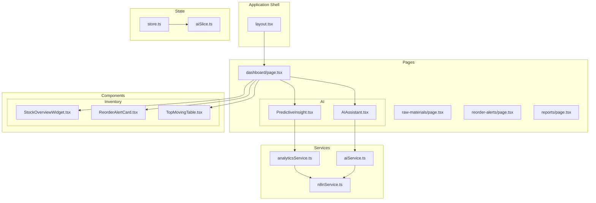
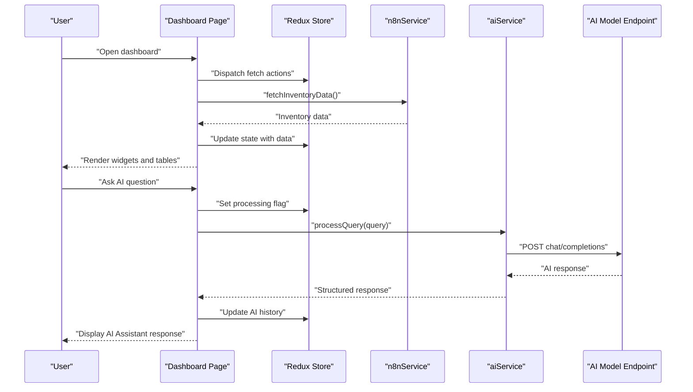
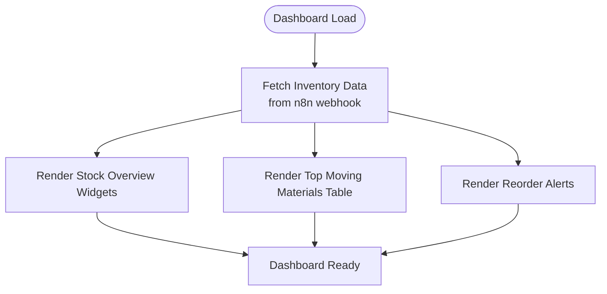
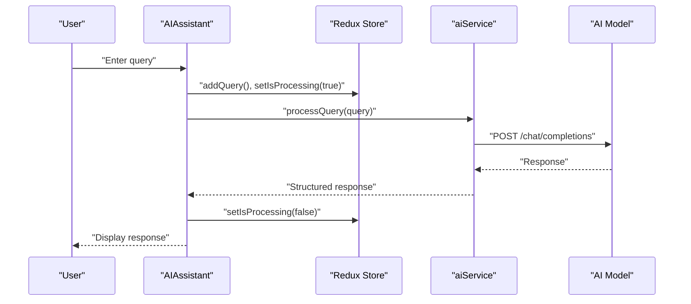
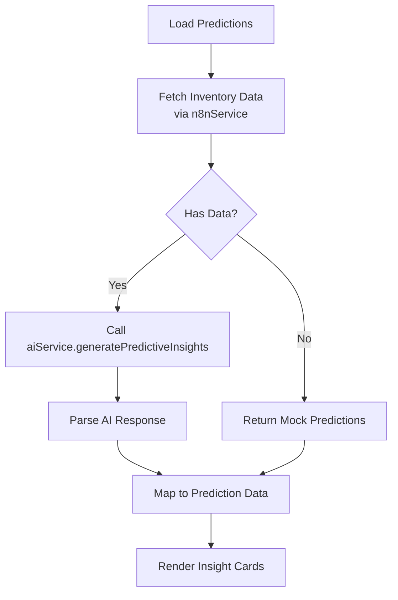
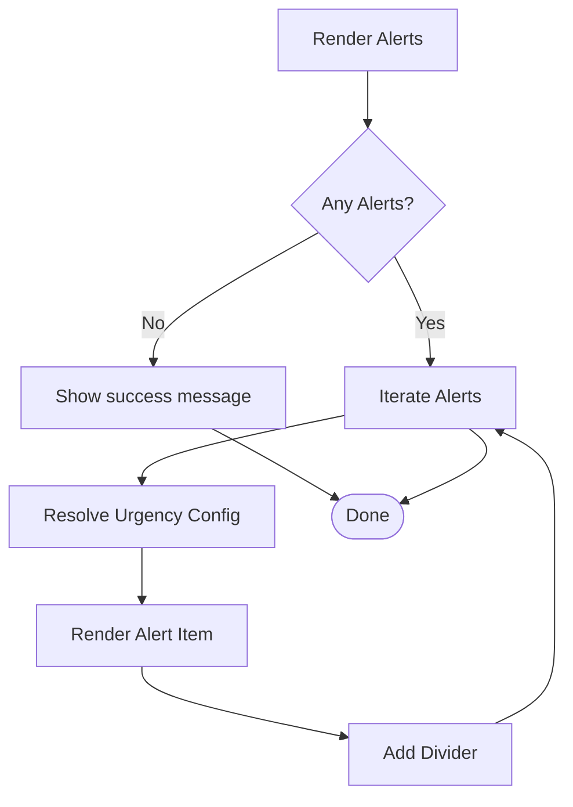
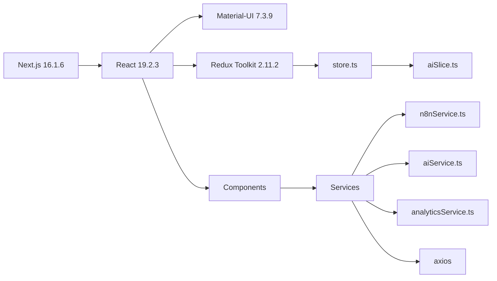

# Project Overview

<cite>
**Referenced Files in This Document**
- [README.md](file://README.md)
- [package.json](file://package.json)
- [site.config.ts](file://src/config/site.config.ts)
- [layout.tsx](file://src/app/layout.tsx)
- [store.ts](file://src/store/store.ts)
- [aiService.ts](file://src/services/aiService.ts)
- [n8nService.ts](file://src/services/n8nService.ts)
- [analyticsService.ts](file://src/services/analyticsService.ts)
- [AIAssistant.tsx](file://src/components/ai/AIAssistant.tsx)
- [PredictiveInsight.tsx](file://src/components/ai/PredictiveInsight.tsx)
- [dashboard.page.tsx](file://src/app/dashboard/page.tsx)
- [StockOverviewWidget.tsx](file://src/components/inventory/StockOverviewWidget.tsx)
- [ReorderAlertCard.tsx](file://src/components/inventory/ReorderAlertCard.tsx)
- [TopMovingTable.tsx](file://src/components/inventory/TopMovingTable.tsx)
- [aiSlice.ts](file://src/store/slices/aiSlice.ts)
</cite>

## Table of Contents
1. [Introduction](#introduction)
2. [Project Structure](#project-structure)
3. [Core Components](#core-components)
4. [Architecture Overview](#architecture-overview)
5. [Detailed Component Analysis](#detailed-component-analysis)
6. [Dependency Analysis](#dependency-analysis)
7. [Performance Considerations](#performance-considerations)
8. [Troubleshooting Guide](#troubleshooting-guide)
9. [Conclusion](#conclusion)

## Introduction
This project is an AI-powered inventory management dashboard designed for Pupuk Sriwijaya's fertilizer manufacturing operations. It serves as a real-time inventory monitoring system that transforms raw inventory data into actionable intelligence through conversational AI, predictive insights, and automated alerts. The platform supports warehouse supervisors, production schedulers, and procurement teams by providing an intuitive inventory dashboard, an AI assistant for natural language queries, and reorder alerts that drive operational efficiency.

The core value proposition lies in bridging data silos with a unified, real-time view of stock levels, usage trends, and predictive recommendations. By integrating AI-driven analytics and automated reporting, the system accelerates decision-making, reduces manual effort, and minimizes stockouts or overstock situations—directly supporting Pupuk Sriwijaya's digital transformation goals.

## Project Structure
The application follows a modern Next.js 16.1.6 App Router architecture with a clear separation of concerns:
- Application shell and theme provider configured globally
- Feature-based routing under the app directory (dashboard, raw materials, reorder alerts, reports, AI assistant)
- Shared UI components organized by domain (inventory, AI)
- Centralized state management using Redux Toolkit
- Services for AI, analytics, and external data integration
- Configuration for navigation, caching, and third-party integrations

**Diagram sources**
- [layout.tsx:16-30](file://src/app/layout.tsx#L16-L30)
- [dashboard.page.tsx:17-127](file://src/app/dashboard/page.tsx#L17-L127)
- [store.ts:1-27](file://src/store/store.ts#L1-L27)
- [aiSlice.ts:1-56](file://src/store/slices/aiSlice.ts#L1-L56)
- [aiService.ts:18-219](file://src/services/aiService.ts#L18-L219)
- [n8nService.ts:16-109](file://src/services/n8nService.ts#L16-L109)
- [analyticsService.ts:13-134](file://src/services/analyticsService.ts#L13-L134)

**Section sources**
- [layout.tsx:11-30](file://src/app/layout.tsx#L11-L30)
- [site.config.ts:1-34](file://src/config/site.config.ts#L1-L34)
- [package.json:11-26](file://package.json#L11-L26)

## Core Components
- Inventory dashboard: Real-time overview of key metrics, top-moving materials, reorder alerts, and usage trends.
- AI assistant: Conversational interface enabling natural language queries about inventory, reorder points, and forecasts.
- Predictive insights: AI-generated demand forecasts and risk-ranked recommendations for materials.
- Reorder alerts: Urgency-ranked notifications with suggested order quantities to prevent stockouts.
- Analytics engine: AI-powered anomaly detection, demand forecasting, and optimal reorder point calculations.

These components work together to deliver a comprehensive inventory management solution tailored to fertilizer manufacturing environments.

**Section sources**
- [dashboard.page.tsx:17-127](file://src/app/dashboard/page.tsx#L17-L127)
- [AIAssistant.tsx:23-120](file://src/components/ai/AIAssistant.tsx#L23-L120)
- [PredictiveInsight.tsx:29-152](file://src/components/ai/PredictiveInsight.tsx#L29-L152)
- [ReorderAlertCard.tsx:19-105](file://src/components/inventory/ReorderAlertCard.tsx#L19-L105)
- [analyticsService.ts:13-134](file://src/services/analyticsService.ts#L13-L134)

## Architecture Overview
The system integrates three primary data sources:
- n8n webhook: Single source of truth for inventory data, providing real-time updates via polling.
- AI model endpoint: Dedicated AI service for natural language processing, predictive insights, and anomaly detection.
- Local state: Redux store managing UI state, AI query history, and cached data.

**Diagram sources**
- [dashboard.page.tsx:17-127](file://src/app/dashboard/page.tsx#L17-L127)
- [n8nService.ts:29-51](file://src/services/n8nService.ts#L29-L51)
- [aiService.ts:33-74](file://src/services/aiService.ts#L33-L74)

## Detailed Component Analysis

### Inventory Dashboard
The dashboard aggregates real-time inventory metrics and presents them through:
- Stock overview widgets: Total materials, low stock items, pending orders, and turnover rate.
- Top 10 fast-moving materials: Ranked by usage velocity with trend indicators.
- Reorder alerts: Urgency-ranked cards with suggested quantities and action buttons.
- Usage metrics chart: Historical consumption patterns for deeper analysis.

**Diagram sources**
- [dashboard.page.tsx:17-127](file://src/app/dashboard/page.tsx#L17-L127)
- [StockOverviewWidget.tsx:16-57](file://src/components/inventory/StockOverviewWidget.tsx#L16-L57)
- [TopMovingTable.tsx:19-100](file://src/components/inventory/TopMovingTable.tsx#L19-L100)
- [ReorderAlertCard.tsx:19-105](file://src/components/inventory/ReorderAlertCard.tsx#L19-L105)

**Section sources**
- [dashboard.page.tsx:17-127](file://src/app/dashboard/page.tsx#L17-L127)
- [StockOverviewWidget.tsx:16-57](file://src/components/inventory/StockOverviewWidget.tsx#L16-L57)
- [TopMovingTable.tsx:19-100](file://src/components/inventory/TopMovingTable.tsx#L19-L100)
- [ReorderAlertCard.tsx:19-105](file://src/components/inventory/ReorderAlertCard.tsx#L19-L105)

### AI Assistant
The AI assistant enables natural language interactions with inventory data:
- Query input with send/clear controls and keyboard support
- Real-time processing indicator and error handling
- Structured responses with confidence levels and context-aware insights

**Diagram sources**
- [AIAssistant.tsx:23-120](file://src/components/ai/AIAssistant.tsx#L23-L120)
- [aiSlice.ts:24-38](file://src/store/slices/aiSlice.ts#L24-L38)
- [aiService.ts:33-74](file://src/services/aiService.ts#L33-L74)

**Section sources**
- [AIAssistant.tsx:23-120](file://src/components/ai/AIAssistant.tsx#L23-L120)
- [aiSlice.ts:17-56](file://src/store/slices/aiSlice.ts#L17-L56)
- [aiService.ts:18-219](file://src/services/aiService.ts#L18-L219)

### Predictive Insights
Predictive insights provide machine learning-based demand forecasts:
- Automated generation of demand predictions and confidence scores
- Risk-level categorization (low/medium/high) for prioritized action
- Recommendations for reorder quantities and timing adjustments

**Diagram sources**
- [PredictiveInsight.tsx:29-152](file://src/components/ai/PredictiveInsight.tsx#L29-L152)
- [analyticsService.ts:17-41](file://src/services/analyticsService.ts#L17-L41)
- [n8nService.ts:29-51](file://src/services/n8nService.ts#L29-L51)
- [aiService.ts:79-124](file://src/services/aiService.ts#L79-L124)

**Section sources**
- [PredictiveInsight.tsx:29-152](file://src/components/ai/PredictiveInsight.tsx#L29-L152)
- [analyticsService.ts:13-134](file://src/services/analyticsService.ts#L13-L134)
- [aiService.ts:78-124](file://src/services/aiService.ts#L78-L124)

### Reorder Alerts
The reorder alerts module provides urgency-ranked notifications:
- Critical, warning, and info severity levels with distinct visual treatments
- Current stock vs. reorder point comparisons
- Suggested order quantities and quick-action buttons

**Diagram sources**
- [ReorderAlertCard.tsx:19-105](file://src/components/inventory/ReorderAlertCard.tsx#L19-L105)

**Section sources**
- [ReorderAlertCard.tsx:19-105](file://src/components/inventory/ReorderAlertCard.tsx#L19-L105)

### Conceptual Overview
For stakeholders, the dashboard offers:
- A single pane of glass for inventory visibility across raw materials and finished goods
- AI-driven insights that translate complex data into clear, actionable recommendations
- Automated reorder alerts that reduce manual oversight and prevent stockouts
- Predictive analytics that anticipate demand changes and suggest proactive measures

For developers, the system provides:
- A modular component architecture with reusable UI elements
- A centralized Redux store with typed state for predictable state management
- Service abstractions for AI, analytics, and external data integration
- Real-time data flow through polling and optimistic updates

## Dependency Analysis
The technology stack and key dependencies include:
- Next.js 16.1.6 for the full-stack React framework
- React 19.2.3 for component-based UI
- Redux Toolkit 2.11.2 for state management
- Material-UI 7.3.9 for theming and UI components
- Axios for HTTP requests to n8n and AI endpoints
- Recharts for data visualization
- Emotion for styled components

**Diagram sources**
- [package.json:11-26](file://package.json#L11-L26)
- [store.ts:1-27](file://src/store/store.ts#L1-L27)
- [aiSlice.ts:1-56](file://src/store/slices/aiSlice.ts#L1-L56)
- [n8nService.ts:16-109](file://src/services/n8nService.ts#L16-L109)
- [aiService.ts:18-219](file://src/services/aiService.ts#L18-L219)
- [analyticsService.ts:13-134](file://src/services/analyticsService.ts#L13-L134)

**Section sources**
- [package.json:11-26](file://package.json#L11-L26)
- [store.ts:1-27](file://src/store/store.ts#L1-L27)

## Performance Considerations
- Real-time updates: The system polls n8n webhooks every 30 seconds to balance freshness and performance.
- Caching strategy: Site configuration defines TTLs for different data categories to minimize redundant network calls.
- Lazy loading: Components render loading states during initial data fetch to maintain responsiveness.
- Optimistic UI: Immediate UI updates with subsequent sync to avoid perceived latency.

## Troubleshooting Guide
Common issues and resolutions:
- AI query failures: The AI assistant displays a friendly error message and logs details for debugging.
- Webhook timeouts: The n8n service throws explicit timeout errors; verify endpoint availability and API keys.
- Empty datasets: Analytics fallbacks provide mock predictions to keep the UI responsive.
- State synchronization: Redux actions ensure consistent state updates across components.

**Section sources**
- [AIAssistant.tsx:40-45](file://src/components/ai/AIAssistant.tsx#L40-L45)
- [n8nService.ts:43-50](file://src/services/n8nService.ts#L43-L50)
- [analyticsService.ts:46-73](file://src/services/analyticsService.ts#L46-L73)

## Conclusion
This AI-powered inventory dashboard delivers a comprehensive solution for Pupuk Sriwijaya's manufacturing operations. By combining real-time data ingestion, conversational AI, and predictive analytics, it empowers teams to monitor stock levels, anticipate demand, and automate routine inventory tasks. The modular architecture ensures maintainability and extensibility, while the clear separation of concerns supports both stakeholder usability and developer productivity.