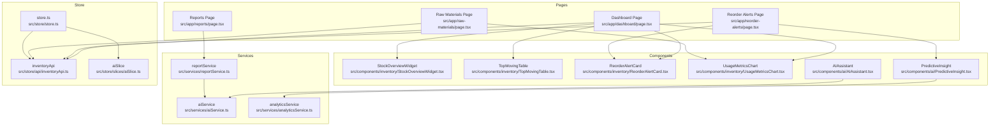
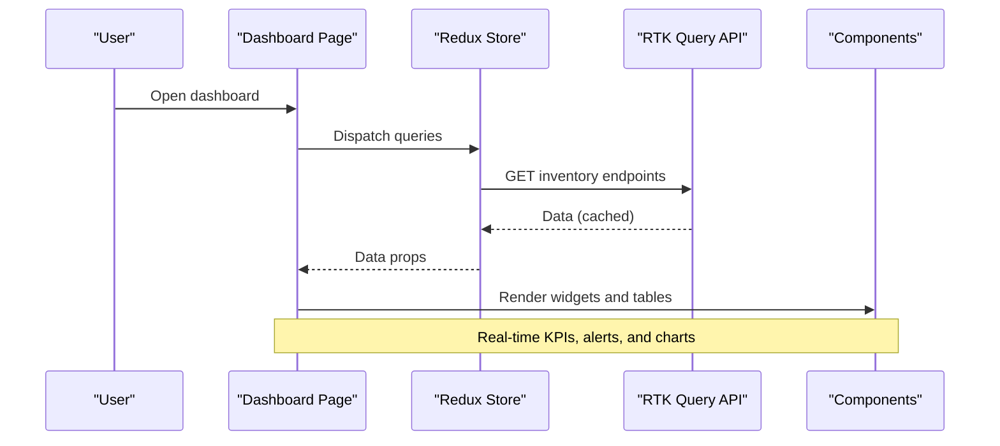
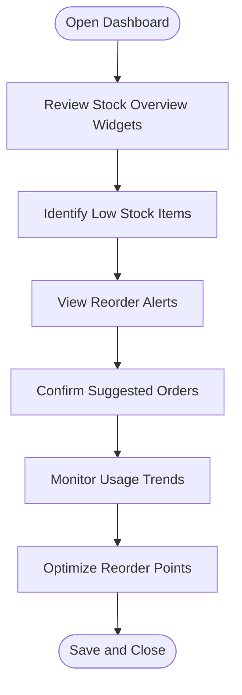
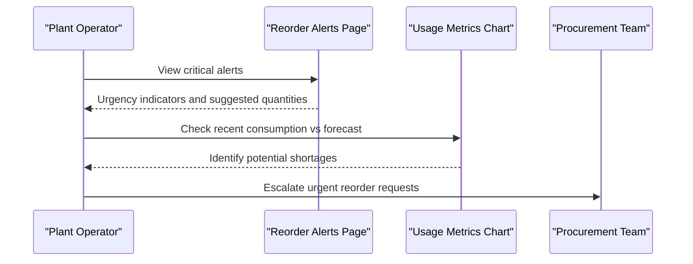
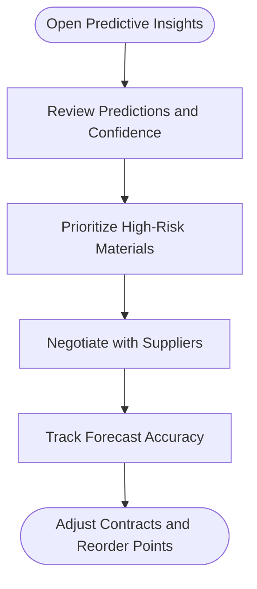
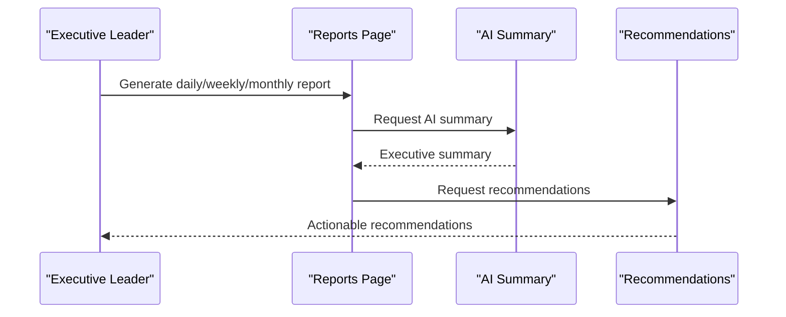
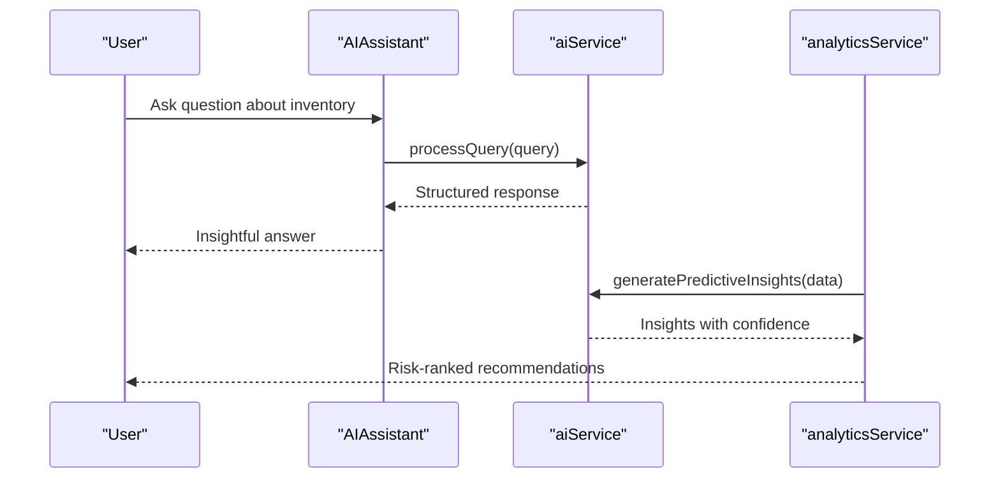
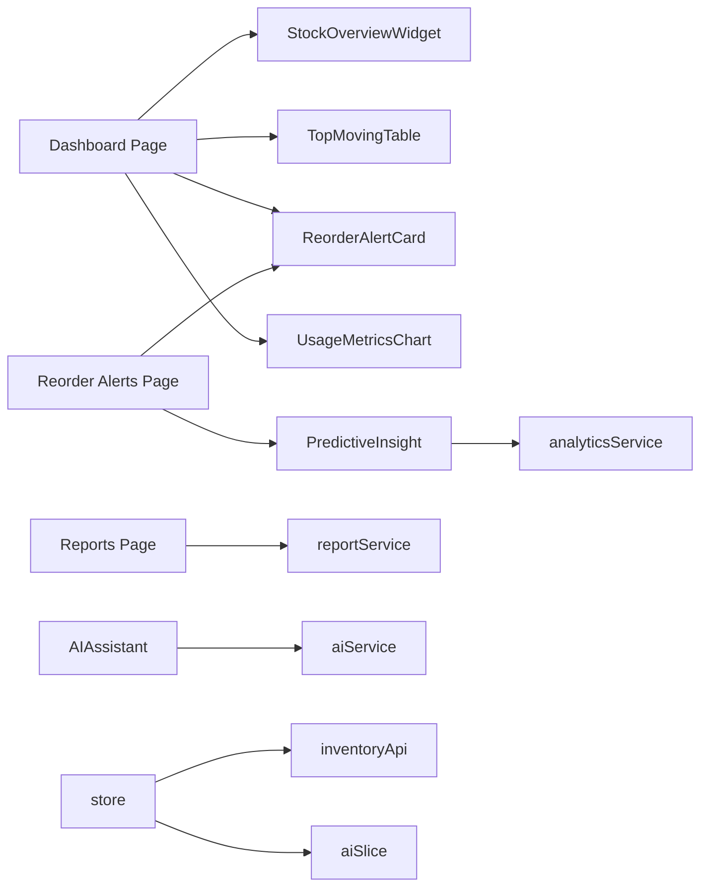

# Target Audience and Use Cases

<cite>
**Referenced Files in This Document**
- [README.md](file://README.md)
- [dashboard/page.tsx](file://src/app/dashboard/page.tsx)
- [reorder-alerts/page.tsx](file://src/app/reorder-alerts/page.tsx)
- [reports/page.tsx](file://src/app/reports/page.tsx)
- [raw-materials/page.tsx](file://src/app/raw-materials/page.tsx)
- [StockOverviewWidget.tsx](file://src/components/inventory/StockOverviewWidget.tsx)
- [ReorderAlertCard.tsx](file://src/components/inventory/ReorderAlertCard.tsx)
- [TopMovingTable.tsx](file://src/components/inventory/TopMovingTable.tsx)
- [UsageMetricsChart.tsx](file://src/components/inventory/UsageMetricsChart.tsx)
- [AIAssistant.tsx](file://src/components/ai/AIAssistant.tsx)
- [PredictiveInsight.tsx](file://src/components/ai/PredictiveInsight.tsx)
- [inventoryApi.ts](file://src/store/api/inventoryApi.ts)
- [aiService.ts](file://src/services/aiService.ts)
- [analyticsService.ts](file://src/services/analyticsService.ts)
- [reportService.ts](file://src/services/reportService.ts)
- [store.ts](file://src/store/store.ts)
- [aiSlice.ts](file://src/store/slices/aiSlice.ts)
</cite>

## Table of Contents
1. [Introduction](#introduction)
2. [Project Structure](#project-structure)
3. [Core Components](#core-components)
4. [Architecture Overview](#architecture-overview)
5. [Detailed Component Analysis](#detailed-component-analysis)
6. [Dependency Analysis](#dependency-analysis)
7. [Performance Considerations](#performance-considerations)
8. [Troubleshooting Guide](#troubleshooting-guide)
9. [Conclusion](#conclusion)
10. [Appendices](#appendices)

## Introduction
This document defines the target audience and use cases for the AI-powered inventory management dashboard. It identifies primary users—inventory managers, plant operators, procurement specialists, and executive leadership—and describes how each role leverages the dashboard to monitor stock, receive alerts, track usage, and make data-driven decisions. It also outlines typical workflows such as morning stock checks, afternoon reorder confirmations, and weekly performance reviews, and quantifies business value including reduced inventory costs, minimized stockouts, improved operational efficiency, and enhanced decision-making.

## Project Structure
The dashboard is a Next.js application organized around feature-focused pages and shared UI components. Key areas include:
- Dashboard overview with stock widgets, top-moving materials, reorder alerts, and usage charts
- Dedicated pages for reorder alerts, raw materials, and reports
- AI assistant for conversational insights
- Predictive insights powered by analytics and AI services
- Redux store integrating RTK Query APIs and AI state

**Diagram sources**
- [dashboard/page.tsx:17-127](file://src/app/dashboard/page.tsx#L17-L127)
- [reorder-alerts/page.tsx:11-43](file://src/app/reorder-alerts/page.tsx#L11-L43)
- [raw-materials/page.tsx:9-37](file://src/app/raw-materials/page.tsx#L9-L37)
- [reports/page.tsx:14-95](file://src/app/reports/page.tsx#L14-L95)
- [StockOverviewWidget.tsx:16-56](file://src/components/inventory/StockOverviewWidget.tsx#L16-L56)
- [TopMovingTable.tsx:19-107](file://src/components/inventory/TopMovingTable.tsx#L19-L107)
- [ReorderAlertCard.tsx:19-104](file://src/components/inventory/ReorderAlertCard.tsx#L19-L104)
- [UsageMetricsChart.tsx:47-159](file://src/components/inventory/UsageMetricsChart.tsx#L47-L159)
- [AIAssistant.tsx:23-119](file://src/components/ai/AIAssistant.tsx#L23-L119)
- [PredictiveInsight.tsx:29-151](file://src/components/ai/PredictiveInsight.tsx#L29-L151)
- [inventoryApi.ts:23-49](file://src/store/api/inventoryApi.ts#L23-L49)
- [aiService.ts:18-218](file://src/services/aiService.ts#L18-L218)
- [analyticsService.ts:13-133](file://src/services/analyticsService.ts#L13-L133)
- [reportService.ts:18-170](file://src/services/reportService.ts#L18-L170)
- [store.ts:7-16](file://src/store/store.ts#L7-L16)
- [aiSlice.ts:17-55](file://src/store/slices/aiSlice.ts#L17-L55)

**Section sources**
- [README.md:1-37](file://README.md#L1-L37)
- [dashboard/page.tsx:17-127](file://src/app/dashboard/page.tsx#L17-L127)

## Core Components
- Dashboard overview displays stock KPIs, top-moving materials, reorder alerts, and usage metrics.
- Reorder Alerts page centralizes urgency-based alerts and predictive insights.
- Raw Materials page focuses on usage metrics and consumption patterns.
- Reports page automates executive summaries and actionable recommendations.
- AI Assistant enables conversational queries about inventory, trends, and forecasts.
- Predictive Insights surface machine-learning–based demand forecasts and risk-ranked recommendations.
- Services integrate AI, analytics, and reporting to enrich dashboards with contextual insights.

**Section sources**
- [dashboard/page.tsx:17-127](file://src/app/dashboard/page.tsx#L17-L127)
- [reorder-alerts/page.tsx:11-43](file://src/app/reorder-alerts/page.tsx#L11-L43)
- [raw-materials/page.tsx:9-37](file://src/app/raw-materials/page.tsx#L9-L37)
- [reports/page.tsx:14-95](file://src/app/reports/page.tsx#L14-L95)
- [AIAssistant.tsx:23-119](file://src/components/ai/AIAssistant.tsx#L23-L119)
- [PredictiveInsight.tsx:29-151](file://src/components/ai/PredictiveInsight.tsx#L29-L151)

## Architecture Overview
The dashboard integrates UI components with Redux RTK Query APIs and backend services. AI and analytics services augment inventory data with predictive insights and executive summaries. The store orchestrates API caching and AI state.

**Diagram sources**
- [dashboard/page.tsx:17-127](file://src/app/dashboard/page.tsx#L17-L127)
- [inventoryApi.ts:23-49](file://src/store/api/inventoryApi.ts#L23-L49)
- [store.ts:7-16](file://src/store/store.ts#L7-L16)

## Detailed Component Analysis

### Inventory Managers
Primary responsibilities:
- Daily stock monitoring via overview widgets and top-moving materials
- Reorder planning using urgency-based alerts and suggested quantities
- Inventory optimization through usage trends and turnover metrics

Typical workflows:
- Morning stock checks: review total materials, low stock items, pending orders, and turnover rate to identify immediate actions.
- Afternoon reorder confirmations: consult reorder alerts, confirm suggested order quantities, and update statuses.
- Weekly performance reviews: analyze usage metrics and turnover trends to adjust reorder points and categorize materials.

**Diagram sources**
- [dashboard/page.tsx:49-84](file://src/app/dashboard/page.tsx#L49-L84)
- [StockOverviewWidget.tsx:16-56](file://src/components/inventory/StockOverviewWidget.tsx#L16-L56)
- [ReorderAlertCard.tsx:19-104](file://src/components/inventory/ReorderAlertCard.tsx#L19-L104)
- [TopMovingTable.tsx:19-107](file://src/components/inventory/TopMovingTable.tsx#L19-L107)

**Section sources**
- [dashboard/page.tsx:49-124](file://src/app/dashboard/page.tsx#L49-L124)
- [StockOverviewWidget.tsx:16-56](file://src/components/inventory/StockOverviewWidget.tsx#L16-L56)
- [ReorderAlertCard.tsx:19-104](file://src/components/inventory/ReorderAlertCard.tsx#L19-L104)
- [TopMovingTable.tsx:19-107](file://src/components/inventory/TopMovingTable.tsx#L19-L107)

### Plant Operators
Primary benefits:
- Real-time alerts for low stock and critical items
- Usage tracking to anticipate material needs during shifts
- Operational insights to align production scheduling with inventory availability

Typical workflows:
- Shift start: check reorder alerts for critical materials and confirm readiness.
- Mid-shift: monitor usage metrics to predict short-term consumption and notify procurement if thresholds are approached.
- Shift end: log observations and flag anomalies for review.

**Diagram sources**
- [reorder-alerts/page.tsx:11-43](file://src/app/reorder-alerts/page.tsx#L11-L43)
- [ReorderAlertCard.tsx:19-104](file://src/components/inventory/ReorderAlertCard.tsx#L19-L104)
- [UsageMetricsChart.tsx:47-159](file://src/components/inventory/UsageMetricsChart.tsx#L47-L159)

**Section sources**
- [reorder-alerts/page.tsx:11-43](file://src/app/reorder-alerts/page.tsx#L11-L43)
- [UsageMetricsChart.tsx:47-159](file://src/components/inventory/UsageMetricsChart.tsx#L47-L159)

### Procurement Specialists
Primary responsibilities:
- Strategic purchasing decisions using predictive analytics and confidence scores
- Supplier relationship management through demand forecasts and reorder recommendations
- Continuous monitoring of predicted demand and risk levels

Typical workflows:
- Early-week planning: review predictive insights and confidence levels to prioritize purchases.
- Mid-week confirmations: validate suggested quantities against supplier lead times and pricing.
- Month-end reviews: assess forecast accuracy and supplier performance to refine contracts.

**Diagram sources**
- [PredictiveInsight.tsx:29-151](file://src/components/ai/PredictiveInsight.tsx#L29-L151)
- [analyticsService.ts:17-41](file://src/services/analyticsService.ts#L17-L41)

**Section sources**
- [PredictiveInsight.tsx:29-151](file://src/components/ai/PredictiveInsight.tsx#L29-L151)
- [analyticsService.ts:17-41](file://src/services/analyticsService.ts#L17-L41)

### Executive Leadership
Primary responsibilities:
- Performance monitoring through executive summaries and KPIs
- Capacity planning using demand forecasts and turnover metrics
- Operational efficiency reporting with recommendations

Typical workflows:
- Daily briefings: review AI-generated summaries and key metrics.
- Weekly reviews: analyze trends, forecast accuracy, and recommendations.
- Monthly planning: evaluate cost savings, stock accuracy improvements, and strategic adjustments.

**Diagram sources**
- [reports/page.tsx:14-95](file://src/app/reports/page.tsx#L14-L95)
- [reportService.ts:22-42](file://src/services/reportService.ts#L22-L42)
- [aiService.ts:129-172](file://src/services/aiService.ts#L129-L172)

**Section sources**
- [reports/page.tsx:14-95](file://src/app/reports/page.tsx#L14-L95)
- [reportService.ts:22-42](file://src/services/reportService.ts#L22-L42)
- [aiService.ts:129-172](file://src/services/aiService.ts#L129-L172)

### Conversational AI and Predictive Insights
- AI Assistant processes natural language queries to provide contextual insights on inventory, trends, and forecasts.
- Predictive Insights use machine learning to rank risk and recommend actions based on confidence levels.

**Diagram sources**
- [AIAssistant.tsx:23-119](file://src/components/ai/AIAssistant.tsx#L23-L119)
- [aiService.ts:33-74](file://src/services/aiService.ts#L33-L74)
- [analyticsService.ts:26-41](file://src/services/analyticsService.ts#L26-L41)

**Section sources**
- [AIAssistant.tsx:23-119](file://src/components/ai/AIAssistant.tsx#L23-L119)
- [aiService.ts:33-74](file://src/services/aiService.ts#L33-L74)
- [analyticsService.ts:26-41](file://src/services/analyticsService.ts#L26-L41)

## Dependency Analysis
The dashboard relies on a clean separation of concerns:
- Pages depend on components and RTK Query hooks
- Components consume data from the Redux store
- Services encapsulate AI, analytics, and reporting logic
- The store integrates RTK Query and AI state slices

**Diagram sources**
- [dashboard/page.tsx:17-127](file://src/app/dashboard/page.tsx#L17-L127)
- [reorder-alerts/page.tsx:11-43](file://src/app/reorder-alerts/page.tsx#L11-L43)
- [reports/page.tsx:14-95](file://src/app/reports/page.tsx#L14-L95)
- [AIAssistant.tsx:23-119](file://src/components/ai/AIAssistant.tsx#L23-L119)
- [PredictiveInsight.tsx:29-151](file://src/components/ai/PredictiveInsight.tsx#L29-L151)
- [inventoryApi.ts:23-49](file://src/store/api/inventoryApi.ts#L23-L49)
- [store.ts:7-16](file://src/store/store.ts#L7-L16)
- [aiSlice.ts:17-55](file://src/store/slices/aiSlice.ts#L17-L55)
- [aiService.ts:18-218](file://src/services/aiService.ts#L18-L218)
- [analyticsService.ts:13-133](file://src/services/analyticsService.ts#L13-L133)
- [reportService.ts:18-170](file://src/services/reportService.ts#L18-L170)

**Section sources**
- [store.ts:7-16](file://src/store/store.ts#L7-L16)
- [inventoryApi.ts:23-49](file://src/store/api/inventoryApi.ts#L23-L49)
- [aiSlice.ts:17-55](file://src/store/slices/aiSlice.ts#L17-L55)

## Performance Considerations
- API caching: RTK Query caches inventory data to minimize network requests and improve responsiveness.
- Component-level loading states: Progress indicators and error alerts ensure smooth user experience during data fetches.
- Predictive insights and reports: AI and analytics calls are asynchronous to avoid blocking the UI.
- Recommendation: Keep cache durations aligned with data freshness requirements; adjust based on operational cadence.

[No sources needed since this section provides general guidance]

## Troubleshooting Guide
Common issues and resolutions:
- Loading delays: Verify API endpoints and network connectivity; check loading states in components.
- Empty or stale data: Confirm cache invalidation and refresh intervals; inspect API responses.
- AI query errors: Validate AI service credentials and endpoint configuration; review error handling in the AI assistant.
- Predictive insights failures: Ensure analytics service can reach data sources; fall back to mock predictions when necessary.
- Report generation errors: Confirm AI summary generation and recommendation parsing; use fallback summaries when needed.

**Section sources**
- [UsageMetricsChart.tsx:53-63](file://src/components/inventory/UsageMetricsChart.tsx#L53-L63)
- [AIAssistant.tsx:40-46](file://src/components/ai/AIAssistant.tsx#L40-L46)
- [analyticsService.ts:37-41](file://src/services/analyticsService.ts#L37-L41)
- [reportService.ts:38-42](file://src/services/reportService.ts#L38-L42)

## Conclusion
The AI-powered inventory management dashboard delivers targeted value to inventory managers, plant operators, procurement specialists, and executive leadership. By combining real-time stock visibility, urgency-based alerts, predictive analytics, and AI-driven insights, the platform reduces inventory costs, minimizes stockouts, improves operational efficiency, and enhances decision-making across all levels of the organization.

[No sources needed since this section summarizes without analyzing specific files]

## Appendices

### Business Value Outcomes
- Reduced inventory holding costs through optimized reorder points and turnover improvements
- Minimized stockouts via real-time alerts and predictive replenishment
- Improved operational efficiency by aligning production schedules with inventory availability
- Enhanced decision-making with AI-generated summaries, forecasts, and recommendations

[No sources needed since this section provides general guidance]