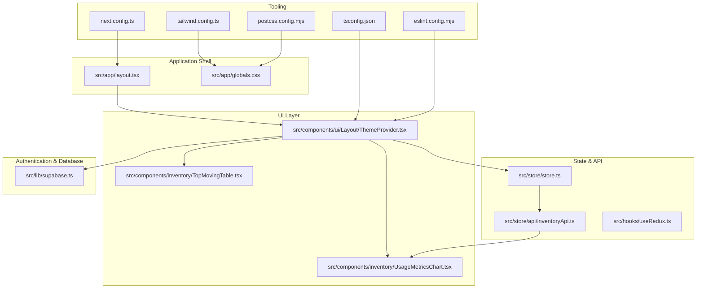
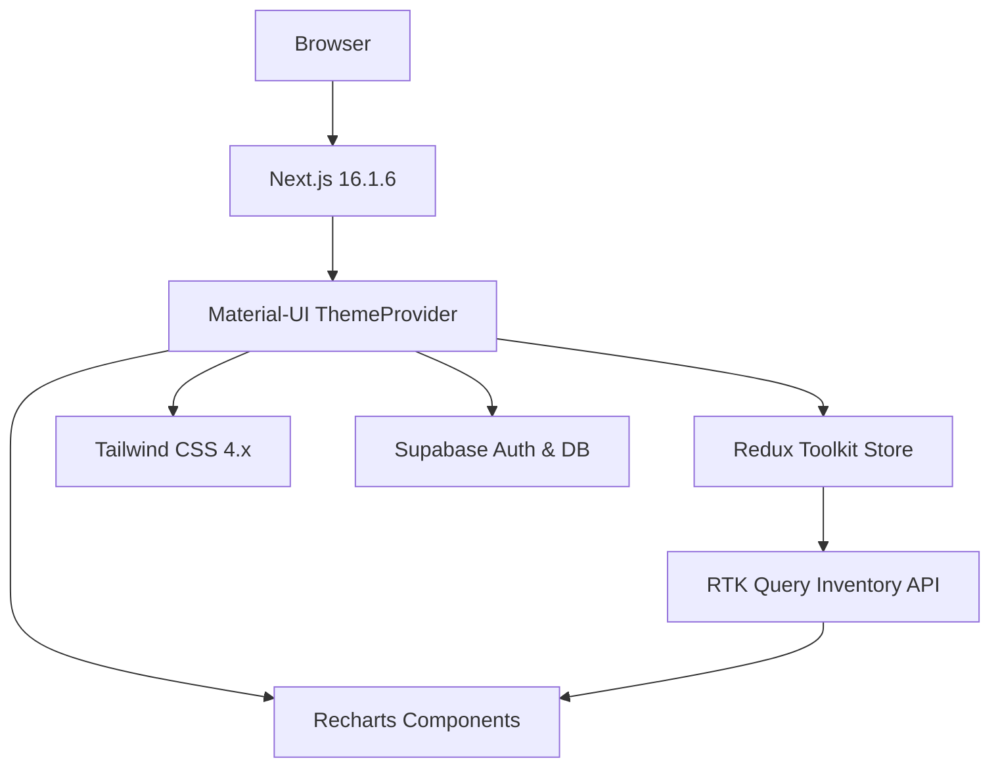
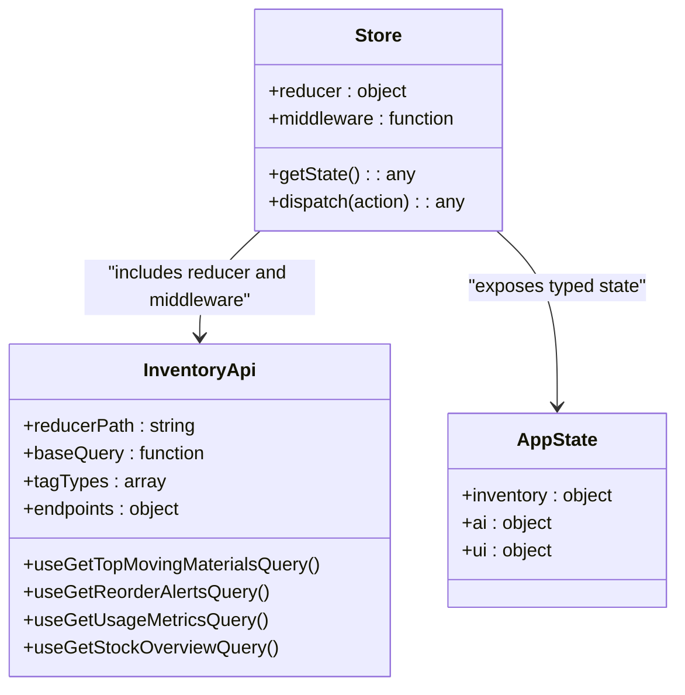
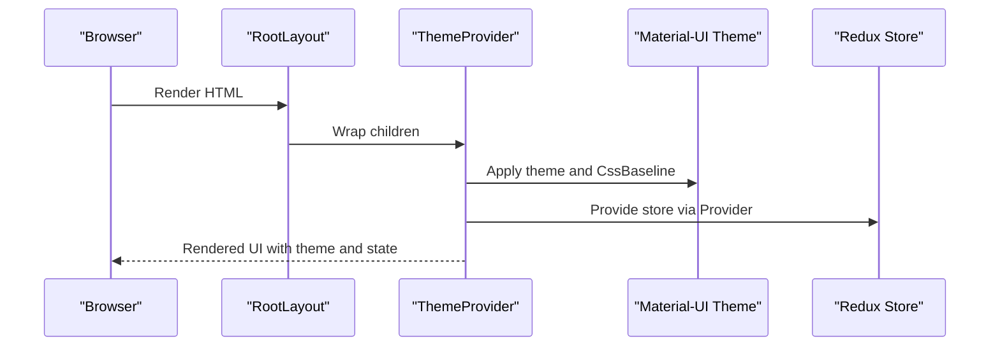
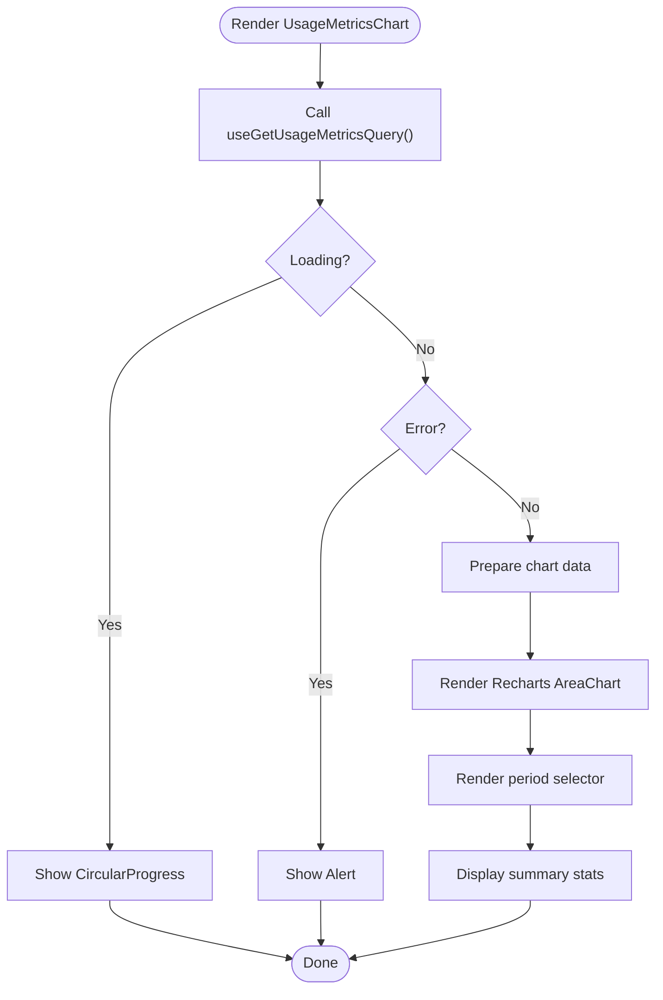
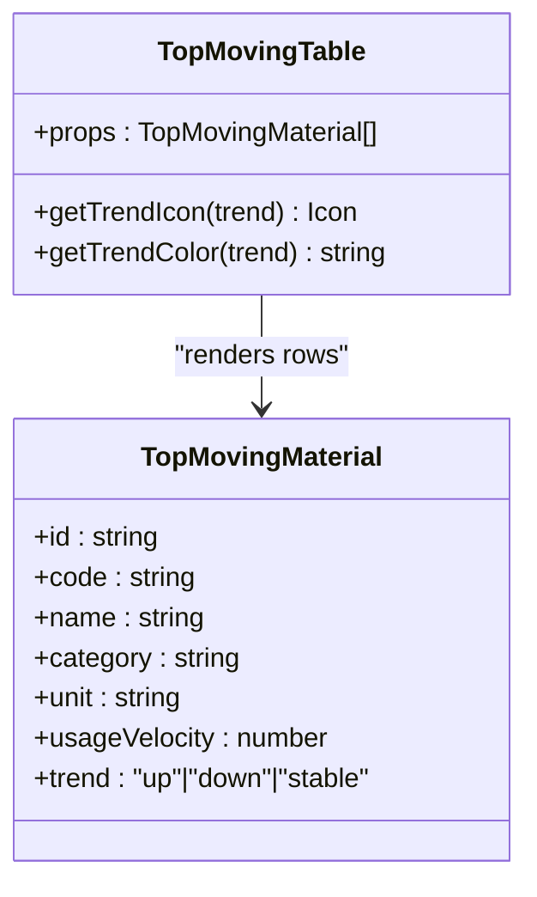
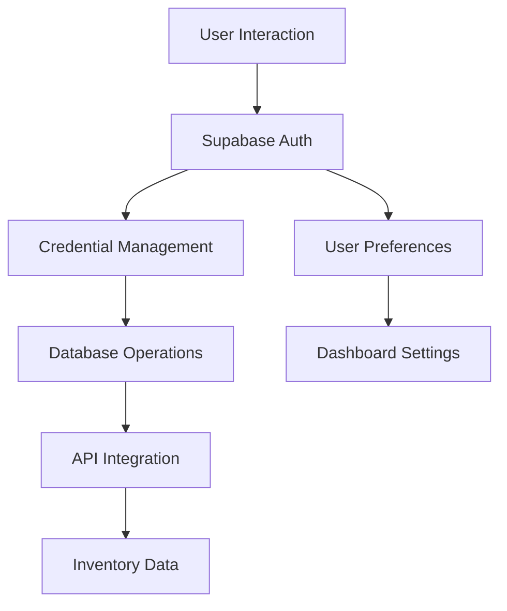
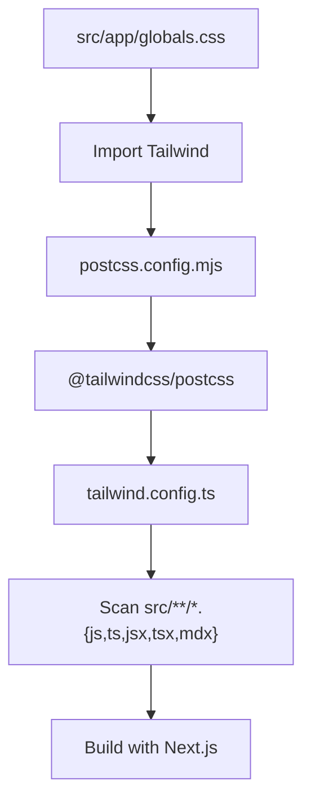
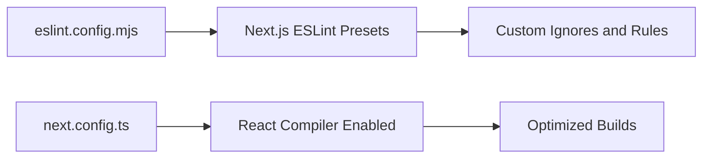
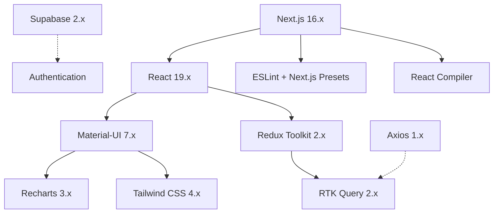

# Technology Stack

<cite>
**Referenced Files in This Document**
- [package.json](file://package.json)
- [next.config.ts](file://next.config.ts)
- [tsconfig.json](file://tsconfig.json)
- [tailwind.config.ts](file://tailwind.config.ts)
- [postcss.config.mjs](file://postcss.config.mjs)
- [eslint.config.mjs](file://eslint.config.mjs)
- [src/app/layout.tsx](file://src/app/layout.tsx)
- [src/app/globals.css](file://src/app/globals.css)
- [src/components/ui/Layout/ThemeProvider.tsx](file://src/components/ui/Layout/ThemeProvider.tsx)
- [src/store/store.ts](file://src/store/store.ts)
- [src/store/api/inventoryApi.ts](file://src/store/api/inventoryApi.ts)
- [src/hooks/useRedux.ts](file://src/hooks/useRedux.ts)
- [src/components/inventory/UsageMetricsChart.tsx](file://src/components/inventory/UsageMetricsChart.tsx)
- [src/components/inventory/TopMovingTable.tsx](file://src/components/inventory/TopMovingTable.tsx)
- [src/lib/supabase.ts](file://src/lib/supabase.ts)
</cite>

## Update Summary
**Changes Made**
- Updated core technology versions to reflect Next.js 16.1.6, React 19.2.3, Material-UI 7.3.9, Redux Toolkit 2.11.2, and Recharts 3.8.0
- Added comprehensive Supabase integration documentation for authentication and user management
- Enhanced TypeScript configuration details and module resolution settings
- Updated Tailwind CSS v4 integration with PostCSS plugin configuration
- Expanded development tooling section with ESLint Next.js presets and React Compiler

## Table of Contents
1. [Introduction](#introduction)
2. [Project Structure](#project-structure)
3. [Core Technologies](#core-technologies)
4. [Architecture Overview](#architecture-overview)
5. [Detailed Component Analysis](#detailed-component-analysis)
6. [Dependency Analysis](#dependency-analysis)
7. [Performance Considerations](#performance-considerations)
8. [Troubleshooting Guide](#troubleshooting-guide)
9. [Conclusion](#conclusion)

## Introduction
This document presents the technology stack powering the AI-powered inventory management dashboard. It focuses on the frontend architecture and technologies, including the React framework (Next.js 16.1.6), type safety (TypeScript 5.x), UI components (React 19.2.3 and Material-UI 7.3.9), state management (Redux Toolkit 2.11.2), API data fetching (RTK Query 2.11.2), data visualization (Recharts 3.8.0), styling (Tailwind CSS 4.x), and HTTP client (Axios 1.13.6). The stack also incorporates Supabase 2.99.1 for authentication and user management, alongside modern development tools including ESLint configuration, PostCSS integration, and Next.js React Compiler optimization. Version compatibility and upgrade considerations are included to guide maintainers and contributors.

## Project Structure
The project follows a conventional Next.js 13+ App Router structure with a clear separation of concerns:
- Application shell and global styles under src/app
- Shared UI components under src/components
- Store and API integrations under src/store
- Authentication and database client under src/lib
- Services for analytics and external integrations under src/services
- Utilities and libraries under src/utils and src/lib
- Global CSS and Tailwind configuration under src/app and root configs

**Diagram sources**
- [src/app/layout.tsx:1-31](file://src/app/layout.tsx#L1-L31)
- [src/app/globals.css:1-27](file://src/app/globals.css#L1-L27)
- [src/components/ui/Layout/ThemeProvider.tsx:1-100](file://src/components/ui/Layout/ThemeProvider.tsx#L1-L100)
- [src/components/inventory/UsageMetricsChart.tsx:1-161](file://src/components/inventory/UsageMetricsChart.tsx#L1-L161)
- [src/components/inventory/TopMovingTable.tsx:1-98](file://src/components/inventory/TopMovingTable.tsx#L1-L98)
- [src/store/store.ts:1-27](file://src/store/store.ts#L1-L27)
- [src/store/api/inventoryApi.ts:1-57](file://src/store/api/inventoryApi.ts#L1-L57)
- [src/hooks/useRedux.ts:1-6](file://src/hooks/useRedux.ts#L1-L6)
- [src/lib/supabase.ts:1-21](file://src/lib/supabase.ts#L1-L21)
- [next.config.ts:1-9](file://next.config.ts#L1-L9)
- [tsconfig.json:1-35](file://tsconfig.json#L1-L35)
- [tailwind.config.ts:1-46](file://tailwind.config.ts#L1-L46)
- [postcss.config.mjs:1-8](file://postcss.config.mjs#L1-L8)
- [eslint.config.mjs:1-19](file://eslint.config.mjs#L1-L19)

**Section sources**
- [src/app/layout.tsx:1-31](file://src/app/layout.tsx#L1-L31)
- [src/app/globals.css:1-27](file://src/app/globals.css#L1-L27)
- [next.config.ts:1-9](file://next.config.ts#L1-L9)
- [tsconfig.json:1-35](file://tsconfig.json#L1-L35)
- [tailwind.config.ts:1-46](file://tailwind.config.ts#L1-L46)
- [postcss.config.mjs:1-8](file://postcss.config.mjs#L1-L8)
- [eslint.config.mjs:1-19](file://eslint.config.mjs#L1-L19)

## Core Technologies
This section documents the frontend technologies and their roles in the architecture.

- Next.js 16.1.6
  - React framework providing the application shell, routing, and SSR/SSG capabilities.
  - React Compiler enabled for improved performance and optimized component compilation.
  - ESLint Next.js configuration ensures linting consistency across the codebase.

- TypeScript 5.x
  - Strict type checking for safer development and better developer experience.
  - Bundler module resolution and isolated modules configured for modern builds.
  - Path aliases configured for clean import statements (@/*).

- React 19.2.3 and React DOM 19.2.3
  - Latest React features with concurrent rendering and React Compiler optimization.
  - Integrated with Redux via react-redux for predictable state management.

- Redux Toolkit 2.11.2 and react-redux 9.2.0
  - Centralized state management with typed hooks for selectors and dispatch.
  - Store configured with RTK Query middleware for API caching and normalization.

- Material-UI 7.3.9
  - Comprehensive design system providing themed components (buttons, cards, forms, tooltips).
  - Unified theming via ThemeProvider with palette, typography, and component overrides.
  - Emotion-based styling for optimal performance and SSR support.

- RTK Query 2.11.2
  - Declarative API layer built on Redux Toolkit.
  - Provides caching, invalidation, and normalized data for inventory endpoints.
  - Automatic refetching and background updates for real-time data.

- Recharts 3.8.0
  - Advanced data visualization library for charts and responsive containers.
  - Used for usage metrics, forecasting visualizations, and dashboard analytics.
  - Supports complex chart types with customizable themes and animations.

- Tailwind CSS 4.x with @tailwindcss/postcss 4
  - Utility-first CSS framework integrated via PostCSS plugin.
  - Globally scoped styles and theme customization for consistent design tokens.
  - Modern CSS features with @theme directive support.

- Axios 1.13.6
  - HTTP client used for outbound requests and API communication.
  - Complements RTK Query for direct HTTP needs and custom request handling.

- Supabase 2.99.1
  - Real-time database and authentication platform for user management.
  - Provides secure credential storage and user preference management.
  - Separates authentication concerns from inventory data processing.

- Development Tools
  - ESLint with Next.js core-web-vitals and TypeScript configurations.
  - PostCSS pipeline integrating Tailwind utilities with modern CSS features.
  - Next.js React Compiler enabled for build-time optimizations.

Version compatibility highlights:
- Next.js 16.1.6 aligns with ESLint Next.js configuration and React 19.x ecosystem.
- React 19.x and Redux Toolkit 2.x are compatible with modern bundlers and module resolutions.
- Material-UI 7.x supports the latest React features and theming APIs.
- Tailwind CSS 4.x integrates via PostCSS plugin; requires Node.js LTS compatibility.
- Supabase 2.x provides stable authentication and real-time database features.

Upgrade considerations:
- Keep Next.js aligned with ESLint Next.js config to avoid lint mismatches.
- Upgrade React and ReactDOM together; verify Redux Toolkit and react-redux compatibility.
- Material-UI 7.x requires React 18+; confirm React 19 compatibility before upgrading.
- Tailwind 4.x requires PostCSS plugin updates; test build pipeline after upgrades.
- RTK Query 2.x maintains backward compatibility; review breaking changes in minor releases.
- Supabase major version upgrades require environment variable validation.

**Section sources**
- [package.json:1-39](file://package.json#L1-L39)
- [next.config.ts:1-9](file://next.config.ts#L1-L9)
- [tsconfig.json:1-35](file://tsconfig.json#L1-L35)
- [tailwind.config.ts:1-46](file://tailwind.config.ts#L1-L46)
- [postcss.config.mjs:1-8](file://postcss.config.mjs#L1-L8)
- [eslint.config.mjs:1-19](file://eslint.config.mjs#L1-L19)

## Architecture Overview
The frontend architecture centers around a theme provider that wraps the application, connecting Material-UI theming, Redux state, and shared UI components. RTK Query manages inventory data fetching and caching, while Recharts renders visualizations. Supabase handles authentication and user management separately from inventory data processing. Tailwind CSS provides utility-first styling, and ESLint/PostCSS support the development workflow with React Compiler optimization.

**Diagram sources**
- [src/components/ui/Layout/ThemeProvider.tsx:1-100](file://src/components/ui/Layout/ThemeProvider.tsx#L1-L100)
- [src/store/store.ts:1-27](file://src/store/store.ts#L1-L27)
- [src/store/api/inventoryApi.ts:1-57](file://src/store/api/inventoryApi.ts#L1-L57)
- [src/components/inventory/UsageMetricsChart.tsx:1-161](file://src/components/inventory/UsageMetricsChart.tsx#L1-L161)
- [src/app/globals.css:1-27](file://src/app/globals.css#L1-L27)
- [src/lib/supabase.ts:1-21](file://src/lib/supabase.ts#L1-L21)

## Detailed Component Analysis

### State Management with Redux Toolkit and RTK Query
The store composes domain-specific reducers and integrates RTK Query's reducer and middleware. The inventory API defines typed endpoints for top-moving materials, reorder alerts, usage metrics, and stock overview. Components consume queries via generated hook exports, enabling automatic caching and refetching with intelligent data invalidation.

**Diagram sources**
- [src/store/store.ts:1-27](file://src/store/store.ts#L1-L27)
- [src/store/api/inventoryApi.ts:1-57](file://src/store/api/inventoryApi.ts#L1-L57)

**Section sources**
- [src/store/store.ts:1-27](file://src/store/store.ts#L1-L27)
- [src/store/api/inventoryApi.ts:1-57](file://src/store/api/inventoryApi.ts#L1-L57)
- [src/hooks/useRedux.ts:1-6](file://src/hooks/useRedux.ts#L1-L6)

### Material-UI Theming and Layout
The ThemeProvider encapsulates the application with a unified theme, palette, typography, and component overrides. It also wires the Redux store for global state access. The root layout applies the Inter font and global CSS, ensuring consistent styling across pages with support for dark mode and responsive design.

**Diagram sources**
- [src/app/layout.tsx:1-31](file://src/app/layout.tsx#L1-L31)
- [src/components/ui/Layout/ThemeProvider.tsx:1-100](file://src/components/ui/Layout/ThemeProvider.tsx#L1-L100)
- [src/store/store.ts:1-27](file://src/store/store.ts#L1-L27)

**Section sources**
- [src/app/layout.tsx:1-31](file://src/app/layout.tsx#L1-L31)
- [src/components/ui/Layout/ThemeProvider.tsx:1-100](file://src/components/ui/Layout/ThemeProvider.tsx#L1-L100)

### Data Visualization with Recharts
The UsageMetricsChart component demonstrates fetching usage metrics via RTK Query, rendering area charts with Recharts, and providing interactive controls for period selection. Material-UI components (Card, Typography, Select) integrate seamlessly with chart visuals, supporting both weekly and monthly data visualization with gradient fills and responsive containers.

**Diagram sources**
- [src/components/inventory/UsageMetricsChart.tsx:1-161](file://src/components/inventory/UsageMetricsChart.tsx#L1-L161)
- [src/store/api/inventoryApi.ts:1-57](file://src/store/api/inventoryApi.ts#L1-L57)

**Section sources**
- [src/components/inventory/UsageMetricsChart.tsx:1-161](file://src/components/inventory/UsageMetricsChart.tsx#L1-L161)
- [src/store/api/inventoryApi.ts:1-57](file://src/store/api/inventoryApi.ts#L1-L57)

### UI Components and Material-UI Integration
TopMovingTable showcases Material-UI components (Table, TableRow, TableCell, Chip, Icons) to present structured inventory data with trend indicators. The component leverages theme-provided colors and spacing for consistent UX, supporting hover effects and responsive design for different screen sizes.

**Diagram sources**
- [src/components/inventory/TopMovingTable.tsx:1-98](file://src/components/inventory/TopMovingTable.tsx#L1-L98)
- [src/store/api/inventoryApi.ts:3-21](file://src/store/api/inventoryApi.ts#L3-L21)

**Section sources**
- [src/components/inventory/TopMovingTable.tsx:1-98](file://src/components/inventory/TopMovingTable.tsx#L1-L98)
- [src/store/api/inventoryApi.ts:3-21](file://src/store/api/inventoryApi.ts#L3-L21)

### Authentication and Database Integration with Supabase
Supabase provides comprehensive authentication and user management capabilities, handling user credentials, preferences, and API key security. The client is configured with environment variables for secure deployment, separating authentication concerns from inventory data processing handled by n8n webhooks.

**Diagram sources**
- [src/lib/supabase.ts:1-21](file://src/lib/supabase.ts#L1-L21)

**Section sources**
- [src/lib/supabase.ts:1-21](file://src/lib/supabase.ts#L1-L21)

### Styling Pipeline with Tailwind CSS and PostCSS
Global styles import Tailwind directives, and the PostCSS configuration enables the Tailwind plugin. Tailwind content scanning targets app, components, and pages directories. Theme customization extends colors and fonts for consistent design tokens, with support for dark mode and modern CSS features.

**Diagram sources**
- [src/app/globals.css:1-27](file://src/app/globals.css#L1-L27)
- [postcss.config.mjs:1-8](file://postcss.config.mjs#L1-L8)
- [tailwind.config.ts:1-46](file://tailwind.config.ts#L1-L46)

**Section sources**
- [src/app/globals.css:1-27](file://src/app/globals.css#L1-L27)
- [postcss.config.mjs:1-8](file://postcss.config.mjs#L1-L8)
- [tailwind.config.ts:1-46](file://tailwind.config.ts#L1-L46)

### Development Tooling
ESLint configuration composes Next.js core-web-vitals and TypeScript presets, overriding defaults to include generated types and app directories. Next.js React Compiler is enabled for build-time optimizations, providing automatic component optimization and improved performance.

**Diagram sources**
- [eslint.config.mjs:1-19](file://eslint.config.mjs#L1-L19)
- [next.config.ts:1-9](file://next.config.ts#L1-L9)

**Section sources**
- [eslint.config.mjs:1-19](file://eslint.config.mjs#L1-L19)
- [next.config.ts:1-9](file://next.config.ts#L1-L9)

## Dependency Analysis
The frontend stack exhibits cohesive coupling around the theme provider and store, with RTK Query mediating API interactions. Material-UI and Recharts depend on React and Redux for state-driven rendering. Supabase provides authentication and database services independently. Tailwind CSS and PostCSS provide styling infrastructure. Axios complements RTK Query for direct HTTP needs.

**Diagram sources**
- [package.json:11-26](file://package.json#L11-L26)
- [next.config.ts:1-9](file://next.config.ts#L1-L9)
- [eslint.config.mjs:1-19](file://eslint.config.mjs#L1-L19)

**Section sources**
- [package.json:11-26](file://package.json#L11-L26)
- [next.config.ts:1-9](file://next.config.ts#L1-L9)
- [eslint.config.mjs:1-19](file://eslint.config.mjs#L1-L19)

## Performance Considerations
- Next.js React Compiler: Enabled in configuration to optimize component compilation during builds.
- RTK Query Caching: Endpoints specify cache retention windows to reduce redundant network calls.
- Material-UI Theming: Centralized theme reduces runtime style computations and improves render consistency.
- Tailwind CSS: Purgeable utilities and minimal runtime styles improve bundle sizes; ensure content paths are accurate.
- Type Safety: TypeScript strict mode and bundler configuration help catch performance-related issues early.
- Supabase Optimization: Environment-based configuration for secure and efficient database operations.
- Component-Level Caching: Recharts components benefit from React's memoization and RTK Query's caching strategy.

## Troubleshooting Guide
Common issues and remedies:
- ThemeProvider not applied: Verify ThemeProvider wraps children in the root layout and that the store is passed to the Provider.
- RTK Query cache not updating: Confirm endpoint tag types and invalidation strategies; check keepUnusedDataFor settings.
- Material-UI styles missing: Ensure CssBaseline is included and Tailwind content paths scan the relevant directories.
- ESLint errors with Next.js: Align ESLint Next.js preset versions with Next.js; adjust overrides for generated types.
- Build failures with Tailwind 4.x: Confirm PostCSS plugin is installed and configured; validate content globs.
- Supabase authentication issues: Verify environment variables are properly set; check CORS settings and database policies.
- React Compiler warnings: Review component composition and ensure proper TypeScript integration.
- Redux state not persisting: Check store configuration and middleware setup for RTK Query integration.

**Section sources**
- [src/components/ui/Layout/ThemeProvider.tsx:1-100](file://src/components/ui/Layout/ThemeProvider.tsx#L1-L100)
- [src/store/api/inventoryApi.ts:23-49](file://src/store/api/inventoryApi.ts#L23-L49)
- [src/app/layout.tsx:1-31](file://src/app/layout.tsx#L1-L31)
- [tailwind.config.ts:4-8](file://tailwind.config.ts#L4-L8)
- [eslint.config.mjs:1-19](file://eslint.config.mjs#L1-L19)
- [src/lib/supabase.ts:1-21](file://src/lib/supabase.ts#L1-L21)

## Conclusion
The frontend stack combines Next.js 16.1.6, TypeScript 5.x, Material-UI 7.3.9, Redux Toolkit 2.11.2, RTK Query 2.11.2, Recharts 3.8.0, Tailwind CSS 4.x, Supabase 2.99.1, and Axios 1.13.6 to deliver a scalable, type-safe, and visually consistent inventory dashboard. The architecture emphasizes centralized state, declarative API fetching, advanced data visualization, and comprehensive authentication services, supported by robust development tooling with React Compiler optimization. Adhering to version compatibility and upgrade considerations ensures long-term maintainability and performance.