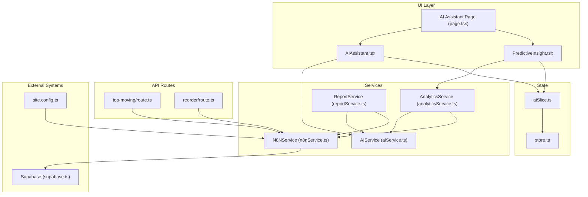
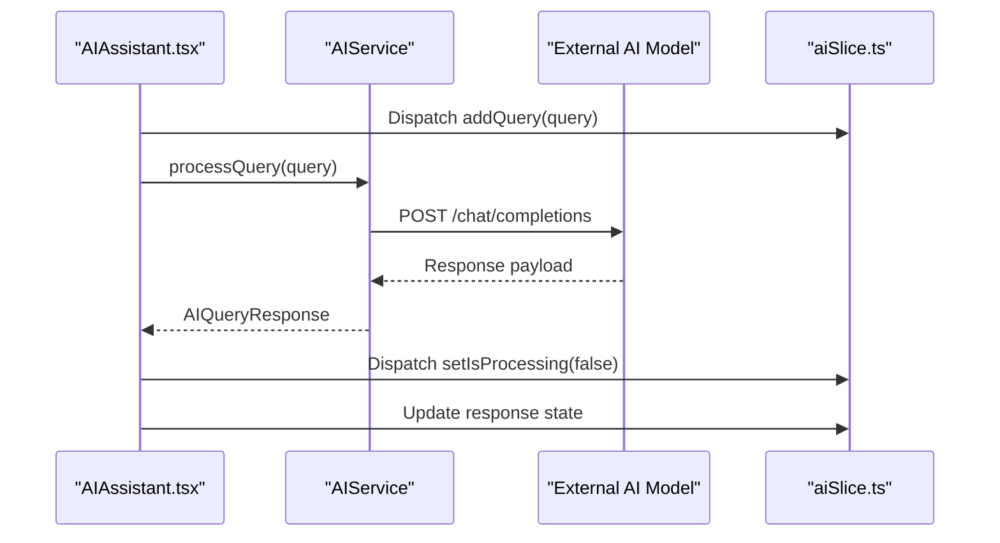
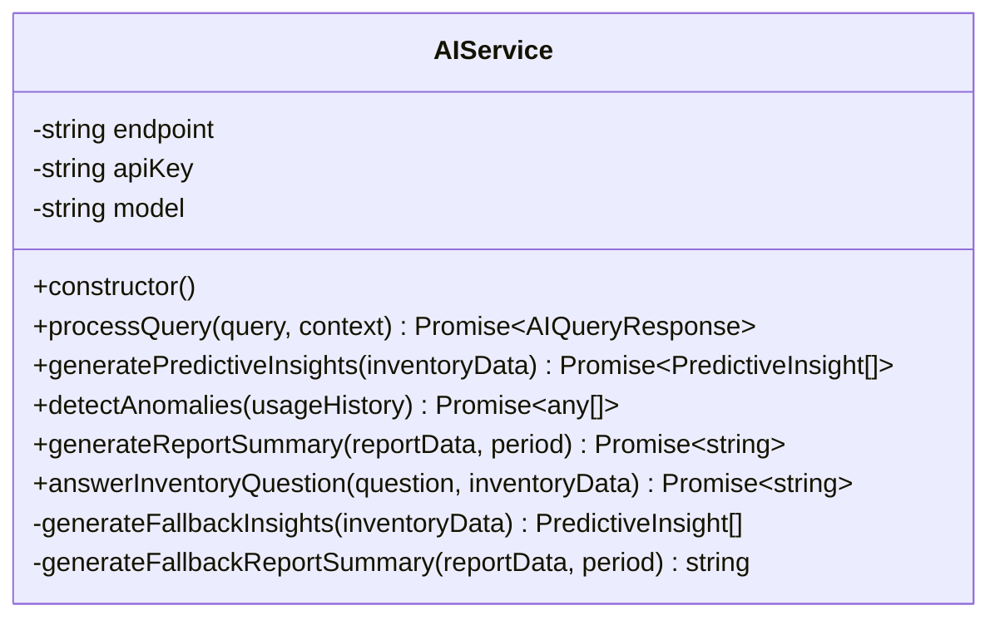
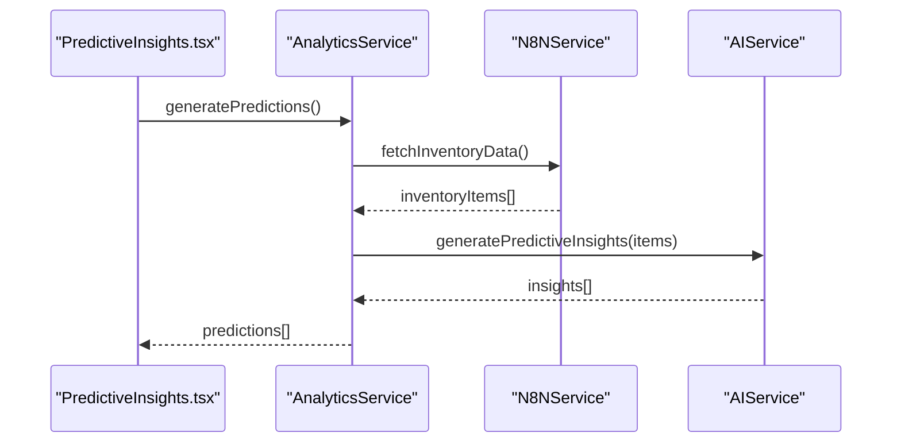
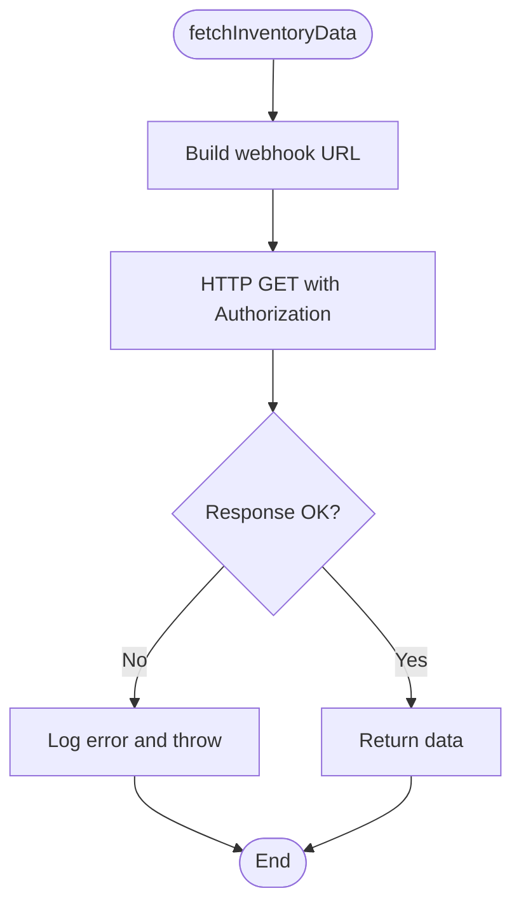
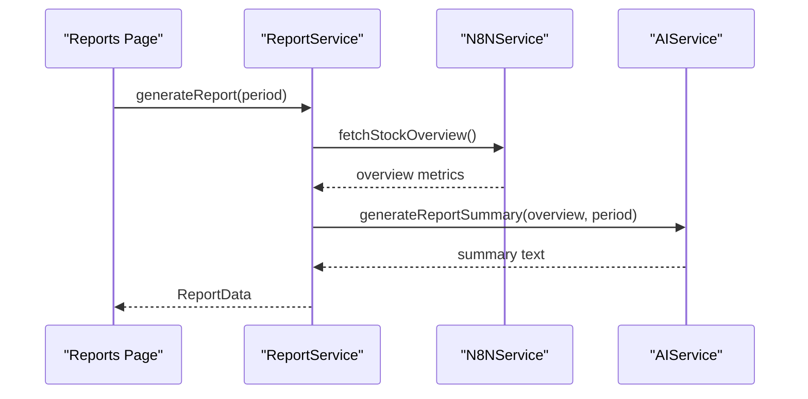
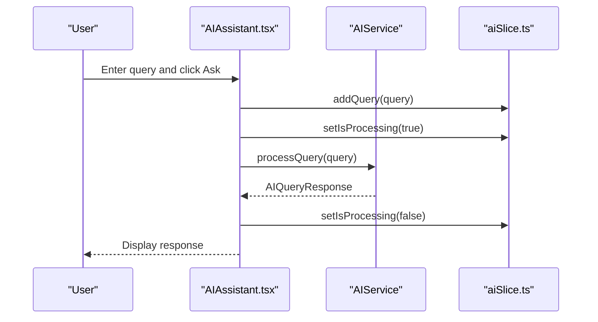
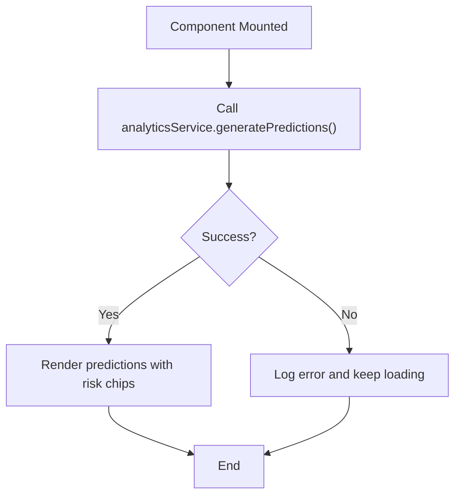
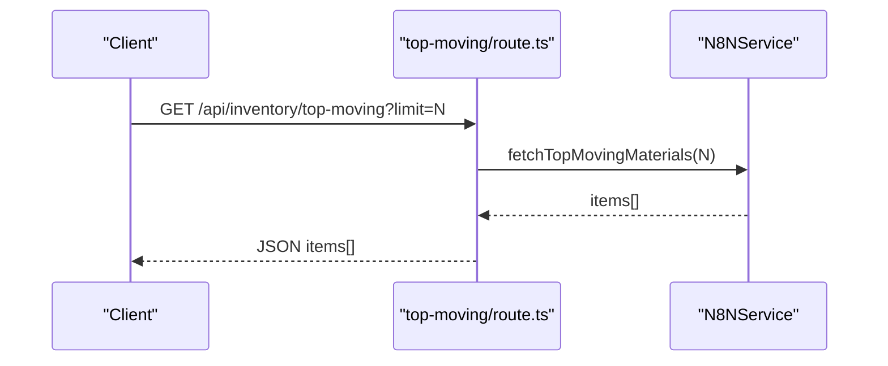
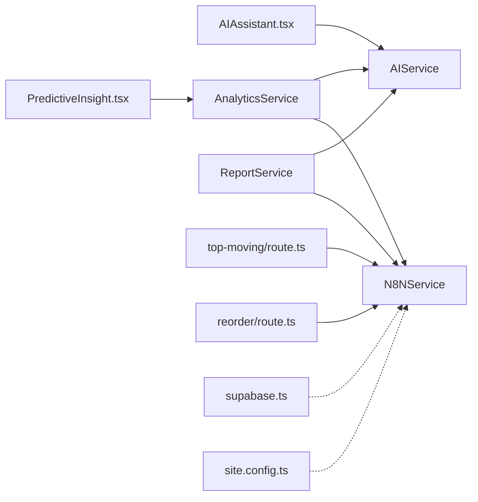

# AI and Analytics Services

<cite>
**Referenced Files in This Document**
- [aiService.ts](file://src/services/aiService.ts)
- [analyticsService.ts](file://src/services/analyticsService.ts)
- [n8nService.ts](file://src/services/n8nService.ts)
- [reportService.ts](file://src/services/reportService.ts)
- [AIAssistant.tsx](file://src/components/ai/AIAssistant.tsx)
- [PredictiveInsight.tsx](file://src/components/ai/PredictiveInsight.tsx)
- [aiSlice.ts](file://src/store/slices/aiSlice.ts)
- [store.ts](file://src/store/store.ts)
- [page.tsx](file://src/app/ai-assistant/page.tsx)
- [route.ts](file://src/app/api/inventory/top-moving/route.ts)
- [route.ts](file://src/app/api/inventory/reorder/route.ts)
- [supabase.ts](file://src/lib/supabase.ts)
- [site.config.ts](file://src/config/site.config.ts)
- [package.json](file://package.json)
</cite>

## Table of Contents
1. [Introduction](#introduction)
2. [Project Structure](#project-structure)
3. [Core Components](#core-components)
4. [Architecture Overview](#architecture-overview)
5. [Detailed Component Analysis](#detailed-component-analysis)
6. [Dependency Analysis](#dependency-analysis)
7. [Performance Considerations](#performance-considerations)
8. [Troubleshooting Guide](#troubleshooting-guide)
9. [Conclusion](#conclusion)
10. [Appendices](#appendices)

## Introduction
This document provides comprehensive documentation for the AI and analytics services in the dashboard-ai project. It covers the AI service integration for natural language processing, including model configuration and query processing workflows, as well as the analytics service for predictive analytics, anomaly detection, and report generation. It also documents service initialization patterns, API endpoint configurations, error handling strategies, and practical usage examples within components. Guidance is included for extending AI capabilities, adding new analytics models, and maintaining service boundaries within the overall architecture.

## Project Structure
The AI and analytics services are organized under the services directory and integrated with React components, Redux store slices, and Next.js API routes. The AI service communicates with an external model provider (configured via environment variables), while the analytics service orchestrates data retrieval from n8n webhooks and leverages the AI service for insights. Report generation combines AI summaries with operational metrics fetched from n8n.

**Diagram sources**
- [AIAssistant.tsx:1-120](file://src/components/ai/AIAssistant.tsx#L1-L120)
- [PredictiveInsight.tsx:1-152](file://src/components/ai/PredictiveInsight.tsx#L1-L152)
- [page.tsx:1-55](file://src/app/ai-assistant/page.tsx#L1-L55)
- [aiService.ts:1-219](file://src/services/aiService.ts#L1-L219)
- [analyticsService.ts:1-134](file://src/services/analyticsService.ts#L1-L134)
- [n8nService.ts:1-109](file://src/services/n8nService.ts#L1-L109)
- [reportService.ts:1-171](file://src/services/reportService.ts#L1-L171)
- [aiSlice.ts:1-56](file://src/store/slices/aiSlice.ts#L1-L56)
- [store.ts:1-27](file://src/store/store.ts#L1-L27)
- [route.ts:1-25](file://src/app/api/inventory/top-moving/route.ts#L1-L25)
- [route.ts:1-18](file://src/app/api/inventory/reorder/route.ts#L1-L18)
- [supabase.ts:1-21](file://src/lib/supabase.ts#L1-L21)
- [site.config.ts:1-34](file://src/config/site.config.ts#L1-L34)

**Section sources**
- [aiService.ts:1-219](file://src/services/aiService.ts#L1-L219)
- [analyticsService.ts:1-134](file://src/services/analyticsService.ts#L1-L134)
- [n8nService.ts:1-109](file://src/services/n8nService.ts#L1-L109)
- [reportService.ts:1-171](file://src/services/reportService.ts#L1-L171)
- [AIAssistant.tsx:1-120](file://src/components/ai/AIAssistant.tsx#L1-L120)
- [PredictiveInsight.tsx:1-152](file://src/components/ai/PredictiveInsight.tsx#L1-L152)
- [aiSlice.ts:1-56](file://src/store/slices/aiSlice.ts#L1-L56)
- [store.ts:1-27](file://src/store/store.ts#L1-L27)
- [page.tsx:1-55](file://src/app/ai-assistant/page.tsx#L1-L55)
- [route.ts:1-25](file://src/app/api/inventory/top-moving/route.ts#L1-L25)
- [route.ts:1-18](file://src/app/api/inventory/reorder/route.ts#L1-L18)
- [supabase.ts:1-21](file://src/lib/supabase.ts#L1-L21)
- [site.config.ts:1-34](file://src/config/site.config.ts#L1-L34)

## Core Components
- AIService: Provides natural language processing capabilities using an external model endpoint, supports query processing, predictive insights generation, anomaly detection, and report summarization. It encapsulates model configuration and HTTP communication.
- AnalyticsService: Orchestrates predictive analytics by fetching inventory data from n8n webhooks, invoking AIService for AI-driven insights, and generating structured predictions with risk levels. Includes fallback mechanisms and basic forecasting utilities.
- N8NService: Acts as the data gateway to external systems via n8n webhooks, providing methods to fetch inventory data, top-moving materials, reorder alerts, usage metrics, and stock overview. Implements polling for real-time updates.
- ReportService: Generates automated inventory reports by combining operational metrics with AI-generated summaries and recommendations, supporting export formats and scheduling.
- AI Assistant Component: A React UI component that integrates AIService to process natural language queries, manage UI state, and present AI responses.
- Predictive Insights Component: A React UI component that loads and displays AI-powered predictions and risk assessments.
- AI Redux Slice: Manages AI-related state including query history, insights, processing status, and current query.
- Store: Central Redux store configuration integrating AI slice, inventory API, and UI slices.

**Section sources**
- [aiService.ts:18-219](file://src/services/aiService.ts#L18-L219)
- [analyticsService.ts:13-134](file://src/services/analyticsService.ts#L13-L134)
- [n8nService.ts:16-109](file://src/services/n8nService.ts#L16-L109)
- [reportService.ts:18-171](file://src/services/reportService.ts#L18-L171)
- [AIAssistant.tsx:23-120](file://src/components/ai/AIAssistant.tsx#L23-L120)
- [PredictiveInsight.tsx:29-152](file://src/components/ai/PredictiveInsight.tsx#L29-L152)
- [aiSlice.ts:17-56](file://src/store/slices/aiSlice.ts#L17-L56)
- [store.ts:7-27](file://src/store/store.ts#L7-L27)

## Architecture Overview
The AI and analytics services follow a layered architecture:
- UI Layer: Components consume services and manage presentation state.
- Service Layer: AIService handles model interactions; AnalyticsService coordinates data retrieval and AI insights; N8NService bridges to external systems; ReportService composes reports.
- Data Layer: External data sources accessed via n8n webhooks; Supabase is used for user credentials and preferences, not inventory data.
- Configuration: Environment variables and site configuration define endpoints, keys, and caching policies.

**Diagram sources**
- [AIAssistant.tsx:29-46](file://src/components/ai/AIAssistant.tsx#L29-L46)
- [aiService.ts:33-74](file://src/services/aiService.ts#L33-L74)
- [aiSlice.ts:24-35](file://src/store/slices/aiSlice.ts#L24-L35)

**Section sources**
- [aiService.ts:18-74](file://src/services/aiService.ts#L18-L74)
- [AIAssistant.tsx:23-46](file://src/components/ai/AIAssistant.tsx#L23-L46)
- [aiSlice.ts:17-43](file://src/store/slices/aiSlice.ts#L17-L43)

## Detailed Component Analysis

### AIService
AIService encapsulates AI model integration and query processing:
- Initialization: Reads endpoint, API key, and model name from environment variables.
- Query Processing: Sends user prompts with optional context to the model endpoint and returns structured responses.
- Predictive Insights: Generates structured insights from inventory data using AI and falls back to heuristic logic if parsing fails.
- Anomaly Detection: Identifies unusual consumption patterns from usage history via AI and returns structured anomalies.
- Report Summaries: Produces concise executive summaries for inventory reports using AI and provides fallback summaries.
- Error Handling: Centralized try/catch blocks with informative logging and controlled error propagation.

**Diagram sources**
- [aiService.ts:18-219](file://src/services/aiService.ts#L18-L219)

**Section sources**
- [aiService.ts:18-219](file://src/services/aiService.ts#L18-L219)

### AnalyticsService
AnalyticsService orchestrates predictive analytics:
- Predictions: Fetches inventory data from n8n, delegates AI analysis, and maps results to a standardized structure with risk levels.
- Anomaly Detection: Retrieves usage metrics from n8n and applies AI to detect anomalies.
- Forecasting Utilities: Provides a simple forecasting function with confidence intervals and growth rates.
- Fallback Mechanisms: Returns mock predictions when data sources are unavailable.

**Diagram sources**
- [analyticsService.ts:17-41](file://src/services/analyticsService.ts#L17-L41)
- [n8nService.ts:29-51](file://src/services/n8nService.ts#L29-L51)
- [aiService.ts:79-109](file://src/services/aiService.ts#L79-L109)
- [PredictiveInsight.tsx:33-46](file://src/components/ai/PredictiveInsight.tsx#L33-L46)

**Section sources**
- [analyticsService.ts:13-134](file://src/services/analyticsService.ts#L13-L134)
- [n8nService.ts:16-109](file://src/services/n8nService.ts#L16-L109)
- [aiService.ts:76-124](file://src/services/aiService.ts#L76-L124)
- [PredictiveInsight.tsx:29-46](file://src/components/ai/PredictiveInsight.tsx#L29-L46)

### N8NService
N8NService provides data access to external systems:
- Webhook Access: Fetches inventory data, top-moving materials, reorder alerts, usage metrics, and stock overview.
- Polling Updates: Subscribes to periodic updates with configurable intervals and cleanup.
- Error Handling: Distinguishes timeout errors and throws meaningful exceptions.

**Diagram sources**
- [n8nService.ts:29-51](file://src/services/n8nService.ts#L29-L51)

**Section sources**
- [n8nService.ts:16-109](file://src/services/n8nService.ts#L16-L109)

### ReportService
ReportService generates automated reports:
- Report Generation: Combines operational metrics with AI-generated summaries and recommendations.
- Fallback Reports: Provides mock reports when data retrieval fails.
- Export and Scheduling: Defines export interfaces and scheduling mechanism placeholders.

**Diagram sources**
- [reportService.ts:22-42](file://src/services/reportService.ts#L22-L42)
- [n8nService.ts:77-79](file://src/services/n8nService.ts#L77-L79)
- [aiService.ts:129-149](file://src/services/aiService.ts#L129-L149)

**Section sources**
- [reportService.ts:18-171](file://src/services/reportService.ts#L18-L171)

### AI Assistant Component
The AI Assistant component integrates AIService for natural language queries:
- State Management: Uses Redux to track processing state and query history.
- Interaction Flow: Validates input, dispatches actions, calls AIService, and handles errors gracefully.

**Diagram sources**
- [AIAssistant.tsx:29-46](file://src/components/ai/AIAssistant.tsx#L29-L46)
- [aiSlice.ts:24-35](file://src/store/slices/aiSlice.ts#L24-L35)
- [aiService.ts:33-74](file://src/services/aiService.ts#L33-L74)

**Section sources**
- [AIAssistant.tsx:23-120](file://src/components/ai/AIAssistant.tsx#L23-L120)
- [aiSlice.ts:17-56](file://src/store/slices/aiSlice.ts#L17-L56)
- [aiService.ts:18-74](file://src/services/aiService.ts#L18-L74)

### Predictive Insights Component
The Predictive Insights component renders AI-powered predictions:
- Data Loading: Fetches predictions on mount and displays loading states.
- Risk Visualization: Maps confidence to risk levels and presents actionable recommendations.

**Diagram sources**
- [PredictiveInsight.tsx:33-46](file://src/components/ai/PredictiveInsight.tsx#L33-L46)
- [analyticsService.ts:17-41](file://src/services/analyticsService.ts#L17-L41)

**Section sources**
- [PredictiveInsight.tsx:29-152](file://src/components/ai/PredictiveInsight.tsx#L29-L152)
- [analyticsService.ts:13-41](file://src/services/analyticsService.ts#L13-L41)

### API Endpoints
Next.js API routes expose inventory data via n8n webhooks:
- Top-Moving Materials: Accepts a limit parameter and returns top-moving items.
- Reorder Alerts: Returns current reorder alerts.

**Diagram sources**
- [route.ts:4-16](file://src/app/api/inventory/top-moving/route.ts#L4-L16)
- [n8nService.ts:56-58](file://src/services/n8nService.ts#L56-L58)

**Section sources**
- [route.ts:1-25](file://src/app/api/inventory/top-moving/route.ts#L1-L25)
- [route.ts:1-18](file://src/app/api/inventory/reorder/route.ts#L1-L18)
- [n8nService.ts:29-79](file://src/services/n8nService.ts#L29-L79)

## Dependency Analysis
The services exhibit clear separation of concerns:
- AIService depends on environment configuration and HTTP client for model interactions.
- AnalyticsService depends on N8NService for data and AIService for AI insights.
- ReportService depends on N8NService for metrics and AIService for summaries.
- Components depend on services and Redux slices for state and UI updates.
- API routes depend on N8NService for data exposure.

**Diagram sources**
- [AIAssistant.tsx:19-21](file://src/components/ai/AIAssistant.tsx#L19-L21)
- [PredictiveInsight.tsx](file://src/components/ai/PredictiveInsight.tsx#L4)
- [analyticsService.ts:1-3](file://src/services/analyticsService.ts#L1-L3)
- [reportService.ts:1-2](file://src/services/reportService.ts#L1-L2)
- [n8nService.ts:1-15](file://src/services/n8nService.ts#L1-L15)
- [route.ts](file://src/app/api/inventory/top-moving/route.ts#L2)
- [route.ts](file://src/app/api/inventory/reorder/route.ts#L2)
- [supabase.ts:1-21](file://src/lib/supabase.ts#L1-L21)
- [site.config.ts:28-32](file://src/config/site.config.ts#L28-L32)

**Section sources**
- [aiService.ts:1-219](file://src/services/aiService.ts#L1-L219)
- [analyticsService.ts:1-134](file://src/services/analyticsService.ts#L1-L134)
- [n8nService.ts:1-109](file://src/services/n8nService.ts#L1-L109)
- [reportService.ts:1-171](file://src/services/reportService.ts#L1-L171)
- [AIAssistant.tsx:1-120](file://src/components/ai/AIAssistant.tsx#L1-L120)
- [PredictiveInsight.tsx:1-152](file://src/components/ai/PredictiveInsight.tsx#L1-L152)
- [route.ts:1-25](file://src/app/api/inventory/top-moving/route.ts#L1-L25)
- [route.ts:1-18](file://src/app/api/inventory/reorder/route.ts#L1-L18)
- [supabase.ts:1-21](file://src/lib/supabase.ts#L1-L21)
- [site.config.ts:1-34](file://src/config/site.config.ts#L1-L34)

## Performance Considerations
- Environment Configuration: Ensure AI_MODEL_ENDPOINT, AI_API_KEY, AI_MODEL_NAME, N8N_WEBHOOK_URL, and N8N_API_KEY are configured to avoid runtime failures and enable efficient model access.
- Request Timeouts: N8NService sets a 10-second timeout for webhook requests; adjust based on network conditions and data volume.
- Polling Intervals: N8NService polling is set to 30 seconds; tune for real-time requirements versus server load.
- Caching Policies: Site configuration defines default TTLs for cached resources; align with data freshness requirements.
- Token Limits: AIService limits max tokens per request; consider increasing for complex queries while balancing latency and cost.
- Error Boundaries: Services implement fallbacks (mock predictions, fallback summaries) to maintain responsiveness under partial failures.

[No sources needed since this section provides general guidance]

## Troubleshooting Guide
- AI Service Errors: AIService logs errors and throws descriptive messages; verify endpoint, API key, and model name environment variables.
- N8N Webhook Errors: N8NService distinguishes timeouts and other Axios errors; check webhook URL and API key.
- Analytics Fallbacks: AnalyticsService returns mock predictions when data is unavailable; confirm n8n connectivity and data availability.
- Report Generation Failures: ReportService falls back to mock reports; validate n8n stock overview endpoint and AI summary generation.
- Component State: AIAssistant component disables input during processing and shows loading indicators; ensure Redux state updates are dispatched correctly.

**Section sources**
- [aiService.ts:70-73](file://src/services/aiService.ts#L70-L73)
- [n8nService.ts:42-50](file://src/services/n8nService.ts#L42-L50)
- [analyticsService.ts:37-41](file://src/services/analyticsService.ts#L37-L41)
- [reportService.ts:38-42](file://src/services/reportService.ts#L38-L42)
- [AIAssistant.tsx:36-45](file://src/components/ai/AIAssistant.tsx#L36-L45)

## Conclusion
The AI and analytics services in the dashboard-ai project provide a cohesive framework for natural language processing, predictive analytics, anomaly detection, and automated reporting. AIService offers flexible model integration, while AnalyticsService orchestrates data retrieval and AI insights. N8NService bridges to external systems, and ReportService composes reports with AI assistance. Components integrate seamlessly with Redux for state management, and API routes expose inventory data via n8n webhooks. The architecture emphasizes resilience through fallbacks, clear separation of concerns, and configurable environment settings.

[No sources needed since this section summarizes without analyzing specific files]

## Appendices

### Service Abstraction Patterns and Dependency Injection
- Singleton Services: AIService, AnalyticsService, N8NService, and ReportService are instantiated as singletons, enabling global access and consistent configuration.
- Dependency Contracts: Services depend on interfaces (e.g., HTTP client, external webhooks) rather than concrete implementations, facilitating testing and extension.
- Environment-Based Configuration: Services read configuration from environment variables, allowing deployment flexibility without code changes.

**Section sources**
- [aiService.ts:23-27](file://src/services/aiService.ts#L23-L27)
- [analyticsService.ts:1-3](file://src/services/analyticsService.ts#L1-L3)
- [n8nService.ts:20-23](file://src/services/n8nService.ts#L20-L23)
- [reportService.ts:1-2](file://src/services/reportService.ts#L1-L2)

### Practical Examples of Service Usage in Components
- AI Assistant: Integrates AIService to process user queries, manages Redux state, and displays responses with loading indicators.
- Predictive Insights: Calls AnalyticsService to fetch predictions, maps confidence to risk levels, and renders actionable recommendations.
- API Routes: Expose inventory data endpoints that delegate to N8NService, ensuring consistent data access patterns.

**Section sources**
- [AIAssistant.tsx:23-120](file://src/components/ai/AIAssistant.tsx#L23-L120)
- [PredictiveInsight.tsx:29-152](file://src/components/ai/PredictiveInsight.tsx#L29-L152)
- [route.ts:4-16](file://src/app/api/inventory/top-moving/route.ts#L4-L16)
- [route.ts:4-9](file://src/app/api/inventory/reorder/route.ts#L4-L9)

### Parameter Validation and Response Processing
- Input Validation: Components validate query inputs before dispatching actions to AIService.
- Response Parsing: AIService parses AI responses and provides structured outputs; AnalyticsService maps and validates parsed results.
- Error Handling: Centralized try/catch blocks with fallbacks ensure graceful degradation.

**Section sources**
- [AIAssistant.tsx:29-46](file://src/components/ai/AIAssistant.tsx#L29-L46)
- [aiService.ts:95-104](file://src/services/aiService.ts#L95-L104)
- [analyticsService.ts:29-36](file://src/services/analyticsService.ts#L29-L36)

### Testing Methodologies and Mock Implementations
- Mock Predictions: AnalyticsService includes a mock predictions generator for development and testing scenarios.
- Fallback Summaries: AIService provides fallback report summaries when AI parsing fails.
- Environment Isolation: Use environment variables to switch between development and production endpoints without code changes.

**Section sources**
- [analyticsService.ts:46-73](file://src/services/analyticsService.ts#L46-L73)
- [aiService.ts:154-172](file://src/services/aiService.ts#L154-L172)

### Performance Optimization Techniques
- Reduce Latency: Configure appropriate model parameters (temperature, max tokens) and endpoint locations.
- Optimize Network Requests: Tune N8NService polling intervals and request timeouts based on data volume and SLAs.
- Caching: Leverage site configuration TTLs to minimize redundant requests.
- Minimize Payloads: Limit data sent to AI models (e.g., slicing arrays) to improve response quality and speed.

**Section sources**
- [site.config.ts:22-26](file://src/config/site.config.ts#L22-L26)
- [n8nService.ts:85-105](file://src/services/n8nService.ts#L85-L105)
- [aiService.ts:81-90](file://src/services/aiService.ts#L81-L90)

### Extending AI Capabilities and Adding New Analytics Models
- Model Integration: Extend AIService to support additional models by updating endpoint configuration and prompt engineering.
- Analytics Enhancements: Add new forecasting models or anomaly detection algorithms within AnalyticsService while preserving existing interfaces.
- Service Boundaries: Maintain clear separation between data retrieval (N8NService), AI processing (AIService), and orchestration (AnalyticsService/ReportService).

**Section sources**
- [aiService.ts:18-27](file://src/services/aiService.ts#L18-L27)
- [analyticsService.ts:13-41](file://src/services/analyticsService.ts#L13-L41)
- [reportService.ts:18-42](file://src/services/reportService.ts#L18-L42)