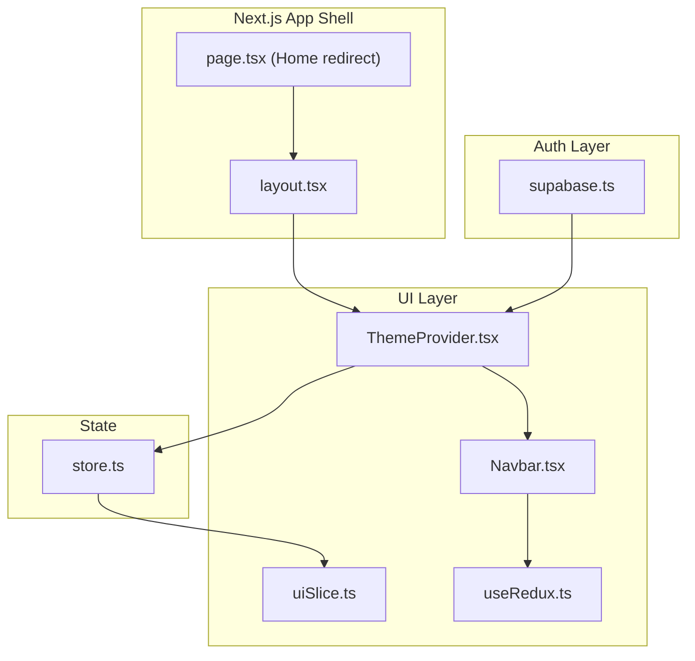
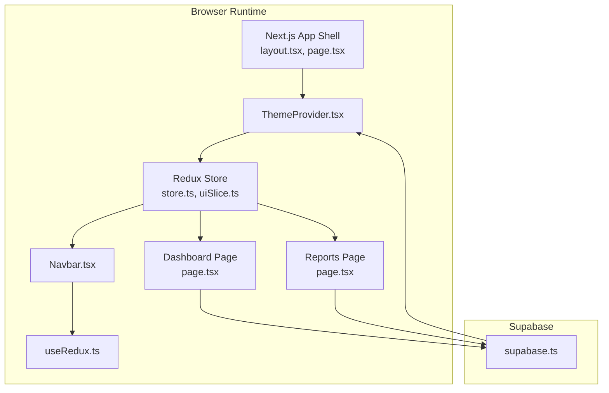
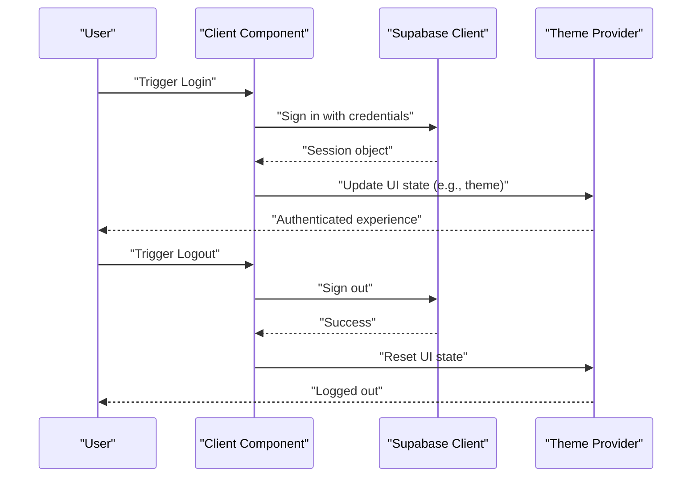
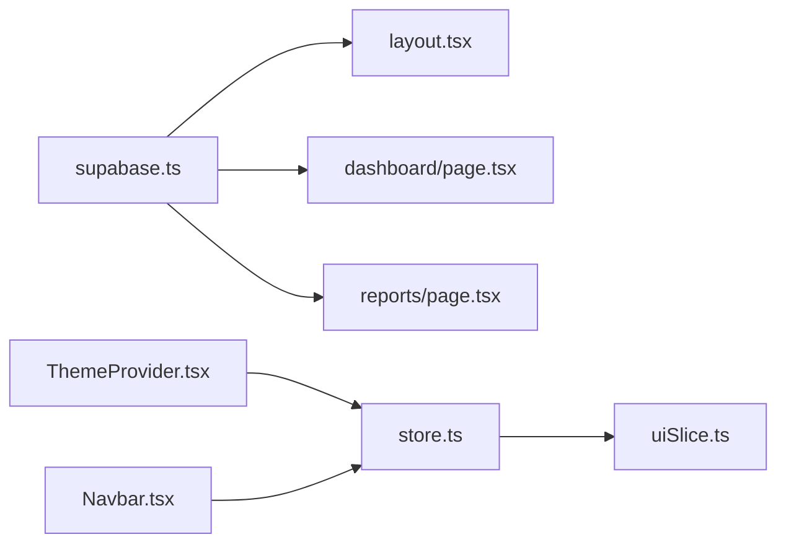

# Authentication and Authorization Services

<cite>
**Referenced Files in This Document**
- [supabase.ts](file://src/lib/supabase.ts)
- [package.json](file://package.json)
- [layout.tsx](file://src/app/layout.tsx)
- [page.tsx](file://src/app/page.tsx)
- [store.ts](file://src/store/store.ts)
- [uiSlice.ts](file://src/store/slices/uiSlice.ts)
- [useRedux.ts](file://src/hooks/useRedux.ts)
- [ThemeProvider.tsx](file://src/components/ui/Layout/ThemeProvider.tsx)
- [Navbar.tsx](file://src/components/ui/Layout/Navbar.tsx)
- [page.tsx](file://src/app/dashboard/page.tsx)
- [page.tsx](file://src/app/reports/page.tsx)
</cite>

## Table of Contents
1. [Introduction](#introduction)
2. [Project Structure](#project-structure)
3. [Core Components](#core-components)
4. [Architecture Overview](#architecture-overview)
5. [Detailed Component Analysis](#detailed-component-analysis)
6. [Dependency Analysis](#dependency-analysis)
7. [Performance Considerations](#performance-considerations)
8. [Troubleshooting Guide](#troubleshooting-guide)
9. [Conclusion](#conclusion)
10. [Appendices](#appendices)

## Introduction
This document describes the authentication and authorization services integrated with Supabase in the dashboard-ai project. It explains how the Supabase client is initialized, how user sessions are managed, and how role-based access control can be implemented. It also covers service initialization, configuration requirements, integration with Next.js navigation, and practical examples of login/logout workflows, protected route handling, and permission checks in components. Guidance is included for extending authentication features, adding new auth providers, and implementing custom authorization logic, along with best practices for secure credential handling, session persistence, and protecting sensitive routes and data.

## Project Structure
The authentication and authorization stack centers around the Supabase client module and integrates with the Next.js application shell and Redux store for UI state. The Supabase client is configured via environment variables exposed to the browser.

**Diagram sources**
- [layout.tsx:16-30](file://src/app/layout.tsx#L16-L30)
- [page.tsx:1-5](file://src/app/page.tsx#L1-L5)
- [ThemeProvider.tsx:1-67](file://src/components/ui/Layout/ThemeProvider.tsx#L1-L67)
- [Navbar.tsx:1-61](file://src/components/ui/Layout/Navbar.tsx#L1-L61)
- [uiSlice.ts:1-42](file://src/store/slices/uiSlice.ts#L1-L42)
- [useRedux.ts:1-6](file://src/hooks/useRedux.ts#L1-L6)
- [store.ts:1-27](file://src/store/store.ts#L1-L27)
- [supabase.ts:1-21](file://src/lib/supabase.ts#L1-L21)

**Section sources**
- [layout.tsx:16-30](file://src/app/layout.tsx#L16-L30)
- [page.tsx:1-5](file://src/app/page.tsx#L1-L5)
- [ThemeProvider.tsx:1-67](file://src/components/ui/Layout/ThemeProvider.tsx#L1-L67)
- [Navbar.tsx:1-61](file://src/components/ui/Layout/Navbar.tsx#L1-L61)
- [uiSlice.ts:1-42](file://src/store/slices/uiSlice.ts#L1-L42)
- [useRedux.ts:1-6](file://src/hooks/useRedux.ts#L1-L6)
- [store.ts:1-27](file://src/store/store.ts#L1-L27)
- [supabase.ts:1-21](file://src/lib/supabase.ts#L1-L21)

## Core Components
- Supabase client initialization and configuration
  - The Supabase client is created using environment variables for the public URL and anonymous key. The client is exported for use across the application.
  - Reference: [supabase.ts:1-21](file://src/lib/supabase.ts#L1-L21)

- Next.js application shell and routing
  - The root layout wraps the application with a theme provider and Redux store provider. The home page redirects to the dashboard.
  - References:
    - [layout.tsx:16-30](file://src/app/layout.tsx#L16-L30)
    - [page.tsx:1-5](file://src/app/page.tsx#L1-L5)

- Redux store and UI state
  - The Redux store is configured with reducers for inventory, AI, UI, and RTK Query API slices. UI state includes sidebar open/closed state and theme.
  - References:
    - [store.ts:1-27](file://src/store/store.ts#L1-L27)
    - [uiSlice.ts:1-42](file://src/store/slices/uiSlice.ts#L1-L42)
    - [useRedux.ts:1-6](file://src/hooks/useRedux.ts#L1-L6)

- Authentication and authorization integration points
  - The Supabase client is the central integration point for authentication and authorization. The dashboard and reports pages demonstrate client-side usage patterns.
  - References:
    - [page.tsx:1-128](file://src/app/dashboard/page.tsx#L1-L128)
    - [page.tsx:1-96](file://src/app/reports/page.tsx#L1-L96)

**Section sources**
- [supabase.ts:1-21](file://src/lib/supabase.ts#L1-L21)
- [layout.tsx:16-30](file://src/app/layout.tsx#L16-L30)
- [page.tsx:1-5](file://src/app/page.tsx#L1-L5)
- [store.ts:1-27](file://src/store/store.ts#L1-L27)
- [uiSlice.ts:1-42](file://src/store/slices/uiSlice.ts#L1-L42)
- [useRedux.ts:1-6](file://src/hooks/useRedux.ts#L1-L6)
- [page.tsx:1-128](file://src/app/dashboard/page.tsx#L1-L128)
- [page.tsx:1-96](file://src/app/reports/page.tsx#L1-L96)

## Architecture Overview
The authentication architecture leverages Supabase for user authentication and session management. The Next.js app is wrapped with a theme provider and Redux store. Components interact with Supabase to manage user sessions and enforce access control.

**Diagram sources**
- [layout.tsx:16-30](file://src/app/layout.tsx#L16-L30)
- [page.tsx:1-5](file://src/app/page.tsx#L1-L5)
- [ThemeProvider.tsx:1-67](file://src/components/ui/Layout/ThemeProvider.tsx#L1-L67)
- [store.ts:1-27](file://src/store/store.ts#L1-L27)
- [uiSlice.ts:1-42](file://src/store/slices/uiSlice.ts#L1-L42)
- [useRedux.ts:1-6](file://src/hooks/useRedux.ts#L1-L6)
- [Navbar.tsx:1-61](file://src/components/ui/Layout/Navbar.tsx#L1-L61)
- [page.tsx:1-128](file://src/app/dashboard/page.tsx#L1-L128)
- [page.tsx:1-96](file://src/app/reports/page.tsx#L1-L96)
- [supabase.ts:1-21](file://src/lib/supabase.ts#L1-L21)

## Detailed Component Analysis

### Supabase Client Initialization
- Purpose: Provide a configured Supabase client for authentication, authorization, and secure credential storage.
- Configuration: Uses environment variables for the public URL and anonymous key.
- Export: Exports the client instance for consumption across the application.

Implementation pattern:
- Import the Supabase client factory and environment variables.
- Create and export the client instance.

Integration points:
- Used by UI components and pages to manage user sessions and permissions.

Security considerations:
- Ensure environment variables are set in the runtime environment.
- Restrict access to sensitive server-side secrets.

**Section sources**
- [supabase.ts:1-21](file://src/lib/supabase.ts#L1-L21)

### Next.js Application Shell and Routing
- Layout: Wraps the application with theme and Redux providers.
- Navigation: Redirects the home route to the dashboard.

Practical implications:
- Ensures consistent theming and state management across pages.
- Establishes a predictable navigation flow.

**Section sources**
- [layout.tsx:16-30](file://src/app/layout.tsx#L16-L30)
- [page.tsx:1-5](file://src/app/page.tsx#L1-L5)

### Redux Store and UI State
- Store configuration: Includes reducers for inventory, AI, UI, and RTK Query API.
- UI slice: Manages sidebar state and theme selection.
- Hooks: Typed Redux hooks for dispatch and selector usage.

Integration with authentication:
- UI state can be used to reflect user session changes (e.g., sidebar behavior, theme preferences).

**Section sources**
- [store.ts:1-27](file://src/store/store.ts#L1-L27)
- [uiSlice.ts:1-42](file://src/store/slices/uiSlice.ts#L1-L42)
- [useRedux.ts:1-6](file://src/hooks/useRedux.ts#L1-L6)

### Authentication Flow Patterns
The following sequence illustrates a typical authentication flow using the Supabase client:

Notes:
- Replace "Client Component" with specific components that call Supabase methods.
- Replace "Theme Provider" with the actual provider component used in the app.

[No sources needed since this diagram shows conceptual workflow, not actual code structure]

### Token Management and Session Lifecycle
- Session creation: Initiated by signing in via the Supabase client.
- Session persistence: Managed by the Supabase client; typically stored in browser storage.
- Automatic refresh: Supabase handles token refresh automatically.
- Session termination: Initiated by signing out via the Supabase client.

Best practices:
- Ensure the Supabase client is initialized with proper environment variables.
- Handle session state updates in UI components.
- Implement logout handlers to clear local state and terminate sessions.

[No sources needed since this section provides general guidance]

### Protected Route Handling and Permission Checking
- Protected routes: Pages can be considered protected by gating access based on session state.
- Permission checks: Access control can be enforced by verifying user roles and permissions after authentication.

Implementation guidance:
- Use session state to conditionally render protected content.
- Integrate role-based checks against user metadata or database roles.

[No sources needed since this section provides general guidance]

### Session Storage Strategies
- Browser storage: Supabase client stores session tokens in browser storage.
- Local state synchronization: Update Redux/UI state upon session changes.

Recommendations:
- Prefer secure, same-site cookies for session storage when supported by backend.
- Clear session data on logout and on sensitive route transitions.

[No sources needed since this section provides general guidance]

### Error Handling for Authentication Failures
- Client-side errors: Catch and surface errors during sign-in/sign-out operations.
- UI feedback: Display user-friendly messages and retry options.
- Graceful degradation: Allow users to continue using non-authenticated features where applicable.

[No sources needed since this section provides general guidance]

### Security Considerations
- Environment variables: Ensure Supabase URL and anonymous key are properly configured and not exposed in client bundles.
- Role-based access control: Enforce permissions server-side and validate claims client-side.
- Secure credentials: Avoid storing sensitive credentials in local storage; rely on Supabase-managed sessions.
- Session timeouts: Implement idle timeouts and re-authentication prompts.

[No sources needed since this section provides general guidance]

### Extending Authentication Features
- Adding new auth providers: Configure additional providers in the Supabase dashboard and update client-side flows accordingly.
- Custom authorization logic: Implement custom checks using user metadata and database roles.
- Multi-factor authentication: Enable MFA in Supabase and integrate client-side verification steps.

[No sources needed since this section provides general guidance]

## Dependency Analysis
The authentication and authorization services depend on the Supabase client and Next.js application shell. The Redux store supports UI state management that can reflect authentication state.

**Diagram sources**
- [supabase.ts:1-21](file://src/lib/supabase.ts#L1-L21)
- [layout.tsx:16-30](file://src/app/layout.tsx#L16-L30)
- [page.tsx:1-128](file://src/app/dashboard/page.tsx#L1-L128)
- [page.tsx:1-96](file://src/app/reports/page.tsx#L1-L96)
- [store.ts:1-27](file://src/store/store.ts#L1-L27)
- [uiSlice.ts:1-42](file://src/store/slices/uiSlice.ts#L1-L42)
- [ThemeProvider.tsx:1-67](file://src/components/ui/Layout/ThemeProvider.tsx#L1-L67)
- [Navbar.tsx:1-61](file://src/components/ui/Layout/Navbar.tsx#L1-L61)

**Section sources**
- [supabase.ts:1-21](file://src/lib/supabase.ts#L1-L21)
- [layout.tsx:16-30](file://src/app/layout.tsx#L16-L30)
- [page.tsx:1-128](file://src/app/dashboard/page.tsx#L1-L128)
- [page.tsx:1-96](file://src/app/reports/page.tsx#L1-L96)
- [store.ts:1-27](file://src/store/store.ts#L1-L27)
- [uiSlice.ts:1-42](file://src/store/slices/uiSlice.ts#L1-L42)
- [ThemeProvider.tsx:1-67](file://src/components/ui/Layout/ThemeProvider.tsx#L1-L67)
- [Navbar.tsx:1-61](file://src/components/ui/Layout/Navbar.tsx#L1-L61)

## Performance Considerations
- Minimize unnecessary re-renders by leveraging Redux selectors and memoization.
- Defer heavy computations until after authentication state is confirmed.
- Use optimistic updates for UI state while awaiting authentication responses.

[No sources needed since this section provides general guidance]

## Troubleshooting Guide
Common issues and resolutions:
- Environment variables not set: Verify that the Supabase URL and anonymous key are configured in the runtime environment.
- Session not persisting: Confirm that the browser allows third-party cookies and that the client is initialized correctly.
- UI not reflecting authentication state: Ensure Redux state updates are triggered on session changes.

[No sources needed since this section provides general guidance]

## Conclusion
The dashboard-ai project integrates Supabase for authentication and authorization, with the Next.js app shell and Redux store supporting session-aware UI behavior. By initializing the Supabase client correctly, managing session state, and enforcing role-based access control, the application can provide a secure and responsive user experience. Extend the system by configuring additional auth providers, implementing custom authorization logic, and following best practices for secure credential handling and session persistence.

[No sources needed since this section summarizes without analyzing specific files]

## Appendices

### Configuration Requirements
- Environment variables:
  - NEXT_PUBLIC_SUPABASE_URL: Public Supabase project URL
  - NEXT_PUBLIC_SUPABASE_ANON_KEY: Public Supabase anonymous key

- Dependencies:
  - @supabase/supabase-js: Supabase client library

References:
- [supabase.ts:1-21](file://src/lib/supabase.ts#L1-L21)
- [package.json:11-26](file://package.json#L11-L26)

**Section sources**
- [supabase.ts:1-21](file://src/lib/supabase.ts#L1-L21)
- [package.json:11-26](file://package.json#L11-L26)