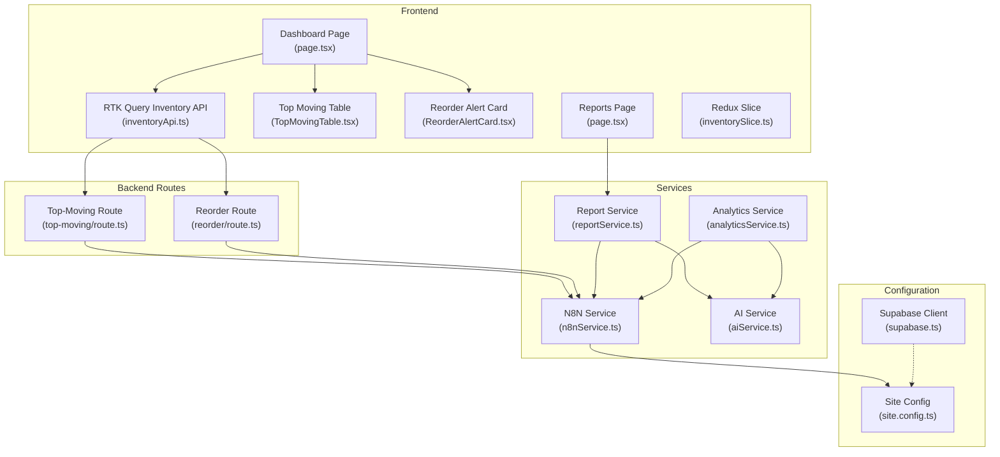
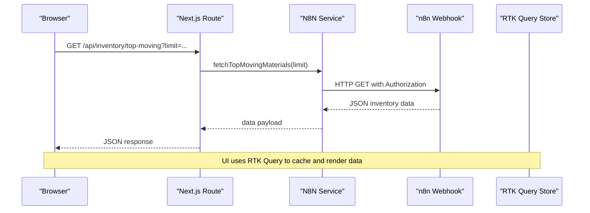
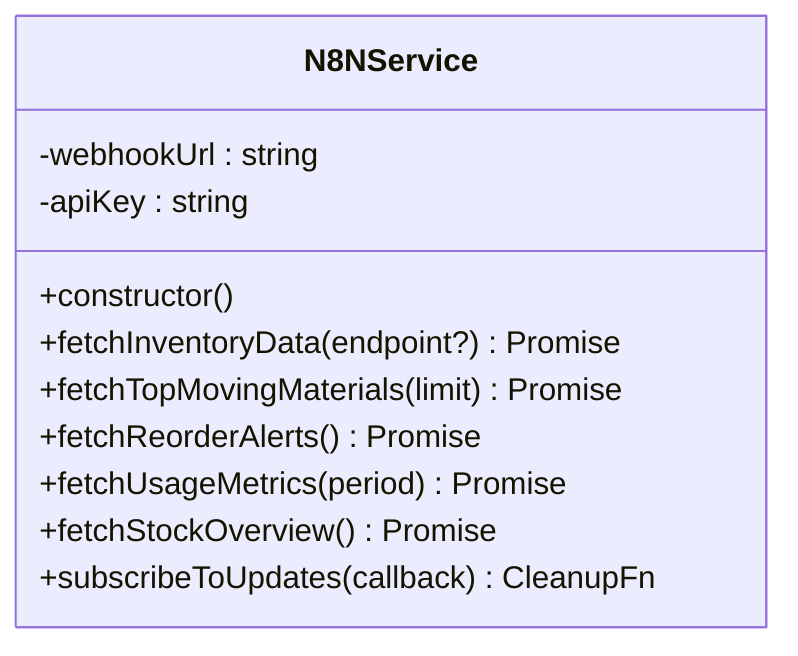
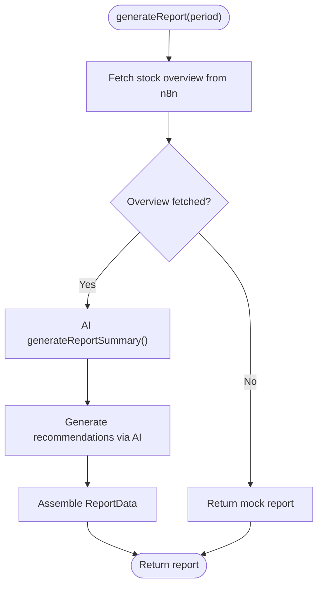
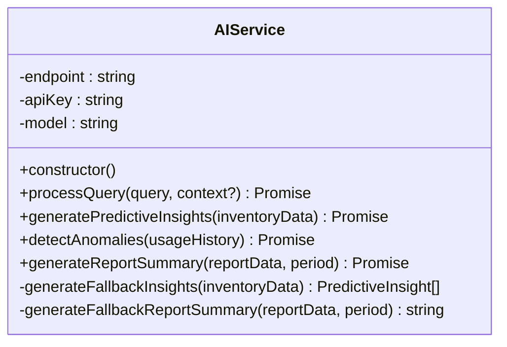
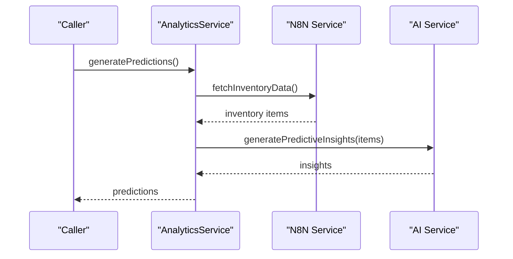
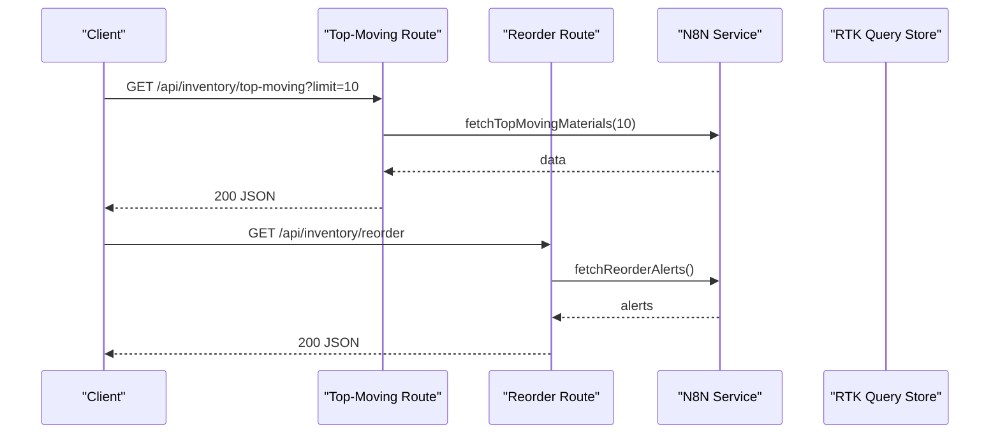
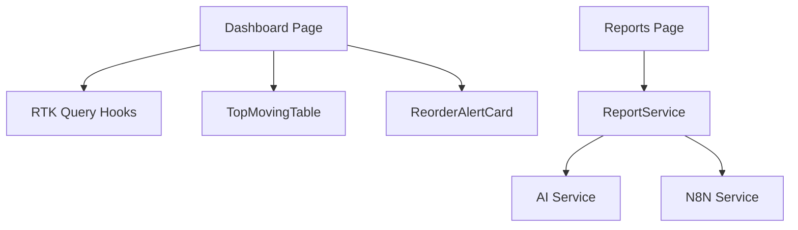
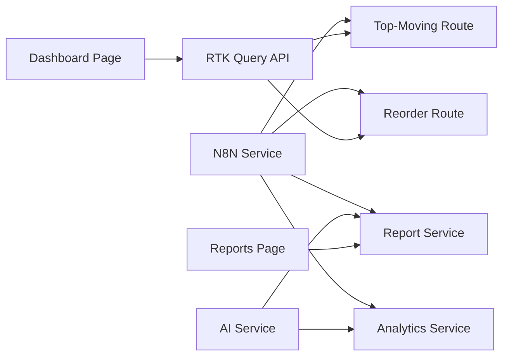

# External Integration Services

<cite>
**Referenced Files in This Document**
- [n8nService.ts](file://src/services/n8nService.ts)
- [reportService.ts](file://src/services/reportService.ts)
- [aiService.ts](file://src/services/aiService.ts)
- [analyticsService.ts](file://src/services/analyticsService.ts)
- [route.ts](file://src/app/api/inventory/top-moving/route.ts)
- [route.ts](file://src/app/api/inventory/reorder/route.ts)
- [inventoryApi.ts](file://src/store/api/inventoryApi.ts)
- [inventorySlice.ts](file://src/store/slices/inventorySlice.ts)
- [TopMovingTable.tsx](file://src/components/inventory/TopMovingTable.tsx)
- [ReorderAlertCard.tsx](file://src/components/inventory/ReorderAlertCard.tsx)
- [page.tsx](file://src/app/dashboard/page.tsx)
- [page.tsx](file://src/app/reports/page.tsx)
- [supabase.ts](file://src/lib/supabase.ts)
- [site.config.ts](file://src/config/site.config.ts)
</cite>

## Table of Contents
1. [Introduction](#introduction)
2. [Project Structure](#project-structure)
3. [Core Components](#core-components)
4. [Architecture Overview](#architecture-overview)
5. [Detailed Component Analysis](#detailed-component-analysis)
6. [Dependency Analysis](#dependency-analysis)
7. [Performance Considerations](#performance-considerations)
8. [Troubleshooting Guide](#troubleshooting-guide)
9. [Conclusion](#conclusion)
10. [Appendices](#appendices)

## Introduction
This document explains the external integration services powering the dashboard-ai project, focusing on:
- The n8n service for webhook-based inventory data retrieval and automated workflow orchestration
- The report service for generating executive summaries, recommendations, and exportable reports
- Authentication and configuration patterns
- Data transformation and processing workflows
- Error handling, retries, and fallbacks
- Monitoring, logging, and debugging techniques
- Guidance for extending integrations, adding new webhook endpoints, and maintaining reliability

## Project Structure
The external integration ecosystem spans services, API routes, Redux RTK Query APIs, React components, and configuration. The n8n webhook acts as the single source of truth for inventory data, while the AI service provides analytics and report summarization. Supabase is used for user credentials and caching preferences, not for inventory data storage.

**Diagram sources**
- [page.tsx:1-128](file://src/app/dashboard/page.tsx#L1-L128)
- [page.tsx:1-96](file://src/app/reports/page.tsx#L1-L96)
- [TopMovingTable.tsx:1-100](file://src/components/inventory/TopMovingTable.tsx#L1-L100)
- [ReorderAlertCard.tsx:1-105](file://src/components/inventory/ReorderAlertCard.tsx#L1-L105)
- [inventoryApi.ts:1-57](file://src/store/api/inventoryApi.ts#L1-L57)
- [inventorySlice.ts:1-56](file://src/store/slices/inventorySlice.ts#L1-L56)
- [route.ts:1-25](file://src/app/api/inventory/top-moving/route.ts#L1-L25)
- [route.ts:1-18](file://src/app/api/inventory/reorder/route.ts#L1-L18)
- [n8nService.ts:1-109](file://src/services/n8nService.ts#L1-L109)
- [aiService.ts:1-219](file://src/services/aiService.ts#L1-L219)
- [reportService.ts:1-171](file://src/services/reportService.ts#L1-L171)
- [analyticsService.ts:1-134](file://src/services/analyticsService.ts#L1-L134)
- [site.config.ts:1-33](file://src/config/site.config.ts#L1-L33)
- [supabase.ts:1-21](file://src/lib/supabase.ts#L1-L21)

**Section sources**
- [n8nService.ts:1-109](file://src/services/n8nService.ts#L1-L109)
- [reportService.ts:1-171](file://src/services/reportService.ts#L1-L171)
- [aiService.ts:1-219](file://src/services/aiService.ts#L1-L219)
- [analyticsService.ts:1-134](file://src/services/analyticsService.ts#L1-L134)
- [route.ts:1-25](file://src/app/api/inventory/top-moving/route.ts#L1-L25)
- [route.ts:1-18](file://src/app/api/inventory/reorder/route.ts#L1-L18)
- [inventoryApi.ts:1-57](file://src/store/api/inventoryApi.ts#L1-L57)
- [inventorySlice.ts:1-56](file://src/store/slices/inventorySlice.ts#L1-L56)
- [TopMovingTable.tsx:1-100](file://src/components/inventory/TopMovingTable.tsx#L1-L100)
- [ReorderAlertCard.tsx:1-105](file://src/components/inventory/ReorderAlertCard.tsx#L1-L105)
- [page.tsx:1-128](file://src/app/dashboard/page.tsx#L1-L128)
- [page.tsx:1-96](file://src/app/reports/page.tsx#L1-L96)
- [supabase.ts:1-21](file://src/lib/supabase.ts#L1-L21)
- [site.config.ts:1-33](file://src/config/site.config.ts#L1-L33)

## Core Components
- N8N Service: Centralized client for retrieving inventory data from n8n webhooks, with endpoint-specific helpers and polling subscriptions.
- Report Service: Orchestrates report generation using real-time data from n8n and AI summaries; includes mock fallbacks and export placeholders.
- AI Service: Provides natural language processing, predictive insights, anomaly detection, and report summarization using a dedicated AI endpoint.
- Analytics Service: Uses n8n data and AI to generate predictions and anomaly detections; includes mock fallbacks.
- API Routes: Expose inventory endpoints to the frontend via Next.js routes.
- RTK Query Inventory API: Defines typed endpoints for top-moving materials, reorder alerts, usage metrics, and stock overview.
- Frontend Pages and Components: Dashboard page renders widgets and charts; Reports page triggers report generation.

**Section sources**
- [n8nService.ts:16-109](file://src/services/n8nService.ts#L16-L109)
- [reportService.ts:18-171](file://src/services/reportService.ts#L18-L171)
- [aiService.ts:18-219](file://src/services/aiService.ts#L18-L219)
- [analyticsService.ts:13-134](file://src/services/analyticsService.ts#L13-L134)
- [route.ts:1-25](file://src/app/api/inventory/top-moving/route.ts#L1-L25)
- [route.ts:1-18](file://src/app/api/inventory/reorder/route.ts#L1-L18)
- [inventoryApi.ts:23-57](file://src/store/api/inventoryApi.ts#L23-L57)
- [page.tsx:1-128](file://src/app/dashboard/page.tsx#L1-L128)
- [page.tsx:1-96](file://src/app/reports/page.tsx#L1-L96)

## Architecture Overview
The system integrates external data via n8n webhooks, processes it through services, and exposes it to the UI via RTK Query. AI services augment the data with insights and summaries.

**Diagram sources**
- [route.ts:1-25](file://src/app/api/inventory/top-moving/route.ts#L1-L25)
- [n8nService.ts:29-58](file://src/services/n8nService.ts#L29-L58)
- [inventoryApi.ts:28-32](file://src/store/api/inventoryApi.ts#L28-L32)

## Detailed Component Analysis

### N8N Service
Responsibilities:
- Configure webhook URL and API key from environment variables
- Fetch inventory data from n8n endpoints
- Provide convenience methods for top-moving materials, reorder alerts, usage metrics, and stock overview
- Poll for real-time updates with a fixed interval and callback support

Key behaviors:
- Authentication via Bearer token header
- Request timeout configured to avoid hanging requests
- Error handling distinguishes timeouts and other failures
- Polling mechanism supports cleanup

**Diagram sources**
- [n8nService.ts:16-109](file://src/services/n8nService.ts#L16-L109)

**Section sources**
- [n8nService.ts:16-109](file://src/services/n8nService.ts#L16-L109)
- [site.config.ts:28-32](file://src/config/site.config.ts#L28-L32)

### Report Service
Responsibilities:
- Generate automated reports combining real-time metrics from n8n and AI-generated summaries
- Provide fallbacks when external services fail
- Export report data to PDF and Excel (placeholder implementations)

Processing logic:
- Fetch stock overview from n8n and compute metrics
- Generate AI summary and recommendations
- Return structured report data or mock report on failure

**Diagram sources**
- [reportService.ts:22-42](file://src/services/reportService.ts#L22-L42)
- [reportService.ts:47-66](file://src/services/reportService.ts#L47-L66)
- [reportService.ts:71-88](file://src/services/reportService.ts#L71-L88)
- [aiService.ts:129-149](file://src/services/aiService.ts#L129-L149)

**Section sources**
- [reportService.ts:18-171](file://src/services/reportService.ts#L18-L171)
- [aiService.ts:18-219](file://src/services/aiService.ts#L18-L219)

### AI Service
Responsibilities:
- Process natural language queries against a dedicated AI endpoint
- Generate predictive insights from inventory data
- Detect anomalies in usage history
- Produce executive summaries for reports
- Provide fallbacks when AI responses are invalid or unavailable

**Diagram sources**
- [aiService.ts:18-219](file://src/services/aiService.ts#L18-L219)

**Section sources**
- [aiService.ts:18-219](file://src/services/aiService.ts#L18-L219)

### Analytics Service
Responsibilities:
- Generate predictive insights using n8n inventory data and AI
- Detect anomalies using AI on usage metrics from n8n
- Provide mock predictions as fallback
- Offer forecasting utilities and reorder point calculations

**Diagram sources**
- [analyticsService.ts:17-41](file://src/services/analyticsService.ts#L17-L41)
- [n8nService.ts:29-41](file://src/services/n8nService.ts#L29-L41)
- [aiService.ts:79-109](file://src/services/aiService.ts#L79-L109)

**Section sources**
- [analyticsService.ts:13-134](file://src/services/analyticsService.ts#L13-L134)

### API Routes and Data Flow
- Top-Moving Materials Route: Parses limit query param, calls n8n service, returns JSON or 404/500 on error
- Reorder Alerts Route: Calls n8n service for alerts, returns JSON or 500 on error
- RTK Query Inventory API: Defines endpoints for top-moving, reorder alerts, usage metrics, and stock overview with caching

**Diagram sources**
- [route.ts:1-25](file://src/app/api/inventory/top-moving/route.ts#L1-L25)
- [route.ts:1-18](file://src/app/api/inventory/reorder/route.ts#L1-L18)
- [n8nService.ts:56-65](file://src/services/n8nService.ts#L56-L65)

**Section sources**
- [route.ts:1-25](file://src/app/api/inventory/top-moving/route.ts#L1-L25)
- [route.ts:1-18](file://src/app/api/inventory/reorder/route.ts#L1-L18)
- [inventoryApi.ts:23-57](file://src/store/api/inventoryApi.ts#L23-L57)

### Frontend Integration
- Dashboard Page: Uses RTK Query hooks to load top-moving materials, reorder alerts, and stock overview; renders widgets and tables
- Reports Page: Triggers report generation via report service and logs results to console
- Components: TopMovingTable renders ranked materials with trends; ReorderAlertCard displays urgency-based alerts

**Diagram sources**
- [page.tsx:1-128](file://src/app/dashboard/page.tsx#L1-L128)
- [page.tsx:1-96](file://src/app/reports/page.tsx#L1-L96)
- [TopMovingTable.tsx:1-100](file://src/components/inventory/TopMovingTable.tsx#L1-L100)
- [ReorderAlertCard.tsx:1-105](file://src/components/inventory/ReorderAlertCard.tsx#L1-L105)
- [reportService.ts:18-42](file://src/services/reportService.ts#L18-L42)
- [aiService.ts:18-219](file://src/services/aiService.ts#L18-L219)
- [n8nService.ts:16-109](file://src/services/n8nService.ts#L16-L109)

**Section sources**
- [page.tsx:1-128](file://src/app/dashboard/page.tsx#L1-L128)
- [page.tsx:1-96](file://src/app/reports/page.tsx#L1-L96)
- [TopMovingTable.tsx:1-100](file://src/components/inventory/TopMovingTable.tsx#L1-L100)
- [ReorderAlertCard.tsx:1-105](file://src/components/inventory/ReorderAlertCard.tsx#L1-L105)

## Dependency Analysis
- N8N Service depends on environment variables for webhook URL and API key
- Report Service depends on N8N Service for data and AI Service for summaries and recommendations
- Analytics Service depends on N8N Service for inventory data and AI Service for insights and anomaly detection
- API Routes depend on N8N Service
- RTK Query Inventory API depends on Next.js routes
- Frontend pages depend on RTK Query and components

**Diagram sources**
- [n8nService.ts:16-109](file://src/services/n8nService.ts#L16-L109)
- [reportService.ts:1-171](file://src/services/reportService.ts#L1-L171)
- [aiService.ts:1-219](file://src/services/aiService.ts#L1-L219)
- [analyticsService.ts:1-134](file://src/services/analyticsService.ts#L1-L134)
- [route.ts:1-25](file://src/app/api/inventory/top-moving/route.ts#L1-L25)
- [route.ts:1-18](file://src/app/api/inventory/reorder/route.ts#L1-L18)
- [inventoryApi.ts:1-57](file://src/store/api/inventoryApi.ts#L1-L57)
- [page.tsx:1-128](file://src/app/dashboard/page.tsx#L1-L128)
- [page.tsx:1-96](file://src/app/reports/page.tsx#L1-L96)

**Section sources**
- [n8nService.ts:16-109](file://src/services/n8nService.ts#L16-L109)
- [reportService.ts:1-171](file://src/services/reportService.ts#L1-L171)
- [aiService.ts:1-219](file://src/services/aiService.ts#L1-L219)
- [analyticsService.ts:1-134](file://src/services/analyticsService.ts#L1-L134)
- [route.ts:1-25](file://src/app/api/inventory/top-moving/route.ts#L1-L25)
- [route.ts:1-18](file://src/app/api/inventory/reorder/route.ts#L1-L18)
- [inventoryApi.ts:1-57](file://src/store/api/inventoryApi.ts#L1-L57)

## Performance Considerations
- Request timeouts: N8N Service enforces a 10-second timeout to prevent long hangs
- Polling intervals: Real-time updates poll every 30 seconds; adjust based on data volatility and backend capacity
- Caching: RTK Query caches inventory endpoints for 3–5 minutes depending on endpoint
- Concurrency: Avoid overlapping requests for the same endpoint; leverage caching and debouncing
- Export operations: PDF/Excel exports are placeholders; consider streaming and server-side rendering for large datasets

[No sources needed since this section provides general guidance]

## Troubleshooting Guide
Common issues and remedies:
- Webhook timeouts: N8N Service throws a specific timeout error; surface user-friendly messages and retry logic
- Authentication failures: Verify N8N API key and URL; check environment configuration
- Empty or malformed data: Implement fallbacks (mock data) and validation before rendering
- AI errors: Log failures and fall back to deterministic insights or summaries
- Frontend caching: Clear stale data or invalidate tags when necessary

Operational tips:
- Logging: Use console.error for service-level errors; include context (endpoint, params)
- Monitoring: Track request durations, error rates, and cache hit ratios
- Debugging: Temporarily disable polling, stub endpoints, and inspect network tab for request/response payloads

**Section sources**
- [n8nService.ts:42-50](file://src/services/n8nService.ts#L42-L50)
- [reportService.ts:38-42](file://src/services/reportService.ts#L38-L42)
- [aiService.ts:70-74](file://src/services/aiService.ts#L70-L74)
- [analyticsService.ts:37-41](file://src/services/analyticsService.ts#L37-L41)

## Conclusion
The external integration services are centered around the n8n webhook as the authoritative data source, with AI augmentation for insights and summaries. The architecture balances reliability through fallbacks, caching, and polling, while providing a clear extension surface for new endpoints and reporting formats.

[No sources needed since this section summarizes without analyzing specific files]

## Appendices

### Configuration Patterns
- Environment variables:
  - N8N_WEBHOOK_URL: Base URL for n8n webhooks
  - N8N_API_KEY: Bearer token for webhook authentication
  - AI_MODEL_ENDPOINT, AI_API_KEY, AI_MODEL_NAME: AI service configuration
  - NEXT_PUBLIC_SUPABASE_URL, NEXT_PUBLIC_SUPABASE_ANON_KEY: Supabase client initialization
- Site configuration centralizes defaults for caching and polling intervals

**Section sources**
- [n8nService.ts:20-23](file://src/services/n8nService.ts#L20-L23)
- [aiService.ts:23-27](file://src/services/aiService.ts#L23-L27)
- [supabase.ts:3-6](file://src/lib/supabase.ts#L3-L6)
- [site.config.ts:28-32](file://src/config/site.config.ts#L28-L32)

### Authentication Mechanisms
- N8N webhook requests use Authorization: Bearer <API_KEY>
- AI service requests use Authorization: Bearer <AI_API_KEY>
- Supabase client initialized with public keys for credential and preference management

**Section sources**
- [n8nService.ts:33-36](file://src/services/n8nService.ts#L33-L36)
- [aiService.ts:54-58](file://src/services/aiService.ts#L54-L58)
- [supabase.ts:3-6](file://src/lib/supabase.ts#L3-L6)

### Data Transformation Workflows
- From n8n to UI:
  - API routes call N8N Service
  - RTK Query stores data in Redux
  - Components render transformed data (tables, cards, widgets)
- From n8n to Reports:
  - Report Service fetches stock overview
  - AI Service generates summary and recommendations
  - Report assembled with metrics and recommendations

**Section sources**
- [route.ts:4-10](file://src/app/api/inventory/top-moving/route.ts#L4-L10)
- [inventoryApi.ts:28-47](file://src/store/api/inventoryApi.ts#L28-L47)
- [reportService.ts:22-42](file://src/services/reportService.ts#L22-L42)
- [aiService.ts:129-149](file://src/services/aiService.ts#L129-L149)

### Extending External Integrations
- Add new webhook endpoints:
  - Define a new method in N8N Service
  - Create a corresponding API route returning the data
  - Add a new endpoint in RTK Query Inventory API
  - Consume the data in a component or service
- Maintain reliability:
  - Keep timeouts and retry logic
  - Implement fallbacks and mock data
  - Monitor and log errors consistently
- Handle rate limits and downtime:
  - Backoff strategies for retries
  - Circuit breaker patterns for degraded modes
  - Graceful degradation to cached or static data

[No sources needed since this section provides general guidance]