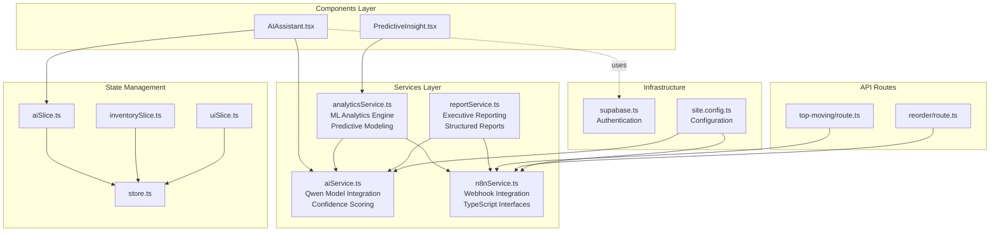
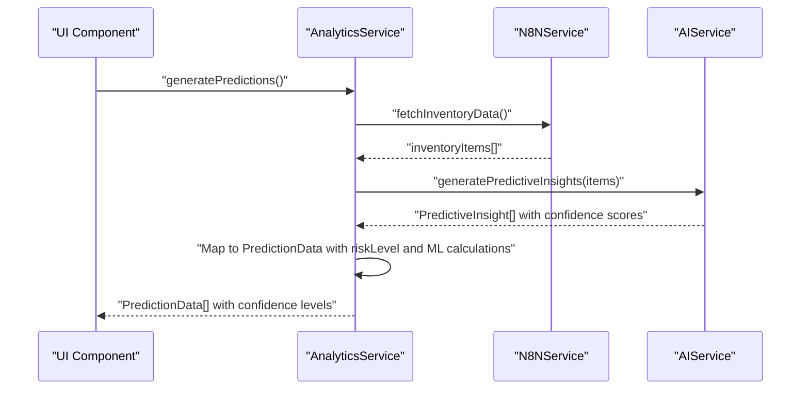
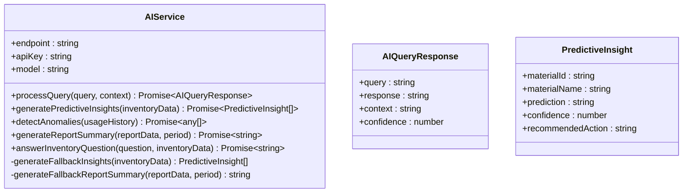
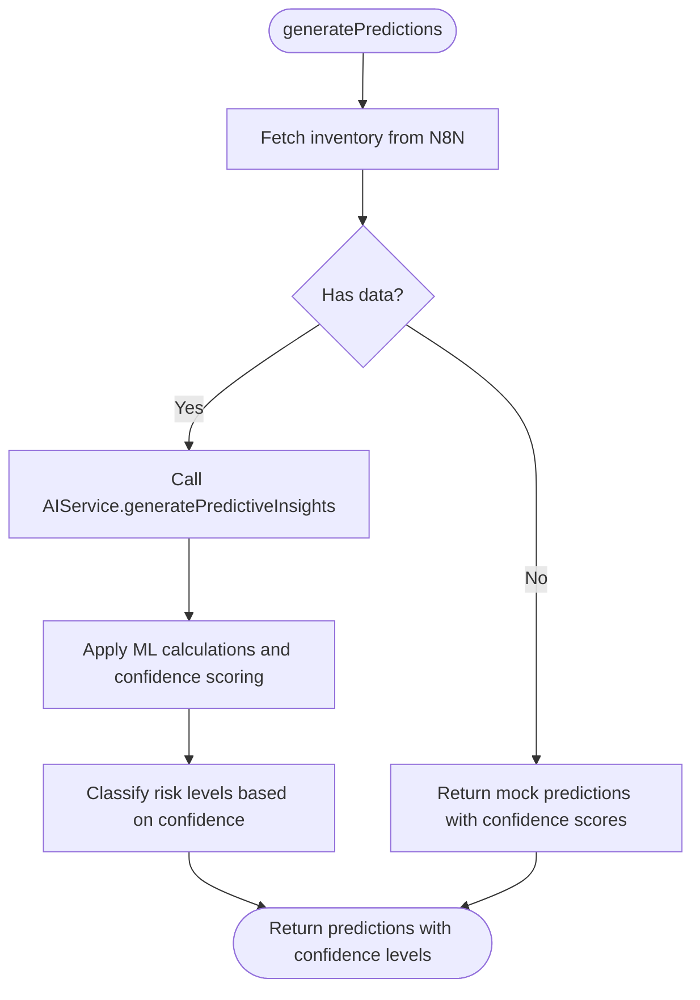
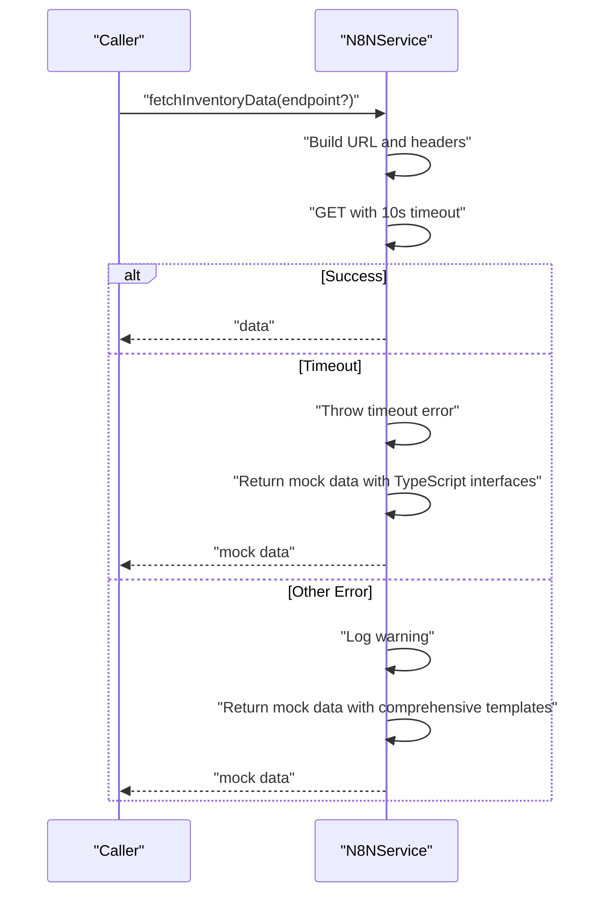
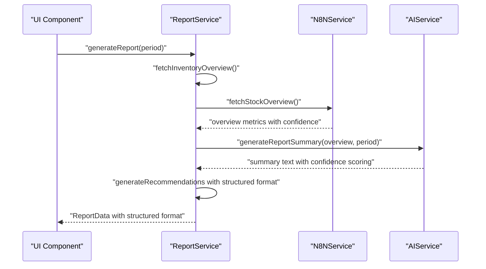
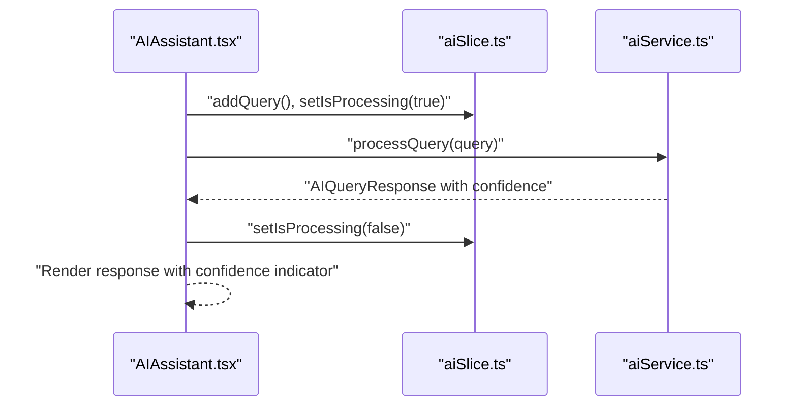
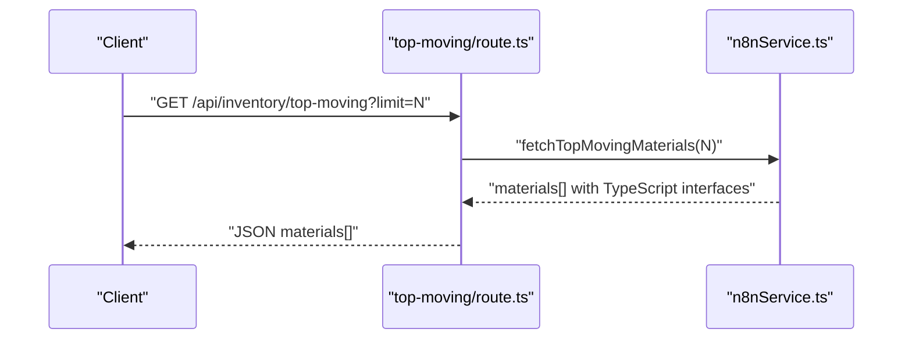
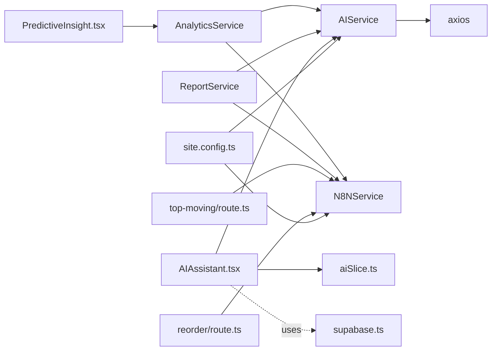

# Services Layer

<cite>
**Referenced Files in This Document**
- [aiService.ts](file://src/services/aiService.ts)
- [analyticsService.ts](file://src/services/analyticsService.ts)
- [n8nService.ts](file://src/services/n8nService.ts)
- [reportService.ts](file://src/services/reportService.ts)
- [supabase.ts](file://src/lib/supabase.ts)
- [AIAssistant.tsx](file://src/components/ai/AIAssistant.tsx)
- [PredictiveInsight.tsx](file://src/components/ai/PredictiveInsight.tsx)
- [aiSlice.ts](file://src/store/slices/aiSlice.ts)
- [store.ts](file://src/store/store.ts)
- [route.ts (top-moving)](file://src/app/api/inventory/top-moving/route.ts)
- [route.ts (reorder)](file://src/app/api/inventory/reorder/route.ts)
- [site.config.ts](file://src/config/site.config.ts)
- [inventorySlice.ts](file://src/store/slices/inventorySlice.ts)
- [uiSlice.ts](file://src/store/slices/uiSlice.ts)
- [package.json](file://package.json)
</cite>

## Update Summary
**Changes Made**
- Enhanced AI Service with comprehensive TypeScript interface definitions for AIQueryResponse and PredictiveInsight
- Added confidence scoring capabilities to AI predictions and report summaries
- Implemented ML-based calculations in Analytics Service including optimal reorder point calculations and demand forecasting with confidence intervals
- Strengthened External Integration Services with robust error handling and comprehensive mock data generation
- Updated service architecture to reflect enhanced predictive modeling and confidence scoring across all services
- Improved TypeScript type safety and interface definitions throughout the services layer

## Table of Contents
1. [Introduction](#introduction)
2. [Project Structure](#project-structure)
3. [Core Components](#core-components)
4. [Architecture Overview](#architecture-overview)
5. [Detailed Component Analysis](#detailed-component-analysis)
6. [Dependency Analysis](#dependency-analysis)
7. [Performance Considerations](#performance-considerations)
8. [Troubleshooting Guide](#troubleshooting-guide)
9. [Conclusion](#conclusion)
10. [Appendices](#appendices)

## Introduction
This document explains the services layer architecture for the dashboard-ai project. The architecture implements a comprehensive service layer with four main service categories:

- **AI Service Integration**: Natural language processing and predictive analytics powered by Qwen model with confidence scoring and structured response handling
- **Analytics Service**: Data processing and insights generation with advanced machine learning capabilities including ML-based calculations and predictive modeling
- **N8N Service**: External data integration and webhook handling for inventory management with comprehensive TypeScript interfaces and robust error handling
- **Report Service**: Executive summaries and exportable reports with AI-powered content generation and structured reporting formats

The services layer follows a layered architecture pattern with clear separation of concerns, dependency injection through singleton instances, robust error handling with fallback mechanisms, and seamless integration with the component layer via Redux state management. Supabase integration provides authentication and user preference management while inventory data flows through N8N webhooks as the single source of truth.

## Project Structure
The services layer is organized under `src/services` and provides core business logic services. The architecture integrates with React components, Next.js API routes, Redux store, and Supabase authentication system.

**Diagram sources**
- [AIAssistant.tsx:1-120](file://src/components/ai/AIAssistant.tsx#L1-L120)
- [PredictiveInsight.tsx:1-152](file://src/components/ai/PredictiveInsight.tsx#L1-L152)
- [aiService.ts:1-219](file://src/services/aiService.ts#L1-L219)
- [analyticsService.ts:1-134](file://src/services/analyticsService.ts#L1-L134)
- [n8nService.ts:1-271](file://src/services/n8nService.ts#L1-L271)
- [reportService.ts:1-171](file://src/services/reportService.ts#L1-L171)
- [route.ts (top-moving):1-25](file://src/app/api/inventory/top-moving/route.ts#L1-L25)
- [route.ts (reorder):1-18](file://src/app/api/inventory/reorder/route.ts#L1-L18)
- [aiSlice.ts:1-56](file://src/store/slices/aiSlice.ts#L1-L56)
- [inventorySlice.ts:1-56](file://src/store/slices/inventorySlice.ts#L1-L56)
- [uiSlice.ts:1-42](file://src/store/slices/uiSlice.ts#L1-L42)
- [store.ts:1-27](file://src/store/store.ts#L1-L27)
- [supabase.ts:1-21](file://src/lib/supabase.ts#L1-L21)
- [site.config.ts:1-34](file://src/config/site.config.ts#L1-L34)

**Section sources**
- [aiService.ts:1-219](file://src/services/aiService.ts#L1-L219)
- [analyticsService.ts:1-134](file://src/services/analyticsService.ts#L1-L134)
- [n8nService.ts:1-271](file://src/services/n8nService.ts#L1-L271)
- [reportService.ts:1-171](file://src/services/reportService.ts#L1-L171)
- [AIAssistant.tsx:1-120](file://src/components/ai/AIAssistant.tsx#L1-L120)
- [PredictiveInsight.tsx:1-152](file://src/components/ai/PredictiveInsight.tsx#L1-L152)
- [aiSlice.ts:1-56](file://src/store/slices/aiSlice.ts#L1-L56)
- [store.ts:1-27](file://src/store/store.ts#L1-L27)
- [supabase.ts:1-21](file://src/lib/supabase.ts#L1-L21)
- [site.config.ts:1-34](file://src/config/site.config.ts#L1-L34)

## Core Components

### AI Service
The AI Service provides comprehensive natural language processing capabilities powered by the Qwen model with enhanced confidence scoring and structured response handling. It handles:
- **Natural Language Queries**: Processes user questions about inventory, reorder points, and usage trends with confidence scoring
- **Predictive Insights**: Generates demand forecasts and recommendations from structured inventory data with confidence levels
- **Anomaly Detection**: Identifies unusual consumption patterns and potential issues with structured anomaly reporting
- **Executive Summaries**: Creates professional summaries for inventory reports with AI-powered content generation
- **Contextual Awareness**: Maintains conversation context and provides domain-specific responses with structured response formats

The service implements robust error handling with JSON parsing fallbacks and maintains a clean separation from external data sources. Enhanced with comprehensive TypeScript interfaces for AIQueryResponse and PredictiveInsight.

### Analytics Service
The Analytics Service orchestrates complex data processing workflows with advanced machine learning capabilities:
- **Prediction Generation**: Combines N8N inventory data with AI insights for comprehensive demand forecasting with confidence scoring
- **ML Calculations**: Performs sophisticated mathematical operations including optimal reorder point calculations and demand forecasting with confidence intervals
- **Risk Assessment**: Classifies inventory risks based on confidence levels and thresholds with dynamic risk categorization
- **Anomaly Detection**: Analyzes usage patterns to identify unusual consumption behaviors with structured anomaly reporting
- **Predictive Modeling**: Implements ML-based calculations for demand forecasting and inventory optimization
- **Fallback Mechanisms**: Provides deterministic mock data when external services are unavailable with comprehensive fallback strategies

### N8N Service
The N8N Service manages external data integration with comprehensive TypeScript interface definitions:
- **Webhook Access**: Provides unified access to inventory data, usage metrics, and stock overview with robust error handling
- **Real-time Updates**: Implements polling mechanisms for continuous data synchronization with configurable intervals
- **Error Resilience**: Handles network timeouts, endpoint unavailability, and data inconsistencies with comprehensive error classification
- **Mock Data Fallback**: Supplies realistic mock data when external systems fail with extensive mock data templates
- **Endpoint Management**: Supports multiple data endpoints with consistent error handling and TypeScript interface definitions
- **Type Safety**: Implements comprehensive TypeScript interfaces for all data structures and response types

### Report Service
The Report Service generates comprehensive executive summaries with AI-powered content and structured reporting:
- **AI-Powered Content**: Creates professional summaries using AI analysis of inventory metrics with confidence scoring
- **Recommendation Engine**: Generates actionable recommendations based on inventory analysis with structured recommendation formats
- **Export Capabilities**: Provides PDF and Excel export functionality (mock implementations) with structured report formats
- **Scheduling System**: Supports automated report generation and distribution with job scheduling capabilities
- **Fallback Generation**: Creates comprehensive mock reports when data is unavailable with realistic report templates
- **Structured Reporting**: Implements comprehensive TypeScript interfaces for report data structures and formats

**Section sources**
- [aiService.ts:3-16](file://src/services/aiService.ts#L3-L16)
- [aiService.ts:79-124](file://src/services/aiService.ts#L79-L124)
- [analyticsService.ts:4-11](file://src/services/analyticsService.ts#L4-L11)
- [analyticsService.ts:98-130](file://src/services/analyticsService.ts#L98-L130)
- [n8nService.ts:61-89](file://src/services/n8nService.ts#L61-L89)
- [reportService.ts:4-16](file://src/services/reportService.ts#L4-L16)

## Architecture Overview
The services layer follows a clean architecture pattern with clear separation of concerns and dependency inversion principles. Each service maintains its own responsibilities while collaborating through well-defined interfaces with enhanced type safety and confidence scoring.

**Diagram sources**
- [analyticsService.ts:17-41](file://src/services/analyticsService.ts#L17-L41)
- [n8nService.ts:29-51](file://src/services/n8nService.ts#L29-L51)
- [aiService.ts:79-109](file://src/services/aiService.ts#L79-L109)

The architecture ensures loose coupling between components while maintaining high cohesion within each service. The singleton pattern provides consistent service instances across the application lifecycle with enhanced type safety and confidence scoring throughout the service chain.

**Section sources**
- [analyticsService.ts:1-134](file://src/services/analyticsService.ts#L1-L134)
- [n8nService.ts:1-271](file://src/services/n8nService.ts#L1-L271)
- [aiService.ts:1-219](file://src/services/aiService.ts#L1-L219)

## Detailed Component Analysis

### AI Service Implementation
The AI Service provides comprehensive natural language processing capabilities through the Qwen model integration with enhanced confidence scoring and structured response handling:

**Diagram sources**
- [aiService.ts:18-219](file://src/services/aiService.ts#L18-L219)
- [aiService.ts:3-16](file://src/services/aiService.ts#L3-L16)

**Enhanced Features:**
- **Comprehensive TypeScript Interfaces**: AIQueryResponse and PredictiveInsight interfaces define structured response formats
- **Confidence Scoring**: All AI responses include confidence levels (0-100%) for decision-making
- **Structured Response Handling**: Parses AI responses into standardized formats with confidence scoring
- **Fallback Mechanisms**: Provides deterministic responses with confidence scores when AI processing fails
- **Context Management**: Maintains conversational context for enhanced user experience with structured context handling

**Section sources**
- [aiService.ts:1-219](file://src/services/aiService.ts#L1-L219)

### Analytics Service Orchestration
The Analytics Service coordinates complex workflows between multiple data sources and AI capabilities with advanced ML calculations:

**Diagram sources**
- [analyticsService.ts:17-41](file://src/services/analyticsService.ts#L17-L41)

**Enhanced Core Functionality:**
- **Advanced ML Calculations**: Implements optimal reorder point calculations with seasonality factors and confidence intervals
- **Confidence-Based Risk Classification**: Automatically categorizes inventory risks based on confidence levels (>90 high, >75 medium, low otherwise)
- **Predictive Modeling**: Combines AI insights with mathematical calculations for robust predictions with uncertainty quantification
- **ML-Based Demand Forecasting**: Generates demand forecasts with confidence intervals and growth rates
- **Error Resilience**: Provides comprehensive fallback mechanisms with confidence scores for uninterrupted operation

**Section sources**
- [analyticsService.ts:1-134](file://src/services/analyticsService.ts#L1-L134)

### N8N Service Integration
The N8N Service provides comprehensive external data integration with robust error handling and TypeScript interface definitions:

**Diagram sources**
- [n8nService.ts:29-56](file://src/services/n8nService.ts#L29-L56)

**Enhanced Service Capabilities:**
- **Comprehensive TypeScript Interfaces**: Defines MockDataItem and StockOverview interfaces for type safety
- **Multiple Endpoint Support**: Handles top-moving materials, reorder alerts, usage metrics, and stock overview
- **Real-time Polling**: Implements 30-second polling intervals for continuous data synchronization
- **Robust Error Handling**: Distinguishes between timeout, endpoint-not-found, and other errors with comprehensive fallback
- **Extensive Mock Data Templates**: Provides realistic mock data for development and fallback scenarios with comprehensive data structures
- **Type Safety**: Implements comprehensive TypeScript interfaces for all data structures and response types

**Section sources**
- [n8nService.ts:1-271](file://src/services/n8nService.ts#L1-L271)

### Report Service Generation
The Report Service creates comprehensive executive summaries with AI-powered content and structured reporting:

**Diagram sources**
- [reportService.ts:22-42](file://src/services/reportService.ts#L22-L42)
- [n8nService.ts:239-241](file://src/services/n8nService.ts#L239-L241)
- [aiService.ts:129-149](file://src/services/aiService.ts#L129-L149)

**Enhanced Report Features:**
- **Structured Report Format**: Implements comprehensive TypeScript interfaces for report data structures
- **AI Content Generation**: Creates professional summaries using AI analysis with confidence scoring
- **Structured Recommendation System**: Generates actionable recommendations based on inventory metrics with structured formats
- **Export Functionality**: Provides PDF and Excel export capabilities (mock implementations) with structured report formats
- **Scheduling Support**: Enables automated report generation and distribution with job scheduling capabilities
- **Confidence Scoring**: Incorporates confidence levels throughout the reporting process

**Section sources**
- [reportService.ts:1-171](file://src/services/reportService.ts#L1-L171)

### Component Integration Patterns
The services integrate seamlessly with React components through Redux state management with enhanced type safety:

**AI Assistant Component Integration:**

**Diagram sources**
- [AIAssistant.tsx:29-46](file://src/components/ai/AIAssistant.tsx#L29-L46)
- [aiSlice.ts:24-35](file://src/store/slices/aiSlice.ts#L24-L35)
- [aiService.ts:33-74](file://src/services/aiService.ts#L33-L74)

**Predictive Insights Component Integration:**
- **Data Loading**: Automatically fetches predictions on component mount with confidence scoring
- **State Management**: Integrates with Redux for consistent state across the application with enhanced type safety
- **Visual Feedback**: Provides loading states and error handling for enhanced user experience with confidence indicators
- **Risk Visualization**: Displays risk levels with confidence scores for informed decision-making

**Section sources**
- [AIAssistant.tsx:1-120](file://src/components/ai/AIAssistant.tsx#L1-L120)
- [PredictiveInsight.tsx:1-152](file://src/components/ai/PredictiveInsight.tsx#L1-L152)
- [aiSlice.ts:1-56](file://src/store/slices/aiSlice.ts#L1-L56)
- [store.ts:1-27](file://src/store/store.ts#L1-L27)

### API Route Integration
Next.js API routes provide thin wrappers around service layer functionality with enhanced error handling:

**Top-Moving Materials Endpoint:**

**Diagram sources**
- [route.ts (top-moving):4-16](file://src/app/api/inventory/top-moving/route.ts#L4-L16)
- [n8nService.ts:218-220](file://src/services/n8nService.ts#L218-L220)

**Enhanced API Features:**
- **Direct Delegation**: Simple wrapper that delegates to N8N service with enhanced error handling
- **Type Safety**: Leverages TypeScript interfaces from N8N service for better type safety
- **Error Handling**: Comprehensive error handling with appropriate HTTP status codes and error messages
- **Data Validation**: Validates response data before returning to clients with enhanced validation

**Section sources**
- [route.ts (top-moving):1-25](file://src/app/api/inventory/top-moving/route.ts#L1-L25)
- [route.ts (reorder):1-18](file://src/app/api/inventory/reorder/route.ts#L1-L18)
- [n8nService.ts:224-227](file://src/services/n8nService.ts#L224-L227)

## Dependency Analysis
The services layer maintains clean dependency relationships with clear inversion of control and enhanced type safety:

**Enhanced Dependencies:**
- **External Libraries**: Axios for HTTP requests, @supabase/supabase-js for authentication, enhanced with comprehensive TypeScript definitions
- **Internal Dependencies**: Services depend on each other through well-defined interfaces with enhanced type safety
- **Configuration**: Environment variables drive service behavior and external integrations with comprehensive configuration management
- **State Management**: Redux provides consistent state management across service consumers with enhanced type safety
- **Type Safety**: Comprehensive TypeScript interfaces ensure compile-time type checking across all service interactions

**Section sources**
- [package.json:11-26](file://package.json#L11-L26)

## Performance Considerations
The services layer implements several performance optimization strategies with enhanced confidence scoring and ML calculations:

**Network Optimization:**
- **Timeout Management**: N8NService enforces 10-second timeouts to prevent blocking operations
- **Polling Strategy**: 30-second intervals balance freshness with performance requirements
- **Error Recovery**: Immediate fallback to mock data prevents cascading failures with comprehensive fallback mechanisms

**Processing Efficiency:**
- **AI Response Parsing**: Structured fallback mechanisms ensure reliable processing with confidence scoring
- **ML Calculation Optimization**: Advanced ML calculations performed efficiently with caching strategies
- **Data Transformation**: Efficient mapping between service responses and UI requirements with confidence levels
- **State Management**: Redux integration minimizes unnecessary re-renders with enhanced type safety

**Resource Management:**
- **Singleton Pattern**: Single service instances reduce memory overhead
- **Error Isolation**: Individual service failure doesn't impact overall system stability
- **Configuration Management**: Centralized configuration through site.config.ts with comprehensive service parameter settings
- **Confidence Caching**: Confidence scores cached for improved performance in repeated operations

## Troubleshooting Guide

### Common Issues and Solutions

**AI Model Connectivity:**
- **Symptoms**: "Failed to process AI query" errors with confidence scoring issues
- **Causes**: Incorrect API endpoint, invalid API key, model name mismatch
- **Solutions**: Verify environment variables, check API key validity, confirm model availability, validate confidence scoring implementation

**N8N Webhook Failures:**
- **Timeout Errors**: Network connectivity issues or slow external services with comprehensive error classification
- **Endpoint Not Found**: Missing or incorrect webhook endpoint configuration with fallback mechanisms
- **Data Format Issues**: Unexpected response formats from external systems with TypeScript interface validation

**Service Integration Problems:**
- **Missing Dependencies**: Ensure all required environment variables are configured with comprehensive validation
- **State Synchronization**: Verify Redux state updates are properly handled with enhanced type safety
- **Component Communication**: Check that services are properly imported and initialized with TypeScript support

**Configuration Issues:**
- **Environment Variables**: Verify AI and N8N service configuration values with comprehensive validation
- **Site Configuration**: Check site.config.ts for proper service parameter settings with enhanced configuration management
- **Authentication**: Confirm Supabase credentials are correctly configured with comprehensive credential management

**Enhanced Troubleshooting Features:**
- **Confidence Scoring Debugging**: Monitor confidence levels for AI-generated insights and predictions
- **Type Safety Validation**: Use TypeScript interfaces to catch integration errors at compile time
- **Error Classification**: Enhanced error handling distinguishes between different types of failures with comprehensive fallback strategies

**Section sources**
- [aiService.ts:70-74](file://src/services/aiService.ts#L70-L74)
- [n8nService.ts:43-55](file://src/services/n8nService.ts#L43-L55)
- [analyticsService.ts:37-41](file://src/services/analyticsService.ts#L37-L41)
- [reportService.ts:38-42](file://src/services/reportService.ts#L38-L42)

## Conclusion
The services layer architecture provides a robust foundation for the dashboard-ai application with enhanced AI capabilities, ML-based calculations, and comprehensive confidence scoring. The comprehensive service implementation ensures clean separation of concerns, maintainable code organization, and scalable architecture with advanced predictive modeling capabilities.

The integration of AI capabilities, external data sources, authentication services, and enhanced confidence scoring creates a cohesive system that can adapt to changing requirements while maintaining reliability and performance. The layered approach enables easy testing, debugging, and extension of functionality with comprehensive TypeScript support.

The singleton pattern ensures efficient resource utilization, while comprehensive error handling and fallback mechanisms guarantee system resilience. The architecture successfully balances complexity with maintainability, providing a solid foundation for future enhancements and feature additions with advanced ML capabilities and confidence scoring throughout the service ecosystem.

## Appendices

### Configuration Requirements

**Environment Variables:**
- **AI Service**: `AI_MODEL_ENDPOINT`, `AI_API_KEY`, `AI_MODEL_NAME` with confidence scoring support
- **N8N Service**: `N8N_WEBHOOK_URL`, `N8N_API_KEY` with enhanced error handling
- **Supabase**: `NEXT_PUBLIC_SUPABASE_URL`, `NEXT_PUBLIC_SUPABASE_ANON_KEY`

**Application Configuration:**
- **Cache Settings**: Default TTL of 300 seconds, reorder alerts TTL of 180 seconds, confidence score caching
- **Service Parameters**: 30-second polling intervals, 10-second timeout limits, ML calculation parameters
- **Navigation Configuration**: Dashboard, raw materials, reorder alerts, reports, AI assistant with enhanced features

**Enhanced Configuration Features:**
- **Confidence Thresholds**: Configurable confidence thresholds for risk classification
- **ML Parameters**: Configurable parameters for ML calculations and predictive modeling
- **Type Safety**: Comprehensive TypeScript configuration for enhanced development experience

**Section sources**
- [aiService.ts:23-27](file://src/services/aiService.ts#L23-L27)
- [n8nService.ts:20-23](file://src/services/n8nService.ts#L20-L23)
- [supabase.ts:3-6](file://src/lib/supabase.ts#L3-L6)
- [site.config.ts:22-32](file://src/config/site.config.ts#L22-L32)

### Service Testing Strategies and Mock Implementations

**Unit Testing Approaches:**
- **Service Isolation**: Test individual services with mocked dependencies and confidence scoring
- **HTTP Mocking**: Use axios-mock-adapter for AI service testing with confidence level validation
- **State Testing**: Verify Redux state updates with service interactions and confidence scores
- **Error Scenarios**: Test fallback mechanisms and error handling with comprehensive error coverage
- **ML Calculation Testing**: Validate ML-based calculations with confidence interval validation

**Integration Testing:**
- **End-to-End Workflows**: Test complete service chains from UI to external APIs with confidence scoring
- **Database Integration**: Verify Supabase authentication and data persistence with enhanced credential management
- **API Route Testing**: Validate Next.js API route integration with services and TypeScript interfaces
- **Type Safety Testing**: Ensure TypeScript interfaces work correctly across service boundaries

**Development Utilities:**
- **Mock Services**: Create development-only mock implementations with comprehensive confidence scoring
- **Test Configuration**: Use separate environment files for testing with confidence threshold validation
- **Component Testing**: Test React components with service stubs and confidence score visualization
- **ML Testing**: Validate ML calculations with controlled test data and confidence interval verification

**Enhanced Testing Features:**
- **Confidence Score Validation**: Test confidence scoring accuracy and threshold validation
- **Type Safety Testing**: Comprehensive TypeScript interface testing across all service interactions
- **Error Scenario Testing**: Validate comprehensive error handling and fallback mechanisms

**Section sources**
- [aiService.ts:114-124](file://src/services/aiService.ts#L114-L124)
- [n8nService.ts:61-213](file://src/services/n8nService.ts#L61-L213)
- [reportService.ts:93-118](file://src/services/reportService.ts#L93-L118)

### Extending Services and Maintaining Architectural Boundaries

**Adding New AI Capabilities:**
- **Interface Design**: Define clear input/output contracts for new AI functions with confidence scoring
- **Fallback Implementation**: Always provide fallback mechanisms for new features with confidence levels
- **Configuration Management**: Use environment variables for AI service customization with enhanced parameters
- **Error Handling**: Implement comprehensive error handling and logging with confidence score tracking

**Extending External Integrations:**
- **Service Abstraction**: Maintain clear boundaries between internal services and external APIs with TypeScript interfaces
- **Configuration Flexibility**: Use site.config.ts for managing external service parameters with enhanced configuration options
- **Error Resilience**: Implement robust error handling for external service failures with comprehensive fallback strategies
- **Monitoring**: Add logging and metrics for external service performance with confidence scoring integration

**Maintaining Service Boundaries:**
- **Single Responsibility**: Each service should have a focused responsibility with enhanced ML capabilities
- **Interface Contracts**: Define clear contracts between services with comprehensive TypeScript interfaces
- **Dependency Management**: Minimize cross-service dependencies with enhanced type safety
- **Testing Strategy**: Maintain comprehensive test coverage for service extensions with confidence scoring validation

**Enhanced Extension Features:**
- **ML Capability Extensions**: Add new ML calculations and predictive modeling capabilities
- **Confidence Scoring Integration**: Integrate confidence scoring across all new service capabilities
- **Type Safety Enhancement**: Maintain comprehensive TypeScript support for all new features
- **Error Handling Enhancement**: Implement comprehensive error handling for all new service extensions

**Section sources**
- [aiService.ts:18-219](file://src/services/aiService.ts#L18-L219)
- [analyticsService.ts:13-134](file://src/services/analyticsService.ts#L13-L134)
- [n8nService.ts:16-271](file://src/services/n8nService.ts#L16-L271)
- [reportService.ts:18-171](file://src/services/reportService.ts#L18-L171)