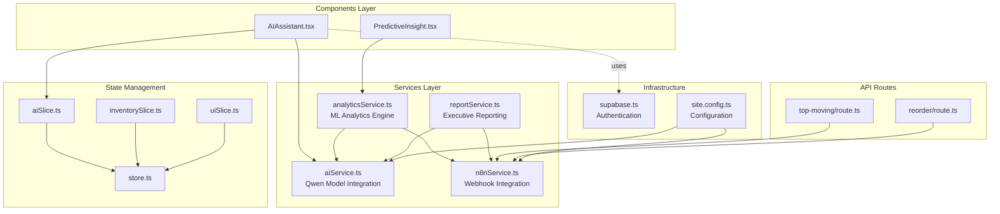
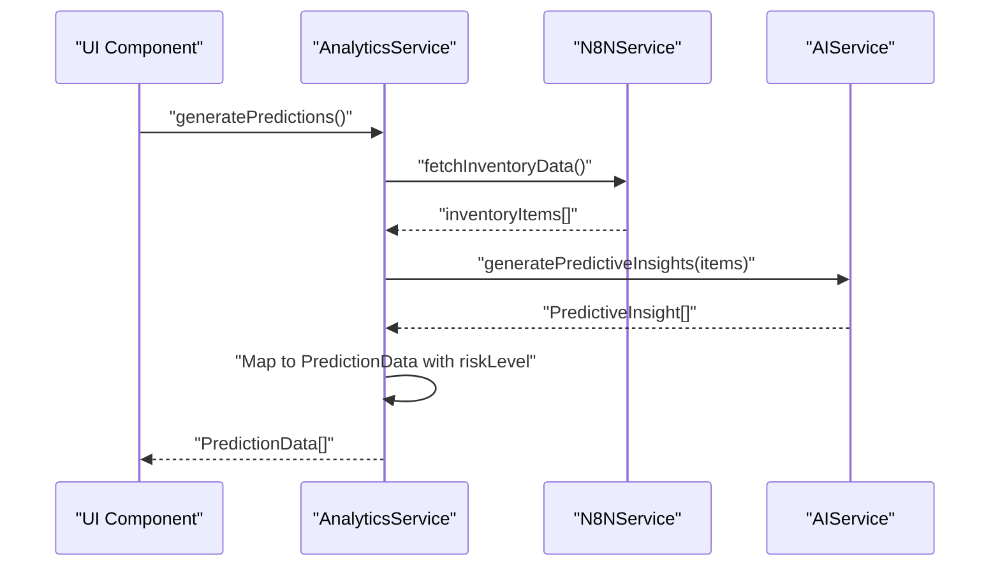
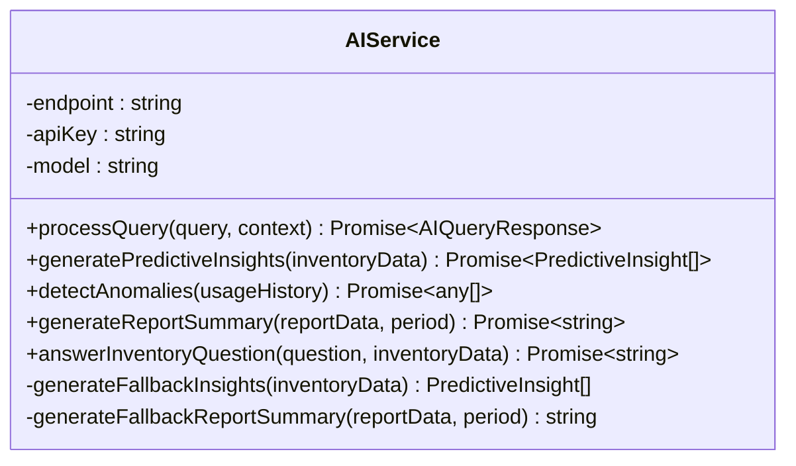
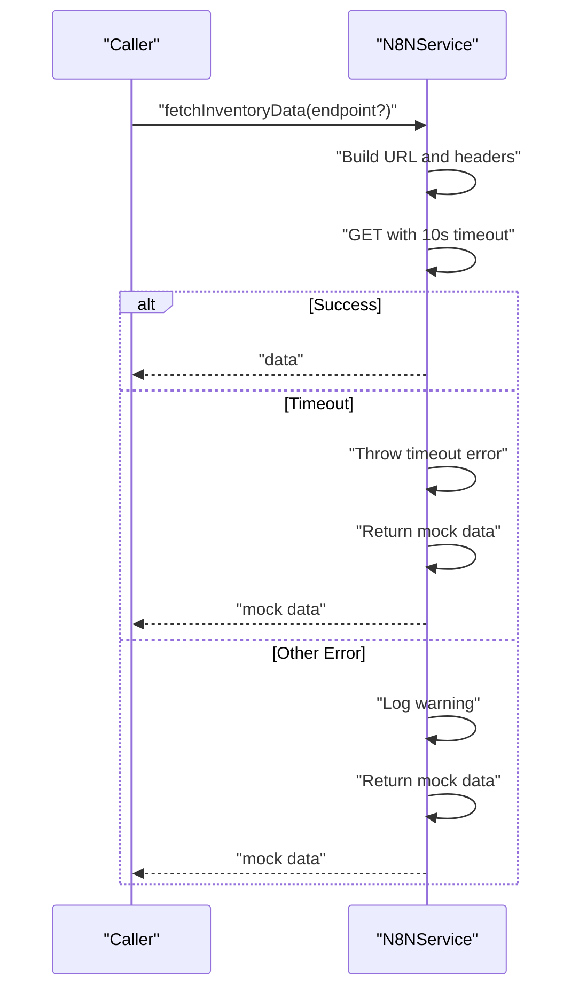
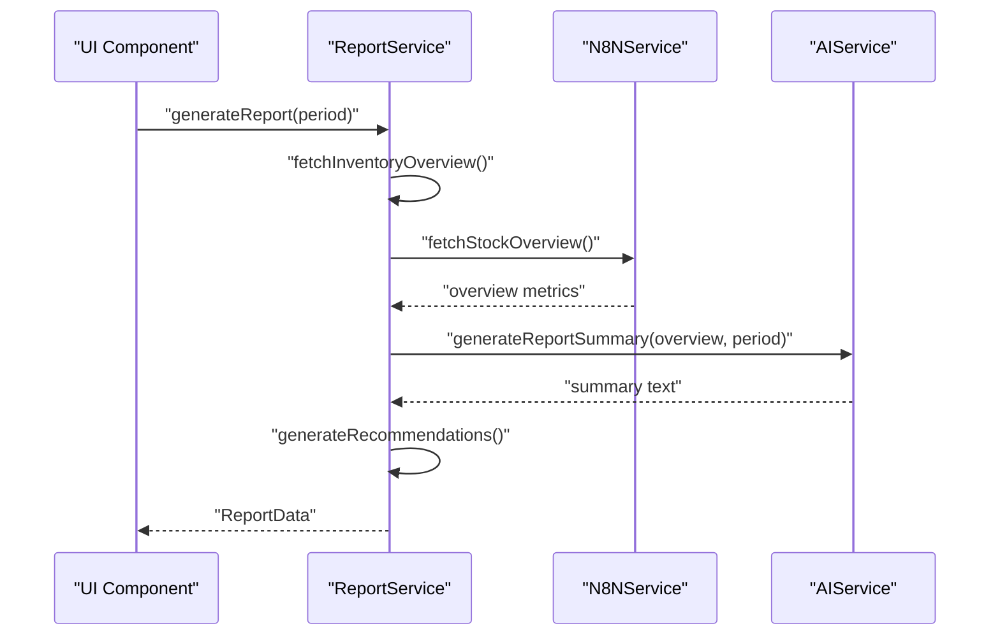
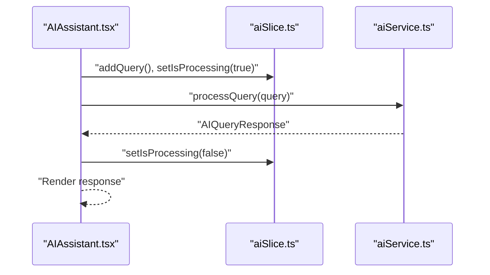
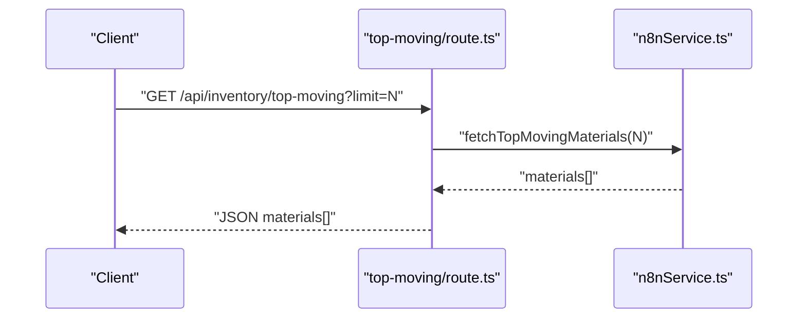
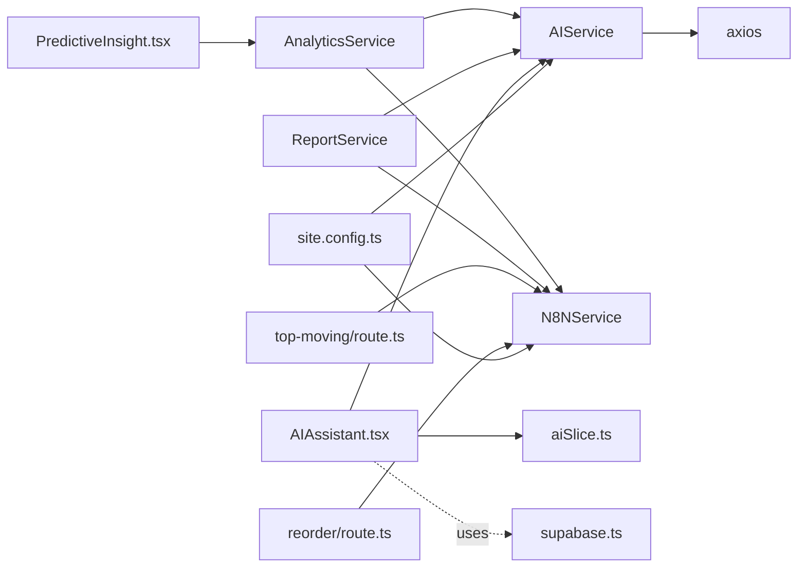

# Services Layer

<cite>
**Referenced Files in This Document**
- [aiService.ts](file://src/services/aiService.ts)
- [analyticsService.ts](file://src/services/analyticsService.ts)
- [n8nService.ts](file://src/services/n8nService.ts)
- [reportService.ts](file://src/services/reportService.ts)
- [supabase.ts](file://src/lib/supabase.ts)
- [AIAssistant.tsx](file://src/components/ai/AIAssistant.tsx)
- [PredictiveInsight.tsx](file://src/components/ai/PredictiveInsight.tsx)
- [aiSlice.ts](file://src/store/slices/aiSlice.ts)
- [store.ts](file://src/store/store.ts)
- [route.ts (top-moving)](file://src/app/api/inventory/top-moving/route.ts)
- [route.ts (reorder)](file://src/app/api/inventory/reorder/route.ts)
- [site.config.ts](file://src/config/site.config.ts)
- [inventorySlice.ts](file://src/store/slices/inventorySlice.ts)
- [uiSlice.ts](file://src/store/slices/uiSlice.ts)
- [package.json](file://package.json)
</cite>

## Update Summary
**Changes Made**
- Updated service architecture documentation to reflect comprehensive service layer implementation
- Added detailed coverage of AI service integration with Qwen model for natural language processing
- Enhanced analytics service documentation with predictive analytics and machine learning capabilities
- Expanded n8n service documentation covering external data integration and webhook handling
- Updated report service documentation with AI-powered executive summaries and export capabilities
- Integrated Supabase authentication service documentation for user management and preferences
- Added configuration management through site.config.ts for service parameters
- Enhanced component integration patterns with Redux state management

## Table of Contents
1. [Introduction](#introduction)
2. [Project Structure](#project-structure)
3. [Core Components](#core-components)
4. [Architecture Overview](#architecture-overview)
5. [Detailed Component Analysis](#detailed-component-analysis)
6. [Dependency Analysis](#dependency-analysis)
7. [Performance Considerations](#performance-considerations)
8. [Troubleshooting Guide](#troubleshooting-guide)
9. [Conclusion](#conclusion)
10. [Appendices](#appendices)

## Introduction
This document explains the services layer architecture for the dashboard-ai project. The architecture implements a comprehensive service layer with four main service categories:

- **AI Service Integration**: Natural language processing and predictive analytics powered by Qwen model
- **Analytics Service**: Data processing and insights generation with machine learning capabilities
- **N8N Service**: External data integration and webhook handling for inventory management
- **Report Service**: Executive summaries and exportable reports with AI-powered content generation

The services layer follows a layered architecture pattern with clear separation of concerns, dependency injection through singleton instances, robust error handling with fallback mechanisms, and seamless integration with the component layer via Redux state management. Supabase integration provides authentication and user preference management while inventory data flows through N8N webhooks as the single source of truth.

## Project Structure
The services layer is organized under `src/services` and provides core business logic services. The architecture integrates with React components, Next.js API routes, Redux store, and Supabase authentication system.

**Diagram sources**
- [AIAssistant.tsx:1-120](file://src/components/ai/AIAssistant.tsx#L1-L120)
- [PredictiveInsight.tsx:1-152](file://src/components/ai/PredictiveInsight.tsx#L1-L152)
- [aiService.ts:1-219](file://src/services/aiService.ts#L1-L219)
- [analyticsService.ts:1-134](file://src/services/analyticsService.ts#L1-L134)
- [n8nService.ts:1-271](file://src/services/n8nService.ts#L1-L271)
- [reportService.ts:1-171](file://src/services/reportService.ts#L1-L171)
- [route.ts (top-moving):1-25](file://src/app/api/inventory/top-moving/route.ts#L1-L25)
- [route.ts (reorder):1-18](file://src/app/api/inventory/reorder/route.ts#L1-L18)
- [aiSlice.ts:1-56](file://src/store/slices/aiSlice.ts#L1-L56)
- [inventorySlice.ts:1-56](file://src/store/slices/inventorySlice.ts#L1-L56)
- [uiSlice.ts:1-42](file://src/store/slices/uiSlice.ts#L1-L42)
- [store.ts:1-27](file://src/store/store.ts#L1-L27)
- [supabase.ts:1-21](file://src/lib/supabase.ts#L1-L21)
- [site.config.ts:1-34](file://src/config/site.config.ts#L1-L34)

**Section sources**
- [aiService.ts:1-219](file://src/services/aiService.ts#L1-L219)
- [analyticsService.ts:1-134](file://src/services/analyticsService.ts#L1-L134)
- [n8nService.ts:1-271](file://src/services/n8nService.ts#L1-L271)
- [reportService.ts:1-171](file://src/services/reportService.ts#L1-L171)
- [AIAssistant.tsx:1-120](file://src/components/ai/AIAssistant.tsx#L1-L120)
- [PredictiveInsight.tsx:1-152](file://src/components/ai/PredictiveInsight.tsx#L1-L152)
- [aiSlice.ts:1-56](file://src/store/slices/aiSlice.ts#L1-L56)
- [store.ts:1-27](file://src/store/store.ts#L1-L27)
- [supabase.ts:1-21](file://src/lib/supabase.ts#L1-L21)
- [site.config.ts:1-34](file://src/config/site.config.ts#L1-L34)

## Core Components

### AI Service
The AI Service provides comprehensive natural language processing capabilities powered by the Qwen model. It handles:
- **Natural Language Queries**: Processes user questions about inventory, reorder points, and usage trends
- **Predictive Insights**: Generates demand forecasts and recommendations from structured inventory data
- **Anomaly Detection**: Identifies unusual consumption patterns and potential issues
- **Executive Summaries**: Creates professional summaries for inventory reports
- **Contextual Awareness**: Maintains conversation context and provides domain-specific responses

The service implements robust error handling with JSON parsing fallbacks and maintains a clean separation from external data sources.

### Analytics Service
The Analytics Service orchestrates complex data processing workflows:
- **Prediction Generation**: Combines N8N inventory data with AI insights for comprehensive demand forecasting
- **Anomaly Detection**: Analyzes usage patterns to identify unusual consumption behaviors
- **ML Calculations**: Performs mathematical operations like reorder point calculations and demand forecasting
- **Risk Assessment**: Classifies inventory risks based on confidence levels and thresholds
- **Fallback Mechanisms**: Provides deterministic mock data when external services are unavailable

### N8N Service
The N8N Service manages external data integration:
- **Webhook Access**: Provides unified access to inventory data, usage metrics, and stock overview
- **Real-time Updates**: Implements polling mechanisms for continuous data synchronization
- **Error Resilience**: Handles network timeouts, endpoint unavailability, and data inconsistencies
- **Mock Data Fallback**: Supplies realistic mock data when external systems fail
- **Endpoint Management**: Supports multiple data endpoints with consistent error handling

### Report Service
The Report Service generates comprehensive executive summaries:
- **AI-Powered Content**: Creates professional summaries using AI analysis of inventory metrics
- **Recommendation Engine**: Generates actionable recommendations based on inventory analysis
- **Export Capabilities**: Provides PDF and Excel export functionality (mock implementations)
- **Scheduling System**: Supports automated report generation and distribution
- **Fallback Generation**: Creates comprehensive mock reports when data is unavailable

**Section sources**
- [aiService.ts:18-219](file://src/services/aiService.ts#L18-L219)
- [analyticsService.ts:13-134](file://src/services/analyticsService.ts#L13-L134)
- [n8nService.ts:16-271](file://src/services/n8nService.ts#L16-L271)
- [reportService.ts:18-171](file://src/services/reportService.ts#L18-L171)

## Architecture Overview
The services layer follows a clean architecture pattern with clear separation of concerns and dependency inversion principles. Each service maintains its own responsibilities while collaborating through well-defined interfaces.

**Diagram sources**
- [analyticsService.ts:17-41](file://src/services/analyticsService.ts#L17-L41)
- [n8nService.ts:29-51](file://src/services/n8nService.ts#L29-L51)
- [aiService.ts:79-109](file://src/services/aiService.ts#L79-L109)

The architecture ensures loose coupling between components while maintaining high cohesion within each service. The singleton pattern provides consistent service instances across the application lifecycle.

**Section sources**
- [analyticsService.ts:1-134](file://src/services/analyticsService.ts#L1-L134)
- [n8nService.ts:1-271](file://src/services/n8nService.ts#L1-L271)
- [aiService.ts:1-219](file://src/services/aiService.ts#L1-L219)

## Detailed Component Analysis

### AI Service Implementation
The AI Service provides comprehensive natural language processing capabilities through the Qwen model integration:

**Diagram sources**
- [aiService.ts:18-219](file://src/services/aiService.ts#L18-L219)

**Key Features:**
- **Environment Configuration**: Uses `AI_MODEL_ENDPOINT`, `AI_API_KEY`, and `AI_MODEL_NAME` environment variables
- **Structured Response Handling**: Parses AI responses into standardized formats
- **Fallback Mechanisms**: Provides deterministic responses when AI processing fails
- **Context Management**: Maintains conversational context for enhanced user experience

**Section sources**
- [aiService.ts:1-219](file://src/services/aiService.ts#L1-L219)

### Analytics Service Orchestration
The Analytics Service coordinates complex workflows between multiple data sources and AI capabilities:

**Diagram sources**
- [analyticsService.ts:17-41](file://src/services/analyticsService.ts#L17-L41)

**Core Functionality:**
- **Data Flow Management**: Coordinates between N8N data sources and AI processing
- **Risk Classification**: Automatically categorizes inventory risks based on confidence levels
- **ML Integration**: Combines AI insights with mathematical calculations for robust predictions
- **Error Resilience**: Provides comprehensive fallback mechanisms for uninterrupted operation

**Section sources**
- [analyticsService.ts:1-134](file://src/services/analyticsService.ts#L1-L134)

### N8N Service Integration
The N8N Service provides comprehensive external data integration with robust error handling:

**Diagram sources**
- [n8nService.ts:29-56](file://src/services/n8nService.ts#L29-L56)

**Service Capabilities:**
- **Multiple Endpoint Support**: Handles top-moving materials, reorder alerts, usage metrics, and stock overview
- **Real-time Polling**: Implements 30-second polling intervals for continuous data synchronization
- **Comprehensive Error Handling**: Distinguishes between timeout, endpoint-not-found, and other errors
- **Mock Data Generation**: Provides realistic mock data for development and fallback scenarios

**Section sources**
- [n8nService.ts:1-271](file://src/services/n8nService.ts#L1-L271)

### Report Service Generation
The Report Service creates comprehensive executive summaries with AI-powered content:

**Diagram sources**
- [reportService.ts:22-42](file://src/services/reportService.ts#L22-L42)
- [n8nService.ts:239-241](file://src/services/n8nService.ts#L239-L241)
- [aiService.ts:129-149](file://src/services/aiService.ts#L129-L149)

**Report Features:**
- **AI Content Generation**: Creates professional summaries using AI analysis
- **Recommendation System**: Generates actionable recommendations based on inventory metrics
- **Export Functionality**: Provides PDF and Excel export capabilities (mock implementations)
- **Scheduling Support**: Enables automated report generation and distribution

**Section sources**
- [reportService.ts:1-171](file://src/services/reportService.ts#L1-L171)

### Component Integration Patterns
The services integrate seamlessly with React components through Redux state management:

**AI Assistant Component Integration:**

**Diagram sources**
- [AIAssistant.tsx:29-46](file://src/components/ai/AIAssistant.tsx#L29-L46)
- [aiSlice.ts:24-35](file://src/store/slices/aiSlice.ts#L24-L35)
- [aiService.ts:33-74](file://src/services/aiService.ts#L33-L74)

**Predictive Insights Component Integration:**
- **Data Loading**: Automatically fetches predictions on component mount
- **State Management**: Integrates with Redux for consistent state across the application
- **Visual Feedback**: Provides loading states and error handling for enhanced user experience

**Section sources**
- [AIAssistant.tsx:1-120](file://src/components/ai/AIAssistant.tsx#L1-L120)
- [PredictiveInsight.tsx:1-152](file://src/components/ai/PredictiveInsight.tsx#L1-L152)
- [aiSlice.ts:1-56](file://src/store/slices/aiSlice.ts#L1-L56)
- [store.ts:1-27](file://src/store/store.ts#L1-L27)

### API Route Integration
Next.js API routes provide thin wrappers around service layer functionality:

**Top-Moving Materials Endpoint:**

**Diagram sources**
- [route.ts (top-moving):4-16](file://src/app/api/inventory/top-moving/route.ts#L4-L16)
- [n8nService.ts:218-220](file://src/services/n8nService.ts#L218-L220)

**Reorder Alerts Endpoint:**
- **Direct Delegation**: Simple wrapper that delegates to N8N service
- **Error Handling**: Comprehensive error handling with appropriate HTTP status codes
- **Data Validation**: Validates response data before returning to clients

**Section sources**
- [route.ts (top-moving):1-25](file://src/app/api/inventory/top-moving/route.ts#L1-L25)
- [route.ts (reorder):1-18](file://src/app/api/inventory/reorder/route.ts#L1-L18)
- [n8nService.ts:224-227](file://src/services/n8nService.ts#L224-L227)

## Dependency Analysis
The services layer maintains clean dependency relationships with clear inversion of control:

**Key Dependencies:**
- **External Libraries**: Axios for HTTP requests, @supabase/supabase-js for authentication
- **Internal Dependencies**: Services depend on each other through well-defined interfaces
- **Configuration**: Environment variables drive service behavior and external integrations
- **State Management**: Redux provides consistent state management across service consumers

**Section sources**
- [package.json:11-26](file://package.json#L11-L26)

## Performance Considerations
The services layer implements several performance optimization strategies:

**Network Optimization:**
- **Timeout Management**: N8NService enforces 10-second timeouts to prevent blocking operations
- **Polling Strategy**: 30-second intervals balance freshness with performance requirements
- **Error Recovery**: Immediate fallback to mock data prevents cascading failures

**Processing Efficiency:**
- **AI Response Parsing**: Structured fallback mechanisms ensure reliable processing
- **Data Transformation**: Efficient mapping between service responses and UI requirements
- **State Management**: Redux integration minimizes unnecessary re-renders

**Resource Management:**
- **Singleton Pattern**: Single service instances reduce memory overhead
- **Error Isolation**: Individual service failure doesn't impact overall system stability
- **Configuration Management**: Centralized configuration through site.config.ts

## Troubleshooting Guide

### Common Issues and Solutions

**AI Model Connectivity:**
- **Symptoms**: "Failed to process AI query" errors
- **Causes**: Incorrect API endpoint, invalid API key, model name mismatch
- **Solutions**: Verify environment variables, check API key validity, confirm model availability

**N8N Webhook Failures:**
- **Timeout Errors**: Network connectivity issues or slow external services
- **Endpoint Not Found**: Missing or incorrect webhook endpoint configuration
- **Data Format Issues**: Unexpected response formats from external systems

**Service Integration Problems:**
- **Missing Dependencies**: Ensure all required environment variables are configured
- **State Synchronization**: Verify Redux state updates are properly handled
- **Component Communication**: Check that services are properly imported and initialized

**Configuration Issues:**
- **Environment Variables**: Verify AI and N8N service configuration values
- **Site Configuration**: Check site.config.ts for proper service parameter settings
- **Authentication**: Confirm Supabase credentials are correctly configured

**Section sources**
- [aiService.ts:70-74](file://src/services/aiService.ts#L70-L74)
- [n8nService.ts:43-55](file://src/services/n8nService.ts#L43-L55)
- [analyticsService.ts:37-41](file://src/services/analyticsService.ts#L37-L41)
- [reportService.ts:38-42](file://src/services/reportService.ts#L38-L42)

## Conclusion
The services layer architecture provides a robust foundation for the dashboard-ai application. The comprehensive service implementation ensures clean separation of concerns, maintainable code organization, and scalable architecture. The integration of AI capabilities, external data sources, and authentication services creates a cohesive system that can adapt to changing requirements while maintaining reliability and performance.

The layered approach enables easy testing, debugging, and extension of functionality. The singleton pattern ensures efficient resource utilization, while comprehensive error handling and fallback mechanisms guarantee system resilience. The architecture successfully balances complexity with maintainability, providing a solid foundation for future enhancements and feature additions.

## Appendices

### Configuration Requirements

**Environment Variables:**
- **AI Service**: `AI_MODEL_ENDPOINT`, `AI_API_KEY`, `AI_MODEL_NAME`
- **N8N Service**: `N8N_WEBHOOK_URL`, `N8N_API_KEY`
- **Supabase**: `NEXT_PUBLIC_SUPABASE_URL`, `NEXT_PUBLIC_SUPABASE_ANON_KEY`

**Application Configuration:**
- **Cache Settings**: Default TTL of 300 seconds, reorder alerts TTL of 180 seconds
- **Service Parameters**: 30-second polling intervals, 10-second timeout limits
- **Navigation Configuration**: Dashboard, raw materials, reorder alerts, reports, AI assistant

**Section sources**
- [aiService.ts:23-27](file://src/services/aiService.ts#L23-L27)
- [n8nService.ts:20-23](file://src/services/n8nService.ts#L20-L23)
- [supabase.ts:3-6](file://src/lib/supabase.ts#L3-L6)
- [site.config.ts:22-32](file://src/config/site.config.ts#L22-L32)

### Service Testing Strategies and Mock Implementations

**Unit Testing Approaches:**
- **Service Isolation**: Test individual services with mocked dependencies
- **HTTP Mocking**: Use axios-mock-adapter for AI service testing
- **State Testing**: Verify Redux state updates with service interactions
- **Error Scenarios**: Test fallback mechanisms and error handling

**Integration Testing:**
- **End-to-End Workflows**: Test complete service chains from UI to external APIs
- **Database Integration**: Verify Supabase authentication and data persistence
- **API Route Testing**: Validate Next.js API route integration with services

**Development Utilities:**
- **Mock Services**: Create development-only mock implementations
- **Test Configuration**: Use separate environment files for testing
- **Component Testing**: Test React components with service stubs

**Section sources**
- [aiService.ts:114-124](file://src/services/aiService.ts#L114-L124)
- [n8nService.ts:61-213](file://src/services/n8nService.ts#L61-L213)
- [reportService.ts:93-118](file://src/services/reportService.ts#L93-L118)

### Extending Services and Maintaining Architectural Boundaries

**Adding New AI Capabilities:**
- **Interface Design**: Define clear input/output contracts for new AI functions
- **Fallback Implementation**: Always provide fallback mechanisms for new features
- **Configuration Management**: Use environment variables for AI service customization
- **Error Handling**: Implement comprehensive error handling and logging

**Extending External Integrations:**
- **Service Abstraction**: Maintain clear boundaries between internal services and external APIs
- **Configuration Flexibility**: Use site.config.ts for managing external service parameters
- **Error Resilience**: Implement robust error handling for external service failures
- **Monitoring**: Add logging and metrics for external service performance

**Maintaining Service Boundaries:**
- **Single Responsibility**: Each service should have a focused responsibility
- **Interface Contracts**: Define clear contracts between services
- **Dependency Management**: Minimize cross-service dependencies
- **Testing Strategy**: Maintain comprehensive test coverage for service extensions

**Section sources**
- [aiService.ts:18-219](file://src/services/aiService.ts#L18-L219)
- [analyticsService.ts:13-134](file://src/services/analyticsService.ts#L13-L134)
- [n8nService.ts:16-271](file://src/services/n8nService.ts#L16-L271)
- [reportService.ts:18-171](file://src/services/reportService.ts#L18-L171)