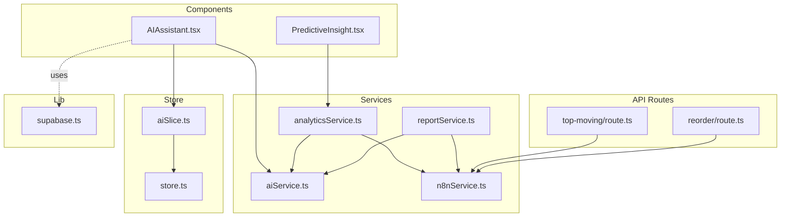
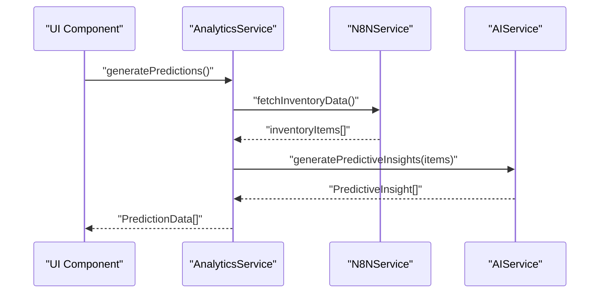
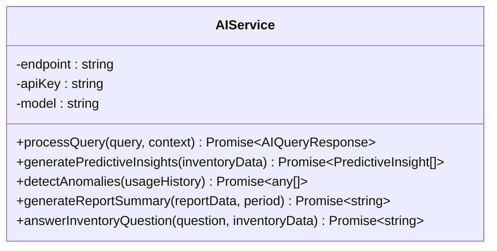
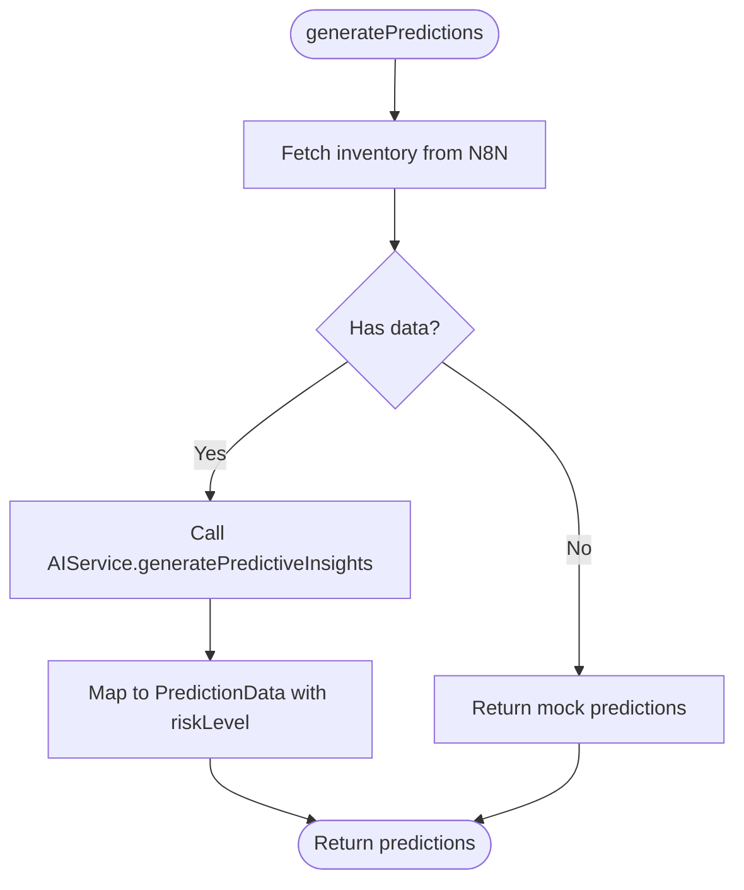
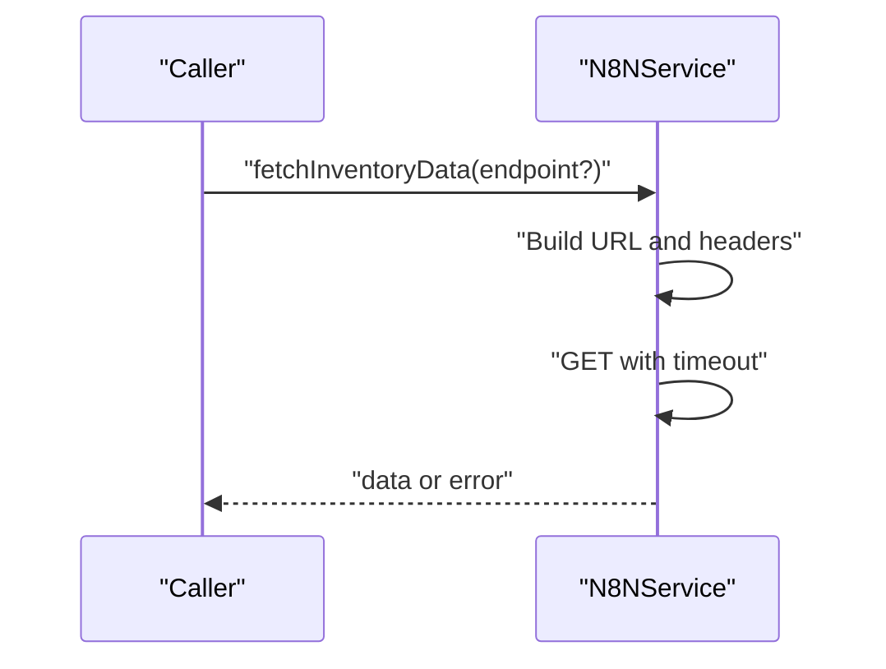
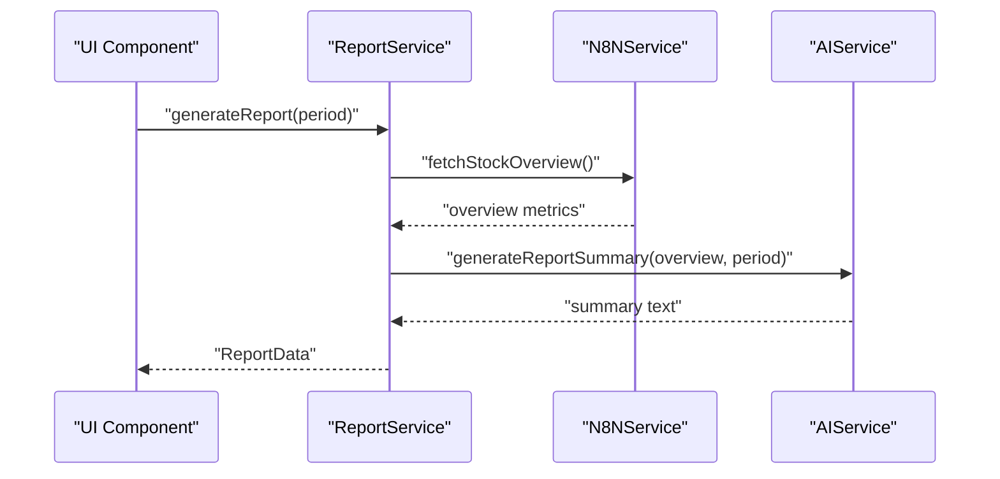
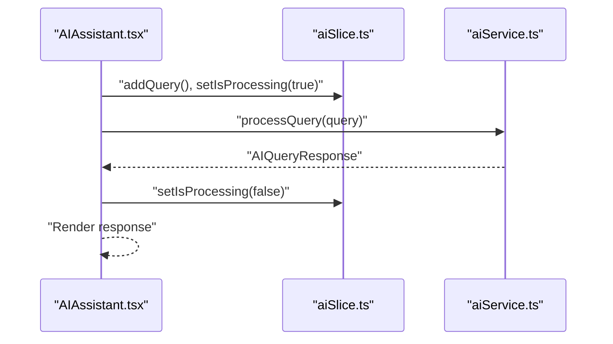
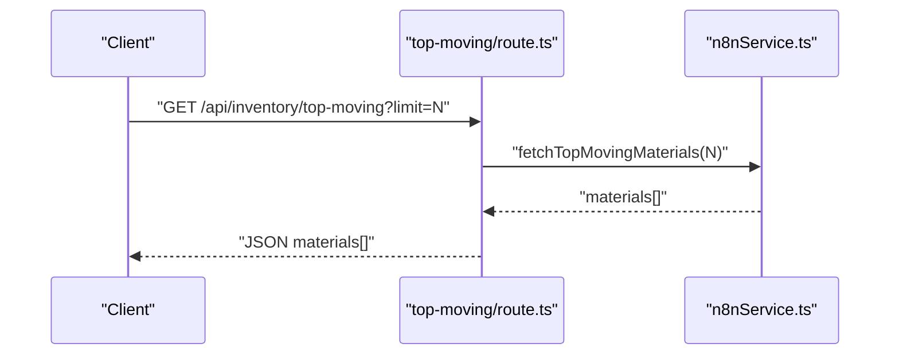
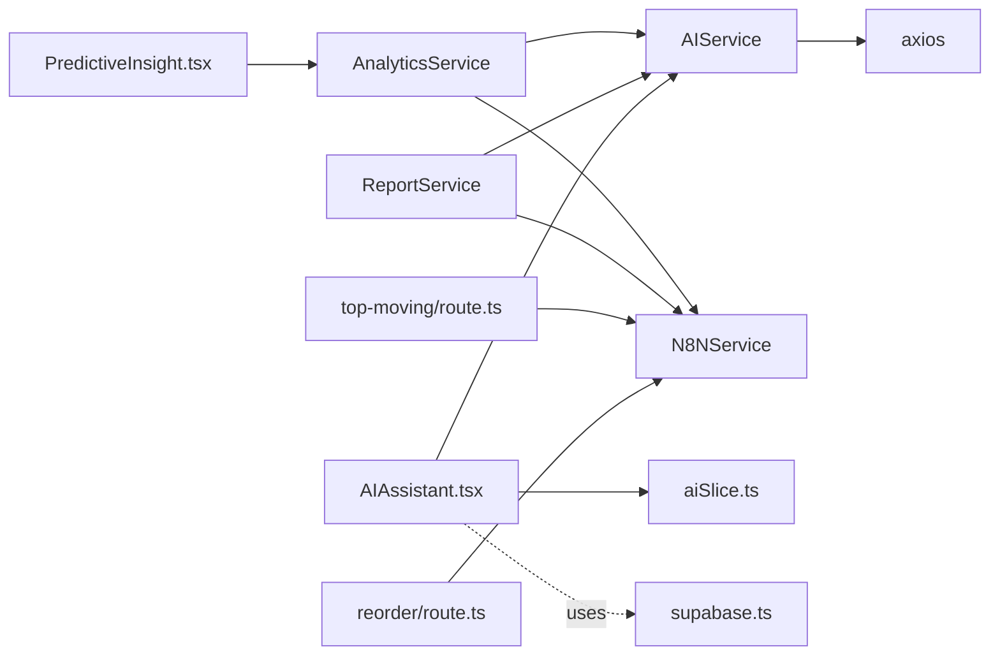

# Services Layer

<cite>
**Referenced Files in This Document**
- [aiService.ts](file://src/services/aiService.ts)
- [analyticsService.ts](file://src/services/analyticsService.ts)
- [n8nService.ts](file://src/services/n8nService.ts)
- [reportService.ts](file://src/services/reportService.ts)
- [supabase.ts](file://src/lib/supabase.ts)
- [AIAssistant.tsx](file://src/components/ai/AIAssistant.tsx)
- [PredictiveInsight.tsx](file://src/components/ai/PredictiveInsight.tsx)
- [aiSlice.ts](file://src/store/slices/aiSlice.ts)
- [store.ts](file://src/store/store.ts)
- [route.ts (top-moving)](file://src/app/api/inventory/top-moving/route.ts)
- [route.ts (reorder)](file://src/app/api/inventory/reorder/route.ts)
- [package.json](file://package.json)
</cite>

## Table of Contents
1. [Introduction](#introduction)
2. [Project Structure](#project-structure)
3. [Core Components](#core-components)
4. [Architecture Overview](#architecture-overview)
5. [Detailed Component Analysis](#detailed-component-analysis)
6. [Dependency Analysis](#dependency-analysis)
7. [Performance Considerations](#performance-considerations)
8. [Troubleshooting Guide](#troubleshooting-guide)
9. [Conclusion](#conclusion)
10. [Appendices](#appendices)

## Introduction
This document explains the services layer architecture for the dashboard-ai project. It focuses on four main service categories:
- AI service integration for natural language processing and predictive analytics
- Analytics service for data processing and insights generation
- N8N service for external data integration and webhook handling
- Report service for generating executive summaries and exportable reports

It also documents service abstractions, dependency injection approaches, error handling strategies, configuration requirements, integration with the component layer, Supabase integration for authentication and user management, testing strategies, and performance optimization techniques.

## Project Structure
The services layer resides under src/services and is consumed by React components, Next.js API routes, and Redux slices. Supabase client is under src/lib and is used for authentication and user preferences. The store is under src/store and integrates with RTK Query.

**Diagram sources**
- [AIAssistant.tsx:1-120](file://src/components/ai/AIAssistant.tsx#L1-L120)
- [PredictiveInsight.tsx:1-152](file://src/components/ai/PredictiveInsight.tsx#L1-L152)
- [aiService.ts:1-219](file://src/services/aiService.ts#L1-L219)
- [analyticsService.ts:1-134](file://src/services/analyticsService.ts#L1-L134)
- [n8nService.ts:1-109](file://src/services/n8nService.ts#L1-L109)
- [reportService.ts:1-171](file://src/services/reportService.ts#L1-L171)
- [route.ts (top-moving):1-25](file://src/app/api/inventory/top-moving/route.ts#L1-L25)
- [route.ts (reorder):1-18](file://src/app/api/inventory/reorder/route.ts#L1-L18)
- [aiSlice.ts:1-56](file://src/store/slices/aiSlice.ts#L1-L56)
- [store.ts:1-27](file://src/store/store.ts#L1-L27)
- [supabase.ts:1-21](file://src/lib/supabase.ts#L1-L21)

**Section sources**
- [aiService.ts:1-219](file://src/services/aiService.ts#L1-L219)
- [analyticsService.ts:1-134](file://src/services/analyticsService.ts#L1-L134)
- [n8nService.ts:1-109](file://src/services/n8nService.ts#L1-L109)
- [reportService.ts:1-171](file://src/services/reportService.ts#L1-L171)
- [AIAssistant.tsx:1-120](file://src/components/ai/AIAssistant.tsx#L1-L120)
- [PredictiveInsight.tsx:1-152](file://src/components/ai/PredictiveInsight.tsx#L1-L152)
- [aiSlice.ts:1-56](file://src/store/slices/aiSlice.ts#L1-L56)
- [store.ts:1-27](file://src/store/store.ts#L1-L27)
- [supabase.ts:1-21](file://src/lib/supabase.ts#L1-L21)
- [route.ts (top-moving):1-25](file://src/app/api/inventory/top-moving/route.ts#L1-L25)
- [route.ts (reorder):1-18](file://src/app/api/inventory/reorder/route.ts#L1-L18)

## Core Components
- AI Service: Encapsulates Qwen model integration for natural language queries, predictive insights, anomaly detection, and report summarization. Provides fallbacks when AI fails.
- Analytics Service: Orchestrates data ingestion via N8N, invokes AI for insights, and exposes ML-like computations (e.g., reorder point calculation).
- N8N Service: Centralizes webhook access to inventory data, usage metrics, and stock overview; includes polling for real-time updates.
- Report Service: Generates executive summaries, builds recommendation lists, and provides export capabilities (mocked).

These services are singletons instantiated once and reused across components and API routes.

**Section sources**
- [aiService.ts:18-219](file://src/services/aiService.ts#L18-L219)
- [analyticsService.ts:13-134](file://src/services/analyticsService.ts#L13-L134)
- [n8nService.ts:16-109](file://src/services/n8nService.ts#L16-L109)
- [reportService.ts:18-171](file://src/services/reportService.ts#L18-L171)

## Architecture Overview
The services layer follows a layered pattern:
- Component layer consumes services via direct imports and Redux actions.
- Services encapsulate cross-cutting concerns: HTTP calls, parsing, fallbacks, and orchestration.
- API routes act as thin wrappers around services to expose data to clients.
- Supabase is used for authentication and user preferences; inventory data is sourced from N8N webhooks.

**Diagram sources**
- [analyticsService.ts:17-41](file://src/services/analyticsService.ts#L17-L41)
- [n8nService.ts:29-51](file://src/services/n8nService.ts#L29-L51)
- [aiService.ts:79-109](file://src/services/aiService.ts#L79-L109)

**Section sources**
- [analyticsService.ts:1-134](file://src/services/analyticsService.ts#L1-L134)
- [n8nService.ts:1-109](file://src/services/n8nService.ts#L1-L109)
- [aiService.ts:1-219](file://src/services/aiService.ts#L1-L219)

## Detailed Component Analysis

### AI Service
Responsibilities:
- Process natural language queries with a Qwen model endpoint.
- Generate predictive insights from structured inventory data.
- Detect anomalies in usage history.
- Produce executive summaries and fallback summaries.
- Provide inventory Q&A with contextual awareness.

Abstraction and DI:
- Uses environment variables for endpoint, API key, and model name.
- Exports a singleton instance for global use.

Error handling:
- Wraps HTTP calls and JSON parsing with try/catch.
- Returns structured fallbacks when AI parsing fails or when upstream data is missing.

**Diagram sources**
- [aiService.ts:18-219](file://src/services/aiService.ts#L18-L219)

**Section sources**
- [aiService.ts:1-219](file://src/services/aiService.ts#L1-L219)

### Analytics Service
Responsibilities:
- Orchestrate prediction generation by fetching inventory data from N8N and invoking AI.
- Provide anomaly detection by fetching usage metrics from N8N and invoking AI.
- Compute reorder points using configurable factors.
- Forecast demand across periods with confidence intervals.

Abstraction and DI:
- Depends on N8NService and AIService singletons.
- Uses environment-driven data sources via N8N.

Error handling:
- Falls back to mock predictions when upstream data is unavailable.

**Diagram sources**
- [analyticsService.ts:17-41](file://src/services/analyticsService.ts#L17-L41)

**Section sources**
- [analyticsService.ts:1-134](file://src/services/analyticsService.ts#L1-L134)

### N8N Service
Responsibilities:
- Fetch inventory data, top-moving materials, reorder alerts, usage metrics, and stock overview via webhooks.
- Poll for real-time updates at a fixed interval.
- Enforce timeouts and propagate errors with meaningful messages.

Abstraction and DI:
- Reads webhook URL and API key from environment variables.
- Exposes convenience methods for different endpoints.

Error handling:
- Distinguishes timeout vs. other errors and throws descriptive errors.

**Diagram sources**
- [n8nService.ts:29-51](file://src/services/n8nService.ts#L29-L51)

**Section sources**
- [n8nService.ts:1-109](file://src/services/n8nService.ts#L1-L109)

### Report Service
Responsibilities:
- Generate automated reports with AI-written summaries and recommendations.
- Build report metadata from N8N stock overview.
- Provide export to PDF and Excel (mocked).
- Support scheduling of automated reports.

Abstraction and DI:
- Uses AIService and N8NService singletons.
- Falls back to mock report when data is unavailable.

**Diagram sources**
- [reportService.ts:22-42](file://src/services/reportService.ts#L22-L42)
- [n8nService.ts:77-79](file://src/services/n8nService.ts#L77-L79)
- [aiService.ts:129-149](file://src/services/aiService.ts#L129-L149)

**Section sources**
- [reportService.ts:1-171](file://src/services/reportService.ts#L1-L171)

### Component Integration
- AI Assistant component:
  - Dispatches Redux actions to track query state.
  - Calls AIService.processQuery and displays results.
- Predictive Insights component:
  - Calls AnalyticsService.generatePredictions and renders risk-tagged items.

**Diagram sources**
- [AIAssistant.tsx:29-46](file://src/components/ai/AIAssistant.tsx#L29-L46)
- [aiSlice.ts:24-35](file://src/store/slices/aiSlice.ts#L24-L35)
- [aiService.ts:33-74](file://src/services/aiService.ts#L33-L74)

**Section sources**
- [AIAssistant.tsx:1-120](file://src/components/ai/AIAssistant.tsx#L1-L120)
- [PredictiveInsight.tsx:1-152](file://src/components/ai/PredictiveInsight.tsx#L1-L152)
- [aiSlice.ts:1-56](file://src/store/slices/aiSlice.ts#L1-L56)
- [store.ts:1-27](file://src/store/store.ts#L1-L27)

### API Route Integration
- Top-moving endpoint:
  - Accepts a limit query parameter.
  - Delegates to N8NService.fetchTopMovingMaterials and returns JSON.
- Reorder alerts endpoint:
  - Delegates to N8NService.fetchReorderAlerts and returns JSON.

**Diagram sources**
- [route.ts (top-moving):4-16](file://src/app/api/inventory/top-moving/route.ts#L4-L16)
- [n8nService.ts:56-58](file://src/services/n8nService.ts#L56-L58)

**Section sources**
- [route.ts (top-moving):1-25](file://src/app/api/inventory/top-moving/route.ts#L1-L25)
- [route.ts (reorder):1-18](file://src/app/api/inventory/reorder/route.ts#L1-L18)
- [n8nService.ts:63-65](file://src/services/n8nService.ts#L63-L65)

## Dependency Analysis
- AIService depends on HTTP client and environment variables.
- AnalyticsService depends on AIService and N8NService.
- ReportService depends on AIService and N8NService.
- Components depend on services and Redux slices.
- API routes depend on N8NService.
- Supabase client is used by components for auth and preferences.

**Diagram sources**
- [aiService.ts:1-2](file://src/services/aiService.ts#L1-L2)
- [analyticsService.ts:1-2](file://src/services/analyticsService.ts#L1-L2)
- [reportService.ts:1-2](file://src/services/reportService.ts#L1-L2)
- [AIAssistant.tsx:17-19](file://src/components/ai/AIAssistant.tsx#L17-L19)
- [PredictiveInsight.tsx](file://src/components/ai/PredictiveInsight.tsx#L4)
- [route.ts (top-moving)](file://src/app/api/inventory/top-moving/route.ts#L2)
- [route.ts (reorder)](file://src/app/api/inventory/reorder/route.ts#L2)
- [supabase.ts](file://src/lib/supabase.ts#L1)

**Section sources**
- [package.json:11-26](file://package.json#L11-L26)

## Performance Considerations
- Network timeouts: N8NService enforces a 10-second timeout to prevent long-blocking requests.
- Polling cadence: N8NService polls at 30 seconds; tune for latency vs. freshness trade-offs.
- AI parsing resilience: AIService includes JSON parsing fallbacks to avoid cascading failures.
- Mock fallbacks: AnalyticsService and ReportService provide deterministic fallbacks to maintain UX continuity.
- Recommendation: Cache parsed AI responses per request/session where appropriate; avoid repeated AI calls for identical prompts.

[No sources needed since this section provides general guidance]

## Troubleshooting Guide
Common issues and strategies:
- AI model connectivity:
  - Verify environment variables for endpoint, API key, and model name.
  - Inspect error logs for “Failed to process AI query” and surface user-friendly messages.
- N8N webhook failures:
  - Distinguish timeout vs. other errors; timeouts throw a specific message.
  - Confirm webhook URL and API key correctness.
- Missing or empty data:
  - AnalyticsService falls back to mock predictions; confirm upstream data availability.
  - ReportService falls back to mock report; verify stock overview endpoint.
- Component-level errors:
  - AIAssistant displays a generic error message when AI processing fails.
  - PredictiveInsight renders a loading state and logs errors; inspect console for details.

**Section sources**
- [aiService.ts:70-74](file://src/services/aiService.ts#L70-L74)
- [n8nService.ts:43-50](file://src/services/n8nService.ts#L43-L50)
- [analyticsService.ts:37-41](file://src/services/analyticsService.ts#L37-L41)
- [reportService.ts:38-42](file://src/services/reportService.ts#L38-L42)
- [AIAssistant.tsx:40-43](file://src/components/ai/AIAssistant.tsx#L40-L43)
- [PredictiveInsight.tsx:38-42](file://src/components/ai/PredictiveInsight.tsx#L38-L42)

## Conclusion
The services layer cleanly separates concerns across AI, analytics, external data integration, and reporting. It leverages environment-driven configuration, resilient error handling with fallbacks, and straightforward component integration via direct imports and Redux. Supabase supports authentication and preferences while inventory data remains sourced from N8N webhooks. This design enables extensibility, testability, and maintainable service boundaries.

[No sources needed since this section summarizes without analyzing specific files]

## Appendices

### Configuration Requirements
- Environment variables:
  - AI service: endpoint, API key, model name
  - N8N service: webhook URL, API key
- Frontend Supabase client:
  - Public URL and anonymous key for client-side auth and preferences

**Section sources**
- [aiService.ts:23-27](file://src/services/aiService.ts#L23-L27)
- [n8nService.ts:20-23](file://src/services/n8nService.ts#L20-L23)
- [supabase.ts:3-6](file://src/lib/supabase.ts#L3-L6)

### Service Testing Strategies and Mocks
- Unit tests:
  - Mock axios in AIService to simulate AI responses and errors.
  - Stub N8NService to return controlled datasets for AnalyticsService and ReportService.
- Integration tests:
  - Replace AIService and N8NService singletons with test doubles in API routes and components.
- Development mocks:
  - Use mock implementations for AI and N8N to develop UI without external dependencies.
- Example patterns:
  - Wrap HTTP calls behind small adapters for easier mocking.
  - Inject environment variables via a configuration module for test isolation.

[No sources needed since this section provides general guidance]

### Extending Services and Maintaining Boundaries
- Adding a new AI capability:
  - Extend AIService with a new method and define a clear contract for input/output.
  - Keep parsing and fallback logic centralized.
- Adding a new N8N endpoint:
  - Add a new method in N8NService with typed return and error handling.
  - Consume the new endpoint in AnalyticsService or ReportService as appropriate.
- Maintaining boundaries:
  - Keep AI logic in AIService, data ingestion in N8NService, orchestration in AnalyticsService, and presentation/reporting in ReportService.
  - Avoid cross-service coupling; pass data via clearly defined interfaces.

[No sources needed since this section provides general guidance]