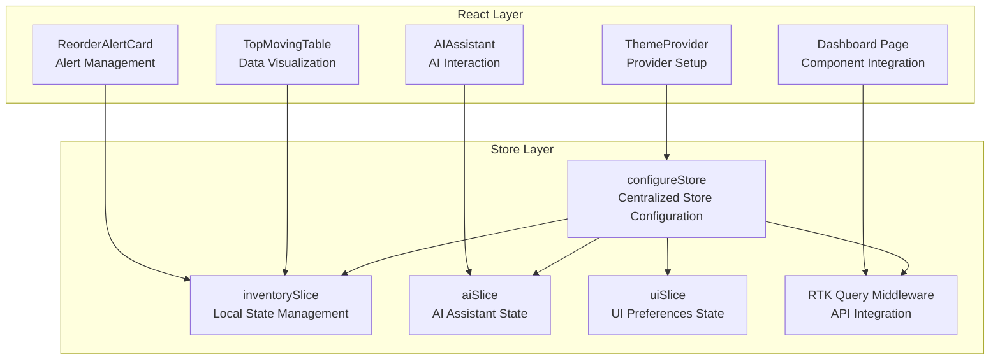
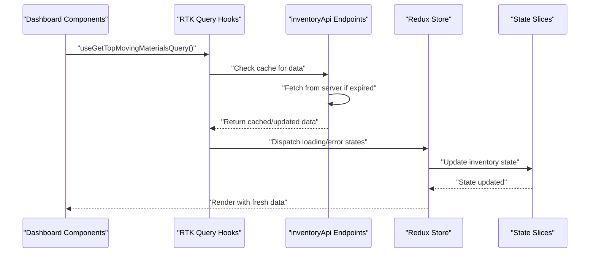
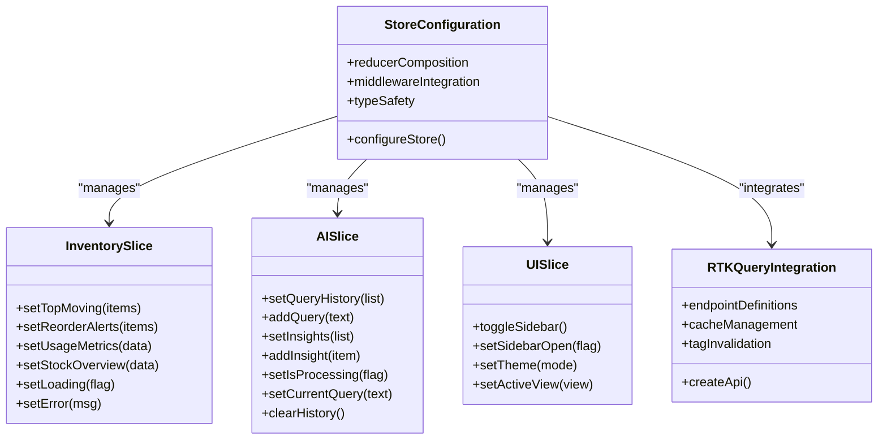
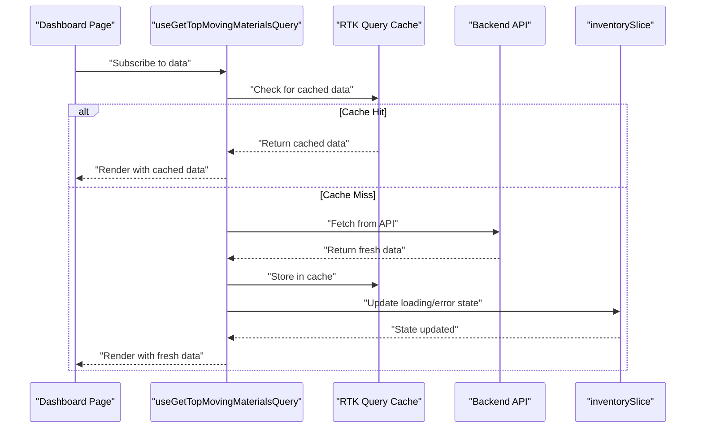
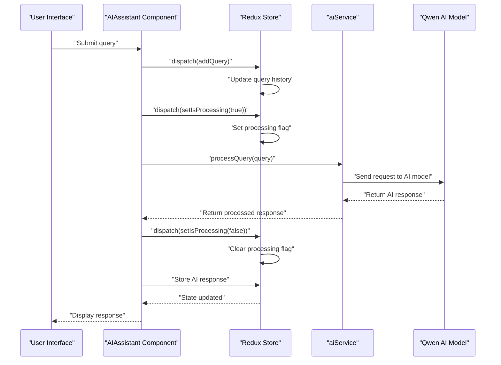
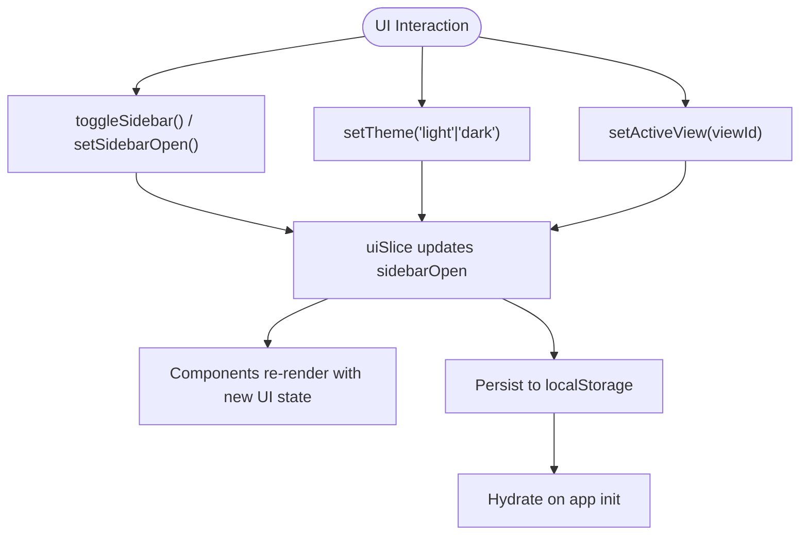
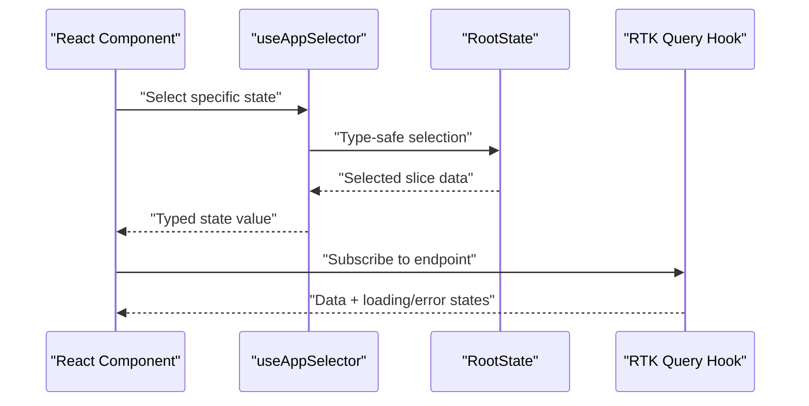
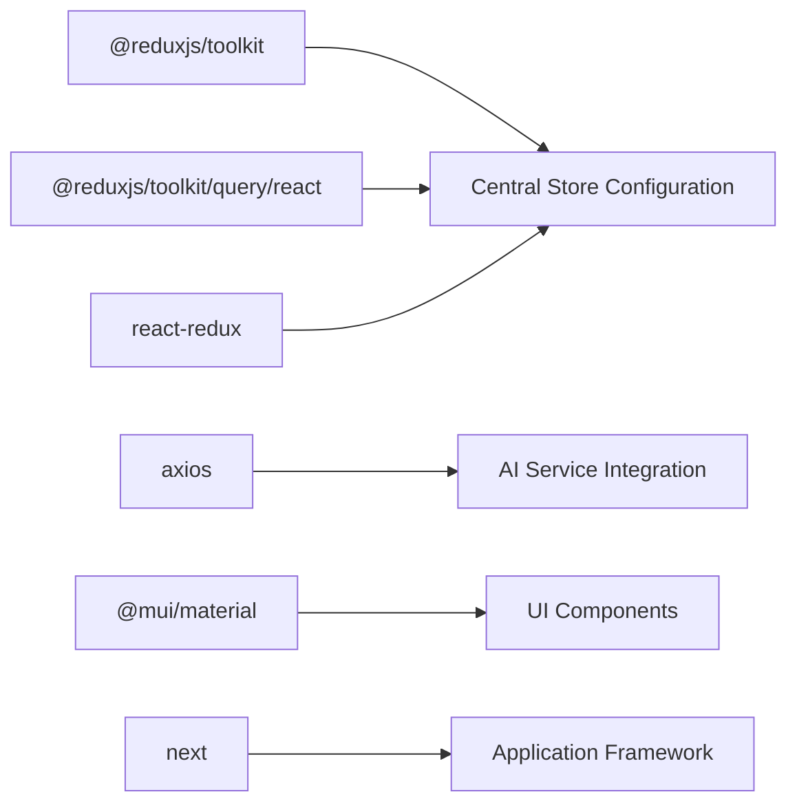

# State Management

<cite>
**Referenced Files in This Document**
- [store.ts](file://src/store/store.ts)
- [inventorySlice.ts](file://src/store/slices/inventorySlice.ts)
- [aiSlice.ts](file://src/store/slices/aiSlice.ts)
- [uiSlice.ts](file://src/store/slices/uiSlice.ts)
- [inventoryApi.ts](file://src/store/api/inventoryApi.ts)
- [useRedux.ts](file://src/hooks/useRedux.ts)
- [ThemeProvider.tsx](file://src/components/ui/Layout/ThemeProvider.tsx)
- [AIAssistant.tsx](file://src/components/ai/AIAssistant.tsx)
- [page.tsx](file://src/app/dashboard/page.tsx)
- [TopMovingTable.tsx](file://src/components/inventory/TopMovingTable.tsx)
- [ReorderAlertCard.tsx](file://src/components/inventory/ReorderAlertCard.tsx)
- [aiService.ts](file://src/services/aiService.ts)
- [package.json](file://package.json)
</cite>

## Update Summary
**Changes Made**
- Updated store configuration to reflect centralized Redux Toolkit implementation
- Enhanced documentation of specialized slices for inventory, AI, and UI state management
- Added comprehensive coverage of RTK Query integration patterns
- Expanded async action handling and state persistence strategies
- Updated debugging techniques and performance considerations

## Table of Contents
1. [Introduction](#introduction)
2. [Project Structure](#project-structure)
3. [Core Components](#core-components)
4. [Architecture Overview](#architecture-overview)
5. [Detailed Component Analysis](#detailed-component-analysis)
6. [Dependency Analysis](#dependency-analysis)
7. [Performance Considerations](#performance-considerations)
8. [Troubleshooting Guide](#troubleshooting-guide)
9. [Conclusion](#conclusion)
10. [Appendices](#appendices)

## Introduction
This document explains the Redux Toolkit state management implementation in the dashboard-ai project. The system features a centralized store architecture with specialized domain-specific slices for inventory management, AI assistant capabilities, and user interface state. The implementation leverages RTK Query for efficient data fetching, caching, and synchronization with real-time backend APIs.

The state management system provides:
- **Centralized Store**: Single source of truth with domain-specific reducers
- **Specialized Slices**: Inventory, AI, and UI state management with clear boundaries
- **RTK Query Integration**: Automatic caching, optimistic updates, and real-time data synchronization
- **Typed Hooks**: Strongly typed React-Redux integration for type safety
- **Async State Management**: Comprehensive handling of loading, error, and success states

## Project Structure
The state management stack is organized around a central store that composes domain-specific slices and integrates RTK Query APIs. The architecture follows Redux best practices with clear separation of concerns and predictable state updates.

**Diagram sources**
- [store.ts:7-16](file://src/store/store.ts#L7-L16)
- [inventorySlice.ts:21-44](file://src/store/slices/inventorySlice.ts#L21-L44)
- [aiSlice.ts:17-43](file://src/store/slices/aiSlice.ts#L17-L43)
- [uiSlice.ts:15-32](file://src/store/slices/uiSlice.ts#L15-L32)
- [inventoryApi.ts:23-49](file://src/store/api/inventoryApi.ts#L23-L49)
- [ThemeProvider.tsx:90-99](file://src/components/ui/Layout/ThemeProvider.tsx#L90-L99)
- [page.tsx:17-127](file://src/app/dashboard/page.tsx#L17-L127)

**Section sources**
- [store.ts:1-27](file://src/store/store.ts#L1-L27)
- [inventoryApi.ts:23-49](file://src/store/api/inventoryApi.ts#L23-L49)
- [ThemeProvider.tsx:90-99](file://src/components/ui/Layout/ThemeProvider.tsx#L90-L99)

## Core Components

### Centralized Store Configuration
The store is configured with a centralized approach that composes all domain-specific reducers and integrates RTK Query middleware. This creates a single source of truth for the entire application state.

**Key Features:**
- **Domain Composition**: Three specialized slices (inventory, ai, ui) plus RTK Query integration
- **Middleware Chain**: RTK Query middleware integrated with default Redux middleware
- **Type Safety**: Exported RootState and AppDispatch for strongly typed hooks
- **Explicit Typing**: Custom AppState interface for enhanced type safety

### Specialized State Slices

#### Inventory Slice
Manages stock data, reorder alerts, usage metrics, and loading states. Provides granular control over inventory-related state with comprehensive action creators.

**State Properties:**
- `topMoving`: Array of top-performing inventory items
- `reorderAlerts`: List of materials needing reorder
- `usageMetrics`: Historical usage patterns and statistics
- `stockOverview`: Overall inventory health metrics
- `loading`: Loading state for inventory operations
- `error`: Error messages for inventory operations

#### AI Slice
Handles natural language processing state, query history, and AI assistant interactions. Manages the complete lifecycle of AI-powered inventory queries.

**State Properties:**
- `queryHistory`: Complete history of user queries
- `insights`: AI-generated insights and recommendations
- `isProcessing`: Real-time processing status indicator
- `currentQuery`: Active query being processed

#### UI Slice
Controls user interface preferences including theme management, navigation state, and responsive design settings.

**State Properties:**
- `sidebarOpen`: Navigation sidebar visibility state
- `theme`: Current theme preference (light/dark)
- `activeView`: Currently selected dashboard view

### RTK Query Integration
The inventoryApi provides comprehensive data fetching capabilities with automatic caching, error handling, and real-time synchronization.

**Endpoint Types:**
- `getTopMovingMaterials`: Fetches fastest-moving inventory items
- `getReorderAlerts`: Retrieves materials below reorder thresholds
- `getUsageMetrics`: Provides historical usage statistics
- `getStockOverview`: Returns overall inventory health metrics

**Caching Strategy:**
- Configurable cache expiration (3-5 minute window)
- Tag-based cache invalidation
- Optimistic updates for improved user experience

**Section sources**
- [store.ts:7-27](file://src/store/store.ts#L7-L27)
- [inventorySlice.ts:21-56](file://src/store/slices/inventorySlice.ts#L21-L56)
- [aiSlice.ts:17-56](file://src/store/slices/aiSlice.ts#L17-L56)
- [uiSlice.ts:15-42](file://src/store/slices/uiSlice.ts#L15-L42)
- [inventoryApi.ts:23-57](file://src/store/api/inventoryApi.ts#L23-L57)

## Architecture Overview
The Redux Toolkit implementation follows a clean, modular architecture that separates concerns while maintaining simplicity and performance.

**Diagram sources**
- [page.tsx:18-20](file://src/app/dashboard/page.tsx#L18-L20)
- [inventoryApi.ts:28-32](file://src/store/api/inventoryApi.ts#L28-L32)

**Section sources**
- [store.ts:7-16](file://src/store/store.ts#L7-L16)
- [inventoryApi.ts:23-49](file://src/store/api/inventoryApi.ts#L23-L49)
- [page.tsx:17-127](file://src/app/dashboard/page.tsx#L17-L127)

## Detailed Component Analysis

### Store and Slice Architecture
The centralized store architecture provides a clear separation of concerns with specialized reducers for each domain.

**Diagram sources**
- [store.ts:7-27](file://src/store/store.ts#L7-L27)
- [inventorySlice.ts:21-56](file://src/store/slices/inventorySlice.ts#L21-L56)
- [aiSlice.ts:17-56](file://src/store/slices/aiSlice.ts#L17-L56)
- [uiSlice.ts:15-42](file://src/store/slices/uiSlice.ts#L15-L42)
- [inventoryApi.ts:23-49](file://src/store/api/inventoryApi.ts#L23-L49)

**Section sources**
- [store.ts:7-27](file://src/store/store.ts#L7-L27)
- [inventorySlice.ts:21-56](file://src/store/slices/inventorySlice.ts#L21-L56)
- [aiSlice.ts:17-56](file://src/store/slices/aiSlice.ts#L17-L56)
- [uiSlice.ts:15-42](file://src/store/slices/uiSlice.ts#L15-L42)

### Inventory Domain Implementation
The inventory domain combines local state management with RTK Query for comprehensive data handling.

**Local State Management:**
- Direct state updates for immediate UI feedback
- Loading and error state management
- Data transformation and preprocessing

**RTK Query Integration:**
- Automatic caching with configurable expiration
- Optimistic updates for improved user experience
- Error boundary handling and retry mechanisms

**Diagram sources**
- [page.tsx:18-20](file://src/app/dashboard/page.tsx#L18-L20)
- [inventoryApi.ts:28-32](file://src/store/api/inventoryApi.ts#L28-L32)
- [inventorySlice.ts:25-27](file://src/store/slices/inventorySlice.ts#L25-L27)

**Section sources**
- [inventorySlice.ts:21-56](file://src/store/slices/inventorySlice.ts#L21-L56)
- [inventoryApi.ts:23-57](file://src/store/api/inventoryApi.ts#L23-L57)
- [page.tsx:17-127](file://src/app/dashboard/page.tsx#L17-L127)
- [TopMovingTable.tsx:19-99](file://src/components/inventory/TopMovingTable.tsx#L19-L99)
- [ReorderAlertCard.tsx:19-104](file://src/components/inventory/ReorderAlertCard.tsx#L19-L104)

### AI Assistant Domain
The AI assistant domain provides natural language processing capabilities with comprehensive state management for query processing and response handling.

**State Management:**
- Query history tracking for conversation context
- Processing state management for user feedback
- Insight storage for AI-generated recommendations

**External Integration:**
- Independent AI service for Qwen model integration
- Environment-based configuration for deployment flexibility
- Comprehensive error handling and fallback mechanisms

**Diagram sources**
- [AIAssistant.tsx:24-46](file://src/components/ai/AIAssistant.tsx#L24-L46)
- [aiSlice.ts:24-38](file://src/store/slices/aiSlice.ts#L24-L38)
- [aiService.ts:33-74](file://src/services/aiService.ts#L33-L74)

**Section sources**
- [aiSlice.ts:17-56](file://src/store/slices/aiSlice.ts#L17-L56)
- [AIAssistant.tsx:23-119](file://src/components/ai/AIAssistant.tsx#L23-L119)
- [aiService.ts:18-219](file://src/services/aiService.ts#L18-L219)

### UI Domain Management
The UI domain handles user interface preferences and responsive design states with seamless integration into the overall state management architecture.

**State Features:**
- Theme management with persistent preferences
- Navigation state for sidebar and menu controls
- Active view tracking for dashboard navigation
- Responsive design state management

**Integration Points:**
- ThemeProvider integration for MUI theming
- Persistent state across browser sessions
- Responsive breakpoint management

**Diagram sources**
- [uiSlice.ts:19-30](file://src/store/slices/uiSlice.ts#L19-L30)
- [ThemeProvider.tsx:90-99](file://src/components/ui/Layout/ThemeProvider.tsx#L90-L99)

**Section sources**
- [uiSlice.ts:15-42](file://src/store/slices/uiSlice.ts#L15-L42)
- [ThemeProvider.tsx:90-99](file://src/components/ui/Layout/ThemeProvider.tsx#L90-L99)

### Typed Hooks and Selector Patterns
The implementation provides comprehensive typed hooks for type-safe state access and manipulation.

**Custom Hooks:**
- `useAppDispatch`: Typed dispatch function for Redux actions
- `useAppSelector`: Type-safe selector for component state access

**Selector Patterns:**
- Component-level selectors for specific state slices
- Computed property selectors for derived data
- Memoized selectors for performance optimization

**Diagram sources**
- [useRedux.ts:1-6](file://src/hooks/useRedux.ts#L1-L6)
- [AIAssistant.tsx:27-27](file://src/components/ai/AIAssistant.tsx#L27-L27)
- [page.tsx:18-20](file://src/app/dashboard/page.tsx#L18-L20)

**Section sources**
- [useRedux.ts:1-6](file://src/hooks/useRedux.ts#L1-L6)
- [AIAssistant.tsx:23-119](file://src/components/ai/AIAssistant.tsx#L23-L119)
- [page.tsx:17-127](file://src/app/dashboard/page.tsx#L17-L127)

### Async Actions and Effects Management
The system handles complex async operations through a combination of RTK Query and custom service integrations.

**RTK Query Async Flow:**
- Automatic loading state management
- Built-in caching and cache invalidation
- Error boundary handling and retry logic
- Optimistic updates for improved UX

**Custom Service Integration:**
- Independent AI service for external model access
- Environment-based configuration management
- Comprehensive error handling and fallback strategies

**Section sources**
- [inventoryApi.ts:23-57](file://src/store/api/inventoryApi.ts#L23-L57)
- [aiService.ts:18-219](file://src/services/aiService.ts#L18-L219)

### State Persistence Strategies
The implementation provides multiple layers of state persistence for different types of data.

**RTK Query Caching:**
- Configurable cache expiration (3-5 minute window)
- Tag-based cache invalidation for data consistency
- Automatic cache cleanup and memory management

**UI State Persistence:**
- Theme preferences stored in localStorage
- Sidebar state persistence across sessions
- Active view tracking for navigation continuity

**Section sources**
- [inventoryApi.ts:31-37](file://src/store/api/inventoryApi.ts#L31-L37)
- [uiSlice.ts:9-13](file://src/store/slices/uiSlice.ts#L9-L13)

### Debugging and Development Tools
Comprehensive debugging support is built into the Redux Toolkit implementation.

**Development Tools:**
- Redux DevTools browser extension integration
- Action payload inspection and state transition tracking
- Component selector debugging and performance monitoring
- RTK Query endpoint lifecycle debugging

**Debugging Techniques:**
- Time-travel debugging for state transitions
- Action logging for async operation tracking
- Performance profiling for selector optimization
- Network request debugging for API integration

**Section sources**
- [aiSlice.ts:24-38](file://src/store/slices/aiSlice.ts#L24-L38)
- [page.tsx:24-30](file://src/app/dashboard/page.tsx#L24-L30)
- [aiService.ts:33-74](file://src/services/aiService.ts#L33-L74)

## Dependency Analysis
The state management system relies on a carefully selected set of dependencies that provide comprehensive functionality while maintaining simplicity.

**Core Dependencies:**
- `@reduxjs/toolkit`: Primary Redux implementation with modern APIs
- `@reduxjs/toolkit/query/react`: RTK Query for API integration and caching
- `react-redux`: React bindings for Redux with TypeScript support
- `@mui/material`: Material UI components for consistent UI
- `axios`: HTTP client for external API communication

**Development Dependencies:**
- `@types/react-redux`: TypeScript definitions for React-Redux
- `@types/node`: Node.js type definitions for environment variables
- `typescript`: Type safety and development experience

**Diagram sources**
- [package.json:11-26](file://package.json#L11-L26)
- [store.ts:1-5](file://src/store/store.ts#L1-L5)
- [aiService.ts:1-2](file://src/services/aiService.ts#L1-L2)

**Section sources**
- [package.json:11-26](file://package.json#L11-L26)
- [store.ts:1-5](file://src/store/store.ts#L1-L5)
- [aiService.ts:1-2](file://src/services/aiService.ts#L1-L2)

## Performance Considerations
The Redux Toolkit implementation incorporates several performance optimizations to ensure smooth operation even with complex state management.

**Caching Strategies:**
- RTK Query provides automatic caching with configurable expiration
- Tag-based invalidation ensures data consistency across related endpoints
- Memory-efficient cache cleanup prevents memory leaks

**State Optimization:**
- Immutable state updates prevent unnecessary re-renders
- Shallow comparison selectors minimize component re-rendering
- Memoized selectors optimize derived data computation

**Network Performance:**
- Concurrent request batching reduces network overhead
- Optimistic updates provide immediate UI feedback
- Request deduplication prevents redundant network calls

**Memory Management:**
- Automatic cache cleanup prevents memory accumulation
- Selective state updates minimize memory footprint
- Efficient data structures reduce computational overhead

## Troubleshooting Guide

**Common Issues and Solutions:**

**Inventory Data Not Updating:**
- Verify RTK Query endpoint configuration and cache settings
- Check API endpoint URLs and authentication tokens
- Ensure proper cache invalidation after data modifications

**AI Responses Fail:**
- Inspect AI service endpoint configuration and API keys
- Verify environment variables are properly set
- Check network connectivity and model availability

**UI State Resets Unexpectedly:**
- Confirm theme and sidebar state persistence in localStorage
- Verify hydration logic during application initialization
- Check for state reset actions in component lifecycle

**Selector Type Errors:**
- Ensure RootState typing matches store composition
- Verify slice state interfaces are properly defined
- Check for circular dependencies in state selectors

**Performance Issues:**
- Monitor component re-render frequency with React DevTools
- Optimize expensive selectors with memoization
- Implement proper loading state management

**Section sources**
- [inventoryApi.ts:23-49](file://src/store/api/inventoryApi.ts#L23-L49)
- [aiService.ts:23-27](file://src/services/aiService.ts#L23-L27)
- [uiSlice.ts:9-13](file://src/store/slices/uiSlice.ts#L9-L13)

## Conclusion
The dashboard-ai project demonstrates a sophisticated Redux Toolkit implementation that effectively manages complex state across multiple domains. The centralized store architecture with specialized slices provides clear separation of concerns while maintaining simplicity and performance. The integration of RTK Query enables efficient data management with automatic caching and real-time synchronization.

Key strengths of the implementation include:
- **Modular Architecture**: Clear separation of concerns with specialized state slices
- **Type Safety**: Comprehensive TypeScript integration for reliable development
- **Performance Optimization**: Strategic caching, memoization, and efficient state updates
- **Developer Experience**: Rich debugging tools and comprehensive error handling
- **Scalability**: Clean architecture that supports future feature additions

The system successfully balances complexity with maintainability, providing a solid foundation for the inventory management dashboard while demonstrating best practices for Redux Toolkit implementation in modern React applications.

## Appendices

### Practical Examples Index

**State Update Actions:**
- **Inventory**: `setTopMoving`, `setReorderAlerts`, `setUsageMetrics`, `setStockOverview`, `setLoading`, `setError`
- **AI**: `addQuery`, `setInsights`, `setIsProcessing`, `setCurrentQuery`, `clearHistory`
- **UI**: `toggleSidebar`, `setSidebarOpen`, `setTheme`, `setActiveView`

**Async Operations:**
- **RTK Query Endpoints**: `useGetTopMovingMaterialsQuery`, `useGetReorderAlertsQuery`, `useGetUsageMetricsQuery`, `useGetStockOverviewQuery`
- **AI Service**: `processQuery`, `generatePredictiveInsights`, `detectAnomalies`, `answerInventoryQuestion`

**Selector Patterns:**
- `useAppSelector` for typed state access
- Component-level selectors for `ai.isProcessing`, inventory lists, and UI preferences
- Memoized selectors for computed properties and derived data

**Section sources**
- [inventorySlice.ts:46-53](file://src/store/slices/inventorySlice.ts#L46-L53)
- [aiSlice.ts:45-53](file://src/store/slices/aiSlice.ts#L45-L53)
- [uiSlice.ts:34-39](file://src/store/slices/uiSlice.ts#L34-L39)
- [inventoryApi.ts:51-56](file://src/store/api/inventoryApi.ts#L51-L56)
- [useRedux.ts:1-6](file://src/hooks/useRedux.ts#L1-L6)
- [AIAssistant.tsx:27-27](file://src/components/ai/AIAssistant.tsx#L27-L27)
- [page.tsx:18-20](file://src/app/dashboard/page.tsx#L18-L20)