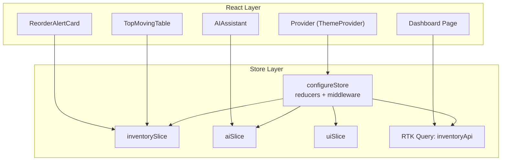
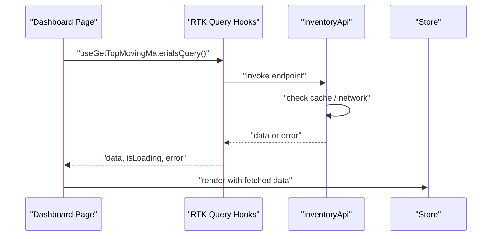
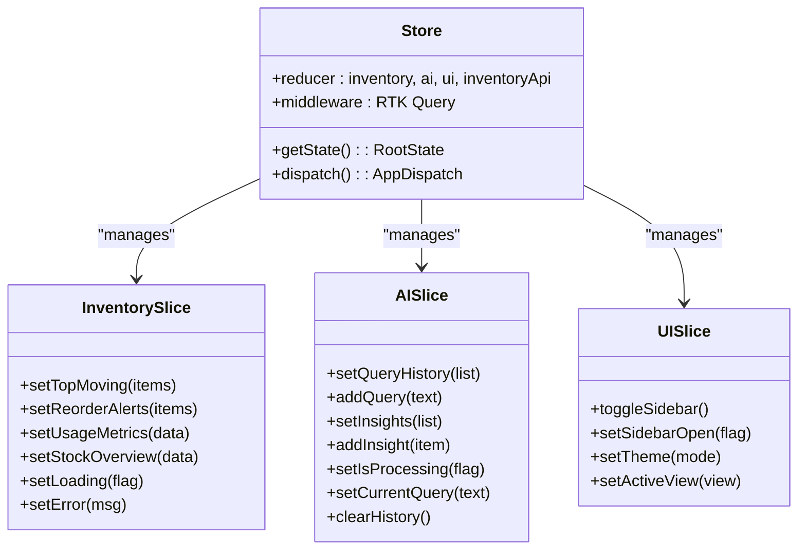
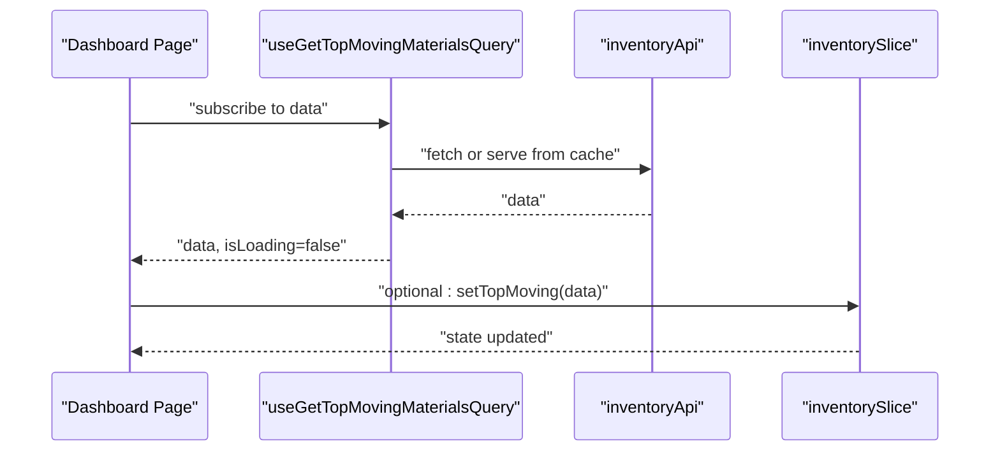
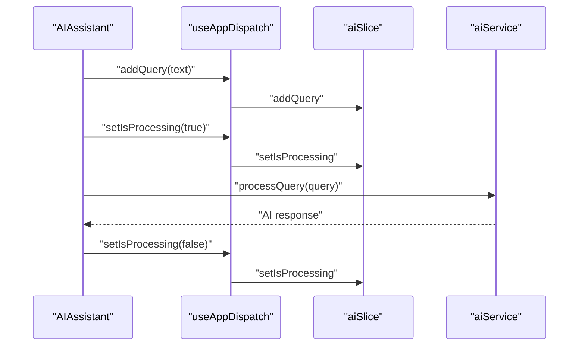
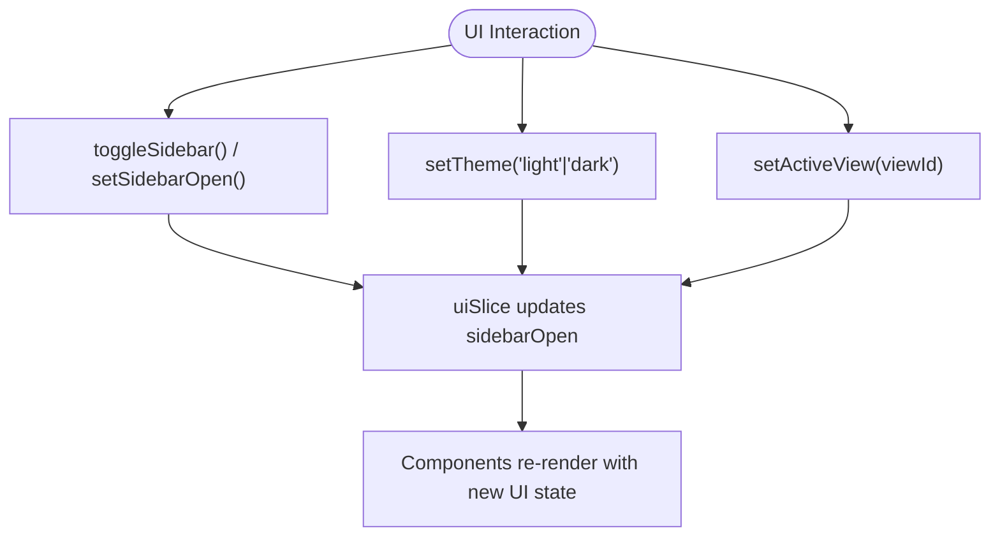
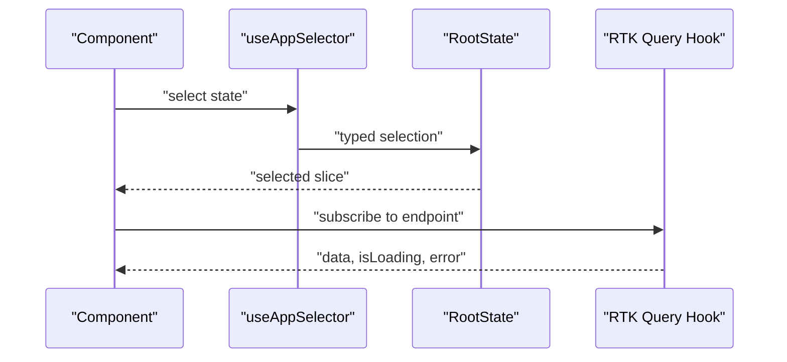
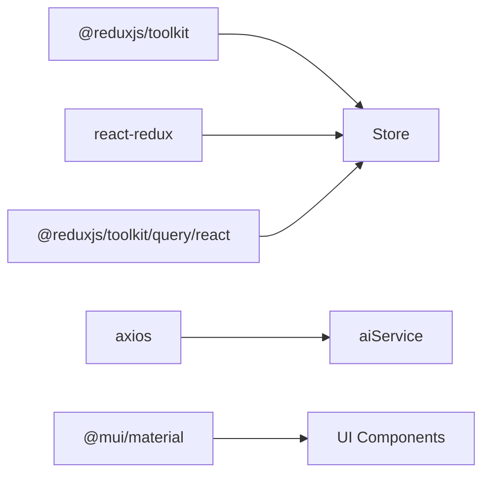

# State Management

<cite>
**Referenced Files in This Document**
- [store.ts](file://src/store/store.ts)
- [inventorySlice.ts](file://src/store/slices/inventorySlice.ts)
- [aiSlice.ts](file://src/store/slices/aiSlice.ts)
- [uiSlice.ts](file://src/store/slices/uiSlice.ts)
- [inventoryApi.ts](file://src/store/api/inventoryApi.ts)
- [useRedux.ts](file://src/hooks/useRedux.ts)
- [ThemeProvider.tsx](file://src/components/ui/Layout/ThemeProvider.tsx)
- [AIAssistant.tsx](file://src/components/ai/AIAssistant.tsx)
- [page.tsx](file://src/app/dashboard/page.tsx)
- [TopMovingTable.tsx](file://src/components/inventory/TopMovingTable.tsx)
- [ReorderAlertCard.tsx](file://src/components/inventory/ReorderAlertCard.tsx)
- [aiService.ts](file://src/services/aiService.ts)
- [analyticsService.ts](file://src/services/analyticsService.ts)
- [package.json](file://package.json)
</cite>

## Table of Contents
1. [Introduction](#introduction)
2. [Project Structure](#project-structure)
3. [Core Components](#core-components)
4. [Architecture Overview](#architecture-overview)
5. [Detailed Component Analysis](#detailed-component-analysis)
6. [Dependency Analysis](#dependency-analysis)
7. [Performance Considerations](#performance-considerations)
8. [Troubleshooting Guide](#troubleshooting-guide)
9. [Conclusion](#conclusion)
10. [Appendices](#appendices)

## Introduction
This document explains the Redux Toolkit state management implementation in the dashboard-ai project. It covers store configuration, slice architecture, and reducer patterns across three main domains:
- Inventory: stock data and inventory states
- AI Assistant: natural language processing and assistant states
- UI: theme preferences and responsive layout states

It also documents the custom React-Redux integration via a typed useRedux hook, demonstrates state consumption in components, outlines persistence strategies, and provides debugging and performance guidance tailored to the inventory management context.

## Project Structure
The state management stack is organized around a central store that composes domain-specific slices and integrates RTK Query APIs. Components consume state and effects through typed hooks and RTK Query endpoints.

**Diagram sources**
- [store.ts:1-27](file://src/store/store.ts#L1-L27)
- [inventoryApi.ts:23-49](file://src/store/api/inventoryApi.ts#L23-L49)
- [inventorySlice.ts:21-44](file://src/store/slices/inventorySlice.ts#L21-L44)
- [aiSlice.ts:17-43](file://src/store/slices/aiSlice.ts#L17-L43)
- [uiSlice.ts:15-32](file://src/store/slices/uiSlice.ts#L15-L32)
- [ThemeProvider.tsx:90-99](file://src/components/ui/Layout/ThemeProvider.tsx#L90-L99)
- [page.tsx:17-127](file://src/app/dashboard/page.tsx#L17-L127)
- [AIAssistant.tsx:23-119](file://src/components/ai/AIAssistant.tsx#L23-L119)
- [TopMovingTable.tsx:19-99](file://src/components/inventory/TopMovingTable.tsx#L19-L99)
- [ReorderAlertCard.tsx:19-104](file://src/components/inventory/ReorderAlertCard.tsx#L19-L104)

**Section sources**
- [store.ts:1-27](file://src/store/store.ts#L1-L27)
- [inventoryApi.ts:23-49](file://src/store/api/inventoryApi.ts#L23-L49)
- [ThemeProvider.tsx:90-99](file://src/components/ui/Layout/ThemeProvider.tsx#L90-L99)

## Core Components
- Store configuration composes three domain slices and the RTK Query reducer/middleware under dedicated keys.
- Three domain slices define reducers for local state updates:
  - inventorySlice: lists, metrics, loading, and errors
  - aiSlice: query history, insights, processing flags, and current query
  - uiSlice: sidebar open state, theme, and active view
- RTK Query inventoryApi defines typed endpoints for inventory data fetching and caching.

Key exports and types:
- RootState and AppDispatch are exported for typed hooks
- A typed useRedux hook centralizes dispatch and selector typing

**Section sources**
- [store.ts:7-27](file://src/store/store.ts#L7-L27)
- [inventorySlice.ts:21-56](file://src/store/slices/inventorySlice.ts#L21-L56)
- [aiSlice.ts:17-56](file://src/store/slices/aiSlice.ts#L17-L56)
- [uiSlice.ts:15-42](file://src/store/slices/uiSlice.ts#L15-L42)
- [inventoryApi.ts:23-57](file://src/store/api/inventoryApi.ts#L23-L57)
- [useRedux.ts:1-6](file://src/hooks/useRedux.ts#L1-L6)

## Architecture Overview
The store is configured with:
- Reducers for inventory, ai, ui, and inventoryApi
- Middleware chain that includes RTK Query middleware
- Typed RootState/AppDispatch for safe component usage

**Diagram sources**
- [page.tsx:18-20](file://src/app/dashboard/page.tsx#L18-L20)
- [inventoryApi.ts:28-32](file://src/store/api/inventoryApi.ts#L28-L32)

**Section sources**
- [store.ts:7-16](file://src/store/store.ts#L7-L16)
- [inventoryApi.ts:23-49](file://src/store/api/inventoryApi.ts#L23-L49)
- [page.tsx:17-127](file://src/app/dashboard/page.tsx#L17-L127)

## Detailed Component Analysis

### Store and Slice Architecture
- Store composes reducers and middleware; exposes RootState and AppDispatch
- Slices encapsulate domain state and pure reducers
- RTK Query endpoints provide caching and normalized data access

**Diagram sources**
- [store.ts:7-27](file://src/store/store.ts#L7-L27)
- [inventorySlice.ts:21-56](file://src/store/slices/inventorySlice.ts#L21-L56)
- [aiSlice.ts:17-56](file://src/store/slices/aiSlice.ts#L17-L56)
- [uiSlice.ts:15-42](file://src/store/slices/uiSlice.ts#L15-L42)

**Section sources**
- [store.ts:7-27](file://src/store/store.ts#L7-L27)
- [inventorySlice.ts:21-56](file://src/store/slices/inventorySlice.ts#L21-L56)
- [aiSlice.ts:17-56](file://src/store/slices/aiSlice.ts#L17-L56)
- [uiSlice.ts:15-42](file://src/store/slices/uiSlice.ts#L15-L42)

### Inventory Domain
- Local state: arrays/lists, metrics, loading flags, and error messages
- RTK Query endpoints provide cached, normalized data for top-moving materials, reorder alerts, usage metrics, and stock overview
- Components render loading/error states and present structured data

**Diagram sources**
- [page.tsx:18-20](file://src/app/dashboard/page.tsx#L18-L20)
- [inventoryApi.ts:28-32](file://src/store/api/inventoryApi.ts#L28-L32)
- [inventorySlice.ts:25-27](file://src/store/slices/inventorySlice.ts#L25-L27)

**Section sources**
- [inventorySlice.ts:21-56](file://src/store/slices/inventorySlice.ts#L21-L56)
- [inventoryApi.ts:23-57](file://src/store/api/inventoryApi.ts#L23-L57)
- [page.tsx:17-127](file://src/app/dashboard/page.tsx#L17-L127)
- [TopMovingTable.tsx:19-99](file://src/components/inventory/TopMovingTable.tsx#L19-L99)
- [ReorderAlertCard.tsx:19-104](file://src/components/inventory/ReorderAlertCard.tsx#L19-L104)

### AI Assistant Domain
- Local state tracks query history, insights, processing flag, and current query
- Component dispatches actions to update state and calls aiService for natural language processing
- aiService encapsulates model endpoint, API key, and prompts for various tasks

**Diagram sources**
- [AIAssistant.tsx:24-46](file://src/components/ai/AIAssistant.tsx#L24-L46)
- [aiSlice.ts:24-38](file://src/store/slices/aiSlice.ts#L24-L38)
- [aiService.ts:33-74](file://src/services/aiService.ts#L33-L74)

**Section sources**
- [aiSlice.ts:17-56](file://src/store/slices/aiSlice.ts#L17-L56)
- [AIAssistant.tsx:23-119](file://src/components/ai/AIAssistant.tsx#L23-L119)
- [aiService.ts:18-219](file://src/services/aiService.ts#L18-L219)

### UI Domain
- Local state manages sidebar visibility, theme mode, and active view
- ThemeProvider wraps the app with MUI theme and Redux Provider

**Diagram sources**
- [uiSlice.ts:19-30](file://src/store/slices/uiSlice.ts#L19-L30)
- [ThemeProvider.tsx:90-99](file://src/components/ui/Layout/ThemeProvider.tsx#L90-L99)

**Section sources**
- [uiSlice.ts:15-42](file://src/store/slices/uiSlice.ts#L15-L42)
- [ThemeProvider.tsx:90-99](file://src/components/ui/Layout/ThemeProvider.tsx#L90-L99)

### Selector Patterns and Typed Hooks
- useAppDispatch and useAppSelector are typed via RootState and AppDispatch
- Components select state using typed selectors and subscribe to RTK Query hooks
- Example selector patterns:
  - Select AI processing state: (state) => state.ai.isProcessing
  - Select inventory lists: state.inventory.topMoving, state.inventory.reorderAlerts

**Diagram sources**
- [useRedux.ts:1-6](file://src/hooks/useRedux.ts#L1-L6)
- [AIAssistant.tsx:27-27](file://src/components/ai/AIAssistant.tsx#L27-L27)
- [page.tsx:18-20](file://src/app/dashboard/page.tsx#L18-L20)

**Section sources**
- [useRedux.ts:1-6](file://src/hooks/useRedux.ts#L1-L6)
- [AIAssistant.tsx:23-119](file://src/components/ai/AIAssistant.tsx#L23-L119)
- [page.tsx:17-127](file://src/app/dashboard/page.tsx#L17-L127)

### Async Actions and Effects
- RTK Query endpoints automatically manage loading, caching, and error states
- aiService performs external model requests independently of Redux Toolkit
- For local async flows, consider wrapping service calls in thunks or extending RTK Query endpoints

**Section sources**
- [inventoryApi.ts:23-57](file://src/store/api/inventoryApi.ts#L23-L57)
- [aiService.ts:18-219](file://src/services/aiService.ts#L18-L219)

### State Persistence Strategies
- RTK Query provides built-in caching and keepUnusedDataFor controls per endpoint
- For persistent UI preferences (theme, sidebar state), persist to localStorage and hydrate on app init
- For inventory data, rely on RTK Query cache invalidation and refetch triggers

**Section sources**
- [inventoryApi.ts:31-37](file://src/store/api/inventoryApi.ts#L31-L37)
- [uiSlice.ts:9-13](file://src/store/slices/uiSlice.ts#L9-L13)

### Debugging Techniques
- Enable Redux DevTools browser extension for time-travel debugging
- Inspect action payloads and state transitions in the AI and UI slices
- Monitor RTK Query lifecycle via endpoint subscriptions and loading flags
- Add console logs around aiService calls to trace NLP processing flow

**Section sources**
- [aiSlice.ts:24-38](file://src/store/slices/aiSlice.ts#L24-L38)
- [page.tsx:24-30](file://src/app/dashboard/page.tsx#L24-L30)
- [aiService.ts:33-74](file://src/services/aiService.ts#L33-L74)

## Dependency Analysis
The state layer depends on:
- @reduxjs/toolkit and react-redux for store and typed hooks
- @reduxjs/toolkit/query/react for API integration
- axios for aiService HTTP requests
- MUI for UI theming and components

**Diagram sources**
- [package.json:11-26](file://package.json#L11-L26)
- [store.ts:1-5](file://src/store/store.ts#L1-L5)
- [aiService.ts:1-2](file://src/services/aiService.ts#L1-L2)

**Section sources**
- [package.json:11-26](file://package.json#L11-L26)
- [store.ts:1-5](file://src/store/store.ts#L1-L5)
- [aiService.ts:1-2](file://src/services/aiService.ts#L1-L2)

## Performance Considerations
- Prefer RTK Query caching with appropriate keepUnusedDataFor values to reduce network calls
- Normalize inventory data to minimize deep updates and improve selector memoization
- Batch UI updates (sidebar toggles, theme changes) to avoid unnecessary renders
- Debounce AI queries and limit concurrent requests to the model endpoint
- Use shallow comparisons in selectors and memoized components to prevent re-renders

[No sources needed since this section provides general guidance]

## Troubleshooting Guide
- If inventory data does not update, verify RTK Query endpoint keys and cache settings
- If AI responses fail, inspect aiService endpoint configuration and API key
- If UI state resets unexpectedly, confirm persistence of theme/sidebar state and hydration logic
- For selector type errors, ensure RootState typing matches store composition

**Section sources**
- [inventoryApi.ts:23-49](file://src/store/api/inventoryApi.ts#L23-L49)
- [aiService.ts:23-27](file://src/services/aiService.ts#L23-L27)
- [uiSlice.ts:9-13](file://src/store/slices/uiSlice.ts#L9-L13)

## Conclusion
The dashboard-ai project employs a clean Redux Toolkit architecture with domain-specific slices and RTK Query for data fetching. The typed useRedux hook ensures type-safe state access, while components integrate seamlessly with both local reducers and remote APIs. By leveraging caching, normalization, and robust debugging practices, the system maintains predictable state flow and strong performance in the inventory management context.

[No sources needed since this section summarizes without analyzing specific files]

## Appendices

### Practical Examples Index
- State updates
  - Inventory: setTopMoving, setReorderAlerts, setUsageMetrics, setStockOverview, setLoading, setError
  - AI: addQuery, setInsights, setIsProcessing, setCurrentQuery, clearHistory
  - UI: toggleSidebar, setSidebarOpen, setTheme, setActiveView
- Async actions
  - RTK Query endpoints: useGetTopMovingMaterialsQuery, useGetReorderAlertsQuery, useGetUsageMetricsQuery, useGetStockOverviewQuery
  - aiService: processQuery, generatePredictiveInsights, detectAnomalies, answerInventoryQuestion
- Selector patterns
  - useAppSelector for typed selections
  - Component-level selectors for ai.isProcessing, inventory lists, and ui preferences

**Section sources**
- [inventorySlice.ts:46-53](file://src/store/slices/inventorySlice.ts#L46-L53)
- [aiSlice.ts:45-53](file://src/store/slices/aiSlice.ts#L45-L53)
- [uiSlice.ts:34-39](file://src/store/slices/uiSlice.ts#L34-L39)
- [inventoryApi.ts:51-56](file://src/store/api/inventoryApi.ts#L51-L56)
- [useRedux.ts:1-6](file://src/hooks/useRedux.ts#L1-L6)
- [AIAssistant.tsx:27-27](file://src/components/ai/AIAssistant.tsx#L27-L27)
- [page.tsx:18-20](file://src/app/dashboard/page.tsx#L18-L20)