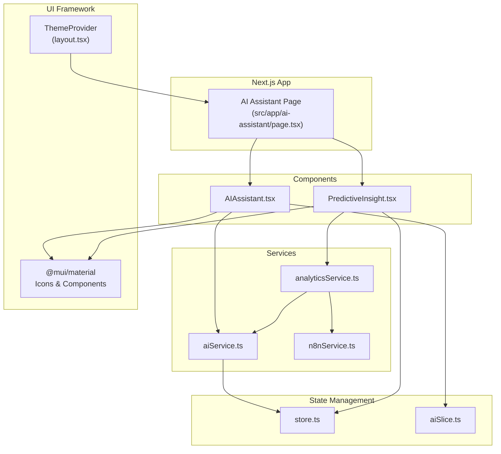
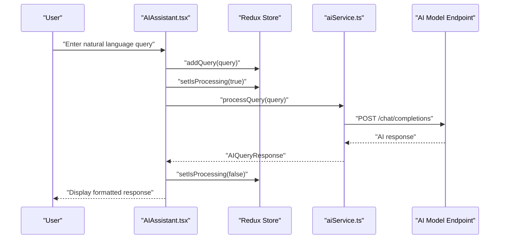
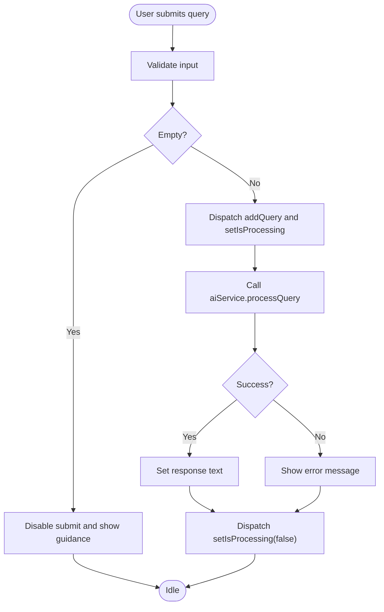
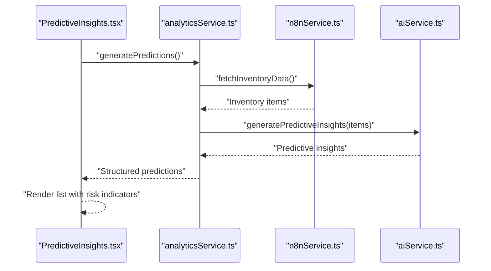
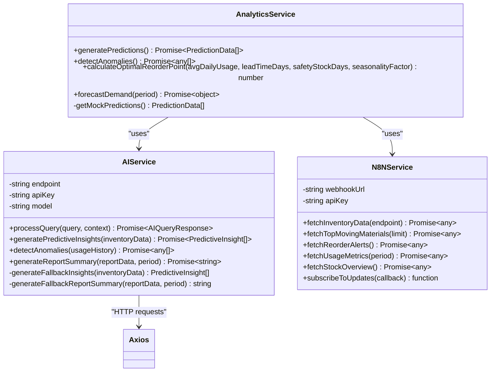
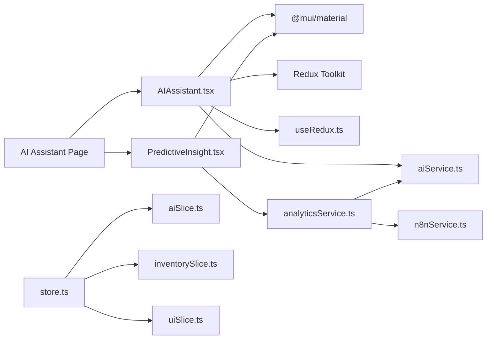

# AI Assistant Components

<cite>
**Referenced Files in This Document**
- [AIAssistant.tsx](file://src/components/ai/AIAssistant.tsx)
- [PredictiveInsight.tsx](file://src/components/ai/PredictiveInsight.tsx)
- [aiService.ts](file://src/services/aiService.ts)
- [analyticsService.ts](file://src/services/analyticsService.ts)
- [n8nService.ts](file://src/services/n8nService.ts)
- [aiSlice.ts](file://src/store/slices/aiSlice.ts)
- [store.ts](file://src/store/store.ts)
- [useRedux.ts](file://src/hooks/useRedux.ts)
- [useResponsive.ts](file://src/hooks/useResponsive.ts)
- [page.tsx](file://src/app/ai-assistant/page.tsx)
- [layout.tsx](file://src/app/layout.tsx)
- [site.config.ts](file://src/config/site.config.ts)
- [package.json](file://package.json)
</cite>

## Table of Contents
1. [Introduction](#introduction)
2. [Project Structure](#project-structure)
3. [Core Components](#core-components)
4. [Architecture Overview](#architecture-overview)
5. [Detailed Component Analysis](#detailed-component-analysis)
6. [Dependency Analysis](#dependency-analysis)
7. [Performance Considerations](#performance-considerations)
8. [Accessibility and Responsive Design](#accessibility-and-responsive-design)
9. [Usage Examples](#usage-examples)
10. [Customization and Theming](#customization-and-theming)
11. [Troubleshooting Guide](#troubleshooting-guide)
12. [Conclusion](#conclusion)

## Introduction
This document provides comprehensive documentation for the AI-powered UI components in the dashboard-ai project. It focuses on two primary components:
- AIAssistant: A natural language interface enabling users to ask inventory-related questions and receive conversational AI responses.
- PredictiveInsight: A component that presents AI-generated insights with data visualization and recommendation displays.

The documentation covers component architecture patterns, integration with the AI service layer, state management for conversation history, real-time response handling, Material-UI integration, responsive design for mobile devices, accessibility compliance for screen readers, keyboard navigation support, usage examples for different AI interaction scenarios, customization options for branding and theming, and performance optimization techniques for handling complex queries and large datasets.

## Project Structure
The AI components are organized under the components/ai directory and integrate with services, Redux store, and Next.js app routing. The AIAssistant component resides in the AI Assistant page, while PredictiveInsight is rendered alongside it.

**Diagram sources**
- [page.tsx:10-30](file://src/app/ai-assistant/page.tsx#L10-L30)
- [AIAssistant.tsx:23-118](file://src/components/ai/AIAssistant.tsx#L23-L118)
- [PredictiveInsight.tsx:29-149](file://src/components/ai/PredictiveInsight.tsx#L29-L149)
- [aiService.ts:18-218](file://src/services/aiService.ts#L18-L218)
- [analyticsService.ts:13-133](file://src/services/analyticsService.ts#L13-L133)
- [n8nService.ts:16-108](file://src/services/n8nService.ts#L16-L108)
- [store.ts:7-16](file://src/store/store.ts#L7-L16)
- [aiSlice.ts:17-43](file://src/store/slices/aiSlice.ts#L17-L43)
- [layout.tsx:22-27](file://src/app/layout.tsx#L22-L27)

**Section sources**
- [page.tsx:10-30](file://src/app/ai-assistant/page.tsx#L10-L30)
- [layout.tsx:22-27](file://src/app/layout.tsx#L22-L27)

## Core Components
This section introduces the two AI components and their roles within the dashboard.

- AIAssistant: Provides a chat-like interface for natural language queries. It manages user input, dispatches actions to Redux for conversation history, and integrates with the AI service to process queries and display responses.
- PredictiveInsights: Renders AI-generated insights with risk levels, confidence scores, predicted demand, and recommended actions. It fetches inventory data via the analytics service and displays structured recommendations.

**Section sources**
- [AIAssistant.tsx:23-118](file://src/components/ai/AIAssistant.tsx#L23-L118)
- [PredictiveInsight.tsx:29-149](file://src/components/ai/PredictiveInsight.tsx#L29-L149)

## Architecture Overview
The AI components follow a layered architecture:
- UI Layer: React components using Material-UI for rendering and interactions.
- Service Layer: aiService handles AI model requests, while analyticsService orchestrates data fetching and AI insights generation. n8nService provides inventory data from webhooks.
- State Management: Redux slices manage AI conversation history and processing state.
- Routing: Next.js app router renders the AI Assistant page and composes the components.

**Diagram sources**
- [AIAssistant.tsx:29-46](file://src/components/ai/AIAssistant.tsx#L29-L46)
- [aiService.ts:33-74](file://src/services/aiService.ts#L33-L74)
- [aiSlice.ts:24-34](file://src/store/slices/aiSlice.ts#L24-L34)

**Section sources**
- [AIAssistant.tsx:29-46](file://src/components/ai/AIAssistant.tsx#L29-L46)
- [aiService.ts:33-74](file://src/services/aiService.ts#L33-L74)
- [aiSlice.ts:24-34](file://src/store/slices/aiSlice.ts#L24-L34)

## Detailed Component Analysis

### AIAssistant Component
The AIAssistant component implements a natural language chat interface integrated with the AI service and Redux for state management.

Key features:
- Input handling with multi-line text field and Enter key submission.
- Real-time processing indicator during AI query execution.
- Error handling with user-friendly fallback messages.
- Material-UI integration for consistent theming and responsive design.

**Diagram sources**
- [AIAssistant.tsx:29-46](file://src/components/ai/AIAssistant.tsx#L29-L46)
- [aiService.ts:33-74](file://src/services/aiService.ts#L33-L74)
- [aiSlice.ts:24-34](file://src/store/slices/aiSlice.ts#L24-L34)

Implementation highlights:
- State management: Uses local state for query and response, and Redux for processing state and history.
- Event handling: Keyboard event listener for Enter key submission; button click handler for submission.
- Material-UI components: Card, TextField, Button, Typography, IconButton, Alert, CircularProgress.
- Accessibility: Disabled states for controls during processing; clear icon for input clearing.

Integration points:
- aiService: Centralized AI model communication with configurable endpoint, API key, and model name.
- Redux: aiSlice manages query history and processing state.

**Section sources**
- [AIAssistant.tsx:23-118](file://src/components/ai/AIAssistant.tsx#L23-L118)
- [aiService.ts:23-27](file://src/services/aiService.ts#L23-L27)
- [aiSlice.ts:17-43](file://src/store/slices/aiSlice.ts#L17-L43)
- [useRedux.ts:1-6](file://src/hooks/useRedux.ts#L1-L6)

### PredictiveInsights Component
The PredictiveInsights component displays AI-generated insights with risk levels, confidence, predicted demand, and recommended actions.

Key features:
- Data fetching lifecycle with loading state and error handling.
- Risk-based visual indicators and color coding.
- Structured list presentation with chips for confidence and risk level.
- Integration with analyticsService for AI-powered predictions.

**Diagram sources**
- [PredictiveInsight.tsx:33-46](file://src/components/ai/PredictiveInsight.tsx#L33-L46)
- [analyticsService.ts:17-41](file://src/services/analyticsService.ts#L17-L41)
- [n8nService.ts:29-51](file://src/services/n8nService.ts#L29-L51)
- [aiService.ts:79-109](file://src/services/aiService.ts#L79-L109)

Implementation highlights:
- Data model: Prediction interface defines material attributes, predicted demand, confidence, recommended action, and risk level.
- Visual design: Icons represent risk levels; chips display confidence and risk; List/ListItem components structure content.
- Fallback mechanism: analyticsService provides mock predictions if AI or data sources fail.

**Section sources**
- [PredictiveInsight.tsx:29-149](file://src/components/ai/PredictiveInsight.tsx#L29-L149)
- [analyticsService.ts:17-73](file://src/services/analyticsService.ts#L17-L73)
- [aiService.ts:79-124](file://src/services/aiService.ts#L79-L124)

### AI Service Layer
The aiService encapsulates AI model communication and provides multiple capabilities:
- Natural language query processing using a Qwen model.
- Predictive insights generation by parsing AI responses into structured data.
- Automated report summaries and anomaly detection.
- Fallback mechanisms for robustness.

Key capabilities:
- processQuery: Sends system and user prompts to the AI model endpoint and returns formatted responses.
- generatePredictiveInsights: Transforms inventory data into prompts and parses AI JSON responses.
- detectAnomalies: Identifies unusual consumption patterns from usage history.
- generateReportSummary: Produces concise executive summaries from report data.

**Diagram sources**
- [aiService.ts:18-218](file://src/services/aiService.ts#L18-L218)
- [analyticsService.ts:13-133](file://src/services/analyticsService.ts#L13-L133)
- [n8nService.ts:16-108](file://src/services/n8nService.ts#L16-L108)

**Section sources**
- [aiService.ts:18-218](file://src/services/aiService.ts#L18-L218)
- [analyticsService.ts:13-133](file://src/services/aiService.ts#L13-L133)
- [n8nService.ts:16-108](file://src/services/n8nService.ts#L16-L108)

## Dependency Analysis
The AI components rely on several layers of dependencies:
- Material-UI for UI primitives and icons.
- Redux for state management and typed hooks.
- Next.js app router for page composition.
- Environment variables for AI model configuration.
- axios for HTTP requests to AI and webhook endpoints.

**Diagram sources**
- [AIAssistant.tsx:3-21](file://src/components/ai/AIAssistant.tsx#L3-L21)
- [PredictiveInsight.tsx:3-18](file://src/components/ai/PredictiveInsight.tsx#L3-L18)
- [aiService.ts:1-1](file://src/services/aiService.ts#L1-L1)
- [analyticsService.ts:1-2](file://src/services/analyticsService.ts#L1-L2)
- [n8nService.ts:1-1](file://src/services/n8nService.ts#L1-L1)
- [store.ts:1-16](file://src/store/store.ts#L1-L16)
- [aiSlice.ts:1-1](file://src/store/slices/aiSlice.ts#L1-L1)
- [page.tsx:7-8](file://src/app/ai-assistant/page.tsx#L7-L8)

**Section sources**
- [package.json:11-26](file://package.json#L11-L26)
- [store.ts:7-16](file://src/store/store.ts#L7-L16)

## Performance Considerations
To optimize performance for complex queries and large datasets:
- Limit payload sizes: The AI service truncates inventory data sent to the model to reduce token usage and latency.
- Implement caching: The site configuration includes cache TTL settings for various data types to minimize repeated network calls.
- Debounce user input: Consider debouncing query submissions to avoid excessive API calls during rapid typing.
- Pagination and sampling: For large datasets, fetch and send only relevant subsets to the AI model.
- Parallelization: Where appropriate, fetch multiple data streams concurrently (e.g., inventory data and usage metrics).
- Error boundaries: Use try-catch blocks and fallback mechanisms to prevent cascading failures.
- Lazy loading: Defer non-critical insights rendering until after initial page load.

[No sources needed since this section provides general guidance]

## Accessibility and Responsive Design
Accessibility:
- Keyboard navigation: The AIAssistant component supports Enter key submission without Shift, ensuring keyboard-only operation.
- Disabled states: Controls are disabled during processing to prevent invalid interactions.
- Screen reader compatibility: Material-UI components provide built-in ARIA attributes; ensure custom elements include appropriate labels.

Responsive design:
- Material-UI breakpoints: The useResponsive hook provides utilities for mobile, tablet, and desktop layouts.
- Adaptive layouts: Components use responsive spacing and typography scaling to fit various screen sizes.
- Mobile-first approach: Text fields and buttons adapt to smaller screens with appropriate padding and sizing.

**Section sources**
- [AIAssistant.tsx:50-55](file://src/components/ai/AIAssistant.tsx#L50-L55)
- [useResponsive.ts:14-42](file://src/hooks/useResponsive.ts#L14-L42)
- [site.config.ts:19-20](file://src/config/site.config.ts#L19-L20)

## Usage Examples
Common AI interaction scenarios:
- Asking inventory questions: Users can query top-moving materials, reorder alerts, and stock levels using natural language.
- Requesting predictive insights: Users can view AI-generated demand forecasts, confidence levels, and recommended actions.
- Generating reports: The AI can summarize inventory reports for leadership review.

Example prompts:
- "Show me top 10 fast-moving raw materials"
- "Which materials need reordering?"
- "What is the predicted demand for Urea Nitrogen next quarter?"
- "Summarize this week's inventory report"

[No sources needed since this section provides general guidance]

## Customization and Theming
Branding and theming options:
- Material-UI theme provider: Wrap the application with ThemeProvider to apply global theme settings.
- Component-level theming: Adjust colors, typography, and spacing using MUI sx props within components.
- Iconography: Replace default icons with branded alternatives where appropriate.
- Typography: Customize font families and weights to align with brand guidelines.

**Section sources**
- [layout.tsx:22-27](file://src/app/layout.tsx#L22-L27)
- [AIAssistant.tsx:58-117](file://src/components/ai/AIAssistant.tsx#L58-L117)
- [PredictiveInsight.tsx:72-149](file://src/components/ai/PredictiveInsight.tsx#L72-L149)

## Troubleshooting Guide
Common issues and resolutions:
- AI query errors: The AIAssistant component catches errors and displays a user-friendly message. Verify AI model endpoint, API key, and model name in environment variables.
- Network timeouts: The n8nService sets a 10-second timeout for webhook requests. Increase timeout or retry logic if needed.
- Empty or malformed AI responses: The AI service includes fallback methods for insights and report summaries. Ensure the AI model returns valid JSON for structured insights.
- Redux state inconsistencies: Verify that aiSlice actions are dispatched correctly and that the store is configured with proper middleware.

**Section sources**
- [AIAssistant.tsx:40-45](file://src/components/ai/AIAssistant.tsx#L40-L45)
- [n8nService.ts:33-51](file://src/services/n8nService.ts#L33-L51)
- [aiService.ts:70-74](file://src/services/aiService.ts#L70-L74)
- [store.ts:14-16](file://src/store/store.ts#L14-L16)

## Conclusion
The AI Assistant and PredictiveInsights components provide a robust foundation for natural language interaction and AI-powered insights within the dashboard. They integrate seamlessly with Material-UI, Redux, and external services, offering responsive design, accessibility support, and extensible customization options. By leveraging the AI service layer and analytics orchestration, the components deliver real-time, data-driven decision support tailored to inventory management workflows.

[No sources needed since this section summarizes without analyzing specific files]