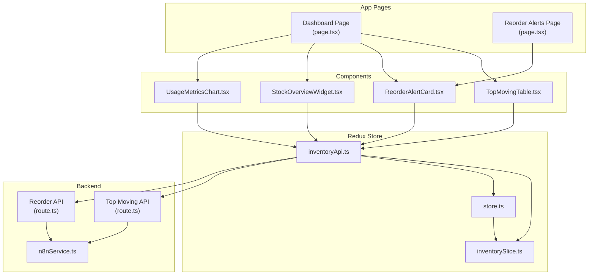
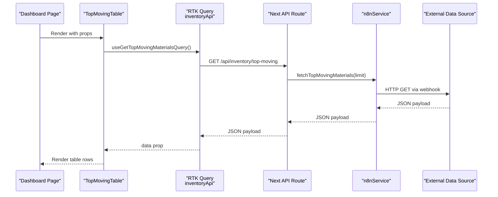
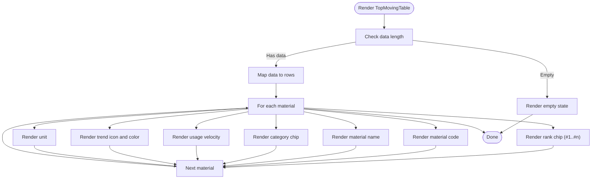
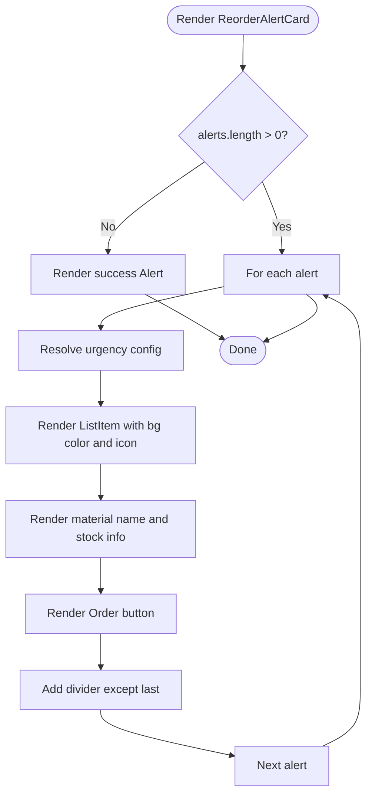
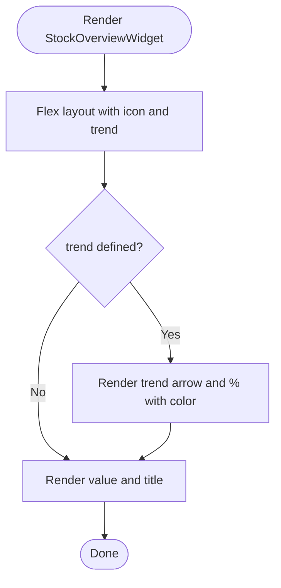
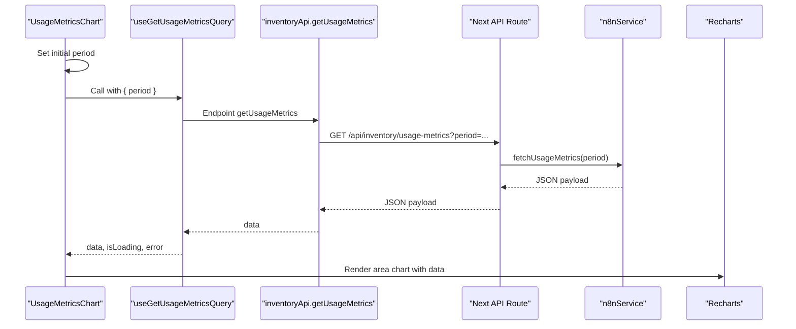
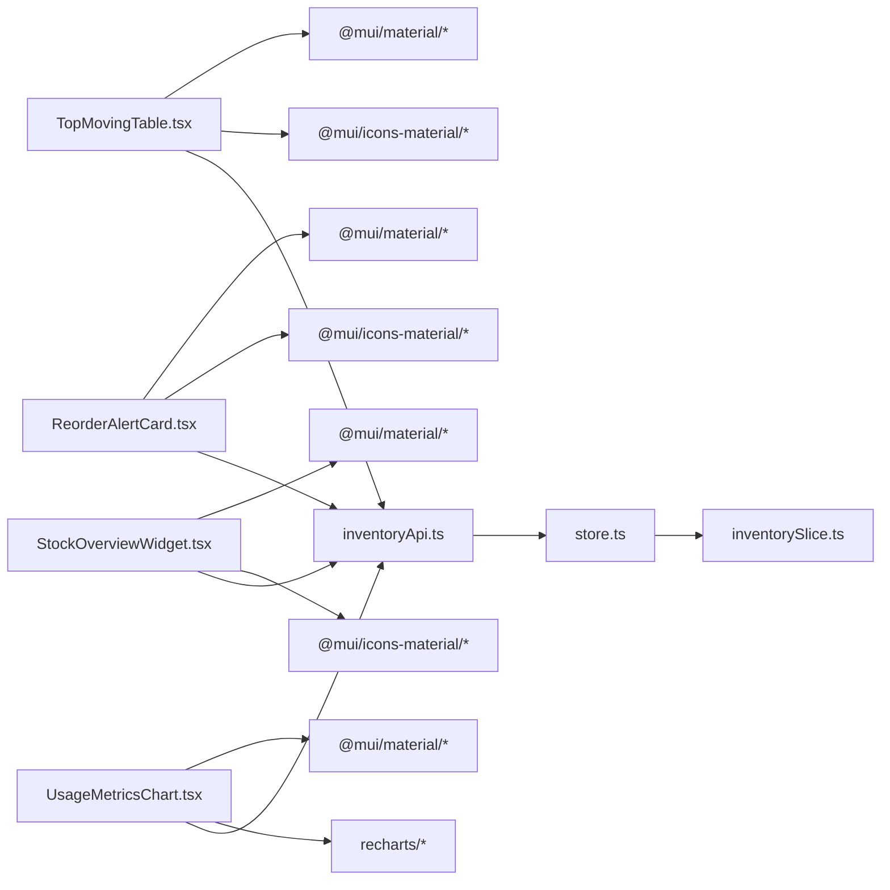

# Inventory Components

<cite>
**Referenced Files in This Document**
- [TopMovingTable.tsx](file://src/components/inventory/TopMovingTable.tsx)
- [ReorderAlertCard.tsx](file://src/components/inventory/ReorderAlertCard.tsx)
- [StockOverviewWidget.tsx](file://src/components/inventory/StockOverviewWidget.tsx)
- [UsageMetricsChart.tsx](file://src/components/inventory/UsageMetricsChart.tsx)
- [inventoryApi.ts](file://src/store/api/inventoryApi.ts)
- [inventorySlice.ts](file://src/store/slices/inventorySlice.ts)
- [store.ts](file://src/store/store.ts)
- [page.tsx (Dashboard)](file://src/app/dashboard/page.tsx)
- [page.tsx (Reorder Alerts)](file://src/app/reorder-alerts/page.tsx)
- [route.ts (Top Moving API)](file://src/app/api/inventory/top-moving/route.ts)
- [route.ts (Reorder API)](file://src/app/api/inventory/reorder/route.ts)
- [n8nService.ts](file://src/services/n8nService.ts)
- [useResponsive.ts](file://src/hooks/useResponsive.ts)
- [formatters.ts](file://src/utils/formatters.ts)
</cite>

## Table of Contents
1. [Introduction](#introduction)
2. [Project Structure](#project-structure)
3. [Core Components](#core-components)
4. [Architecture Overview](#architecture-overview)
5. [Detailed Component Analysis](#detailed-component-analysis)
6. [Dependency Analysis](#dependency-analysis)
7. [Performance Considerations](#performance-considerations)
8. [Troubleshooting Guide](#troubleshooting-guide)
9. [Conclusion](#conclusion)
10. [Appendices](#appendices)

## Introduction
This document provides comprehensive documentation for the inventory management UI components in the dashboard-ai project. It covers:
- TopMovingTable: displays top-performing inventory items with ranking, categories, usage velocity, and trend indicators.
- ReorderAlertCard: presents stock level warnings and reorder recommendations with color-coded urgency and action buttons.
- StockOverviewWidget: shows key inventory metrics with real-time updates and trend indicators.
- UsageMetricsChart: visualizes inventory usage trends using Recharts integration with weekly/monthly periods.

The documentation explains component props, state management integration with Redux, Material-UI theming, responsive design patterns, accessibility features, practical usage examples, customization options, and performance considerations for handling large datasets.

## Project Structure
The inventory components are organized under the components/inventory directory and integrate with Redux RTK Query APIs and slices. The dashboard pages consume these components and manage loading/error states.

**Diagram sources**
- [page.tsx (Dashboard):17-127](file://src/app/dashboard/page.tsx#L17-L127)
- [page.tsx (Reorder Alerts):11-43](file://src/app/reorder-alerts/page.tsx#L11-L43)
- [TopMovingTable.tsx:19-99](file://src/components/inventory/TopMovingTable.tsx#L19-L99)
- [ReorderAlertCard.tsx:19-104](file://src/components/inventory/ReorderAlertCard.tsx#L19-L104)
- [StockOverviewWidget.tsx:16-56](file://src/components/inventory/StockOverviewWidget.tsx#L16-L56)
- [UsageMetricsChart.tsx:47-159](file://src/components/inventory/UsageMetricsChart.tsx#L47-L159)
- [inventoryApi.ts:23-48](file://src/store/api/inventoryApi.ts#L23-L48)
- [inventorySlice.ts:21-44](file://src/store/slices/inventorySlice.ts#L21-L44)
- [store.ts:7-16](file://src/store/store.ts#L7-L16)
- [route.ts (Top Moving API):4-24](file://src/app/api/inventory/top-moving/route.ts#L4-L24)
- [route.ts (Reorder API):4-17](file://src/app/api/inventory/reorder/route.ts#L4-L17)
- [n8nService.ts:16-109](file://src/services/n8nService.ts#L16-L109)

**Section sources**
- [TopMovingTable.tsx:1-100](file://src/components/inventory/TopMovingTable.tsx#L1-L100)
- [ReorderAlertCard.tsx:1-105](file://src/components/inventory/ReorderAlertCard.tsx#L1-L105)
- [StockOverviewWidget.tsx:1-57](file://src/components/inventory/StockOverviewWidget.tsx#L1-L57)
- [UsageMetricsChart.tsx:1-160](file://src/components/inventory/UsageMetricsChart.tsx#L1-L160)
- [inventoryApi.ts:1-57](file://src/store/api/inventoryApi.ts#L1-L57)
- [inventorySlice.ts:1-56](file://src/store/slices/inventorySlice.ts#L1-L56)
- [store.ts:1-27](file://src/store/store.ts#L1-L27)
- [page.tsx (Dashboard):1-128](file://src/app/dashboard/page.tsx#L1-L128)
- [page.tsx (Reorder Alerts):1-44](file://src/app/reorder-alerts/page.tsx#L1-L44)
- [route.ts (Top Moving API):1-25](file://src/app/api/inventory/top-moving/route.ts#L1-L25)
- [route.ts (Reorder API):1-18](file://src/app/api/inventory/reorder/route.ts#L1-L18)
- [n8nService.ts:1-109](file://src/services/n8nService.ts#L1-L109)

## Core Components
This section documents the four inventory components with their props, rendering logic, theming, and integration points.

- TopMovingTable
  - Purpose: Render a sortable, filterable, paginated table of top-performing inventory items.
  - Props:
    - data: TopMovingMaterial[]
  - Features:
    - Rank badges with color coding for top 3 items.
    - Category chips with outlined style.
    - Usage velocity formatted with thousands separators.
    - Trend icons and colors for up/down/stable.
    - Hover effects and accessible table markup.
  - Theming: Uses Material-UI components (Table, TableBody, TableCell, TableRow, TableContainer, Paper, Chip, Box).
  - Accessibility: Table includes aria-label and semantic row structure.

- ReorderAlertCard
  - Purpose: Present stock level warnings and reorder recommendations with urgency levels.
  - Props:
    - alerts: ReorderAlert[]
  - Features:
    - Urgency-based color scheme and background.
    - Icons for critical/warning/info.
    - Action button per alert item.
    - Empty state success message when no alerts.
  - Theming: Uses Alert, List, ListItem, ListItemText, ListItemIcon, Button, Divider, Typography, Box.
  - Accessibility: Proper contrast and semantic list structure.

- StockOverviewWidget
  - Purpose: Display KPI-style inventory metrics with optional trend indicator.
  - Props:
    - title: string
    - value: string | number
    - icon: string (emoji)
    - trend?: number (percentage)
    - trendNegative?: boolean (invert positive/negative interpretation)
  - Features:
    - Trend arrow and percentage with color-coded direction.
    - Flexible layout with responsive card sizing.
  - Theming: Card, CardContent, Typography, Box, TrendingUpIcon/TrendingDownIcon.

- UsageMetricsChart
  - Purpose: Visualize inventory usage trends with area charts and summary metrics.
  - Props: None (uses internal state and RTK Query).
  - Features:
    - Period selector (weekly/monthly).
    - Loading and error states.
    - Responsive area chart with gradients and tooltips.
    - Summary cards for average daily usage, peak usage, and forecast accuracy.
  - Theming: Card, CardContent, Box, Typography, FormControl, InputLabel, Select, MenuItem, ResponsiveContainer, Recharts components.

**Section sources**
- [TopMovingTable.tsx:15-99](file://src/components/inventory/TopMovingTable.tsx#L15-L99)
- [ReorderAlertCard.tsx:15-104](file://src/components/inventory/ReorderAlertCard.tsx#L15-L104)
- [StockOverviewWidget.tsx:8-56](file://src/components/inventory/StockOverviewWidget.tsx#L8-L56)
- [UsageMetricsChart.tsx:47-159](file://src/components/inventory/UsageMetricsChart.tsx#L47-L159)

## Architecture Overview
The components integrate with Redux RTK Query to fetch data from Next.js API routes, which proxy requests to n8n webhooks. The store combines RTK Query reducers and middleware with local slices.

**Diagram sources**
- [page.tsx (Dashboard):17-127](file://src/app/dashboard/page.tsx#L17-L127)
- [TopMovingTable.tsx:19-99](file://src/components/inventory/TopMovingTable.tsx#L19-L99)
- [inventoryApi.ts:27-32](file://src/store/api/inventoryApi.ts#L27-L32)
- [route.ts (Top Moving API):4-24](file://src/app/api/inventory/top-moving/route.ts#L4-L24)
- [n8nService.ts:56-58](file://src/services/n8nService.ts#L56-L58)

**Section sources**
- [page.tsx (Dashboard):17-127](file://src/app/dashboard/page.tsx#L17-L127)
- [inventoryApi.ts:23-48](file://src/store/api/inventoryApi.ts#L23-L48)
- [route.ts (Top Moving API):1-25](file://src/app/api/inventory/top-moving/route.ts#L1-L25)
- [n8nService.ts:16-109](file://src/services/n8nService.ts#L16-L109)

## Detailed Component Analysis

### TopMovingTable
- Props
  - data: TopMovingMaterial[]
- Rendering logic
  - Renders a Material-UI Table with headers for rank, material code, name, category, usage velocity, trend, and unit.
  - Uses Chip for rank badges and category labels.
  - Displays usage velocity with thousands separators.
  - Trend icons and colors mapped to 'up'/'down'/'stable'.
  - Hover effect on rows for better UX.
- Theming and accessibility
  - Uses TableContainer, Table, TableHead, TableBody, TableRow, TableCell, Paper, Chip, Box.
  - Table includes aria-label for screen readers.
- Integration
  - Consumed by Dashboard page via RTK Query hook.
  - Props passed directly from query result.

**Diagram sources**
- [TopMovingTable.tsx:19-99](file://src/components/inventory/TopMovingTable.tsx#L19-L99)

**Section sources**
- [TopMovingTable.tsx:15-99](file://src/components/inventory/TopMovingTable.tsx#L15-L99)
- [page.tsx (Dashboard):88-101](file://src/app/dashboard/page.tsx#L88-L101)

### ReorderAlertCard
- Props
  - alerts: ReorderAlert[]
- Rendering logic
  - If alerts is empty, renders a success Alert indicating optimal stock levels.
  - Otherwise, renders a vertical list of alerts with urgency-configured icons, backgrounds, and action buttons.
  - Each alert shows material name, current stock, reorder point, and suggested order quantity.
- Theming and accessibility
  - Uses Alert, List, ListItem, ListItemText, ListItemIcon, Button, Divider, Typography, Box.
  - Background colors and icons vary by urgency level.
- Integration
  - Consumed by Dashboard and dedicated Reorder Alerts page via RTK Query hook.

**Diagram sources**
- [ReorderAlertCard.tsx:19-104](file://src/components/inventory/ReorderAlertCard.tsx#L19-L104)

**Section sources**
- [ReorderAlertCard.tsx:15-104](file://src/components/inventory/ReorderAlertCard.tsx#L15-L104)
- [page.tsx (Dashboard):104-114](file://src/app/dashboard/page.tsx#L104-L114)
- [page.tsx (Reorder Alerts):11-43](file://src/app/reorder-alerts/page.tsx#L11-L43)

### StockOverviewWidget
- Props
  - title: string
  - value: string | number
  - icon: string (emoji)
  - trend?: number
  - trendNegative?: boolean
- Rendering logic
  - Displays an icon, value, and title in a card layout.
  - Conditionally renders a trend indicator with directional icon and percentage.
  - Color coding adapts based on trendNegative flag.
- Theming and accessibility
  - Uses Card, CardContent, Typography, Box, TrendingUpIcon/TrendingDownIcon.
  - Accessible typography and layout.

**Diagram sources**
- [StockOverviewWidget.tsx:16-56](file://src/components/inventory/StockOverviewWidget.tsx#L16-L56)

**Section sources**
- [StockOverviewWidget.tsx:8-56](file://src/components/inventory/StockOverviewWidget.tsx#L8-L56)
- [page.tsx (Dashboard):50-84](file://src/app/dashboard/page.tsx#L50-L84)

### UsageMetricsChart
- Props: None
- Rendering logic
  - Internal state for period selection ('week' | 'month').
  - Uses useGetUsageMetricsQuery to fetch data.
  - Renders a responsive area chart with consumption and forecast series.
  - Provides summary metrics below the chart.
  - Handles loading and error states.
- Theming and accessibility
  - Uses Card, CardContent, Box, Typography, FormControl, InputLabel, Select, MenuItem, ResponsiveContainer, Recharts components.
  - Tooltip and legend enabled for interactivity.
- Integration
  - Consumed by Dashboard page within a card layout.

**Diagram sources**
- [UsageMetricsChart.tsx:47-159](file://src/components/inventory/UsageMetricsChart.tsx#L47-L159)
- [inventoryApi.ts:38-42](file://src/store/api/inventoryApi.ts#L38-L42)
- [n8nService.ts:70-72](file://src/services/n8nService.ts#L70-L72)

**Section sources**
- [UsageMetricsChart.tsx:47-159](file://src/components/inventory/UsageMetricsChart.tsx#L47-L159)
- [page.tsx (Dashboard):116-124](file://src/app/dashboard/page.tsx#L116-L124)

## Dependency Analysis
The components depend on:
- Material-UI components for UI primitives and theming.
- RTK Query hooks for data fetching and caching.
- Local slices for state management (when applicable).
- Responsive hooks for adaptive layouts.
- Formatting utilities for consistent number/date formatting.

**Diagram sources**
- [TopMovingTable.tsx:1-14](file://src/components/inventory/TopMovingTable.tsx#L1-L14)
- [ReorderAlertCard.tsx:1-13](file://src/components/inventory/ReorderAlertCard.tsx#L1-L13)
- [StockOverviewWidget.tsx:1-7](file://src/components/inventory/StockOverviewWidget.tsx#L1-L7)
- [UsageMetricsChart.tsx:8-19](file://src/components/inventory/UsageMetricsChart.tsx#L8-L19)
- [inventoryApi.ts:1-1](file://src/store/api/inventoryApi.ts#L1-L1)
- [store.ts:1-16](file://src/store/store.ts#L1-L16)
- [inventorySlice.ts:1-10](file://src/store/slices/inventorySlice.ts#L1-L10)

**Section sources**
- [TopMovingTable.tsx:1-14](file://src/components/inventory/TopMovingTable.tsx#L1-L14)
- [ReorderAlertCard.tsx:1-13](file://src/components/inventory/ReorderAlertCard.tsx#L1-L13)
- [StockOverviewWidget.tsx:1-7](file://src/components/inventory/StockOverviewWidget.tsx#L1-L7)
- [UsageMetricsChart.tsx:8-19](file://src/components/inventory/UsageMetricsChart.tsx#L8-L19)
- [inventoryApi.ts:1-57](file://src/store/api/inventoryApi.ts#L1-L57)
- [store.ts:1-27](file://src/store/store.ts#L1-L27)
- [inventorySlice.ts:1-56](file://src/store/slices/inventorySlice.ts#L1-L56)

## Performance Considerations
- Data fetching and caching
  - RTK Query caches endpoints for configurable durations (seconds) to reduce network calls.
  - Tag invalidation ensures fresh data when needed.
- Large dataset handling
  - TopMovingTable renders all items; consider virtualization for very large lists.
  - Pagination can be added at the API level and exposed via props.
- Real-time updates
  - Backend polling via n8nService can be adapted to WebSocket for live updates.
- Rendering optimization
  - Memoize computed values (e.g., formatted numbers) to avoid re-renders.
  - Lazy-load heavy charts until needed.
- Network reliability
  - Implement retry logic and offline fallbacks for critical dashboards.
- Accessibility and responsiveness
  - Ensure sufficient contrast and keyboard navigation support.
  - Use responsive breakpoints for mobile-friendly layouts.

[No sources needed since this section provides general guidance]

## Troubleshooting Guide
- API errors
  - TopMovingTable and ReorderAlertCard show error UI when queries fail.
  - Verify API routes are reachable and n8nService credentials are configured.
- Data shape mismatches
  - Ensure backend returns expected shapes for TopMovingMaterial and ReorderAlert.
- Loading states
  - Dashboard aggregates loading states; individual components should handle their own loading indicators.
- Styling issues
  - Confirm Material-UI theme and palette are applied consistently across components.
- Responsive layout problems
  - Use useResponsive hook to adapt component layouts for different screen sizes.

**Section sources**
- [page.tsx (Dashboard):24-30](file://src/app/dashboard/page.tsx#L24-L30)
- [TopMovingTable.tsx:56-95](file://src/components/inventory/TopMovingTable.tsx#L56-L95)
- [ReorderAlertCard.tsx:43-49](file://src/components/inventory/ReorderAlertCard.tsx#L43-L49)
- [route.ts (Top Moving API):17-23](file://src/app/api/inventory/top-moving/route.ts#L17-L23)
- [route.ts (Reorder API):10-16](file://src/app/api/inventory/reorder/route.ts#L10-L16)
- [n8nService.ts:42-50](file://src/services/n8nService.ts#L42-L50)

## Conclusion
The inventory components provide a cohesive set of UI elements for monitoring and managing stock levels. They leverage Material-UI for consistent theming, RTK Query for efficient data fetching and caching, and responsive design patterns for cross-device usability. The components are modular, accessible, and extensible, enabling straightforward customization and performance tuning for large-scale inventory datasets.

[No sources needed since this section summarizes without analyzing specific files]

## Appendices

### Component Prop Reference
- TopMovingTable
  - data: TopMovingMaterial[]
- ReorderAlertCard
  - alerts: ReorderAlert[]
- StockOverviewWidget
  - title: string
  - value: string | number
  - icon: string
  - trend?: number
  - trendNegative?: boolean
- UsageMetricsChart
  - None (props derived from internal state and RTK Query)

**Section sources**
- [TopMovingTable.tsx:15-17](file://src/components/inventory/TopMovingTable.tsx#L15-L17)
- [ReorderAlertCard.tsx:15-17](file://src/components/inventory/ReorderAlertCard.tsx#L15-L17)
- [StockOverviewWidget.tsx:8-14](file://src/components/inventory/StockOverviewWidget.tsx#L8-L14)
- [UsageMetricsChart.tsx:47-49](file://src/components/inventory/UsageMetricsChart.tsx#L47-L49)

### State Management Integration
- Redux store
  - inventoryApi reducer and middleware are registered in the store.
  - inventorySlice manages local state for inventory-related UI data.
- Queries
  - useGetTopMovingMaterialsQuery, useGetReorderAlertsQuery, useGetUsageMetricsQuery, useGetStockOverviewQuery.
- Caching
  - keepUnusedDataFor values define cache lifetimes for each endpoint.

**Section sources**
- [store.ts:7-16](file://src/store/store.ts#L7-L16)
- [inventoryApi.ts:23-48](file://src/store/api/inventoryApi.ts#L23-L48)
- [inventorySlice.ts:21-44](file://src/store/slices/inventorySlice.ts#L21-L44)

### Backend Integration
- Next.js API routes
  - /api/inventory/top-moving and /api/inventory/reorder proxy to n8nService.
- n8nService
  - Fetches data from external webhooks with authentication and timeouts.
  - Supports periodic polling for real-time updates.

**Section sources**
- [route.ts (Top Moving API):4-24](file://src/app/api/inventory/top-moving/route.ts#L4-L24)
- [route.ts (Reorder API):4-17](file://src/app/api/inventory/reorder/route.ts#L4-L17)
- [n8nService.ts:29-105](file://src/services/n8nService.ts#L29-L105)

### Responsive Design Patterns
- useResponsive hook
  - Provides boolean flags for xs/sm/md/lg/xl breakpoints and convenience helpers.
- Component layouts
  - Dashboard grid adjusts column widths for different screen sizes.
  - Components use Box and Grid to maintain consistent spacing and alignment.

**Section sources**
- [useResponsive.ts:14-42](file://src/hooks/useResponsive.ts#L14-L42)
- [page.tsx (Dashboard):50-84](file://src/app/dashboard/page.tsx#L50-L84)

### Accessibility Features
- Tables
  - Include aria-label and semantic row structure for screen readers.
- Charts
  - Tooltips and legends improve comprehension; ensure focus management for interactive elements.
- Color contrast
  - Use Material-UI color palettes to meet contrast guidelines.
- Keyboard navigation
  - Buttons and selects should be operable via keyboard.

**Section sources**
- [TopMovingTable.tsx:44-44](file://src/components/inventory/TopMovingTable.tsx#L44-L44)
- [UsageMetricsChart.tsx:107-108](file://src/components/inventory/UsageMetricsChart.tsx#L107-L108)

### Practical Usage Examples
- Dashboard integration
  - Import components and wrap with cards; pass data from RTK Query hooks.
- Customization
  - Modify StockOverviewWidget props to reflect different metrics.
  - Extend TopMovingTable to accept sorting/filtering props and implement pagination.
- Theming
  - Override Material-UI theme tokens for consistent brand colors across components.

**Section sources**
- [page.tsx (Dashboard):32-124](file://src/app/dashboard/page.tsx#L32-L124)
- [StockOverviewWidget.tsx:16-56](file://src/components/inventory/StockOverviewWidget.tsx#L16-L56)
- [TopMovingTable.tsx:19-99](file://src/components/inventory/TopMovingTable.tsx#L19-L99)