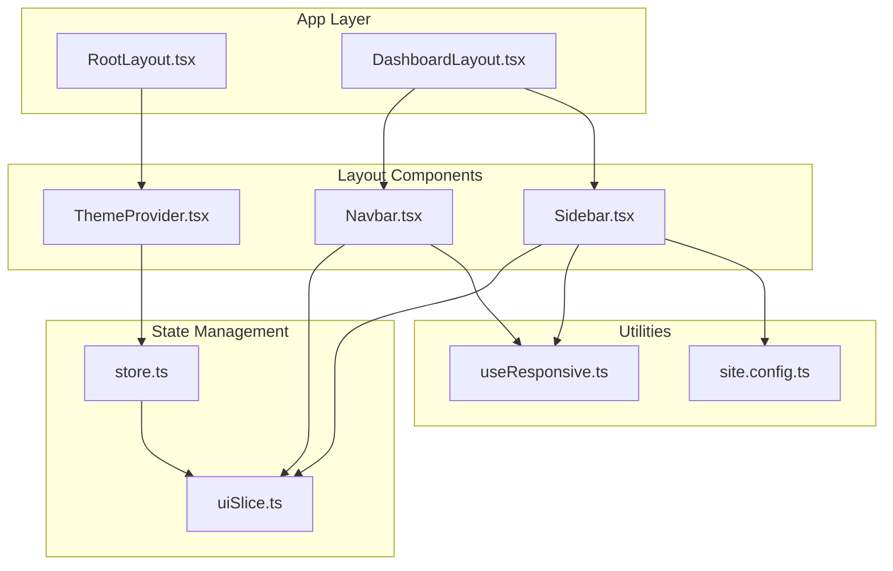
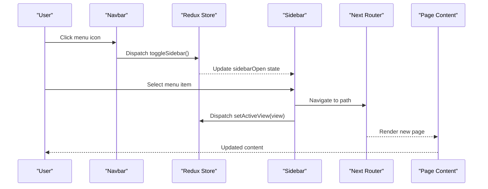
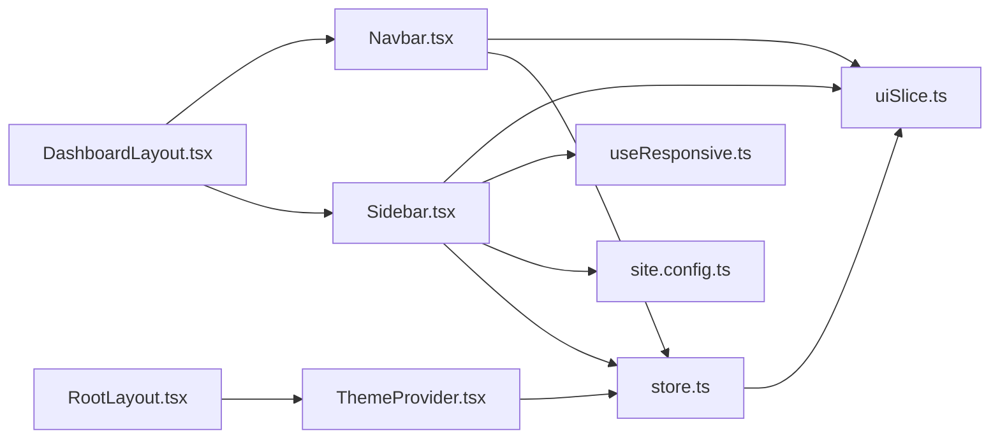
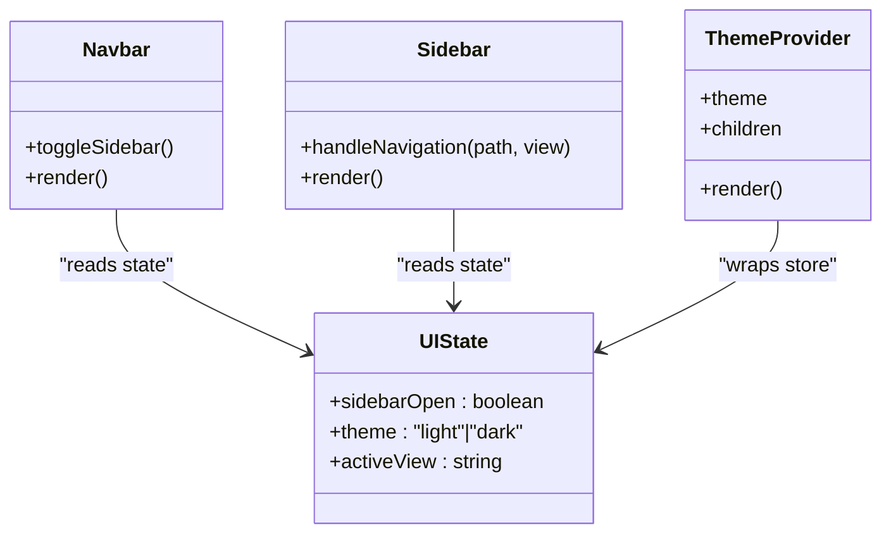

# Layout Components

<cite>
**Referenced Files in This Document**
- [Navbar.tsx](file://src/components/ui/Layout/Navbar.tsx)
- [Sidebar.tsx](file://src/components/ui/Layout/Sidebar.tsx)
- [ThemeProvider.tsx](file://src/components/ui/Layout/ThemeProvider.tsx)
- [DashboardLayout.tsx](file://src/app/dashboard/layout.tsx)
- [RootLayout.tsx](file://src/app/layout.tsx)
- [uiSlice.ts](file://src/store/slices/uiSlice.ts)
- [store.ts](file://src/store/store.ts)
- [useResponsive.ts](file://src/hooks/useResponsive.ts)
- [site.config.ts](file://src/config/site.config.ts)
- [globals.css](file://src/app/globals.css)
- [package.json](file://package.json)
</cite>

## Table of Contents
1. [Introduction](#introduction)
2. [Project Structure](#project-structure)
3. [Core Components](#core-components)
4. [Architecture Overview](#architecture-overview)
5. [Detailed Component Analysis](#detailed-component-analysis)
6. [Dependency Analysis](#dependency-analysis)
7. [Performance Considerations](#performance-considerations)
8. [Troubleshooting Guide](#troubleshooting-guide)
9. [Conclusion](#conclusion)
10. [Appendices](#appendices)

## Introduction
This document provides comprehensive documentation for the layout and theming components in the dashboard-ai project. It focuses on:
- Navbar: top navigation with responsive design, user authentication integration, and mobile menu handling
- Sidebar: left navigation with collapsible functionality, menu item management, and route integration
- ThemeProvider: global theming with Material-UI integration, dark/light mode switching, and custom theme configuration
It also covers component composition patterns, responsive breakpoints, state management for navigation state, and accessibility features for keyboard navigation. Implementation examples for customizing navigation items, integrating with Next.js routing, and extending theme configurations are included, along with performance considerations and best practices for maintaining a consistent user experience across screen sizes.

## Project Structure
The layout components are organized under a dedicated UI layout module and integrated into the Next.js app router. The Redux store manages UI state for navigation and theming. Responsive utilities leverage Material-UI’s theme and media queries.

**Diagram sources**
- [RootLayout.tsx:16-30](file://src/app/layout.tsx#L16-L30)
- [DashboardLayout.tsx:10-41](file://src/app/dashboard/layout.tsx#L10-L41)
- [Navbar.tsx:17-60](file://src/components/ui/Layout/Navbar.tsx#L17-L60)
- [Sidebar.tsx:34-132](file://src/components/ui/Layout/Sidebar.tsx#L34-L132)
- [ThemeProvider.tsx:90-99](file://src/components/ui/Layout/ThemeProvider.tsx#L90-L99)
- [store.ts:7-26](file://src/store/store.ts#L7-L26)
- [uiSlice.ts:15-41](file://src/store/slices/uiSlice.ts#L15-L41)
- [useResponsive.ts:14-42](file://src/hooks/useResponsive.ts#L14-L42)
- [site.config.ts:1-34](file://src/config/site.config.ts#L1-L34)

**Section sources**
- [RootLayout.tsx:16-30](file://src/app/layout.tsx#L16-L30)
- [DashboardLayout.tsx:10-41](file://src/app/dashboard/layout.tsx#L10-L41)
- [store.ts:7-26](file://src/store/store.ts#L7-L26)

## Core Components
This section documents the primary layout components and their responsibilities.

- Navbar
  - Fixed top bar with branding, menu toggle, notifications, and user profile
  - Integrates with Redux to toggle sidebar visibility
  - Uses Material-UI AppBar, Toolbar, and IconButton
  - Accessibility: ARIA label for menu button; inherits color for contrast

- Sidebar
  - Collapsible left navigation drawer
  - Temporary on mobile; permanent on larger screens
  - Menu items mapped from configuration; route integration via Next.js router
  - Active state highlighting based on pathname or active view
  - Settings item placeholder included

- ThemeProvider
  - Wraps the app with Material-UI theme provider and Redux store
  - Defines custom palette, typography, and component overrides
  - Applies CssBaseline for normalized styles

**Section sources**
- [Navbar.tsx:17-60](file://src/components/ui/Layout/Navbar.tsx#L17-L60)
- [Sidebar.tsx:34-132](file://src/components/ui/Layout/Sidebar.tsx#L34-L132)
- [ThemeProvider.tsx:90-99](file://src/components/ui/Layout/ThemeProvider.tsx#L90-L99)

## Architecture Overview
The layout architecture integrates Next.js app router with Material-UI and Redux. The root layout initializes the theme provider, while the dashboard layout composes the navbar and sidebar around page content. Responsive behavior is handled via Material-UI’s theme and media queries.

**Diagram sources**
- [Navbar.tsx:32-40](file://src/components/ui/Layout/Navbar.tsx#L32-L40)
- [uiSlice.ts:18-30](file://src/store/slices/uiSlice.ts#L18-L30)
- [Sidebar.tsx:42-48](file://src/components/ui/Layout/Sidebar.tsx#L42-L48)
- [DashboardLayout.tsx:21-38](file://src/app/dashboard/layout.tsx#L21-L38)

## Detailed Component Analysis

### Navbar Component
Responsibilities:
- Toggle sidebar via Redux action
- Provide branding and user controls
- Fixed positioning with z-index above drawer

Implementation highlights:
- Uses Redux dispatch to toggle sidebar
- Reads sidebarOpen state for responsive logic
- Material-UI AppBar with gradient background
- Icons for menu, notifications, and account

Accessibility and responsiveness:
- Menu button has aria-label for assistive technologies
- Toolbar padding accommodates fixed header height
- Mobile-friendly spacing and sizing

Integration points:
- Dispatches toggleSidebar on click
- Uses useSelector to access UI state
- Composed within DashboardLayout

**Section sources**
- [Navbar.tsx:17-60](file://src/components/ui/Layout/Navbar.tsx#L17-L60)
- [DashboardLayout.tsx:14-16](file://src/app/dashboard/layout.tsx#L14-L16)
- [uiSlice.ts:18-24](file://src/store/slices/uiSlice.ts#L18-L24)

### Sidebar Component
Responsibilities:
- Collapsible navigation drawer
- Menu item management and route integration
- Active view highlighting
- Mobile drawer behavior

Implementation highlights:
- Temporary drawer on mobile; permanent on larger screens
- Menu items configured via site.config and rendered programmatically
- Route integration using Next.js router and pathname comparison
- Active view selection based on pathname or active view state
- Collapsible design with width transitions and icon/text toggles

Responsive behavior:
- Uses Material-UI theme breakpoints
- Mobile detection via useMediaQuery
- Conditional drawer variant and visibility

State management:
- Reads sidebarOpen and activeView from Redux
- Dispatches toggleSidebar and setActiveView
- Updates state on navigation and close actions

**Section sources**
- [Sidebar.tsx:34-132](file://src/components/ui/Layout/Sidebar.tsx#L34-L132)
- [site.config.ts:6-12](file://src/config/site.config.ts#L6-L12)
- [uiSlice.ts:18-30](file://src/store/slices/uiSlice.ts#L18-L30)

### ThemeProvider Component
Responsibilities:
- Provide global Material-UI theme
- Apply CssBaseline for normalized styles
- Wrap app with Redux store provider

Custom theme configuration:
- Palette with primary, secondary, success, warning, and error colors
- Typography scales with custom font family
- Component overrides for Button, Card, and Paper

Integration:
- Wrapped in RootLayout to apply to entire app
- Consumes store from store.ts

**Section sources**
- [ThemeProvider.tsx:90-99](file://src/components/ui/Layout/ThemeProvider.tsx#L90-L99)
- [RootLayout.tsx:24-26](file://src/app/layout.tsx#L24-L26)
- [store.ts:7-26](file://src/store/store.ts#L7-L26)

### DashboardLayout Composition
Responsibilities:
- Compose Navbar and Sidebar around page content
- Manage main content margins based on sidebar state
- Provide toolbar spacer for fixed header

Composition patterns:
- Flexbox container with Navbar and Sidebar
- Dynamic marginLeft based on sidebarOpen state
- Toolbar spacer to prevent content overlap

**Section sources**
- [DashboardLayout.tsx:10-41](file://src/app/dashboard/layout.tsx#L10-L41)

### Responsive Utilities
Responsibilities:
- Provide breakpoint detection and helpers
- Enable consistent responsive behavior across components

Features:
- Breakpoint detection for xs, sm, md, lg, xl
- Helpers for up/down/between checks
- Current breakpoint identification

**Section sources**
- [useResponsive.ts:14-42](file://src/hooks/useResponsive.ts#L14-L42)

## Dependency Analysis
The layout components depend on Material-UI for UI primitives, Redux for state management, and Next.js for routing. The store aggregates UI state and exposes typed selectors.

**Diagram sources**
- [Navbar.tsx:3-6](file://src/components/ui/Layout/Navbar.tsx#L3-L6)
- [Sidebar.tsx:3-24](file://src/components/ui/Layout/Sidebar.tsx#L3-L24)
- [DashboardLayout.tsx:3-8](file://src/app/dashboard/layout.tsx#L3-L8)
- [RootLayout.tsx:4](file://src/app/layout.tsx#L4)
- [store.ts:7-26](file://src/store/store.ts#L7-L26)
- [uiSlice.ts:15-41](file://src/store/slices/uiSlice.ts#L15-L41)
- [useResponsive.ts:14-42](file://src/hooks/useResponsive.ts#L14-L42)
- [site.config.ts:6-12](file://src/config/site.config.ts#L6-L12)

**Section sources**
- [store.ts:7-26](file://src/store/store.ts#L7-L26)
- [uiSlice.ts:15-41](file://src/store/slices/uiSlice.ts#L15-L41)

## Performance Considerations
- Drawer variants: Temporary drawer on mobile reduces unnecessary DOM rendering; permanent drawer on larger screens improves interaction performance.
- Width transitions: CSS transitions on drawer width are smooth but should be kept minimal to avoid layout thrashing.
- Redux updates: Toggle sidebar and active view updates are lightweight; ensure no heavy computations in render paths.
- Font loading: Inter font is preloaded via Next font; keep font fallbacks minimal to avoid FOIT.
- CssBaseline: Applied once at the root level to normalize styles efficiently.

Best practices:
- Prefer memoization for menu item lists if they become dynamic.
- Avoid frequent re-renders by keeping state local to components that need it.
- Use lazy loading for heavy pages to improve initial load performance.

[No sources needed since this section provides general guidance]

## Troubleshooting Guide
Common issues and resolutions:
- Sidebar not closing on mobile
  - Ensure temporary drawer variant is used on mobile and toggleSidebar is dispatched on close.
  - Verify isMobile detection via theme breakpoints.

- Active view not highlighted
  - Confirm pathname comparison logic and active view state update on navigation.
  - Check that activeView matches the expected slug derived from item text.

- Navigation not working
  - Verify Next.js router is used and routes match menu item paths.
  - Ensure setActiveView is dispatched alongside navigation.

- Theming inconsistencies
  - Confirm ThemeProvider wraps the app and theme is applied globally.
  - Check palette and typography overrides for conflicts.

**Section sources**
- [Sidebar.tsx:42-48](file://src/components/ui/Layout/Sidebar.tsx#L42-L48)
- [uiSlice.ts:28-30](file://src/store/slices/uiSlice.ts#L28-L30)
- [RootLayout.tsx:24-26](file://src/app/layout.tsx#L24-L26)

## Conclusion
The layout components provide a robust, responsive foundation for the dashboard. They integrate seamlessly with Material-UI, Redux, and Next.js, enabling consistent navigation and theming across devices. By leveraging the provided patterns and utilities, developers can extend navigation items, customize themes, and maintain a high-quality user experience.

[No sources needed since this section summarizes without analyzing specific files]

## Appendices

### Component Class Diagram

**Diagram sources**
- [Navbar.tsx:17-60](file://src/components/ui/Layout/Navbar.tsx#L17-L60)
- [Sidebar.tsx:34-132](file://src/components/ui/Layout/Sidebar.tsx#L34-L132)
- [ThemeProvider.tsx:90-99](file://src/components/ui/Layout/ThemeProvider.tsx#L90-L99)
- [uiSlice.ts:3-7](file://src/store/slices/uiSlice.ts#L3-L7)

### Responsive Breakpoints Reference
- xs: extra small devices
- sm: small devices
- md: medium devices (tablets)
- lg: large devices (desktops)
- xl: extra large devices

Helpers:
- useResponsive(): returns breakpoint booleans and convenience flags
- useBreakpoint(breakpoint): matches exact breakpoint
- useBreakpointUp(breakpoint): matches breakpoint and above
- useBreakpointDown(breakpoint): matches below breakpoint

**Section sources**
- [useResponsive.ts:14-66](file://src/hooks/useResponsive.ts#L14-L66)

### Customizing Navigation Items
- Add or modify items in site.config.navigation
- Update Sidebar menuItems mapping to include new paths
- Ensure Next.js routes exist for new paths
- Dispatch setActiveView with appropriate slug on navigation

**Section sources**
- [site.config.ts:6-12](file://src/config/site.config.ts#L6-L12)
- [Sidebar.tsx:26-32](file://src/components/ui/Layout/Sidebar.tsx#L26-L32)

### Extending Theme Configurations
- Modify ThemeProvider theme definition for palette, typography, and component overrides
- Apply CssBaseline once at the root level
- Ensure fonts and variables are defined consistently

**Section sources**
- [ThemeProvider.tsx:9-84](file://src/components/ui/Layout/ThemeProvider.tsx#L9-L84)
- [globals.css:8-26](file://src/app/globals.css#L8-L26)

### Accessibility Features
- Navbar menu button includes aria-label for assistive technologies
- Toolbar spacer prevents content overlap with fixed header
- Icon buttons provide clear affordances; ensure sufficient contrast in both light and dark modes

**Section sources**
- [Navbar.tsx:32-40](file://src/components/ui/Layout/Navbar.tsx#L32-L40)
- [DashboardLayout.tsx:21-38](file://src/app/dashboard/layout.tsx#L21-L38)