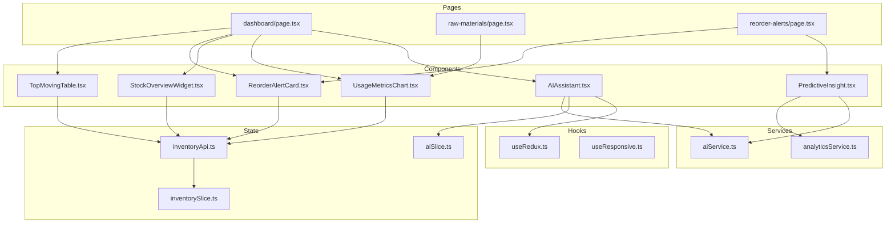
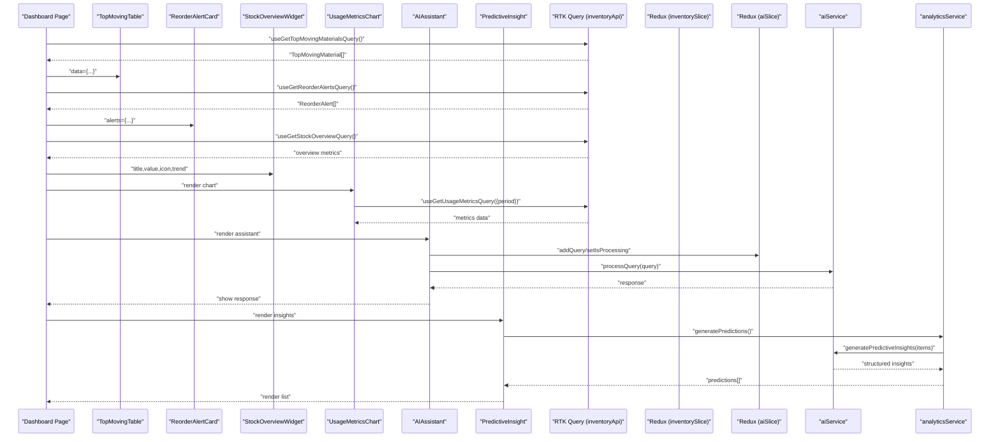
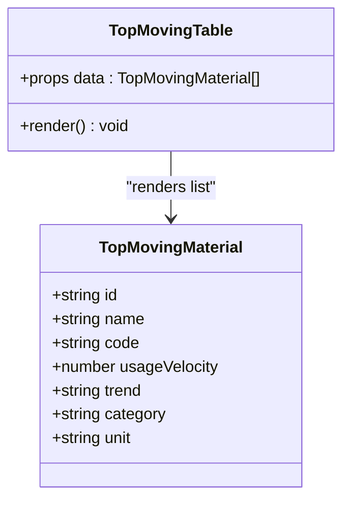
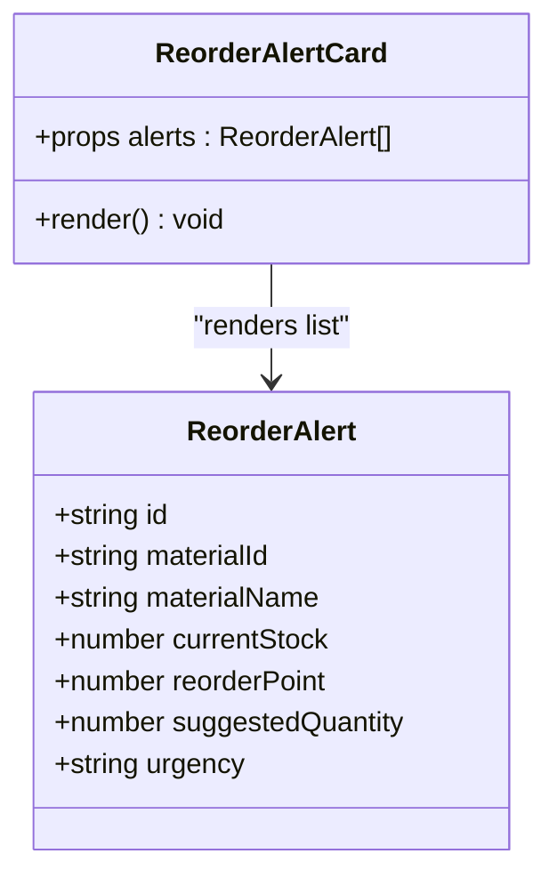
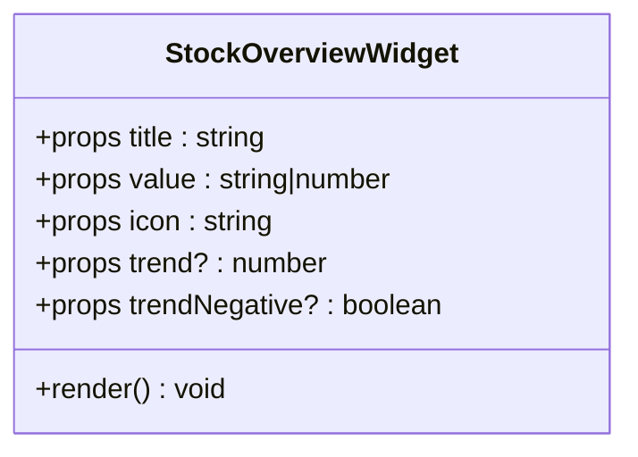
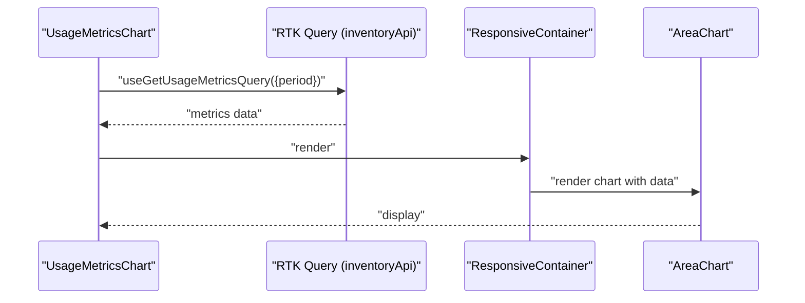
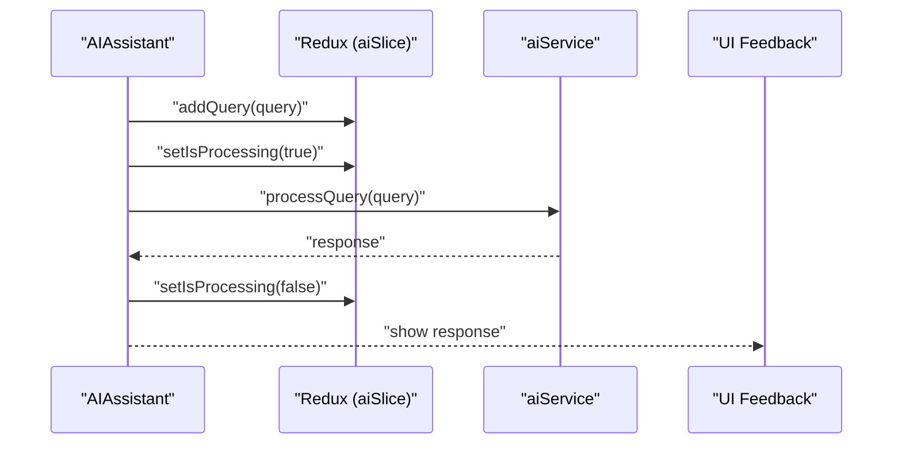
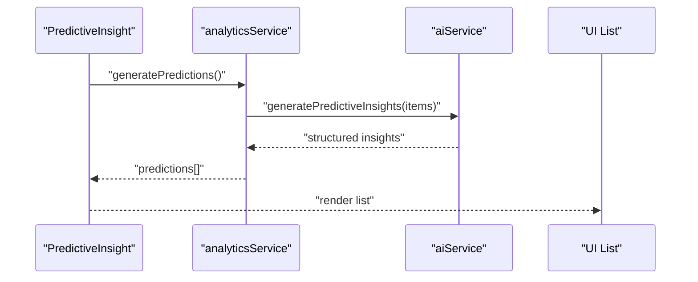
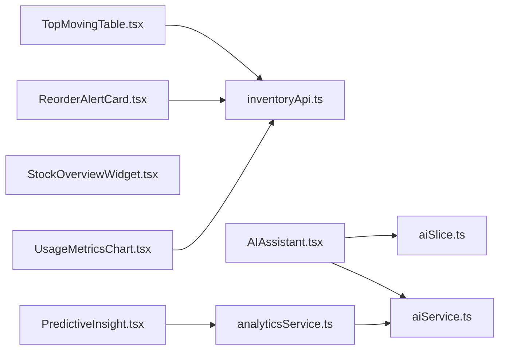

# UI Components

<cite>
**Referenced Files in This Document**
- [TopMovingTable.tsx](file://src/components/inventory/TopMovingTable.tsx)
- [ReorderAlertCard.tsx](file://src/components/inventory/ReorderAlertCard.tsx)
- [StockOverviewWidget.tsx](file://src/components/inventory/StockOverviewWidget.tsx)
- [UsageMetricsChart.tsx](file://src/components/inventory/UsageMetricsChart.tsx)
- [AIAssistant.tsx](file://src/components/ai/AIAssistant.tsx)
- [PredictiveInsight.tsx](file://src/components/ai/PredictiveInsight.tsx)
- [inventoryApi.ts](file://src/store/api/inventoryApi.ts)
- [inventorySlice.ts](file://src/store/slices/inventorySlice.ts)
- [aiSlice.ts](file://src/store/slices/aiSlice.ts)
- [aiService.ts](file://src/services/aiService.ts)
- [analyticsService.ts](file://src/services/analyticsService.ts)
- [useResponsive.ts](file://src/hooks/useResponsive.ts)
- [useRedux.ts](file://src/hooks/useRedux.ts)
- [dashboard/page.tsx](file://src/app/dashboard/page.tsx)
- [raw-materials/page.tsx](file://src/app/raw-materials/page.tsx)
- [reorder-alerts/page.tsx](file://src/app/reorder-alerts/page.tsx)
</cite>

## Table of Contents
1. [Introduction](#introduction)
2. [Project Structure](#project-structure)
3. [Core Components](#core-components)
4. [Architecture Overview](#architecture-overview)
5. [Detailed Component Analysis](#detailed-component-analysis)
6. [Dependency Analysis](#dependency-analysis)
7. [Performance Considerations](#performance-considerations)
8. [Troubleshooting Guide](#troubleshooting-guide)
9. [Conclusion](#conclusion)
10. [Appendices](#appendices)

## Introduction
This document provides comprehensive documentation for the UI component library used in the dashboard-ai project. It focuses on inventory components (TopMovingTable, ReorderAlertCard, StockOverviewWidget, UsageMetricsChart) and AI components (AIAssistant, PredictiveInsight). The guide covers props/attributes, event handlers, customization options, Material-UI integration patterns, responsive design, accessibility, composition guidelines, state management integration, styling customization, usage examples across contexts, performance considerations for large datasets, and best practices for consistent user experience.

## Project Structure
The UI components are organized under src/components, grouped by domain:
- Inventory components: TopMovingTable, ReorderAlertCard, StockOverviewWidget, UsageMetricsChart
- AI components: AIAssistant, PredictiveInsight
- State management: Redux slices and RTK Query APIs
- Services: aiService and analyticsService
- Hooks: useResponsive and typed Redux hooks
- Pages: integration examples in dashboard, raw materials, and reorder alerts pages

**Diagram sources**
- [TopMovingTable.tsx](file://src/components/inventory/TopMovingTable.tsx)
- [ReorderAlertCard.tsx](file://src/components/inventory/ReorderAlertCard.tsx)
- [StockOverviewWidget.tsx](file://src/components/inventory/StockOverviewWidget.tsx)
- [UsageMetricsChart.tsx](file://src/components/inventory/UsageMetricsChart.tsx)
- [AIAssistant.tsx](file://src/components/ai/AIAssistant.tsx)
- [PredictiveInsight.tsx](file://src/components/ai/PredictiveInsight.tsx)
- [inventoryApi.ts](file://src/store/api/inventoryApi.ts)
- [inventorySlice.ts](file://src/store/slices/inventorySlice.ts)
- [aiSlice.ts](file://src/store/slices/aiSlice.ts)
- [aiService.ts](file://src/services/aiService.ts)
- [analyticsService.ts](file://src/services/analyticsService.ts)
- [useRedux.ts](file://src/hooks/useRedux.ts)
- [useResponsive.ts](file://src/hooks/useResponsive.ts)
- [dashboard/page.tsx](file://src/app/dashboard/page.tsx)
- [raw-materials/page.tsx](file://src/app/raw-materials/page.tsx)
- [reorder-alerts/page.tsx](file://src/app/reorder-alerts/page.tsx)

**Section sources**
- [TopMovingTable.tsx](file://src/components/inventory/TopMovingTable.tsx)
- [ReorderAlertCard.tsx](file://src/components/inventory/ReorderAlertCard.tsx)
- [StockOverviewWidget.tsx](file://src/components/inventory/StockOverviewWidget.tsx)
- [UsageMetricsChart.tsx](file://src/components/inventory/UsageMetricsChart.tsx)
- [AIAssistant.tsx](file://src/components/ai/AIAssistant.tsx)
- [PredictiveInsight.tsx](file://src/components/ai/PredictiveInsight.tsx)
- [inventoryApi.ts](file://src/store/api/inventoryApi.ts)
- [inventorySlice.ts](file://src/store/slices/inventorySlice.ts)
- [aiSlice.ts](file://src/store/slices/aiSlice.ts)
- [aiService.ts](file://src/services/aiService.ts)
- [analyticsService.ts](file://src/services/analyticsService.ts)
- [useRedux.ts](file://src/hooks/useRedux.ts)
- [useResponsive.ts](file://src/hooks/useResponsive.ts)
- [dashboard/page.tsx](file://src/app/dashboard/page.tsx)
- [raw-materials/page.tsx](file://src/app/raw-materials/page.tsx)
- [reorder-alerts/page.tsx](file://src/app/reorder-alerts/page.tsx)

## Core Components
This section documents the props, behavior, and customization options for each component.

### TopMovingTable
- Purpose: Render a ranked table of top-performing raw materials by usage velocity, with trend indicators and categorization.
- Props:
  - data: TopMovingMaterial[]
- Behavior:
  - Renders a Material-UI Table with headers for Rank, Material Code, Name, Category, Usage Velocity, Trend, Unit.
  - Uses Chip for rank badges (highlight first three ranks) and category tags.
  - Trend icons reflect up/down/stable; hover highlights rows.
- Accessibility:
  - Table includes aria-label for screen readers.
- Customization:
  - Adjust Chip colors and sizes; customize trend icon mapping; override row hover styles via sx prop.
- Usage example:
  - See [dashboard/page.tsx](file://src/app/dashboard/page.tsx) where data is fetched via RTK Query and passed to TopMovingTable.

**Section sources**
- [TopMovingTable.tsx](file://src/components/inventory/TopMovingTable.tsx)
- [dashboard/page.tsx](file://src/app/dashboard/page.tsx)

### ReorderAlertCard
- Purpose: Display reorder alerts categorized by urgency with suggested order quantities and quick actions.
- Props:
  - alerts: ReorderAlert[]
- Behavior:
  - Renders a Material-UI List of ListItem entries.
  - Urgency determines icon, color, and background; supports critical, warning, info.
  - Shows current stock, reorder point, and suggested quantity per alert.
  - Includes an Order button per alert.
  - Empty state shows a success Alert indicating optimal stock levels.
- Accessibility:
  - Uses semantic typography and icons; ensure sufficient color contrast for urgency cues.
- Customization:
  - Modify urgency config mapping; adjust ListItem styling; add click handlers to Order buttons.
- Usage example:
  - See [dashboard/page.tsx](file://src/app/dashboard/page.tsx) and [reorder-alerts/page.tsx](file://src/app/reorder-alerts/page.tsx).

**Section sources**
- [ReorderAlertCard.tsx](file://src/components/inventory/ReorderAlertCard.tsx)
- [dashboard/page.tsx](file://src/app/dashboard/page.tsx)
- [reorder-alerts/page.tsx](file://src/app/reorder-alerts/page.tsx)

### StockOverviewWidget
- Purpose: Present KPI-style metrics with optional trend indicator and iconography.
- Props:
  - title: string
  - value: string | number
  - icon: string (emoji or icon element)
  - trend?: number (optional percentage change)
  - trendNegative?: boolean (optional; flips positive/negative color logic)
- Behavior:
  - Displays icon, value, title, and optional trend arrow with color-coded percentage.
  - Card layout ensures consistent sizing and alignment.
- Accessibility:
  - Ensure readable font weights and contrast for trend color coding.
- Customization:
  - Override Card and Typography styles; adjust trend color logic via trendNegative.
- Usage example:
  - See [dashboard/page.tsx](file://src/app/dashboard/page.tsx) where multiple widgets are rendered with different metrics.

**Section sources**
- [StockOverviewWidget.tsx](file://src/components/inventory/StockOverviewWidget.tsx)
- [dashboard/page.tsx](file://src/app/dashboard/page.tsx)

### UsageMetricsChart
- Purpose: Visualize usage metrics and forecast with interactive controls and summary cards.
- Props: none (fetches own data via RTK Query)
- Behavior:
  - Period selector toggles between weekly and monthly views.
  - Renders a responsive AreaChart with consumption and forecast series.
  - Displays average daily usage, peak usage, and forecast accuracy.
  - Loading and error states handled with Material-UI components.
- Accessibility:
  - Tooltip and legend present; ensure keyboard navigation for Select.
- Customization:
  - Adjust gradients, axes labels, and summary card layout; modify period mapping.
- Usage example:
  - See [dashboard/page.tsx](file://src/app/dashboard/page.tsx) and [raw-materials/page.tsx](file://src/app/raw-materials/page.tsx).

**Section sources**
- [UsageMetricsChart.tsx](file://src/components/inventory/UsageMetricsChart.tsx)
- [dashboard/page.tsx](file://src/app/dashboard/page.tsx)
- [raw-materials/page.tsx](file://src/app/raw-materials/page.tsx)

### AIAssistant
- Purpose: Enable natural language interaction to query inventory insights and receive AI-generated responses.
- Props: none
- Behavior:
  - Text field with send/clear actions; Enter key submission support.
  - Dispatches Redux actions to track query history and processing state.
  - Calls aiService to process the query; displays response or error message.
  - Loading state shown during processing.
- Accessibility:
  - Proper labeling of TextField and buttons; ensure focus management after submit.
- Customization:
  - Extend input adornments; integrate with broader AI insights pipeline.
- Usage example:
  - See [dashboard/page.tsx](file://src/app/dashboard/page.tsx).

**Section sources**
- [AIAssistant.tsx](file://src/components/ai/AIAssistant.tsx)
- [dashboard/page.tsx](file://src/app/dashboard/page.tsx)

### PredictiveInsight
- Purpose: Present AI-powered predictive insights with risk levels, confidence, and recommended actions.
- Props: none
- Behavior:
  - Loads predictions on mount using analyticsService; falls back to mock data if needed.
  - Renders a Material-UI List with risk indicators and chips.
  - Provides explanatory note about ML-driven insights.
- Accessibility:
  - Ensure readable typography and accessible list semantics.
- Customization:
  - Adjust risk-to-color mapping; extend insight rendering with additional metadata.
- Usage example:
  - See [reorder-alerts/page.tsx](file://src/app/reorder-alerts/page.tsx).

**Section sources**
- [PredictiveInsight.tsx](file://src/components/ai/PredictiveInsight.tsx)
- [reorder-alerts/page.tsx](file://src/app/reorder-alerts/page.tsx)

## Architecture Overview
The components integrate Material-UI for UI primitives, RTK Query for data fetching, Redux for state, and service layers for AI/analytics orchestration.

**Diagram sources**
- [dashboard/page.tsx](file://src/app/dashboard/page.tsx)
- [TopMovingTable.tsx](file://src/components/inventory/TopMovingTable.tsx)
- [ReorderAlertCard.tsx](file://src/components/inventory/ReorderAlertCard.tsx)
- [StockOverviewWidget.tsx](file://src/components/inventory/StockOverviewWidget.tsx)
- [UsageMetricsChart.tsx](file://src/components/inventory/UsageMetricsChart.tsx)
- [AIAssistant.tsx](file://src/components/ai/AIAssistant.tsx)
- [PredictiveInsight.tsx](file://src/components/ai/PredictiveInsight.tsx)
- [inventoryApi.ts](file://src/store/api/inventoryApi.ts)
- [inventorySlice.ts](file://src/store/slices/inventorySlice.ts)
- [aiSlice.ts](file://src/store/slices/aiSlice.ts)
- [aiService.ts](file://src/services/aiService.ts)
- [analyticsService.ts](file://src/services/analyticsService.ts)

## Detailed Component Analysis

### TopMovingTable Analysis
- Data model: TopMovingMaterial includes id, name, code, usageVelocity, trend, category, unit.
- Rendering logic:
  - Rank badges use Chip with primary color for top 3.
  - Category displayed as outlined Chip.
  - Trend icons mapped by trend value; hover effect applied to rows.
- Accessibility and UX:
  - Hover background improves readability.
  - aria-label on table aids assistive technologies.

**Diagram sources**
- [TopMovingTable.tsx](file://src/components/inventory/TopMovingTable.tsx)
- [inventoryApi.ts](file://src/store/api/inventoryApi.ts)

**Section sources**
- [TopMovingTable.tsx](file://src/components/inventory/TopMovingTable.tsx)
- [inventoryApi.ts](file://src/store/api/inventoryApi.ts)

### ReorderAlertCard Analysis
- Data model: ReorderAlert includes id, materialId, materialName, currentStock, reorderPoint, suggestedQuantity, urgency.
- Rendering logic:
  - Urgency mapped to icon, color, and background.
  - Secondary text shows current vs reorder point and suggested quantity.
  - Divider separates alerts; empty state success Alert indicates optimal stock.

**Diagram sources**
- [ReorderAlertCard.tsx](file://src/components/inventory/ReorderAlertCard.tsx)
- [inventoryApi.ts](file://src/store/api/inventoryApi.ts)

**Section sources**
- [ReorderAlertCard.tsx](file://src/components/inventory/ReorderAlertCard.tsx)
- [inventoryApi.ts](file://src/store/api/inventoryApi.ts)

### StockOverviewWidget Analysis
- Props: title, value, icon, trend, trendNegative.
- Rendering logic:
  - Icon area, value, and title arranged; optional trend arrow with color-coded percentage.
  - trendNegative flips color logic for negative/positive interpretation.

**Diagram sources**
- [StockOverviewWidget.tsx](file://src/components/inventory/StockOverviewWidget.tsx)

**Section sources**
- [StockOverviewWidget.tsx](file://src/components/inventory/StockOverviewWidget.tsx)

### UsageMetricsChart Analysis
- Data fetching: useGetUsageMetricsQuery with period parameter.
- Rendering logic:
  - Period toggle switches between weekly and monthly datasets.
  - AreaChart with gradients and dashed forecast line.
  - Summary cards show average daily usage, peak usage, and forecast accuracy.
- Error and loading states: CircularProgress and Alert components.

**Diagram sources**
- [UsageMetricsChart.tsx](file://src/components/inventory/UsageMetricsChart.tsx)
- [inventoryApi.ts](file://src/store/api/inventoryApi.ts)

**Section sources**
- [UsageMetricsChart.tsx](file://src/components/inventory/UsageMetricsChart.tsx)
- [inventoryApi.ts](file://src/store/api/inventoryApi.ts)

### AIAssistant Analysis
- State management: uses aiSlice for query history and processing state.
- Service integration: aiService.processQuery handles natural language queries.
- Interaction flow:
  - On submit, dispatch addQuery and setIsProcessing.
  - Call aiService; update response or error; reset processing flag.

**Diagram sources**
- [AIAssistant.tsx](file://src/components/ai/AIAssistant.tsx)
- [aiSlice.ts](file://src/store/slices/aiSlice.ts)
- [aiService.ts](file://src/services/aiService.ts)

**Section sources**
- [AIAssistant.tsx](file://src/components/ai/AIAssistant.tsx)
- [aiSlice.ts](file://src/store/slices/aiSlice.ts)
- [aiService.ts](file://src/services/aiService.ts)

### PredictiveInsight Analysis
- Data fetching: analyticsService.generatePredictions orchestrates n8n data and AI insights.
- Rendering logic:
  - Risk indicators and chips; confidence and recommended action display.
  - Fallback to mock predictions if service fails.

**Diagram sources**
- [PredictiveInsight.tsx](file://src/components/ai/PredictiveInsight.tsx)
- [analyticsService.ts](file://src/services/analyticsService.ts)
- [aiService.ts](file://src/services/aiService.ts)

**Section sources**
- [PredictiveInsight.tsx](file://src/components/ai/PredictiveInsight.tsx)
- [analyticsService.ts](file://src/services/analyticsService.ts)
- [aiService.ts](file://src/services/aiService.ts)

## Dependency Analysis
- Component-to-state:
  - Inventory components depend on inventoryApi endpoints and inventorySlice reducers.
  - AI components depend on aiSlice and service layers.
- Component-to-service:
  - AIAssistant uses aiService; PredictiveInsight uses analyticsService.
- Component-to-Material-UI:
  - Components extensively use MUI primitives (Table, Card, List, Chip, Button, etc.) and Recharts for charts.

**Diagram sources**
- [TopMovingTable.tsx](file://src/components/inventory/TopMovingTable.tsx)
- [ReorderAlertCard.tsx](file://src/components/inventory/ReorderAlertCard.tsx)
- [StockOverviewWidget.tsx](file://src/components/inventory/StockOverviewWidget.tsx)
- [UsageMetricsChart.tsx](file://src/components/inventory/UsageMetricsChart.tsx)
- [AIAssistant.tsx](file://src/components/ai/AIAssistant.tsx)
- [PredictiveInsight.tsx](file://src/components/ai/PredictiveInsight.tsx)
- [inventoryApi.ts](file://src/store/api/inventoryApi.ts)
- [inventorySlice.ts](file://src/store/slices/inventorySlice.ts)
- [aiSlice.ts](file://src/store/slices/aiSlice.ts)
- [aiService.ts](file://src/services/aiService.ts)
- [analyticsService.ts](file://src/services/analyticsService.ts)

**Section sources**
- [inventoryApi.ts](file://src/store/api/inventoryApi.ts)
- [inventorySlice.ts](file://src/store/slices/inventorySlice.ts)
- [aiSlice.ts](file://src/store/slices/aiSlice.ts)
- [aiService.ts](file://src/services/aiService.ts)
- [analyticsService.ts](file://src/services/analyticsService.ts)

## Performance Considerations
- Data fetching:
  - RTK Query caches endpoints for a defined duration; leverage keepUnusedDataFor to balance freshness and performance.
  - Prefer pagination or virtualization for large lists (not currently implemented).
- Charts:
  - Recharts renders efficiently; avoid unnecessary re-renders by passing stable data references.
- AI interactions:
  - Debounce or throttle queries; batch updates to Redux to minimize re-renders.
- Rendering:
  - Memoize derived values; use shallow comparisons for props to prevent re-renders.
- Large datasets:
  - Consider server-side filtering and aggregation; lazy-load non-critical sections.

[No sources needed since this section provides general guidance]

## Troubleshooting Guide
- Loading states:
  - Components render CircularProgress while data is loading; ensure proper error boundaries around charts and lists.
- Error states:
  - Components display Alert with severity for errors; verify network connectivity and endpoint availability.
- AI assistant:
  - If responses fail, confirm AI service endpoint, API key, and model configuration; check Redux processing state.
- Predictive insights:
  - If analytics service fails, fallback to mock predictions; verify n8n webhook data availability.

**Section sources**
- [UsageMetricsChart.tsx](file://src/components/inventory/UsageMetricsChart.tsx)
- [AIAssistant.tsx](file://src/components/ai/AIAssistant.tsx)
- [PredictiveInsight.tsx](file://src/components/ai/PredictiveInsight.tsx)
- [analyticsService.ts](file://src/services/analyticsService.ts)

## Conclusion
The UI component library integrates Material-UI, RTK Query, and Redux to deliver a cohesive dashboard experience. Inventory components provide actionable insights through tables, alerts, widgets, and charts, while AI components enable natural language interaction and predictive insights. Following the composition, state management, and customization guidelines ensures consistent UX and maintainable code across contexts.

[No sources needed since this section summarizes without analyzing specific files]

## Appendices

### Props Reference Summary
- TopMovingTable
  - data: TopMovingMaterial[]
- ReorderAlertCard
  - alerts: ReorderAlert[]
- StockOverviewWidget
  - title: string
  - value: string | number
  - icon: string
  - trend?: number
  - trendNegative?: boolean
- UsageMetricsChart
  - none (fetches internally)
- AIAssistant
  - none
- PredictiveInsight
  - none

**Section sources**
- [TopMovingTable.tsx](file://src/components/inventory/TopMovingTable.tsx)
- [ReorderAlertCard.tsx](file://src/components/inventory/ReorderAlertCard.tsx)
- [StockOverviewWidget.tsx](file://src/components/inventory/StockOverviewWidget.tsx)
- [UsageMetricsChart.tsx](file://src/components/inventory/UsageMetricsChart.tsx)
- [AIAssistant.tsx](file://src/components/ai/AIAssistant.tsx)
- [PredictiveInsight.tsx](file://src/components/ai/PredictiveInsight.tsx)

### Integration Examples
- Dashboard page composes multiple components and manages loading/error states.
- Raw materials page focuses on usage metrics chart.
- Reorder alerts page pairs alerts with predictive insights.

**Section sources**
- [dashboard/page.tsx](file://src/app/dashboard/page.tsx)
- [raw-materials/page.tsx](file://src/app/raw-materials/page.tsx)
- [reorder-alerts/page.tsx](file://src/app/reorder-alerts/page.tsx)

### Responsive Design and Accessibility
- Responsive utilities:
  - useResponsive hook provides breakpoint flags and helpers for adaptive layouts.
- Accessibility:
  - Components use semantic MUI primitives, aria labels, and clear color semantics for trends and urgency.

**Section sources**
- [useResponsive.ts](file://src/hooks/useResponsive.ts)
- [TopMovingTable.tsx](file://src/components/inventory/TopMovingTable.tsx)
- [ReorderAlertCard.tsx](file://src/components/inventory/ReorderAlertCard.tsx)
- [UsageMetricsChart.tsx](file://src/components/inventory/UsageMetricsChart.tsx)

### State Management Integration
- Redux hooks:
  - useAppDispatch and useAppSelector provide strongly-typed access to the store.
- AI slice:
  - Manages query history, processing state, and insights.
- Inventory slice:
  - Holds arrays and loading/error flags for inventory data.

**Section sources**
- [useRedux.ts](file://src/hooks/useRedux.ts)
- [aiSlice.ts](file://src/store/slices/aiSlice.ts)
- [inventorySlice.ts](file://src/store/slices/inventorySlice.ts)