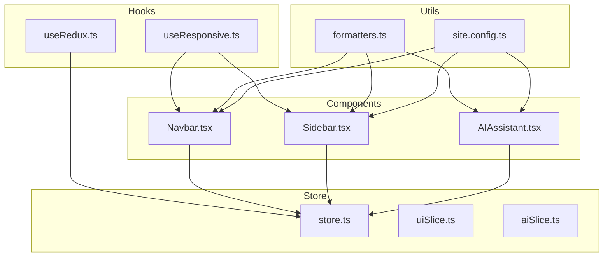
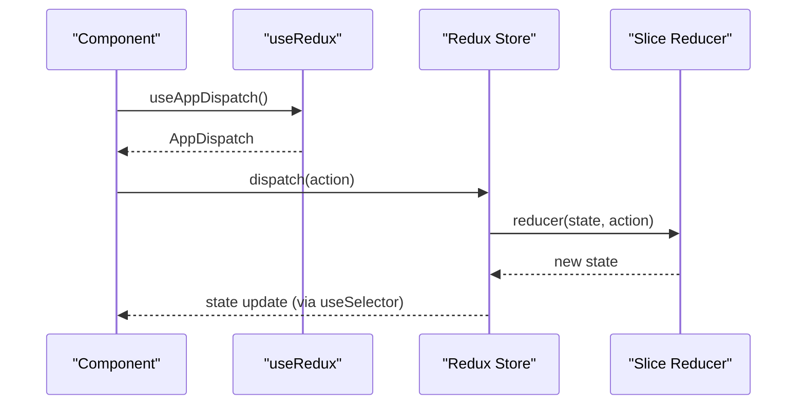
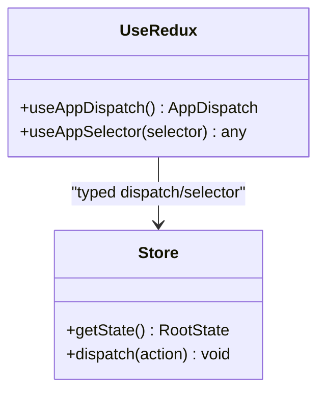
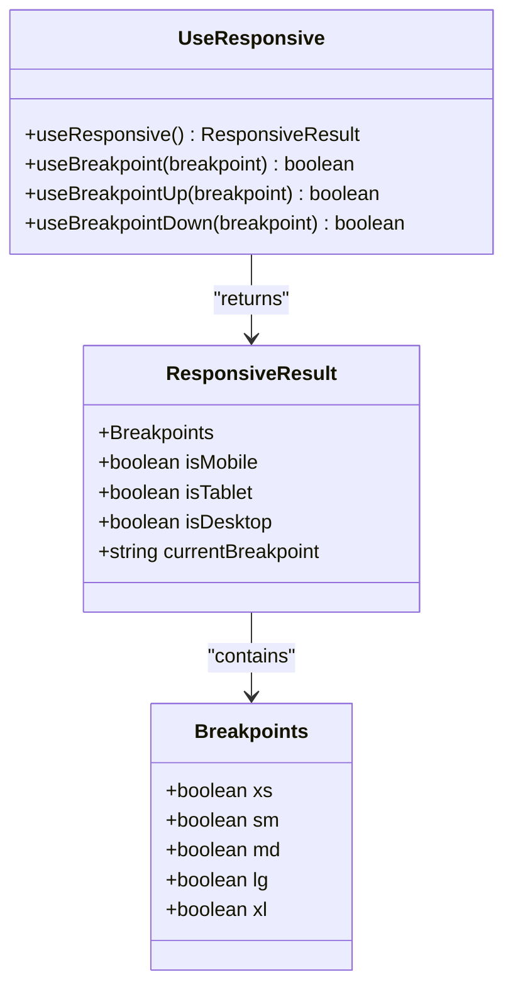
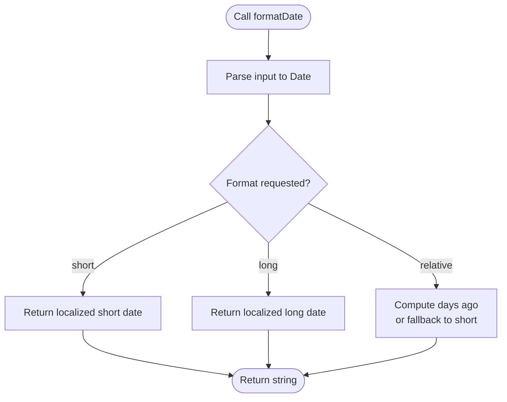
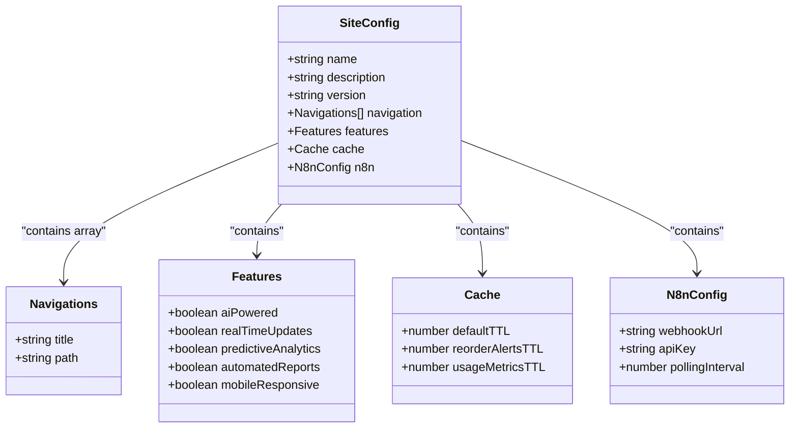
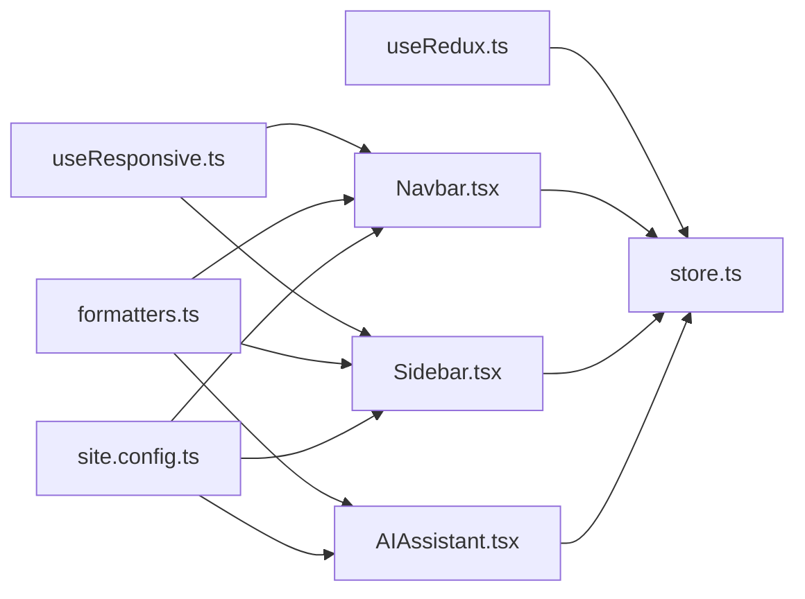

# Utilities and Helpers

<cite>
**Referenced Files in This Document**
- [useRedux.ts](file://src/hooks/useRedux.ts)
- [useResponsive.ts](file://src/hooks/useResponsive.ts)
- [formatters.ts](file://src/utils/formatters.ts)
- [site.config.ts](file://src/config/site.config.ts)
- [store.ts](file://src/store/store.ts)
- [uiSlice.ts](file://src/store/slices/uiSlice.ts)
- [aiSlice.ts](file://src/store/slices/aiSlice.ts)
- [Navbar.tsx](file://src/components/ui/Navbar.tsx)
- [Sidebar.tsx](file://src/components/ui/Layout/Sidebar.tsx)
- [AIAssistant.tsx](file://src/components/ai/AIAssistant.tsx)
</cite>

## Update Summary
**Changes Made**
- Added documentation for site configuration utilities and branding
- Enhanced formatters documentation with comprehensive examples
- Updated responsive hooks documentation with new breakpoint utilities
- Expanded integration examples showing real-world usage patterns

## Table of Contents
1. [Introduction](#introduction)
2. [Project Structure](#project-structure)
3. [Core Components](#core-components)
4. [Architecture Overview](#architecture-overview)
5. [Detailed Component Analysis](#detailed-component-analysis)
6. [Dependency Analysis](#dependency-analysis)
7. [Performance Considerations](#performance-considerations)
8. [Troubleshooting Guide](#troubleshooting-guide)
9. [Conclusion](#conclusion)
10. [Appendices](#appendices)

## Introduction
This document focuses on the utility functions and helper hooks that support the dashboard-ai project's UI and data presentation needs. It covers:
- Custom React hooks for Redux integration and responsive design
- A centralized formatter library for numbers, currency, dates, percentages, quantities, and analytics helpers
- Site configuration utilities for branding and application metadata
- Practical usage examples, parameter specifications, return value documentation, and extension guidelines
- Best practices for utility design, performance, and testing strategies

## Project Structure
The utilities and helpers are organized under dedicated folders:
- Hooks: src/hooks/useRedux.ts, src/hooks/useResponsive.ts
- Formatters: src/utils/formatters.ts
- Site Configuration: src/config/site.config.ts
- Store configuration and slices: src/store/store.ts, src/store/slices/*.ts
- Example components using these utilities: src/components/ui/Navbar.tsx, src/components/ui/Layout/Sidebar.tsx, src/components/ai/AIAssistant.tsx

**Diagram sources**
- [useRedux.ts:1-6](file://src/hooks/useRedux.ts#L1-L6)
- [useResponsive.ts:1-67](file://src/hooks/useResponsive.ts#L1-L67)
- [formatters.ts:1-89](file://src/utils/formatters.ts#L1-L89)
- [site.config.ts:1-34](file://src/config/site.config.ts#L1-L34)
- [store.ts:1-27](file://src/store/store.ts#L1-L27)
- [uiSlice.ts:1-42](file://src/store/slices/uiSlice.ts#L1-L42)
- [aiSlice.ts:1-56](file://src/store/slices/aiSlice.ts#L1-L56)
- [Navbar.tsx:1-61](file://src/components/ui/Navbar.tsx#L1-L61)
- [Sidebar.tsx:1-133](file://src/components/ui/Layout/Sidebar.tsx#L1-L133)
- [AIAssistant.tsx:1-120](file://src/components/ai/AIAssistant.tsx#L1-L120)

**Section sources**
- [useRedux.ts:1-6](file://src/hooks/useRedux.ts#L1-L6)
- [useResponsive.ts:1-67](file://src/hooks/useResponsive.ts#L1-L67)
- [formatters.ts:1-89](file://src/utils/formatters.ts#L1-L89)
- [site.config.ts:1-34](file://src/config/site.config.ts#L1-L34)
- [store.ts:1-27](file://src/store/store.ts#L1-L27)

## Core Components
This section documents the custom hooks, formatter utilities, and site configuration, including their purpose, parameters, return values, and usage patterns.

### useRedux: Simplified Redux Integration
Purpose:
- Provide strongly typed dispatch and selector hooks to reduce boilerplate and improve type safety across components.

Key exports:
- useAppDispatch: Returns a typed dispatch function bound to the store's AppDispatch type.
- useAppSelector: Returns a typed useSelector hook bound to RootState.

Usage pattern:
- Import useAppDispatch in components that need to dispatch actions.
- Import useAppSelector to select parts of the Redux state with full TypeScript support.

Return values:
- useAppDispatch returns a function compatible with AppDispatch.
- useAppSelector returns the selected state slice with proper typing.

Integration examples:
- Navbar dispatches a UI action to toggle the sidebar.
- Sidebar dispatches navigation-related actions and reads UI state.
- AIAssistant dispatches AI-related actions and reads AI state.

**Section sources**
- [useRedux.ts:1-6](file://src/hooks/useRedux.ts#L1-L6)
- [store.ts:18-27](file://src/store/store.ts#L18-L27)
- [Navbar.tsx:17-21](file://src/components/ui/Navbar.tsx#L17-L21)
- [Sidebar.tsx:34-48](file://src/components/ui/Layout/Sidebar.tsx#L34-L48)
- [AIAssistant.tsx:23-46](file://src/components/ai/AIAssistant.tsx#L23-L46)

### useResponsive: Responsive Design Breakpoints
Purpose:
- Provide a convenient way to detect current breakpoint and device category in Material UI-based layouts.

Exports:
- useResponsive(): Returns an object with:
  - Breakpoint flags: xs, sm, md, lg, xl
  - Device categories: isMobile, isTablet, isDesktop
  - currentBreakpoint: the currently active breakpoint key
- useBreakpoint(breakpoint): Returns a boolean indicating if the viewport matches the given breakpoint.
- useBreakpointUp(breakpoint): Returns a boolean indicating if the viewport is at or above the given breakpoint.
- useBreakpointDown(breakpoint): Returns a boolean indicating if the viewport is at or below the given breakpoint.

Usage pattern:
- Use useResponsive() to conditionally render layout elements or adjust component behavior based on screen size.
- Use useBreakpoint* helpers for fine-grained media queries.

Return values:
- Boolean flags for breakpoints and device categories.
- String for currentBreakpoint.

Integration examples:
- Sidebar uses useMediaQuery via MUI theme to decide temporary vs permanent drawer behavior.
- Navbar reads UI state to manage responsive layout logic.

**Section sources**
- [useResponsive.ts:1-67](file://src/hooks/useResponsive.ts#L1-L67)
- [Sidebar.tsx:39-48](file://src/components/ui/Layout/Sidebar.tsx#L39-L48)

### formatters: Data Formatting Utilities
Purpose:
- Centralized formatting functions for numbers, currency, dates, percentages, quantities, and analytics helpers.

Exports and behavior:
- formatNumber(num: number): Formats large numbers with thousand separators using locale-aware formatting.
- formatCurrency(amount: number, currency?: string): Formats amounts as localized currency with zero decimals by default.
- formatDate(date: Date | string, format?: 'short' | 'long' | 'relative'): Formats dates in short, long, or relative forms.
- formatPercentage(value: number, decimals?: number): Formats numeric values as percentages with configurable decimals.
- formatQuantity(quantity: number, unit: string): Formats large quantities with K/M suffixes and preserves unit label.
- getTrendDirection(current: number, previous: number): Computes trend direction as 'up', 'down', or 'stable'.
- calculateChange(current: number, previous: number): Computes percentage change with two decimals and handles zero-division.

Return values:
- Strings for formatted output.
- 'up' | 'down' | 'stable' for trend direction.
- Numbers for percentage change.

Integration examples:
- Components can use these functions to present clean, localized data to users.

**Section sources**
- [formatters.ts:1-89](file://src/utils/formatters.ts#L1-L89)

### siteConfig: Application Branding Configuration
Purpose:
- Centralized configuration for application branding, navigation, features, caching, and external integrations.

Exports and structure:
- name: Application name for branding and SEO
- description: Application description for metadata
- version: Current application version
- navigation: Array of navigation items with title and path
- features: Feature flags for AI capabilities and platform features
- cache: TTL settings for different data types
- n8n: Integration configuration for workflow automation

Usage pattern:
- Import siteConfig in components that need branding or feature flags.
- Use navigation array to generate dynamic menus.
- Access feature flags to conditionally render features.

Return values:
- Object containing all configuration properties.

Integration examples:
- Navbar displays application name from siteConfig.
- Navigation components use siteConfig.navigation for menu generation.

**Section sources**
- [siteConfig.ts:1-34](file://src/config/site.config.ts#L1-L34)
- [Navbar.tsx:42-44](file://src/components/ui/Navbar.tsx#L42-L44)

## Architecture Overview
The utilities integrate with the component layer and Redux store as follows:
- Components import useRedux to dispatch actions and select state.
- Components import useResponsive to adapt UI to breakpoints.
- Components import formatters to present data consistently and localized.
- Components import siteConfig for branding and feature management.

**Diagram sources**
- [useRedux.ts:1-6](file://src/hooks/useRedux.ts#L1-L6)
- [store.ts:1-27](file://src/store/store.ts#L1-L27)
- [uiSlice.ts:1-42](file://src/store/slices/uiSlice.ts#L1-L42)
- [aiSlice.ts:1-56](file://src/store/slices/aiSlice.ts#L1-L56)

## Detailed Component Analysis

### useRedux Hook Analysis
Object model:

**Diagram sources**
- [useRedux.ts:1-6](file://src/hooks/useRedux.ts#L1-L6)
- [store.ts:18-27](file://src/store/store.ts#L18-L27)

Practical usage:
- Dispatch UI actions (toggle sidebar, set active view) in Navbar and Sidebar.
- Dispatch AI actions (add query, set processing) in AIAssistant.
- Select state slices for rendering and conditional logic.

**Section sources**
- [useRedux.ts:1-6](file://src/hooks/useRedux.ts#L1-L6)
- [store.ts:18-27](file://src/store/store.ts#L18-L27)
- [Navbar.tsx:17-21](file://src/components/ui/Navbar.tsx#L17-L21)
- [Sidebar.tsx:34-48](file://src/components/ui/Layout/Sidebar.tsx#L34-L48)
- [AIAssistant.tsx:23-46](file://src/components/ai/AIAssistant.tsx#L23-L46)

### useResponsive Hook Analysis
Object model:

**Diagram sources**
- [useResponsive.ts:3-42](file://src/hooks/useResponsive.ts#L3-L42)

Usage patterns:
- Conditional rendering of drawers and layout adjustments based on device category.
- Fine-grained media queries for specific breakpoints.

**Section sources**
- [useResponsive.ts:14-42](file://src/hooks/useResponsive.ts#L14-L42)
- [Sidebar.tsx:39-48](file://src/components/ui/Layout/Sidebar.tsx#L39-L48)

### formatters Utility Analysis
Flowchart for formatDate:

**Diagram sources**
- [formatters.ts:23-50](file://src/utils/formatters.ts#L23-L50)

Usage patterns:
- Present readable numbers, currency, dates, and percentages across components.
- Use formatQuantity for scalable units and getTrendDirection/calculateChange for analytics.

**Section sources**
- [formatters.ts:1-89](file://src/utils/formatters.ts#L1-L89)

### siteConfig Utility Analysis
Object model:

**Diagram sources**
- [siteConfig.ts:1-34](file://src/config/site.config.ts#L1-L34)

Usage patterns:
- Centralized branding and navigation management.
- Feature flag management for conditional rendering.
- Configuration-driven caching and integration settings.

**Section sources**
- [siteConfig.ts:1-34](file://src/config/site.config.ts#L1-L34)

## Dependency Analysis
- useRedux depends on the store configuration and types to provide typed hooks.
- useResponsive depends on Material UI theme and media queries.
- Components depend on these utilities for consistent behavior and presentation.
- Store slices encapsulate state transitions used by components.
- siteConfig provides centralized configuration for branding and features.

**Diagram sources**
- [useRedux.ts:1-6](file://src/hooks/useRedux.ts#L1-L6)
- [useResponsive.ts:1-67](file://src/hooks/useResponsive.ts#L1-L67)
- [formatters.ts:1-89](file://src/utils/formatters.ts#L1-L89)
- [site.config.ts:1-34](file://src/config/site.config.ts#L1-L34)
- [store.ts:1-27](file://src/store/store.ts#L1-L27)
- [Navbar.tsx:1-61](file://src/components/ui/Navbar.tsx#L1-L61)
- [Sidebar.tsx:1-133](file://src/components/ui/Layout/Sidebar.tsx#L1-L133)
- [AIAssistant.tsx:1-120](file://src/components/ai/AIAssistant.tsx#L1-L120)

**Section sources**
- [store.ts:1-27](file://src/store/store.ts#L1-L27)
- [uiSlice.ts:1-42](file://src/store/slices/uiSlice.ts#L1-L42)
- [aiSlice.ts:1-56](file://src/store/slices/aiSlice.ts#L1-L56)

## Performance Considerations
- Memoization:
  - Wrap heavy computations inside useMemo/useCallback when used in frequently rendered lists or high-frequency events.
  - Cache formatted strings if identical inputs are reused often.
- Debouncing:
  - Debounce user input handlers that trigger formatting to avoid excessive re-renders.
- Avoid unnecessary re-creations:
  - Keep formatter instances stable across renders when possible.
- Breakpoint detection:
  - Prefer useResponsive for coarse-grained logic; use useBreakpoint* for specific checks only when needed.
- Redux selectors:
  - Use shallow equality checks and memoized selectors to prevent unnecessary re-renders.
- Configuration caching:
  - Site configuration objects are immutable and can be safely shared across components without performance penalty.

## Troubleshooting Guide
Common issues and resolutions:
- Type errors with useAppDispatch/useAppSelector:
  - Ensure RootState and AppDispatch are correctly exported from the store and imported in hooks.
- Breakpoint mismatches:
  - Verify MUI theme breakpoints align with expectations; test with useBreakpoint helpers for specific cases.
- Currency formatting anomalies:
  - Confirm currency codes and locales match target markets; validate minimum/maximum fraction digits.
- Percentage change edge cases:
  - Division-by-zero handling is included; ensure callers account for zero previous values.
- Date parsing:
  - Accepts Date or string; ensure input strings are valid ISO dates or parseable formats.
- Site configuration access:
  - Ensure environment variables are properly loaded for n8n integration settings.
- Navigation issues:
  - Verify navigation paths match actual Next.js routes and file structure.

**Section sources**
- [useRedux.ts:1-6](file://src/hooks/useRedux.ts#L1-L6)
- [useResponsive.ts:1-67](file://src/hooks/useResponsive.ts#L1-L67)
- [formatters.ts:11-18](file://src/utils/formatters.ts#L11-L18)
- [formatters.ts:85-88](file://src/utils/formatters.ts#L85-L88)
- [site.config.ts:28-32](file://src/config/site.config.ts#L28-L32)

## Conclusion
The dashboard-ai project leverages focused utilities to streamline Redux integration, responsive behavior, data formatting, and application configuration. By centralizing these concerns:
- Components remain concise and type-safe
- UI adapts predictably across devices
- Data presentation remains consistent and localized
- Branding and configuration are managed centrally
- Features can be easily toggled and extended

Extending these utilities should follow established patterns: strong typing, clear return contracts, robust edge-case handling, and centralized configuration management.

## Appendices

### Practical Examples and Extension Guidelines
- Extending formatters:
  - Add a new function with a clear name and single responsibility.
  - Define strict parameter types and return types.
  - Include tests for edge cases (zero, negative values, invalid inputs).
  - Example extension: a function to format bytes with units (B, KB, MB, GB).
- Integrating with components:
  - Import the formatter in the component file.
  - Apply formatting in render logic or derived values.
  - Use memoization for expensive formatting operations.
- Site configuration extensions:
  - Add new feature flags to control component visibility.
  - Extend navigation arrays for additional menu items.
  - Configure caching TTL values based on data volatility.
  - Add new integration settings for external services.
- Testing strategies:
  - Unit tests for pure functions (formatters) covering normal, edge, and error cases.
  - Snapshot tests for UI components that render formatted values.
  - Integration tests for hooks to verify correct store updates and state selection.
  - Configuration validation tests for site settings and environment variables.

### Advanced Usage Patterns
- Dynamic branding integration:
  - Use siteConfig.name for application title and meta tags.
  - Implement conditional rendering based on feature flags.
  - Centralize cache configuration for API responses.
- Responsive design patterns:
  - Combine useResponsive with Material UI components for adaptive layouts.
  - Use breakpoint-specific styling and component arrangements.
  - Implement progressive disclosure based on screen size.
- Data presentation patterns:
  - Chain formatters for complex data transformations.
  - Use memoization for expensive formatting operations.
  - Implement fallback formatting for invalid data states.